# Codebase Analysis: physics_canon_v2
Root: /workspace/dropped/physics_canon_v2

Total files: 57

## Directory Structure
```
physics_canon_v2/
  00_overview.md (12KB)
  architecture/
    agentic_framework.md (17KB)
    component_overview.md (22KB)
    deterministic_physics_isolation.md (20KB)
    dual_engine_model.md (10KB)
    entity_canon.md (27KB)
    final_architecture.md (63KB)
    index.md (6KB)
    README.md (8KB)
    unified_reconciliation_engine.md (27KB)
    zeitgeist_feature_flag.md (9KB)
  catalog-info.yaml (2KB)
  foundation/
    architectural_principles.md (14KB)
    conceptual_foundation.md (15KB)
    glossary.md (10KB)
  GOLDEN_SET_CONSISTENCY_RESOLUTION.md (29KB)
  integration/
    agent_in_the_loop_architecture.md (19KB)
    cognitive_analysis_engine.md (97KB)
    cognitive_analysis_overview.md (13KB)
    cognitive_theory_foundation.md (12KB)
    database_data_management.md (45KB)
    implementation_validation.md (31KB)
    index.md (10KB)
    knowledge_augmented_rag.md (35KB)
    memory_manifold_integration.md (44KB)
    temporal_resonance_physics.md (31KB)
  interfaces/
    cognitive_management_ui.md (11KB)
    frontend_api_specification.md (21KB)
  operations/
    data_integrity_patterns.md (19KB)
    deployment_infrastructure.md (20KB)
    developer_onboarding.md (11KB)
    entropy_management.md (404 bytes)
    gdpr_erasure_compliance.md (7KB)
    index.md (17KB)
    latency_design_patterns.md (19KB)
    monitoring_observability.md (38KB)
    orchestration_with_windmill.md (38KB)
    performance_optimization.md (30KB)
    safety_security.md (33KB)
  physics/
    cognitive_spacetime.md (17KB)
    dynamic_component_patterns.md (24KB)
    engine_laws_and_constants.md (40KB)
    engine_library_integration.md (22KB)
    entropy_management.md (24KB)
    index.md (15KB)
  README.md (2KB)
  schemas/
    components/
      cognitive_baseline.schema.json (2KB)
      coherence_drift.schema.yaml (1KB)
    constants/
      physics_constants.yaml (5KB)
      physics_profiles.yaml (7KB)
    mappings/
      classification_to_profile.yaml (7KB)
    payloads/
      collapse_payload.schema.json (3KB)
      stitch_interaction_request.schema.json (2KB)
      stitch_interaction_response.schema.json (1KB)
    README.md (6KB)
    taxonomy/
      cognitive_complexity.schema.json (3KB)
      social_scope.schema.json (1KB)
```

## File Contents

### physics_canon_v2/00_overview.md
```
# 📖 Familiar Cognitive Physics Engine Canon

*Complete Technical Specification for the Dual-Engine Quantum-Classical Hybrid Cognitive System*

## 🎯 **What is Familiar?**

Familiar is a **cognitive pattern recognition engine** that simulates a mind's perception of reality. It is not a simulation of the physical world itself, but rather a model of how a mind forms patterns, narratives, and meaning from experience.

Inspired by innate cognitive structures (like a baby's pre-programmed ability to recognize faces), the system uses a canonical library of known concepts. The agent's primary role is to map the user's verbose, real-world inputs onto these known patterns. This takes the focus away from simulating "things" and places it on simulating **meaning**.

This is achieved through a physics-based memory engine that models human cognition using a dual quantum-classical physics simulation, providing:

- **🧠 Cognitive Realism**: Direct implementation of memory systems research (Tulving, Baddeley, Squire)
- **⚛️ Quantum-Classical Hybrid**: QuTiP for uncertainty modeling + Particular for classical physics
- **🔗 Schema-First Architecture**: Professional JSON Schema Draft 2020-12 with Sourcemeta tooling
- **📊 TimescaleDB Integration**: Time-series database for temporal cognitive dynamics
- **🔧 Event-Driven Architecture**: Decoupled services communicating via a Redpanda streaming data platform

---

## 📚 **Documentation Structure**

This canon is organized into six logical parts, moving from high-level concepts to implementation details and operational concerns.

### **Part 1: Foundation and Core Concepts**
*Start here. Understand the "why" and foundational principles.*

- **[Conceptual & Scientific Foundation](foundation/conceptual_foundation.html)**
  - Cognitive science research validation (Ullman, Kahneman, Tulving)
  - Quantum-classical hybrid architecture
  - Research-validated performance parameters

- **[Core Architectural Principles](foundation/architectural_principles.html)**
  - Physics-first design philosophy
  - Deterministic ECS component population
  - Centralized collapse control and typed handoffs
  - Non-negotiable design patterns

### **Part 2: System Architecture**
*The high-level "how." Main components and their interactions.*

- **[The Dual-Engine Model](architecture/dual_engine_model.html)**
  - QuTiP (quantum uncertainty) + Particular (classical physics)
  - Engine separation of concerns and handoff protocols

- **[The Entity Canon: Five Cognitive Entities](architecture/entity_canon.html)**
  - The complete, fixed list of all first-class cognitive entities
  - Entanglement Model of Subjective Experience
  - Distinction between Cognitive Entities and Orchestration Objects
  - Architectural enforcement and implementation patterns

- **[Component Overview](architecture/component_overview.html)**
  - Complete ECS component specifications
  - Universal physics components and pattern-aware physics
  - Component lifecycle and physics integration

- **[Final Architecture & Design Patterns](architecture/final_architecture.html)**
  - Authoritative architectural decisions
  - Complete system integration patterns
  - Production-ready design specifications

### **Part 3: Physics and Engine Implementation**
*The deep dive. Specific mechanics of the simulation.*

- **[Engine Laws, Equations, and Constants](physics/engine_laws_and_constants.html)**
  - Complete mathematical reference for physics simulation
  - Domain-specific constants with equations
  - Physics law definitions and applications

- **[Entropy Management and System Stability](physics/entropy_management.html)**
  - Canonical `CoherenceRegulationLaw` implementation
  - Focus-gated re-coherence and decay management
  - Entropy budget control and stability systems

- **[Dynamic Component & Lifecycle Patterns](physics/dynamic_component_patterns.html)**
  - Approved patterns for dynamic component addition
  - Component lifecycle management
  - Agent-modifiable vs. physics-controlled components

- **[Engine Library Integration](physics/implementation_strategy.html)**
  - Specific QuTiP and Particular integration details
  - Performance optimization strategies
  - Consumer hardware targeting

### **Part 4: Data, Search, and Integration**
*How the engine interacts with the outside world.*

- **[Database Architecture (TimescaleDB)](integration/database_integration.html)**
  - Complete database schema and hypertable configuration
  - GraphQL API integration
  - Event sourcing for bonds/bindings

- **[Search, Discovery, and Retrieval Canon](integration/search_and_retrieval.html)**
  - Unified search methodology (GraphQL, TimescaleDB, PgVectorScale, MemoryManifold)
  - Quantum-enhanced cognitive search
  - Performance and safety filters

- **[Schema-to-Code Generation & Traceability](integration/schema_traceability.html)**
  - Sourcemeta JSON Schema to Rust ECS generation
  - "Cold path" (schema) to "hot path" (runtime) bridge
  - Complete traceability and validation pipeline

### **Part 5: Operations and Maintenance**
*How to run, test, and monitor the system in production.*

- **[Master Implementation Plan](operations/implementation_plan.html)**
  - Primary development roadmap and milestones
  - Phase-based deployment strategy
  - Resource allocation and timeline

- **[Observability, Telemetry, and Debugging](operations/observability_systems.html)**
  - Session recording and replay capabilities
  - Physics telemetry and Prometheus metrics
  - Debug tools and performance monitoring

- **[Inference Safety and Ethical Guidelines](operations/safety_considerations.html)**
  - Operational safety for user-facing inferences
  - Bias detection and ethical constraints
  - Privacy and trust frameworks

### **Part 6: Appendices and Reference**
*Supplementary materials, examples, and citations.*

- **[A1: Complete Entity Example](appendices/entity_example.html)** - Full entity walkthrough
- **[A2: Component-Law Reference](appendices/component_law_reference.html)** - Law-component mappings
- **[A3: Agent Introspection](appendices/agent_introspection.html)** - Self-reflection patterns
- **[A4: Memory Manifold](appendices/memory_manifold.html)** - Advanced search architecture
- **[A5: Cognitive Amplification](appendices/cognitive_amplification.html)** - Enhancement patterns
- **[A6: Research Citations](appendices/research_citations.html)** - Complete bibliography and 2024-2025 developments

---

## 🚀 **Recommended Reading Paths**

### **🎯 Critical Path for New Developers (START HERE)**
**Every new team member must understand these foundational concepts:**

1. **[Glossary](foundation/glossary.html)** 📚 **(ESSENTIAL: All key terms defined)**
2. **[Growing Block Universe + Quantized Cognitive Space](physics/cognitive_spacetime.html)** 🌌 **(FOUNDATIONAL)**
3. **[Cognitive Analysis Engine](integration/cognitive_analysis_engine.html)** 🌊 **(PINNACLE CAPABILITY + TRANSPARENT UI)**
4. **[7D Memory Manifold](integration/memory_manifold_integration.html)** 🗺️ **(COORDINATE SYSTEM FOR ALL ENTITIES)**
5. **[Event-Driven Architecture](operations/orchestration_with_windmill.html)** ⚡ **(HOW THE SYSTEM RESPONDS)**
6. **[Deterministic Physics Isolation](architecture/deterministic_physics_isolation.html)** 🔒 **(CRITICAL ARCHITECTURAL PRINCIPLE)**

### **Implementation Path (After Critical Path)**
1. [Component Overview](architecture/component_overview.html) (ECS architecture and data structures)
2. [Database Architecture](integration/database_data_management.html) (Three-table immutable/mutable separation)
3. [Physics Constants & Profiles](schemas/constants/physics_constants.html) (Configuration system)
4. [Windmill Orchestration](operations/orchestration_with_windmill.html) (Event-driven workflow management)
5. [Monitoring & Observability](operations/monitoring_observability.html) (System health and debugging)

### **For a System Architect**
1. [Conceptual & Scientific Foundation](foundation/conceptual_foundation.html)
2. [Core Architectural Principles](foundation/architectural_principles.html)
3. [Final Architecture & Design Patterns](architecture/final_architecture.html)
4. [Entropy Management](physics/entropy_management.html)
5. [Database Architecture](integration/database_integration.html)

### **For a Physics or Data Scientist**
1. [Conceptual & Scientific Foundation](foundation/conceptual_foundation.html)
2. [Engine Laws, Equations, and Constants](physics/engine_laws_and_constants.html)
3. [Search, Discovery, and Retrieval Canon](integration/search_and_retrieval.html)
4. [Memory Manifold](appendices/memory_manifold.html)

---

## 🎯 **Key System Characteristics**

### **Philosophy**
- **Cognitive Pattern Recognition**: Simulates perception and meaning, not objective reality
- **Innate Structures**: Pre-programmed with canonical concepts like a baby's face-recognition
- **Limited Senses**: System only knows what the user narrates - this is a feature, not a bug
- **Focus on Meaning**: Patterns and emotional arcs matter more than cataloging physical objects

### **Architecture**
- **ECS Runtime**: Rust-based Entity-Component-System with deterministic component population
- **Dual Engines**: QuTiP (quantum) + Particular (classical physics)
- **Schema-First**: JSON Schema Draft 2020-12 with Sourcemeta code generation
- **Database**: TimescaleDB for temporal cognitive dynamics

### **Performance Targets**
- **Hardware**: Standard developer workstations (16GB+ RAM, 6+ core CPU)
- **Quantum Simulation**: 3 qubits max, >0.85 fidelity
- **Event Latency**: <10ms for event propagation between services via Redpanda
- **Memory Usage**: 8-16GB system RAM

### **Safety & Ethics**
- **Pattern Recognition**: >0.8 confidence threshold
- **Relationship Inference**: >0.85 confidence threshold  
- **Behavioral Prediction**: Disabled for consumer deployment
- **Temporal Stability**: 48-hour minimum validation period

---

## 🔗 **Key Technologies**

| Component | Technology | Purpose |
|-----------|------------|---------|
| **Cognitive Spacetime** | **Growing Block Universe + Quantized Space** | **🌌 O(1) time + quantized grids eliminate singularities** |
| **Cognitive Analysis Engine** | **Five-Level Hierarchy: Retrieval → Discovery → Correlation → Resonance → Meta-Intelligence** | **🌊 Complete cognitive reasoning from fast lookups to deep archaeology** |
| **Structural Resonance** | **FFT + Spatial Autocorrelation on Quantized Manifold** | **🏺 Deep cognitive archaeology and manifold analysis** |
| **Density Intelligence** | **Meta-cognitive era detection with temporal scoping** | **🧠 THE ULTIMATE: Self-aware computational intelligence** |
| **Developer Portal** | Backstage.io | Schema catalog, codegen, dev lifecycle mgmt |
| **DAG Orchestration** | **Windmill (Central Nervous System)** | **Event-driven physics pipeline coordination** |
| **Physics Engines** | QuTiP + Particular | Quantum uncertainty + classical simulation |
| **ECS Runtime** | Rust (Hecs) + Python | Deterministic component-based architecture |
| **Schema System** | JSON Schema Draft 2020-12 + Sourcemeta | Type-safe code generation |
| **Database** | **TimescaleDB (GBU-Aligned)** | **Perfect time-series alignment with bounded manifold** |
| **Search** | GraphQL + PgVectorScale + Custom | Multi-modal cognitive retrieval |
| **Event Streaming** | Redpanda | Inter-service message delivery |

---

## 🛠️ **Getting Started**

1. **Understanding the System**: Start with [Conceptual Foundation](foundation/conceptual_foundation.html)
2. **Architecture Overview**: Read [Architectural Principles](foundation/architectural_principles.html)
3. **Implementation Details**: Review [Implementation Plan](operations/implementation_plan.html)
4. **Schema Development**: Consult [Schema Traceability](integration/schema_traceability.html)

---

## 📞 **Support & Contribution**

This is a living document. The physics canon evolves with research developments and implementation discoveries. For questions about specific aspects:

- **Foundation & Theory**: Cognitive science research validation
- **Architecture & Design**: ECS patterns and component design
- **Physics Implementation**: Engine integration and performance
- **Data & Integration**: Database design and search systems
- **Operations**: Deployment, monitoring, and safety

---

*This canon represents the authoritative technical specification for the Familiar Cognitive Physics Engine as of 2025.* 
```

### physics_canon_v2/architecture/agentic_framework.md
```
# ⚛️ Agentic Framework: The Loom of Cognition

*Part of the [Familiar Cognitive Physics Engine Canon](../00_overview.html) - Architecture*

**Implementation Law Compliance**: This document enforces **Rules 1, 3, 6, 16** from the Implementation Law, ensuring schema-first development, deterministic physics with strongly-typed agent inference, and strongly-typed payloads.

## 1. Overview: The Unified Reconciliation Pipeline

This document provides the definitive architecture for cognitive processing in the Familiar Physics Engine. The system is conceptualized as a mythological loom governed by **Minerva's Laws** (the physics engine).

The loom's foundational structure is the **Warp**, the set of immutable vertical threads representing the forward flow of **Time**. All new events are woven into this temporal fabric. The user's raw input is the **Weave**, which is deconstructed into individual strands of **Weft** (the `WeaveUnit`s).

The process uses **The Heddle: A Unified Reconciliation Engine** that performs three parallel reconciliation tasks through configuration rather than separate pathways. This architectural unification dramatically simplifies the system while maintaining sophisticated agent capabilities.

**Rule Enforcement**: **Rule 3** - Agents provide strongly-typed metadata for deterministic physics mapping

### **The Unified Pipeline: From Weave to Fabric**

```mermaid
graph TD
    subgraph "User Interaction"
        UserInput[Raw User Weave];
    end

    subgraph "The Ingestion Cursus (Unified)"
        UserInput --> Penates[Persona 1: PENATES<br/>The Spooler];
        
        Penates --> ParallelHeddle[The Heddle: Unified Reconciliation Engine<br/>Three Parallel Configurations];
        
        subgraph "Parallel Reconciliation Tasks"
            StructuralHeddle[Structural Reconciliation<br/>Lares Configuration];
            EmotionalHeddle[Emotional Reconciliation<br/>Morta Configuration];
            IdentityHeddle[Identity Reconciliation<br/>Morta Configuration];
        end
        
        ParallelHeddle --> StructuralHeddle;
        ParallelHeddle --> EmotionalHeddle;
        ParallelHeddle --> IdentityHeddle;
        
        StructuralHeddle --> Shuttle_Complete[Shuttle with<br/>All Reconciliation Results];
        EmotionalHeddle --> Shuttle_Complete;
        IdentityHeddle --> Shuttle_Complete;

        Shuttle_Complete --> Decima[Persona 4: DECIMA<br/>The Beater];
        Decima --> DB[(Database/ECS)];
    end

    subgraph "The Analysis Workflow (Separate, On-Demand)"
        UserInsightQuery[User Insight Query] --> Nona[Persona 5: NONA (The Tapestry Inspector)];
        DB -- "Inspects the full tapestry" --> Nona;
        Nona -- "Synthesizes Insight" --> UserResponse[Insight Narrative];
    end

    style ParallelHeddle fill:#e1f5fe
    style Shuttle_Complete fill:#f3e5f5
```

---

## 2. Core Concepts & Glossary

**Minerva's Loom**: The entire Familiar Physics Engine infrastructure.

**The Warp**: The immutable, forward-flowing dimension of Time.

**The Weave**: The complete, raw text input from a user.

**The Weft / Weave Unit**: A single, logical strand of information deconstructed from the Weave, enhanced with entity type hints. This is the unit of work for the ingestion pipeline.

**The Shuttle**: The IngestionShuttle data object that carries a Weave Unit and its context through the pipeline.

**The Heddle**: The unified reconciliation engine that performs all disambiguation tasks through configuration. See [Unified Reconciliation Engine](unified_reconciliation_engine.html) for complete details.

**Agent Personas**: Specialized LLM configurations (Lares, Morta) that provide nuanced reasoning within The Heddle's disambiguation step.

**Reconciliation Tasks**: The three parallel tasks performed by The Heddle: Structural, Emotional, and Identity reconciliation.

---

## 3. The Enhanced Data Structures

**Rule Enforcement**: **Rule 1** - All data structures MUST be generated from canonical schemas

### **Enhanced WeaveUnit with Entity Type Hints**

```rust
// Rule 1: Schema-First Development - This struct MUST be generated from schema
#[derive(Debug, Clone)]
pub struct WeaveUnit {
    pub text: String,
    pub suggested_entity_type: Option<EntityTypeHint>, // Added by Penates
    pub context_tags: Vec<String>, // Additional classification hints
}

// Rule 1: Schema-First Development - This enum MUST be generated from schema
#[derive(Debug, Clone)]
pub enum EntityTypeHint {
    Moment,        // Discrete events/experiences
    Filament,      // Emotional patterns/behaviors
    Bond,          // Relationships/connections
    Thread,        // New actors/entities
    Motif,         // Recurring themes/patterns
}
```

### **Enhanced IngestionShuttle for Unified Reconciliation**

```rust
// Rule 1 & 6: Schema-First Development + Strongly-Typed Payloads
#[derive(Debug, Clone)]
pub struct IngestionShuttle {
    pub original_weave: String,
    pub weave_units: Vec<WeaveUnit>, // Populated by Penates
    pub active_unit_index: usize,
    
    // Unified Reconciliation Results (populated by three parallel Heddle calls)
    pub structural_reconciliation: Option<ReconciliationResult>,
    pub emotional_reconciliation: Option<ReconciliationResult>,
    pub identity_reconciliation: Option<ReconciliationResult>,
    
    // Legacy fields (deprecated in favor of reconciliation results)
    pub structural_template_id: Option<String>, // Populated from structural_reconciliation
    pub emotional_template_id: Option<String>,  // Populated from emotional_reconciliation
    pub linked_entities: HashMap<String, Uuid>, // Populated from identity_reconciliation
    
    pub is_ready_for_creation: bool, // Set when all reconciliation tasks complete
}

// Rule 6: Strongly-Typed Payloads for Communication
#[derive(Debug, Clone)]
pub struct ReconciliationResult {
    pub task_type: ReconciliationTaskType,
    pub selected_candidate_id: String,
    pub confidence_score: f64,
    pub agent_reasoning: String,
    pub candidates_considered: Vec<CandidateScore>,
    pub processing_time_ms: u64,
}

/// Agent metadata deterministically mapped to physics properties
#[derive(Debug, Clone)]
pub struct CandidateScore {
    pub candidate_id: String,
    pub similarity_score: f64,
    pub rank: usize,
}
```

---

## 4. The Unified Agentic Pipeline: Personas as Configurations

### **Persona 1: PENATES (The Enhanced Spooler)**

**Role**: Prepares the raw fiber (the Weave) for the loom with intelligent entity type detection.

**Task**: Deconstructs the raw Weave into individual WeaveUnit strands and provides entity type hints to guide The Heddle's reconciliation tasks.

**Rule Enforcement**: **Rule 3** - Penates provides strongly-typed metadata for deterministic physics mapping

**System Prompt**:
```
You are Penates, the master spooler who prepares raw weaves for Minerva's Loom. Your task is to:
1. Deconstruct the weave into logical WeaveUnits
2. For each unit, suggest the most likely entity type it should create
3. Add context tags to help The Heddle's reconciliation engine

Entity Types (The Five Cognitive Entities):
- Moment: Discrete events/experiences ("ethan slept for 3 hours")
- Filament: Emotional patterns/behaviors ("cried for three hours before falling asleep")
- Bond: Relationships/connections ("parent-child bedtime interaction")
- Thread: New actors/entities ("ethan" if first mention)
- Motif: Recurring themes/patterns ("bedtime resistance pattern")

CRITICAL: Your output is metadata only and will NOT be used for direct physics calculations.
All physics properties will be calculated deterministically from source data and inferred form this metadata through deterministic means.
```

**Output**: A list of enhanced WeaveUnits with entity type hints, passed to The Heddle for parallel reconciliation.

### **Agent Persona Configuration: LARES (Structural Analyst)**

**Role**: Configured within The Heddle for structural reconciliation tasks.

**Task**: Analyzes WeaveUnits to select the most appropriate structural template from pre-filtered candidates provided by The Heddle's candidate generation step.

**Rule Enforcement**: **Rule 3** - Lares provides strongly-typed template selection for deterministic physics mapping

**Configuration**: `config/reconciliation/structural_reconciliation.yaml`

**Agent Persona Prompt**:
```
You are Lares, the master structural template resolver operating within The Heddle reconciliation engine. 

You have been given:
1. A WeaveUnit with entity type hints
2. A curated list of structural template candidates from The Heddle's candidate generation

Your task is to select the single most appropriate structural_template_id from the provided candidates.

Focus on WHAT happened, not HOW it felt. Use the specific text of the WeaveUnit to interpret the structural nuance and pick the right template.

CRITICAL: You select from pre-filtered candidates only. All physics properties will be calculated deterministically from the template definitions and source data, not from your analysis.

Return the single structural_template_id for entity creation.
```

### **Agent Persona Configuration: MORTA (Emotional Analyst & Entity Linker)**

**Role**: Configured within The Heddle for both emotional reconciliation and identity reconciliation tasks.

**Task**: 
- **Emotional Reconciliation**: Selects emotional templates based on emotional resonance and inspiration analysis
- **Identity Reconciliation**: Links mentioned entities to their Thread UUIDs

**Rule Enforcement**: **Rule 3** - Morta provides analysis metadata, not direct physics calculations. Agent inference influences physics indirectly through deterministic mapping.

**Configuration Files**: 
- `config/reconciliation/emotional_reconciliation.yaml`
- `config/reconciliation/identity_reconciliation.yaml`

**Emotional Analysis Persona Prompt**:
```
You are Morta, the emotional template resolver and inspiration analyst operating within The Heddle reconciliation engine.

You have been given:
1. A WeaveUnit with entity type hints
2. A curated list of emotional template candidates from The Heddle's candidate generation

Your task is to select the single most appropriate emotional_template_id from the provided candidates.

Focus on HOW it felt and emotional resonance. Consider the emotional signature and physics template category that best matches the experience.

CRITICAL: Your analysis is metadata only. All physics properties (manifold coordinates, forces, decay rates) will be calculated deterministically from template definitions and source data, not from your analysis.

Return the single emotional_template_id for entity creation.
```

**Identity Linking Persona Prompt**:
```
You are Morta, the entity linker operating within The Heddle reconciliation engine.

You have been given:
1. A WeaveUnit with entity type hints
2. A curated list of Thread/entity candidates from The Heddle's candidate generation

Your task is to identify and link all mentioned entities to their Thread UUIDs from the provided candidates.

Focus on entity resolution and disambiguation. Match mentioned entities to existing Threads or identify when new Threads need to be created.

CRITICAL: Your linking decisions are metadata only. All entity relationships and manifold positioning will be calculated deterministically from your selections and source data.

Return the linked_thread_uuids mapping for entity creation.
```

### **Persona 4: DECIMA (The Enhanced Dual Physics Beater)**

**Role**: Makes the new weft a permanent part of the fabric using unified reconciliation results.

**Task**: Takes the fully resolved shuttle with all three reconciliation results and executes deterministic entity creation using the selected templates and linked entities.

**Rule Enforcement**: **Rule 3** - Decima performs deterministic physics mapping from templates, strongly typed agent inference and source data

**Enhanced Deterministic Creation Process**:
1. **Structural Template Application**: Uses the `structural_reconciliation.selected_candidate_id` to determine entity type, components, and base structure
2. **Emotional Template Application**: Uses the `emotional_reconciliation.selected_candidate_id` to populate physics constants (decay rates, quantum coherence, etc.)
3. **Entity Linking Application**: Uses the `identity_reconciliation.selected_candidate_id` to establish entity relationships
4. **Manifold Coordinate Calculation**: Combines all reconciliation results to calculate precise `MemoryManifoldPosition`
5. **Entity Creation**: Instantiates the entity with unified reconciliation configuration

**Enhanced System Prompt**:
```
You are Decima, the enhanced master beater who makes weft permanent using unified reconciliation results. You will receive a fully prepared shuttle containing reconciliation results from The Heddle's three parallel tasks.

Your enhanced task is to execute the deterministic creation process:

1. Load template definitions from the structural and emotional reconciliation results
2. Apply entity linking from the identity reconciliation result
3. Combine all reconciliation metadata to calculate precise physics properties
4. Calculate the precise MemoryManifoldPosition using all reconciliation inputs
5. Use the create_entity_tool to instantiate the entity with unified configuration

CRITICAL: All physics calculations are deterministic and based on:
- Template definitions (from schemas)
- Source data (timestamps, content, user interactions)
- Reconciliation metadata (as structured input only)

The reconciliation results provide the complete "blueprint" that guides the entity's creation and physics properties.

You perform the actual physics calculations - agent outputs are metadata only.
```

### **Persona 5: NONA (The Tapestry Inspector)**

**Role**: The master artisan who interprets the meaning of the finished tapestry.

**Task**: To perform deep, on-demand analysis of the entire cognitive manifold.

**Rule Enforcement**: **Rule 3** - Nona provides analysis and insights, not physics modifications

**System Prompt**:
```
You are Nona, the master tapestry inspector who reads the patterns in the fabric of memory. You will be given a user's query and access to the full tapestry of their memories (with both structural patterns and emotional physics). Your task is to inspect the weave and synthesize deep insights, weaving together memory patterns with scientific knowledge into a novel, helpful, and fully cited narrative.

CRITICAL: You provide analysis and insights only. You do not modify physics properties or manifold coordinates. The cognitive manifold remains immutable during your analysis.
```

---

## 5. The Unified Reconciliation Advantage

### **🎯 Architectural Simplification**
- **Single Engine**: The Heddle handles all reconciliation through configuration
- **Parallel Processing**: All three reconciliation tasks run simultaneously
- **Code Reuse**: Eliminates duplication across reconciliation pathways
- **Configuration-Driven**: Agent personas defined in YAML, not hardcoded

### **🧠 Cognitive Fidelity**
- **Structural Templates**: Capture the "what happened" with precision
- **Emotional Templates**: Capture the "how it felt" with physics accuracy
- **Identity Linking**: Capture entity relationships and disambiguation
- **Unified Physics**: Entities behave according to all three reconciliation results

### **⚡ Maximum Efficiency**
- **Parallel Reconciliation**: All three tasks happen simultaneously
- **Shared Infrastructure**: Single Candle ML engine for all candidate generation
- **Targeted Agent Work**: Agents choose from pre-filtered, relevant candidates
- **Deterministic Physics**: Final entity creation uses unified reconciliation results

### **🔧 Production-Ready Design**
- **Entity Type Hints**: Penates guides The Heddle intelligently
- **Template-Driven**: Easy to add new patterns without code changes
- **Persona Modularity**: Easy to modify agent behaviors through configuration
- **Rule Compliance**: **Rule 1** - Schema-first development throughout

---

## 🛡️ **Implementation Law Enforcement**

### **Rule 1: Schema-First Development**
**Status**: ✅ **ENFORCED** - All data structures and configurations generated from canonical schemas

### **Rule 3: Deterministic Physics with Strongly-Typed Agent Inference**
**Status**: ✅ **ENFORCED** - Agents provide strongly-typed metadata that is deterministically mapped to physics properties

### **Rule 6: Strongly-Typed Payloads**
**Status**: ✅ **ENFORCED** - All communication uses strongly-typed structures from schemas

### **Rule 16: Canon Compliance Review**
**Status**: ✅ **ENFORCED** - This document adheres to physics_canon_v2 principles

---

## 6. Summary of the Unified Agentic Model

This unified model achieves optimal balance by recognizing that reconciliation tasks share the same fundamental pattern while enabling sophisticated agent collaboration:

**The Heddle (Unified Engine)**: Provides high-speed candidate generation + parallel reconciliation processing

**Lares (Agent Configuration)**: Resolves structural nuance within pre-filtered structural templates

**Morta (Agent Configuration)**: Performs emotional analysis + entity linking within pre-filtered candidates

**Decima (Deterministic)**: Combines all reconciliation results to create entities with precise unified physics behavior

**Implementation Law Compliance**: This model enforces **Rules 1, 3, 6, 16** ensuring schema-first development, deterministic physics with strongly-typed agent inference, strongly-typed communication, and canon compliance.

This model achieves the optimal balance: **The Heddle narrows, Agents choose** for all reconciliation dimensions, while maintaining sophisticated semantic analysis capabilities. It respects that human experience requires structural, emotional, AND identity reconciliation, requiring a unified engine to capture cognitive reality accurately and efficiently. 
```

### physics_canon_v2/architecture/component_overview.md
```
# 🧩 Component Overview: The Building Blocks of Cognition

*Part of the [Familiar Cognitive Physics Engine Canon](../00_overview.html) - Architecture*

**Implementation Law Compliance**: This document enforces **Rules 1, 7** from the Implementation Law, ensuring schema-first development and mandatory UniversalPhysicsState for cognitive entities.

## Overview

This document provides a comprehensive catalog of all components in the Familiar Physics Engine. Components are the atomic building blocks that define the behavior and properties of the **five cognitive entities** (Thread, Bond, Moment, Motif, Filament) within the 7D cognitive manifold.

**Core Principle**: Every component serves a specific purpose in modeling human cognition through physics simulation. Components are organized into logical groups that reflect different aspects of cognitive reality.

**Rule Enforcement**: **Rule 1** - All components MUST be generated from canonical schemas

---

## 🏗️ **Component Architecture Principles**

### **1. Single Responsibility**
Each component represents one specific aspect of cognitive behavior or state.

### **2. Composability**
Components can be combined to create complex cognitive behaviors through composition.

### **3. Physics Integration**
All components work within the 7D cognitive manifold and physics simulation framework.

### **4. Type Safety**
Components are strongly typed and enforce cognitive entity constraints.

### **5. Schema-First Development**
**Rule Enforcement**: **Rule 1** - Components are generated from canonical JSON/YAML schemas, never written manually.

---

## 📋 **Core Component Categories**

### **🧠 Cognitive Identity Components**
Define what an entity is and its basic properties.

| Component | Purpose | Entities | Description |
|-----------|---------|----------|-------------|
| `CognitiveEntityType` | Entity classification | All | Defines which of the five cognitive entities this is |
| `EntityMetadata` | Basic properties | All | Name, description, creation timestamp |
| `TenantId` | Multi-tenancy | All | Associates entity with specific user |

**Rule Enforcement**: **Rule 1** - All identity components generated from schemas

### **📍 Spatial Components**
Define where entities exist in the 7D cognitive manifold.

| Component | Purpose | Entities | Description |
|-----------|---------|----------|-------------|
| `MemoryManifoldPosition` | 7D coordinates | All | Position in semantic, emotional, salience, coherence, episodic, autobiographical, and temporal dimensions |
| `QuantizedCoordinates` | Grid position | All | Discrete grid coordinates for stable physics |
| `SpatialBounds` | Movement limits | All | Constraints on manifold movement |

**Rule Enforcement**: **Rule 8** - Spatial components use quantized coordinates

### **⚡ Physics Components**
Define how entities behave in the physics simulation.

| Component | Purpose | Entities | Description |
|-----------|---------|----------|-------------|
| `UniversalPhysicsState` | Core physics | All Cognitive | Energy, momentum, forces, decay rates |
| `QuantumState` | Quantum behavior | Motif, Filament | Superposition, entanglement, coherence |
| `ClassicalState` | Classical behavior | Thread, Bond, Moment | Deterministic physics properties |
| `PhysicsForces` | Applied forces | All | Gravity, repulsion, resonance forces |
| `MomentumPotential` | Tipping points | All | Accumulated potential for quantum jumps |

**Rule Enforcement**: **Rule 7** - UniversalPhysicsState mandatory for all cognitive entities

### **🔗 Relationship Components**
Define connections between entities.

| Component | Purpose | Entities | Description |
|-----------|---------|----------|-------------|
| `BondConnection` | Bond endpoints | Bond | References to connected Thread entities |
| `EntanglementNetwork` | Quantum links | Motif, Filament | Complex quantum relationships |
| `ProximityCache` | Nearby entities | All | Cached spatial relationships for performance |
| `ResonanceLinks` | Harmonic connections | All | Entities that resonate together |

### **⏰ Temporal Components**
Define time-related behavior and properties.

| Component | Purpose | Entities | Description |
|-----------|---------|----------|-------------|
| `TemporalAnchor` | Time position | Moment | Fixed position in Growing Block Universe |
| `TemporalDecay` | Time-based aging | All | How entities fade over time |
| `ConsolidationState` | Memory consolidation | Motif | Daily → weekly → monthly → yearly compression |
| `AccessHistory` | Usage tracking | All | When entity was last accessed/modified |

### **🎭 Content Components**
Define the actual cognitive content and meaning.

| Component | Purpose | Entities | Description |
|-----------|---------|----------|-------------|
| `ThreadContent` | Person/place/concept | Thread | Name, description, attributes of persistent entities |
| `MomentContent` | Event details | Moment | What happened, when, where, who was involved |
| `MotifContent` | Pattern details | Motif | Recurring theme, frequency, variations |
| `FilamentContent` | Narrative details | Filament | High-level story, personality trait, worldview |
| `BondContent` | Relationship details | Bond | Type of relationship, strength, history |

### **🔍 Search & Discovery Components**
Enable efficient querying and retrieval.

| Component | Purpose | Entities | Description |
|-----------|---------|----------|-------------|
| `SearchableText` | Full-text search | All | Indexed text content for search |
| `SemanticEmbedding` | Vector search | All | High-dimensional semantic vectors |
| `TagSystem` | Categorical search | All | User-defined and auto-generated tags |
| `SimilarityCache` | Performance optimization | All | Cached similarity calculations |

### **📊 Analytics Components**
Track usage patterns and provide insights.

| Component | Purpose | Entities | Description |
|-----------|---------|----------|-------------|
| `AccessMetrics` | Usage statistics | All | How often entity is accessed/referenced |
| `RelevanceScore` | Dynamic importance | All | Current relevance based on recent activity |
| `ConnectionStrength` | Relationship intensity | Bond | How strong the relationship is |
| `PatternFrequency` | Recurrence tracking | Motif | How often pattern appears |

---

## 🎯 **Entity-Specific Component Combinations**

**Rule Enforcement**: **Rule 7** - All cognitive entity bundles MUST include UniversalPhysicsState

### **Thread Entity Components**
```rust
// Rule 1: Schema-First Development - This bundle MUST be generated from schema
#[derive(Bundle)]
pub struct ThreadBundle {
    // Core Identity
    pub entity_type: CognitiveEntityType,
    pub metadata: EntityMetadata,
    pub tenant_id: TenantId,
    
    // Spatial & Physics
    pub position: MemoryManifoldPosition,
    pub physics_state: UniversalPhysicsState, // Rule 7: Mandatory for cognitive entities
    pub classical_state: ClassicalState,
    pub forces: PhysicsForces,
    pub momentum: MomentumPotential,
    
    // Content & Behavior
    pub content: ThreadContent,
    pub temporal_decay: TemporalDecay,
    pub access_history: AccessHistory,
    
    // Search & Discovery
    pub searchable_text: SearchableText,
    pub semantic_embedding: SemanticEmbedding,
    pub tags: TagSystem,
    
    // Analytics
    pub access_metrics: AccessMetrics,
    pub relevance_score: RelevanceScore,
}
```

### **Bond Entity Components**
```rust
// Rule 1: Schema-First Development - This bundle MUST be generated from schema
#[derive(Bundle)]
pub struct BondBundle {
    // Core Identity
    pub entity_type: CognitiveEntityType,
    pub metadata: EntityMetadata,
    pub tenant_id: TenantId,
    
    // Spatial & Physics
    pub position: MemoryManifoldPosition,
    pub physics_state: UniversalPhysicsState, // Rule 7: Mandatory for cognitive entities
    pub classical_state: ClassicalState,
    pub forces: PhysicsForces,
    pub momentum: MomentumPotential,
    
    // Relationship-Specific
    pub connection: BondConnection,
    pub bond_content: BondContent,
    pub connection_strength: ConnectionStrength,
    
    // Temporal & Decay
    pub temporal_decay: TemporalDecay,
    pub access_history: AccessHistory,
    
    // Search & Discovery
    pub searchable_text: SearchableText,
    pub semantic_embedding: SemanticEmbedding,
    pub tags: TagSystem,
    
    // Analytics
    pub access_metrics: AccessMetrics,
    pub relevance_score: RelevanceScore,
}
```

### **Moment Entity Components**
```rust
// Rule 1: Schema-First Development - This bundle MUST be generated from schema
#[derive(Bundle)]
pub struct MomentBundle {
    // Core Identity
    pub entity_type: CognitiveEntityType,
    pub metadata: EntityMetadata,
    pub tenant_id: TenantId,
    
    // Spatial & Physics
    pub position: MemoryManifoldPosition,
    pub physics_state: UniversalPhysicsState, // Rule 7: Mandatory for cognitive entities
    pub classical_state: ClassicalState,
    pub forces: PhysicsForces,
    pub momentum: MomentumPotential,
    
    // Temporal-Specific
    pub temporal_anchor: TemporalAnchor,
    pub moment_content: MomentContent,
    
    // Decay & Access
    pub temporal_decay: TemporalDecay,
    pub access_history: AccessHistory,
    
    // Search & Discovery
    pub searchable_text: SearchableText,
    pub semantic_embedding: SemanticEmbedding,
    pub tags: TagSystem,
    
    // Analytics
    pub access_metrics: AccessMetrics,
    pub relevance_score: RelevanceScore,
}
```

### **Motif Entity Components**
```rust
// Rule 1: Schema-First Development - This bundle MUST be generated from schema
#[derive(Bundle)]
pub struct MotifBundle {
    // Core Identity
    pub entity_type: CognitiveEntityType,
    pub metadata: EntityMetadata,
    pub tenant_id: TenantId,
    
    // Spatial & Physics
    pub position: MemoryManifoldPosition,
    pub physics_state: UniversalPhysicsState, // Rule 7: Mandatory for cognitive entities
    pub quantum_state: QuantumState,
    pub forces: PhysicsForces,
    pub momentum: MomentumPotential,
    
    // Quantum-Specific
    pub entanglement_network: EntanglementNetwork,
    pub motif_content: MotifContent,
    pub pattern_frequency: PatternFrequency,
    
    // Consolidation
    pub consolidation_state: ConsolidationState,
    pub temporal_decay: TemporalDecay,
    pub access_history: AccessHistory,
    
    // Search & Discovery
    pub searchable_text: SearchableText,
    pub semantic_embedding: SemanticEmbedding,
    pub tags: TagSystem,
    
    // Analytics
    pub access_metrics: AccessMetrics,
    pub relevance_score: RelevanceScore,
}
```

### **Filament Entity Components**
```rust
// Rule 1: Schema-First Development - This bundle MUST be generated from schema
#[derive(Bundle)]
pub struct FilamentBundle {
    // Core Identity
    pub entity_type: CognitiveEntityType,
    pub metadata: EntityMetadata,
    pub tenant_id: TenantId,
    
    // Spatial & Physics
    pub position: MemoryManifoldPosition,
    pub physics_state: UniversalPhysicsState, // Rule 7: Mandatory for cognitive entities
    pub quantum_state: QuantumState,
    pub forces: PhysicsForces,
    pub momentum: MomentumPotential,
    
    // Quantum-Specific
    pub entanglement_network: EntanglementNetwork,
    pub filament_content: FilamentContent,
    
    // Temporal & Decay
    pub temporal_decay: TemporalDecay,
    pub access_history: AccessHistory,
    
    // Search & Discovery
    pub searchable_text: SearchableText,
    pub semantic_embedding: SemanticEmbedding,
    pub tags: TagSystem,
    
    // Analytics
    pub access_metrics: AccessMetrics,
    pub relevance_score: RelevanceScore,
}
```

---

## 🔧 **Component Implementation Details**

**Rule Enforcement**: **Rule 1** - All component implementations generated from schemas

### **Core Physics Components**

#### `MemoryManifoldPosition`
```rust
// Rule 1: Schema-First Development - This component MUST be generated from schema
#[derive(Component, Debug, Clone, PartialEq)]
pub struct MemoryManifoldPosition {
    // Temporal dimension (continuous, ≤ 0)
    pub temporal_coordinate: f64,
    
    // Six spatial dimensions (quantized grid coordinates)
    // Rule 8: Quantized coordinates for stable physics
    pub semantic_coordinate: i64,      // Abstract ↔ Concrete
    pub emotional_coordinate: i64,     // Negative ↔ Positive
    pub salience_coordinate: i64,      // Background ↔ Foreground
    pub coherence_coordinate: i64,     // Fragmented ↔ Unified
    pub episodic_coordinate: i64,      // General ↔ Specific
    pub autobiographical_coordinate: i64, // External ↔ Self-related
    
    pub created_at: DateTime<Utc>,
    pub last_accessed: DateTime<Utc>,
}
```

#### `UniversalPhysicsState`
```rust
// Rule 1: Schema-First Development - This component MUST be generated from schema
// Rule 7: Mandatory for all cognitive entities
#[derive(Component, Debug, Clone)]
pub struct UniversalPhysicsState {
    pub energy: f64,
    pub momentum: [f64; 6], // Momentum in each spatial dimension
    pub decay_rate: f64,
    pub consolidation_rate: f64,
    pub quantum_coherence: Option<f64>, // Only for quantum entities
    pub entanglement_strength: Option<f64>, // Only for quantum entities
}
```

#### `PhysicsForces`
```rust
// Rule 1: Schema-First Development - This component MUST be generated from schema
#[derive(Component, Debug, Clone, Default)]
pub struct PhysicsForces {
    pub gravitational_forces: [f64; 6],
    pub repulsive_forces: [f64; 6],
    pub resonance_forces: [f64; 6],
    pub decay_forces: [f64; 6],
    pub total_force: [f64; 6],
}
```

### **Content Components**

#### `ThreadContent`
```rust
// Rule 1: Schema-First Development - This component MUST be generated from schema
#[derive(Component, Debug, Clone)]
pub struct ThreadContent {
    pub name: String,
    pub description: Option<String>,
    pub thread_type: ThreadType, // Person, Place, Concept, Object
    pub attributes: HashMap<String, String>,
    pub aliases: Vec<String>,
}

// Rule 1: Schema-First Development - This enum MUST be generated from schema
#[derive(Debug, Clone, PartialEq)]
pub enum ThreadType {
    Person,
    Place,
    Concept,
    Object,
}
```

#### `MomentContent`
```rust
// Rule 1: Schema-First Development - This component MUST be generated from schema
#[derive(Component, Debug, Clone)]
pub struct MomentContent {
    pub description: String,
    pub participants: Vec<EntityId>, // Thread entities involved
    pub location: Option<EntityId>, // Thread entity for location
    pub duration: Option<Duration>,
    pub moment_type: MomentType,
    pub objective_facts: HashMap<String, String>,
}

// Rule 1: Schema-First Development - This enum MUST be generated from schema
#[derive(Debug, Clone, PartialEq)]
pub enum MomentType {
    Event,
    Experience,
    Observation,
    Interaction,
}
```

#### `MotifContent`
```rust
// Rule 1: Schema-First Development - This component MUST be generated from schema
#[derive(Component, Debug, Clone)]
pub struct MotifContent {
    pub pattern_description: String,
    pub source_moments: Vec<EntityId>, // Moments that created this pattern
    pub pattern_type: MotifType,
    pub frequency: PatternFrequency,
    pub variations: Vec<String>,
}

// Rule 1: Schema-First Development - This enum MUST be generated from schema
#[derive(Debug, Clone, PartialEq)]
pub enum MotifType {
    Behavioral,
    Emotional,
    Situational,
    Temporal,
}
```

#### `FilamentContent`
```rust
// Rule 1: Schema-First Development - This component MUST be generated from schema
#[derive(Component, Debug, Clone)]
pub struct FilamentContent {
    pub narrative_description: String,
    pub source_threads: Vec<EntityId>, // Threads this narrative is about
    pub source_bonds: Vec<EntityId>, // Bonds this narrative involves
    pub filament_type: FilamentType,
    pub abstraction_level: AbstractionLevel,
}

// Rule 1: Schema-First Development - This enum MUST be generated from schema
#[derive(Debug, Clone, PartialEq)]
pub enum FilamentType {
    PersonalityTrait,
    Worldview,
    Relationship_Pattern,
    Life_Theme,
}

// Rule 1: Schema-First Development - This enum MUST be generated from schema
#[derive(Debug, Clone, PartialEq)]
pub enum AbstractionLevel {
    Low,    // Specific to particular relationships
    Medium, // Patterns across multiple relationships
    High,   // Universal life principles
}
```

#### `BondContent`
```rust
// Rule 1: Schema-First Development - This component MUST be generated from schema
#[derive(Component, Debug, Clone)]
pub struct BondContent {
    pub relationship_type: RelationshipType,
    pub description: String,
    pub history: Vec<BondEvent>,
    pub strength: f64, // 0.0 to 1.0
    pub valence: f64,  // -1.0 (negative) to 1.0 (positive)
}

// Rule 1: Schema-First Development - This enum MUST be generated from schema
#[derive(Debug, Clone, PartialEq)]
pub enum RelationshipType {
    Family,
    Friend,
    Romantic,
    Professional,
    Acquaintance,
    Adversarial,
}

// Rule 1: Schema-First Development - This struct MUST be generated from schema
#[derive(Debug, Clone)]
pub struct BondEvent {
    pub moment_id: EntityId,
    pub impact: f64, // How much this event affected the bond
    pub timestamp: DateTime<Utc>,
}
```

---

## 🎯 **Component System Integration**

### **Physics Systems**
Components work together in physics systems to create realistic cognitive behavior:

```rust
// Example: Gravitational attraction system
// Rule 7: Only operates on entities with UniversalPhysicsState
pub fn gravitational_system(
    mut query: Query<(&mut PhysicsForces, &MemoryManifoldPosition, &UniversalPhysicsState)>,
    spatial_index: Res<QuantizedCognitiveIndex>,
) {
    for (mut forces, position, physics_state) in query.iter_mut() {
        // Find nearby entities using quantized spatial index
        let nearby = spatial_index.search_grid_radius(position, 3);
        
        // Calculate gravitational forces from nearby entities
        forces.gravitational_forces = calculate_gravitational_forces(
            position, 
            &nearby, 
            physics_state.energy
        );
    }
}
```

### **Search Systems**
Components enable efficient search and discovery:

```rust
// Example: Semantic search system
pub fn semantic_search_system(
    query: Query<(&SemanticEmbedding, &SearchableText, &EntityMetadata)>,
    search_requests: EventReader<SemanticSearchRequest>,
) {
    for request in search_requests.iter() {
        let results = query
            .iter()
            .filter_map(|(embedding, text, metadata)| {
                let similarity = calculate_cosine_similarity(
                    &request.query_embedding,
                    &embedding.vector
                );
                
                if similarity > request.threshold {
                    Some(SearchResult {
                        entity_id: metadata.entity_id,
                        similarity,
                        snippet: extract_snippet(&text.content, &request.query),
                    })
                } else {
                    None
                }
            })
            .collect();
    }
}
```

---

## 📊 **Component Performance Characteristics**

### **Memory Usage**
| Component Category | Typical Size | Optimization |
|-------------------|--------------|--------------|
| Core Identity | 64 bytes | Minimal, required |
| Spatial | 128 bytes | Quantized coordinates |
| Physics | 256 bytes | Cached calculations |
| Content | Variable | Compressed strings |
| Search | 1KB+ | Lazy loading |

### **Update Frequency**
| Component Category | Update Rate | Trigger |
|-------------------|-------------|---------|
| Physics | Every frame | Physics simulation |
| Spatial | On movement | Position changes |
| Content | Rarely | User edits |
| Analytics | Periodic | Background tasks |
| Search | On demand | Query requests |

---

## 🔍 **Component Query Patterns**

### **Common Query Combinations**
```rust
// Find all Threads near a position
// Rule 7: All cognitive entities have UniversalPhysicsState
type NearbyThreads = (
    &ThreadContent,
    &MemoryManifoldPosition,
    &RelevanceScore,
    &UniversalPhysicsState, // Rule 7: Always present for cognitive entities
    With<CognitiveEntityType>
);

// Find quantum entities with high coherence
type CoherentQuantumEntities = (
    &QuantumState,
    &UniversalPhysicsState, // Rule 7: Always present for cognitive entities
    Or<(With<MotifContent>, With<FilamentContent>)>
);

// Find recently accessed Moments
type RecentMoments = (
    &MomentContent,
    &AccessHistory,
    &TemporalAnchor,
    &UniversalPhysicsState, // Rule 7: Always present for cognitive entities
    With<CognitiveEntityType>
);
```

### **Performance Optimizations**
- **Component Bundles**: Pre-defined combinations for common entity types
- **Sparse Sets**: Optional components don't affect iteration performance
- **Change Detection**: Only update systems when components actually change
- **Parallel Queries**: Multiple systems can read the same components simultaneously

---

## 🛡️ **Implementation Law Enforcement**

### **Rule 1: Schema-First Development**
**Status**: ✅ **ENFORCED** - All components generated from canonical schemas

### **Rule 7: UniversalPhysicsState Mandatory**
**Status**: ✅ **ENFORCED** - All cognitive entity bundles include UniversalPhysicsState

### **Rule 8: Quantized Coordinates**
**Status**: ✅ **ENFORCED** - MemoryManifoldPosition uses i64 grid coordinates

---

## 📋 **Summary: The Component Ecosystem**

The Familiar Physics Engine uses a comprehensive component system to model the **five cognitive entities** (Thread, Bond, Moment, Motif, Filament) with high fidelity:

### **🧠 Cognitive Authenticity**
- Components map directly to aspects of human cognition
- Physics components enable realistic cognitive behavior
- Content components preserve semantic meaning

### **⚡ Performance**
- Quantized spatial components enable O(1) operations
- Cached components reduce redundant calculations
- Sparse component storage optimizes memory usage

### **🔧 Flexibility**
- Composable design allows complex behaviors
- Type-safe component combinations prevent errors
- Easy to add new components without breaking existing systems

### **🎯 Production Ready**
- Well-defined component interfaces
- Comprehensive test coverage
- Performance monitoring and optimization

### **📋 Implementation Law Compliance**
- **Rule 1**: All components generated from schemas
- **Rule 7**: UniversalPhysicsState mandatory for cognitive entities
- **Rule 8**: Quantized coordinates for spatial stability

This component architecture provides the foundation for sophisticated cognitive physics simulation while maintaining excellent performance and developer experience.
```

### physics_canon_v2/architecture/deterministic_physics_isolation.md
```
# 🔒 Deterministic Physics Isolation

## 🚨 **Critical Architectural Principle**

**The physics engine MUST be completely deterministic and isolated from non-deterministic LLM outputs.** This document establishes the architectural boundaries that prevent LLM variability from corrupting the physics simulation.

---

## ❌ **The Fragile Bridge Problem**

### **Current Vulnerability (FIXED)**
```rust
// ❌ DANGEROUS: LLM outputs directly feed physics
struct FragileBridge {
    agent_scores: CognitiveDimensionScores,  // Non-deterministic LLM output
    manifold_position: MemoryManifoldPosition, // Deterministic physics state
}

// ❌ PROBLEM: Physics depends on LLM reliability
let physics_coordinates = calculate_manifold_position(&agent_scores);
```

**The Risk**: 
- GPT-4 → GPT-5 upgrade changes all physics
- Prompt tweaks alter entire memory manifold
- Non-deterministic source corrupts deterministic simulation

---

## ✅ **The Deterministic Solution**

### **Physics-First Architecture**

```rust
/// ✅ SAFE: Physics properties derived from deterministic data only
#[derive(Debug, Clone)]
pub struct DeterministicPhysicsState {
    /// Derived from actual memory content, not LLM scores
    pub manifold_position: MemoryManifoldPosition,
    
    /// Calculated from temporal patterns in data
    pub temporal_resonance: TemporalResonanceProfile,
    
    /// Computed from memory relationships
    pub entanglement_map: HashMap<EntityId, f64>,
    
    /// Physics validation (no LLM dependency)
    pub physics_consistency_score: f64,
}

/// ✅ SAFE: Agent analysis is metadata only
#[derive(Debug, Clone)]
pub struct AgentAnalysisMetadata {
    /// Human-readable interpretation (no physics impact)
    pub narrative_interpretation: String,
    
    /// Citations for transparency (no physics impact)
    pub memory_citations: Vec<MemoryCitation>,
    pub knowledge_citations: Vec<KnowledgeCitation>,
    
    /// Quality metrics (no physics impact)
    pub analysis_confidence: f64,
    pub citation_completeness: f64,
}
```

### **Separation of Concerns**

| Component | Responsibility | Deterministic? |
|-----------|---------------|----------------|
| **Physics Engine** | Manifold coordinates, temporal resonance, quantum states | ✅ YES |
| **Agent Analysis** | Human-readable interpretations, citations, insights | ❌ NO (but isolated) |
| **Data Layer** | Memory content, timestamps, relationships | ✅ YES |

---

## 🔬 **Deterministic Physics Calculation**

### **Manifold Position from Memory Content**

```rust
/// Calculate 7D manifold position from deterministic memory properties
pub struct DeterministicManifoldCalculator {
    content_analyzer: ContentAnalyzer,
    temporal_analyzer: TemporalAnalyzer,
    relationship_analyzer: RelationshipAnalyzer,
}

impl DeterministicManifoldCalculator {
    /// Calculate manifold position from memory content (no LLM dependency)
    pub fn calculate_manifold_position(
        &self,
        memory_entities: &[MemoryEntity],
        temporal_context: &TemporalContext,
    ) -> Result<MemoryManifoldPosition, CalculationError> {
        
        // Dimension 1: Temporal coordinate (from timestamps)
        let temporal_coordinate = self.temporal_analyzer
            .calculate_temporal_center(memory_entities);
        
        // Dimension 2: Emotional valence (from content analysis)
        let emotional_valence = self.content_analyzer
            .analyze_emotional_content(memory_entities)?;
        
        // Dimension 3: Salience (from access patterns)
        let salience_level = self.content_analyzer
            .calculate_salience_from_access_patterns(memory_entities)?;
        
        // Dimension 4: Coherence (from content structure)
        let coherence_state = self.content_analyzer
            .measure_content_coherence(memory_entities)?;
        
        // Dimension 5: Episodic nature (from content type analysis)
        let episodic_nature = self.content_analyzer
            .classify_episodic_vs_semantic(memory_entities)?;
        
        // Dimension 6: Autobiographical relevance (from relationship density)
        let autobiographical_relevance = self.relationship_analyzer
            .calculate_self_reference_density(memory_entities)?;
        
        // Dimension 7: Semantic embedding (from content vectorization)
        let semantic_embedding = self.content_analyzer
            .generate_deterministic_embedding(memory_entities)?;
        
        Ok(MemoryManifoldPosition {
            temporal_coordinate,
            emotional_valence,
            salience_level,
            coherence_state,
            episodic_nature,
            autobiographical_relevance,
            semantic_embedding,
        })
    }
}
```

### **Content-Based Analysis (Deterministic)**

```rust
/// Deterministic content analysis using rule-based and statistical methods
pub struct ContentAnalyzer {
    sentiment_analyzer: DeterministicSentimentAnalyzer,
    coherence_calculator: CoherenceCalculator,
    episodic_classifier: EpisodicClassifier,
}

impl ContentAnalyzer {
    /// Analyze emotional content using deterministic sentiment analysis
    fn analyze_emotional_content(
        &self,
        memories: &[MemoryEntity],
    ) -> Result<f64, AnalysisError> {
        let mut total_sentiment = 0.0;
        let mut total_weight = 0.0;
        
        for memory in memories {
            // Use deterministic sentiment analysis (not LLM-based)
            let sentiment_score = self.sentiment_analyzer
                .analyze_text(&memory.content)?;
            
            // Weight by memory importance (access frequency, recency)
            let weight = self.calculate_memory_weight(memory);
            
            total_sentiment += sentiment_score * weight;
            total_weight += weight;
        }
        
        // Normalize to [0, 1] range for manifold coordinate
        let normalized_sentiment = if total_weight > 0.0 {
            (total_sentiment / total_weight + 1.0) / 2.0  // [-1,1] → [0,1]
        } else {
            0.5  // Neutral default
        };
        
        Ok(normalized_sentiment.clamp(0.0, 1.0))
    }
    
    /// Calculate salience from access patterns (completely deterministic)
    fn calculate_salience_from_access_patterns(
        &self,
        memories: &[MemoryEntity],
    ) -> Result<f64, AnalysisError> {
        let mut total_salience = 0.0;
        let mut memory_count = 0;
        
        for memory in memories {
            // Salience based on access frequency and recency
            let access_frequency = memory.access_count as f64;
            let recency_factor = self.calculate_recency_factor(memory.last_accessed);
            let content_uniqueness = self.calculate_content_uniqueness(&memory.content)?;
            
            // Combine factors deterministically
            let salience = (access_frequency * recency_factor * content_uniqueness).sqrt();
            
            total_salience += salience;
            memory_count += 1;
        }
        
        // Normalize to [0, 1] range
        let average_salience = if memory_count > 0 {
            total_salience / memory_count as f64
        } else {
            0.0
        };
        
        // Apply sigmoid normalization to [0, 1]
        Ok(1.0 / (1.0 + (-average_salience).exp()))
    }
    
    /// Measure content coherence using deterministic metrics
    fn measure_content_coherence(
        &self,
        memories: &[MemoryEntity],
    ) -> Result<f64, AnalysisError> {
        // Calculate coherence based on:
        // 1. Semantic similarity between memories
        // 2. Temporal consistency
        // 3. Narrative structure
        
        let semantic_coherence = self.calculate_semantic_coherence(memories)?;
        let temporal_coherence = self.calculate_temporal_coherence(memories)?;
        let structural_coherence = self.calculate_structural_coherence(memories)?;
        
        // Weighted combination
        let overall_coherence = 
            0.4 * semantic_coherence +
            0.3 * temporal_coherence +
            0.3 * structural_coherence;
        
        Ok(overall_coherence.clamp(0.0, 1.0))
    }
}
```

### **Deterministic Sentiment Analysis**

```rust
/// Rule-based sentiment analysis (no LLM dependency)
pub struct DeterministicSentimentAnalyzer {
    positive_lexicon: HashSet<String>,
    negative_lexicon: HashSet<String>,
    intensifiers: HashMap<String, f64>,
    negations: HashSet<String>,
}

impl DeterministicSentimentAnalyzer {
    /// Analyze sentiment using lexicon-based approach
    pub fn analyze_text(&self, text: &str) -> Result<f64, AnalysisError> {
        let tokens = self.tokenize(text);
        let mut sentiment_score = 0.0;
        let mut total_words = 0;
        
        for (i, token) in tokens.iter().enumerate() {
            let word = token.to_lowercase();
            
            // Check for negation in previous 2 words
            let is_negated = self.check_negation(&tokens, i);
            
            // Check for intensifiers
            let intensity_multiplier = self.check_intensifier(&tokens, i);
            
            // Calculate word sentiment
            let word_sentiment = if self.positive_lexicon.contains(&word) {
                1.0 * intensity_multiplier
            } else if self.negative_lexicon.contains(&word) {
                -1.0 * intensity_multiplier
            } else {
                0.0
            };
            
            // Apply negation
            let final_sentiment = if is_negated {
                -word_sentiment
            } else {
                word_sentiment
            };
            
            sentiment_score += final_sentiment;
            total_words += 1;
        }
        
        // Normalize to [-1, 1] range
        let normalized_score = if total_words > 0 {
            sentiment_score / total_words as f64
        } else {
            0.0
        };
        
        Ok(normalized_score.clamp(-1.0, 1.0))
    }
}
```

---

## 🔄 **Revised Architecture Flow**

### **1. Data Ingestion (Deterministic)**
```
Memory Content → Content Analysis → Physics Properties
     ↓                ↓                    ↓
Timestamps → Temporal Analysis → Manifold Coordinates
     ↓                ↓                    ↓
Relationships → Network Analysis → Entanglement Map
```

### **2. Agent Analysis (Isolated)**
```
Memory Content + External Knowledge → Agent Analysis → Human-Readable Insights
                                           ↓
                                    Metadata Only
                                    (No Physics Impact)
```

### **3. Combined Entity**
```rust
pub struct CognitiveEntity {
    // Deterministic physics (stable across LLM changes)
    pub physics_state: DeterministicPhysicsState,
    
    // Agent analysis (can change without affecting physics)
    pub agent_metadata: AgentAnalysisMetadata,
    
    // Immutable source data
    pub source_memories: Vec<MemoryEntity>,
}
```

---

## 🛡️ **Robustness Guarantees**

### **Physics Stability**
- ✅ **LLM Model Changes**: Physics unaffected by GPT-4 → GPT-5 upgrades
- ✅ **Prompt Changes**: Physics unaffected by agent prompt modifications
- ✅ **Agent Failures**: Physics continues working if agent is unavailable
- ✅ **Deterministic Replay**: Same input always produces same physics

### **Agent Value**
- ✅ **Human Insights**: Agents provide valuable interpretations for users
- ✅ **Knowledge Integration**: Agents connect memories to scientific knowledge
- ✅ **Narrative Generation**: Agents create readable explanations
- ✅ **Citation Tracking**: Agents provide transparency and sources

### **Clean Separation**
- ✅ **Physics**: Deterministic, stable, mathematically consistent
- ✅ **Agents**: Non-deterministic, interpretive, human-focused
- ✅ **No Contamination**: Agent variability cannot corrupt physics

---

## 📊 **Implementation Priority**

### **Phase 1: Physics Isolation (CRITICAL)**
1. Implement `DeterministicManifoldCalculator`
2. Create `ContentAnalyzer` with rule-based methods
3. Build `DeterministicSentimentAnalyzer`
4. Validate physics stability across different inputs

### **Phase 2: Agent Metadata (ENHANCEMENT)**
1. Refactor agent outputs to metadata-only
2. Implement agent analysis quality metrics
3. Create human-readable interpretation system
4. Add citation and transparency features

### **Phase 3: Integration Testing (VALIDATION)**
1. Test physics stability across LLM model changes
2. Validate agent metadata quality
3. Ensure clean separation of concerns
4. Performance optimization

This architecture eliminates the fragile agent-to-physics bridge while preserving the value of both deterministic physics and interpretive agent analysis. 

---

## 🛡️ **Physics Firewall Rule: Search System Isolation**

### **Rule 21: Physics Firewall for Search APIs**

**CRITICAL PRINCIPLE**: No LLM agent shall have access to numerical physics values through any search API, result structure, or metadata.

#### **❌ Prohibited: Physics-Contaminated Search Results**

```rust
// ❌ VIOLATION: Search results expose physics values to agents
pub struct ContaminatedSearchResult {
    pub manifold_position: MemoryManifoldPosition,  // Physics coordinates visible
    pub quantum_coherence: f64,                     // Physics state visible
    pub energy_level: f64,                          // Physics property visible
    pub entanglement_strength: f64,                 // Physics calculation visible
}
```

#### **✅ Required: Physics-Sanitized Search Results**

```rust
// ✅ COMPLIANT: Search results contain only semantic information
pub struct SanitizedSearchResult {
    pub entity_id: EntityId,
    pub content_summary: String,        // Human-readable content only
    pub temporal_context: String,       // "last week", not coordinates
    pub relevance_explanation: String,  // Why relevant, not physics score
    pub connection_type: String,        // "similar topic", not entanglement strength
}
```

#### **Search API Firewall Implementation**

```rust
/// Physics-safe search API for agent consumption
pub struct AgentSafeSearchAPI {
    internal_search: PhysicsAwareSearchEngine,  // Has physics access
    result_sanitizer: SearchResultSanitizer,    // Removes physics data
}

impl AgentSafeSearchAPI {
    /// Search with automatic physics sanitization
    pub async fn search_for_agent(
        &self,
        query: AgentSearchQuery,
    ) -> Result<Vec<SanitizedSearchResult>, SearchError> {
        
        // Step 1: Execute physics-aware search internally
        let raw_results = self.internal_search.search(&query).await?;
        
        // Step 2: FIREWALL: Strip all physics data before returning
        let sanitized_results = self.result_sanitizer
            .sanitize_for_agent_consumption(&raw_results)?;
        
        // Step 3: Validate no physics contamination
        self.validate_no_physics_leakage(&sanitized_results)?;
        
        Ok(sanitized_results)
    }
}

/// Firewall component that removes physics data
pub struct SearchResultSanitizer {
    content_summarizer: ContentSummarizer,
    temporal_humanizer: TemporalHumanizer,
}

impl SearchResultSanitizer {
    /// Remove all physics data from search results
    fn sanitize_for_agent_consumption(
        &self,
        raw_results: &[PhysicsAwareSearchResult],
    ) -> Result<Vec<SanitizedSearchResult>, SanitizationError> {
        
        let mut sanitized = Vec::new();
        
        for result in raw_results {
            // Convert physics coordinates to human descriptions
            let temporal_context = self.temporal_humanizer
                .humanize_temporal_coordinate(result.manifold_position.temporal_coordinate);
            
            // Convert physics scores to relevance explanations
            let relevance_explanation = self.explain_relevance_without_physics(
                &result.content,
                &result.query_context,
            );
            
            // Convert entanglement to connection descriptions
            let connection_type = self.describe_connection_type(
                &result.connection_metadata,
            );
            
            sanitized.push(SanitizedSearchResult {
                entity_id: result.entity_id,
                content_summary: self.content_summarizer.summarize(&result.content)?,
                temporal_context,
                relevance_explanation,
                connection_type,
            });
        }
        
        Ok(sanitized)
    }
    
    /// Validate that no physics values leaked through
    fn validate_no_physics_leakage(
        &self,
        results: &[SanitizedSearchResult],
    ) -> Result<(), PhysicsLeakageError> {
        
        for result in results {
            // Check for numerical physics patterns
            if self.contains_physics_numbers(&result.content_summary) {
                return Err(PhysicsLeakageError::NumericalPhysicsDetected);
            }
            
            if self.contains_coordinate_references(&result.temporal_context) {
                return Err(PhysicsLeakageError::CoordinateLeakage);
            }
            
            if self.contains_physics_terminology(&result.relevance_explanation) {
                return Err(PhysicsLeakageError::PhysicsTerminologyDetected);
            }
        }
        
        Ok(())
    }
}
```

#### **Temporal Humanization Examples**

```rust
impl TemporalHumanizer {
    /// Convert physics temporal coordinates to human-readable descriptions
    fn humanize_temporal_coordinate(&self, coordinate: f64) -> String {
        match coordinate {
            t if t >= -3600.0 => "within the last hour".to_string(),
            t if t >= -86400.0 => "earlier today".to_string(),
            t if t >= -604800.0 => "this past week".to_string(),
            t if t >= -2592000.0 => "this past month".to_string(),
            _ => "some time ago".to_string(),
        }
    }
    
    /// Convert physics relevance scores to explanations
    fn explain_relevance_without_physics(
        &self,
        content: &str,
        query_context: &str,
    ) -> String {
        // Use content analysis, not physics scores
        if self.has_keyword_overlap(content, query_context) {
            "shares similar topics".to_string()
        } else if self.has_semantic_similarity(content, query_context) {
            "conceptually related".to_string()
        } else {
            "contextually connected".to_string()
        }
    }
}
```

#### **Firewall Validation Tests**

```rust
#[cfg(test)]
mod firewall_tests {
    use super::*;
    
    #[tokio::test]
    async fn test_no_physics_coordinates_in_results() {
        let search_api = AgentSafeSearchAPI::new();
        let results = search_api.search_for_agent(test_query()).await.unwrap();
        
        for result in results {
            // Assert no numerical coordinates
            assert!(!result.temporal_context.contains("coordinate"));
            assert!(!result.temporal_context.contains("-0."));
            assert!(!result.temporal_context.contains("0."));
            
            // Assert no physics terminology
            assert!(!result.relevance_explanation.contains("manifold"));
            assert!(!result.relevance_explanation.contains("quantum"));
            assert!(!result.relevance_explanation.contains("entanglement"));
        }
    }
    
    #[tokio::test]
    async fn test_physics_leakage_detection() {
        let sanitizer = SearchResultSanitizer::new();
        
        // Test that physics leakage is detected
        let contaminated_result = SanitizedSearchResult {
            content_summary: "Memory at coordinate 0.75".to_string(), // VIOLATION
            temporal_context: "temporal_coordinate: -3600".to_string(), // VIOLATION
            relevance_explanation: "manifold distance 0.3".to_string(), // VIOLATION
            // ...
        };
        
        let validation_result = sanitizer.validate_no_physics_leakage(&[contaminated_result]);
        assert!(validation_result.is_err());
    }
}
```

### **Enforcement Mechanisms**

1. **Compile-Time Enforcement**: Type system prevents physics types from entering agent APIs
2. **Runtime Validation**: Automatic scanning for physics terminology in agent-facing data
3. **Testing Requirements**: All search APIs must pass physics firewall tests
4. **Code Review Checklist**: Physics firewall compliance required for all search-related PRs

### **Exception Handling**

**No Exceptions**: There are no valid cases where agents should see numerical physics values. All agent needs can be met through human-readable descriptions and semantic information.

--- 
```

### physics_canon_v2/architecture/dual_engine_model.md
```
# ⚛️🔧 The Dual-Engine Model

*Part of the [Familiar Cognitive Physics Engine Canon](../00_overview.html) - System Architecture*

## Overview

The Familiar Physics Engine implements a **quantum-classical hybrid architecture** using two specialized physics engines that model different aspects of human cognition. This separation mirrors the dual-process theory in cognitive science while providing deterministic, physics-based simulation.

---

## 🎯 **Engine Separation Matrix**

| **Engine** | **Objects Managed** | **Primary Function** | **Operations** | **Cognitive Inspiration** |
|------------|---------------------|---------------------|----------------|---------------------------|
| **Quantum Engine (QuTiP)** | Motifs, Filaments | Quantum decoherence | Coherence decay, fidelity search, motif collapse | Cortical state collapse / memory replay |
| **Classical Engine (Particular)** | Threads, Bonds, Fields | Physical simulation | Force application, collision, pathfinding | Embodied cognition, spatial reasoning |

---

## ⚙️ **Event-Driven Engine Communication Architecture**

### **Data Flow via Redpanda**


### **Schema-Validated Event Payloads**

**Quantum → Classical Communication**: Collapsed quantum states become classical field parameters.
- **Redpanda Topic**: `quantum.state.collapses`
- **Payload Schema**: `CollapsePayload` (Canonical: `schemas/payloads/collapse_payload.schema.json`)
- **Description**: The QuTiP service publishes a message to this topic when a quantum state collapses. The Rust service consumes this message and applies the resulting classical parameters to the appropriate ECS components.

**Classical → Quantum Communication**: Classical interactions or agent requests trigger quantum state changes.
- **Redpanda Topic**: `classical.observation.events`
- **Payload Schema**: `CoherenceModification`
- **Description**: The Rust service publishes a message when a classical event (like a user query or a significant bond interaction) requires a change to a quantum state. The QuTiP service consumes this message to initiate decoherence or prepare a new superposition.

---

## 🧠 **Quantum Engine (QuTiP) Responsibilities**

### **Core Functions**
- **Motif Coherence**: Maintains quantum superposition states for episodic memories
- **Filament Entanglement**: Models semantic relationships through quantum correlations
- **Uncertainty Propagation**: Handles epistemic uncertainty and belief updates
- **Collapse Events**: Manages measurement and observation-induced state changes

### **Processing Characteristics**
- **Architecture**: Standalone Python service consuming events from Redpanda
- **State Management**: Density matrices and quantum fidelity tracking
- **Integration**: Schema-first implementation with JSON Schema Draft 2020-12

### **Performance Profile**
```yaml
quantum_engine_config:
  simulation_scale: "2-8_qubits" # Consumer hardware limits
  coherence_time: "milliseconds_to_seconds" # Depends on isolation
  collapse_frequency: "observation_triggered" # Plus natural decoherence
  memory_usage: "512_MB per qubit" # Density matrix operations
  processing_type: "asynchronous_event_driven" # Consumes from Redpanda
  update_frequency: "event_driven" # Not fixed tick rate
```

---

## 🔧 **Classical Engine (Particular) Responsibilities**

### **Core Functions**
- **Thread Dynamics**: Models temporal sequences and procedural patterns
- **Bond Physics**: Simulates social and emotional connections through field interactions
- **Moment Processing**: Handles discrete event processing and state transitions
- **Entanglement Mechanisms**: Manages quantum entanglements between Threads and Moments for subjective experience

### **Processing Characteristics**
- **Architecture**: Real-time particle field simulation
- **State Management**: Classical field dynamics and force calculations
- **Integration**: Direct Rust integration with ECS components

### **Performance Profile**
```yaml
classical_engine_specs:
  particle_count: "50-500_entities"        # Real-time performance limits
  update_frequency: "event_driven"         # Triggered by Redpanda events
  force_calculations: "barnes_hut_algorithm" # O(N log N) scalability
  memory_usage: "1_MB_per_100_particles"   # Efficient field storage
  processing_type: "asynchronous_event_driven" # Consumes from Redpanda
  spatial_optimization: "quadtree_partitioning" # Spatial queries
```

---

## 🔄 **Quantum-Classical Integration Points**

### **Hybrid Processing Scenarios**

1. **Memory Consolidation**
   - Quantum motifs (uncertain memories) collapse into classical threads (consolidated memories)
   - Classical thread access triggers quantum filament resonance
   - Emergence processes require both engines working in coordination

2. **Observation Effects**
   - User queries cause quantum collapse through measurement
   - Classical search results modify quantum superposition states
   - Real-time interaction between user attention and memory physics

3. **Complex Cognitive Processes**
   - Some processes cannot be modeled purely quantum or classical
   - Creative thinking: quantum superposition + classical constraint satisfaction
   - Decision making: quantum uncertainty + classical utility optimization

### **Handoff Protocol**

```rust
// Quantum → Classical handoff
// SCHEMA SOURCE: schemas/payloads/collapse_payload.schema.json
#[schema_source = "schemas/payloads/collapse_payload.schema.json"]
pub struct CollapsePayload {
    pub entity_id: Uuid,                    // Renamed for schema consistency
    pub collapse_type: CollapseType,        // Added for type safety
    pub classical_parameters: Vec<CollapseParameter>, // Strongly-typed parameters
    pub execution_priority: u8,             // Added for processing priority
    pub schema_version: u32,                // Added for evolution compatibility
    pub timestamp: DateTime<Utc>,           // Added for temporal tracking
}

// Classical → Quantum handoff  
pub struct CoherenceModification {
    pub target_entity_id: Uuid,
    pub coherence_change: f64,
    pub decoherence_source: DecoherenceSource,
    pub quantum_parameters: Vec<QuantumParameter>,
}
```

---

## 🎮 **Cognitive Science Validation**

### **Dual-Process Theory Implementation**

**System 1 (Fast, Automatic) → Particular Engine**
- Rapid classical physics simulation
- Parallel processing of multiple entities
- Heuristic-based decision making
- Embodied spatial reasoning

**System 2 (Slow, Deliberate) → QuTiP Engine**
- Careful quantum state evolution
- Serial processing of complex states
- Analytical uncertainty propagation
- Abstract conceptual reasoning

### **Memory Systems Mapping**

**Episodic Memory → Quantum Motifs**
- Personal experiences with inherent uncertainty
- Quantum superposition represents multiple possible interpretations
- Collapse occurs when specific details are recalled

**Semantic Memory → Classical Threads**
- Factual knowledge with stable relationships
- Classical physics represents well-established connections
- Deterministic retrieval and inference

**Working Memory → Hybrid Processing**
- Active maintenance requires both engines
- Quantum uncertainty for unresolved elements
- Classical binding for established relationships

---

## 🔧 **Implementation & Coordination**

### **Event-Driven Coordination**

The system is not coordinated by a single tick manager. Instead, it operates as a set of independent services reacting to events.

1. **Classical Service (Rust)**:
   - Processes events as they arrive (event-driven).
   - Publishes significant state changes (e.g., `bond_formed`, `thread_interacted`) to Redpanda.
   - Subscribes to the `quantum.state.collapses` topic to receive updates from the quantum service.
   - Applies these updates to its ECS world.

2. **Quantum Service (Python)**:
   - Does not run a continuous loop. It is a stateless consumer.
   - Subscribes to `classical.observation.events` and other topics that trigger quantum calculations.
   - When a message is received, it performs the necessary QuTiP simulation (e.g., state evolution, collapse).
   - Publishes the result (e.g., a `CollapsePayload`) back to a Redpanda topic.

This asynchronous, decoupled architecture is more resilient and scalable than a tightly coupled bridge. It replaces the sub-millisecond latency requirement with an event-driven model where eventual consistency is the goal.

---

## 🎯 **Key Benefits**

1. **Cognitive Realism**: Directly implements dual-process cognitive science
2. **Deterministic Behavior**: Both engines provide predictable physics simulation
3. **Scalable Performance**: Each engine optimized for its domain
4. **Type Safety**: Schema-validated handoffs prevent integration errors
5. **Hardware Efficiency**: Optimized for consumer hardware constraints

The dual-engine model enables sophisticated cognitive simulation while maintaining the deterministic, physics-based principles that ensure reliable and interpretable behavior.

---

## **Related Documents**

- **Previous**: [Core Architectural Principles](../foundation/architectural_principles.html) - Design philosophy that drives this architecture
- **Next**: [Entity, Object, and Component Canon](component_overview.html) - The ECS entities managed by these engines
- **See Also**: [Engine Laws and Constants](../physics/engine_laws_and_constants.html) - Mathematical foundations for both engines

---

## Navigation

- **Previous**: [Core Architectural Principles](../foundation/architectural_principles.html)
- **Next**: [Entity & Component Canon](component_overview.html)
- **Up**: [System Architecture](index.html) 
```

### physics_canon_v2/architecture/entity_canon.md
```
# 🎯 The Entity Canon: Seven Cognitive Entities

*Part of the [Familiar Cognitive Physics Engine Canon](../00_overview.html) - Architecture*

## Overview

This document establishes the **Canon of Seven Cognitive Entities** - the complete, fixed, and immutable list of all first-class cognitive entities that exist within the Familiar Physics Engine. This canon now includes future-facing intentional objects, fully integrated into the Growing Block Universe model.

**Core Principle**: The cognitive manifold must remain pure, containing only objects that represent memories, people, concepts, and experiences. All system management objects exist in a separate "orchestration plane" and are not part of the cognitive world.

**Implementation Law Compliance**: This document enforces **Rules 17-20** from the Implementation Law, ensuring strict separation between cognitive entities and system objects.

---

## 🏛️ **The Canon of Seven Cognitive Entities**

These entities represent the user's actual cognitive world and **MUST** exist within the 7D cognitive manifold:

| **Entity** | **Nature** | **Physics** | **Core Purpose** | **Analogy** |
| :--- | :--- | :--- | :--- | :--- |
| **Focus** | **Intentional** | **Quantum** | A high-level thematic goal or life chapter. | A standing wave or eigenstate. |
| **Filament** | **Emergent** | **Quantum** | An emergent, autobiographical narrative. | A resonant frequency. |
| **Motif** | **Emergent** | **Quantum** | A recurring pattern of events. | A harmonic overtone. |
| **Intent** | **Intentional** | **Classical** | A specific, user-declared future action. | A particle with potential energy. |
| **Moment** | **Historical** | **Classical** | A specific, objective event in the past. | A fixed point in spacetime. |
| **Bond** | **Historical** | **Classical** | A relationship between two Threads. | A force field between particles. |
| **Thread** | **Historical** | **Classical** | A persistent "noun" (person, place, concept). | A stable particle. |

---

## 🌍 **The Three Natures of Being: Past, Present, and Future**

The Familiar ECS now models entities across the full spectrum of cognitive time, all created at the `t=0` plane of the Growing Block Universe.

### **1. Historical Entities (The Immutable Past)**
- **Entities**: `Thread`, `Bond`, `Moment`, `Motif`, `Filament` (emergent).
- **Nature**: These represent what *has been* experienced, observed, or interpreted. They form the immutable, growing block of the past.

### **2. Intentional Entities (The Potential Future)**
- **Entities**: `Focus`, `Intent`.
- **Nature**: These represent the user's will and intentions for the future. They are created *now* as a present memory of a future goal. As time progresses, they recede into the past, providing a perfect record of when an intention was formed.

### **3. System Objects (The Orchestration Plane)**
- **Objects**: `StitchEntity`.
- **Nature**: These remain spaceless workflow managers. They are not cognitive entities and do not exist in the manifold.

**Critical Distinction**: System objects like Stitch are **NOT** cognitive entities. They manage processes but do not represent cognitive content.

---

## 🔬 **Cognitive Entities vs. System Objects**

### **Cognitive Entities** ✅ (The Seven)

These represent the user's actual cognitive world and participate in physics simulation.

**Characteristics:**
- ✅ **MUST** have a `MemoryManifoldPosition` component (position in 7D cognitive spacetime)
- ✅ **MUST** have a `UniversalPhysicsState` component
- ✅ Participate in physics simulations (forces, decay, consolidation)
- ✅ Are subject to cognitive laws (gravity, resonance, energy conservation)
- ✅ Have meaningful spatial relationships in the manifold

**The Seven Entities:** `FocusEntity`, `FilamentEntity`, `MotifEntity`, `IntentEntity`, `MomentEntity`, `BondEntity`, `ThreadEntity`

**Rule Enforcement**: **Rule 17.1** - All cognitive entities MUST have both required components

### **⚠️ Einstein-Cartan Physics Components (FEATURE FLAG: `EINSTEIN_CARTAN_PHYSICS`)**

**Advanced physics components for torsion field calculation and conflict detection:**

```rust
/// Cognitive spin component representing entity orientation in 6D space
/// ⚠️ FEATURE FLAG: Only available when EINSTEIN_CARTAN_PHYSICS is enabled
#[cfg(feature = "einstein_cartan_physics")]
#[derive(Component)]
pub struct CognitiveSpin {
    /// Spin vector in 6D cognitive space [sem, emo, sal, coh, epi, auto]
    pub spin_vector: [f64; 6],
    /// Spin magnitude (strength of cognitive orientation)
    pub magnitude: f64,
    /// Spin type (emotional, semantic, episodic, autobiographical)
    pub spin_type: SpinType,
    /// Last interaction that affected spin
    pub last_interaction: DateTime<Utc>,
}

/// Component attached to bonds experiencing torsional stress from cognitive conflicts
#[cfg(feature = "einstein_cartan_physics")]
#[derive(Component)]
pub struct BondTorsionComponent {
    /// Magnitude of torsional stress on the bond
    pub torsion_stress: f64,
    /// Direction of maximum torsion in 6D space
    pub torsion_direction: [f64; 6],
    /// When torsion stress began
    pub onset_time: Duration,
    /// Accumulated stress over time
    pub accumulated_stress: f64,
}

/// Torsion field cache for spatial regions
#[cfg(feature = "einstein_cartan_physics")]
#[derive(Resource)]
pub struct TorsionFieldCache {
    /// Cached torsion measurements by region ID
    pub region_torsions: HashMap<RegionId, TorsionTensor>,
    /// Last update timestamp
    pub last_updated: DateTime<Utc>,
    /// Cache expiration time
    pub cache_duration: Duration,
}

/// NEW: Focus field generator for intentional mind modeling
#[cfg(feature = "einstein_cartan_physics")]
#[derive(Component)]
pub struct FocusFieldGenerator {
    /// The intention statement that generates the field
    pub intention: String,
    /// Coherent spin vector representing the "Captain's" will
    pub intentional_spin: CognitiveSpin,
    /// Field strength and spatial coverage
    pub field_strength: f64,
    pub coverage_radius: f64,
    /// Temporal scope of the focus
    pub duration: Duration,
    pub start_time: DateTime<Utc>,
    /// Field decay parameters
    pub decay_rate: f64,
    pub minimum_strength: f64,
}

/// NEW: Experience-to-spin converter for the "Ocean" mind
#[cfg(feature = "einstein_cartan_physics")]
#[derive(Component)]
pub struct ExperientialSpinState {
    /// Current spin based on recent experiences
    pub current_spin: CognitiveSpin,
    /// Spin history for pattern detection
    pub spin_history: VecDeque<(DateTime<Utc>, CognitiveSpin)>,
    /// Alignment with active Focus fields
    pub focus_alignments: HashMap<EntityId, f64>,
    /// Emergent patterns from experience consolidation
    pub emergent_patterns: Vec<SpinPattern>,
}

/// NEW: Torsion measurement between intention and experience
#[cfg(feature = "einstein_cartan_physics")]
#[derive(Component)]
pub struct IntentionExperienceTorsion {
    /// Magnitude of Captain vs Ocean conflict
    pub torsion_magnitude: f64,
    /// Specific conflict vector in 6D space
    pub conflict_vector: [f64; 6],
    /// Which Focus field is in conflict
    pub focus_source: EntityId,
    /// Which experiences are causing conflict
    pub conflicting_experiences: Vec<EntityId>,
    /// Temporal evolution of the conflict
    pub conflict_timeline: Vec<(DateTime<Utc>, f64)>,
}

/// NEW: Social network torsion for collective dynamics
#[cfg(feature = "einstein_cartan_physics")]
#[derive(Component)]
pub struct SocialTorsionField {
    /// Individual intentions in the network
    pub individual_intentions: HashMap<UserId, FocusFieldGenerator>,
    /// Shared experiences affecting multiple users
    pub collective_experiences: Vec<SharedExperienceState>,
    /// Network-level torsion measurements
    pub network_torsion: TorsionTensor,
    /// How intentions propagate between users
    pub influence_matrix: SpinPropagationMatrix,
    /// Collective conflict patterns
    pub group_conflicts: Vec<CollectiveConflict>,
}

/// NEW: Quantum coherence tracker for Focus entities
#[cfg(feature = "einstein_cartan_physics")]
#[derive(Component)]
pub struct QuantumCoherenceState {
    /// Current coherence level (0.0 to 1.0)
    pub coherence_level: f64,
    /// Decoherence rate due to conflicting experiences
    pub decoherence_rate: f64,
    /// Entanglement with other quantum entities
    pub entanglements: HashMap<EntityId, f64>,
    /// Coherence maintenance energy
    pub maintenance_energy: f64,
}

/// NEW: Adaptive conflict detection thresholds
#[cfg(feature = "einstein_cartan_physics")]
#[derive(Resource)]
pub struct ConflictDetectionConfig {
    /// Minimum torsion to trigger conflict alert
    pub torsion_threshold: f64,
    /// Sensitivity to intention-experience misalignment
    pub alignment_sensitivity: f64,
    /// Temporal window for conflict accumulation
    pub conflict_window: Duration,
    /// User-specific calibration factors
    pub user_calibrations: HashMap<UserId, CalibrationProfile>,
}

#[cfg(feature = "einstein_cartan_physics")]
pub enum SpinType {
    Emotional { valence: f64, arousal: f64 },
    Semantic { certainty: f64, relevance: f64 },
    Episodic { vividness: f64, importance: f64 },
    Autobiographical { identity_relevance: f64, temporal_distance: f64 },
    /// NEW: Intentional spin for Focus entities
    Intentional { commitment_strength: f64, clarity: f64 },
    /// NEW: Experiential spin for Moment consolidation
    Experiential { authenticity: f64, alignment: f64 },
}

/// NEW: Supporting types for Two Halves of the Mind model
#[cfg(feature = "einstein_cartan_physics")]
pub struct SpinPattern {
    pub pattern_type: PatternType,
    pub frequency: f64,
    pub amplitude: f64,
    pub phase_offset: f64,
}

#[cfg(feature = "einstein_cartan_physics")]
pub struct SharedExperienceState {
    pub participants: Vec<UserId>,
    pub collective_spin: CognitiveSpin,
    pub individual_perspectives: HashMap<UserId, CognitiveSpin>,
    pub consensus_level: f64,
}

#[cfg(feature = "einstein_cartan_physics")]
pub struct CollectiveConflict {
    pub conflict_type: ConflictType,
    pub participants: Vec<UserId>,
    pub torsion_magnitude: f64,
    pub resolution_suggestions: Vec<String>,
}

#[cfg(feature = "einstein_cartan_physics")]
pub struct SpinPropagationMatrix {
    pub influence_weights: HashMap<(UserId, UserId), f64>,
    pub propagation_delays: HashMap<(UserId, UserId), Duration>,
    pub decay_factors: HashMap<(UserId, UserId), f64>,
}

#[cfg(feature = "einstein_cartan_physics")]
pub enum PatternType {
    Harmonic,
    Chaotic,
    Resonant,
    Dissonant,
}

#[cfg(feature = "einstein_cartan_physics")]
pub enum ConflictType {
    IntentionExperience,  // Captain vs Ocean
    InterpersonalValues,  // Different Captains
    CollectiveAction,     // Group intention vs individual experience
    TemporalMisalignment, // Past intentions vs present reality
}

**⚠️ IMPORTANT**: These components are only available when the `EINSTEIN_CARTAN_PHYSICS` feature flag is enabled. They provide advanced conflict detection capabilities through torsion field analysis but require significant computational resources and careful safety management.

**Application**: These components enable the "Unspoken Conflict" detection feature, which identifies cognitive dissonance by measuring torsion fields created when conflicting cognitive states exist in proximity within the cognitive manifold.

**Safety Considerations**: All Einstein-Cartan physics components include multiple layers of safety protection, privacy preservation, and user agency protection. The system operates in read-only mode and never modifies user thoughts directly.

### **System-Layer Orchestration Objects** ⚙️

These manage system processes but **do not represent cognitive content**.

**Characteristics:**
- ❌ **MUST NOT** have a `MemoryManifoldPosition` component (spaceless)
- ❌ **MUST NOT** have a `UniversalPhysicsState` component
- ✅ **MAY** be ECS entities for lifecycle management (like `StitchEntity`)
- ✅ **MAY** be plain structs for transient requests (like `InsightRequest`)
- ✅ Follow workflow rules, not physics laws
- ✅ Reference cognitive entities but don't live among them

**Examples:** `StitchEntity` (persistent workflow), `InsightRequest` (transient request)

**Rule Enforcement**: **Rule 17.2** - System entities MUST NOT have physics components
**Rule Enforcement**: **Rule 17.4** - Transient requests MUST use Orchestration Object pattern

### **The StitchEntity: A System Object, Not a Cognitive Entity**

**Purpose**: A Stitch represents a **system task**, not a memory or experience. It's a "Jira ticket for the mind" - an instruction to the system, not content within the system.

**Lifecycle**: Created by system detectors → Workflow states (Detected → Resolving → Resolved) → Archived. This is a **process lifecycle**, not a **memory lifecycle**.

**Spatial Meaning**: A cognitive dissonance has no meaningful position in emotional, temporal, or semantic space. It's a **metadata object** about other objects.

**Why It's an ECS Entity**: For persistence, queryability, and orchestration - not because it represents cognitive content.

**Rule Enforcement**: **Rule 17.3** - Deprecated entity patterns are FORBIDDEN

---

## 🔧 **Architectural Enforcement**

### **Code-Level Enforcement (Rust Enum)**

```rust
// src/entities/types.rs - Seven cognitive entities in the main enum
// Rule 1: Schema-First Development - This enum MUST be generated from schema
#[derive(Debug, Clone, Copy, PartialEq, Eq, Hash, Serialize, Deserialize)]
pub enum CognitiveEntityType {
    Focus,
    Filament,
    Motif,
    Intent,
    Moment,
    Bond,
    Thread,
}

impl CognitiveEntityType {
    pub fn is_quantum(&self) -> bool {
        matches!(self, Self::Focus | Self::Filament | Self::Motif)
    }

    pub fn is_classical(&self) -> bool {
        matches!(self, Self::Intent | Self::Moment | Self::Bond | Self::Thread)
    }
    
    pub fn is_intentional(&self) -> bool {
        matches!(self, Self::Focus | Self::Intent)
    }
    
    pub fn is_historical(&self) -> bool {
        matches!(self, Self::Thread | Self::Bond | Self::Moment)
    }
    
    pub fn is_emergent(&self) -> bool {
        matches!(self, Self::Motif | Self::Filament)
    }
    
    // Rule 7: UniversalPhysicsState mandatory for cognitive entities
    pub fn requires_manifold_position(&self) -> bool {
        true // ALL cognitive entities require MemoryManifoldPosition
    }
    
    pub fn requires_physics_state(&self) -> bool {
        true // ALL cognitive entities require UniversalPhysicsState
    }
    
    // Rule 21: The Principle of Intentional Agency
    pub fn requires_user_creation(&self) -> bool {
        matches!(self, Self::Focus | Self::Intent)
    }
}

// System objects are handled separately - they are NOT part of the cognitive canon
// Rule 17.2: System entities MUST NOT have physics components
#[derive(Component)]
pub struct StitchEntity {
    pub entity_id: EntityId,
    pub dissonance_source: DissonanceSourceComponent,
    pub state: StitchStateComponent,
    pub history: ResolutionHistoryComponent,
    // NOTABLY ABSENT: No MemoryManifoldPosition (Rule 17.2)
    // NOTABLY ABSENT: No UniversalPhysicsState (Rule 17.2)
}
```

### **Database-Level Enforcement (SQL Constraint)**

```sql
-- Rule 10: Three-Table Immutable/Mutable Architecture
-- Cognitive entities table - these live in spacetime
CREATE TABLE cognitive_entities (
    id UUID PRIMARY KEY DEFAULT gen_random_uuid(),
    
    -- Rule 18.4: Code enums MUST separate cognitive entities from system objects
    entity_type TEXT NOT NULL CHECK (entity_type IN (
        'Focus',
        'Filament', 
        'Motif',
        'Intent',
        'Moment',
        'Bond', 
        'Thread'
    )),
    
    -- Rule 7 & 18.1: All cognitive entities must have manifold position and physics state
    manifold_position JSONB NOT NULL,
    physics_state JSONB NOT NULL,
    
    created_at TIMESTAMPTZ NOT NULL DEFAULT NOW(),
    tenant_id UUID NOT NULL
);

-- Rule 18.3: Database constraints MUST enforce separation
-- System objects table - these are spaceless (separate from cognitive world)
CREATE TABLE system_objects (
    id UUID PRIMARY KEY DEFAULT gen_random_uuid(),
    
    object_type TEXT NOT NULL CHECK (object_type IN (
        'Stitch'
        -- Future system objects go here
    )),
    
    -- Rule 18.2: System objects MUST NOT have physics components
    -- NOTABLY ABSENT: No manifold_position column
    -- NOTABLY ABSENT: No physics_state column
    
    workflow_state JSONB NOT NULL,
    created_at TIMESTAMPTZ NOT NULL DEFAULT NOW(),
    tenant_id UUID NOT NULL
);
```

---

## 📋 **Detailed Entity Specifications**

### **1. Focus Entity** 🎯 (NEW)
**Nature**: Intentional, Quantum
**Purpose**: Represents a high-level, user-declared thematic goal with a defined temporal scope (e.g., "My focus for Q1 is health").
**Creation**: **User-only.** The agent is forbidden from creating a `Focus`.
**Physics**: As a quantum `Filament`, it generates a persistent thematic field within its temporal bounds, exerting a continuous physical influence (attraction, resonance, coherence pressure) on all other entities in that spacetime volume.
**Lifecycle (Consumption)**: When a `Focus` is marked `completed` or its temporal scope ends, a cognitive analysis process is triggered. This process analyzes all activity within the `Focus`'s influence and generates a new, retrospective **`Motif`**—the memory of having pursued that focus.
**Rule Compliance**: **Rule 21** - The Principle of Intentional Agency

### **2. Filament Entity** 🧬
**Nature**: Emergent, Quantum
**Purpose**: Represents personal perceptions and "why" abstractions derived purely from Threads and Bonds.
**Manifold Position**: ✅ Required - complex entanglement networks in narrative space.
**Physics**: Quantum mechanics with deep personality structures.
**Key Distinction**: Completely detached from Moment data - purely about Thread's personal perceptions of "why"
**Rule Compliance**: **Rule 20.2** - Derives EXCLUSIVELY from Thread/Bond analysis (NO Moment data)

### **3. Motif Entity** 🎵
**Nature**: Emergent, Quantum
**Purpose**: Represents recurring patterns that consolidate over time through temporal compression.
**Manifold Position**: ✅ Required - quantum superposition across pattern space.
**Physics**: Quantum mechanics with superposition and entanglement.
**Consolidation**: Daily (~10 per Thread) → Weekly (~7) → Monthly (~7) → Yearly (~7)
**Rule Compliance**: **Rule 20.1** - Derives EXCLUSIVELY from collapsed Entanglement evidence (Moment-based data)

### **4. Intent Entity** 📝 (NEW)
**Nature**: Intentional, Classical
**Purpose**: Represents a specific, concrete, user-declared task or goal (e.g., "Schedule dentist appointment").
**Creation**: **User-only.** The agent may only *suggest* the creation of an `Intent` via a `Stitch` (HITL workflow).
**Physics**: As a classical entity, it has potential energy and a concrete position in the manifold. It can be influenced by the fields of `Focus` entities and other objects.
**Lifecycle (Consumption)**: When an `Intent` is marked `completed`, it is consumed in an atomic transaction that creates a corresponding **`Moment`** entity. This new `Moment` represents the historical fact of the action being completed and inherits the physics profile of its parent `Intent`.
**Rule Compliance**: **Rule 21** - The Principle of Intentional Agency

### **5. Moment Entity** 📸
**Nature**: Historical, Classical
**Purpose**: Represents a specific, timestamped, objective event in the past.
**Manifold Position**: ✅ Required - fixed temporal position in Growing Block Universe.
**Physics**: Classical mechanics with immutable factual content.
**Rule Compliance**: **Rule 20** - Source data for Motifs ONLY

### **6. Bond Entity** 🔗
**Nature**: Historical, Classical
**Purpose**: Represents a persistent relationship between two Threads.
**Manifold Position**: ✅ Required - positioned between connected Threads.
**Physics**: Classical mechanics governing relationship strength and dynamics.
**Rule Compliance**: **Rule 19** - Abstract relationships only, no instance-specific bonds

### **7. Thread Entity** 🧵
**Nature**: Historical, Classical
**Purpose**: Represents persistent people, places, concepts, and objects.
**Manifold Position**: ✅ Required - has emotional, temporal, and semantic coordinates.
**Physics**: Classical mechanics with stable, predictable behavior.
**Rule Compliance**: **Rule 19** - Bonds formed only to Platonic Forms (Person, Place, Concept, GenericObject)

---

## 🛡️ **Implementation Law Enforcement**

### **Rule 17: Distinguish Cognitive Entities from System Entities**
**Status**: ✅ **ENFORCED** - Two Worlds Architecture clearly separates cognitive and system objects

### **Rule 18: Maintain the Purity of the Cognitive World**
**Status**: ✅ **ENFORCED** - Database constraints and code enums enforce separation

### **Rule 19: Bonds are for Persons and Platonic Forms**
**Status**: ✅ **ENFORCED** - Platonic Form Model prevents instance-specific relationships

### **Rule 20: Motif-Filament Data Source Exclusivity**
**Status**: ✅ **ENFORCED** - Entity specifications clearly define exclusive data sources

### **Rule 21: The Principle of Intentional Agency**
**Status**: ✅ **ENFORCED** - Intentions and tasks are created by the user

---

## 📋 **Summary: The Definitive Seven**

The Familiar Cognitive Physics Engine implements exactly **seven cognitive entities**:

1. **Focus** (Intentional, Quantum) - High-level thematic goals
2. **Filament** (Emergent, Quantum) - Personal narratives
3. **Motif** (Emergent, Quantum) - Recurring patterns
4. **Intent** (Intentional, Classical) - Specific tasks
5. **Moment** (Historical, Classical) - Objective events
6. **Bond** (Historical, Classical) - Relationships between Threads
7. **Thread** (Historical, Classical) - Persistent concepts

**System objects like Stitch are NOT cognitive entities.** They manage workflows but do not represent cognitive content and do not live in the manifold.

**Implementation Law Compliance**: This document enforces **Rules 17-21** ensuring architectural purity and consistency.

This is the immutable foundation upon which all other architecture is built.

---

## 📍 **Navigation**

- **Previous**: [Final Architecture](final_architecture.html)
- **Next**: [Component Overview](component_overview.html)
- **Up**: [Architecture](index.html)

---

## 🏛️ **The Platonic Form Model: Embracing Limited Senses**

A critical architectural principle: **The system must never claim knowledge it doesn't have**. When a user mentions "a pacifier" versus "her favorite pacifier," the system cannot assume these are different physical objects. This leads to the **Platonic Form Entity Model**.

**Rule Compliance**: **Rule 19** - This model enforces abstract relationships to Platonic Forms only.

### **The Problem: Instance Explosion**

Without governance, the system would create separate Threads for:
- "Pacifier" (generic)
- "Favorite Pacifier" (specific instance)
- "Blue Pacifier" (another instance)
- "Car Pacifier" (yet another instance)

This leads to:
- **Semantic Drift**: Inconsistent object representation
- **Physics Fragmentation**: Different Bonds for essentially the same concept
- **Database Bloat**: Thousands of nearly identical Threads
- **Cognitive Unrealism**: Humans don't store separate concepts for each instance

### **The Solution: GenericObject Threads + InstanceComponents**

**Platonic Forms**: All objects are represented as generalized, canonical Threads (e.g., one "Pacifier" Thread for all pacifiers).

**Instance Details**: Specific attributes ("favorite," "blue") are captured in `InstanceComponent` attached to the `EntanglementState` between a Thread (person) and Moment (event).

**Rule Enforcement**: **Rule 19.4** - Agents FORBIDDEN from creating instance-specific Bonds

### **Example: The Two Pacifiers**

**Weave 1**: "remy was really cranky today, i gave her her favorite pacifier and she calmed down immediately."

```rust
// Creates or finds the canonical Pacifier Thread
let pacifier_thread = find_or_create_generic_object("obj_pacifier");

// Creates Entanglement between Remy and the Moment
let entanglement = EntanglementState {
    actor_role: ActorRole::Primary,
    perspective_superposition: /* ... */,
    instance: Some(InstanceComponent {
        generic_thread_id: pacifier_thread.id,
        specific_attributes: hashmap!{"state" => "favorite"},
        significance_score: 0.9, // High significance
        domain: "infant_care",
    }),
};
```

**Weave 2**: "remy was crying in the car... we gave her a pacifier and she calmed down"

```rust
// Uses the SAME canonical Pacifier Thread (Rule 19.1)
let pacifier_thread = find_or_create_generic_object("obj_pacifier");

// Creates NEW Entanglement with different instance details
let entanglement = EntanglementState {
    actor_role: ActorRole::Primary,
    perspective_superposition: /* ... */,
    instance: Some(InstanceComponent {
        generic_thread_id: pacifier_thread.id,
        specific_attributes: hashmap!{}, // No specific details mentioned
        significance_score: 0.3, // Lower significance
        domain: "infant_care",
    }),
};
```

### **Bond Formation: Abstract Relationships Only**

The system forms **one** Bond: `Remy ↔ Pacifier` (the Platonic Form).

This Bond is strengthened by **both** events:
- The "favorite pacifier" event (significance 0.9) strongly reinforces the bond
- The "a pacifier" event (significance 0.3) weakly reinforces the bond

The `BondModulationLaw` uses `InstanceComponent.significance_score` to calculate the force applied to the abstract Bond.

**Rule Enforcement**: **Rule 19.3** - BondModulationLaw uses significance scores from InstanceComponents

### **Benefits of the Platonic Form Model**

1. **Honesty**: The system never claims to know which specific pacifier was used. It only knows the user's perception in each event.

2. **Efficiency**: Prevents database bloat with thousands of instance-specific Threads.

3. **Cognitive Realism**: Mirrors human memory - we have general concepts with specific episodic instances.

4. **Stable Physics**: All pacifier-related events strengthen the same abstract Bond, maintaining coherent physics.

5. **Intelligent Inference**: Agents can reason about patterns without making invalid assumptions about specific objects.

6. **Rule Compliance**: Enforces **Rule 19** preventing brittle instance-specific relationships.

### **How This Principle Validates Our Architecture**

This cognitive pattern recognition philosophy **validates and locks in every major architectural decision**:

**✅ Why Threads for objects are Platonic Forms**: Because the system is pre-programmed with the idea of a pacifier, not a specific instance.

**✅ Why the GenericObjectLibrary is essential**: It is the pre-programmed set of patterns the system is built to recognize, like a baby's innate face-recognition structures.

**✅ Why the InstanceComponent is transient**: Because the specific details of "the blue one" are part of a single, episodic perception (Entanglement), not a permanent feature of the underlying concept.

**✅ Why Bonds are abstract**: The Bond between "Remy" and "Pacifier" isn't about one physical object. It's about Remy's relationship to the entire category of pacifiers.

**✅ Why the agent's role is classification, not creation**: The agent's job is to perform the cognitive act of recognition—mapping messy user input onto clean, canonical structures.

**✅ Why we focus on meaning, not things**: The system's goal is to understand the pattern: "When Thread 'Remy' is in state 'cranky', an Entanglement with GenericObject 'Pacifier' (especially with Instance attribute 'favorite') leads to state change 'calmed'."

The "thing" (the pacifier) is just a catalyst. The **meaning** is the pattern of state changes and the emotional arc of the story.

---

**The Bottom Line**: The Canon of Seven Cognitive Entities creates a pure cognitive world that represents only the user's mind. All system management happens in a separate orchestration plane, ensuring the cognitive simulation remains uncontaminated by system metadata. This architectural discipline ensures cognitive authenticity while enabling robust system management through clear separation of concerns. 
```

### physics_canon_v2/architecture/final_architecture.md
```
# 🏗️ Final Architecture & Design Patterns

*Part of the [Familiar Cognitive Physics Engine Canon](../00_overview.html) - System Architecture*

## Overview

This document consolidates the **most critical architectural patterns** that govern the Familiar Cognitive Physics Engine. These patterns emerge from the intersection of **physics-first design principles**, **quantum-classical hybrid architecture**, and **practical implementation requirements**. Every pattern described here is **non-negotiable** for maintaining system integrity and cognitive realism.

## 🚨 **FUNDAMENTAL PRINCIPLE: The Immutable Cognitive Core**

### **The Canonized Principle**

**All changes to core cognitive entities (Thread, Bond, Moment, Motif, Filament) and their definitional components shall be treated as new, versioned, append-only records. The only mutable state in the system shall be the transient, calculated values within physics and quantum components, which represent the volatile "present moment" of the simulation.**

This transforms the system from a standard database-backed application into a true **event-sourced, immutable cognitive ledger**.

### **Two Classes of Components (Formalized)**

#### **The Immutable World** (`entity_versions` table)
- **What**: Historical log of an entity's core identity and meaning
- **Examples**: Motif's narrative text, Bond's pattern, Thread's identity, Moment's content
- **Operation**: **INSERT ONLY** - Changes create new versioned records
- **Benefit**: Perfect audit trail, temporal consistency, zero information loss

#### **The Mutable World** (`entity_physics_state` table) 
- **What**: Volatile "hot" state of the simulation's present moment
- **Examples**: `UniversalPhysicsState`, `QuantumCoherence`, `BondTensionComponent`
- **Operation**: **UPDATE ALLOWED** - Physics calculations modify present state
- **Benefit**: Performance optimization for rapidly changing simulation values

### **Database Architecture for Immutability**

```sql
-- Core entity registry (small, stable table)
CREATE TABLE entities (
    entity_id UUID PRIMARY KEY DEFAULT gen_random_uuid(),
    entity_type TEXT NOT NULL, -- Thread, Bond, Moment, Motif, Filament
    created_at TIMESTAMPTZ NOT NULL DEFAULT NOW(),
    tenant_id UUID NOT NULL
);

-- Immutable, versioned log of all core entity states (APPEND-ONLY)
CREATE TABLE entity_versions (
    entity_id UUID NOT NULL REFERENCES entities(entity_id) ON DELETE CASCADE,
    version_timestamp TIMESTAMPTZ NOT NULL DEFAULT NOW(),
    
    -- Core definitional data (what this entity "means")
    definitional_components JSONB NOT NULL,
    
    -- Vector embeddings versioned with the state that produced them
    semantic_embedding vector(1536),
    quantum_embedding vector(512),
    classical_embedding vector(1024),
    
    -- All component data as JSONB
    components JSONB NOT NULL DEFAULT '{}',
    
    PRIMARY KEY (entity_id, version_timestamp)
);

-- Mutable physics state (UPDATES ALLOWED - represents "present moment")
CREATE TABLE entity_physics_state (
    entity_id UUID PRIMARY KEY REFERENCES entities(entity_id) ON DELETE CASCADE,
    physics_state JSONB NOT NULL,
    last_physics_update TIMESTAMPTZ NOT NULL DEFAULT NOW()
);

-- Hypertable optimization for time-series access
SELECT create_hypertable('entity_versions', 'version_timestamp', chunk_time_interval => INTERVAL '1 day');

-- Fast access to latest versions
CREATE INDEX idx_entity_versions_latest ON entity_versions (entity_id, version_timestamp DESC);

-- CRITICAL: Append-only Thread state transitions (no temporal paradoxes)
CREATE TABLE thread_state_log (
    thread_id UUID NOT NULL REFERENCES entities(entity_id) ON DELETE CASCADE,
    -- The timestamp at which this state became effective
    effective_at TIMESTAMPTZ NOT NULL,
    state TEXT NOT NULL, -- 'Active', 'Inactive', 'Fading', 'Archived'
    reason TEXT,         -- 'Deceased', 'Lost', 'UserArchived', etc.
    metadata JSONB,      -- Additional context for the state change
    
    PRIMARY KEY (thread_id, effective_at)
);

-- Convert to hypertable for efficient time-series queries
SELECT create_hypertable('thread_state_log', 'effective_at');

-- Index for quickly finding the latest state of a thread
CREATE INDEX idx_thread_state_log_latest ON thread_state_log (thread_id, effective_at DESC);
```

### **API Layer Implementation**

```rust
// CORRECT: Append-only versioning for core entity changes
async fn create_new_entity_version(
    db_pool: &PgPool,
    entity_id: Uuid,
    new_definitional_components: serde_json::Value,
    new_embedding: Vec<f32>
) -> Result<(), DbError> {
    
    // Get the most recent version to copy non-changing fields
    let latest_version = get_latest_version(db_pool, entity_id).await?;
    let mut new_components = latest_version.components;
    new_components.merge(new_definitional_components);

    // Insert new row - this is an append-only operation
    sqlx::query!(
        r#"
        INSERT INTO entity_versions (entity_id, definitional_components, semantic_embedding, components)
        VALUES ($1, $2, $3, $4)
        "#,
        entity_id,
        new_definitional_components,
        new_embedding,
        new_components
    )
    .execute(db_pool)
    .await?;

    Ok(())
}

// Physics engine updates transient state - THIS is mutable
async fn update_physics_state(
    db_pool: &PgPool,
    entity_id: Uuid,
    new_physics_state: serde_json::Value
) -> Result<(), DbError> {
    sqlx::query!(
        r#"
        INSERT INTO entity_physics_state (entity_id, physics_state, last_physics_update)
        VALUES ($1, $2, NOW())
        ON CONFLICT (entity_id) DO UPDATE
        SET 
            physics_state = EXCLUDED.physics_state,
            last_physics_update = NOW()
        "#,
        entity_id,
        new_physics_state
    )
    .execute(db_pool)
    .await?;

    Ok(())
}

// CRITICAL: Temporal state query function (eliminates paradoxes)
async fn get_thread_state_at(
    db_pool: &PgPool,
    thread_id: Uuid,
    as_of: DateTime<Utc>
) -> Result<ThreadState, DbError> {
    
    let record = sqlx::query!(
        r#"
        SELECT state, reason FROM thread_state_log
        WHERE thread_id = $1 AND effective_at <= $2
        ORDER BY effective_at DESC
        LIMIT 1
        "#,
        thread_id,
        as_of
    )
    .fetch_optional(db_pool)
    .await?;

    match record {
        Some(row) => Ok(ThreadState::from_str(&row.state)?),
        None => Ok(ThreadState::Active), // Default state if no log entries
    }
}
```

### **Append-Only Thread Lifecycle (Eliminating Temporal Paradoxes)**

**CRITICAL FIX**: Thread death/fading now uses append-only state transitions that preserve temporal consistency:

```rust
// Stage 1: Initiate fading (append new state, don't mutate)
async fn initiate_thread_fading(
    db_pool: &PgPool,
    thread_id: Uuid,
    reason: &str
) -> Result<(), DbError> {
    
    // Insert new state record - NEVER mutate existing data
    sqlx::query!(
        r#"
        INSERT INTO thread_state_log (thread_id, effective_at, state, reason)
        VALUES ($1, NOW(), 'Fading', $2)
        "#,
        thread_id,
        reason
    )
    .execute(db_pool)
    .await?;

    Ok(())
}

// Stage 2: Physics laws query state temporally
pub async fn accelerate_bond_decay(world: &mut World, db_pool: &PgPool) {
    let current_time = Utc::now();
    
    // Find all bonds connected to threads that are currently "Fading"
    for (bond_entity, bond_component) in world.query::<&BondTensionComponent>().iter() {
        let source_state = get_thread_state_at(db_pool, bond_component.source_thread, current_time).await;
        let target_state = get_thread_state_at(db_pool, bond_component.target_thread, current_time).await;
        
        if matches!(source_state, ThreadState::Fading) || matches!(target_state, ThreadState::Fading) {
            // Apply decay forces - this is new physics at current time, not mutation of past
            apply_bond_decay_force(world, bond_entity, 0.95); // 5% decay per execution
        }
    }
}

// Stage 3: Archive thread (final state transition)
async fn archive_thread(
    db_pool: &PgPool,
    thread_id: Uuid
) -> Result<(), DbError> {
    
    // Final state transition - append only
    sqlx::query!(
        r#"
        INSERT INTO thread_state_log (thread_id, effective_at, state, reason)
        VALUES ($1, NOW(), 'Archived', 'Lifecycle completed')
        "#,
        thread_id
    )
    .execute(db_pool)
    .await?;

    Ok(())
}
```

**Benefits of Append-Only Thread States**:
- ✅ **Temporal Consistency**: No paradoxes - Thread was "Active" at t=-30, is "Fading" now
- ✅ **Perfect Audit Trail**: Complete lifecycle history with reasons and timestamps  
- ✅ **Time Travel Debugging**: Can query any Thread's state at any historical point
- ✅ **Event Sourcing Alignment**: State changes are events, current state is derived
- ✅ **Growing Block Universe Compliance**: Past states are immutable, only present changes

### **Universal Decoupled Architecture: Physics + Cognitive Separation**

**CRITICAL PRINCIPLE**: This same event-driven, append-only pattern applies to **ALL entity lifecycle management**:

1. **Physics Engine** (Dumb Calculator): Calculates physical values, emits threshold events
2. **Cognitive Engine** (Smart Interpreter): Consumes events, applies heuristics, logs semantic states  
3. **State Logs** (Immutable Truth): Append-only record of all entity state transitions

### **Bond State Management (Unified Pattern)**

```sql
-- Append-only Bond state transitions (same pattern as Threads)
CREATE TABLE bond_state_log (
    bond_id UUID NOT NULL REFERENCES entities(entity_id) ON DELETE CASCADE,
    effective_at TIMESTAMPTZ NOT NULL,
    state TEXT NOT NULL, -- 'Forming', 'Stable', 'Strained', 'Dissolving', 'Dissolved'
    reason TEXT,         -- 'ChronicTension', 'UserInitiated', 'NaturalEvolution'
    metadata JSONB,
    
    PRIMARY KEY (bond_id, effective_at)
);

SELECT create_hypertable('bond_state_log', 'effective_at');
CREATE INDEX idx_bond_state_log_latest ON bond_state_log (bond_id, effective_at DESC);
```

### **Decoupled Physics Laws (No Semantic Knowledge)**

```rust
// Physics engine: Pure calculation, zero semantics
pub fn apply_energy_decay(world: &mut World, event_bus: &mut EventBus) {
    for (entity, mut energy) in world.query::<&mut ThreadEnergyComponent>().iter_mut() {
        energy.level *= ENERGY_DECAY_RATE; // Pure physics calculation

        if energy.level < ENERGY_DEPLETION_THRESHOLD && !energy.is_depleted_flag_set {
            // Emit event - NO semantic interpretation
            event_bus.publish(PhysicsEvent::ThreadEnergyDepleted {
                thread_id: entity,
                final_energy: energy.level,
            });
            energy.is_depleted_flag_set = true;
        }
    }
}

pub fn apply_bond_tension_physics(world: &mut World, event_bus: &mut EventBus) {
    for (entity, mut tension, config) in world.query::<(&mut BondTensionComponent, &DynamicBondConfig)>().iter_mut() {
        tension.calculate_spring_damper_physics(config); // Pure physics

        if tension.current_tension > config.max_tension && !tension.threshold_exceeded_flag {
            // Emit event - NO semantic interpretation
            event_bus.publish(PhysicsEvent::BondTensionThresholdExceeded {
                bond_id: entity,
                tension_level: tension.current_tension,
                max_allowed: config.max_tension,
            });
            tension.threshold_exceeded_flag = true;
        }
    }
}
```

### **Cognitive Analysis Systems (Smart Interpreters)**

```rust
// Cognitive engine: Interprets physics events and makes semantic decisions
pub struct ThreadLifecycleInterpreterSystem {
    db_pool: PgPool,
    event_consumer: EventConsumer<PhysicsEvent>,
}

impl ThreadLifecycleInterpreterSystem {
    pub async fn interpret_thread_lifecycles(&mut self) {
        let depleted_events = self.event_consumer
            .consume_events_of_type(PhysicsEventType::ThreadEnergyDepleted);

        for event in depleted_events {
            // Apply cognitive heuristics
            let time_since_depletion = self.get_time_since_first_depletion(event.thread_id).await;
            
            if time_since_depletion > Duration::days(30) {
                let latest_state = get_latest_thread_state(&self.db_pool, event.thread_id).await;

                if !matches!(latest_state, ThreadState::Fading | ThreadState::Archived) {
                    // Append-only semantic state change
                    self.log_new_thread_state(
                        event.thread_id,
                        "Fading",
                        "ProlongedInactivity"
                    ).await;
                }
            }
        }
    }
}

pub struct BondStateInterpreterSystem {
    db_pool: PgPool,
    event_consumer: EventConsumer<PhysicsEvent>,
}

impl BondStateInterpreterSystem {
    pub async fn interpret_bond_states(&mut self) {
        let tension_events = self.event_consumer
            .consume_events_of_type(PhysicsEventType::BondTensionThresholdExceeded);

        for event in tension_events {
            // Apply cognitive heuristics
            let chronic_tension_duration = self.get_chronic_tension_duration(event.bond_id).await;
            
            if chronic_tension_duration > Duration::days(7) {
                let latest_state = get_latest_bond_state(&self.db_pool, event.bond_id).await;

                if !matches!(latest_state, BondState::Strained | BondState::Dissolving) {
                    // Append-only semantic state change
                    self.log_new_bond_state(
                        event.bond_id,
                        "Strained",
                        "ChronicTension"
                    ).await;
                }
            }
        }
    }
}
```

### **Event-Driven Architecture Flow**


**Universal Benefits**:
- ✅ **Clean Separation**: Physics calculates, cognitive interprets, logs record
- ✅ **High Performance**: Physics engine optimized for speed, no semantic overhead
- ✅ **Flexible Logic**: Cognitive heuristics can be modified without touching physics
- ✅ **Temporal Consistency**: All state changes are append-only with perfect audit trail
- ✅ **Testability**: Each layer can be tested independently with clear interfaces

### **Future-Dated Moments Exception**

**Scenario**: User reschedules "Dentist Appointment" from Oct 31 to Nov 2
- **Creation**: Insert into `entity_versions` with `event_time: "2023-10-31T14:00:00Z"`
- **"Change"**: Insert new version with `event_time: "2023-11-02T14:00:00Z"`
- **Result**: Perfect history - "On Oct 24, appointment was for Oct 31. On Oct 25, changed to Nov 2"

### **Benefits of Immutable Core**

- ✅ **Total Traceability**: Reconstruct exact entity state at any point in time
- ✅ **Zero Information Loss**: Changes add to history, never overwrite
- ✅ **Simplified Concurrency**: Immutable core eliminates race conditions
- ✅ **Architectural Purity**: Database reflects Growing Block Universe model
- ✅ **GDPR Compliance**: Perfect audit trail for erasure operations
- ✅ **Temporal Consistency**: Physics engine operates on stable, versioned data

**This principle is non-negotiable for temporal integrity.**

---

## 🎯 **Core Architectural Principles (Non-Negotiable)**

### **1. Physics-First Design Philosophy**
- **ALL objects are ECS entities** with `UniversalPhysicsState`
- **Deterministic behavior** through physics simulation (no arbitrary state changes)
- **Energy conservation** across quantum-classical handoffs
- **Entropy management** as primary system stability mechanism

### **2. Quantum-Classical Dual-Layer Communication**
- **QuTiP Engine**: Standalone Python service handling quantum superposition and uncertainty
- **Particular Engine**: Rust service handling classical physics and ECS world management for `Thread` and `Bond` entities.
- **Inter-Service Communication**: Redpanda streaming platform with schema-validated payloads
- **Intra-Service Coordination**: Transient ECS components for local state orchestration
- **No engine crossover** - each engine handles its domain exclusively

### **3. Temporal Causality Enforcement**
- **TimescaleDB hypertables** as temporal first-class citizens
- **Event sourcing** for all `Bond` state changes and `Entanglement` collapses.
- **Time-travel queries** for physics simulation and debugging
- **Causal consistency** across quantum collapse events

### **4. Growing Block Universe + Quantized Cognitive Space** 🌌 **FOUNDATIONAL**
- **7-dimensional hybrid manifold**: continuous time + quantized 6D spatial grid
- **Cognitive Planck length** (1.0e-7) prevents infinite subdivision and force singularities
- **Just-Noticeable Difference (JND)** implementation from psychophysics research
- **Momentum potential system** for realistic cognitive "tipping points"
- **O(1) time advancement** through observer perspective shifts
- **Perfect computational stability** - no singularities, integer precision, bounded operations
- **TimescaleDB native alignment** with integer grid coordinates

### **5. The Principle of Confidence-Gated Escalation** 🎯 **CRITICAL SAFETY PATTERN**

The Familiar engine operates on a **non-negotiable tiered resolution model** that governs how the system handles uncertainty. This principle ensures safe, transparent operation while maintaining user trust through intelligent escalation.

#### **Three-Tiered Processing Hierarchy**

**🔧 Tier 1: Physics-Based Resolution (Instantaneous)**
- **Handler**: Deterministic physics laws
- **Scope**: Purely physical interactions with mathematical certainty  
- **Examples**: Bond tension calculations, quantum state evolution, spatial relationships
- **Confidence**: Always 1.0 (deterministic)

**🤖 Tier 2: Agent-Based Resolution (Automated)**  
- **Handler**: AI agent with domain expertise
- **Scope**: High-confidence cognitive tasks with clear context
- **Examples**: Pattern recognition, data merging, semantic analysis
- **Confidence**: ≥ context-sensitive threshold (typically 0.85-0.95)

**👤 Tier 3: Human-in-the-Loop Resolution (Escalated)**
- **Handler**: User collaboration through structured interaction
- **Scope**: **Default fallback** for any low-confidence or high-risk automated process
- **Examples**: Ambiguous data conflicts, edge cases, ethical decisions  
- **Confidence**: Any automated process < threshold

#### **Escalation Decision Matrix**

```rust
/// Confidence-gated escalation logic
pub fn determine_resolution_tier(
    task: &CognitiveTask,
    agent_confidence: f64,
    context: &ResolutionContext,
) -> ResolutionTier {
    
    // Tier 1: Pure physics (no uncertainty)
    if task.is_deterministic_physics() {
        return ResolutionTier::Physics;
    }
    
    // Tier 2: Agent with high confidence
    let confidence_threshold = context.calculate_confidence_threshold(&task);
    if agent_confidence >= confidence_threshold {
        return ResolutionTier::Agent {
            confidence: agent_confidence,
            auto_approve: true,
        };
    }
    
    // Tier 3: Human-in-the-loop (default fallback)
    ResolutionTier::HumanInLoop {
        agent_analysis: task.agent_analysis.clone(),
        confidence: agent_confidence,
        escalation_reason: EscalationReason::BelowConfidenceThreshold {
            actual: agent_confidence,
            required: confidence_threshold,
        },
    }
}

#[derive(Debug, Clone)]
pub enum ResolutionTier {
    Physics,
    Agent { confidence: f64, auto_approve: bool },
    HumanInLoop { 
        agent_analysis: String,
        confidence: f64, 
        escalation_reason: EscalationReason,
    },
}
```

#### **Context-Sensitive Confidence Thresholds**

Different types of cognitive tasks require different confidence levels:

| **Task Type** | **Confidence Threshold** | **Justification** |
|---------------|-------------------------|-------------------|
| **Data Merging** | 0.90 | Data integrity critical |
| **Pattern Recognition** | 0.85 | Acceptable false positive rate |
| **Temporal Relationships** | 0.95 | Timeline accuracy essential |
| **Emotional Analysis** | 0.80 | Subjective, user can easily correct |
| **Behavioral Inference** | **ALWAYS ESCALATE** | Ethical safety requirement |

#### **Benefits of Confidence-Gated Escalation**

- **🛡️ Safety First**: Low-confidence decisions never execute automatically
- **⚡ Efficiency**: High-confidence tasks process without interruption  
- **🤝 Collaboration**: System transparently asks for help when needed
- **📈 Learning**: User feedback improves agent confidence over time
- **🔍 Transparency**: Users always understand why they're being asked

This principle ensures the system is a **collaborative partner** that automates what it can with high confidence and transparently asks for help when faced with genuine ambiguity.

---

## 🌐 **Dual-Layer Quantum-Classical Communication Model**

### **Layer 1: Inter-Service Communication (Redpanda Streaming)**

**Purpose**: Communication between separate Python (QuTiP) and Rust (Particular) services.

```yaml
# Inter-service communication via Redpanda topics
quantum_to_classical:
  topic: "quantum.state.collapses"
  schema: "CollapsePayload"
  description: "QuTiP service publishes collapsed quantum states"
  consumer: "Rust Particular service"

classical_to_quantum:
  topic: "classical.observation.events"  
  schema: "CoherenceModification"
  description: "Rust service publishes events that require quantum processing"
  consumer: "Python QuTiP service"

user_queries:
  topic: "api.user.queries"
  schema: "SearchRequest"
  description: "API service publishes user search/analysis requests"
  consumers: ["Rust service", "Python service"] # Fanout based on query type
```

**Key Characteristics**:
- **Asynchronous**: No blocking calls between services
- **Schema-validated**: All payloads use JSON Schema Draft 2020-12
- **Eventually consistent**: Services may be temporarily out of sync
- **Fault tolerant**: Services can restart independently

### **Layer 2: Intra-Service Coordination (ECS Components)**

**Purpose**: Orchestrating the application of inter-service messages within each service's local ECS world.

```rust
// Rust service receives a CollapsePayload from Redpanda
// Creates a transient ECS component to orchestrate local changes
#[derive(Component)]
pub struct PhysicsHandoffComponent {
    pub payload: CollapsePayload,
    pub processing_stage: HandoffStage,
    pub local_entity_mapping: HashMap<Uuid, EntityId>,
}

pub enum HandoffStage {
    Received,           // Message consumed from Redpanda
    EntityResolution,   // Finding local ECS entities
    StateApplication,   // Applying changes to components
    CleanupPending,     // Ready for component removal
}

// System that processes handoff components
pub fn process_quantum_handoffs(
    mut commands: Commands,
    mut handoffs: Query<(Entity, &mut PhysicsHandoffComponent)>,
    mut quantum_entities: Query<&mut QuantumCoherenceComponent>,
) {
    for (handoff_entity, mut handoff) in handoffs.iter_mut() {
        match handoff.processing_stage {
            HandoffStage::Received => {
                // Map Redpanda entity IDs to local ECS entity IDs
                handoff.resolve_local_entities();
                handoff.processing_stage = HandoffStage::EntityResolution;
            }
            HandoffStage::EntityResolution => {
                // Apply quantum collapse results to ECS components
                for (uuid, entity_id) in &handoff.local_entity_mapping {
                    if let Ok(mut quantum_comp) = quantum_entities.get_mut(*entity_id) {
                        quantum_comp.apply_collapse_payload(&handoff.payload);
                    }
                }
                handoff.processing_stage = HandoffStage::StateApplication;
            }
            HandoffStage::StateApplication => {
                // Mark for cleanup
                handoff.processing_stage = HandoffStage::CleanupPending;
            }
            HandoffStage::CleanupPending => {
                // Remove the transient handoff component
                commands.entity(handoff_entity).despawn();
            }
        }
    }
}
```

**Key Characteristics**:
- **Transient**: Handoff components exist only during message processing
- **Local**: Each service manages its own ECS world independently
- **Coordinated**: Multi-stage processing ensures proper state transitions
- **Typed**: Strong typing prevents misapplication of handoff data

### **Integration Pattern Summary**


**Benefits**:
- **Service Independence**: Each service can be developed, deployed, and scaled independently
- **Local ECS Consistency**: Each service maintains a coherent ECS world
- **Fault Isolation**: Failure in one service doesn't crash the other
- **Schema Validation**: All inter-service communication is type-safe
- **Monitoring**: All communication flows through observable Redpanda topics

---

## 🔄 **Centralized Collapse Control Pattern**

### **Problem Statement**
Multiple laws triggering on different conditions (e.g., a scheduled consolidation event vs. a direct user observation) could attempt to collapse the same quantum component simultaneously, leading to race conditions and unpredictable state.

### **Solution: QuantumCollapseController**

```rust
#[derive(Component)]
pub struct QuantumCollapseController {
    pub request_queue: VecDeque<CollapseRequest>,
    pub backpressure_policy: BackpressurePolicy,
    pub execution_order: CollapseExecutionOrder,
}

pub struct CollapseRequest {
    pub entity_id: EntityId,
    pub trigger: CollapseTrigger,
    pub priority: u8, // user observation (1) > scheduled event (10)
    pub context: ObservationContext,
}

// The ONLY law that performs quantum collapse
pub fn process_collapse_queue(
    world: &mut World, 
    controller: &mut QuantumCollapseController
) -> CollapseResults {
    // Sort queue by priority to ensure user-facing queries are handled first
    controller.request_queue.make_contiguous()
        .sort_by_key(|req| req.priority);
    
    let mut results = CollapseResults::default();
    
    while let Some(request) = controller.request_queue.pop_front() {
        // Execute the QuTiP measurement and update the ECS component
        let payload = execute_qutip_collapse(world, request.entity_id, request.trigger);
        
        // Add a handoff component if the collapse needs to trigger classical physics
        if !payload.classical_parameters.is_empty() {
            world.entry(request.entity_id)
                .or_insert(PhysicsHandoffComponent { 
                    payload,
                    processing_stage: HandoffStage::Received,
                    local_entity_mapping: HashMap::new(),
                });
        }
        
        results.record_collapse_event(request.entity_id, payload);
    }
    
    results
}
```

**Benefits:**
- **Deterministic ordering** of collapse events
- **Race condition elimination** through serialization
- **Priority-based execution** ensures user queries are responsive
- **Centralized monitoring** of all quantum state changes

---

## ⏰ **Event-Driven Execution Model (Critical Clarification)**

### **Not a Game Loop - Event-Driven DAG Orchestration**

**IMPORTANT**: The Familiar Physics Engine is **100% event-driven, not tick-based**. There are no fixed time intervals, no game loops, and no artificial timing constraints. This section clarifies the execution model to prevent architectural confusion.

### **Actual Execution Model**

```rust
// NOT THIS - No global game loop or tick manager
// fn game_loop() {
//     loop {
//         update_physics();      // ❌ Not how we work
//         process_events();      // ❌ Not synchronized
//         render_frame();        // ❌ No fixed frame rate
//         sleep_until_next_tick(); // ❌ No artificial timing
//     }
// }

// THIS - Event-driven DAG execution triggered by external events
pub struct PhysicsDAGOrchestrator {
    pub event_processors: HashMap<EventType, Vec<SystemId>>,
    pub dependency_graph: DAG<SystemId>,
    pub execution_triggers: Vec<ExecutionTrigger>,
}

pub enum ExecutionTrigger {
    UserQuery(SearchRequest),           // User initiates search
    RedpandaMessage(TopicMessage),      // Inter-service communication
    DatabaseChange(ChangeNotification), // Postgres NOTIFY trigger
    ScheduledConsolidation(ConsolidationEvent), // Timer-based memory consolidation
    SystemThreshold(ThresholdEvent),    // Entropy/pressure thresholds reached
}

// The "simulation DAG" runs in response to triggers, not on a timer
pub async fn execute_physics_dag(
    orchestrator: &PhysicsDAGOrchestrator,
    trigger: ExecutionTrigger,
) -> ExecutionResult {
    // 1. Determine which systems need to run based on the trigger
    let affected_systems = orchestrator.determine_affected_systems(&trigger);
    
    // 2. Build execution plan respecting system dependencies
    let execution_plan = orchestrator.dependency_graph
        .topological_sort(affected_systems);
    
    // 3. Execute systems in dependency order
    let mut results = ExecutionResult::new();
    for system_id in execution_plan {
        let system_result = execute_system(system_id, &trigger).await;
        results.merge(system_result);
        
        // Early termination if system produces new triggers
        if system_result.has_cascading_triggers() {
            orchestrator.schedule_cascading_execution(system_result.new_triggers);
        }
    }
    
    results
}
```

### **Event-Driven Orchestration via Windmill**

The Familiar Physics Engine uses **[Windmill](https://www.windmill.dev/)** as its central orchestration system. All system behavior is modeled as **Directed Acyclic Graphs (DAGs)** of scripts that execute in response to events, not artificial time-based ticks.

> **🔧 Complete Implementation Guide**: See the canonical [Orchestration with Windmill](../operations/orchestration_with_windmill.html) document for detailed DAG examples, script architecture, deployment workflows, and production operations.

### **Event-Driven Terminology**

**Throughout the documentation, when you see legacy references:**
- **"per tick"** → Actually means **"per DAG execution cycle"**
- **"tick rate"** → Actually means **"event processing frequency"**
- **"game loop"** → Actually means **"event-driven orchestration"**

**Key Point**: The physics engine **never runs unless something needs to be computed**. It's completely demand-driven, not time-driven. There are no artificial timing constraints or fixed intervals.

### **Timing Sources (What Actually Drives "Ticks")**

```yaml
timing_sources:
  user_interaction:
    description: "User queries, searches, data entry"
    frequency: "burst_driven" # Can be 0-100 events/second
    priority: "highest"
    
  memory_consolidation:
    description: "Background memory processing"
    frequency: "1_execution_per_minute" # Steady background processing
    priority: "low"
    
  inter_service_messages:
    description: "Redpanda messages from quantum service"
    frequency: "event_driven" # Depends on quantum calculation latency
    priority: "high"
    
  database_notifications:
    description: "Postgres NOTIFY triggers"
    frequency: "data_driven" # When external systems modify data
    priority: "medium"
    
  system_health_checks:
    description: "Entropy monitoring, cleanup tasks"
    frequency: "10_seconds" # Regular system maintenance
    priority: "low"
```

### **UI Responsiveness vs Physics Reality**

**UI components** may have their own refresh cycles for smooth interaction, but the **physics engine itself** is purely event-driven:

```rust
// UI Layer (may have its own refresh cycle for smoothness)
pub fn ui_update_loop() {
    loop {
        // UI rendering and interaction handling
        handle_user_input();
        update_ui_animations();
        render_frame();
        
        // IF user interaction requires physics update
        if user_triggered_physics_event() {
            orchestrator.trigger_physics_dag(ExecutionTrigger::UserQuery(query));
        }
        
        sleep(Duration::from_millis(16)); // UI refresh rate (separate from physics)
    }
}

// Physics Layer (event-driven only)
pub async fn physics_service() {
    let mut event_receiver = setup_event_channels();
    
    loop {
        // Wait for actual events - NO artificial ticking
        let trigger = event_receiver.recv().await;
        
        // Execute physics DAG only when needed
        let result = execute_physics_dag(&orchestrator, trigger).await;
        
        // Publish results if needed
        if result.needs_propagation() {
            publish_results_to_redpanda(result).await;
        }
    }
}
```

**Key Point**: The physics engine **never runs unless something needs to be computed**. It's completely demand-driven, not time-driven.

---

## ⚖️ **Semantically-Gated Re-coherence Pattern**

### **CoherenceRegulationLaw System**

> **📍 Canonical Reference**: The complete implementation is defined in [Entropy Management and System Stability](../physics/entropy_management.html)

```rust
#[derive(Component)]
pub struct CoherenceDriftController {
    pub focus_tracker: FocusTracker,
    pub entropy_threshold: f64,
    pub recoherence_gates: Vec<RecoherenceGate>,
    pub drift_prevention: DriftPrevention,
}

pub enum RecoherenceGate {
    LackOfObservation {
        threshold_duration: Duration,  // e.g., > 1 week
        confidence_decay: f64,
    },
    HighNeighborEntropy {
        neighbor_threshold: f64,
        uncertainty_pressure: f64,
    },
    ContradictoryEvidence {
        evidence_strength: f64,
        force_superposition: bool,
    },
}
```

**Semantic Gating Conditions:**
1. **Lack of Recent Observation**: Memory not accessed for significant period (> 1 week)
2. **High Entropy in Neighbors**: Surrounding cognitive field in flux
3. **Contradictory Evidence**: StitchContradictionComponent attached

**Implementation Safeguards:**
- **Focus-based gating** prevents random re-coherence
- **Decay mechanisms** for unfocused entities
- **Evidence thresholds** require meaningful triggers
- **Rate limiting** prevents oscillation between states

---

## 🔗 **Cross-Entity Interaction Pattern**

### **Multi-Entity Query Systems**

```rust
// Parent-child bond strengthening when child's memory is accessed
pub fn parent_child_bond_strengthening(world: &mut World) {
    // Step 1: Find recently accessed child memories
    let mut accessed_children = Vec::new();
    for (_entity, (memory, access_log)) in world.query::<(&ChildMemory, &AccessLog)>().iter() {
        if access_log.is_recent() {
            accessed_children.push(memory.child_id);
        }
    }

    if accessed_children.is_empty() { return; }

    // Step 2: Find and strengthen parent bonds for those children
    for (_bond_entity, (bond, parent)) in world.query_mut::<(&mut BondTensionComponent, &ParentComponent)>() {
        if accessed_children.contains(&parent.child_id) {
            bond.bond_strength *= 1.1; // Strengthen by 10%
            bond.last_reinforcement = Utc::now();
        }
    }
}

// Cross-filament resonance system
pub fn filament_resonance_system(world: &mut World) {
    for (entity, (filament, coherence, resonance)) in world.query::<(
        &FilamentEntity, 
        &mut FilamentCoherenceComponent, 
        &mut FilamentResonanceComponent
    )>().iter() {
        
        let nearby_filaments = find_resonant_filaments(
            world, 
            entity, 
            resonance.resonance_frequency
        );
        
        for nearby in nearby_filaments {
            let coupling = calculate_quantum_coupling(coherence, nearby.coherence);
            
            // Update entanglement scores
            coherence.entanglement_score += coupling.entanglement_delta;
            coherence.coupling_strength = coupling.coupling_strength;
            
            // Update resonance interference
            if coupling.phase_aligned {
                resonance.constructive_interference += coupling.amplitude;
            } else {
                resonance.destructive_interference += coupling.amplitude;
            }
        }
    }
}
```

**Key Features:**
- Emergent behavior from local interactions
- Cognitive realism through relationship dynamics
- Scalable complexity without central coordination
- Physics-based causation for all interactions

---

## 🎛️ **Event-Driven Tick Emulation with a DAG Orchestrator**

The Familiar Physics Engine does not operate on a traditional, synchronous game loop. Instead, it employs a **100% event-driven architecture** using a DAG (Directed Acyclic Graph) orchestrator, such as Windmill.

**Key Principle**: An "execution cycle" is a discrete, logical unit of simulation work triggered by events, not fixed time intervals.

### **Event-Driven Execution Flow**

1. **Trigger**: An execution cycle is initiated by an event on a Redpanda topic, such as `simulation.execution.request`. This can be triggered by user actions, data changes, or system events.

2. **Orchestration**: A DAG orchestrator (Windmill) consumes this event and starts the `PhysicsExecution` DAG.

3. **Execution**: The DAG executes a series of scripts or services in a predefined order, ensuring dependencies are met. A typical DAG might look like this:
   - `StartExecution`: Gathers the current state.
   - `RunClassicalPhysics`: Executes the Particular engine logic.
   - `RunQuantumPhysics`: Executes the QuTiP engine logic.
   - `ProcessHandoffs`: Manages state changes between the two engines.
   - `RunConsolidationLaws`: Executes memory consolidation.
   - `CommitState`: Writes the final state back to the database.

4. **Completion**: The final node publishes a `simulation.execution.complete` event.

This model provides logical consistency with the scalability, resilience, and asynchronicity of a modern microservices architecture. All references to "per-execution" budgets or limits should be interpreted within the context of one of these DAG executions.

### **5. StitchEntity Responsibility Separation**

The `StitchEntity` is a critical component for resolving cognitive dissonance, but its initial concept was overloaded. The responsibility is now split into two distinct, focused components to improve performance and clarify the system's operational layers.

#### **TemporalGatekeeper (Real-time, Stream-Based)**
A new, lightweight component that operates on the data ingestion stream (e.g., within the API layer or an initial Redpanda consumer). Its sole purpose is to prevent the creation of obvious duplicate data in real-time. It acts as a preventative, stream-based validator.

**Example**: A user accidentally taps "Log Nap" twice in 30 seconds. The `TemporalGatekeeper` would see the second event, recognize it as a near-duplicate of a very recent event, and reject it before it ever becomes a `MomentEntity`.

**Scope**: High-velocity, low-latency, simple validation rules.

#### **StitchEntity (Analytical, Batch-Oriented)**
The refined `StitchEntity` now focuses exclusively on deep, analytical dissonance that can only be found by examining data at rest. It is generated by background Windmill DAGs that analyze the cognitive manifold.

**Example**: A weekly analysis DAG discovers two `MomentEntity` objects logged on different days that describe the same unique event (e.g., "First day of school"). This logical contradiction, which the `TemporalGatekeeper` could not catch, creates a `StitchEntity`.

**Scope**: Low-velocity, high-latency, complex logical and behavioral analysis.

This separation handles simple duplicates at the edge and distinguishes between real-time data validation and deeper cognitive analysis.

### **6. Deterministic Physics Isolation**

**CRITICAL**: The physics engine is completely isolated from non-deterministic LLM outputs to ensure system stability and reliability.

#### **Deterministic Physics Calculation**
**Physics properties are now calculated deterministically from memory content only:**

```rust
// ✅ SAFE: Physics calculated from deterministic data
pub struct DeterministicPhysicsState {
    pub manifold_position: MemoryManifoldPosition,     // From content analysis
    pub temporal_resonance: TemporalResonanceProfile,  // From temporal patterns
    pub entanglement_map: HashMap<EntityId, f64>,      // From relationships
}

// ✅ SAFE: Agent analysis is metadata only (no physics impact)
pub struct AgentAnalysisMetadata {
    pub narrative_interpretation: String,              // Human-readable insights
    pub memory_citations: Vec<MemoryCitation>,         // Transparency
    pub knowledge_citations: Vec<KnowledgeCitation>,   // Scientific grounding
}
```

#### **Robustness Guarantees**
- ✅ **LLM Model Changes**: Physics unaffected by model upgrades
- ✅ **Prompt Changes**: Physics unaffected by agent prompt modifications  
- ✅ **Agent Failures**: Physics continues working if agent is unavailable
- ✅ **Deterministic Replay**: Same input always produces same physics

**Reference**: See [Deterministic Physics Isolation](deterministic_physics_isolation.md) for complete implementation details.

### **7. Agentic Architecture & Pattern-Aware Physics**

**CANONICAL**: The engine employs a **Shuttle-based ingestion pipeline** where a single primary agent (**Morta**) orchestrates the entire pre-creation workflow using a stateful **IngestionShuttle** object. This eliminates the "chatty DAG" problem while leveraging a deterministic **Candle ML Classifier** using **Sentence Transformers** for high-performance semantic routing.

#### **The Shuttle-Based Design**
- **IngestionShuttle**: Stateful context carrier that eliminates complex agent handoffs
- **Single Orchestrator**: Morta drives the entire workflow in one coherent process
- **External Classification**: Candle service provides deterministic semantic routing
- **Clean Creation**: Decima receives fully prepared shuttles for simple entity building

#### **Classification-Driven Physics**
This classification directly informs the physics properties of every created entity, ensuring that memories about "sleep" behave differently from memories about "relationships" through pattern-aware physics multipliers:

**Final Value = `Base Constant` × `Complexity Multiplier` × `Domain Multiplier`**

#### **Sentence Transformer Implementation**
The Candle classifier uses the industry-standard `all-MiniLM-L6-v2` model to perform deterministic semantic classification by comparing input embeddings to pre-computed canonical vectors derived from taxonomy schemas.

**Reference**: See [Agentic Framework: The Fates](agentic_framework.md) for complete pipeline specification, agent roles, and Sentence Transformer implementation details.

---

## 📋 **Typed Quantum-Classical Handoff Pattern**

### **Schema-Validated CollapsePayload**

The quantum-classical boundary uses a robust, type-safe communication protocol to prevent integration errors and maintain physics consistency.

> **🔄 Current Implementation**: Professional **Sourcemeta JSON Schema Draft 2020-12** with automatic Rust type generation

```rust
#[derive(Serialize, Deserialize, Debug, Clone)]
#[schema(title = "CollapsePayload", draft = "2020-12")]
pub struct CollapsePayload {
    pub collapse_id: Uuid,
    pub source_entity: EntityId,
    pub quantum_state_before: QuantumStateSnapshot,
    pub classical_parameters: ClassicalFieldParameters,
    pub collapse_trigger: CollapseTrigger,
    pub timestamp: DateTime<Utc>,
    pub fidelity_score: f64,
}

#[derive(Serialize, Deserialize, Debug, Clone)]
pub struct ClassicalFieldParameters {
    pub position: Vector3,
    pub velocity: Vector3,
    pub energy_transfer: f64,
    pub interaction_strength: f64,
    pub field_coupling_constants: HashMap<String, f64>,
}

pub enum CollapseTrigger {
    UserObservation { user_id: String, query_context: String },
    SystemMeasurement { measurement_type: String, confidence: f64 },
    EntanglementBreaking { entangled_entity: EntityId },
    EnvironmentalDecoherence { decoherence_rate: f64 },
}
```

**Handoff Validation Rules:**
- **Schema validation** via Sourcemeta before transmission
- **Physics consistency** checks (energy conservation, momentum conservation)
- **Temporal ordering** enforcement (quantum events must precede classical updates)
- **Entity existence** validation (target entities must exist in ECS world)

---

## 📊 **Sparse-to-Dense Temporal State Pattern**

### **Implicit State via Data Sparsity**

**Core Principle:** Entity state is determined by **presence or absence of data**, not explicit status flags.

```sql
-- Sparse Entity (Ongoing): start_time populated, end_time NULL
INSERT INTO entities (entity_id, start_time, end_time, domain_context)
VALUES ('550e8400-e29b-41d4-a716-446655440000', NOW(), NULL, 'sleep');

-- Dense Entity (Completed): Both start_time and end_time populated
UPDATE entities 
SET end_time = NOW() 
WHERE entity_id = '550e8400-e29b-41d4-a716-446655440000';

-- Query ongoing events
SELECT * FROM entities
WHERE start_time IS NOT NULL 
  AND end_time IS NULL
  AND domain_context = 'sleep';
```

**Lifecycle as Sparsity Transition:**
1. **Creation**: Agent logs event → Sparse entity (start_time, NULL end_time)
2. **Resolution**: Agent logs completion → Dense entity (start_time, end_time)
3. **Physics Mapping**: Sparse = higher energy; Dense = stable, eligible for consolidation

**Key Features:**
- No state tracking components required
- Natural temporal queries via NULL checks
- Physics compatibility (sparse entities have higher energy)
- Storage efficiency without extra metadata

---

## 🔧 **Refined Architectural Patterns (Integrated)**

This section details further architectural refinements that have been adopted for production readiness. These patterns address complexity, ambiguity, and implementation robustness.

### **1. Three-Layer Cognitive Physics Model ("Nature vs. Nurture")**

A critical enhancement to the physics model is the formal separation of immutable mechanics, innate personality, and dynamic behavior. This is achieved through the `CognitiveBaselineComponent`.

1.  **Fundamental Laws** (The Universe): The core, unchangeable physics mechanics of the simulation engine (e.g., energy decay, force calculations).
2.  **Cognitive Baseline** (The "Nature"): A stable, pre-coded `CognitiveBaselineComponent` attached to a `ThreadEntity` that defines its innate temperament using metrics like the Big Five personality traits. This component's values are set at creation and rarely change.
3.  **Cognitive Heuristics** (The "Nurture"): Universal behavioral laws (e.g., how social interaction affects a bond) whose effects are **modulated** at runtime by an individual's `CognitiveBaselineComponent`.

**Example: Personality-Modulated Bond Strengthening**

The effect of a shared positive moment on a bond is not a hardcoded value. It is modulated by the personalities of the individuals involved.

```rust
// The "business logic" for strengthening a bond is modulated by the persona's preloaded weights.
// An extroverted parent (social_energy_factor > 1.0) gets a bigger boost from interaction.
// An emotionally volatile parent (emotional_volatility > 1.0) will have a greater variance in bond tension.
pub fn apply_personality_aware_bond_strengthening(
    bond: &mut BondTensionComponent,
    parent_baseline: &CognitiveBaselineComponent
) {
    let strengthening_factor = BASE_STRENGTHENING_FACTOR * parent_baseline.social_energy_factor;
    let volatility_modifier = parent_baseline.emotional_volatility;

    bond.bond_strength = (bond.bond_strength + strengthening_factor).min(1.0);
    bond.tension_variance += volatility_modifier * 0.1; // More volatile parents have more tension variance
    bond.last_reinforcement = Utc::now();
}
```

This model provides a clear distinction between the engine's code, an individual's configurable "personality," and the dynamic simulation results.

### **2. Dynamic vs. Static Bond Classification**

Not all bonds represent the same type of relationship. A person's bond to their parent is physically different from their bond to a favorite blanket. The architecture formally classifies bonds into two types with distinct physics.

*   **Dynamic Bonds** (Person-to-Person): Use a full spring-damper physics model to simulate the tension, reciprocity, and volatility of a social relationship.
*   **Static Bonds** (Person-to-Thing/Place): Use a simpler, associative physics model where the bond primarily influences cognitive processes, such as boosting memory consolidation or providing emotional stability when the object/place is present.

This distinction is defined in templates and results in the application of different physics components (`DynamicBondConfig` vs. `StaticBondConfig`) to the `BondEntity`.

### **3. Principled, Tunable Physics (No "Magic Numbers")**

Hardcoded values like `spring_constant: 25.0` are forbidden. All physics constants are derived from a three-part system to be justifiable, testable, and tunable.

1.  **Base Constants (`base_physics_constants.yaml`)**: A file defining universal maximums and default values for the entire simulation (e.g., `max_possible_spring_constant: 50.0`).
2.  **Pattern Multipliers (Templates)**: Individual entity or bond templates define multipliers (e.g., `spring_constant_multiplier: 0.8`) that scale the base constants for a specific pattern.
3.  **Persona Modifiers (`CognitiveBaselineComponent`)**: An individual's personality further modifies the value at runtime.

The final physics value is calculated as: `final_value = base_constant * pattern_multiplier * persona_modifier`. This allows for a "Calibration Dashboard" where developers can tune multipliers and immediately see their effect on testable, standardized social scenarios.

### **4. StitchEntity Responsibility Separation**

The `StitchEntity` is a critical component for resolving cognitive dissonance, but its initial concept was overloaded. The responsibility is now split into two distinct, focused components:

*   **`TemporalGatekeeper` (Real-time)**: A new, lightweight component that operates on the data ingestion stream. Its sole purpose is to prevent the creation of obvious duplicate data in real-time (e.g., a user logging the same nap twice in 30 seconds). It acts as a preventative, stream-based validator.
*   **`StitchEntity` (Analytical)**: The refined `StitchEntity` now focuses exclusively on deep, analytical dissonance that can only be found by examining data at rest. It handles complex logical contradictions, behavioral anomalies, and long-term pattern inconsistencies that the `TemporalGatekeeper` cannot catch.

This separation improves performance and clarifies the distinction between real-time data validation and deeper cognitive analysis.

---

## 🎛️ **Motif Self-Influence Pattern**

### **Problem Statement**
Motifs and filaments need to "influence future versions of themselves" but this must be controlled to prevent system instability.

### **Solution: Multi-Modal Influence System**

```rust
pub struct MotifInfluenceSystem {
    influence_history: HashMap<EntityId, InfluenceHistory>,
    parameter_adjustments: HashMap<EntityId, ParameterAdjustment>,
    summary_variants: HashMap<EntityId, Vec<SummaryVariant>>,
}

impl MotifInfluenceSystem {
    pub fn apply_self_influence(&mut self, motif: EntityId, current_state: &MotifState) {
        let history = self.influence_history.entry(motif).or_default();
        
        // 1. Parameter nudging based on stability patterns
        if let Some(stability_trend) = history.calculate_stability_trend() {
            let new_gamma = current_state.gamma_phase * (1.0 + 0.05 * stability_trend);
            self.parameter_adjustments.insert(motif, ParameterAdjustment::Gamma(new_gamma));
        }
        
        // 2. Decay half-life modulation based on access patterns
        let access_frequency = history.calculate_access_frequency(Duration::days(7));
        let decay_modifier = 1.0 / (1.0 + 0.1 * access_frequency);
        
        // 3. Summary spawning if context shift detected
        if let Some(context_shift) = history.detect_context_shift() {
            if context_shift > 0.3 {
                let alternate_summary = self.generate_contextual_summary(motif, context_shift);
                self.summary_variants.entry(motif).or_default().push(alternate_summary);
            }
        }
        
        history.record_influence_event(InfluenceEvent::SelfModification);
    }
}
```

**Influence Mechanisms:**
1. **Parameter Nudging**: Adjust quantum decoherence parameters based on historical patterns
2. **Decay Half-life Modulation**: Frequently accessed motifs decay slower (spaced repetition effect)
3. **Summary Spawning**: Generate alternate summary versions when context changes significantly

**Safety Controls:**
- **Influence strength limited** to 5% parameter changes
- **Rate limiting** prevents rapid oscillations
- **Context thresholds** require meaningful change (> 0.3 similarity shift)
- **History tracking** enables audit and rollback

---

## 🎯 **Quantum Search Index Pattern**

### **Problem Statement**
RAG-style searches need to access quantum superposition states without triggering collapse, maintaining cognitive uncertainty during retrieval.

### **Solution: Superposition-Preserving Search**

```rust
#[derive(Component)]
pub struct QuantumSearchIndexComponent {
    pub latent_state_vectors: Vec<ComplexVector>,
    pub temporal_coherence_map: HashMap<DateTime<Utc>, f64>,
    pub superposition_embeddings: Vec<SuperpositionEmbedding>,
    pub quantum_similarity_matrix: SparseMatrix<Complex64>,
    pub entanglement_graph: QuantumEntanglementGraph,
    pub approximation_cache: LRUCache<QuerySignature, ProbabilityDistribution>,
    pub collapse_risk_threshold: f64,
}

impl QuantumSearchIndexComponent {
    pub fn similarity_search_without_collapse(
        &self, 
        query_vector: &[f64], 
        k: usize
    ) -> Vec<SimilarityResult> {
        let mut similarities = Vec::new();
        
        for (idx, embedding) in self.superposition_embeddings.iter().enumerate() {
            // Compute quantum-weighted similarity without measurement
            let classical_sim = cosine_similarity(&embedding.base_vector, query_vector);
            let quantum_sim = self.compute_quantum_similarity(
                &embedding.quantum_amplitudes, 
                query_vector
            );
            
            let weighted_sim = (1.0 - embedding.coherence_weight) * classical_sim + 
                              embedding.coherence_weight * quantum_sim.real();
            
            similarities.push(SimilarityResult {
                entity_id: idx,
                similarity_score: weighted_sim,
                requires_collapse: embedding.coherence_weight > self.collapse_risk_threshold,
            });
        }
        
        similarities.sort_by(|a, b| b.similarity_score.partial_cmp(&a.similarity_score).unwrap());
        similarities.truncate(k);
        similarities
    }
    
    fn compute_quantum_similarity(&self, quantum_amplitudes: &[Complex64], query: &[f64]) -> Complex64 {
        // Quantum similarity using amplitude overlap (without measurement)
        quantum_amplitudes.iter()
            .zip(query.iter())
            .map(|(amp, q_val)| amp * Complex64::new(*q_val, 0.0))
            .sum()
    }
}
```

**Key Benefits:**
- **Search without collapse** preserves quantum uncertainty
- **Weighted similarity** combines classical and quantum components
- **Risk threshold** identifies when collapse is necessary
- **Performance optimization** through approximation caching

---

## ⚡ **Comprehensive Backpressure Pattern**

### **Problem Statement**
High-throughput quantum computations can overwhelm consumer hardware while potentially degrading quantum coherence if queue overflow occurs.

### **Solution: Multi-Level Backpressure with Quantum Protection**

```rust
pub struct QuantumBackpressureManager {
    collapse_queue: BoundedQueue<CollapseRequest>,
    filament_queue: BoundedQueue<FilamentProcessRequest>,
    dag_executor: DAGExecutionManager,
    fallback_policies: HashMap<QueueType, FallbackPolicy>,
    performance_monitor: PerformanceMonitor,
}

impl QuantumBackpressureManager {
    pub fn handle_collapse_request(&mut self, request: CollapseRequest) -> CollapseResponse {
        match self.collapse_queue.try_push(request) {
            Ok(_) => CollapseResponse::Queued,
            Err(QueueFullError) => {
                match request.priority {
                    Priority::UserQuery => {
                        // User queries get immediate processing with queue bypass
                        self.execute_immediate_collapse(request)
                    },
                    Priority::Scheduled => {
                        // Background collapses defer to next cycle
                        CollapseResponse::DeferredToNextCycle
                    },
                    Priority::Maintenance => {
                        // Maintenance tasks drop with notification
                        CollapseResponse::DroppedWithNotification
                    }
                }
            }
        }
    }
}
```

**Backpressure Policies:**
```yaml
backpressure_policies:
  motif_collapse_queue:
    max_queue_size: 100
    overflow_strategy: "defer_to_next_cycle"
    priority_system: "user_queries_first"
    quantum_coherence_protection: true
    fallback_actions:
      - "serve_stale_collapsed_data"
      - "approximate_with_classical_ml"
      - "return_confidence_interval"
      
  filament_processing_queue:
    max_queue_size: 200
    overflow_strategy: "background_batch_processing"
    decoherence_timeout: "5_seconds"
    fallback_actions:
      - "skip_low_priority_filaments"
      - "reduce_coherence_fidelity"
```

**Emergency Policies:**
- **Queue overflow**: Serve stale data rather than block user
- **Timeout exceeded**: Force collapse with reduced fidelity
- **Memory pressure**: Drop low-priority operations with notification
- **Coherence degradation**: Emergency quantum state preservation

---

## 🎮 **Cognitive Science Validation Patterns**

### **Dual-Process Theory Implementation**

**System 1 (Fast, Automatic) → Particular Engine**
- Rapid classical physics simulation
- Parallel processing of multiple entities
- Heuristic-based decision making
- Embodied spatial reasoning

**System 2 (Slow, Deliberate) → QuTiP Engine**
- Careful quantum state evolution
- Serial processing of complex states
- Analytical uncertainty propagation
- Abstract conceptual reasoning

### **Memory Systems Mapping**

**Episodic Memory → Quantum Motifs**
- Personal experiences with inherent uncertainty
- Quantum superposition represents multiple interpretations
- Collapse occurs when specific details are recalled

**Semantic Memory → Classical Threads**
- Factual knowledge with stable relationships
- Classical physics represents stable, consolidated knowledge
- Deterministic retrieval and inference

**Working Memory → Hybrid Processing**
- Active maintenance requires both engines
- Quantum uncertainty for unresolved elements
- Classical binding for established relationships

---

## 🔒 **Architecture Invariants (Must Never Change)**

1. **Quantum-Classical Engine Separation**: QuTiP and Particular never crossover domains
2. **Universal Physics State**: Every **cognitive** ECS entity MUST have a `UniversalPhysicsState` component.
3. **Centralized Collapse Control**: Only one collapse controller per simulation
4. **Schema-Validated Handoffs**: All quantum-classical communication must validate
5. **Temporal Causality**: TimescaleDB enforces time-based consistency
6. **Energy Conservation**: Total system energy conserved across handoffs
7. **Deterministic Physics**: No arbitrary state changes, only physics-based evolution

These invariants ensure **system integrity**, **cognitive realism**, and **predictable behavior** across all operational scenarios.

---

## **Related Documents**

- **Previous**: [The Entity Canon](entity_canon.html) - The definitive list of entities governed by these patterns.
- **See Also**: [Core Architectural Principles](../foundation/architectural_principles.html) - Fundamental design philosophy
- **Next Section**: [Physics and Engine Implementation](../physics/index.html) - Mathematical foundations for these patterns

---

## Navigation

- **Previous**: [Component Overview & Entity Types](component_overview.html)
- **Next**: [Physics & Engine Implementation](../physics/index.html)
- **Up**: [System Architecture](index.html)

This **Universal Classification Examples** system provides concrete guidance for implementing the abstract taxonomy, showing exactly how real-world user inputs map to templates, search strategies, and physics configurations. 

## **🤖 6. Agentic Framework & Physics Population** 🎯 **PRODUCTION AGENT SYSTEM**

**Architectural Breakthrough**: The engine employs a sophisticated, multi-stage pipeline orchestrated by a single LlamaIndex agent adopting different personas (Penates, Lares, Morta, Decima, Nona). This pipeline deconstructs user input, classifies it using a high-performance Candle ML model, hydrates it with relevant context, and creates pattern-aware entities with deterministic physics.

📍 **Canonical Reference**: The complete specification for this pipeline—including the agent personas, their system prompts, their tools, the 4-Level Universal Hierarchy for classification, and the mechanism for populating physics values—is defined in the new authoritative document: **[Agentic Framework: The Household Gods & The Fates](./agentic_framework.md)**.

### **Key Architectural Innovations**

The persona-based agent system delivers several breakthrough capabilities:

1. **🏛️ Mythological Clarity**: Each persona (Penates, Lares, Morta, Decima, Nona) has a clear, focused responsibility that maps to Roman household gods and Fates mythology
2. **🚀 Shuttle-Based Efficiency**: The `IngestionShuttle` eliminates complex agent handoffs by carrying enriched context through a linear pipeline
3. **⚡ Deterministic Classification**: External Candle service using Sentence Transformers provides high-performance, consistent semantic routing
4. **🧬 Physics Integration**: Agent outputs directly populate deterministic manifold calculations, bridging unstructured input to structured physics
5. **📊 Complete Observability**: Every persona operation is monitored, enabling optimization and confidence-based escalation

**Result**: A production-ready cognitive intelligence system that transforms raw user input into scientifically-grounded personal insights while maintaining complete transparency and deterministic physics.

--- 
```

### physics_canon_v2/architecture/index.md
```
# 🏗️ System Architecture

*Part of the [Familiar Cognitive Physics Engine Canon](../00_overview.html)*

## Overview

The **System Architecture** section defines the high-level structural design of the Familiar Cognitive Physics Engine. This covers the dual-engine quantum-classical hybrid system, the complete entity-component architecture, and the core design patterns that govern system behavior.

---

## 📋 **Architecture Documents**

### **[⚛️🔧 The Dual-Engine Model](dual_engine_model.html)**
*Quantum-Classical Hybrid Architecture with Typed Schema Handoffs*

**Core Topic**: QuTiP and Particular engine separation and coordination
- Engine separation matrix and communication architecture
- Quantum-classical integration points and handoff protocols
- Performance profiles and cognitive science validation
- Implementation architecture and monitoring systems

**Key Concepts**: Engine routing, typed handoffs, dual-process theory implementation

---

### **[📦 Entity, Object, and Component Canon](component_overview.html)**
*Master Document Defining All ECS Entities and Their Components*

**Core Topic**: Complete taxonomy of physics entities and their component structure
- Unified ECS entity classification with quantum/classical tagging
- Five cognitive entities (Thread, Bond, Moment, Motif, Filament) in 7D spacetime
- Classical entities (Thread, Bond, Moment) with Particular engine integration
- Quantum entities (Motif, Filament) with QuTiP engine integration
- One system entity (Stitch) for spaceless workflow management
- Non-ECS orchestration objects (Course, Shuttle, Pattern, Draft)

**Key Concepts**: ECS architecture, component consolidation, quantum tagging, universal physics state

---

### **[🏗️ Final Architecture & Design Patterns](final_architecture.html)**
*Consolidated Critical Patterns Governing System Behavior*

**Core Topic**: Non-negotiable architectural patterns and design principles
- Centralized collapse control and quantum-classical handoff patterns
- Cross-entity interaction laws and temporal state management
- Universal pattern taxonomy and motif self-influence systems
- Comprehensive backpressure and cognitive science validation patterns

**Key Concepts**: Physics-first design, architectural invariants, pattern consolidation

---

## 🎯 **Architecture Principles Summary**

### **Physics-First Design Philosophy**
- All objects are ECS entities with deterministic physics behavior
- Energy conservation across quantum-classical boundaries
- Entropy management as primary system stability mechanism
- Temporal causality enforcement through TimescaleDB

### **Quantum-Classical Separation**
- **QuTiP Engine**: Quantum superposition, decoherence, uncertainty modeling
- **Particular Engine**: Classical physics, field dynamics, spatial interactions
- **Typed Handoffs**: Schema-validated CollapsePayload communication
- **No Crossover**: Each engine handles its domain exclusively

### **ECS Architecture Benefits**
- **Unified Model**: All physics objects tracked as entities
- **Component Consolidation**: Removed redundant components, specialized replacements
- **Type Safety**: Explicit quantum tagging prevents routing errors
- **Scalable Performance**: Each engine optimized for its domain

---

## 🔄 **Key Integration Points**

### **Quantum-Classical Handoffs**
- **QuTiP → Particular**: Collapsed quantum states become classical field parameters
- **Particular → QuTiP**: Classical observations trigger quantum decoherence processes
- **Schema Validation**: Professional Sourcemeta JSON Schema Draft 2020-12
- **Type Safety**: Automatic Rust type generation from schemas

### **ECS System Coordination**
- **Centralized Collapse Control**: Single QuantumCollapseController manages all quantum state changes
- **Multi-Entity Laws**: Cross-entity interaction patterns for emergent behavior
- **Event-Driven Orchestration**: Windmill DAGs coordinate simulation steps and timing
- **Backpressure Handling**: Comprehensive queue management with quantum coherence protection

### **Cognitive Science Integration**
- **Dual-Process Theory**: System 1 (Particular) and System 2 (QuTiP) implementation
- **Memory Systems**: Episodic (quantum), semantic (classical), working (hybrid)
- **Temporal Processing**: Sparse-to-dense state transitions for ongoing events
- **Pattern Classification**: Universal four-level taxonomy for contextual physics

---

## 📊 **Architecture Validation**

### **Production Readiness Checklist**
- ✅ **QuTiP Integration**: Production-ready with performance optimizations
- ✅ **Particular Physics**: Optimized for consumer hardware (4-8 cores, 8-16GB RAM)
- ✅ **Component Consolidation**: Removed redundant components, specialized systems
- ✅ **Schema Infrastructure**: Professional JSON Schema with automatic validation
- ✅ **Cognitive Science Grounding**: Based on established research
- ✅ **Safety Framework**: Comprehensive error handling and bias detection

### **Performance Characteristics**
```yaml
quantum_engine_specs:
  simulation_scale: "2-8_qubits"           # Consumer hardware limits
  coherence_time: "milliseconds_to_seconds" # Depends on isolation
  memory_usage: "512_MB_per_qubit"         # Density matrix operations
  processing_type: "asynchronous"          # PyO3 bridge to Python

classical_engine_specs:
  particle_count: "50-500_entities"        # Real-time performance limits
  update_frequency: "event_driven"         # Target UI refresh rate, not fixed engine rate
  memory_usage: "1_MB_per_100_particles"   # Efficient field storage
  processing_type: "asynchronous"          # Event-driven, not a fixed-rate loop
```

### **Architectural Invariants (Must Never Change)**
1. **Quantum-Classical Engine Separation**: QuTiP and Particular never crossover domains
2. **Universal Physics State**: Every ECS entity MUST have physics_state component
3. **Centralized Collapse Control**: Only one collapse controller per simulation
4. **Schema-Validated Handoffs**: All quantum-classical communication must validate
5. **Temporal Causality**: TimescaleDB enforces time-based consistency
6. **Energy Conservation**: Total system energy conserved across handoffs
7. **Deterministic Physics**: No arbitrary state changes, only physics-based evolution

---

## 🔗 **Related Sections**

- **[Foundation](../foundation/index.html)**: Conceptual and architectural principles underlying this system design
- **[Physics](../physics/index.html)**: Mathematical laws and constants governing entity behavior
- **[Integration](../integration/index.html)**: How this architecture integrates with databases, search, and schemas

---

## Navigation

- **Previous**: [Foundation](../foundation/index.html)
- **Next**: [Physics & Engine Implementation](../physics/index.html)
- **Up**: [Overview](../00_overview.html) 
```

### physics_canon_v2/architecture/README.md
```
# 🏗️ Familiar Architecture - The 5+1 Entity Model

This directory contains the complete architectural documentation for the Familiar Cognitive Physics Engine, implementing the **Canon of Five Cognitive Entities plus One System Entity** that creates perfect separation between the user's cognitive world and system management processes.

## 📋 **Architectural Documents**

- **[`entity_canon.md`](./entity_canon.md)** - **CORE**: The definitive 5+1 entity model with cognitive/system distinction
- **[`component_overview.md`](./component_overview.md)** - Complete entity and component reference with all refinements integrated
- **[`dual_engine_model.md`](./dual_engine_model.md)** - Quantum-classical hybrid processing architecture
- **[`final_architecture.md`](./final_architecture.md)** - Complete system architecture overview
- **[`zeitgeist_feature_flag.md`](./zeitgeist_feature_flag.md)** - ⚠️ **Future capability** for ambient cultural resonance

## 🎯 **The 5+1 Entity Architecture**

### **Five Cognitive Entities (In 7D Spacetime)**
These represent the user's actual cognitive world and participate in physics:
- **Thread** (Classical) - People, places, concepts
- **Bond** (Classical) - Relationships between Threads  
- **Moment** (Classical) - Objective events in time
- **Motif** (Quantum) - Recurring patterns from Moments
- **Filament** (Quantum) - High-level narratives from Threads/Bonds/Entanglements

### **One System Entity (Spaceless)**
This manages system processes but does not represent cognitive content:
- **Stitch** (System) - Cognitive dissonance resolution workflows

### **Key Architectural Principle**
**Cognitive entities** live in the 7D manifold and follow physics laws. **System entities** are spaceless and follow workflow rules. This separation ensures cognitive purity while enabling robust system management.

## 🎯 **Critical Architectural Refinements Integrated**

### **1. Subjective Experience Preservation (Layer 2)**

**Enhancement**: Subjective experiences now modeled as quantum entanglements between Thread and Moment entities
- **Preserves fidelity**: Each person's experience of a shared moment is unique and private
- **Architecture**: One objective Moment + Multiple quantum entanglements = True human-centric modeling without entity pollution
- **Location**: [`entity_canon.md - Entanglement Model`](./entity_canon.md#the-entanglement-model-of-subjective-experience)

### **2. Data Flow Integrity (Layer 3)**

**Correction**: Enforced unidirectional, hierarchical data flow with explicit prohibition of reverse flow
- **Prevents interpretive drift**: High-level abstractions cannot influence fact creation
- **Maintains semi-lossless pathway**: All insights grounded in factual events
- **Visual**: Corrected data flow diagram with forbidden reverse connections
- **Location**: [`component_overview.md - Data Flow Architecture`](./component_overview.md#entity-data-flow-architecture)

### **3. Dynamic Privacy Evolution (Tenancy + Age-Based Controls)**

**Addition**: Bond-based permissions with age-sensitive rules that automatically evolve
- **Mirrors real-world boundaries**: System grows with family privacy needs
- **Age-based evolution**: Permissions automatically adjust as children mature
- **Granular control**: Owner, Subject, and Bond-based permission conditions
- **Location**: [`component_overview.md - Bond Permissions`](./component_overview.md#bond-permissions)

### **4. Federated Social Architecture (Cross-Tenant Bonds)**

**Addition**: Global identity support with cross-tenant relationship management
- **Supports modern families**: Co-parenting, extended family, close friends
- **Maintains isolation**: Private Filaments never cross tenant boundaries
- **Mirrored threads**: Clean slate representation in each tenant context
- **Location**: [`component_overview.md - Cross-Tenant Bonds`](./component_overview.md#cross-tenant-bonds)

### **5. Informed Failure Handling (Operational Excellence)**

**Addition**: Comprehensive error detection, context preservation, and user communication
- **No silent failures**: Every transaction failure is detected and communicated
- **User-friendly messaging**: Clear explanations of what happened and how to fix it
- **Windmill integration**: Structured error handling in workflow system
- **Location**: [`component_overview.md - Informed Failure Handling`](./component_overview.md#informed-failure-handling)

### **6. Social Weather Physics (Population-Scale Insights)**

**Addition**: Differential privacy-based inter-tenant forces for cultural/social trend modeling
- **Privacy preserved**: No PII, minimum population thresholds, opt-in only
- **Weak influences**: Maximum 10% influence on local family dynamics
- **Cultural awareness**: Families can benefit from population insights
- **Location**: [`component_overview.md - Social Weather`](./component_overview.md#social-weather)

### **7. Zeitgeist Motifs (Future Capability - Feature Flagged)**

**⚠️ Future Addition**: Ambient cultural resonance system with extreme privacy safeguards
- **Status**: **NOT FOR CURRENT IMPLEMENTATION** - Requires large-scale deployment
- **Prerequisites**: 10,000+ tenants, Advanced Physics Engine v2+, Legal/Ethical approval
- **Concept**: Connect individuals to "spirit of the times" without privacy violation
- **Location**: [`zeitgeist_feature_flag.md`](./zeitgeist_feature_flag.md)

## 🔄 **Data Flow Architecture (Corrected)**


## 🛡️ **Privacy Architecture Principles**

### **Core Promise Maintained**
> **Your family's inner world is a private, sacred space**

### **Privacy Guarantees**
1. **Privacy by Default**: All sharing requires explicit consent
2. **Fidelity Preservation**: Subjective experiences never lost or homogenized
3. **Graceful Evolution**: System grows with family's changing needs
4. **Operational Transparency**: Users always know why something happened
5. **Tenant Isolation**: Hard boundaries between family units
6. **Age-Aware Permissions**: Automatic privacy evolution as children mature
7. **Population Privacy**: Differential privacy for any cross-tenant insights

### **Implementation Status**

| Refinement | Status | Priority | Prerequisites |
|------------|--------|----------|---------------|
| Subjective Experience | ✅ **Implemented** | Critical | None |
| Data Flow Integrity | ✅ **Implemented** | Critical | None |
| Privacy Evolution | ✅ **Implemented** | Critical | None |
| Federated Social | ✅ **Implemented** | High | Global ID system |
| Informed Failures | ✅ **Implemented** | Critical | Windmill integration |
| Social Weather | ✅ **Implemented** | Medium | Large user base |
| Zeitgeist Motifs | ⚠️ **Future** | Low | 10,000+ tenants, v2+ physics |

## 🎯 **System Philosophy**

These refinements embody the fundamental philosophy that this is not just a technical system, but a **cognitive modeling platform** that:

- **Honors complexity**: Recognizes the richness of human relationships and experiences
- **Preserves privacy**: Maintains sacred boundaries while enabling powerful insights
- **Evolves gracefully**: Grows with families' changing needs and structures
- **Operates transparently**: Users always understand and control their experience
- **Enables connection**: Supports modern family structures without compromising privacy
- **Learns responsibly**: Gains insights from population data while protecting individuals

This architecture represents a mature, thoughtful approach to building technology that serves human flourishing while respecting the fundamental dignity and privacy of family life. 
```

### physics_canon_v2/architecture/unified_reconciliation_engine.md
```
# 🔄 The Heddle: Unified Reconciliation Engine

*Part of the [Familiar Cognitive Physics Engine Canon](../00_overview.html) - Architecture*

**Implementation Law Compliance**: This document enforces **Rules 1, 3, 6, 16** from the Implementation Law, ensuring schema-first development, deterministic physics with strongly-typed agent inference, and canon compliance.

## Overview: One Engine, Three Applications

The Heddle is the **single, canonical reconciliation engine** responsible for all disambiguation tasks in the Familiar Physics Engine. Rather than maintaining separate pathways for structural, emotional, and identity reconciliation, The Heddle provides a **unified, configurable engine** that applies the same three-step process to different knowledge bases and agent personas.

This architectural unification dramatically simplifies the system, promotes code reuse, and establishes a powerful pattern for any future reconciliation needs.

**Key Insight**: The three reconciliation processes are not separate pathways but rather three distinct **configurations** of a single, unified reconciliation engine.

---

## The Heddle's Generic Three-Step Process

The Heddle implements a reusable workflow that remains consistent across all reconciliation tasks:

### **Step 1: Deterministic Candidate Generation (Candle ML)**

**Input**: A `WeaveUnit` and a `ReconciliationTaskType`

**Process**: The Heddle uses **task-optimized Candle ML models** to compare the input against a configured **Candidate Knowledge Base**. The specific model type is determined by the reconciliation task configuration:

- **Structural Reconciliation**: Classification models (BERT, RoBERTa) for entity type and template categorization
- **Emotional Reconciliation**: Sentiment analysis models (DistilBERT, ALBERT) for emotional signature detection  
- **Identity Reconciliation**: Named Entity Recognition models (BERT-NER, SpaCy) for entity extraction and linking
- **Semantic Search**: Sentence Transformers for general similarity matching
- **Custom Models**: Task-specific fine-tuned models for domain-specific reconciliation

**Output**: A ranked list of the top N most relevant candidates with confidence scores and model-specific metadata

**Rule Enforcement**: **Rule 3** - Deterministic candidate discovery using physics-based search with task-optimized ML models

### **Step 2: Nuanced Agent Disambiguation (LLM)**

**Input**: The `WeaveUnit` and the curated list of candidates from Step 1

**Process**: An LLM agent, configured with a specific **Agent Persona** (e.g., Lares for structure, Morta for emotion/identity), analyzes the candidates in the context of the WeaveUnit's specific text and applies nuanced reasoning to select the single best fit

**Output**: The single, definitive ID of the chosen candidate

**Rule Enforcement**: **Rule 3** - Agent provides strongly-typed selection metadata for deterministic mapping

### **Step 3: Definitive Output Generation**

**Input**: The single, reconciled ID from the agent

**Process**: The Heddle packages this definitive ID into a structured output

**Output**: A `ReconciliationResult` payload, which is then added to the `IngestionShuttle`

**Rule Enforcement**: **Rule 6** - Strongly-typed payloads for all communication

---

## The Heddle's Configuration Matrix

**The centerpiece of the unified model**: One engine handles three tasks through configuration:

| Reconciliation Task | Input (WeaveUnit + Context) | Candidate Knowledge Base | Agent Persona | Definitive Output |
|-------------------|---------------------------|------------------------|---------------|------------------|
| **1. Structural** | "Remy cried for 3 hours" | `structural_templates.yaml` | **Lares** (Structural Analyst) | `structural_template_id` |
| **2. Emotional/Physics** | "Remy cried for 3 hours" | `emotional_templates.yaml` | **Morta** (Emotional Analyst) | `emotional_template_id` |
| **3. Identity** | "Remy cried for 3 hours" | `threads_and_objects_library.db` | **Morta** (Entity Linker) | `linked_thread_uuids` |

**Key Principle**: Same engine, same process, different configuration. The Heddle's behavior is entirely determined by the knowledge base and agent persona it's configured with for a given task.

---

## Unified Engine Architecture


---

## Schema-First Configuration Model

**Rule Enforcement**: **Rule 1** - All configurations MUST be generated from canonical schemas

### **Generic Reconciliation Configuration Schema**

```json
{
  "title": "HeddleReconciliationConfig",
  "type": "object",
  "properties": {
    "task_type": { 
      "enum": ["structural", "emotional", "identity"],
      "description": "The type of reconciliation task to perform"
    },
    "candidate_knowledge_base": {
      "description": "Path to the data source for candidate generation",
      "type": "string",
      "format": "uri-reference"
    },
    "ml_model_config": {
      "description": "Configuration for the Candle ML model used in candidate generation",
      "type": "object",
      "properties": {
        "model_type": {
          "enum": ["sentence_transformer", "classification", "sentiment_analysis", "named_entity_recognition", "custom"],
          "description": "The type of Candle ML model to use"
        },
        "model_path": {
          "description": "Path to the model weights/configuration",
          "type": "string"
        },
        "model_parameters": {
          "description": "Model-specific parameters (batch_size, max_length, etc.)",
          "type": "object",
          "additionalProperties": true
        },
        "preprocessing_config": {
          "description": "Text preprocessing configuration for the model",
          "type": "object",
          "properties": {
            "tokenizer": {"type": "string"},
            "max_tokens": {"type": "integer", "default": 512},
            "truncation": {"type": "boolean", "default": true},
            "padding": {"type": "boolean", "default": true}
          }
        }
      },
      "required": ["model_type", "model_path"]
    },
    "agent_persona_prompt": {
      "description": "The system prompt that configures the agent for this specific task",
      "type": "string"
    },
    "output_field_name": {
      "description": "The field in the IngestionShuttle to populate with the result",
      "type": "string"
    },
    "max_candidates": {
      "description": "Maximum number of candidates to generate in Step 1",
      "type": "integer",
      "default": 10
    },
    "confidence_threshold": {
      "description": "Minimum confidence score for candidate inclusion",
      "type": "number",
      "minimum": 0.0,
      "maximum": 1.0,
      "default": 0.1
    }
  },
  "required": ["task_type", "candidate_knowledge_base", "ml_model_config", "agent_persona_prompt", "output_field_name"]
}
```

### **Configuration Instances**

**File**: `config/reconciliation/structural_reconciliation.yaml`
```yaml
# Rule 1: Schema-First Development - Generated from HeddleReconciliationConfig
task_type: "structural"
candidate_knowledge_base: "schemas/templates/structural_templates.yaml"
ml_model_config:
  model_type: "classification"
  model_path: "models/candle/bert-base-entity-classifier"
  model_parameters:
    batch_size: 32
    num_labels: 5  # Thread, Bond, Moment, Motif, Filament
    dropout: 0.1
  preprocessing_config:
    tokenizer: "bert-base-uncased"
    max_tokens: 256
    truncation: true
    padding: true
agent_persona_prompt: |
  You are Lares, the master structural template resolver. You analyze WeaveUnits 
  to select the most appropriate structural template from pre-filtered candidates.
  Focus on WHAT happened, not HOW it felt.
output_field_name: "structural_template_id"
max_candidates: 8
confidence_threshold: 0.3
```

**File**: `config/reconciliation/emotional_reconciliation.yaml`
```yaml
# Rule 1: Schema-First Development - Generated from HeddleReconciliationConfig
task_type: "emotional"
candidate_knowledge_base: "schemas/templates/emotional_templates.yaml"
ml_model_config:
  model_type: "sentiment_analysis"
  model_path: "models/candle/distilbert-emotion-classifier"
  model_parameters:
    batch_size: 16
    num_emotions: 12  # tired, happy, frustrated, content, etc.
    temperature: 0.8
  preprocessing_config:
    tokenizer: "distilbert-base-uncased"
    max_tokens: 512
    truncation: true
    padding: true
agent_persona_prompt: |
  You are Morta, the emotional template resolver and inspiration analyst. 
  You select emotional templates based on classification paths and inspiration analysis.
  Focus on HOW it felt and emotional resonance.
output_field_name: "emotional_template_id"
max_candidates: 10
confidence_threshold: 0.25
```

**File**: `config/reconciliation/identity_reconciliation.yaml`
```yaml
# Rule 1: Schema-First Development - Generated from HeddleReconciliationConfig
task_type: "identity"
candidate_knowledge_base: "database/threads_and_objects_library"
ml_model_config:
  model_type: "named_entity_recognition"
  model_path: "models/candle/bert-ner-family-entities"
  model_parameters:
    batch_size: 8
    entity_types: ["PERSON", "OBJECT", "PLACE", "CONCEPT"]
    aggregation_strategy: "simple"
  preprocessing_config:
    tokenizer: "bert-base-cased"  # Case-sensitive for proper nouns
    max_tokens: 384
    truncation: true
    padding: true
agent_persona_prompt: |
  You are Morta, the entity linker. You identify and link all mentioned entities 
  to their Thread UUIDs from pre-filtered candidates.
  Focus on entity resolution and disambiguation.
output_field_name: "linked_thread_uuids"
max_candidates: 15
confidence_threshold: 0.4
```

---

## Enhanced IngestionShuttle for Unified Reconciliation

**Rule Enforcement**: **Rule 1 & 6** - Schema-first development with strongly-typed payloads

```rust
// Rule 1: Schema-First Development - Generated from canonical schema
#[derive(Debug, Clone)]
pub struct IngestionShuttle {
    pub original_weave: String,
    pub weave_units: Vec<WeaveUnit>,
    pub active_unit_index: usize,
    
    // Unified Reconciliation Results (populated by three Heddle calls)
    pub structural_reconciliation: Option<ReconciliationResult>,
    pub emotional_reconciliation: Option<ReconciliationResult>,
    pub identity_reconciliation: Option<ReconciliationResult>,
    
    // Legacy fields (deprecated in favor of reconciliation results)
    pub structural_template_id: Option<String>, // Populated from structural_reconciliation
    pub emotional_template_id: Option<String>,  // Populated from emotional_reconciliation
    pub linked_entities: HashMap<String, Uuid>, // Populated from identity_reconciliation
    
    pub is_ready_for_creation: bool,
}

// Rule 6: Strongly-Typed Payloads for Communication
#[derive(Debug, Clone)]
pub struct ReconciliationResult {
    pub task_type: ReconciliationTaskType,
    pub selected_candidate_id: String,
    pub confidence_score: f64,
    pub agent_reasoning: String,
    pub candidates_considered: Vec<CandidateScore>,
    pub processing_time_ms: u64,
    pub ml_model_metadata: MLModelMetadata, // NEW: Model-specific information
}

#[derive(Debug, Clone)]
pub enum ReconciliationTaskType {
    Structural,
    Emotional,
    Identity,
}

#[derive(Debug, Clone)]
pub struct CandidateScore {
    pub candidate_id: String,
    pub similarity_score: f64,
    pub rank: usize,
    pub model_specific_scores: HashMap<String, f64>, // NEW: Model-specific confidence scores
}

// NEW: ML Model metadata for auditability and debugging
#[derive(Debug, Clone)]
pub struct MLModelMetadata {
    pub model_type: String,
    pub model_path: String,
    pub model_version: Option<String>,
    pub preprocessing_applied: Vec<String>,
    pub inference_time_ms: u64,
    pub batch_size_used: usize,
    pub model_specific_outputs: HashMap<String, serde_json::Value>, // Flexible for different model types
}
```

---

## Unified Orchestration Pattern

**Rule Enforcement**: **Rule 2** - 100% event-driven system

### **Windmill DAG: Three Parallel Heddle Calls**

```yaml
# operations/ingestion_dag.yaml
name: "unified_ingestion_pipeline"
description: "Processes WeaveUnits through unified reconciliation engine"

tasks:
  - name: "penates_spooling"
    script: "penates_spooler.py"
    
  - name: "parallel_reconciliation"
    type: "parallel"
    depends_on: ["penates_spooling"]
    tasks:
      - name: "structural_reconciliation"
        script: "heddle_reconciliation.py"
        args:
          config_path: "config/reconciliation/structural_reconciliation.yaml"
          
      - name: "emotional_reconciliation"
        script: "heddle_reconciliation.py"
        args:
          config_path: "config/reconciliation/emotional_reconciliation.yaml"
          
      - name: "identity_reconciliation"
        script: "heddle_reconciliation.py"
        args:
          config_path: "config/reconciliation/identity_reconciliation.yaml"
  
  - name: "decima_entity_creation"
    script: "decima_beater.py"
    depends_on: ["parallel_reconciliation"]
```

### **Generic Heddle Script**

```python
# scripts/heddle_reconciliation.py
# Rule 1: Schema-First Development - Uses generated config classes

def run_heddle_reconciliation(config_path: str, shuttle: IngestionShuttle) -> ReconciliationResult:
    """
    Generic reconciliation script that works for any reconciliation task
    based on the provided configuration.
    """
    # Load configuration (Rule 1: Schema-validated)
    config = HeddleReconciliationConfig.from_yaml(config_path)
    
    # Step 1: Dynamic Model Loading and Candidate Generation
    ml_model = load_candle_model(config.ml_model_config)
    candidates, model_metadata = generate_candidates_with_model(
        weave_unit=shuttle.get_active_unit(),
        knowledge_base=config.candidate_knowledge_base,
        ml_model=ml_model,
        max_candidates=config.max_candidates,
        confidence_threshold=config.confidence_threshold
    )
    
    # Step 2: Agent Disambiguation (LLM)
    selected_candidate = agent_disambiguate(
        weave_unit=shuttle.get_active_unit(),
        candidates=candidates,
        persona_prompt=config.agent_persona_prompt
    )
    
    # Step 3: Definitive Output Generation
    result = ReconciliationResult(
        task_type=config.task_type,
        selected_candidate_id=selected_candidate.id,
        confidence_score=selected_candidate.confidence,
        agent_reasoning=selected_candidate.reasoning,
        candidates_considered=candidates,
        processing_time_ms=timer.elapsed(),
        ml_model_metadata=model_metadata
    )
    
    # Populate shuttle field (Rule 6: Strongly-typed)
    setattr(shuttle, config.output_field_name, result)
    
    return result

def load_candle_model(model_config: MLModelConfig) -> CandleModel:
    """
    Dynamically loads the appropriate Candle ML model based on configuration.
    Supports multiple model types from the Candle ecosystem.
    """
    match model_config.model_type:
        case "classification":
            return CandleBertClassifier.from_pretrained(
                model_config.model_path,
                **model_config.model_parameters
            )
        case "sentiment_analysis":
            return CandleDistilBertSentiment.from_pretrained(
                model_config.model_path,
                **model_config.model_parameters
            )
        case "named_entity_recognition":
            return CandleBertNER.from_pretrained(
                model_config.model_path,
                **model_config.model_parameters
            )
        case "sentence_transformer":
            return CandleSentenceTransformer.from_pretrained(
                model_config.model_path,
                **model_config.model_parameters
            )
        case "custom":
            return CandleCustomModel.from_pretrained(
                model_config.model_path,
                **model_config.model_parameters
            )
        case _:
            raise ValueError(f"Unsupported model type: {model_config.model_type}")

def generate_candidates_with_model(
    weave_unit: WeaveUnit,
    knowledge_base: str,
    ml_model: CandleModel,
    max_candidates: int,
    confidence_threshold: float
) -> Tuple[List[CandidateScore], MLModelMetadata]:
    """
    Uses the configured Candle ML model to generate candidates.
    Different model types use different inference strategies.
    """
    start_time = time.time()
    
    # Preprocess input based on model requirements
    processed_input = ml_model.preprocess(weave_unit.text)
    
    # Model-specific inference
    if isinstance(ml_model, CandleBertClassifier):
        # Classification: Get entity type probabilities
        logits = ml_model.forward(processed_input)
        candidates = rank_templates_by_classification(logits, knowledge_base)
        
    elif isinstance(ml_model, CandleDistilBertSentiment):
        # Sentiment Analysis: Get emotional signature
        emotion_scores = ml_model.forward(processed_input)
        candidates = rank_templates_by_emotion(emotion_scores, knowledge_base)
        
    elif isinstance(ml_model, CandleBertNER):
        # NER: Extract and link entities
        entities = ml_model.forward(processed_input)
        candidates = find_matching_threads(entities, knowledge_base)
        
    elif isinstance(ml_model, CandleSentenceTransformer):
        # Sentence Similarity: Semantic matching
        embeddings = ml_model.encode(processed_input)
        candidates = find_similar_candidates(embeddings, knowledge_base)
    
    # Filter by confidence threshold
    filtered_candidates = [
        c for c in candidates 
        if c.similarity_score >= confidence_threshold
    ][:max_candidates]
    
    # Create metadata
    metadata = MLModelMetadata(
        model_type=ml_model.__class__.__name__,
        model_path=ml_model.model_path,
        model_version=ml_model.version,
        preprocessing_applied=ml_model.preprocessing_steps,
        inference_time_ms=int((time.time() - start_time) * 1000),
        batch_size_used=ml_model.batch_size,
        model_specific_outputs=ml_model.get_debug_outputs()
    )
    
    return filtered_candidates, metadata
```

---

## Candle ML Ecosystem Integration

### **Task-Optimized Model Selection**

The Heddle leverages the full Candle ML ecosystem to use the most appropriate model for each reconciliation task, rather than forcing all tasks through a single model type.

#### **Structural Reconciliation: Classification Models**
- **Models**: BERT, RoBERTa, DeBERTa
- **Purpose**: Entity type classification and structural template categorization
- **Advantages**: Excellent at understanding semantic categories and hierarchical relationships
- **Output**: Probability distributions over entity types and template categories

#### **Emotional Reconciliation: Sentiment Analysis Models**
- **Models**: DistilBERT, ALBERT, RoBERTa-emotion
- **Purpose**: Emotional signature detection and affective state classification
- **Advantages**: Specialized for emotional nuance and sentiment understanding
- **Output**: Multi-dimensional emotion scores and valence/arousal coordinates

#### **Identity Reconciliation: Named Entity Recognition Models**
- **Models**: BERT-NER, SpaCy-transformers, Custom family-entity models
- **Purpose**: Entity extraction, disambiguation, and linking
- **Advantages**: Optimized for identifying and categorizing named entities
- **Output**: Entity spans with confidence scores and type classifications

#### **Semantic Search: Sentence Transformers**
- **Models**: all-MiniLM-L6-v2, all-mpnet-base-v2, sentence-t5
- **Purpose**: General similarity matching and semantic search
- **Advantages**: Dense vector representations for similarity computation
- **Output**: Embedding vectors for cosine similarity ranking

#### **Custom Models: Domain-Specific Fine-Tuned Models**
- **Models**: Family-specific BERT, Cognitive-entity classifiers, Custom architectures
- **Purpose**: Highly specialized tasks requiring domain knowledge
- **Advantages**: Maximum accuracy for specific use cases
- **Output**: Task-specific predictions with domain-aware confidence scores

### **Dynamic Model Loading Architecture**

```rust
// Rule 1: Schema-First Development - Model loading interface
pub trait CandleModel {
    fn preprocess(&self, text: &str) -> ProcessedInput;
    fn forward(&self, input: ProcessedInput) -> ModelOutput;
    fn get_debug_outputs(&self) -> HashMap<String, serde_json::Value>;
    fn model_path(&self) -> &str;
    fn version(&self) -> Option<&str>;
    fn preprocessing_steps(&self) -> Vec<String>;
    fn batch_size(&self) -> usize;
}

// Specific implementations for each model type
impl CandleModel for CandleBertClassifier { /* ... */ }
impl CandleModel for CandleDistilBertSentiment { /* ... */ }
impl CandleModel for CandleBertNER { /* ... */ }
impl CandleModel for CandleSentenceTransformer { /* ... */ }
impl CandleModel for CandleCustomModel { /* ... */ }
```

### **Model Performance Optimization**

#### **Batch Processing**
- Different models use optimal batch sizes for their architecture
- Classification models: Larger batches (32-64) for efficiency
- NER models: Smaller batches (8-16) for memory management
- Sentence transformers: Medium batches (16-32) for balance

#### **Preprocessing Optimization**
- Task-specific tokenization strategies
- Model-appropriate sequence lengths
- Optimized padding and truncation policies
- Custom preprocessing pipelines for domain-specific models

#### **Inference Strategies**
- **Classification**: Softmax over entity types, template ranking by probability
- **Sentiment**: Multi-label emotion detection, continuous valence/arousal scores
- **NER**: Token-level classification with entity span aggregation
- **Similarity**: Dense embedding generation with efficient similarity computation

### **Model Auditability and Debugging**

Each model provides comprehensive metadata for debugging and optimization:

```yaml
ml_model_metadata:
  model_type: "CandleBertClassifier"
  model_path: "models/candle/bert-base-entity-classifier"
  model_version: "v2.1.0"
  preprocessing_applied: ["tokenize", "truncate", "pad"]
  inference_time_ms: 45
  batch_size_used: 32
  model_specific_outputs:
    logits: [0.8, 0.1, 0.05, 0.03, 0.02]
    attention_weights: {...}
    hidden_states: {...}
```

This comprehensive model metadata enables:
- **Performance monitoring**: Track inference times and batch efficiency
- **Model comparison**: A/B test different models for the same task
- **Debugging**: Inspect model internals when reconciliation fails
- **Optimization**: Identify bottlenecks and optimization opportunities

---

## Advantages of the Unified Reconciliation Engine

### **🎯 Architectural Simplification**
- **Single Engine**: One codebase handles all reconciliation tasks
- **Configuration-Driven**: Behavior determined by YAML configs, not code changes
- **Code Reuse**: Eliminates duplication across reconciliation pathways
- **Maintainability**: Changes to reconciliation logic apply to all tasks

### **🔧 Extensibility**
- **New Reconciliation Tasks**: Add new tasks by creating configuration files
- **Knowledge Base Flexibility**: Support any data source (YAML, DB, API)
- **Agent Persona Modularity**: Easy to add new agent personas or modify existing ones
- **Template-Driven**: New templates automatically available to all reconciliation tasks
- **ML Model Flexibility**: Use the right Candle model for each task (BERT, DistilBERT, NER, Sentence Transformers, custom models)

### **⚡ Performance & Efficiency**
- **Parallel Processing**: All three reconciliation tasks run simultaneously
- **Optimized ML Models**: Task-specific models (classification, sentiment analysis, NER) for maximum accuracy
- **Shared Infrastructure**: Single Candle ML engine with dynamic model loading
- **Targeted Agent Work**: Agents choose from pre-filtered, relevant candidates
- **Deterministic Physics**: Final entity creation uses unified reconciliation results
- **Model-Specific Optimization**: Each task uses the most appropriate ML approach

### **🛡️ Rule Compliance**
- **Rule 1**: Schema-first development for all configurations and data structures
- **Rule 3**: Clear separation between deterministic candidate generation and agent selection
- **Rule 6**: Strongly-typed payloads throughout the reconciliation process
- **Rule 16**: Canon compliance through unified architectural patterns

---

## Migration from Separate Pathways

### **Deprecated Patterns**
- ❌ Separate structural, emotional, and identity pipelines
- ❌ Hardcoded reconciliation logic in multiple places
- ❌ Different data structures for each reconciliation type
- ❌ Manual coordination between reconciliation processes

### **New Unified Patterns**
- ✅ Single Heddle engine with configuration-driven behavior
- ✅ Shared reconciliation logic with task-specific configurations
- ✅ Unified `ReconciliationResult` data structure
- ✅ Automatic parallel processing of all reconciliation tasks

---

## 🛡️ **Implementation Law Enforcement**

### **Rule 1: Schema-First Development**
**Status**: ✅ **ENFORCED** - All configurations and data structures generated from canonical schemas

### **Rule 3: Deterministic Physics with Strongly-Typed Agent Inference**
**Status**: ✅ **ENFORCED** - Clear separation between deterministic candidate generation and agent selection

### **Rule 6: Strongly-Typed Payloads**
**Status**: ✅ **ENFORCED** - All reconciliation communication uses strongly-typed structures

### **Rule 16: Canon Compliance Review**
**Status**: ✅ **ENFORCED** - This unified model adheres to physics_canon_v2 principles

---

## Summary: The Power of Unification with ML Flexibility

The Heddle represents a fundamental architectural insight: **complex systems become elegant when you identify the underlying patterns AND use the right tools for each job**. By recognizing that structural, emotional, and identity reconciliation share the same process while requiring different ML approaches, we've created a unified engine that leverages the full Candle ML ecosystem.

**Key Benefits**:
- **Simplicity**: One engine, multiple configurations, optimal models
- **Maintainability**: Changes apply to all reconciliation tasks
- **Extensibility**: New reconciliation tasks require only configuration
- **Performance**: Parallel processing with task-optimized ML models
- **Compliance**: Full adherence to Implementation Law
- **ML Flexibility**: Use BERT for classification, DistilBERT for sentiment, NER for entities, Sentence Transformers for similarity, and custom models for specialized tasks

**The Right Tool for the Right Job**:
- **Structural Reconciliation** → **Classification Models** (BERT, RoBERTa)
- **Emotional Reconciliation** → **Sentiment Analysis Models** (DistilBERT, ALBERT)
- **Identity Reconciliation** → **Named Entity Recognition Models** (BERT-NER, Custom)
- **Semantic Search** → **Sentence Transformers** (all-MiniLM, all-mpnet)
- **Specialized Tasks** → **Custom Fine-Tuned Models** (Domain-specific)

This unified model with ML flexibility establishes a powerful pattern that can leverage any current or future Candle ML model, making the Familiar Physics Engine more robust, accurate, and adaptable to new ML advances. 
```

### physics_canon_v2/architecture/zeitgeist_feature_flag.md
```
# 🌊 Zeitgeist Motifs - Feature Flag Implementation Guide

> ⚠️ **FEATURE FLAG**: `ENABLE_ZEITGEIST_RESONANCE`  
> **Status**: Future Implementation / Experimental  
> **Priority**: Phase 4+ (After Core System Stability)  
> **Default**: **DISABLED** - Requires System-Level and User-Level Opt-In

---

## 🚨 **DO NOT IMPLEMENT UNTIL PREREQUISITES MET**

This feature represents the most sophisticated and ethically complex capability in the Familiar system. It should **NOT** be implemented until all prerequisites are satisfied.

### **Hard Requirements (Non-Negotiable)**

1. **Scale Threshold**: Minimum 10,000+ active tenants across multiple geographic regions
2. **Infrastructure Maturity**: 
   - Advanced Physics Engine v2+ operational for 6+ months
   - Differential privacy pipeline with proven track record
   - Dedicated ML infrastructure for cultural trend analysis
3. **Legal/Ethical Approval**: 
   - Complete privacy impact assessment
   - External ethical review board approval
   - Legal compliance verification in all operating jurisdictions
4. **User Research Validation**:
   - Extensive UX research on ambient influence communication
   - User trust and acceptance studies
   - A/B testing of transparency mechanisms

### **The Concept: "I Don't Really Want to Do This, But..."**

This feature emerges from the recognition that humans naturally resonate with cultural zeitgeist while maintaining their private inner worlds. The hesitation in the statement above is **critical** - it signals that this feature must be implemented with extreme care, prioritizing user agency and privacy above all else.

#### **What It Is**
- A system for detecting anonymous, aggregated cultural trends ("Economic Uncertainty", "Seasonal Mood Shifts")
- A physics-based mechanism for private thoughts to subtly "resonate" with these public patterns
- A way to distinguish personal feelings from ambient cultural influences

#### **What It Is NOT**
- Social networking or data sharing between users
- Direct modification of user thoughts or experiences
- A recommendation or influence system
- A way to manipulate user behavior

---

## 🏗️ **Technical Architecture (Feature-Flagged)**

### **Cargo.toml Feature Flag**

```toml
[features]
default = []
zeitgeist_resonance = [
    "differential-privacy",
    "advanced-physics-v2", 
    "external-data-ingestion",
    "anonymization-validator"
]
```

### **Conditional Compilation Guards**

All zeitgeist-related code must be wrapped in feature flags:

```rust
#[cfg(feature = "zeitgeist_resonance")]
pub mod zeitgeist {
    // All zeitgeist implementation here
}

// Runtime checks for additional safety
pub fn zeitgeist_available() -> bool {
    cfg!(feature = "zeitgeist_resonance") && 
    MINIMUM_TENANT_COUNT.load() >= 10_000 &&
    PHYSICS_ENGINE_VERSION >= "2.0" &&
    LEGAL_APPROVAL_GRANTED.load()
}
```

### **Configuration Management**

```rust
#[derive(Debug, Serialize, Deserialize)]
pub struct ZeitgeistSystemConfig {
    // System-level feature toggle
    pub system_enabled: bool, // Default: false
    
    // Minimum thresholds
    pub min_tenant_count: usize, // 10,000
    pub min_geographic_regions: usize, // 3
    pub min_data_points_per_trend: usize, // 1,000
    
    // Privacy parameters
    pub differential_privacy_epsilon: f64, // 1.0 (strong privacy)
    pub anonymization_validation_level: ValidationLevel, // Cryptographic
    
    // Safety limits
    pub max_resonance_force: f64, // 0.01 (1% maximum influence)
    pub max_active_zeitgeists: usize, // 50 globally
    
    // Monitoring and auditing
    pub audit_all_resonance_events: bool, // true
    pub privacy_violation_alerts: bool, // true
    pub user_transparency_level: TransparencyLevel, // Complete
}
```

---

## 🛡️ **Privacy and Ethical Safeguards**

### **The Seven Pillars of Zeitgeist Privacy**

1. **Default Disabled**: 
   - System feature flag off by default
   - User preference disabled by default
   - Requires explicit dual opt-in

2. **Complete Anonymization**:
   - Zeitgeist motifs contain ZERO PII
   - Mathematically impossible to trace back to individuals
   - Cryptographic anonymization validation

3. **Differential Privacy**:
   - Strong epsilon values (≤1.0)
   - Noise injection at multiple levels
   - Population threshold enforcement

4. **One-Way Data Flow**:
   - Private data NEVER influences zeitgeist creation
   - Zeitgeist creation is separate from tenant operations
   - Air-gapped aggregation pipeline

5. **User Control**:
   - Master toggle (off by default)
   - Granular domain selection
   - Sensitivity adjustment (subtle by default)
   - Instant disable capability

6. **Complete Transparency**:
   - Visible indicators when resonance occurs
   - Detailed audit logs for users
   - Clear explanations of influences
   - Educational content about the feature

7. **Subtle Influence Only**:
   - Effects on momentum potential, not direct state
   - Maximum 1% influence cap
   - "Sympathetic hum," not behavioral change
   - User agency preserved at all times

### **Monitoring and Alerts**

```rust
pub struct ZeitgeistPrivacyMonitor {
    // Continuously monitor for privacy violations
    pub pii_detection_enabled: bool,
    pub anonymization_verification: ContinuousVerification,
    pub differential_privacy_budget_tracking: BudgetTracker,
    
    // Alert on any concerning patterns
    pub privacy_violation_threshold: f64, // 0.001 (very sensitive)
    pub alert_destinations: Vec<AlertDestination>,
    pub emergency_shutdown_triggers: Vec<ShutdownTrigger>,
}

// Automatic shutdown conditions
pub enum ShutdownTrigger {
    PIIDetectedInZeitgeist,
    DifferentialPrivacyBudgetExceeded,
    AnonymizationValidationFailed,
    UnauthorizedDataAccess,
    LegalComplianceViolation,
}
```

---

## 📋 **Implementation Checklist**

### **Phase 0: Foundation (Current)**
- [ ] Document feature requirements (this document)
- [ ] Establish privacy and ethical framework
- [ ] Create feature flag structure
- [ ] Set up monitoring and alerting systems

### **Phase 1: Infrastructure (Future)**
- [ ] **Prerequisite**: 10,000+ active tenants achieved
- [ ] **Prerequisite**: Advanced Physics Engine v2+ stable
- [ ] Differential privacy pipeline operational
- [ ] External data ingestion framework
- [ ] Anonymization validation system
- [ ] Legal and ethical approvals obtained

### **Phase 2: Core System (Future)** 
- [ ] Zeitgeist motif generation pipeline
- [ ] Cross-tenant pattern aggregation (anonymized)
- [ ] Cultural trend detection algorithms
- [ ] Privacy audit and validation systems

### **Phase 3: Physics Integration (Future)**
- [ ] ZeitgeistResonanceLaw implementation
- [ ] Manifold proximity calculations
- [ ] Momentum potential nudging mechanics
- [ ] User preference management systems

### **Phase 4: User Experience (Future)**
- [ ] Ambient resonance indicators in UI
- [ ] Sensitivity controls and domain selection
- [ ] Transparency and audit interfaces
- [ ] User education and onboarding materials

### **Phase 5: Testing and Validation (Future)**
- [ ] Extensive privacy testing and validation
- [ ] User acceptance and trust studies
- [ ] A/B testing of transparency mechanisms
- [ ] Long-term impact assessment

---

## ⚠️ **Risk Assessment and Mitigation**

### **High-Risk Scenarios**

| Risk | Likelihood | Impact | Mitigation |
|------|------------|--------|------------|
| Privacy Violation | Low | Critical | Multiple anonymization layers, cryptographic validation |
| User Manipulation | Medium | High | Transparent indicators, user control, subtle influence only |
| Data Breach | Low | Critical | Air-gapped systems, zero PII storage |
| Ethical Concerns | Medium | High | External ethics review, user education, opt-in only |
| Technical Failure | Medium | Medium | Graceful degradation, automatic shutdowns |

### **Mitigation Strategies**

1. **Defense in Depth**: Multiple privacy protection layers
2. **Fail Safe**: System shuts down on any privacy concern
3. **User Agency**: Complete user control and transparency
4. **External Oversight**: Ethics boards and privacy audits
5. **Gradual Rollout**: Phased implementation with extensive testing

---

## 🎯 **Success Criteria**

The Zeitgeist Motifs feature will be considered successful only if:

1. **Privacy Maintained**: Zero privacy violations or user trust breaches
2. **User Agency Preserved**: Users report feeling in control and informed
3. **Subtle Benefit**: Users report valuable cultural context without manipulation
4. **Technical Stability**: No negative impact on core system performance
5. **Ethical Approval**: Ongoing approval from ethics review boards

If any of these criteria are not met, the feature should be immediately disabled and reassessed.

---

## 📝 **Conclusion**

Zeitgeist Motifs represents the most sophisticated form of "social physics" while maintaining the sacred privacy of individual family cognitive spaces. It connects people to the broader human experience without violating the fundamental promise of privacy.

**The feature should only be implemented when the system is large enough, mature enough, and ethically ready for such a sophisticated capability.**

Until then, this document serves as the complete specification for future implementation when all prerequisites are satisfied. 
```

### physics_canon_v2/catalog-info.yaml
```
apiVersion: backstage.io/v1alpha1
kind: Component
metadata:
  name: familiar-physics-canon
  title: "Familiar Cognitive Physics Engine Canon"
  description: >
    The complete technical specification for the Familiar Cognitive Physics Engine.
    
    This canon defines the architecture, components, physics laws, and operational
    procedures for building sophisticated cognitive simulation systems that model
    human memory, relationships, and decision-making through quantum-classical 
    hybrid physics.
  annotations:
    backstage.io/techdocs-ref: dir:.
    github.com/project-slug: familiar/physics-engine
  tags:
    - documentation
    - physics-engine
    - cognitive-modeling
    - quantum-classical
    - ecs-architecture
  links:
    - url: https://familiar.dev/physics-canon
      title: Live Documentation
      icon: docs
    - url: https://github.com/familiar/physics-engine
      title: Source Repository
      icon: github
spec:
  type: documentation
  lifecycle: production
  owner: team-system-architecture
  system: familiar-physics-engine
  dependsOn:
    - resource:familiar-backstage-instance
    - resource:familiar-schema-registry
  providesApis:
    - familiar-physics-laws-api
    - familiar-component-definitions-api
---
apiVersion: backstage.io/v1alpha1
kind: API
metadata:
  name: familiar-physics-laws-api
  title: "Physics Laws API Definitions"
  description: "Collection of all physics law specifications in Backstage API format"
  tags:
    - physics-laws
    - api-definitions
spec:
  type: physics-law-collection-v1
  lifecycle: production
  owner: team-physics-core
  definition: |
    # This API collection includes all physics laws defined in the canon
    # Each law follows the Backstage API format with physics-law-v1 type
    # 
    # Examples:
    # - /apis/memory_amplification.law.yaml
    # - /apis/motif_collapse.law.yaml
    # - /apis/filament_resonance.law.yaml
    # - /apis/bond_tension_dynamics.law.yaml
    # - /apis/quantum_search_resonance.law.yaml
    #
    # See: physics/engine_laws_and_constants.html for complete definitions
---
apiVersion: backstage.io/v1alpha1
kind: API
metadata:
  name: familiar-component-definitions-api
  title: "ECS Component Definitions API"
  description: "Collection of all ECS component schema definitions"
  tags:
    - ecs-components
    - schema-definitions
spec:
  type: component-schema-collection-v1
  lifecycle: production
  owner: team-system-architecture
  definition: |
    # This API collection includes all ECS component schemas
    # Each component schema is defined in JSON Schema Draft 2020-12
    #
    # Component Categories:
    # - Universal Physics Components (required for all entities)
    # - Pattern-Aware Physics Components (domain-specific)
    # - Entity-Specific Components (Thread, Moment, Motif, etc.)
    #
    # Schema Location: /schemas/component/*.yaml
    # Code Generation: Sourcemeta JSON Schema to Rust
    #
    # See: architecture/component_overview.html for complete definitions 
```

### physics_canon_v2/foundation/architectural_principles.md
```
# 🏗️ Core Architectural Principles

*Part of the [Familiar Cognitive Physics Engine Canon](../00_overview.html) - Foundation Documents*

## Overview

This document outlines the non-negotiable design philosophies and architectural patterns that govern the Familiar Physics Engine. These principles ensure deterministic behavior, maintainable complexity, and robust quantum-classical hybrid operation.

---

## 🎯 **Principle 1: Cognitive Synthesis Over Retrieval Speed**

### **Core Tenet**
**Optimize for reasoning depth (<10 seconds) rather than retrieval speed (<200ms)**

Traditional information systems optimize for fast data retrieval. The Familiar engine optimizes for **cognitive synthesis** - the ability to generate novel insights through multi-stage reasoning processes.

### **Latency Budget Trade-Off**

```yaml
traditional_search:
  latency_target: "<200ms"
  optimization_goal: "retrieval_speed"
  process_model: "single_pass_query"
  output_type: "ranked_list"
  cognitive_model: "System 1 (fast, intuitive)"

familiar_search:
  latency_target: "<10_seconds"  
  optimization_goal: "cognitive_depth"
  process_model: "multi_stage_reasoning"
  output_type: "synthesized_narrative"
  cognitive_model: "System 2 (slow, deliberate)"
```

### **Why This Matters**

The generous latency budget enables **true cognitive operations**:

1. **Hypothesis Formation**: System can form and test multiple theories about what the user is really asking
2. **Superposition Preservation**: Quantum states remain "blurry" during exploration, preserving associative potential
3. **Contrastive Analysis**: System can compare different time periods, contexts, or perspectives
4. **Strategic Collapse**: Only collapse quantum states after determining what insights are needed

**Example**: Instead of returning "5 files about Project Phoenix," the system can synthesize: *"Your creative block stems from drift away from the original sci-fi aesthetic vision toward practical concerns - here's how to reconnect with that inspiration."*

### **Implementation Implications**

```rust
// This enables sophisticated reasoning processes
pub struct CognitiveSearchPipeline {
    pub stage_1_seed_search: Duration,      // 0.5s - fast directed search
    pub stage_2_exploration: Duration,      // 2.5s - preserve superposition  
    pub stage_3_hypothesis_testing: Duration, // 3.0s - contrastive analysis
    pub stage_4_synthesis: Duration,           // 1.0s - strategic collapse
    pub total_budget: Duration,             // <10s total
}

// Multi-stage reasoning preserves "web of potential meaning"
pub fn deep_cognitive_search(
    query: &str,
    latency_budget: Duration,
) -> CognitiveSynthesis {
    let quantum_cloud = preserve_superposition_during_exploration();
    let hypothesis_results = test_multiple_theories(quantum_cloud);
    let strategic_collapse = collapse_only_what_synthesis_requires();
    synthesize_novel_insight(hypothesis_results, strategic_collapse)
}
```

---

## 🎯 **Foundational Design Philosophy**

### **Physics-First Architecture**

**Familiar operates as a physics-based memory engine, not a traditional software system.**

- **All interactions are governed by physics laws**, not arbitrary business logic
- **Memory is modeled as a physical system** with energy, entropy, and field dynamics
- **Deterministic evolution** ensures predictable behavior over time
- **Quantum-classical duality** mirrors real cognitive processes

### **Deterministic Component Population**

**Unlike traditional game engines that use sparse sets for memory optimization, Familiar prioritizes physics consistency over memory optimization.**

- **All entities that should have a component will always have it populated**
- **Components maintain state (even if defaulted, inert, or "null") rather than optional presence**
- **Systems can assume full component presence and compute deterministically**

---

## 🏗️ **ECS Design Principles**

### **Draft-Driven Population Rule**

**"All components implied by a pattern class must be present at all times."**

A **pattern_class** corresponds to the **form level** in the Familiar pattern hierarchy. It determines the structural identity of an entity and drives its ECS component template.

```yaml
pattern_class_requirements:
  MotifThread:
    required_components:
      - name: QuantumComponent
        always_present: true  # Density matrix (may be inert)
      - name: ClassicalComponent
        always_present: true  # Energy state (may be zero-energy)
      - name: TemporalComponent
        always_present: true  # Timestamps (may be defaulted)
      - name: SemanticComponent
        always_present: true  # Embedding vector (may be empty)
    
  FilamentBond:
    required_components:
      - name: ResonanceComponent
        always_present: true  # Phase relationship
      - name: TensionComponent
        always_present: true  # Bond strength vector
      - name: CouplingComponent
        always_present: true  # Interaction parameters

  ThreadEntity:
    required_components:
      - name: SpatialComponent
        always_present: true  # Position in cognitive space
      - name: EnergyComponent
        always_present: true  # Activation energy level
      - name: InteractionComponent
        always_present: true  # Field interaction params
```

### **System Simplicity Benefits**

```rust
// ✅ Familiar's deterministic approach - no presence checking
for (entity, quantum, classical) in world.query::<(&QuantumComponent, &ClassicalComponent)>() {
    // No checking for presence — everything is populated
    apply_quantum_decay(quantum);
    apply_force_fields(classical);
}

// ❌ Avoided: Traditional sparse approach with conditional logic
for entity in world.entities() {
    if let (Some(quantum), Some(classical)) = (
        world.get::<QuantumComponent>(entity),
        world.get::<ClassicalComponent>(entity)
    ) {
        // Conditional logic breaks deterministic physics
        apply_quantum_decay(quantum);
        apply_force_fields(classical);
    }
}
```

### **Physics Consistency Benefits**

1. **Growing Block Universe Alignment**
   - Every thread/moment exists in a well-defined quantum/classical field state
   - No temporal gaps or undefined states in the physics simulation
   - Deterministic evolution of all entities according to physics laws

2. **Universal Observability**
   - Inference doesn't ask: "is this state present?"
   - Inference asks: "what is the current value and its phase/influence?"
   - All quantum measurements are well-defined across the entire memory manifold

3. **Law Application Consistency**
   ```rust
   // Physics laws can be applied universally without conditional checks
   impl EntropyDecayLaw {
       fn apply(&self, entities: &mut Query<&mut QuantumComponent>) {
           for mut quantum in entities.iter_mut() {
               // Guaranteed to exist - no Option<> unwrapping
               quantum.entropy_score *= self.decay_factor;
               quantum.last_updated = SystemTime::now();
           }
       }
   }
   ```

---

## ⚙️ **Core Architectural Patterns**

### **Law Collision Resolution & Centralized Collapse Control**

**Problem**: Multiple laws triggering on different conditions could attempt to collapse the same quantum component simultaneously, leading to race conditions.

**Centralized Collapse Controller**

```rust
// A singleton component managing all collapse requests
#[derive(Component)]
pub struct QuantumCollapseController {
    /// A priority queue to serialize collapse requests deterministically.
    pub collapse_queue: BinaryHeap<CollapseRequest>,
}

/// A request to collapse a quantum component, prioritized to resolve conflicts.
#[derive(Debug, Eq, PartialEq, Ord, PartialOrd)]
pub struct CollapseRequest {
    /// Lower value = higher priority.
    pub priority: u8, // e.g., user observation (1) > scheduled DAG execution (10)
    pub target_entity: EntityId,
    pub collapse_trigger: CollapseTrigger,
}

// The ONLY law that performs a quantum collapse
pub fn process_collapse_queue(world: &mut World, controller: &mut QuantumCollapseController) {
    // Sort queue by priority to ensure user-facing queries are handled first
    controller.request_queue.make_contiguous().sort_by_key(|req| req.priority);
    
    while let Some(request) = controller.request_queue.pop_front() {
        // Execute the QuTiP measurement and update the ECS component
        let payload = execute_qutip_collapse(world, request.entity_id, request.trigger);
        // Add a handoff component if the collapse needs to trigger classical physics
        if !payload.classical_parameters.is_empty() {
            world.entry(request.entity_id).or_insert(PhysicsHandoffComponent { payload });
        }
    }
}
```

### **Typed Quantum-Classical Handoff Schema**

**Problem**: Untyped handoffs between quantum and classical engines create fragile translation points.

**Strongly-Typed CollapsePayload**

```rust
// The handoff component contains a strongly-typed payload
#[derive(Component)]
pub struct PhysicsHandoffComponent {
    pub payload: CollapsePayload,
}

// The payload struct, generated from JSON Schema
pub struct CollapsePayload {
    pub source_entity_id: Uuid,
    pub collapse_trigger: String,
    pub confidence_score: f64,
    pub classical_parameters: Vec<CollapseParameter>,
}

// Strongly-typed classical parameters (as defined in entropy management)
#[derive(Debug, Clone, Serialize, Deserialize)]
pub enum CollapseParameter {
    ResonanceFrequencyShift { delta_hz: f64, phase_offset: f64 },
    ResonanceAmplitude { strength: f64, decay_rate: f64 },
    EnergyTransfer { amount: f64, target_entity: EntityId },
    EnergyDecay { rate: f64, half_life_seconds: f64 },
    SpatialPositionUpdate { position: DVec3, velocity: DVec3 },
    AttentionVectorShift { direction: DVec3, intensity: f64 },
    TemporalCoherence { coherence_duration: Duration, stability: f64 },
    AccessFrequency { frequency_hz: f64, last_access_time: DateTime<Utc> },
}
```

### **Cross-Entity Interaction Laws**

**Problem**: Laws currently only apply to components within a single entity. Higher-order cognition requires laws that operate on relationships between entities.

**Multi-Entity Query Systems**

```rust
// Example: A law that strengthens a parent's bond when a child's memory is accessed
pub fn parent_child_bond_strengthening(world: &mut World) {
    let mut accessed_children = Vec::new();
    for (_entity, (memory, access_log)) in world.query::<(&ChildMemory, &AccessLog)>().iter() {
        if access_log.is_recent() {
            accessed_children.push(memory.child_id);
        }
    }

    if accessed_children.is_empty() { return; }

    // Now, find the parent bonds associated with those children
    for (_bond_entity, (bond, parent)) in world.query_mut::<(&mut BondPhysicsComponent, &ParentComponent)>() {
        if accessed_children.contains(&parent.child_id) {
            bond.bond_strength *= 1.1; // Strengthen the bond by 10%
        }
    }
}
```

### **Windmill DAG Orchestration Controller**

**Central coordinator for event-driven DAG execution, compute budgets, and quantum-classical workflow synchronization.**

```rust
pub struct WindmillOrchestrationController {
    pub execution_budget: ExecutionBudget,
    pub workflow_dag: LawExecutionDAG,
    pub backpressure_controller: BackpressureController,
    pub quantum_classical_sync: EngineSync,
}

pub struct ExecutionBudget {
    pub max_entropy_per_workflow: f64,
    pub max_law_executions: usize,
    pub max_quantum_operations: usize,
    pub max_classical_operations: usize,
    pub current_usage: WorkflowUsage,
}
```

**Event-Driven Guarantees:**
- All quantum measurements complete before classical field updates
- Database writes occur after physics state stabilization
- Entropy budget enforcement prevents workflow overruns
- Backpressure triggers graceful degradation modes
- DAG dependencies ensure proper execution ordering

### **Sparse-to-Dense Temporal Pattern**

**Pattern for handling ongoing events vs. completed events.**

- **Ongoing Events**: Use NULL `end_time` to represent active/ongoing states
- **Completed Events**: Populate `end_time` when event concludes
- **Query Optimization**: Databases can efficiently filter on NULL vs. NOT NULL
- **Physics Consistency**: No ambiguity about entity lifecycle state

```sql
-- Efficient queries for ongoing vs. completed entities
SELECT * FROM entities WHERE end_time IS NULL;     -- Active entities
SELECT * FROM entities WHERE end_time IS NOT NULL; -- Completed entities
```

---

## 🔧 **Trade-off Analysis**

### **Sparse Sets vs. Fully Populated Components**

| Aspect | Sparse Sets | Fully Populated Components |
|--------|-------------|----------------------------|
| **System Simplicity** | Requires presence checks | Direct logic; assumes data exists |
| **Memory Cost** | Lower per entity | Higher but predictable |
| **Predictability** | Variable entity shape | Deterministic state |
| **Search/Inference** | Needs null-check logic | Assumes field exists (value varies) |
| **ECS Complexity** | Higher (conditional systems) | Lower (fixed shape entities) |
| **Physics Consistency** | Gaps possible | Universal field coverage |

### **When Sparse Sets Are Still Used**

Limited exceptions for:

1. **Transient Event Components**
   ```rust
   // Short-lived markers that should be sparse
   struct NeedsCollapseMarker;
   struct ObservationEvent { timestamp: Instant };
   struct ProcessingFlag;
   ```

2. **Performance-Critical Internals**
   ```rust
   // Temporary computation state
   struct PhysicsScratchpad { intermediate_calculations: Vec<f64> };
   struct RenderCache { gpu_buffers: Vec<Handle> };
   ```

3. **Development/Testing Tools**
   ```rust
   // Debug-only components
   struct DebugVisualization;
   struct ProfilingMarker;
   ```

---

## 🎯 **Key Principles Summary**

1. **Physics-First**: All behavior emerges from physics laws, not arbitrary logic
2. **Deterministic Population**: All required components always present
3. **Centralized Control**: Critical operations (collapse, timing) managed centrally
4. **Type Safety**: Strongly-typed interfaces between engines
5. **Universal Observability**: All entities have well-defined quantum/classical states
6. **Predictable Behavior**: No conditional logic in core physics systems

These principles ensure the Familiar Physics Engine operates as a reliable, deterministic cognitive simulation platform.

---

## **Related Documents**

- **Previous**: [Conceptual & Scientific Foundation](conceptual_foundation.html) - Theoretical underpinnings
- **Next**: [System Architecture](../architecture/index.html) - How these principles are implemented
- **Implementation**: [ECS Design Patterns](../physics/dynamic_component_patterns.html) - Specific ECS implementation details

---

## Navigation

- **Previous**: [Conceptual Foundation](conceptual_foundation.html)
- **Next**: [System Architecture Overview](../architecture/index.html)
- **Up**: [Foundation Documents](index.html) 
```

### physics_canon_v2/foundation/conceptual_foundation.md
```
# 🧠🔬 Conceptual & Scientific Foundation

*Part of the [Familiar Cognitive Physics Engine Canon](../00_overview.html) - Foundation Documents*

## Overview

This document establishes the theoretical underpinnings of the Familiar Physics Engine, grounding it in established cognitive science research and 2024-2025 breakthrough developments in quantum-classical hybrid systems. It demonstrates how our dual-engine architecture maps to scientifically validated models of human cognition and memory.

---

## 🧠 **Cognitive Science Theoretical Foundation**

### **Game Engine Cognitive Architecture** 

**Mental Physics Engine Research:**
Our dual-engine architecture implements the "game engine in your head" hypothesis from cognitive science:

- **Ullman et al. (2017)**: ["Mind Games: Game Engines as an Architecture for Intuitive Physics"](https://klab.tch.harvard.edu/academia/classes/BAI/pdfs/UllmanEtAl_TICS2017.pdf) - proposes that human intuitive physics uses representations analogous to video game physics engines
- **Key Insight**: "Evolution could equip infants with something like the high-level architecture used to interactively simulate the physics of virtual worlds in modern video games"
- **Efficiency Focus**: Game engines optimize for "producing results that look natural regardless of their quantitative correspondence to physical reality"
- **Cognitive Efficiency**: "Mental physics engines prioritize computational efficiency over quantitative accuracy, just like game engines"

**Implementation Mapping:**
- **Particular Engine**: Implements the "mental physics engine" for rapid, approximate physical simulation (analogous to Unity/Unreal physics)
- **QuTiP Engine**: Handles quantum uncertainty and superposition states in cognitive modeling (analogous to probabilistic game state systems)
- **Hybrid Processing**: Combines deterministic physics (Particular) with probabilistic state management (QuTiP)
- **Dual-Process Integration**: Kahneman's System 1 (fast physics via Particular) + System 2 (deliberate reasoning via QuTiP)

**Ullman Architecture Correspondence:**
```yaml
ullman_game_engine_mapping:
  game_engine_physics: "Particular - fast approximate physics for Thread/Bond dynamics"
  probabilistic_inference: "QuTiP - quantum uncertainty for Motif/Filament states"
  scene_graph: "ECS hierarchy - spatial and semantic object relationships"
  level_of_detail: "Adaptive physics fidelity based on cognitive load"
  collision_detection: "Bond formation and resonance detection algorithms"
  temporal_simulation: "TimescaleDB hypertable time-aware state evolution"
```

### **Memory Systems Integration**

**Established Memory Research:**
- **Tulving (1972)**: Episodic vs Semantic memory distinction
- **Squire (1992)**: Declarative vs Procedural memory systems
- **Baddeley (2000)**: Working memory model with multiple components
- **Atkinson & Shiffrin (1968)**: Multi-store model of memory

**Familiar Object Mapping:**
- **Moment**: A single, objective event (the "what happened").
- **Entanglement**: The subjective, first-person experience of a Moment (the "how it felt").
- **Motif**: Recurring patterns that consolidate over time (Daily→Weekly→Monthly→Yearly) - episodic memory compression. Exclusively derived from Moment entity (including binding scope)
- **Filament**: Personal perceptions and "why" abstractions from Threads/Bonds only - semantic memory detached from events.
- **Thread**: The **actor** who experiences Moments and forms memories. A pattern of a Thread's actions, captured across many Moments, represents a procedural memory.
- **Bond**: The classical structure representing the potential for associative connections between two Threads.

### **Attention and Cognitive Control**

**Attention Research Foundation:**
- **Posner & Petersen (1990)**: Attention networks - alerting, orienting, executive control
- **Treisman & Gelade (1980)**: Feature integration theory of attention
- **Duncan (1980)**: Selective attention and the organization of visual information

**System Implementation:**
- **Salience Growth**: Models selective attention mechanisms
- **Resonance Fields**: Implements feature binding and integration
- **Emergence Laws**: Captures executive control processes

### **Hebbian Learning & Cognitive Field Dynamics**

**Cognitive Research Foundation:**
- **Hebb, D.O. (1949)**: "The Organization of Behavior" - "Cells that fire together, wire together"
- **Kandel, E.R. (2001)**: Nobel Prize research on synaptic plasticity and memory formation
- **LTP/LTD Studies**: Long-term potentiation and depression as cellular basis for learning (Bliss & Collingridge, 1993)
- **Working Memory Research**: Baddeley & Hitch (1974) multi-component model of working memory
- **Attention Networks**: Posner & Petersen (1990) - executive attention and cognitive control

**Cognitively-Grounded Parameters:**
```yaml
cognitive_learning_parameters_2025:
  learning_rate_range: [0.001, 0.1]    # Based on synaptic plasticity research
  attention_window_ms: [200, 800]      # Human attention span literature
  memory_coupling_strength: [0.1, 1.0] # Working memory capacity constraints
  forgetting_curve_factor: 0.31        # Ebbinghaus forgetting curve constant
```

---

## 🔬 **Research Foundation & Parameter Validation**

### **Statistical Collapse Models - Cognitive Psychology Foundation**

**Decision-Making and Memory Consolidation Research:**
- **Kahneman & Tversky (1984)**: Choices, values and frames - how cognitive "collapse" occurs during decision-making
- **Schacter (2001)**: The seven sins of memory - how memories transform and "collapse" into simplified forms
- **Roediger & McDermott (1995)**: False memory paradigms - memory construction and reconstruction processes
- **Loftus (2005)**: Planting misinformation in the human mind - how memories change upon retrieval

**Practical Implementation Parameters:**
```yaml
cognitive_collapse_parameters:
  decision_confidence_threshold: 0.7    # Based on decision-making research
  memory_consolidation_rate: 0.15       # Memory strengthening upon retrieval
  interference_decay_rate: 0.08         # Forgetting due to interference
  reconstruction_variability: 0.12      # Memory changes during recall
```

### **Quantum-Classical Hybrid Systems - 2024-2025 Advances**

**Advances in Hybrid Algorithms:**
Recent advances in hybrid quantum-classical algorithms and simulation techniques have demonstrated the feasibility of modeling complex systems with a high degree of accuracy on classical hardware. These advances inform our integration patterns between the Particular and QuTiP engines.

**Architectural Insights from 2024-2025:**
```yaml
hybrid_system_parameters_2025:
  error_correction_threshold: "below_1e-6"     # Target for simulation fidelity
  classical_quantum_handoff_latency: "< 100μs" # Target for inter-process communication
  simulation_accuracy_target: ">0.95"          # Target fidelity for QuTiP simulations
  quantum_advantage_threshold: "N/A"           # Not applicable for simulation on classical hardware
```

### **Practical Quantum Simulation - Consumer Hardware**

**Efficient Simulation Approaches:**
- **QuTiP Classical Approximations**: Use density matrix decomposition and classical Monte Carlo methods to approximate quantum effects on consumer GPUs
- **Sparse Matrix Optimization**: Leverage QuTiP's sparse matrix representations for efficient small-scale quantum simulations (2-8 qubits max)
- **Hybrid Classical Models**: Replace large quantum circuits with classical neural network approximations trained on quantum data

**Consumer Hardware Parameters:**
```yaml
practical_simulation_scaling_2025:
  max_practical_qubits: 3               # Lightweight laptop/desktop simulation
  cpu_only_processing: true            # No GPU requirements
  memory_per_qubit: "512_MB"           # Minimal memory footprint
  cpu_cores_required: 4                # Standard consumer CPU
  simulation_fidelity: "> 0.85"        # Sufficient for cognitive modeling
```

### **Consumer Hardware Optimization**

**Practical Hardware Targets:**
- **Standard CPU Processing**: Optimize for typical consumer hardware (Intel i5/AMD Ryzen 5 or equivalent)
- **Minimal Memory Usage**: Design algorithms for 8-16GB system RAM constraints
- **Fanless Operation**: Ensure performance suitable for fanless laptops and tablets

**Consumer Hardware Parameters:**
```yaml
consumer_hardware_targets_2025:
  cpu_cores_utilized: 4                # Standard consumer CPU (laptops/desktops)
  gpu_memory_gb: 0                     # CPU-only processing
  system_memory_gb: 8                  # Minimal consumer specification
  target_temperature_c: 65             # Fanless operation capability
  power_consumption_w: 150             # Laptop-friendly power usage
```

### **Memory Consolidation & Cognitive State Dynamics**

**Established Neuroscience Research:**
- **Systems Consolidation**: Squire & Alvarez (1995) - hippocampal-neocortical transfer over weeks to years
- **Reconsolidation Research**: Nader & Hardt (2009) - memory traces become labile upon retrieval
- **Sleep & Memory**: Diekelmann & Born (2010) - sleep's role in memory consolidation and reorganization
- **Forgetting Curves**: Rubin & Wenzel (1996) - power law of forgetting in long-term retention
- **Working Memory Decay**: Barrouillet & Camos (2012) - time-based decay in working memory

**Cognitively-Validated Parameters:**
```yaml
memory_consolidation_dynamics_2025:
  sleep_consolidation_window: "6-8_hours"      # Sleep research findings
  reconsolidation_window: "2-4_hours"          # Memory retrieval studies
  rehearsal_strengthening_effect: 0.15         # Spaced repetition research
  episodic_memory_lifetime: "30_days"          # Autobiographical memory research
```

### **Information Decay & Forgetting - Cognitive Science Foundation**

**Classical Cognitive Research:**
- **Ebbinghaus (1885)**: Forgetting curve - exponential decay with power law retention
- **Peterson & Peterson (1959)**: Short-term memory decay without rehearsal (15-18 seconds)
- **Bahrick (1984)**: Very long-term memory - permastore function over decades
- **Anderson & Schooler (1991)**: Rational analysis of memory - environmental statistics predict forgetting
- **Wixted & Ebbesen (1991)**: Power function better describes forgetting than exponential

**Cognitively-Grounded Parameters:**
```yaml
forgetting_decay_constants_2025:
  working_memory:
    half_life_seconds: 15              # Peterson & Peterson classic findings
    decay_rate: 0.046                  # Standard exponential decay constant
  episodic_memory:
    half_life_days: 20                 # Bahrick long-term retention studies
    decay_rate: 0.035                  # Power law decay constant
  interference_strength: [0.1, 0.4]    # Retroactive/proactive interference research
```

### **Practical Safety and Ethics Framework**

**Ethical Computing Research Foundation:**
- **IEEE 2857-2021**: Privacy engineering for age-appropriate digital services
- **ACM Code of Ethics (2018)**: Professional conduct in computing research
- **Fairness in ML**: Mehrabi et al. (2021) - bias detection and mitigation strategies
- **Cognitive Bias Research**: Kahneman & Tversky - heuristics and biases in human judgment
- **Trust in AI**: Lee & See (2004) - calibrated trust in automated systems

**Practical Safety Thresholds:**
```yaml
safety_framework_consumer:
  confidence_requirements:
    pattern_recognition: "> 0.8"       # Sufficient for consumer applications
    relationship_inference: "> 0.85"   # Slightly higher for social patterns  
    behavioral_prediction: "disabled"  # Too risky for consumer deployment
  temporal_stability_min: "48_hours"   # Reasonable validation period
  bias_detection_threshold: 0.1        # Practical threshold for consumer systems
```

---

## 🎯 **Key Takeaways**

1. **Scientific Validation**: Our architecture directly implements validated cognitive science models
2. **Hardware Realism**: 2024-2025 research proves our targets are achievable on consumer hardware
3. **Ethical Framework**: Built-in safety thresholds based on established research
4. **Performance Targets**: Research-validated parameters ensure realistic expectations

This foundation demonstrates that the Familiar Physics Engine is not speculative technology but a practical implementation of established cognitive science using proven quantum-classical hybrid approaches.

---

## **Related Documents**

- **Next**: [Core Architectural Principles](architectural_principles.html) - Design philosophy and non-negotiable principles
- **See Also**: [Research Citations](../appendices/research_citations.html) - Complete bibliography and 2024-2025 developments
- **Implementation**: [Master Implementation Plan](../operations/implementation_plan.html) - How these concepts translate to development roadmap

---

## Navigation

- **Previous**: [Canon Overview](../00_overview.html)
- **Next**: [Core Architectural Principles](architectural_principles.html)
- **Up**: [Foundation Documents](index.html)

## 🧠 **The Core Philosophy: Simulating Perception, Not Reality**

The fundamental design principle of the Familiar engine is that it does not simulate the objective, physical world. **It simulates a subjective, cognitive model of that world.** This is a critical distinction that informs the entire architecture.

### **Innate Cognitive Structures: The Baby's Brain Model**

Our approach is analogous to innate cognitive faculties in humans. A baby is born with a brain pre-structured to recognize patterns such as faces, edges, and human speech. It does not invent these concepts; it learns to map its sensory input onto these existing structures.

Similarly, the Familiar engine is "pre-programmed" with a canonical `GenericObjectLibrary` that contains the Platonic Forms of common concepts ("Pacifier," "Crib," "Car Seat"). The system's AI agent does not create new concepts on the fly. **Its primary cognitive task is pattern recognition**: to analyze the user's verbose, often ambiguous input and map it to the correct canonical concept.

### **Focus on Meaning, Not Things**

This architectural choice deliberately moves the system's focus away from the "things" and onto the "meaning":

- ❌ **We do not care** about cataloging every pacifier a user owns
- ✅ **We care deeply** about the pattern: "When Thread A is in State X, an interaction with the concept of a 'Pacifier' leads to State Y"

The "thing" (the pacifier) is just a catalyst. The **meaning** is the pattern of state changes and the emotional arc of the story.

### **Limited Senses as a Feature**

This "Limited Senses" approach, where the system is a slave to the user's narrated perception, is not a handicap but a **core feature**. It ensures the simulation remains:

- **Grounded**: Based only on what the user actually experiences and reports
- **Honest**: Never claims knowledge it doesn't have
- **Relatable**: Models a personal cognitive world, not an objective reality
- **Meaningful**: Focuses on patterns and relationships, not inventory management

### **The Cognitive Pattern Recognition Process**

1. **User Input**: "remy was really cranky today, i gave her her favorite pacifier and she calmed down immediately"

2. **Pattern Recognition**: Agent maps "favorite pacifier" → `obj_pacifier` (canonical concept)

3. **Instance Capture**: Specific details ("favorite") stored in `InstanceComponent` on the EntanglementState

4. **Meaning Extraction**: System recognizes the pattern: `cranky_state + pacifier_interaction → calmed_state`

5. **Physics Application**: Bond between "Remy" and "Pacifier" concept is strengthened based on significance

The system has successfully modeled the **meaning** of the interaction without needing to know anything about the physical properties of the actual pacifier.

--- 
```

### physics_canon_v2/foundation/glossary.md
```
# 📚 Familiar Cognitive Physics Engine Glossary

*Central definitions for all key terms in the Familiar Cognitive Physics Engine Canon*

---

## 🏗️ **Core Architecture Terms**

### **Cognitive Entity**
A memory or interpretation that exists in the 7D manifold with both quantum and classical physics properties. The fundamental unit of the cognitive simulation.

### **Growing Block Universe (GBU)**
The temporal model where past moments are fixed and real, the present is the growing edge, and the future is open. Enables authentic temporal physics without paradoxes.

### **Quantized Spacetime**
Cognitive space is discretized into Planck-length cells to prevent singularities and enable stable physics calculations. Each dimension has minimum resolution based on Just Noticeable Differences (JND).

### **7D Memory Manifold**
The complete coordinate system for cognitive entities:
1. **Temporal**: When the memory/interpretation exists in time
2. **Emotional**: Emotional valence [-1.0, 1.0] 
3. **Salience**: Attention-grabbing quality [0.0, 1.0]
4. **Coherence**: Logical structure and clarity [0.0, 1.0]
5. **Episodic**: Specific personal experience vs. general knowledge [0.0, 1.0]
6. **Autobiographical**: Relevance to personal identity [0.0, 1.0]
7. **Semantic**: High-dimensional embedding vector

---

## ⚛️ **Quantum Physics Terms**

### **Quantum Superposition**
A cognitive entity existing in multiple possible interpretations simultaneously until observation collapses it to a single state. Enables uncertainty and multiple perspectives.

### **Quantum Collapse**
The process where a superposed entity becomes a single definite state due to observation, mood-congruent retrieval, or physics thresholds.

### **Quantum Entanglement**
When two cognitive entities share quantum states such that measuring one instantly affects the other, regardless of manifold distance. Enables non-local memory associations.

### **Density Matrix**
Mathematical representation of quantum state that can handle both pure states (definite) and mixed states (uncertain). Computed using QuTiP library.

### **Decoherence**
The process where quantum entities lose coherence and become classical due to environmental interaction or time passage.

---

## 🧠 **Cognitive Entity Types**

### **Motif**
A recurring pattern or theme in memory that maintains coherence across multiple instances. Examples: "family dinner," "work stress," "creative breakthrough."

### **Filament**
A narrative thread connecting related memories across time. More abstract than Motifs. Examples: "personal growth journey," "relationship with technology."

### **Moment**
A specific, timestamped memory event. The atomic unit of episodic memory. Always has a definite temporal coordinate.

### **Stitch**
A connection or relationship between cognitive entities. Can be temporal, semantic, emotional, or causal. Enables manifold navigation.

---

## 🌊 **Physics Processes**

### **Temporal Resonance**
The physics of how memories and interpretations are attracted to and influenced by related moments across time. Creates dynamic temporal positioning.

### **Manifold Projection**
The process of calculating a cognitive entity's position in the 7D manifold based on its content, relationships, and temporal properties.

### **Memory Consolidation**
Physics-driven strengthening of important memories through quantum coherence enhancement and classical stability increases.

### **Entropy Regulation**
System-wide management of disorder to prevent cognitive chaos while allowing natural memory evolution.

---

## 🔄 **System Architecture**

### **Event-Driven Architecture**
The system responds to events (user queries, memory access, scheduled maintenance) rather than running on fixed time intervals. Enables natural, responsive behavior.

### **DAG (Directed Acyclic Graph)**
Windmill orchestration workflows that define how events trigger physics calculations, agent analysis, and system responses.

### **Deterministic Physics Isolation**
Critical principle ensuring physics calculations are completely deterministic and isolated from non-deterministic LLM outputs.

### **Agent-to-Physics Bridge**
❌ **REMOVED**: The dangerous pattern where LLM outputs directly influenced physics. Now eliminated for system stability.

---

## 🔍 **Search & Retrieval**

### **Knowledge-Augmented RAG (KA-RAG)**
5-stage pipeline: Retrieval → Knowledge Augmentation → Memory Augmentation → Generation → Projection. Combines memory search with external knowledge.

### **Mood-Congruent Retrieval**
Physics-driven memory recall where current emotional/cognitive state influences which quantum states collapse during search.

### **Manifold Navigation**
Moving through cognitive space using manifold geometry to find related memories via shortest paths or semantic similarity.

### **Proximity Search**
Finding memories near a given point in the 7D manifold using efficient spatial indexing.

---

## 🏛️ **Data Architecture**

### **Three-Table Architecture**
- **entities**: Lightweight registry (ID, type, creation_time)
- **entity_versions**: Immutable definitional data (classification, content)
- **entity_physics_state**: Mutable physics properties (manifold position, quantum state)

### **Immutable vs. Mutable**
- **Immutable**: Never changes after creation (entity definitions, version history)
- **Mutable**: Changes during physics simulation (quantum states, manifold positions)

### **Classification Path**
Hierarchical categorization of entities (e.g., `personal.health.sleep.routine`) that determines physics behavior.

### **Physics Profile**
Configuration template that defines how entities with specific classifications behave in the physics simulation.

---

## 🎛️ **Configuration & Constants**

### **Physics Constants**
Base numerical values that govern physics behavior (decay rates, force strengths, thresholds). Defined in `physics_constants.yaml`.

### **Physics Profiles**
Multiplier sets that modify base constants for specific entity types. Defined in `physics_profiles.yaml`.

### **Just Noticeable Difference (JND)**
The minimum perceptible difference in each cognitive dimension. Used to quantize the manifold and prevent infinite precision.

### **Cognitive Planck Length**
The smallest meaningful unit in cognitive space, derived from JND research. Prevents singularities in physics calculations.

---

## 🔧 **Implementation Terms**

### **Windmill**
The DAG orchestration platform that manages event-driven workflows and script execution.

### **QuTiP (Quantum Toolbox in Python)**
The quantum physics library used for authentic quantum state calculations and density matrix operations.

### **Sentence Transformers**
The embedding model used for semantic coordinate calculation in the manifold.

### **Redpanda**
The event streaming platform that enables asynchronous, event-driven communication between system components.

---

## 🎯 **Human-in-the-Loop (HITL)**

### **Cognitive Dissonance**
When the system encounters conflicting interpretations or low-confidence analysis that requires human intervention.

### **HITL Escalation**
The process of pausing automated processing and requesting human input when the system encounters ambiguity.

### **Stitch Interaction**
User interface for resolving cognitive dissonance by providing clarification or choosing between interpretations.

---

## 📊 **Observability & Monitoring**

### **DAG Execution Record**
Event-driven recording of physics calculations, replacing the old tick-based monitoring system.

### **Physics Validation**
Automated testing to ensure physics calculations remain consistent and scientifically accurate.

### **Manifold Consistency**
Verification that entity positions in the 7D manifold follow geometric and physics constraints.

### **Temporal Stability**
Ensuring that temporal resonance calculations produce stable, predictable results over time.

---

## 🚀 **Performance & Optimization**

### **Parallel Quantum Processing**
Simultaneous evaluation of multiple quantum basis states to accelerate collapse calculations.

### **Manifold Indexing**
Spatial data structures that enable O(log N) proximity searches in the 7D manifold.

### **Event Batching**
Grouping related events for efficient batch processing while maintaining event-driven responsiveness.

### **Physics Caching**
Storing computed physics results to avoid redundant calculations for stable entities.

---

## 🔬 **Validation & Testing**

### **Cognitive Science Compliance**
Ensuring the system's behavior matches established cognitive science principles (encoding specificity, transfer appropriate processing, etc.).

### **Physics Authenticity**
Validating that quantum mechanics and temporal physics implementations follow real physics laws.

### **Deterministic Replay**
The ability to reproduce exact system behavior from the same inputs, critical for debugging and validation.

### **Regression Testing**
Automated verification that system changes don't break existing physics or cognitive behaviors.

---

## 📖 **Reading Path for New Developers**

### **Critical Path** (Start Here)
1. **Quantized Spacetime** - Understanding the fundamental physics model
2. **Cognitive Analysis Engine** - How the complete system works
3. **7D Memory Manifold** - The coordinate system for all entities
4. **Event-Driven Architecture** - How the system responds and processes
5. **Deterministic Physics Isolation** - Critical architectural principle

### **Implementation Path**
1. **Component Overview** - ECS architecture and data structures
2. **Database Architecture** - Three-table immutable/mutable separation
3. **Physics Constants & Profiles** - Configuration system
4. **Windmill Orchestration** - Event-driven workflow management
5. **Monitoring & Observability** - System health and debugging

### **Advanced Topics**
1. **Temporal Resonance Physics** - Dynamic temporal positioning
2. **Quantum Mechanics Integration** - QuTiP and superposition
3. **Knowledge-Augmented RAG** - Agent analysis pipeline
4. **Memory Manifold Integration** - Geometric memory navigation
5. **Implementation & Validation** - Testing and deployment

---

*This glossary serves as the single source of truth for all terminology in the Familiar Cognitive Physics Engine Canon. When in doubt about any term, refer here first.* 
```

### physics_canon_v2/GOLDEN_SET_CONSISTENCY_RESOLUTION.md
```
# 🎯 Golden Set Consistency Resolution & Implementation Law

*Critical Inconsistency Fixes for Foundational Documents + Binding Engineering Policies*

## Overview

This document serves two critical purposes:

1. **Consistency Resolution**: Tracks the resolution of critical inconsistencies identified across the Golden Set of foundational documents
2. **Implementation Law**: Establishes binding engineering policies for all development on the Familiar Cognitive Physics Engine

These combined policies ensure architectural consistency, system stability, and maintainability. Adherence to these rules is mandatory for all contributions.

---

## 🏛️ **The Golden Set (Foundational Documents)**

1. **`architecture/entity_canon.md`** (The Ontology) - defines what exists
2. **`architecture/agentic_framework.md`** (The "How" of Creation) - ingestion pipeline  
3. **`physics/cognitive_spacetime.md`** (The "Where" of Existence) - 7D manifold rules
4. **`architecture/component_overview.md`** (The "What It's Made Of") - component catalog
5. **`architecture/unified_reconciliation_engine.md`** (The "How" of Reconciliation) - The Heddle unified engine

---

## ✅ **RESOLVED: Critical Inconsistencies**

### **1. Entity Count Discrepancy - FIXED**

**Problem**: Documents disagreed on 5 vs 6 entities, with confusion about Stitch's classification.

**Resolution**:
- ✅ **`entity_canon.md`**: Updated title from "Canon of Five+One" to "Canon of Five Cognitive Entities"
- ✅ **`entity_canon.md`**: Clarified that Stitch is a system object, NOT a cognitive entity
- ✅ **`schemas/enums/entity_type.schema.json`**: Removed Stitch from cognitive entity enum
- ✅ **`agentic_framework.md`**: Updated all references to "The Five Cognitive Entities"
- ✅ **`component_overview.md`**: Already correctly referenced only five entities

**Canonical Truth**: **Five cognitive entities** (Thread, Bond, Moment, Motif, Filament). Stitch is a system object.

### **2. Stitch Entity Classification - FIXED**

**Problem**: Stitch was treated as both system entity and cognitive entity inconsistently.

**Resolution**:
- ✅ **`entity_canon.md`**: Added comprehensive "Two Worlds Architecture" section
- ✅ **`entity_canon.md`**: Detailed explanation of Cognitive World vs System World
- ✅ **`entity_canon.md`**: Clear architectural enforcement with code examples
- ✅ **`entity_canon.md`**: Database schema showing separate tables for cognitive vs system objects

**Canonical Truth**: Stitch is a **system object** that manages workflows but does NOT represent cognitive content and does NOT live in the manifold.

### **3. Agent-in-the-Loop Integration Gap - FIXED**

**Problem**: New Agent-in-the-Loop architecture was not integrated with existing framework documentation.

**Resolution**:
- ✅ **`agentic_framework.md`**: Integrated Agent-in-the-Loop model throughout
- ✅ **`agentic_framework.md`**: Enhanced Heddle with candidate discovery engine
- ✅ **`agentic_framework.md`**: Enhanced Morta as inspiration analyst
- ✅ **`agentic_framework.md`**: Updated all system prompts and data structures
- ✅ **`agentic_framework.md`**: Added temporal resonance calculation to Decima

**Canonical Truth**: The agentic framework now includes **Agent-in-the-Loop** where physics engine performs candidate discovery and Morta performs high-value semantic analysis on pre-filtered sets.

### **4. Unified Reconciliation Engine Integration - NEW**

**Problem**: Three separate reconciliation pathways created complexity and code duplication.

**Resolution**:
- ✅ **`unified_reconciliation_engine.md`**: Created new canonical document establishing The Heddle as unified engine
- ✅ **`agentic_framework.md`**: Refactored to show Lares and Morta as configurations of The Heddle
- ✅ **`agentic_framework.md`**: Updated pipeline to show parallel reconciliation tasks
- ✅ **`agentic_framework.md`**: Enhanced IngestionShuttle with unified ReconciliationResult structure

**Canonical Truth**: The Heddle is a **single, configurable reconciliation engine** that performs structural, emotional, and identity reconciliation through parallel configuration rather than separate pathways.

### **5. ML Model Flexibility Enhancement - NEW**

**Problem**: Initial unified reconciliation engine was limited to Sentence Transformers, not leveraging the full Candle ML ecosystem.

**Resolution**:
- ✅ **`unified_reconciliation_engine.md`**: Enhanced to support task-optimized ML models from the full Candle ecosystem
- ✅ **`unified_reconciliation_engine.md`**: Added comprehensive ML model configuration schema with model type, parameters, and preprocessing
- ✅ **`unified_reconciliation_engine.md`**: Implemented dynamic model loading architecture with CandleModel trait
- ✅ **`unified_reconciliation_engine.md`**: Added model-specific inference strategies and performance optimization
- ✅ **`unified_reconciliation_engine.md`**: Enhanced data structures with MLModelMetadata for auditability

**Canonical Truth**: The Heddle uses **task-optimized Candle ML models** - classification models (BERT, RoBERTa) for structural reconciliation, sentiment analysis models (DistilBERT, ALBERT) for emotional reconciliation, NER models for identity reconciliation, and custom models for specialized tasks.

---

## ✅ **CONFIRMED: Already Consistent**

### **4. Manifold Dimension Model**

**Status**: ✅ **Already Consistent**

**Verification**: 
- ✅ **`cognitive_spacetime.md`**: Correctly implements 7D model (1 temporal + 6 spatial)
- ✅ **`entity_canon.md`**: References 7D cognitive manifold consistently
- ✅ **`component_overview.md`**: MemoryManifoldPosition shows 6 spatial coordinates + 1 temporal

**Canonical Truth**: **7D cognitive manifold** (1 temporal + 6 spatial dimensions).

### **5. Component Naming**

**Status**: ✅ **Already Consistent**

**Verification**:
- ✅ **`component_overview.md`**: Uses canonical component names throughout
- ✅ **`entity_canon.md`**: References `MemoryManifoldPosition` and `UniversalPhysicsState` correctly
- ✅ **`cognitive_spacetime.md`**: Implements `MemoryManifoldPosition` with correct structure

**Canonical Truth**: Component names are consistent across all foundational documents.

---

## 🔍 **REEVALUATION: Complete Golden Set Analysis**

### **Comprehensive Search Results**

**Entity References**: ✅ **Fully Consistent**
- No remaining references to "six entities", "6 entities", "five+one", or "5+1"
- All documents consistently reference exactly five cognitive entities
- Stitch properly classified as system object in all contexts

**Dimensional Model**: ✅ **Fully Consistent**  
- No references to 9D or nine-dimensional models found
- All documents consistently implement 7D model (1 temporal + 6 spatial)
- `MemoryManifoldPosition` correctly shows 6 spatial coordinates across all documents

**Agent-in-the-Loop Integration**: ✅ **Fully Integrated**
- Enhanced Heddle with candidate discovery documented
- Enhanced Morta with inspiration analysis documented  
- Temporal resonance calculation integrated into Decima
- All system prompts updated for collaborative model

### **Remaining Stitch References - All Correct**

**Found References**: All properly classify Stitch as system object
- `entity_canon.md`: Correctly explains Stitch as system object with detailed justification
- `index.md` & `README.md`: Correctly list Stitch as "(System)" entity
- `final_architecture.md`: Discusses StitchEntity implementation details (appropriate)

**Assessment**: ✅ **All Stitch references are correct and consistent**

---

## 🎯 **Canonical Foundations Established**

### **The Five Cognitive Entities**
1. **Thread** (Classical) - People, places, concepts
2. **Bond** (Classical) - Relationships between Threads
3. **Moment** (Classical) - Objective events in time
4. **Motif** (Quantum) - Recurring patterns from Moments
5. **Filament** (Quantum) - High-level narratives from Threads/Bonds

### **The 7D Cognitive Manifold**
- **1 Temporal Dimension**: Growing Block Universe (continuous, ≤ 0)
- **6 Spatial Dimensions**: Quantized grid coordinates
  - Semantic (Abstract ↔ Concrete)
  - Emotional (Negative ↔ Positive)
  - Salience (Background ↔ Foreground)
  - Coherence (Fragmented ↔ Unified)
  - Episodic (General ↔ Specific)
  - Autobiographical (External ↔ Self-related)

### **The Two Worlds Architecture**
- **Cognitive World**: Contains the five cognitive entities with manifold positions
- **System World**: Contains system objects like Stitch without manifold positions

### **The Enhanced Agentic Framework**
- **Agent-in-the-Loop**: Physics engine + Morta collaboration
- **Dual Hierarchical Classification**: Structural + Emotional paths
- **Temporal Resonance**: Agent-selected inspiration moments

### **The Unified Reconciliation Engine**
- **The Heddle**: Single, configurable engine for all reconciliation tasks
- **Parallel Processing**: Structural, emotional, and identity reconciliation run simultaneously
- **Configuration-Driven**: Agent personas (Lares, Morta) defined through YAML configuration
- **Schema-First**: All reconciliation configurations generated from canonical schemas
- **ML Flexibility**: Task-optimized Candle models (BERT for classification, DistilBERT for sentiment, NER for entities, Sentence Transformers for similarity, custom models for specialized tasks)

### ✅ **FINAL CANONIZATION: The Seven Entity Model**

**Problem**: The previous "Five Entity" model was incomplete, lacking a native, physics-integrated way to handle user-declared, future-facing goals and tasks. Treating these as System Objects was a temporary fix that failed to capture their cognitive reality and importance.

**Resolution**:
- ✅ **The Canon is officially expanded to Seven Cognitive Entities**. `Intent` (Classical) and `Focus` (Quantum) are promoted to first-class cognitive entities.
- ✅ **The Growing Block Universe model is preserved**. All intentional entities are created at the `t=0` plane, representing a *present memory of a future intention*.
- ✅ **The Principle of Intentional Agency is now law**. The creation of `Intent` and `Focus` entities is restricted to direct user action.
- ✅ **The Agent's role is formally limited to suggestion**. Agents may only propose the creation of an `Intent` via a `Stitch` and a Human-in-the-Loop workflow.

**Canonical Truth**: **Seven cognitive entities** (`Focus`, `Filament`, `Motif`, `Intent`, `Moment`, `Bond`, `Thread`).

### **The Seven Cognitive Entities**
1. **Focus** (Intentional, Quantum) - High-level thematic goals
2. **Filament** (Emergent, Quantum) - Personal narratives  
3. **Motif** (Emergent, Quantum) - Recurring patterns
4. **Intent** (Intentional, Classical) - Specific tasks
5. **Moment** (Historical, Classical) - Objective events
6. **Bond** (Historical, Classical) - Relationships between Threads
7. **Thread** (Historical, Classical) - Persistent concepts

### **The Three Natures Architecture**
- **Historical Entities**: Thread, Bond, Moment (the immutable past)
- **Emergent Entities**: Motif, Filament (patterns from the past)
- **Intentional Entities**: Focus, Intent (user-declared future goals)
- **System World**: Contains system objects like Stitch without manifold positions

---

# 🛡️ **IMPLEMENTATION LAW: Binding Engineering Policies**

*These rules are mandatory for all development on the Familiar Cognitive Physics Engine*

## I. General & Architectural Rules

### **Rule 1: Schema-First Development is Non-Negotiable**

**Justification**: The schemas in the schemas/ directory are the single source of truth for all data structures. This prevents documentation drift and ensures system-wide consistency.

**Implementation**: No component, payload, or entity struct shall be written manually in Rust or Python. All such data structures must be generated from their canonical JSON or YAML schema definition using the established Sourcemeta/Copier tooling orchestrated by Backstage.

### **Rule 2: The System is 100% Event-Driven**

**Justification**: The architecture is designed for responsive, scalable, and cognitively realistic behavior, which is incompatible with a monolithic game loop.

**Implementation**: All system logic must be executed within a Windmill DAG. The use of fixed-time intervals, "ticks," or synchronous loops for core physics processing is forbidden. Logic is triggered by events from Redpanda or internal schedules.

### **Rule 3: Deterministic Physics with Strongly-Typed Agent Inference**

**Justification**: To ensure the simulation is stable, repeatable, and auditable while leveraging high-value agent inference capabilities that deterministic systems cannot achieve.

**Implementation**: 
1. **Direct Physics Isolation**: LLM outputs shall NEVER be used as direct inputs for physics calculations (coordinates, forces, decay rates).

2. **Strongly-Typed Indirect Influence**: Agents MAY influence physics indirectly through strongly-typed metadata structures that are deterministically mapped to physics properties:
   - **Template Selection**: Agents select from pre-defined physics templates (emotional_templates.yaml, structural_templates.yaml)
   - **Inspiration Moments**: Agents select relevant memories for temporal resonance calculation
   - **Entity Linking**: Agents resolve entity references to existing Thread UUIDs
   - **Classification Refinement**: Agents refine classification paths within pre-filtered options

3. **Deterministic Mapping**: All agent-selected metadata must be deterministically converted to physics properties through:
   - Template-based physics constant lookup
   - Mathematical functions for temporal resonance
   - Schema-defined coordinate calculations
   - Algorithmic manifold positioning

4. **Audit Trail**: All agent decisions must be logged with reasoning for full auditability while maintaining deterministic physics output.

**Key Principle**: Agents provide semantic intelligence that deterministic systems cannot achieve, but physics calculations remain mathematically deterministic and repeatable.

### **Rule 4: Adherence to the Five-Layer Cognitive Hierarchy**

**Justification**: This hierarchy provides predictable latency and aligns system behavior with cognitive science.

**Implementation**: All query and analysis features must be classified into one of the five levels defined in operations/latency_design_patterns.md. The implementation must respect the specified latency budget for that level.

### **Rule 21: The Principle of Intentional Agency**

**Justification**: Future-facing directives (`Intents`) and thematic goals (`Focuses`) are expressions of user will. They cannot be created emergently by the system or its agents. They must be explicitly created by the user to preserve their agency. The system's role is to understand, classify, and simulate the *consequences* of these intentions, not to generate the intentions themselves.

**Implementation**: 
1. **Agent Creation Prohibition**: The agent is explicitly forbidden from creating `Intent` or `Focus` entities. These entities are expressions of user will and must be created via direct user action.

2. **Agent Suggestion via HITL**: The agent MAY suggest the creation of an `Intent` by generating a `StitchEntity` to resolve unmapped information. This `Stitch` must present a clear choice to the user, who retains final authority to create the `Intent`.

3. **User-Only Creation**: All `Intent` and `Focus` entities must be created through direct user interfaces that capture explicit user intention.

4. **Growing Block Compliance**: All intentional entities are created at the `t=0` plane, representing a present memory of a future intention, maintaining compatibility with the Growing Block Universe model.

### **Rule 22: Intentional Entity Lifecycle**

**Justification**: `Intent` and `Focus` entities have a defined consumption lifecycle that ensures a clean, auditable path from intention to historical memory.

**Implementation**:
1. **Intent Consumption**: An `Intent` must be consumed into a `Moment` upon completion. This ensures that completed tasks become part of the historical record.

2. **Focus Consumption**: A `Focus` must be consumable into a `Motif` upon completion. This captures the retrospective pattern of having pursued that focus.

3. **Atomic Transactions**: All consumption operations must be atomic to prevent inconsistent states.

4. **Physics Inheritance**: The resulting `Moment` or `Motif` inherits the physics profile of its parent intentional entity.

---

## II. Schema & Data Structure Rules

### **Rule 5: No "Magic Numbers" in Code**

**Justification**: Hardcoded constants make the system difficult to tune, test, and understand.

**Implementation**: All physics-related numerical values (force strengths, decay rates, thresholds) must be defined in schemas/constants/physics_constants.yaml. Code must reference these base constants and apply multipliers from physics_profiles.yaml as determined by the entity's classification.

### **Rule 6: Use Strongly-Typed Payloads for Communication**

**Justification**: Using generic data structures like HashMap<String, f64> for inter-service communication is fragile and error-prone.

**Implementation**: All event payloads, especially the CollapsePayload, must use a strongly-typed structure (e.g., an enum for parameters) defined by a canonical JSON Schema. This ensures type safety and clear contracts between the quantum and classical engines.

---

## III. Physics Engine & Logic Rules

### **Rule 7: The UniversalPhysicsState Component is Mandatory**

**Justification**: The "Physics-First" principle requires every object in the simulation to have a defined physical state.

**Implementation**: Every cognitive entity created in the ECS world, without exception, must have a UniversalPhysicsState component attached at the moment of its creation. System objects are exempt from this requirement.

### **Rule 8: Spatial Dimensions Must Use Quantized Coordinates**

**Justification**: The Quantized Cognitive Space model is critical for preventing singularities, eliminating floating-point errors, and enabling stable, efficient physics.

**Implementation**: The six non-temporal manifold dimensions must be stored as i64 integer grid coordinates. All calculations involving these coordinates must use the provided float_to_coord and coord_to_float conversion functions. Direct manipulation of spatial dimensions using floating-point numbers is forbidden.

### **Rule 9: Dynamic Components are for Transient State Only**

**Justification**: To uphold ECS determinism, the core structure of an entity cannot change at runtime.

**Implementation**: Dynamically adding or removing components is only permitted for the approved use cases in physics/dynamic_component_patterns.md (e.g., transient handoffs, event markers). It is forbidden to dynamically add a component that is part of an entity's core pattern class (e.g., adding a QuantumCoherence component to a Motif after its creation).

---

## IV. Data Persistence & Database Rules

### **Rule 10: Adherence to the Three-Table Immutable/Mutable Architecture**

**Justification**: This architecture is the direct implementation of the Growing Block Universe principle, ensuring a perfect audit trail and temporal consistency.

**Implementation**:
- The entity_versions table must be treated as append-only. UPDATE or DELETE operations on this table are forbidden.
- The entity_physics_state table is the only place where mutable, transient simulation data is stored.
- All entity creation and modification logic must follow the patterns defined in integration/database_data_management.md.

### **Rule 11: All Event Consumers Must Be Idempotent**

**Justification**: The at-least-once delivery guarantee of Redpanda will cause catastrophic data corruption if consumers are not idempotent.

**Implementation**: Every service that consumes from a Redpanda topic must implement the idempotency patterns from operations/data_integrity_patterns.md:
- Use deterministic keys for entity creation.
- Use "upsert" (INSERT ON CONFLICT) logic for state updates.
- Check for existing state before performing an action.

### **Rule 12: GDPR Compliance via Cascading Deletion is Mandatory**

**Justification**: This is a critical legal and ethical requirement. The deprecated anonymization strategy is insufficient and forbidden.

**Implementation**: All derived cognitive entities (Motif, Filament) must include a GDPRDependencyComponent. The system must implement the full cascading deletion workflow as specified in operations/gdpr_erasure_compliance.md.

---

## V. Testing & Validation Rules

### **Rule 13: Every Physics Law Must Have a Validation Test**

**Justification**: To ensure the simulation is correct and predictable, every behavioral rule must be rigorously tested.

**Implementation**: Each physics law implementation must be accompanied by unit tests that verify its behavior against expected outcomes, including edge cases (e.g., zero values, boundary conditions) and interactions with its required components.

### **Rule 14: Deterministic Replay Must Be Maintained**

**Justification**: The ability to replay a session is the most powerful tool for debugging emergent, complex behavior.

**Implementation**: Any change to the physics engine or its data structures must be validated against the PhysicsSessionRecorder. A change is only acceptable if a recorded session can be replayed and produce an identical final world state.

---

## VI. Workflow & Process Rules

### **Rule 15: All New Structures Must Be Scaffolded via Backstage**

**Justification**: This enforces the schema-first principle and ensures all new code adheres to system standards from inception.

**Implementation**: Manually creating new component structs, entity types, or physics laws is forbidden. Developers must use the official Backstage software templates for all new structures.

### **Rule 16: All Code Changes Must Be Reviewed Against the Canon**

**Justification**: The canon is the living specification. To prevent architectural drift, all development must be held accountable to it.

**Implementation**: All pull requests must include a checklist item: "This change adheres to the principles and rules defined in the physics_canon_v2 documentation." The reviewer is responsible for verifying this claim.

---

## VII. Entity Architecture Rules (Golden Set Enforcement)

### **Rule 17: Distinguish Cognitive Entities from System Entities**

**Justification**: To maintain the purity of the cognitive manifold, a strict separation must be maintained between entities that represent the user's cognitive world and entities that manage system processes.

**Implementation**: 
1. **Cognitive entities** (Focus, Filament, Motif, Intent, Moment, Bond, Thread) **MUST** have `MemoryManifoldPosition` and `UniversalPhysicsState` components and participate in physics simulation.

2. **System entities** (Stitch) **MUST NOT** have `MemoryManifoldPosition` or `UniversalPhysicsState` components and **MUST** have workflow state components appropriate to their function.

3. The `PatternQueryEntity`, `InsightRequestEntity`, `DataSummaryRequestEntity`, and treating `StitchEntity` as a cognitive entity patterns are **DEPRECATED and FORBIDDEN**.

4. All transient system requests **MUST** use the Orchestration Object pattern (plain structs passed as event payloads).

5. The cognitive manifold remains pure, containing only objects meant to be simulated as memories, experiences, and concepts.

### **Rule 18: Maintain the Purity of the Cognitive World**

**Justification**: To ensure the cognitive manifold represents only the user's mind, a strict separation must be maintained between cognitive entities and system objects.

**Implementation**:
1. **Cognitive entities** (Focus, Filament, Motif, Intent, Moment, Bond, Thread) **MUST** have `MemoryManifoldPosition` and `UniversalPhysicsState` components.

2. **System objects** (like StitchEntity) **MUST NOT** have `MemoryManifoldPosition` or `UniversalPhysicsState` components.

3. **Database constraints** MUST enforce this separation at the schema level.

4. **Code enums** MUST separate cognitive entities from system objects.

5. **All documentation** MUST consistently refer to the "Canon of Seven Cognitive Entities" without including system objects.

### **Rule 19: Bonds are for Persons and Platonic Forms**

**Justification**: To prevent the creation of brittle, instance-specific relationships, Bond entities should only be formed between Threads of type Person, Place, Concept, or GenericObject. This ensures abstract, stable relationships rather than fragmented instance-specific bonds.

**Implementation**: 
1. A Bond can be formed between "Remy" (Person) and "Pacifier" (GenericObject). This Bond represents Remy's general relationship with the concept of pacifiers.

2. The strength of this abstract Bond is reinforced by the significance of individual instances captured in InstanceComponents on EntanglementStates.

3. The BondModulationLaw uses the `significance_score` from InstanceComponents to calculate forces applied to the abstract Bond.

4. Agents are **FORBIDDEN** from creating Bonds to specific instances (e.g., "Remy's favorite blue pacifier"). All object relationships must be to the Platonic Form.

### **Rule 20: Motif-Filament Data Source Exclusivity**

**Justification**: To preserve the atomic value of each entity type, Motifs and Filaments must derive from completely distinct data sources. Conflating their sources destroys their unique cognitive value.

**Implementation**: 
1. **Motifs** derive EXCLUSIVELY from collapsed Entanglement evidence (Moment-based data). They represent "what patterns of events happen."

2. **Filaments** derive EXCLUSIVELY from Thread analysis, Bond analysis, or weave/weave_unit synthesis (NO Moment data). They represent "why I think things are the way they are."

3. **Temporal Consolidation**: Both entity types follow the same consolidation pattern (Daily→Weekly→Monthly→Yearly) but from their respective exclusive data sources. All consolidation processes MUST use the KA-RAG pipeline for consolidation context.

4. **Code Enforcement**: Entity components MUST enforce this exclusivity through distinct source field types that cannot reference the wrong data source.

5. **Agent Restrictions**: Agents are FORBIDDEN from creating Filaments that reference Moment data or Motifs that reference Thread/Bond analysis directly.

---

## 📋 **Next Steps: Cascade Changes**

With the Golden Set now **100% consistent** and implementation law established, the next phase involves cascading these canonical truths to other documents:

### **Phase 2: Secondary Document Updates**
1. Update all physics documents to reference seven entities consistently
2. Update all component documents to use canonical naming
3. Update all system architecture documents to reflect Three Natures model
4. Update all API documentation to match canonical entity model

### **Phase 3: Implementation Verification**
1. Verify code matches canonical entity model
2. Verify database schema matches Three Natures architecture
3. Verify API endpoints reflect seven-entity model
4. Update tests to match canonical foundations

---

## 🛡️ **Consistency Maintenance**

### **Golden Set Protection**
- Any changes to Golden Set documents require consistency review
- All new documents must reference Golden Set canonically
- Regular consistency audits to prevent drift

### **Canonical Truth Enforcement**
- Entity count: Always seven cognitive entities
- Dimensional model: Always 7D (1 temporal + 6 spatial)
- System objects: Never part of cognitive manifold
- Agent-in-the-Loop: Integrated throughout agentic framework
- Principle of Intentional Agency: User-only creation of Intent and Focus

### **Implementation Law Enforcement**
- All pull requests must include canon compliance checklist
- Code reviews must verify adherence to implementation rules
- Automated testing must validate rule compliance
- Schema-first development must be enforced via tooling

---

## 📊 **Final Assessment**

### **Golden Set Status**: ✅ **100% CONSISTENT**

**Critical Inconsistencies**: All resolved
- ✅ Entity count discrepancy fixed (expanded to seven entities)
- ✅ Stitch classification clarified
- ✅ Agent-in-the-Loop integrated
- ✅ Unified reconciliation engine integrated
- ✅ ML model flexibility enhanced
- ✅ Principle of Intentional Agency established

**Foundational Models**: All aligned
- ✅ Seven cognitive entities canonical
- ✅ 7D manifold model consistent
- ✅ Three Natures architecture established
- ✅ Enhanced agentic framework integrated
- ✅ Intentional entity lifecycle defined

**Implementation Law**: Established
- ✅ 22 binding rules covering all aspects of development
- ✅ Rules aligned with Golden Set canonical truths
- ✅ Enforcement mechanisms defined
- ✅ Consistency maintenance procedures established
- ✅ Principle of Intentional Agency codified

**Documentation Quality**: Production ready
- ✅ No conflicting references found
- ✅ Comprehensive architectural enforcement
- ✅ Clear canonical foundations established
- ✅ Binding implementation policies defined

---

**Status**: ✅ **Golden Set Consistency & Implementation Law Achieved**

The foundational documents now provide a **100% consistent, canonical foundation** with **binding implementation policies** for the entire Familiar Cognitive Physics Engine. All critical inconsistencies have been resolved, and comprehensive engineering policies ensure continued consistency. The Golden Set is ready to serve as the immutable foundation for all future development.

```

### physics_canon_v2/integration/agent_in_the_loop_architecture.md
```
# 🤖⚛️ Agent-in-the-Loop Architecture: Dual Hierarchical Classification Integration

*Part of the [Familiar Cognitive Physics Engine Canon](../00_overview.html) - Agent-Physics Collaboration*

## Overview

This document establishes the **canonical Agent-in-the-Loop architecture** that is **directly connected to our dual hierarchical classification model**. Rather than operating in isolation, this architecture integrates seamlessly with the existing [Agentic Framework](../architecture/agentic_framework.html) and leverages the sophisticated Heddle classifier system.

**Core Integration**: The Agent-in-the-Loop model enhances **Morta's role** within the existing dual hierarchical classification pipeline, where she performs inspiration moment analysis using **pre-filtered candidates from the Heddle classifier**.

---

## 🎯 **Integration with Dual Hierarchical Classification**

### **The Enhanced Agentic Pipeline**


### **Heddle Integration: Dual Classification + Candidate Discovery**

The Heddle classifier is enhanced to provide both classification paths AND candidate memories for Morta's analysis:

```rust
/// Enhanced Heddle output with candidate discovery
#[derive(Debug, Clone)]
pub struct EnhancedHeddleOutput {
    /// Original dual classification paths
    pub structural_classification_path: String,
    pub emotional_classification_path: String,
    
    /// NEW: Pre-filtered candidate memories for inspiration analysis
    pub candidate_memories: Vec<CandidateMemory>,
    
    /// Classification confidence scores
    pub structural_confidence: f64,
    pub emotional_confidence: f64,
    
    /// Metadata for physics engine
    pub classification_metadata: ClassificationMetadata,
}

/// Candidate memories discovered by Heddle's physics-based search
#[derive(Debug, Clone)]
pub struct CandidateMemory {
    pub entity_id: EntityId,
    pub content_summary: String,        // Human-readable content only
    pub temporal_context: String,       // "last week", "earlier today"
    pub thematic_keywords: Vec<String>, // For agent analysis
    pub emotional_context: String,      // "joyful", "reflective", not coordinates
    pub structural_context: String,     // "sleep routine", "feeding milestone"
    pub relevance_reasoning: String,    // Why Heddle selected this candidate
}

/// Enhanced Heddle classifier with candidate discovery
pub struct EnhancedHeddleClassifier {
    structural_classifier: CandelMLStructuralClassifier,
    emotional_classifier: CandelMLEmotionalClassifier,
    candidate_discovery_engine: PhysicsBasedCandidateDiscovery,
    result_sanitizer: ResultSanitizer,
}

impl EnhancedHeddleClassifier {
    /// Dual classification + candidate discovery in single operation
    pub async fn classify_with_candidates(
        &self,
        weave_unit: &WeaveUnit,
        user_id: UserId,
    ) -> Result<EnhancedHeddleOutput, ClassificationError> {
        
        // Step 1: Perform dual classification (existing functionality)
        let structural_path = self.structural_classifier
            .classify(&weave_unit.text, &weave_unit.context_tags).await?;
        
        let emotional_path = self.emotional_classifier
            .classify(&weave_unit.text, &weave_unit.context_tags).await?;
        
        // Step 2: Use classification paths to discover candidate memories
        let candidate_memories = self.candidate_discovery_engine
            .discover_candidates_from_classification(
                &structural_path,
                &emotional_path,
                &weave_unit.text,
                user_id,
            ).await?;
        
        // Step 3: Sanitize candidates for agent consumption
        let sanitized_candidates = self.result_sanitizer
            .sanitize_candidates_for_agent(&candidate_memories).await?;
        
        Ok(EnhancedHeddleOutput {
            structural_classification_path: structural_path,
            emotional_classification_path: emotional_path,
            candidate_memories: sanitized_candidates,
            structural_confidence: self.structural_classifier.last_confidence(),
            emotional_confidence: self.emotional_classifier.last_confidence(),
            classification_metadata: ClassificationMetadata::new(),
        })
    }
}
```

---

## 🧠 **Morta's Enhanced Role: Inspiration Analyst Within Classification Pipeline**

### **Morta's Integration with Dual Classification**

Morta's role is enhanced but remains within the existing agentic framework:

```rust
/// Enhanced Morta within the dual hierarchical classification pipeline
pub struct EnhancedMorta {
    emotional_template_resolver: EmotionalTemplateResolver,
    entity_linker: EntityLinker,
    inspiration_analyzer: InspirationMomentAnalyzer,
    existing_search_interface: ExistingSearchInterface, // Uses DirectedQuery/ExploratoryQuery
}

impl EnhancedMorta {
    /// Enhanced processing within the IngestionShuttle pipeline
    pub async fn process_shuttle_enhanced(
        &self,
        shuttle: &mut IngestionShuttle,
        heddle_output: &EnhancedHeddleOutput,
        user_id: UserId,
    ) -> Result<(), MortaError> {
        
        // Step 1: Analyze inspiration moments from Heddle's candidates
        let inspiration_analysis = self.inspiration_analyzer
            .analyze_inspiration_moments(InspirationAnalysisInput {
                weave_unit_text: shuttle.get_active_weave_unit().text.clone(),
                candidate_memories: heddle_output.candidate_memories.clone(),
                structural_classification_path: heddle_output.structural_classification_path.clone(),
                emotional_classification_path: heddle_output.emotional_classification_path.clone(),
                temporal_context: TemporalContext::from_shuttle(shuttle),
            }).await?;
        
        // Step 2: Use existing search patterns if additional context needed
        let enhanced_analysis = if let Some(context_request) = inspiration_analysis.additional_context_needed {
            self.request_additional_context_using_existing_patterns(
                context_request,
                user_id,
            ).await?;
            
            // Re-analyze with enhanced context
            self.inspiration_analyzer.analyze_with_enhanced_context(
                &inspiration_analysis,
                &enhanced_analysis,
            ).await?
        } else {
            inspiration_analysis
        };
        
        // Step 3: Resolve emotional template using classification path + inspiration moments
        let emotional_template_id = self.emotional_template_resolver
            .resolve_template(
                &heddle_output.emotional_classification_path,
                &enhanced_analysis.inspiration_moments,
            ).await?;
        
        // Step 4: Perform entity linking (existing functionality)
        let linked_entities = self.entity_linker
            .link_entities(&shuttle.get_active_weave_unit().text).await?;
        
        // Step 5: Update shuttle with enhanced information
        shuttle.emotional_template_id = Some(emotional_template_id);
        shuttle.linked_entities = linked_entities;
        shuttle.inspiration_moments = Some(enhanced_analysis.inspiration_moments);
        shuttle.is_ready_for_creation = true;
        
        Ok(())
    }
    
    /// Use existing search patterns for additional context
    async fn request_additional_context_using_existing_patterns(
        &self,
        context_request: ContextRequest,
        user_id: UserId,
    ) -> Result<AdditionalContext, MortaError> {
        
        match context_request {
            ContextRequest::DirectedSearch { query, reasoning } => {
                let results = self.existing_search_interface
                    .execute_directed_query(&query, user_id).await?;
                Ok(AdditionalContext { context_type: "directed_search".to_string(), reasoning, results })
            },
            
            ContextRequest::ExploratorySearch { query, reasoning } => {
                let results = self.existing_search_interface
                    .execute_exploratory_query(&query, user_id).await?;
                Ok(AdditionalContext { context_type: "exploratory_search".to_string(), reasoning, results })
            },
        }
    }
}

/// Context requests using existing search patterns
#[derive(Debug, Clone)]
pub enum ContextRequest {
    /// Use DirectedQuery to find memories with specific criteria
    DirectedSearch {
        query: DirectedQuery,
        reasoning: String,
    },
    /// Use ExploratoryQuery to discover connections
    ExploratorySearch {
        query: ExploratoryQuery,
        reasoning: String,
    },
}

#[derive(Debug, Clone)]
pub struct AdditionalContext {
    pub context_type: String,
    pub reasoning: String,
    pub results: Vec<AgentSafeSearchResult>,
}
```

### **Morta's Enhanced System Prompt**

```
You are Morta, the emotional template resolver and entity linker within the dual hierarchical classification pipeline.

You have been given:
1. A WeaveUnit: "{weave_unit_text}"
2. Structural Classification Path: "{structural_classification_path}" (from Heddle)
3. Emotional Classification Path: "{emotional_classification_path}" (from Heddle)
4. Pre-filtered Candidate Memories: A curated list from the Heddle's physics-based search

Your tasks within the classification pipeline:

1. INSPIRATION MOMENT ANALYSIS: From the provided candidates, select 1-3 memories that are most thematically and emotionally resonant with the new experience.

2. EMOTIONAL TEMPLATE RESOLUTION: Use the emotional classification path and your inspiration moment analysis to select the appropriate emotional template from the emotional_templates.yaml library.

3. ENTITY LINKING: Identify and link all mentioned entities to their Thread UUIDs.

AVAILABLE SEARCH CAPABILITIES (if additional context needed):
- DirectedQuery: For specific, filtered searches
- ExploratoryQuery: For associative discovery (FindProximity, TraceEntanglement, FindActive)

You MUST return a JSON object with:
{
  "inspiration_moments": [
    {
      "moment_id": "moment-uuid-123",
      "relevance_score": 0.9,
      "relevance_explanation": "Both experiences involve feelings of pride and accomplishment"
    }
  ],
  "emotional_template_id": "tired_neutral", // Based on emotional classification path + inspiration analysis
  "linked_entities": {
    "Remy": "thread-uuid-456",
    "bedtime": "motif-uuid-789"
  },
  "selection_reasoning": "Selected these moments because they share the emotional resonance of the classification path",
  "analysis_confidence": 0.85,
  "additional_context_needed": null // or ContextRequest if more information needed
}

Remember: You are operating within the established dual hierarchical classification pipeline. Use the classification paths to guide your template resolution and the candidate memories for inspiration analysis.
```

---

## ⚛️ **Physics Engine Integration with Classification**

### **Classification-Driven Physics Calculation**

```rust
/// Physics engine receives classification paths + inspiration moments
pub struct ClassificationDrivenPhysicsEngine {
    classification_resolver: ClassificationResolver,
    manifold_calculator: ManifoldCalculator,
    temporal_resonance_calculator: TemporalResonanceCalculator,
    template_library: TemplateLibrary,
}

impl ClassificationDrivenPhysicsEngine {
    /// Calculate entity physics from classification paths + inspiration moments
    pub async fn calculate_entity_physics(
        &self,
        shuttle: &IngestionShuttle,
        heddle_output: &EnhancedHeddleOutput,
    ) -> Result<CompleteEntityState, PhysicsError> {
        
        // Step 1: Resolve structural template from classification path
        let structural_template = self.template_library
            .get_structural_template(&shuttle.structural_template_id.unwrap())?;
        
        // Step 2: Resolve emotional template from classification path + inspiration moments
        let emotional_template = self.template_library
            .get_emotional_template(&shuttle.emotional_template_id.unwrap())?;
        
        // Step 3: Calculate temporal resonance from inspiration moments
        let temporal_resonance = self.temporal_resonance_calculator
            .calculate_from_inspiration_moments(
                &shuttle.inspiration_moments.as_ref().unwrap(),
                &shuttle.get_active_weave_unit().timestamp,
            ).await?;
        
        // Step 4: Calculate manifold position using classification-driven approach
        let manifold_position = self.manifold_calculator
            .calculate_from_classification_and_templates(
                &heddle_output.structural_classification_path,
                &heddle_output.emotional_classification_path,
                &structural_template,
                &emotional_template,
                &temporal_resonance,
            ).await?;
        
        // Step 5: Generate quantum state with dual physics
        let quantum_state = self.generate_quantum_state_from_dual_templates(
            &structural_template,
            &emotional_template,
            &manifold_position,
        ).await?;
        
        Ok(CompleteEntityState {
            entity_id: EntityId::new(),
            manifold_position,
            temporal_resonance,
            quantum_state,
            structural_classification_path: heddle_output.structural_classification_path.clone(),
            emotional_classification_path: heddle_output.emotional_classification_path.clone(),
            structural_template_id: shuttle.structural_template_id.clone().unwrap(),
            emotional_template_id: shuttle.emotional_template_id.clone().unwrap(),
            inspiration_moments: shuttle.inspiration_moments.clone().unwrap(),
            linked_entities: shuttle.linked_entities.clone(),
            created_at: Utc::now(),
        })
    }
}

#[derive(Debug, Clone)]
pub struct CompleteEntityState {
    pub entity_id: EntityId,
    pub manifold_position: MemoryManifoldPosition,
    pub temporal_resonance: TemporalResonanceProfile,
    pub quantum_state: QuantumSuperpositionState,
    pub structural_classification_path: String,
    pub emotional_classification_path: String,
    pub structural_template_id: String,
    pub emotional_template_id: String,
    pub inspiration_moments: Vec<InspirationMoment>,
    pub linked_entities: HashMap<String, Uuid>,
    pub created_at: DateTime<Utc>,
}
```

---

## 🔄 **Complete Integrated Pipeline**

### **The Enhanced IngestionShuttle Pipeline**

```rust
/// Complete pipeline integrating Agent-in-the-Loop with dual hierarchical classification
pub struct IntegratedIngestionPipeline {
    penates: PenatesSpooler,
    enhanced_heddle: EnhancedHeddleClassifier,
    lares: LareStructuralResolver,
    enhanced_morta: EnhancedMorta,
    decima: DecimaBeater,
    physics_engine: ClassificationDrivenPhysicsEngine,
}

impl IntegratedIngestionPipeline {
    /// Execute the complete integrated pipeline
    pub async fn process_weave(
        &self,
        raw_weave: &str,
        user_id: UserId,
    ) -> Result<Vec<CompleteEntityState>, PipelineError> {
        
        // Step 1: Penates - Spooling with entity type hints
        let mut shuttle = self.penates
            .spool_weave_with_hints(raw_weave).await?;
        
        let mut created_entities = Vec::new();
        
        // Process each WeaveUnit through the enhanced pipeline
        for unit_index in 0..shuttle.weave_units.len() {
            shuttle.active_unit_index = unit_index;
            
            // Step 2: Enhanced Heddle - Dual classification + candidate discovery
            let heddle_output = self.enhanced_heddle
                .classify_with_candidates(&shuttle.get_active_weave_unit(), user_id).await?;
            
            shuttle.structural_classification_path = Some(heddle_output.structural_classification_path.clone());
            shuttle.emotional_classification_path = Some(heddle_output.emotional_classification_path.clone());
            
            // Step 3: Lares - Structural template resolution
            self.lares.resolve_structural_template(&mut shuttle, &heddle_output).await?;
            
            // Step 4: Enhanced Morta - Inspiration analysis + emotional template resolution + entity linking
            self.enhanced_morta.process_shuttle_enhanced(&mut shuttle, &heddle_output, user_id).await?;
            
            // Step 5: Decima - Entity creation with dual physics
            let entity_state = self.physics_engine
                .calculate_entity_physics(&shuttle, &heddle_output).await?;
            
            let created_entity = self.decima
                .create_entity_from_state(&entity_state).await?;
            
            created_entities.push(entity_state);
        }
        
        Ok(created_entities)
    }
}
```

---

## 🎯 **Benefits of Direct Classification Integration**

### **1. Leverages Existing Infrastructure**
- **No Duplication**: Uses the proven dual hierarchical classification system
- **Consistent Architecture**: Maintains the established agentic framework
- **Battle-Tested Components**: Builds on existing Heddle, Lares, Morta, Decima pipeline

### **2. Enhanced Efficiency**
- **Single Classification Pass**: Heddle provides both paths AND candidates
- **Pre-Filtered Context**: Morta works with physics-curated candidates
- **Template-Driven Resolution**: Uses existing structural/emotional template libraries

### **3. Physics Integrity**
- **Classification-Driven Physics**: All coordinates derived from classification paths
- **Template-Based Behavior**: Physics behavior defined by template mappings
- **Agent Isolation**: Morta provides selections, physics engine calculates coordinates

### **4. Sophisticated Collaboration**
- **Dual Hierarchy Respect**: Separates structural ("what") from emotional ("how") questions
- **Agent Strengths**: Morta performs high-value semantic analysis on curated sets
- **Physics Strengths**: Engine handles mathematical calculations and coordinate generation

---

## 📋 **Summary: True Integration Achievement**

This Agent-in-the-Loop architecture achieves **true integration** with our dual hierarchical classification model:

1. **Direct Heddle Connection**: Enhanced classifier provides both classification paths AND candidate memories
2. **Morta Enhancement**: Operates within existing agentic framework with inspiration analysis capabilities
3. **Template Integration**: Uses existing structural/emotional template libraries for physics resolution
4. **Physics Consistency**: All coordinates derived from classification paths and template mappings
5. **Search Pattern Reuse**: Leverages existing DirectedQuery/ExploratoryQuery infrastructure

**Result**: A sophisticated, integrated system where the Agent-in-the-Loop model enhances rather than replaces our proven dual hierarchical classification architecture. 
```

### physics_canon_v2/integration/cognitive_analysis_overview.md
```
# 🧠 Cognitive Analysis Engine: Architecture Overview

*Part of the [Familiar Cognitive Physics Engine Canon](../00_overview.html) - Data, Search, and Integration*

## Overview

The **Cognitive Analysis Engine** is the pinnacle capability of the Familiar Cognitive Physics Engine - a five-level cognitive hierarchy that spans from instant retrieval to deep cognitive archaeology, unified by breakthrough temporal resonance physics and knowledge-augmented generation.

This document serves as the **architectural overview and navigation hub** for the complete cognitive analysis system. All detailed specifications are contained in the focused child documents linked below.

**Target Audience**: System architects, AI researchers, and developers implementing the complete cognitive reasoning stack.

---

## 🌊 **The Five-Level Cognitive Hierarchy**

The cognitive analysis engine implements a **revolutionary five-tier architecture** built on **classification-driven physics** where the Heddle classifier and physics engine handle all numerical computations:

| **Level** | **Capability** | **Latency** | **Cognitive Process** | **Physics Responsibility** |
|-----------|----------------|-------------|----------------------|---------------------------|
| **1. Directed Retrieval** | Fast pattern matching | <1s | System 1 (Automatic) | **Heddle classification → Physics search** |
| **2. Exploratory Discovery** | Associative connection following | 1-3s | System 1 (Associative) | **Physics entanglement traversal** |
| **3. Correlation Analysis** | Trans-temporal pattern recognition | 3-8s | System 2 (Analytical) | **Physics temporal correlation** |
| **4. Structural Resonance** | Deep manifold archaeology | 5-15s | System 2 (Deep) | **Physics manifold analysis** |
| **5. Density Intelligence** | Meta-cognitive era detection | <1s | **Meta-Cognitive** | **Physics density calculation** |

### **Revolutionary Breakthroughs**

1. **🎯 Classification-Driven Physics**: Heddle classifier provides deterministic input to physics engine, eliminating agent contamination
2. **🌟 Temporal Resonance**: Interpretations as "constellations" tethered to inspiration moments, not single timestamps
3. **🧬 Knowledge-Augmented RAG**: External knowledge integration for scientifically-grounded personal insights  
4. **⚛️ Physics-Driven Collapse**: Quantum state collapse based on 7D manifold geometry
5. **🧠 Meta-Cognitive Intelligence**: System thinking about how to think - era detection and intelligent scoping

### **Classification-Driven Architecture**

The system maintains **complete physics isolation** through a classification-first approach:

```mermaid
graph TD
    subgraph "🎯 Classification Layer"
        H1[Heddle Classifier]
        H2[Classification Path]
        H3[Template Resolution]
    end
    
    subgraph "⚛️ Physics Engine"
        P1[Manifold Calculator]
        P2[Version Delta Reconciler]
        P3[Quantum State Manager]
    end
    
    subgraph "🧠 Agent Layer (Isolated)"
        A1[Pattern Analysis]
        A2[Scientific Context]
        A3[Human-Readable Insights]
    end
    
    H1 --> H2
    H2 --> H3
    H3 --> P1
    P1 --> P2
    P2 --> P3
    
    A1 -.-> A2
    A2 -.-> A3
    
    P3 -.-> A1
```



**Key Principle**: Agents receive sanitized search results and provide human-readable analysis. The physics engine operates independently based on classification paths and memory content.

---

## 📑 **Complete Documentation Architecture**

### **🧠 [Cognitive Theory Foundation](cognitive_theory_foundation.html)**
**The theoretical underpinnings and cognitive science basis**

- **Kahneman+ Framework**: Extension of dual-process theory with meta-cognitive capabilities
- **Five-Level Mapping**: How System 1/System 2 maps to our cognitive hierarchy
- **Beyond Dual-Process**: Meta-cognitive intelligence as computational self-awareness
- **Cognitive Science Integration**: Memory consolidation, attention, and reasoning models

**Key Insight**: *Our system achieves meta-cognition - the computational equivalent of "I should focus my search on spring and fall because I don't remember much from summer vacation."*

### **🧬 [Knowledge-Augmented RAG Pipeline](knowledge_augmented_rag.html)**
**Complete RAG architecture with external knowledge integration**

- **5-Stage KA-RAG**: Retrieval → Knowledge Augmentation → Memory Augmentation → Generation → Projection
- **External Knowledge Integration**: Domain knowledge, research insights, analytical frameworks
- **Unified Pipeline**: Both Motifs and Filaments use the same rich knowledge-informed analysis
- **Agent Prompt Architecture**: Structured prompts for cognitive property extraction and dual citation

**Key Insight**: *Every interpretation is grounded in both personal memory patterns AND established knowledge, creating scientifically-informed personal insights.*

### **⚛️ [Temporal Resonance & Manifold Physics](temporal_resonance_physics.html)**
**The physics breakthroughs that enable true cognitive reasoning**

- **Temporal Resonance Profiles**: "Constellation" model replacing averaged timestamps
- **Manifold-Projected Basis States**: Full 7D physics integration for quantum states
- **Physics-Driven Collapse**: Mood-congruent memory recall through geometric distance
- **Dynamic Temporal Attraction**: New evidence physically shifts interpretation positions

**Key Insight**: *Quantum collapse is governed by manifold geometry, implementing cognitive science as spacetime physics.*

### **🚀 [Implementation & Validation](implementation_validation.html)**
**Complete roadmap and validation criteria for the full system**

- **Critical Implementation Components**: Non-negotiable architectural requirements
- **Validation Criteria**: Complete system verification checklist
- **Performance Transformations**: O(N) → O(1) time advancement, 10x density intelligence gains
- **Technology Integration**: WindMill DAGs, TimescaleDB optimization, UI transparency patterns

**Key Insight**: *The system is complete when every quantum entity can cite both memory and knowledge sources while exhibiting physics-driven temporal attraction.*

---

## 🤝 **Human-in-the-Loop (HITL) Escalation Workflow**

The cognitive analysis engine implements a **formal escalation system** for managing uncertainty through collaborative intelligence. When agent confidence falls below context-sensitive thresholds, the system **transparently escalates to human verification**.

### **The Complete HITL Workflow**

#### **1. State Transition: Low-Confidence Detection** 
```rust
// Agent determines confidence is insufficient for auto-resolution
if agent_confidence < context.calculate_confidence_threshold(&task) {
    initiate_hitl_escalation(task, agent_analysis, agent_confidence);
}
```

#### **2. Strategy Update: Human Input Request**
```rust
// AgentResolutionSystem updates the StitchEntity
stitch_entity.resolution_strategy = ResolutionStrategy::RequestHumanInput(
    StitchInteractionRequest {
        interaction_id: Uuid::new_v4(),
        prompt_title: "Duplicate Sleep Event Detected".to_string(),
        prompt_details: "I found two nap logs from around 2:15 PM...".to_string(),
        interaction_type: StitchInteractionType::MultipleChoice { options },
        agent_context: agent_analysis.low_confidence_reasoning,
    }
);
```

#### **3. Query Generation: Contextual User Prompt**
**Agent Prompt**: *"You previously analyzed two conflicting events with low confidence. Formulate a simple question for the user that explains the conflict and asks for the specific information needed to resolve it."*

**Generated Query Example**: 
> "I found two nap logs from around 2:15 PM. One says it was 'light sleep' and the other says 'deep sleep.' Can you clarify which is correct so I can merge them?"

#### **4. Flagging for Intervention**
```rust
// System sets escalation flags and publishes notification event
stitch_entity.human_intervention_required = true;
event_bus.publish("stitch.escalated.user_verification", StitchEscalationEvent {
    stitch_id: stitch_entity.id,
    severity: stitch_entity.dissonance_severity,
    interaction_request: interaction_request.clone(),
});
```

#### **5. User Experience: Transparent Collaboration**
- **❌ Never**: "An error occurred" or opaque system failures
- **✅ Always**: Clear, contextual requests with agent reasoning visible
- **UI Notification**: Appropriate urgency (notification vs. modal) based on `dissonance_severity`
- **User Action**: Structured response through `StitchInteractionType` (MultipleChoice, Confirmation, FreeText)

#### **6. Final Resolution: Confidence-Enhanced Processing**
```rust
// User response provides the missing information
let user_response = StitchInputResponse { /* user's clarification */ };

// System re-processes with 100% confidence using user input
let final_resolution = agent_resolution_system.resolve_with_user_input(
    stitch_entity,
    user_response,
    original_agent_analysis
);

// Stitch transitions to Resolved state
stitch_entity.status = StitchStatus::Resolved { 
    resolution_method: ResolutionMethod::HumanAugmented,
    final_confidence: 1.0,
};
```

### **HITL Benefits: Collaborative Partnership**

- **🛡️ Safe Operation**: Low-confidence decisions never execute silently
- **🤝 Trust Building**: System transparently asks for help when uncertain
- **📚 Continuous Learning**: User feedback improves agent confidence over time
- **🔍 Perfect Explainability**: Users always understand why they're being consulted
- **⚡ Efficiency**: High-confidence tasks proceed without interruption

### **Context-Sensitive Escalation Thresholds**

Different cognitive tasks require different confidence levels for automatic execution:

| **Task Type** | **Threshold** | **Escalation Reason** |
|---------------|---------------|----------------------|
| **Data Merging** | 0.90 | Data integrity critical |
| **Temporal Relationships** | 0.95 | Timeline accuracy essential |
| **Pattern Recognition** | 0.85 | Acceptable false positive rate |
| **Behavioral Inference** | **ALWAYS** | Ethical safety requirement |

**Result**: The system becomes a **collaborative cognitive partner** that automates confidently and escalates transparently, building user trust while maintaining data integrity.

---

## 🎯 **Architectural Synthesis**

### **The Unified Vision**

The Cognitive Analysis Engine represents the **complete transformation** from basic information retrieval to **true cognitive reasoning**. It achieves three unprecedented capabilities:

1. **🧠 Meta-Cognitive Self-Awareness**: The system can reason about its own cognitive processes
2. **⚛️ Physics-Driven Intelligence**: Quantum mechanics governs memory recall and pattern recognition  
3. **🌍 Knowledge-Grounded Insights**: Personal patterns interpreted through scientific knowledge

### **Why This Architecture Matters**

Traditional AI systems provide **information retrieval**. Our system provides **cognitive reasoning**:

- **❌ Traditional**: "Here are memories about sleep"
- **✅ Cognitive Engine**: "Your sleep consolidation follows typical circadian maturation patterns (research citation), but shows unusual Thursday disruptions (temporal resonance analysis) that correlate with work stress (knowledge-informed insight)"

### **The Complete Cognitive Stack**

```mermaid
graph TD
    subgraph "🧠 Meta-Cognitive Intelligence"
        D1[Era Detection]
        D2[Intelligent Scoping]
    end
    
    subgraph "🏺 Deep Analysis"
        S1[Structural Resonance]
        S2[Correlation Analysis]
    end
    
    subgraph "⚛️ Quantum Physics"
        Q1[Temporal Resonance]
        Q2[Manifold Projection]
        Q3[Physics-Driven Collapse]
    end
    
    subgraph "🧬 KA-RAG Pipeline"
        R1[Knowledge Augmentation]
        R2[Memory Augmentation]
        R3[Generation]
    end
    
    subgraph "🌌 Cognitive Spacetime"
        C1[Growing Block Universe]
        C2[Quantized Space]
        C3[7D Memory Manifold]
    end
    
    D1 --> S1
    S1 --> Q1
    Q1 --> R1
    R1 --> C1
```



---

## 🎮 **Quick Start Guide**

### **For Implementers**
1. Start with [Knowledge-Augmented RAG Pipeline](knowledge_augmented_rag.html) for the practical RAG implementation
2. Review [Temporal Resonance & Manifold Physics](temporal_resonance_physics.html) for the quantum mechanics
3. Use [Implementation & Validation](implementation_validation.html) for the technical roadmap

### **For Researchers**
1. Begin with [Cognitive Theory Foundation](cognitive_theory_foundation.html) for the theoretical framework
2. Study [Temporal Resonance & Manifold Physics](temporal_resonance_physics.html) for the novel physics approaches
3. Examine [Implementation & Validation](implementation_validation.html) for experimental validation

### **For Architects**
1. Read this overview for the complete system understanding
2. Deep dive into [Knowledge-Augmented RAG Pipeline](knowledge_augmented_rag.html) for integration patterns
3. Review [Implementation & Validation](implementation_validation.html) for deployment requirements

---

## 🔗 **Related Documents**

- **Previous**: [Memory Manifold Integration](memory_manifold_integration.html) - The 7D manifold coordinate system
- **Next**: [Database and Data Management](database_data_management.html) - Data persistence layer
- **See Also**: [Growing Block Universe + Quantized Cognitive Space](../physics/cognitive_spacetime.html) - Foundational spacetime physics

---

## 📍 **Navigation**

- **Child Documents**: 
  - [Cognitive Theory Foundation](cognitive_theory_foundation.html)
  - [Knowledge-Augmented RAG Pipeline](knowledge_augmented_rag.html)  
  - [Temporal Resonance & Manifold Physics](temporal_resonance_physics.html)
  - [Implementation & Validation](implementation_validation.html)
- **Up**: [Data, Search, and Integration](index.html)

---

*This overview represents the architectural apex of the Familiar Cognitive Physics Engine - the synthesis of quantum mechanics, cognitive science, and artificial intelligence into a unified system for true cognitive reasoning.* 
```

### physics_canon_v2/integration/cognitive_theory_foundation.md
```
# 🧠 Cognitive Theory Foundation: From Kahneman to Meta-Intelligence

*Part of the [Cognitive Analysis Engine](cognitive_analysis_overview.html) - Theoretical Framework*

## Overview

The Familiar Cognitive Physics Engine is grounded in **cognitive science theory**, extending **Daniel Kahneman's dual-process model** with three additional levels of meta-cognitive capability. This document establishes the theoretical foundation for how human cognitive processes map to our computational architecture.

**Target Audience**: Cognitive scientists, AI researchers, and system architects seeking to understand the theoretical basis for the five-level cognitive hierarchy.

---

## 🧠 **The Five-Level Cognitive Hierarchy**

Our architecture represents a **revolutionary extension** of Kahneman's dual-process theory, adding meta-cognitive intelligence that enables the system to think about how to think.

### **Complete Cognitive Mapping**

| **Level** | **Kahneman Model** | **Cognitive Process** | **Latency** | **Purpose** | **Key Innovation** |
|-----------|--------------------|-----------------------|-------------|-------------|-------------------|
| **1. Directed Retrieval** | **System 1 (Fast)** | Automatic pattern matching | <1s | Quick answers | Physics-driven vector search |
| **2. Exploratory Discovery** | **System 1 (Associative)** | Intuitive connection following | 1-3s | Serendipitous insights | Quantum entanglement traversal |
| **3. Correlation Analysis** | **System 2 (Deliberate)** | Analytical pattern recognition | 3-8s | Hypothesis testing | Trans-temporal correlation while preserving closeness |
| **4. Structural Resonance** | **System 2 (Deep)** | Complex manifold analysis | 5-15s | Cognitive archaeology | Fourier analysis of consciousness structure |
| **5. Density Intelligence** | **Meta-Cognitive** | Self-aware temporal analysis | <1s | **Intelligence about intelligence** | **Computational self-awareness** |

### **The Critical Insight: Beyond Dual-Process Theory**

Traditional cognitive science recognizes two systems:
- **System 1**: Fast, automatic, intuitive thinking
- **System 2**: Slow, deliberate, analytical thinking

**Our breakthrough**: **Meta-Cognitive Intelligence** - the system's ability to reason about its own cognitive processes. This is the computational equivalent of:

> *"I don't remember much from last summer because I was on vacation, so I should focus my search on spring and fall."*

This isn't just faster search - **it's intelligent scoping of cognitive resources**.

---

## 🔬 **Cognitive Science Integration**

### **Memory Consolidation Theory**

Our system implements key principles from memory consolidation research:

#### **1. Encoding Specificity (Tulving & Thomson, 1973)**
**Principle**: Memory retrieval is most effective when retrieval context matches encoding context.

**Implementation**: Our 7D manifold preserves **mood-congruent encoding**:
```rust
/// Manifold coordinates capture the full cognitive context during encoding
struct MemoryManifoldPosition {
    temporal_coordinate: DateTime<Utc>,
    emotional_valence: f64,        // Mood state during encoding
    salience_level: f64,           // Attention level during encoding
    coherence_state: f64,          // Cognitive clarity during encoding
    episodic_nature: f64,          // Personal vs semantic content
    autobiographical_relevance: f64, // Self-relevance during encoding
    semantic_embedding: Vec<f32>,   // Content-based encoding
}
```

**Result**: Retrieval in a specific emotional state naturally surfaces memories encoded in similar emotional states through **geometric distance calculations**.

#### **2. Transfer Appropriate Processing (Roediger & McDermott, 1993)**
**Principle**: Memory performance is optimal when processing during retrieval matches processing during encoding.

**Implementation**: Our **five-level hierarchy** matches processing depth:
- **Level 1-2**: Shallow processing for quickly encoded routine memories
- **Level 3-4**: Deep processing for elaborately encoded significant memories  
- **Level 5**: Meta-processing for understanding cognitive patterns themselves

#### **3. Temporal Context Models (Howard & Kahana, 2002)**
**Principle**: Memories form temporal associations that enable context-driven retrieval.

**Implementation**: **Temporal Resonance Profiles** capture not just when memories occurred, but the **temporal texture** of how they relate to each other:

```rust
struct TemporalResonanceProfile {
    inspiration_moments: Vec<(EntityId, f64)>,  // Specific temporal anchors
    temporal_dispersion: Duration,               // How "spread out" the pattern is
    effective_temporal_coordinate: DateTime<Utc>, // Dynamically calculated center
}
```

---

## 🎯 **The Critical Trade-Off: Speed vs Cognitive Depth**

Traditional search systems optimize for **retrieval speed** (<200ms), but cognitive reasoning requires **deliberate processing time**. Our system makes a revolutionary trade-off:

| **Fast Search (<200ms)** | **Deep Synthesis (<10s)** |
|---------------------------|----------------------------|
| **Goal**: Information retrieval | **Goal**: Cognitive reasoning |
| **Process**: Single-pass query | **Process**: Multi-stage hypothesis testing |
| **Quantum State**: Must collapse immediately | **Quantum State**: Preserves superposition for exploration |
| **Output**: Ranked list of memories | **Output**: Synthesized narrative with context |
| **Cognitive Model**: System 1 (Fast, Intuitive) | **Cognitive Model**: System 2 (Slow, Deliberate) |
| **Memory Process**: Recognition | **Memory Process**: Reconstruction + Consolidation |

### **Why This Trade-Off Enables Intelligence**

**🔍 Fast Search**: "Here are memories about sleep"
- Single vector similarity calculation
- No cognitive context
- No pattern recognition
- No insights

**🧠 Cognitive Reasoning**: "Your sleep consolidation follows typical circadian maturation patterns (research citation), but shows unusual Thursday disruptions (temporal resonance analysis) that correlate with work stress (knowledge-informed insight)"
- Multi-stage analysis with external knowledge
- Pattern recognition across time
- Context-aware interpretation
- **Genuine insights**

---

## 🌊 **Extended Dual-Process Theory: The Five Levels**

### **Level 1-2: Enhanced System 1 (Automatic Processing)**

**Traditional System 1**: Pattern matching, recognition, intuitive responses

**Our Enhancement**: **Physics-driven automatic processing**
- **Level 1**: Vector similarity with manifold physics constraints
- **Level 2**: Quantum entanglement traversal for associative discovery

**Cognitive Benefit**: Automatic processing becomes **spatially intelligent** rather than purely statistical.

### **Level 3-4: Enhanced System 2 (Deliberate Processing)**

**Traditional System 2**: Effortful, analytical, rule-based thinking

**Our Enhancement**: **Multi-stage hypothesis testing with temporal reasoning**
- **Level 3**: Trans-temporal correlation analysis while preserving local closeness
- **Level 4**: Structural manifold analysis for cognitive archaeology

**Cognitive Benefit**: Analytical processing becomes **temporally sophisticated** and **structurally aware**.

### **Level 5: Meta-Cognitive Intelligence (Novel)**

**Unprecedented Capability**: **Computational self-awareness**

The system can reason about its own cognitive processes:
- **Era Detection**: "I was more creative during fall months"
- **Intelligent Scoping**: "Focus analysis on high-activity periods"  
- **Cognitive Self-Modeling**: "My thinking style is crystalline vs fluid"
- **Temporal Self-Awareness**: "I don't remember much from vacation periods"

**Implementation**: **Density-Informed Query Planning**
```rust
pub struct DensityInformedQuery {
    pub base_analysis: Box<CognitiveAnalysis>,  // What to analyze
    pub density_scope: DensityScope,            // How to scope intelligently
    pub era_comparison_mode: EraComparisonMode, // How to compare eras
}
```

---

## 🧬 **Cognitive Architecture Synthesis**

### **The Unified Cognitive Model**

Our system achieves **cognitive completeness** by integrating three fundamental capabilities:

#### **1. 🧠 Cognitive Process Fidelity**
Each level maps precisely to established cognitive science models:
- **Automatic Processing** → Levels 1-2 (System 1)
- **Deliberate Processing** → Levels 3-4 (System 2)  
- **Meta-Cognitive Processing** → Level 5 (Novel)

#### **2. ⚛️ Physics-Driven Computation**
Cognitive processes are implemented as **physical simulations**:
- Memory retrieval through **manifold geometry**
- Pattern discovery through **quantum entanglement**
- Insight generation through **physics-driven collapse**

#### **3. 🌍 Knowledge-Grounded Reasoning**
Personal patterns are interpreted through **scientific knowledge**:
- Sleep patterns understood via **circadian research**
- Emotional patterns contextualized via **affective neuroscience**
- Cognitive patterns interpreted via **metacognition research**

### **Why This Architecture Represents a Breakthrough**

**Traditional AI**: Statistical pattern matching over text embeddings
**Our System**: **Physics simulation of cognitive processes grounded in scientific knowledge**

The result is not just better search, but **genuine cognitive reasoning** - the system understands both what happened and why it happened, contextualized by scientific understanding of human cognition.

---

## 📚 **Theoretical Foundations and Citations**

### **Core Cognitive Science References**

1. **Kahneman, D. (2011)**. *Thinking, Fast and Slow*. Farrar, Straus and Giroux.
   - **Application**: Foundation for our five-level hierarchy extending dual-process theory

2. **Tulving, E., & Thomson, D. M. (1973)**. Encoding specificity and retrieval processes in episodic memory. *Psychological Review*, 80(5), 352-373.
   - **Application**: Mood-congruent memory retrieval through manifold geometry

3. **Roediger, H. L., & McDermott, K. B. (1993)**. Implicit memory in normal human subjects. *Handbook of Neuropsychology*, 8, 63-131.
   - **Application**: Depth of processing matched to retrieval complexity

4. **Howard, M. W., & Kahana, M. J. (2002)**. A distributed representation of temporal context. *Journal of Mathematical Psychology*, 46(3), 269-299.
   - **Application**: Temporal Resonance Profiles for context-driven retrieval

### **Meta-Cognition Research**

5. **Flavell, J. H. (1979)**. Metacognition and cognitive monitoring: A new area of cognitive–developmental inquiry. *American Psychologist*, 34(10), 906-911.
   - **Application**: Theoretical foundation for Level 5 density intelligence

6. **Nelson, T. O., & Narens, L. (1990)**. Metamemory: A theoretical framework and new findings. *Psychology of Learning and Motivation*, 26, 125-173.
   - **Application**: Computational modeling of self-awareness about memory patterns

---

## 🎯 **Implementation Implications**

### **For Cognitive Scientists**
- **Testable Model**: Our system provides a computational implementation of meta-cognitive theory
- **Novel Predictions**: Physics-driven collapse should match cognitive science findings about context-dependent retrieval
- **Experimental Platform**: Complete system enables testing of cognitive theories at scale

### **For AI Researchers**  
- **Beyond Embeddings**: Physics simulation enables reasoning capabilities not possible with pure vector similarity
- **Temporal Intelligence**: Multi-scale temporal reasoning from moments to eras
- **Grounded Insights**: Integration of personal patterns with scientific knowledge

### **For System Architects**
- **Cognitive Fidelity**: Architecture mirrors human cognitive processes for intuitive user interaction
- **Performance Trade-offs**: Clear latency budgets matching cognitive science expectations
- **Scalable Intelligence**: Meta-cognitive layer enables intelligent resource allocation

---

## 🔗 **Related Documents**

- **Next**: [Knowledge-Augmented RAG Pipeline](knowledge_augmented_rag.html) - The practical implementation of knowledge-grounded reasoning
- **See Also**: [Temporal Resonance & Manifold Physics](temporal_resonance_physics.html) - The physics implementation of cognitive principles
- **Parent**: [Cognitive Analysis Engine Overview](cognitive_analysis_overview.html) - Complete system architecture

---

## 📍 **Navigation**

- **Up**: [Cognitive Analysis Engine Overview](cognitive_analysis_overview.html)
- **Previous**: [Memory Manifold Integration](memory_manifold_integration.html)
- **Next**: [Knowledge-Augmented RAG Pipeline](knowledge_augmented_rag.html)

---

*This theoretical foundation establishes the cognitive science basis for true artificial cognitive reasoning - extending beyond dual-process theory to achieve computational meta-cognition grounded in established memory and attention research.* 
```

### physics_canon_v2/integration/database_data_management.md
```
# 🗄️ Database and Data Management

*Part of the [Familiar Cognitive Physics Engine Canon](../00_overview.html) - Data, Search, and Integration*

## Overview

This document provides the **complete database architecture and data management strategy** for the Familiar Cognitive Physics Engine. It defines TimescaleDB + pgvectorscale integration, GraphQL APIs, ECS-aware schema design, and production data management optimized for quantum-classical hybrid systems.

---

## 🏗️ **TimescaleDB + pgvectorscale Foundation**

### **Time-Series Vector Database Architecture**

The database architecture directly implements the Immutable Cognitive Core principle from `architecture/final_architecture.md`. It uses a three-table system to enforce the separation between an entity's immutable history and its mutable, transient physics state.

```sql
-- Enable extensions for time-series and vector operations
CREATE EXTENSION IF NOT EXISTS timescaledb CASCADE;
CREATE EXTENSION IF NOT EXISTS vectorscale CASCADE;
CREATE EXTENSION IF NOT EXISTS pgvector CASCADE;
CREATE EXTENSION IF NOT EXISTS uuid_ossp CASCADE;

-- 🏛️ CANONICAL THREE-TABLE ARCHITECTURE: Immutable Core + Mutable Physics

-- 1. Entity Registry: Pure lightweight registry (no derived data)
CREATE TABLE entities (
    id UUID PRIMARY KEY DEFAULT gen_random_uuid(),
    entity_type TEXT NOT NULL, -- Thread, Bond, Moment, Filament, Motif
    created_at TIMESTAMPTZ NOT NULL DEFAULT NOW(),
    created_by_user_id UUID NOT NULL,
    
    -- GDPR compliance tracking
    gdpr_dependencies UUID[] DEFAULT '{}',
    
    CONSTRAINT valid_entity_type CHECK (entity_type IN ('Thread', 'Bond', 'Moment', 'Motif', 'Filament'))
);

-- Basic indexes for entity registry
CREATE INDEX idx_entities_type ON entities (entity_type);
CREATE INDEX idx_entities_created_at ON entities (created_at);
CREATE INDEX idx_entities_gdpr_deps ON entities USING GIN (gdpr_dependencies);

-- System Objects Table: For spaceless, workflow-driven entities like Stitch
CREATE TABLE system_objects (
    id UUID PRIMARY KEY DEFAULT gen_random_uuid(),
    object_type TEXT NOT NULL CHECK (object_type IN ('Stitch')),
    workflow_state JSONB NOT NULL,
    created_at TIMESTAMPTZ NOT NULL DEFAULT NOW(),
    tenant_id UUID NOT NULL
);

-- Indexes for system objects
CREATE INDEX idx_system_objects_type ON system_objects (object_type);
CREATE INDEX idx_system_objects_state ON system_objects USING GIN (workflow_state);

-- 2. Entity Versions: Immutable, versioned hypertable for definitional component data
CREATE TABLE entity_versions (
    entity_id UUID NOT NULL REFERENCES entities(id) ON DELETE CASCADE,
    version_timestamp TIMESTAMPTZ NOT NULL DEFAULT NOW(),
    version_number INTEGER NOT NULL,
    
    -- Derived from ingestion process (immutable at creation time)
    classification_path TEXT NOT NULL, -- e.g., "simple.individual.immediate.sleep"
    physics_profile_name TEXT NOT NULL, -- e.g., "gentle_consolidation"
    
    -- Immutable definitional components (never change once written)
    definitional_components JSONB NOT NULL DEFAULT '{}',
    
    -- Vector embeddings (computed once, immutable)
    semantic_embedding vector(1536), -- OpenAI embedding dimension
    quantum_embedding vector(512),   -- Quantum-enhanced embedding
    classical_embedding vector(768), -- Classical-only embedding for fallback
    
    -- Metadata for this version
    created_by_event_id UUID, -- Which event triggered this version
    change_reason TEXT, -- "initial_creation", "user_edit", "system_correction"
    
    PRIMARY KEY (entity_id, version_timestamp)
);

-- Convert to hypertable for immutable versioned data
SELECT create_hypertable('entity_versions', 'version_timestamp', chunk_time_interval => INTERVAL '1 day');

-- Indexes for version queries
CREATE INDEX idx_entity_versions_entity ON entity_versions (entity_id, version_timestamp DESC);
CREATE INDEX idx_entity_versions_latest ON entity_versions (entity_id, version_number DESC);
CREATE INDEX idx_entity_versions_classification ON entity_versions (classification_path);
CREATE INDEX idx_entity_versions_physics_profile ON entity_versions (physics_profile_name);
CREATE INDEX idx_entity_versions_embeddings ON entity_versions USING vectorscale (semantic_embedding vector_cosine_ops);

-- 3. Entity Physics State: Mutable table for transient physics simulation data
CREATE TABLE entity_physics_state (
    entity_id UUID PRIMARY KEY REFERENCES entities(id) ON DELETE CASCADE,
    last_updated TIMESTAMPTZ NOT NULL DEFAULT NOW(),
    
    -- Mutable physics components (change during simulation)
    physics_components JSONB NOT NULL DEFAULT '{}',
    
    -- Current physics metadata (frequently updated)
    quantum_coherence FLOAT DEFAULT 0.0,
    resonance_score FLOAT DEFAULT 0.0,
    temporal_position FLOAT DEFAULT 0.0,
    energy_level FLOAT DEFAULT 0.0,
    entropy_score FLOAT DEFAULT 0.0,
    
    -- Law execution tracking (mutable)
    last_law_execution TIMESTAMPTZ,
    law_execution_count INTEGER DEFAULT 0,
    law_execution_history JSONB DEFAULT '[]',
    
    -- Performance and debugging (mutable)
    debug_metadata JSONB DEFAULT '{}',
    performance_metrics JSONB DEFAULT '{}'
);

-- Indexes for physics state queries
CREATE INDEX idx_physics_state_updated ON entity_physics_state (last_updated);
CREATE INDEX idx_physics_state_coherence ON entity_physics_state (quantum_coherence);
CREATE INDEX idx_physics_state_energy ON entity_physics_state (energy_level);
CREATE INDEX idx_physics_state_components ON entity_physics_state USING GIN (physics_components);

-- Additional pgvectorscale indexes for fast vector search
CREATE INDEX ON entity_versions USING vectorscale (quantum_embedding vector_cosine_ops);
CREATE INDEX ON entity_versions USING vectorscale (classical_embedding vector_cosine_ops);

-- Composite index for quantum search across physics state
CREATE INDEX idx_physics_quantum_search ON entity_physics_state (quantum_coherence, resonance_score, energy_level);

-- 🎯 CRITICAL: Quantized Manifold Coordinate Storage
-- This table stores the 6D integer coordinates for perfect precision memory manifold queries

CREATE TABLE cognitive_manifold_positions (
    entity_id UUID NOT NULL REFERENCES entities(id) ON DELETE CASCADE,
    timestamp TIMESTAMPTZ NOT NULL DEFAULT NOW(),
    
    -- Quantized integer coordinates for perfect precision (i64 values)
    semantic_coordinate BIGINT NOT NULL CHECK (semantic_coordinate BETWEEN -10000000 AND 10000000),
    emotional_coordinate BIGINT NOT NULL CHECK (emotional_coordinate BETWEEN -10000000 AND 10000000),
    salience_coordinate BIGINT NOT NULL CHECK (salience_coordinate BETWEEN -10000000 AND 10000000),
    coherence_coordinate BIGINT NOT NULL CHECK (coherence_coordinate BETWEEN -10000000 AND 10000000),
    episodic_coordinate BIGINT NOT NULL CHECK (episodic_coordinate BETWEEN -10000000 AND 10000000),
    autobiographical_coordinate BIGINT NOT NULL CHECK (autobiographical_coordinate BETWEEN -10000000 AND 10000000),
    
    -- Growing Block Universe temporal metadata
    temporal_coordinate FLOAT NOT NULL DEFAULT 0.0, -- Continuous time (GBU model)
    created_at TIMESTAMPTZ NOT NULL,
    last_accessed TIMESTAMPTZ NOT NULL DEFAULT NOW(),
    consolidation_age INTERVAL,
    
    PRIMARY KEY (entity_id, timestamp)
);

-- Convert to hypertable for efficient time-series access
SELECT create_hypertable('cognitive_manifold_positions', 'timestamp', chunk_time_interval => INTERVAL '1 hour');

-- 🔧 CRITICAL INDEX: Multi-dimensional quantized grid search
-- This enables O(radius^6) grid searches instead of O(N) coordinate comparisons
CREATE INDEX idx_quantized_6d_grid ON cognitive_manifold_positions 
USING BTREE (semantic_coordinate, emotional_coordinate, salience_coordinate,
             coherence_coordinate, episodic_coordinate, autobiographical_coordinate);

-- Entity-time lookup for manifold position history
CREATE INDEX idx_manifold_entity_time ON cognitive_manifold_positions (entity_id, timestamp DESC);

-- Temporal coordinate queries (Growing Block Universe)
CREATE INDEX idx_manifold_temporal ON cognitive_manifold_positions (temporal_coordinate, timestamp);

-- Helper functions for coordinate conversion
CREATE OR REPLACE FUNCTION coord_to_float(coord BIGINT) RETURNS FLOAT AS $$
BEGIN
    -- Convert quantized integer back to float [-1.0, 1.0] range
    RETURN (coord::FLOAT * 1.0e-7)::FLOAT;
END;
$$ LANGUAGE plpgsql IMMUTABLE;

CREATE OR REPLACE FUNCTION float_to_coord(val FLOAT) RETURNS BIGINT AS $$
BEGIN
    -- Convert float [-1.0, 1.0] to quantized integer coordinate
    RETURN ROUND(LEAST(GREATEST(val, -1.0), 1.0) / 1.0e-7)::BIGINT;
END;
$$ LANGUAGE plpgsql IMMUTABLE;

-- Quantized distance calculation function
CREATE OR REPLACE FUNCTION manifold_distance_quantized(
    pos1_coords BIGINT[6],
    pos2_coords BIGINT[6]
) RETURNS FLOAT AS $$
DECLARE
    sum_sq FLOAT := 0.0;
    diff FLOAT;
    i INTEGER;
BEGIN
    FOR i IN 1..6 LOOP
        diff := (pos1_coords[i] - pos2_coords[i])::FLOAT;
        sum_sq := sum_sq + (diff * diff);
    END LOOP;
    
    -- Return distance in quantized space (multiply by COGNITIVE_PLANCK_LENGTH)
    RETURN SQRT(sum_sq) * 1.0e-7;
END;
$$ LANGUAGE plpgsql IMMUTABLE;

-- Grid cell radius search function
CREATE OR REPLACE FUNCTION find_entities_in_grid_radius(
    center_semantic BIGINT,
    center_emotional BIGINT,
    center_salience BIGINT,
    center_coherence BIGINT,
    center_episodic BIGINT,
    center_autobiographical BIGINT,
    radius_cells BIGINT,
    time_window INTERVAL DEFAULT INTERVAL '24 hours'
) RETURNS TABLE(entity_id UUID, distance FLOAT) AS $$
BEGIN
    RETURN QUERY
    SELECT 
        cmp.entity_id,
        manifold_distance_quantized(
            ARRAY[center_semantic, center_emotional, center_salience, 
                  center_coherence, center_episodic, center_autobiographical],
            ARRAY[cmp.semantic_coordinate, cmp.emotional_coordinate, cmp.salience_coordinate,
                  cmp.coherence_coordinate, cmp.episodic_coordinate, cmp.autobiographical_coordinate]
        ) as distance
    FROM cognitive_manifold_positions cmp
    WHERE cmp.timestamp > NOW() - time_window
      AND ABS(cmp.semantic_coordinate - center_semantic) <= radius_cells
      AND ABS(cmp.emotional_coordinate - center_emotional) <= radius_cells  
      AND ABS(cmp.salience_coordinate - center_salience) <= radius_cells
      AND ABS(cmp.coherence_coordinate - center_coherence) <= radius_cells
      AND ABS(cmp.episodic_coordinate - center_episodic) <= radius_cells
      AND ABS(cmp.autobiographical_coordinate - center_autobiographical) <= radius_cells
    ORDER BY distance;
END;
$$ LANGUAGE plpgsql;
```

### **Quantum State Persistence**

```sql
-- Dedicated table for quantum state time-series data
CREATE TABLE quantum_state_history (
    id UUID PRIMARY KEY DEFAULT gen_random_uuid(),
    entity_id UUID NOT NULL REFERENCES entities(id) ON DELETE CASCADE,
    timestamp TIMESTAMPTZ NOT NULL DEFAULT NOW(),
    
    -- Quantum state representation
    density_matrix JSONB NOT NULL,           -- Serialized QuTiP density matrix
    coherence_score FLOAT NOT NULL,
    purity_score FLOAT NOT NULL,
    entanglement_connections UUID[] DEFAULT '{}',
    
    -- Collapse events
    collapse_triggered BOOLEAN DEFAULT FALSE,
    collapse_type TEXT,
    collapse_confidence FLOAT,
    
    -- Performance tracking
    calculation_duration_ms INTEGER,
    qutip_operation_count INTEGER DEFAULT 0
);

-- Convert to hypertable with 1-hour chunks for fine-grained temporal access
SELECT create_hypertable('quantum_state_history', 'timestamp', chunk_time_interval => INTERVAL '1 hour');

-- Indexes for quantum state queries
CREATE INDEX idx_qsh_entity_time ON quantum_state_history (entity_id, timestamp DESC);
CREATE INDEX idx_qsh_coherence ON quantum_state_history (coherence_score, timestamp);
CREATE INDEX idx_qsh_collapses ON quantum_state_history (collapse_triggered, timestamp) WHERE collapse_triggered = TRUE;
```

### **Classical Physics State Tracking**

```sql
-- Classical physics events and state changes
CREATE TABLE classical_physics_events (
    id UUID PRIMARY KEY DEFAULT gen_random_uuid(),
    entity_id UUID NOT NULL REFERENCES entities(id) ON DELETE CASCADE,
    timestamp TIMESTAMPTZ NOT NULL DEFAULT NOW(),
    
    -- Event details
    event_type TEXT NOT NULL, -- bond_tension_update, energy_transfer, position_change
    event_data JSONB NOT NULL,
    
    -- Physics values
    energy_before FLOAT,
    energy_after FLOAT,
    position_before vector(3),
    position_after vector(3),
    
    -- Interaction context
    interacting_entities UUID[] DEFAULT '{}',
    force_applied vector(3),
    
    -- Performance tracking
    particular_operation_ms INTEGER,
    entities_affected INTEGER DEFAULT 1
);

-- Convert to hypertable with 15-minute chunks for high-frequency classical events
SELECT create_hypertable('classical_physics_events', 'timestamp', chunk_time_interval => INTERVAL '15 minutes');

-- Indexes for classical physics queries
CREATE INDEX idx_cpe_entity_time ON classical_physics_events (entity_id, timestamp DESC);
CREATE INDEX idx_cpe_event_type ON classical_physics_events (event_type, timestamp);
CREATE INDEX idx_cpe_interactions ON classical_physics_events USING GIN (interacting_entities);
```

### **Search Performance Optimization**

```sql
-- Materialized view for fast search queries using new table structure
CREATE MATERIALIZED VIEW search_optimized_entities AS
SELECT 
    e.id,
    e.entity_type,
    e.created_at,
    ev.classification_path,
    ev.physics_profile_name,
    eps.quantum_coherence,
    eps.resonance_score,
    eps.energy_level,
    eps.last_updated,
    ev.semantic_embedding,
    ev.quantum_embedding,
    
    -- Aggregated quantum metrics
    AVG(qsh.coherence_score) as avg_coherence_24h,
    COUNT(qsh.id) FILTER (WHERE qsh.collapse_triggered) as collapse_count_24h,
    MAX(qsh.timestamp) as last_quantum_update,
    
    -- Aggregated classical metrics
    COUNT(cpe.id) as classical_events_24h,
    AVG(cpe.energy_after) as avg_energy_24h,
    MAX(cpe.timestamp) as last_classical_update,
    
    -- Search ranking factors
    (COALESCE(eps.quantum_coherence, 0.0) * 0.4 + 
     COALESCE(eps.resonance_score, 0.0) * 0.3 + 
     EXTRACT(EPOCH FROM NOW() - COALESCE(eps.last_updated, e.created_at)) / 86400 * -0.3) as search_rank
     
FROM entities e
LEFT JOIN entity_physics_state eps ON e.id = eps.entity_id
LEFT JOIN entity_versions ev ON e.id = ev.entity_id 
    AND ev.version_timestamp = (
        SELECT MAX(version_timestamp) 
        FROM entity_versions ev2 
        WHERE ev2.entity_id = e.id
    )
LEFT JOIN quantum_state_history qsh ON e.id = qsh.entity_id 
    AND qsh.timestamp > NOW() - INTERVAL '24 hours'
LEFT JOIN classical_physics_events cpe ON e.id = cpe.entity_id 
    AND cpe.timestamp > NOW() - INTERVAL '24 hours'
GROUP BY e.id, e.entity_type, e.created_at, ev.classification_path, ev.physics_profile_name,
         eps.quantum_coherence, eps.resonance_score, eps.energy_level, eps.last_updated,
         ev.semantic_embedding, ev.quantum_embedding;

-- Refresh materialized view every 15 minutes
CREATE UNIQUE INDEX ON search_optimized_entities (id);
CREATE INDEX ON search_optimized_entities (search_rank DESC);
CREATE INDEX ON search_optimized_entities USING vectorscale (semantic_embedding vector_cosine_ops);

---

## 🔄 **DatabaseSynchronizer: Two-Table Architecture Implementation**

### **Entity Creation Pattern**

```rust
impl DatabaseSynchronizer {
    /// Creates a new entity using the canonical two-table architecture
    pub async fn create_entity(
        &self,
        entity_type: EntityType,
        classification_path: String,
        physics_profile_name: String,
        definitional_components: serde_json::Value,
        created_by_user_id: Uuid,
        created_by_event_id: Uuid,
    ) -> Result<Uuid, DatabaseError> {
        let mut tx = self.pool.begin().await?;
        
        // 1. Insert into entity registry
        let entity_id = sqlx::query_scalar!(
            r#"
            INSERT INTO entities (entity_type, classification_path, physics_profile_name, created_by_user_id, gdpr_dependencies)
            VALUES ($1, $2, $3, $4, ARRAY[$4])
            RETURNING id
            "#,
            entity_type.to_string(),
            classification_path,
            physics_profile_name,
            created_by_user_id
        )
        .fetch_one(&mut *tx)
        .await?;
        
        // 2. Insert initial version with definitional components
        sqlx::query!(
            r#"
            INSERT INTO entity_versions (entity_id, version_number, definitional_components, created_by_event_id, change_reason)
            VALUES ($1, 1, $2, $3, 'initial_creation')
            "#,
            entity_id,
            definitional_components,
            created_by_event_id
        )
        .execute(&mut *tx)
        .await?;
        
        // 3. Initialize physics state with default values
        sqlx::query!(
            r#"
            INSERT INTO entity_physics_state (entity_id, physics_components)
            VALUES ($1, '{}')
            "#,
            entity_id
        )
        .execute(&mut *tx)
        .await?;
        
        tx.commit().await?;
        Ok(entity_id)
    }
    
    /// Updates definitional components (creates new version)
    pub async fn update_definitional_components(
        &self,
        entity_id: Uuid,
        new_components: serde_json::Value,
        created_by_event_id: Uuid,
        change_reason: String,
    ) -> Result<(), DatabaseError> {
        let mut tx = self.pool.begin().await?;
        
        // Get current max version
        let current_version = sqlx::query_scalar!(
            "SELECT COALESCE(MAX(version_number), 0) FROM entity_versions WHERE entity_id = $1",
            entity_id
        )
        .fetch_one(&mut *tx)
        .await?;
        
        // Insert new version (immutable)
        sqlx::query!(
            r#"
            INSERT INTO entity_versions (entity_id, version_number, definitional_components, created_by_event_id, change_reason)
            VALUES ($1, $2, $3, $4, $5)
            "#,
            entity_id,
            current_version + 1,
            new_components,
            created_by_event_id,
            change_reason
        )
        .execute(&mut *tx)
        .await?;
        
        tx.commit().await?;
        Ok(())
    }
    
    /// Updates physics state (mutable, overwrites)
    pub async fn update_physics_state(
        &self,
        entity_id: Uuid,
        physics_components: serde_json::Value,
        quantum_coherence: Option<f64>,
        energy_level: Option<f64>,
    ) -> Result<(), DatabaseError> {
        sqlx::query!(
            r#"
            UPDATE entity_physics_state 
            SET physics_components = $2,
                quantum_coherence = COALESCE($3, quantum_coherence),
                energy_level = COALESCE($4, energy_level),
                last_updated = NOW()
            WHERE entity_id = $1
            "#,
            entity_id,
            physics_components,
            quantum_coherence,
            energy_level
        )
        .execute(&self.pool)
        .await?;
        
        Ok(())
    }
    
    /// Gets complete entity state (latest version + current physics)
    pub async fn get_complete_entity(
        &self,
        entity_id: Uuid,
    ) -> Result<CompleteEntityState, DatabaseError> {
        let entity_row = sqlx::query!(
            r#"
            SELECT 
                e.id, e.entity_type, e.created_at, e.classification_path, e.physics_profile_name,
                ev.definitional_components, ev.semantic_embedding, ev.version_number,
                eps.physics_components, eps.quantum_coherence, eps.energy_level, eps.last_updated
            FROM entities e
            LEFT JOIN entity_versions ev ON e.id = ev.entity_id 
                AND ev.version_timestamp = (
                    SELECT MAX(version_timestamp) 
                    FROM entity_versions ev2 
                    WHERE ev2.entity_id = e.id
                )
            LEFT JOIN entity_physics_state eps ON e.id = eps.entity_id
            WHERE e.id = $1
            "#,
            entity_id
        )
        .fetch_optional(&self.pool)
        .await?;
        
        match entity_row {
            Some(row) => Ok(CompleteEntityState {
                id: row.id,
                entity_type: row.entity_type.parse()?,
                created_at: row.created_at,
                classification_path: row.classification_path,
                physics_profile_name: row.physics_profile_name,
                current_version: row.version_number.unwrap_or(0),
                definitional_components: row.definitional_components.unwrap_or_default(),
                physics_components: row.physics_components.unwrap_or_default(),
                quantum_coherence: row.quantum_coherence.unwrap_or(0.0),
                energy_level: row.energy_level.unwrap_or(0.0),
                physics_last_updated: row.last_updated,
            }),
            None => Err(DatabaseError::EntityNotFound(entity_id)),
        }
    }
    
    /// Time travel: Get entity state at specific version
    pub async fn get_entity_at_version(
        &self,
        entity_id: Uuid,
        version_number: i32,
    ) -> Result<HistoricalEntityState, DatabaseError> {
        let row = sqlx::query!(
            r#"
            SELECT 
                e.id, e.entity_type, e.created_at, e.classification_path, e.physics_profile_name,
                ev.definitional_components, ev.version_timestamp, ev.change_reason
            FROM entities e
            JOIN entity_versions ev ON e.id = ev.entity_id 
            WHERE e.id = $1 AND ev.version_number = $2
            "#,
            entity_id,
            version_number
        )
        .fetch_optional(&self.pool)
        .await?;
        
        match row {
            Some(row) => Ok(HistoricalEntityState {
                id: row.id,
                entity_type: row.entity_type.parse()?,
                created_at: row.created_at,
                classification_path: row.classification_path,
                physics_profile_name: row.physics_profile_name,
                version_number,
                version_timestamp: row.version_timestamp,
                definitional_components: row.definitional_components,
                change_reason: row.change_reason,
            }),
            None => Err(DatabaseError::VersionNotFound(entity_id, version_number)),
        }
    }
}

#[derive(Debug, Clone)]
pub struct CompleteEntityState {
    pub id: Uuid,
    pub entity_type: EntityType,
    pub created_at: DateTime<Utc>,
    pub classification_path: String,
    pub physics_profile_name: String,
    pub current_version: i32,
    pub definitional_components: serde_json::Value,
    pub physics_components: serde_json::Value,
    pub quantum_coherence: f64,
    pub energy_level: f64,
    pub physics_last_updated: Option<DateTime<Utc>>,
}

#[derive(Debug, Clone)]
pub struct HistoricalEntityState {
    pub id: Uuid,
    pub entity_type: EntityType,
    pub created_at: DateTime<Utc>,
    pub classification_path: String,
    pub physics_profile_name: String,
    pub version_number: i32,
    pub version_timestamp: DateTime<Utc>,
    pub definitional_components: serde_json::Value,
    pub change_reason: Option<String>,
}
```

### **Key Benefits of Two-Table Architecture**

1. **🔒 Immutable History**: Entity versions are never modified, ensuring perfect audit trail
2. **⚡ Performance**: Physics state updates don't create new rows, enabling high-frequency updates
3. **🎯 Clear Separation**: Definitional vs. transient data is architecturally enforced
4. **📊 Time Travel**: Easy queries for entity state at any point in history
5. **🛡️ GDPR Compliance**: Clear dependency tracking for cascading deletion
```

---

## 🔍 **Physics-Aware GraphQL Schema**

### **Complete GraphQL API for Physics Integration**

```graphql
# Core ECS entity types
enum EntityType {
  THREAD
  BOND
  MOMENT  
  FILAMENT
  MOTIF
}

# Main ECS entity, representing the core identity and history
type ECSEntity {
  id: ID!
  type: EntityType!
  createdAt: DateTime!
  
  # Query for the current, mutable physics state
  physicsState: EntityPhysicsState!
  
  # Query for a specific version of the entity's definition
  version(number: Int!): EntityVersion
  
  # Query for the full history of the entity's definitions
  versions(first: Int = 10, after: String): EntityVersionConnection!
}

# Represents a specific, immutable version of an entity's definition
type EntityVersion {
  versionNumber: Int!
  timestamp: DateTime!
  changeReason: String
  definitionalComponents: ComponentUnion!
  semanticEmbedding: [Float!]
}

# Connection type for paginating through versions
type EntityVersionConnection {
  edges: [EntityVersionEdge!]!
  pageInfo: PageInfo!
}

type EntityVersionEdge {
  cursor: String!
  node: EntityVersion!
}

# Represents the current, mutable physics state of an entity
type EntityPhysicsState {
  lastUpdated: DateTime!
  physicsComponents: ComponentUnion!
  quantumCoherence: Float!
  energyLevel: Float!
  # ... other transient physics values
   
   # Related entities through bonds/connections
  connected_entities(first: Int = 10): [ECSEntity!]!
  entangled_entities(max_distance: Int = 2): [EntangledEntity!]!
  
  # Time-series data points for this entity
  temporal_data(
    from: DateTime!
    to: DateTime!
    interval: String = "1 hour"
    include_quantum: Boolean = true
    include_classical: Boolean = true
  ): [TemporalDataPoint!]!
  
  # Performance and debugging
  debug_info: DebugInformation
  performance_metrics: PerformanceMetrics
}

# Component union for type-safe component access
union ComponentUnion = 
  | ThreadEnergyComponent
  | BondTensionComponent  
  | MomentEntropyComponent
  | MotifDensityComponent
  | FilamentCoherenceComponent

# Specific component types with physics integration
type ThreadEnergyComponent {
  energy_level: Float!
  growth_factor: Float!
  decay_rate: Float!
  interaction_threshold: Float!
  vitality: Float!
  last_accessed: DateTime!
}

type MotifDensityComponent {
  density_matrix: [[Float!]!]!        # QuTiP density matrix as nested arrays
  confidence_score: Float!
  coherence_score: Float!
  collapse_history: [CollapseEvent!]!
  quantum_amplitude: [ComplexNumber!]! # Quantum amplitudes
  superposition_active: Boolean!
}

type BondTensionComponent {
  tension_force: [Float!]!             # 3D force vector
  bond_strength: Float!
  spring_constant: Float!
  damping_coefficient: Float!
  rest_length: Float!
  connected_entities: [ID!]!
  resonance_frequency: Float!
}

# Quantum-specific types
type CollapseEvent {
  timestamp: DateTime!
  trigger_type: String!
  confidence_before: Float!
  confidence_after: Float!
  collapse_duration_ms: Int!
  qutip_operations: Int!
}

type EntangledEntity {
  entity: ECSEntity!
  entanglement_strength: Float!
  entanglement_distance: Int!
  shared_history: [QuantumInteraction!]!
}

type ComplexNumber {
  real: Float!
  imaginary: Float!
  magnitude: Float!
  phase: Float!
}

# Search and query inputs
input VectorSearchInput {
  embedding: [Float!]!
  top_k: Int = 10
  distance_threshold: Float = 0.8
  use_quantum_enhanced: Boolean = false
  prefer_entangled: Boolean = false
  max_collapse_risk: Float = 0.5
}

input PhysicsFilters {
  quantum_coherence: FloatRangeFilter
  resonance_score: FloatRangeFilter
  energy_level: FloatRangeFilter
  temporal_position: FloatRangeFilter
  created_at: DateTimeRangeFilter
  law_execution_recency: DurationFilter
  superposition_active: Boolean
  entanglement_connections: [ID!]
}

input FloatRangeFilter {
  min: Float
  max: Float
  exact: Float
}

input DateTimeRangeFilter {
  after: DateTime
  before: DateTime
  exact: DateTime
}

# Comprehensive search interface
input SearchObjectsInput {
  object_types: [EntityType!]
  vector_search: VectorSearchInput
  physics_filters: PhysicsFilters
  temporal_bounds: TemporalBounds
  include_law_context: Boolean = false
  include_performance_data: Boolean = false
  search_strategy: SearchStrategy = ADAPTIVE
}

enum SearchStrategy {
  CLASSICAL_ONLY
  QUANTUM_ONLY
  HYBRID
  ADAPTIVE
}

# Root query with comprehensive physics-aware search
type Query {
    # Primary search interface
    searchObjects(input: SearchObjectsInput!): SearchResult!
    
    # Direct entity access
    # Get the current state of an entity
    entity(id: ID!): ECSEntity
    
    # Get a specific historical version of an entity
    entityVersion(entityId: ID!, versionNumber: Int!): EntityVersion
    
    entities(ids: [ID!]!): [ECSEntity!]!
  
  # Time-series aggregations
  temporal_stats(
    entity_types: [EntityType!]!
    from: DateTime!
    to: DateTime!
    group_by: String = "1 hour"
    include_physics_metrics: Boolean = true
  ): [TemporalStats!]!
  
  # Physics-specific queries
  quantum_entangled_entities(entity_id: ID!, max_distance: Int = 2): [ECSEntity!]!
  resonance_network(entity_id: ID!, depth: Int = 2): ResonanceNetwork!
  
  # System health and performance
  physics_system_status: PhysicsSystemStatus!
  search_performance_metrics: SearchPerformanceMetrics!
  database_health: DatabaseHealth!
}

# Mutations for physics operations and data management
type Mutation {
  # Execute physics laws on entities
  execute_law(
    law_name: String!
    entity_ids: [ID!]!
    parameters: JSON
  ): LawExecutionResult!
  
  # Quantum operations
  collapse_motifs(
    entity_ids: [ID!]!
    preserve_coherence: Boolean = false
    record_history: Boolean = true
  ): CollapseResult!
  
  create_entanglement(
    entity_id_1: ID!
    entity_id_2: ID!
    strength: Float = 0.5
  ): EntanglementResult!
  
  # Entity management
  create_entity(input: CreateEntityInput!): ECSEntity!
  update_entity(id: ID!, input: UpdateEntityInput!): ECSEntity!
  delete_entity(id: ID!): DeleteResult!
  
  # Bulk operations for performance
  bulk_update_entities(updates: [BulkUpdateInput!]!): BulkUpdateResult!
  
  # Database maintenance
  refresh_search_cache: CacheRefreshResult!
  cleanup_expired_data(older_than: Duration!): CleanupResult!
}

# Real-time subscriptions for physics events
type Subscription {
  # Watch for physics law executions
  law_executions(
    entity_types: [EntityType!]
    law_names: [String!]
  ): LawExecutionEvent!
  
  # Watch for quantum events
  quantum_collapses: CollapseEvent!
  quantum_entanglements: EntanglementEvent!
  
  # Watch for classical physics events
  classical_physics_events(
    event_types: [String!]
    entity_ids: [ID!]
  ): ClassicalPhysicsEvent!
  
  # Watch for new entities matching search criteria
  entity_stream(filters: PhysicsFilters): ECSEntity!
  
  # System monitoring
  system_alerts: SystemAlert!
  performance_warnings: PerformanceWarning!
}

# Result types
type SearchResult {
  results: [ECSEntity!]!
  total_count: Int!
  search_strategy_used: SearchStrategy!
  quantum_operations_count: Int!
  classical_operations_count: Int!
  search_duration_ms: Int!
  cache_hit_rate: Float!
}

type LawExecutionResult {
  success: Boolean!
  entities_affected: Int!
  quantum_operations: Int!
  classical_operations: Int!
  execution_duration_ms: Int!
  errors: [String!]!
}

type PhysicsSystemStatus {
  quantum_engine_status: EngineStatus!
  classical_engine_status: EngineStatus!
  active_entities_count: Int!
  quantum_entities_count: Int!
  classical_entities_count: Int!
  average_coherence: Float!
  system_entropy: Float!
  uptime_seconds: Int!
}

type EngineStatus {
  status: String! # HEALTHY, DEGRADED, FAILED
  last_heartbeat: DateTime!
  operations_per_second: Float!
  error_rate: Float!
  memory_usage_mb: Float!
}
```

---

## 🔄 **Data Synchronization and Consistency**

### **ECS-Database Synchronization**

```rust
pub struct DatabaseSynchronizer {
    db_pool: PgPool,
    entity_change_tracker: EntityChangeTracker,
    sync_queue: VecDeque<SyncOperation>,
    batch_size: usize,
    sync_interval: Duration,
}

impl DatabaseSynchronizer {
    pub async fn sync_entity_changes(&mut self, world: &World) -> Result<SyncResult, SyncError> {
        let changes = self.entity_change_tracker.get_pending_changes();
        let mut sync_operations = Vec::new();
        
        for change in changes {
            match change.change_type {
                ChangeType::EntityCreated => {
                    sync_operations.push(self.create_insert_operation(world, change.entity_id)?);
                },
                ChangeType::EntityUpdated => {
                    sync_operations.push(self.create_update_operation(world, change.entity_id)?);
                },
                ChangeType::EntityDeleted => {
                    sync_operations.push(self.create_delete_operation(change.entity_id)?);
                },
                ChangeType::ComponentUpdated => {
                    sync_operations.push(self.create_component_update_operation(world, change.entity_id, &change.component_type)?);
                },
            }
        }
        
        // Execute operations in batches for performance
        let mut total_synced = 0;
        for batch in sync_operations.chunks(self.batch_size) {
            total_synced += self.execute_sync_batch(batch).await?;
        }
        
        Ok(SyncResult {
            entities_synced: total_synced,
            operations_executed: sync_operations.len(),
            sync_duration: self.last_sync_duration(),
        })
    }
    
    async fn execute_sync_batch(&mut self, operations: &[SyncOperation]) -> Result<usize, SyncError> {
        let mut transaction = self.db_pool.begin().await?;
        let mut synced_count = 0;
        
        for operation in operations {
            match operation {
                SyncOperation::Insert { entity_data } => {
                    sqlx::query!(
                        r#"
                        INSERT INTO ecs_entities (
                            id, entity_type, quantum_coherence, resonance_score, 
                            energy_level, semantic_embedding, quantum_embedding,
                            components, physics_state
                        ) VALUES ($1, $2, $3, $4, $5, $6, $7, $8, $9)
                        "#,
                        entity_data.id,
                        entity_data.entity_type,
                        entity_data.quantum_coherence,
                        entity_data.resonance_score,
                        entity_data.energy_level,
                        entity_data.semantic_embedding,
                        entity_data.quantum_embedding,
                        entity_data.components,
                        entity_data.physics_state
                    )
                    .execute(&mut *transaction)
                    .await?;
                    
                    synced_count += 1;
                },
                SyncOperation::Update { entity_id, updates } => {
                    // Dynamic update query based on what changed
                    let mut query_parts = Vec::new();
                    let mut params = Vec::new();
                    
                    if let Some(coherence) = updates.quantum_coherence {
                        query_parts.push("quantum_coherence = $");
                        params.push(coherence.to_string());
                    }
                    
                    if let Some(components) = &updates.components {
                        query_parts.push("components = $");
                        params.push(serde_json::to_string(components)?);
                    }
                    
                    if !query_parts.is_empty() {
                        let query = format!(
                            "UPDATE ecs_entities SET {}, updated_at = NOW() WHERE id = $",
                            query_parts.join(", ")
                        );
                        
                        // Execute parameterized query
                        // ... (implementation details for dynamic query execution)
                    }
                    
                    synced_count += 1;
                },
                SyncOperation::Delete { entity_id } => {
                    sqlx::query!("DELETE FROM ecs_entities WHERE id = $1", entity_id)
                        .execute(&mut *transaction)
                        .await?;
                    
                    synced_count += 1;
                },
            }
        }
        
        transaction.commit().await?;
        Ok(synced_count)
    }
}

#[derive(Debug, Clone)]
pub enum SyncOperation {
    Insert { entity_data: EntityData },
    Update { entity_id: Uuid, updates: EntityUpdates },
    Delete { entity_id: Uuid },
}

#[derive(Debug, Clone)]
pub struct EntityData {
    pub id: Uuid,
    pub entity_type: String,
    pub quantum_coherence: f64,
    pub resonance_score: f64,
    pub energy_level: f64,
    pub semantic_embedding: Vec<f32>,
    pub quantum_embedding: Vec<f32>,
    pub components: serde_json::Value,
    pub physics_state: serde_json::Value,
}
```

### **Eventual Consistency and Conflict Resolution**

```rust
pub struct ConsistencyManager {
    conflict_resolver: ConflictResolver,
    consistency_checks: Vec<ConsistencyCheck>,
    repair_operations: VecDeque<RepairOperation>,
}

impl ConsistencyManager {
    pub async fn check_consistency(&mut self) -> Result<ConsistencyReport, ConsistencyError> {
        let mut issues = Vec::new();
        
        // Check physics state consistency
        for check in &self.consistency_checks {
            match check.check_type {
                ConsistencyCheckType::QuantumCoherence => {
                    issues.extend(self.check_quantum_coherence_consistency().await?);
                },
                ConsistencyCheckType::EnergyConservation => {
                    issues.extend(self.check_energy_conservation().await?);
                },
                ConsistencyCheckType::TemporalOrdering => {
                    issues.extend(self.check_temporal_ordering().await?);
                },
                ConsistencyCheckType::EntityReferences => {
                    issues.extend(self.check_entity_references().await?);
                },
            }
        }
        
        // Generate repair operations for detected issues
        for issue in &issues {
            if let Some(repair) = self.conflict_resolver.generate_repair_operation(issue) {
                self.repair_operations.push_back(repair);
            }
        }
        
        Ok(ConsistencyReport {
            issues_found: issues.len(),
            repairs_queued: self.repair_operations.len(),
            consistency_score: self.calculate_consistency_score(&issues),
            critical_issues: issues.iter().filter(|i| i.severity == Severity::Critical).count(),
        })
    }
    
    async fn check_quantum_coherence_consistency(&self) -> Result<Vec<ConsistencyIssue>, ConsistencyError> {
        let mut issues = Vec::new();
        
        // Query for entities with inconsistent quantum states
        let inconsistent_entities = sqlx::query!(
            r#"
            SELECT e.id, e.quantum_coherence, qsh.coherence_score, qsh.timestamp
            FROM ecs_entities e
            JOIN LATERAL (
                SELECT coherence_score, timestamp
                FROM quantum_state_history 
                WHERE entity_id = e.id 
                ORDER BY timestamp DESC 
                LIMIT 1
            ) qsh ON true
            WHERE ABS(e.quantum_coherence - qsh.coherence_score) > 0.1
            "#
        )
        .fetch_all(&self.db_pool)
        .await?;
        
        for entity in inconsistent_entities {
            issues.push(ConsistencyIssue {
                issue_type: ConsistencyIssueType::QuantumCoherenceMismatch,
                entity_id: entity.id,
                severity: Severity::Warning,
                description: format!(
                    "Entity coherence ({}) differs from latest quantum state ({})",
                    entity.quantum_coherence.unwrap_or(0.0),
                    entity.coherence_score.unwrap_or(0.0)
                ),
                detected_at: Utc::now(),
                suggested_repair: RepairStrategy::UpdateFromQuantumHistory,
            });
        }
        
        Ok(issues)
    }
}
```

---

## 📊 **Performance Monitoring and Optimization**

### **Database Performance Metrics**

```rust
pub struct DatabasePerformanceMonitor {
    query_metrics: HashMap<String, QueryMetrics>,
    connection_pool_metrics: ConnectionPoolMetrics,
    vector_search_metrics: VectorSearchMetrics,
    time_series_metrics: TimeSeriesMetrics,
}

impl DatabasePerformanceMonitor {
    pub async fn collect_metrics(&mut self) -> Result<DatabaseMetrics, MetricsError> {
        // Collect query performance
        let slow_queries = self.collect_slow_queries().await?;
        let index_usage = self.collect_index_usage_stats().await?;
        let connection_stats = self.collect_connection_stats().await?;
        
        // Collect vector search performance
        let vector_search_stats = self.collect_vector_search_stats().await?;
        
        // Collect time-series specific metrics
        let chunk_compression_stats = self.collect_chunk_compression_stats().await?;
        let hypertable_stats = self.collect_hypertable_stats().await?;
        
        Ok(DatabaseMetrics {
            slow_queries,
            index_usage,
            connection_stats,
            vector_search_stats,
            chunk_compression_stats,
            hypertable_stats,
            timestamp: Utc::now(),
        })
    }
    
    async fn collect_slow_queries(&self) -> Result<Vec<SlowQuery>, MetricsError> {
        let slow_queries = sqlx::query_as!(
            SlowQuery,
            r#"
            SELECT 
                query,
                calls,
                total_time,
                mean_time,
                stddev_time,
                rows,
                100.0 * shared_blks_hit / nullif(shared_blks_hit + shared_blks_read, 0) AS hit_percent
            FROM pg_stat_statements 
            WHERE mean_time > 100  -- Queries taking more than 100ms on average
            ORDER BY mean_time DESC 
            LIMIT 20
            "#
        )
        .fetch_all(&self.db_pool)
        .await?;
        
        Ok(slow_queries)
    }
    
    pub fn generate_optimization_recommendations(&self) -> Vec<OptimizationRecommendation> {
        let mut recommendations = Vec::new();
        
        // Analyze query patterns
        for (query_pattern, metrics) in &self.query_metrics {
            if metrics.average_duration > Duration::from_millis(200) {
                recommendations.push(OptimizationRecommendation::OptimizeQuery {
                    query_pattern: query_pattern.clone(),
                    current_duration: metrics.average_duration,
                    suggestions: self.generate_query_optimization_suggestions(query_pattern, metrics),
                });
            }
        }
        
        // Analyze vector search performance
        if self.vector_search_metrics.average_search_time > Duration::from_millis(100) {
            recommendations.push(OptimizationRecommendation::OptimizeVectorSearch {
                current_performance: self.vector_search_metrics.average_search_time,
                suggestions: vec![
                    "Increase vector index m parameter for better recall".to_string(),
                    "Consider dimensionality reduction for embeddings".to_string(),
                    "Enable vector search result caching".to_string(),
                ],
            });
        }
        
        // Analyze time-series performance
        if self.time_series_metrics.chunk_insert_rate < 1000.0 {
            recommendations.push(OptimizationRecommendation::OptimizeTimeSeries {
                current_insert_rate: self.time_series_metrics.chunk_insert_rate,
                suggestions: vec![
                    "Adjust chunk time interval for better performance".to_string(),
                    "Enable parallel chunk insertion".to_string(),
                    "Optimize retention policies".to_string(),
                ],
            });
        }
        
        recommendations
    }
}

#[derive(Debug, Clone)]
pub struct DatabaseMetrics {
    pub slow_queries: Vec<SlowQuery>,
    pub index_usage: IndexUsageStats,
    pub connection_stats: ConnectionStats,
    pub vector_search_stats: VectorSearchStats,
    pub chunk_compression_stats: ChunkCompressionStats,
    pub hypertable_stats: HypertableStats,
    pub timestamp: DateTime<Utc>,
}

#[derive(Debug, Clone)]
pub enum OptimizationRecommendation {
    OptimizeQuery {
        query_pattern: String,
        current_duration: Duration,
        suggestions: Vec<String>,
    },
    OptimizeVectorSearch {
        current_performance: Duration,
        suggestions: Vec<String>,
    },
    OptimizeTimeSeries {
        current_insert_rate: f64,
        suggestions: Vec<String>,
    },
}
```

This database and data management system provides **production-ready data persistence** with **physics-aware optimizations**, **comprehensive monitoring**, and **quantum-classical data consistency** for the Familiar Cognitive Physics Engine.

---

## **Related Documents**

- **Previous**: [Quantum Search and Indexing](quantum_search_indexing.html) - Search systems that depend on this database layer
- **Next**: [Memory Manifold Integration](memory_manifold_integration.html) - Spatial memory organization using database infrastructure  
- **See Also**: [Engine Library Integration](../physics/engine_library_integration.html) - Physics engines that generate data stored here

---

## Navigation

- **Previous**: [Quantum Search and Indexing](quantum_search_indexing.html)
- **Next**: [Memory Manifold Integration](memory_manifold_integration.html)
- **Up**: [Data, Search, and Integration](index.html) 
```

### physics_canon_v2/integration/implementation_validation.md
```
# 🚀 Implementation & Validation: Complete System Roadmap

*Part of the [Cognitive Analysis Engine](cognitive_analysis_overview.html) - Technical Implementation*

## Overview

This document provides the **complete technical roadmap and validation criteria** for implementing the full Cognitive Analysis Engine. It specifies the non-negotiable architectural requirements, validation methodology, and performance transformation targets that define a successful implementation.

**Target Audience**: System architects, implementation teams, and QA engineers responsible for delivering the complete cognitive reasoning system.

---

## 🎯 **Critical Implementation Components**

### **Non-Negotiable Architectural Requirements**

The system is **not complete** until all of these components are fully implemented and validated:

#### **1. 🧬 Complete KA-RAG Pipeline**
- ✅ **Physics-driven memory clustering** with manifold-aware algorithms
- ✅ **External knowledge integration** with domain expertise databases
- ✅ **Dual-citation agent prompts** requiring both memory and knowledge sources
- ✅ **Structured cognitive property extraction** for 7D manifold projection
- ✅ **Temporal resonance profile generation** with inspiration moment tracking

#### **2. ⚛️ Temporal Resonance Physics**
- ✅ **Constellation-based temporal modeling** replacing averaged timestamps
- ✅ **Dynamic temporal attraction** for new evidence integration
- ✅ **Temporal dispersion calculations** for pattern spread analysis
- ✅ **Multi-scale temporal queries** from moments to eras
- ✅ **Temporal stability metrics** for pattern evolution tracking

#### **3. 🌊 Manifold-Projected Quantum States**
- ✅ **7D manifold coordinate calculation** from cognitive scores
- ✅ **Quantum superposition with physics properties** (not homeless vectors)
- ✅ **Mood-congruent collapse** based on manifold geometry
- ✅ **Entanglement relationship tracking** between quantum entities
- ✅ **Physics validation** for all manifold operations

#### **4. 🧠 Meta-Cognitive Intelligence (Density-Informed Queries)**
- ✅ **Automatic era detection** from temporal density analysis
- ✅ **Intelligent query scoping** based on cognitive self-awareness
- ✅ **Era comparison capabilities** (individual, contrastive, evolutionary)
- ✅ **Cognitive self-modeling** for thinking style analysis
- ✅ **Performance optimization** through smart resource allocation

#### **5. 📊 Complete Validation Framework**
- ✅ **Cognitive science compliance testing** (encoding specificity, mood congruence)
- ✅ **Physics consistency validation** (manifold geometry, quantum mechanics)
- ✅ **Citation completeness verification** (dual-source traceability)
- ✅ **Performance benchmarking** (latency targets, scalability metrics)
- ✅ **End-to-end system testing** (complete cognitive reasoning pipeline)

---

## 🧪 **Comprehensive Validation Criteria**

### **Level 1: Physics Validation**

The system must demonstrate **authentic physics behavior**:

```rust
/// Complete physics validation test suite
pub struct PhysicsValidationSuite {
    manifold_geometry_tester: ManifoldGeometryTester,
    quantum_mechanics_tester: QuantumMechanicsTester,
    temporal_physics_tester: TemporalPhysicsTester,
    cognitive_science_tester: CognitiveScienceTester,
}

impl PhysicsValidationSuite {
    /// Comprehensive physics validation - must pass ALL tests
    pub async fn validate_complete_physics(
        &self,
        system: &CognitiveAnalysisEngine,
    ) -> Result<PhysicsValidationResult, ValidationError> {
        
        let mut validation_results = Vec::new();
        
        // Test 1: Manifold Geometry Consistency
        let manifold_result = self.manifold_geometry_tester
            .test_7d_manifold_consistency(system)
            .await?;
        validation_results.push(("Manifold Geometry", manifold_result));
        
        // Test 2: Quantum Mechanics Authenticity
        let quantum_result = self.quantum_mechanics_tester
            .test_quantum_superposition_behavior(system)
            .await?;
        validation_results.push(("Quantum Mechanics", quantum_result));
        
        // Test 3: Temporal Physics Accuracy
        let temporal_result = self.temporal_physics_tester
            .test_temporal_resonance_dynamics(system)
            .await?;
        validation_results.push(("Temporal Physics", temporal_result));
        
        // Test 4: Cognitive Science Compliance
        let cognitive_result = self.cognitive_science_tester
            .test_cognitive_fidelity(system)
            .await?;
        validation_results.push(("Cognitive Science", cognitive_result));
        
        // Overall validation
        let overall_score = validation_results.iter()
            .map(|(_, result)| result.score)
            .sum::<f64>() / validation_results.len() as f64;
        
        Ok(PhysicsValidationResult {
            overall_score,
            individual_results: validation_results,
            validation_status: if overall_score >= 0.95 {
                ValidationStatus::FullyValid
            } else if overall_score >= 0.8 {
                ValidationStatus::PartiallyValid
            } else {
                ValidationStatus::Invalid
            },
            recommendations: self.generate_improvement_recommendations(&validation_results),
        })
    }
}

/// Specific manifold geometry tests
impl ManifoldGeometryTester {
    async fn test_7d_manifold_consistency(
        &self,
        system: &CognitiveAnalysisEngine,
    ) -> Result<ValidationTestResult, TestError> {
        
        let mut test_results = Vec::new();
        
        // Test 1.1: Distance calculations are symmetric
        let symmetry_result = self.test_distance_symmetry(system).await?;
        test_results.push(("Distance Symmetry", symmetry_result));
        
        // Test 1.2: Triangle inequality holds
        let triangle_result = self.test_triangle_inequality(system).await?;
        test_results.push(("Triangle Inequality", triangle_result));
        
        // Test 1.3: Manifold curvature is well-defined
        let curvature_result = self.test_manifold_curvature(system).await?;
        test_results.push(("Manifold Curvature", curvature_result));
        
        // Test 1.4: Quantization preserves topology
        let quantization_result = self.test_quantization_topology(system).await?;
        test_results.push(("Quantization Topology", quantization_result));
        
        Ok(ValidationTestResult {
            test_name: "Manifold Geometry".to_string(),
            score: test_results.iter().map(|(_, r)| r.score).sum::<f64>() / test_results.len() as f64,
            sub_tests: test_results,
        })
    }
}
```

### **Level 2: Cognitive Science Validation**

The system must match **established cognitive science findings**:

```rust
/// Cognitive science compliance testing
impl CognitiveScienceTester {
    async fn test_cognitive_fidelity(
        &self,
        system: &CognitiveAnalysisEngine,
    ) -> Result<ValidationTestResult, TestError> {
        
        let mut cognitive_tests = Vec::new();
        
        // Test 2.1: Encoding Specificity Principle (Tulving & Thomson, 1973)
        let encoding_result = self.test_encoding_specificity(system).await?;
        cognitive_tests.push(("Encoding Specificity", encoding_result));
        
        // Test 2.2: Mood Congruent Memory Recall (Bower, 1981)
        let mood_result = self.test_mood_congruent_recall(system).await?;
        cognitive_tests.push(("Mood Congruent Recall", mood_result));
        
        // Test 2.3: Transfer Appropriate Processing (Roediger & McDermott, 1993)
        let processing_result = self.test_transfer_appropriate_processing(system).await?;
        cognitive_tests.push(("Transfer Appropriate Processing", processing_result));
        
        // Test 2.4: Temporal Context Effects (Howard & Kahana, 2002)
        let temporal_result = self.test_temporal_context_effects(system).await?;
        cognitive_tests.push(("Temporal Context Effects", temporal_result));
        
        // Test 2.5: Meta-cognitive Monitoring (Nelson & Narens, 1990)
        let metacognitive_result = self.test_metacognitive_monitoring(system).await?;
        cognitive_tests.push(("Meta-cognitive Monitoring", metacognitive_result));
        
        Ok(ValidationTestResult {
            test_name: "Cognitive Science Fidelity".to_string(),
            score: cognitive_tests.iter().map(|(_, r)| r.score).sum::<f64>() / cognitive_tests.len() as f64,
            sub_tests: cognitive_tests,
        })
    }
    
    /// Test that mood-congruent recall works as predicted by cognitive science
    async fn test_mood_congruent_recall(
        &self,
        system: &CognitiveAnalysisEngine,
    ) -> Result<SubTestResult, TestError> {
        
        // Setup: Create test memories with different emotional valences
        let positive_memories = self.create_test_memories_with_valence(0.8).await?;
        let negative_memories = self.create_test_memories_with_valence(0.2).await?;
        let neutral_memories = self.create_test_memories_with_valence(0.5).await?;
        
        // Test 1: Positive mood should recall more positive memories
        let positive_mood_state = self.create_mood_state(0.8).await?;
        let positive_recall = system.search_in_mood_state(&positive_mood_state).await?;
        
        let positive_bias = self.calculate_valence_bias(&positive_recall, 0.8);
        
        // Test 2: Negative mood should recall more negative memories  
        let negative_mood_state = self.create_mood_state(0.2).await?;
        let negative_recall = system.search_in_mood_state(&negative_mood_state).await?;
        
        let negative_bias = self.calculate_valence_bias(&negative_recall, 0.2);
        
        // Validation: Both biases should be statistically significant
        let mood_congruence_effect = (positive_bias + negative_bias) / 2.0;
        
        Ok(SubTestResult {
            test_name: "Mood Congruent Recall".to_string(),
            score: mood_congruence_effect,
            passed: mood_congruence_effect > 0.7, // Cognitive science threshold
            details: format!(
                "Positive mood bias: {:.3}, Negative mood bias: {:.3}, Overall effect: {:.3}",
                positive_bias, negative_bias, mood_congruence_effect
            ),
        })
    }
}
```

### **Level 3: Knowledge-Augmented RAG Validation**

The system must demonstrate **scientifically-grounded insights**:

```rust
/// KA-RAG pipeline validation
pub struct KnowledgeAugmentedRAGValidator {
    citation_validator: CitationValidator,
    knowledge_integration_validator: KnowledgeIntegrationValidator,
    insight_quality_validator: InsightQualityValidator,
}

impl KnowledgeAugmentedRAGValidator {
    /// Validate complete KA-RAG pipeline functionality
    pub async fn validate_ka_rag_pipeline(
        &self,
        system: &CognitiveAnalysisEngine,
    ) -> Result<KARAGValidationResult, ValidationError> {
        
        let mut validation_tests = Vec::new();
        
        // Test 3.1: Dual Citation Completeness
        let citation_result = self.citation_validator
            .test_dual_citation_completeness(system)
            .await?;
        validation_tests.push(("Dual Citation", citation_result));
        
        // Test 3.2: Knowledge Integration Quality
        let integration_result = self.knowledge_integration_validator
            .test_knowledge_integration_quality(system)
            .await?;
        validation_tests.push(("Knowledge Integration", integration_result));
        
        // Test 3.3: Scientific Accuracy
        let accuracy_result = self.insight_quality_validator
            .test_scientific_accuracy(system)
            .await?;
        validation_tests.push(("Scientific Accuracy", accuracy_result));
        
        // Test 3.4: Personal Relevance
        let relevance_result = self.insight_quality_validator
            .test_personal_relevance(system)
            .await?;
        validation_tests.push(("Personal Relevance", relevance_result));
        
        // Test 3.5: Insight Actionability
        let actionability_result = self.insight_quality_validator
            .test_insight_actionability(system)
            .await?;
        validation_tests.push(("Insight Actionability", actionability_result));
        
        let overall_score = validation_tests.iter()
            .map(|(_, result)| result.score)
            .sum::<f64>() / validation_tests.len() as f64;
        
        Ok(KARAGValidationResult {
            overall_ka_rag_score: overall_score,
            validation_tests,
            pipeline_completeness: self.assess_pipeline_completeness(&validation_tests),
        })
    }
}
```

### **Level 4: End-to-End System Validation**

The system must demonstrate **complete cognitive reasoning**:

```rust
/// Complete system integration tests
pub struct EndToEndSystemValidator {
    cognitive_reasoning_tester: CognitiveReasoningTester,
    performance_validator: PerformanceValidator,
    scalability_tester: ScalabilityTester,
}

impl EndToEndSystemValidator {
    /// The ultimate test: complete cognitive reasoning pipeline
    pub async fn validate_complete_cognitive_reasoning(
        &self,
        system: &CognitiveAnalysisEngine,
        test_scenarios: &[CognitiveReasoningScenario],
    ) -> Result<CompleteSystemValidation, ValidationError> {
        
        let mut scenario_results = Vec::new();
        
        for scenario in test_scenarios {
            let scenario_result = self.test_cognitive_reasoning_scenario(system, scenario).await?;
            scenario_results.push(scenario_result);
        }
        
        let reasoning_score = scenario_results.iter()
            .map(|r| r.reasoning_quality_score)
            .sum::<f64>() / scenario_results.len() as f64;
        
        // Performance validation
        let performance_result = self.performance_validator
            .validate_latency_targets(system)
            .await?;
        
        // Scalability validation
        let scalability_result = self.scalability_tester
            .validate_system_scalability(system)
            .await?;
        
        Ok(CompleteSystemValidation {
            cognitive_reasoning_score: reasoning_score,
            scenario_results,
            performance_validation: performance_result,
            scalability_validation: scalability_result,
            
            system_readiness: if reasoning_score >= 0.9 && 
                                performance_result.meets_targets && 
                                scalability_result.passes_requirements {
                SystemReadiness::ProductionReady
            } else if reasoning_score >= 0.8 {
                SystemReadiness::DevelopmentReady  
            } else {
                SystemReadiness::NotReady
            },
        })
    }
    
    /// Test a complete cognitive reasoning scenario
    async fn test_cognitive_reasoning_scenario(
        &self,
        system: &CognitiveAnalysisEngine,
        scenario: &CognitiveReasoningScenario,
    ) -> Result<ScenarioValidationResult, TestError> {
        
        // Step 1: Execute the complete cognitive analysis
        let analysis_result = system
            .execute_cognitive_analysis(&scenario.query, &scenario.context)
            .await?;
        
        // Step 2: Validate reasoning quality
        let reasoning_quality = self.cognitive_reasoning_tester
            .assess_reasoning_quality(&analysis_result, &scenario.expected_insights)
            .await?;
        
        // Step 3: Validate scientific grounding
        let scientific_grounding = self.validate_scientific_grounding(&analysis_result).await?;
        
        // Step 4: Validate personal relevance
        let personal_relevance = self.validate_personal_relevance(&analysis_result, &scenario.user_context).await?;
        
        // Step 5: Validate explainability
        let explainability = self.validate_complete_explainability(&analysis_result).await?;
        
        Ok(ScenarioValidationResult {
            scenario_name: scenario.name.clone(),
            reasoning_quality_score: reasoning_quality,
            scientific_grounding_score: scientific_grounding,
            personal_relevance_score: personal_relevance,
            explainability_score: explainability,
            
            overall_score: (reasoning_quality + scientific_grounding + personal_relevance + explainability) / 4.0,
            
            analysis_result,
            validation_details: self.generate_validation_details(&analysis_result),
        })
    }
}

#[derive(Debug, Clone)]
pub struct CognitiveReasoningScenario {
    pub name: String,
    pub query: String,
    pub context: CognitiveAnalysisContext,
    pub user_context: UserContext,
    pub expected_insights: Vec<ExpectedInsight>,
    pub validation_criteria: ScenarioValidationCriteria,
}

#[derive(Debug, Clone)]
pub struct ExpectedInsight {
    pub insight_type: InsightType,
    pub scientific_grounding_required: bool,
    pub personal_pattern_required: bool,
    pub temporal_analysis_required: bool,
    pub min_confidence_score: f64,
}
```

---

## 📊 **Performance Transformation Targets**

### **Revolutionary Performance Improvements**

The system must achieve **order-of-magnitude improvements** in cognitive capabilities:

#### **🚀 Temporal Analysis Performance**
- **Before**: O(N) scan through all memories for temporal patterns
- **After**: O(1) quantum state inspection for temporal characteristics
- **Target**: **10x faster temporal pattern recognition**

#### **🧠 Meta-Cognitive Intelligence Gains**
- **Before**: Analyze all data regardless of relevance
- **After**: Intelligent era detection and scoping  
- **Target**: **10x improvement in signal-to-noise ratio**

#### **⚛️ Physics-Driven Query Optimization**
- **Before**: Pure similarity search with no spatial intelligence
- **After**: Manifold geometry-aware spatial queries
- **Target**: **5x improvement in search relevance**

#### **🌍 Knowledge-Grounded Insight Generation**
- **Before**: Pattern recognition without scientific context
- **After**: Scientifically-informed personal insights with dual citation
- **Target**: **100x improvement in insight actionability**

### **Latency Architecture Validation**

The five-level cognitive hierarchy must meet **strict latency targets**:

```rust
/// Performance validation for the five-level cognitive hierarchy
pub struct LatencyValidationSuite {
    directed_retrieval_tester: DirectedRetrievalTester,
    exploratory_discovery_tester: ExploratoryDiscoveryTester,
    correlation_analysis_tester: CorrelationAnalysisTester,
    structural_resonance_tester: StructuralResonanceTester,
    density_intelligence_tester: DensityIntelligenceTester,
}

impl LatencyValidationSuite {
    pub async fn validate_latency_targets(
        &self,
        system: &CognitiveAnalysisEngine,
    ) -> Result<LatencyValidationResult, ValidationError> {
        
        let mut level_results = Vec::new();
        
        // Level 1: Directed Retrieval (<1s)
        let directed_latency = self.directed_retrieval_tester
            .measure_average_latency(system, 100)  // 100 test queries
            .await?;
        level_results.push(("Directed Retrieval", directed_latency, Duration::from_secs(1)));
        
        // Level 2: Exploratory Discovery (1-3s)
        let exploratory_latency = self.exploratory_discovery_tester
            .measure_average_latency(system, 100)
            .await?;
        level_results.push(("Exploratory Discovery", exploratory_latency, Duration::from_secs(3)));
        
        // Level 3: Correlation Analysis (3-8s)
        let correlation_latency = self.correlation_analysis_tester
            .measure_average_latency(system, 50)
            .await?;
        level_results.push(("Correlation Analysis", correlation_latency, Duration::from_secs(8)));
        
        // Level 4: Structural Resonance (5-15s)
        let structural_latency = self.structural_resonance_tester
            .measure_average_latency(system, 20)
            .await?;
        level_results.push(("Structural Resonance", structural_latency, Duration::from_secs(15)));
        
        // Level 5: Density Intelligence (<1s)
        let density_latency = self.density_intelligence_tester
            .measure_average_latency(system, 100)
            .await?;
        level_results.push(("Density Intelligence", density_latency, Duration::from_secs(1)));
        
        // Validate all targets are met
        let mut targets_met = 0;
        let mut performance_details = Vec::new();
        
        for (level_name, actual_latency, target_latency) in level_results {
            let meets_target = actual_latency <= target_latency;
            if meets_target {
                targets_met += 1;
            }
            
            performance_details.push(LatencyLevelResult {
                level_name: level_name.to_string(),
                actual_latency,
                target_latency,
                meets_target,
                performance_ratio: actual_latency.as_secs_f64() / target_latency.as_secs_f64(),
            });
        }
        
        Ok(LatencyValidationResult {
            overall_performance_score: targets_met as f64 / 5.0,
            level_results: performance_details,
            all_targets_met: targets_met == 5,
        })
    }
}
```

---

## 🏗️ **Technology Integration Requirements**

### **Critical Technology Stack**

The implementation requires **specific technology choices** for optimal performance:

#### **🗄️ Database: TimescaleDB for Temporal Intelligence**
```sql
-- Required: TimescaleDB hypertables for temporal density analysis
CREATE TABLE memory_temporal_density (
    time_bucket TIMESTAMPTZ NOT NULL,
    user_id UUID NOT NULL,
    memory_count INTEGER NOT NULL,
    avg_salience DOUBLE PRECISION,
    emotional_variance DOUBLE PRECISION
);

-- Critical: time_bucket aggregation for O(1) era detection
SELECT time_bucket('1 week', created_at) AS period,
       COUNT(*) AS memory_count
FROM ecs_entities 
WHERE user_id = $1 
GROUP BY period
ORDER BY period;
```

#### **⚛️ Quantum State Management: Redis + WindMill DAGs**
```rust
/// Required: Redis for quantum state caching
pub struct QuantumStateCache {
    redis_client: RedisClient,
    windmill_client: WindMillClient,
}

impl QuantumStateCache {
    /// Cache quantum superposition states for rapid access
    pub async fn cache_quantum_state(
        &self,
        state: &QuantumSuperpositionState,
        ttl: Duration,
    ) -> Result<(), CacheError> {
        
        let state_key = format!("quantum:{}:{}", state.entity_id, state.coherence_level);
        let serialized = bincode::serialize(state)?;
        
        self.redis_client
            .setex(&state_key, ttl.as_secs(), serialized)
            .await?;
        
        // Schedule background collapse calculation
        self.windmill_client
            .schedule_collapse_calculation(state.entity_id, ttl)
            .await?;
        
        Ok(())
    }
}
```

#### **🧬 External Knowledge: Vector Database + Research Index**
```rust
/// Required: High-performance vector search for knowledge augmentation
pub struct ExternalKnowledgeStack {
    vector_db: WeaviateClient,      // For semantic knowledge search
    research_index: ElasticClient,   // For structured research paper search
    domain_kb: Neo4jClient,         // For structured domain knowledge
}

impl ExternalKnowledgeStack {
    /// Must support parallel knowledge source querying
    pub async fn parallel_knowledge_search(
        &self,
        concepts: &[String],
        max_tokens_per_source: usize,
    ) -> Result<Vec<KnowledgeSource>, KnowledgeError> {
        
        // All knowledge sources searched in parallel
        let (vector_results, research_results, domain_results) = tokio::join!(
            self.vector_db.search(concepts, max_tokens_per_source),
            self.research_index.search_papers(concepts, max_tokens_per_source),
            self.domain_kb.search_concepts(concepts, max_tokens_per_source)
        );
        
        // Combine and rank results
        let mut all_results = Vec::new();
        all_results.extend(vector_results?.into_iter().map(KnowledgeSource::Vector));
        all_results.extend(research_results?.into_iter().map(KnowledgeSource::Research));
        all_results.extend(domain_results?.into_iter().map(KnowledgeSource::Domain));
        
        Ok(all_results)
    }
}
```

### **UI Transparency Requirements**

The system must provide **complete transparency** into cognitive reasoning:

```rust
/// Required: Complete cognitive analysis transparency
pub struct CognitiveAnalysisUI {
    physics_visualizer: PhysicsVisualizationEngine,
    temporal_resonance_display: TemporalResonanceDisplay,
    citation_explorer: CitationExplorer,
    performance_monitor: PerformanceMonitor,
}

impl CognitiveAnalysisUI {
    /// Show complete reasoning pipeline to user
    pub async fn display_cognitive_analysis(
        &self,
        analysis: &CognitiveAnalysisResult,
    ) -> Result<UIRenderingResult, UIError> {
        
        let ui_components = vec![
            // 1. Physics state visualization
            self.physics_visualizer.render_7d_manifold_position(&analysis.manifold_position),
            
            // 2. Temporal resonance timeline
            self.temporal_resonance_display.render_inspiration_moments(&analysis.temporal_resonance),
            
            // 3. Citation explorer
            self.citation_explorer.render_dual_citations(&analysis.citations),
            
            // 4. Performance metrics
            self.performance_monitor.render_analysis_performance(&analysis.performance_metrics),
            
            // 5. Knowledge integration display
            self.render_knowledge_integration(&analysis.external_knowledge),
        ];
        
        Ok(UIRenderingResult {
            components: ui_components,
            transparency_level: TransparencyLevel::Complete,
            user_understanding_score: self.calculate_understanding_score(&ui_components),
        })
    }
}
```

---

## ✅ **System Completion Checklist**

### **The Complete Cognitive Analysis Engine**

The system is **production-ready** when ALL of the following are validated:

#### **🧠 Core Cognitive Capabilities**
- [ ] **Five-level cognitive hierarchy** operational with correct latency targets
- [ ] **Meta-cognitive intelligence** demonstrating era detection and intelligent scoping  
- [ ] **Physics-driven reasoning** with manifold geometry and quantum mechanics
- [ ] **Knowledge-augmented insights** with dual citation and scientific grounding
- [ ] **Temporal intelligence** across all scales from moments to eras

#### **⚛️ Physics Implementation**
- [ ] **Temporal Resonance Profiles** with constellation-based modeling
- [ ] **Manifold-Projected Basis States** with complete 7D physics properties
- [ ] **Quantum superposition and collapse** based on mood-congruent geometry
- [ ] **Dynamic temporal attraction** for new evidence integration
- [ ] **Physics validation** passing all consistency tests

#### **🧬 KA-RAG Pipeline**
- [ ] **Physics-driven memory clustering** with manifold-aware algorithms
- [ ] **External knowledge integration** with research papers, domain knowledge, and vector databases
- [ ] **Dual-citation agent prompts** requiring both memory and knowledge sources
- [ ] **Cognitive property extraction** for accurate 7D manifold projection
- [ ] **Complete pipeline validation** with end-to-end testing

#### **📊 Performance & Scalability**
- [ ] **Latency targets met** for all five cognitive levels
- [ ] **10x performance improvements** in temporal analysis and meta-cognitive intelligence
- [ ] **Scalability validation** for production workloads
- [ ] **Memory efficiency** with quantum state caching and intelligent resource allocation
- [ ] **Technology integration** with TimescaleDB, Redis, WindMill, and vector databases

#### **🔬 Validation & Compliance**
- [ ] **Cognitive science compliance** with encoding specificity, mood congruence, and temporal context effects
- [ ] **Physics consistency** with manifold geometry, quantum mechanics, and temporal dynamics
- [ ] **Citation completeness** with dual-source traceability for all insights
- [ ] **End-to-end system testing** with complete cognitive reasoning scenarios
- [ ] **User transparency** with complete reasoning pipeline visibility

---

## 🎯 **Success Metrics**

### **Quantitative Validation Targets**

```rust
/// Complete system success metrics
pub struct SystemSuccessMetrics {
    pub cognitive_reasoning_score: f64,        // Target: ≥ 0.95
    pub physics_consistency_score: f64,        // Target: ≥ 0.95  
    pub knowledge_integration_score: f64,      // Target: ≥ 0.90
    pub citation_completeness_score: f64,      // Target: ≥ 0.95
    pub cognitive_science_compliance: f64,     // Target: ≥ 0.90
    pub latency_target_compliance: f64,        // Target: 1.0 (all targets met)
    pub user_insight_actionability: f64,       // Target: ≥ 0.85
    pub system_transparency_score: f64,        // Target: ≥ 0.90
}

impl SystemSuccessMetrics {
    pub fn overall_system_readiness(&self) -> SystemReadiness {
        let all_scores = vec![
            self.cognitive_reasoning_score,
            self.physics_consistency_score,
            self.knowledge_integration_score,
            self.citation_completeness_score,
            self.cognitive_science_compliance,
            self.latency_target_compliance,
            self.user_insight_actionability,
            self.system_transparency_score,
        ];
        
        let average_score = all_scores.iter().sum::<f64>() / all_scores.len() as f64;
        let minimum_score = all_scores.iter().fold(f64::INFINITY, |a, &b| a.min(b));
        
        if average_score >= 0.95 && minimum_score >= 0.85 {
            SystemReadiness::ProductionReady
        } else if average_score >= 0.85 && minimum_score >= 0.70 {
            SystemReadiness::DevelopmentReady
        } else {
            SystemReadiness::NotReady
        }
    }
}
```

### **Qualitative Success Indicators**

The system demonstrates **true cognitive reasoning** when:

1. **🧠 Cognitive Intelligence**: Users report insights they couldn't reach themselves
2. **⚛️ Physics Authenticity**: All quantum and manifold operations follow physical laws
3. **🌍 Scientific Grounding**: Every insight connects personal patterns to established research
4. **🌟 Temporal Intelligence**: The system understands patterns across multiple time scales
5. **🔍 Perfect Explainability**: Every reasoning step can be traced and validated

---

## 🔗 **Related Documents**

- **Previous**: [Temporal Resonance & Manifold Physics](temporal_resonance_physics.html) - The physics implementation being validated
- **Parent**: [Cognitive Analysis Engine Overview](cognitive_analysis_overview.html) - Complete system architecture
- **See Also**: [Latency Design Patterns](../patterns/latency_design_patterns.html) - Latency optimization strategies

---

## 📍 **Navigation**

- **Up**: [Cognitive Analysis Engine Overview](cognitive_analysis_overview.html)
- **Previous**: [Temporal Resonance & Manifold Physics](temporal_resonance_physics.html)
- **Next**: [Database and Data Management](database_data_management.html)

---

*This implementation roadmap ensures the complete transformation from information retrieval to cognitive reasoning - achieving true artificial intelligence through physics-driven cognitive simulation.* 
```

### physics_canon_v2/integration/index.md
```
# 🔍🗄️ Data, Search, and Integration

*Part of the [Familiar Cognitive Physics Engine Canon](../00_overview.html)*

## Overview

This section provides the **complete data architecture and search integration** for the Familiar Cognitive Physics Engine. It defines how quantum-classical physics systems integrate with databases, search engines, memory organization, and cognitive processing patterns to create a cohesive, production-ready system.

**Target Audience**: Data engineers, search architects, database administrators, and integration specialists implementing the complete system.

---

## 📑 **Section Contents**

### **🧠 [Cognitive Analysis Engine](cognitive_analysis_overview.html)**
**Complete cognitive reasoning architecture with revolutionary physics breakthroughs**

**📑 Document Architecture:**
- **[Overview](cognitive_analysis_overview.html)**: Five-level cognitive hierarchy and system architecture
- **[Cognitive Theory Foundation](cognitive_theory_foundation.html)**: Kahneman+ framework extending dual-process theory
- **[Knowledge-Augmented RAG](knowledge_augmented_rag.html)**: Complete KA-RAG pipeline with external knowledge integration
- **[Temporal Resonance & Physics](temporal_resonance_physics.html)**: Revolutionary temporal and manifold physics
- **[Implementation & Validation](implementation_validation.html)**: Technical roadmap and validation criteria

**🌟 Revolutionary Breakthroughs:**
- 🌌 **Temporal Resonance Profiles**: "Constellation" model replacing averaged timestamps with dynamic temporal attraction
- 🧬 **Knowledge-Augmented RAG**: External knowledge integration for scientifically-grounded personal insights
- ⚛️ **Manifold-Projected Basis States**: Quantum superposition with complete 7D physics properties
- 🧠 **Meta-Cognitive Intelligence**: Computational self-awareness for era detection and intelligent scoping
- 🌍 **Perfect Explainability**: Dual citation of memory sources AND external knowledge for all insights

---

### **🗄️ [Database and Data Management](database_data_management.html)**
**TimescaleDB + pgvectorscale foundation with physics-aware schema design**

- **Time-Series Vector Database**: TimescaleDB hypertables with pgvectorscale vector search optimization
- **Physics-Aware Schema**: ECS entities with quantum state tracking and classical physics event logging
- **GraphQL Integration**: Complete physics-aware API with real-time subscriptions and mutations
- **Data Synchronization**: ECS-database consistency with conflict resolution and eventual consistency
- **Performance Monitoring**: Database metrics, optimization recommendations, and health monitoring

**Key Features:**
- 🗄️ TimescaleDB + pgvectorscale with 1536-dim semantic + 512-dim quantum embeddings
- 📊 Physics-aware GraphQL schema with quantum metadata and classical physics events
- 🔄 ECS-database synchronization with batch operations and conflict resolution
- 📈 Materialized views for fast search queries with 24-hour aggregation windows
- 🛡️ Data consistency management with quantum coherence validation

---

### **🧠🌐 [Memory Manifold Integration](memory_manifold_integration.html)**
**Multi-dimensional cognitive memory space with research-based consolidation models**

- **Memory Manifold Specification**: 7-dimensional memory space (temporal, semantic, emotional, salience, coherence, episodic, autobiographical)
- **Consolidation Algorithms**: Systems consolidation based on Squire et al. research with hippocampal-neocortical transitions
- **Memory-Based Search**: Manifold-aware search with cognitive retrieval patterns and neighborhood discovery
- **Cognitive Science Integration**: Tulving's memory systems, Conway's autobiographical memory, and forgetting curve models
- **Memory Analytics**: Manifold structure analysis, memory health reports, and cognitive efficiency metrics

**Key Features:**
- 🌐 7-dimensional memory manifold with cognitive science-based coordinates
- 🧠 Systems consolidation with episodic-to-semantic memory transitions
- 🔍 Memory neighborhood discovery with cognitive pathway analysis
- 📊 Memory manifold analytics with health reporting and optimization
- 🎯 Research-based consolidation curves and forgetting models

---


---

## 🎯 **Integration Architecture Overview**

### **Data Flow Architecture**


### **Search Integration Pipeline**


---

## 🏗️ **Implementation Roadmap**

### **Phase 1: Database Foundation** ✅
- [x] TimescaleDB + pgvectorscale setup
- [x] Physics-aware schema design
- [x] ECS-database synchronization
- [x] GraphQL API implementation

### **Phase 2: Search Infrastructure** ✅
- [x] Quantum search engine architecture
- [x] Vector embedding management
- [x] Entanglement graph implementation
- [x] Performance optimization for consumer hardware

### **Phase 3: Memory Manifold** ✅
- [x] Multi-dimensional memory space implementation
- [x] Consolidation algorithm integration
- [x] Memory-based search patterns
- [x] Cognitive science model integration

### **Phase 4: Cognitive Integration** ✅
- [x] Dual-process search implementation
- [x] Entity resolution workflows
- [x] Cognitive resource management
- [x] Performance monitoring and optimization

---

## 🎮 **Consumer Hardware Performance**

### **Integrated System Performance Targets**

```yaml
performance_targets:
  search_operations:
    quantum_search: "100-500 entities in <200ms"
    classical_search: "10k-50k entities in <50ms"
    hybrid_search: "5k-25k entities in <150ms"
    
  database_operations:
    vector_similarity: "1k-10k vectors in <100ms"
    time_series_query: "24h data in <50ms"
    entity_sync: "1k entities in <200ms"
    
  memory_operations:
    manifold_navigation: "neighborhood discovery in <100ms"
    consolidation_update: "per entity in <10ms"
    retrieval_pathway: "multi-hop in <150ms"
    
  cognitive_operations:
    system1_processing: "pattern recognition in <10ms"
    system2_processing: "deliberative reasoning in <500ms"
    entity_resolution: "inference + completion in <100ms"
```

### **Resource Utilization Targets**

- **Memory Usage**: <2GB total system memory
- **CPU Utilization**: <30% average, <50% peak
- **Storage**: <10GB for 1M entities with full history
- **Network**: <100MB/day data synchronization

---

## 🧠 **Cognitive Science Integration**

The integration architecture is grounded in cognitive science research:

- **Dual-Process Theory**: Kahneman's System 1/System 2 for search strategy selection
- **Memory Systems**: Tulving's episodic/semantic distinction in memory manifold
- **Systems Consolidation**: Squire's hippocampal-neocortical memory transfer
- **Autobiographical Memory**: Conway's self-memory system for personal relevance
- **Cognitive Load Theory**: Working memory constraints in search and retrieval

**Research Foundation**: Kahneman (2011), Tulving (1985), Squire et al. (2015), Conway (2005), plus 2024-2025 cognitive computing research.

---

## 🔗 **Cross-References**

### **Prerequisites**
- **[Physics & Engine Implementation](../physics/index.html)**: Physics engines that generate the data managed here
- **[System Architecture](../architecture/index.html)**: High-level component relationships

### **Integration Points**
- **Vector Embeddings**: Generated by physics engine, stored in database, indexed for search
- **Quantum States**: Computed by QuTiP, persisted in TimescaleDB, searchable via quantum indices
- **Memory Manifold**: Populated by physics laws, navigated by search engines, queried via GraphQL
- **Cognitive Patterns**: Implemented in search, stored in database, optimized for consumer hardware

### **External Dependencies**
- **TimescaleDB 2.11+**: Time-series database with hypertables
- **pgvectorscale 0.2+**: Vector similarity search extension
- **GraphQL**: API layer for real-time queries and subscriptions
- **Consumer Hardware**: Intel i5/AMD Ryzen + 8-16GB RAM optimization

---

## 🎯 **Key Integration Achievements**

### **✅ Quantum-Classical Data Unification**
- Seamless integration of QuTiP quantum states and Particular classical physics in unified database schema
- Vector embeddings that combine classical semantic vectors with quantum amplitude representations
- Search strategies that adapt between quantum and classical methods based on coherence levels

### **✅ Cognitive Realism in Search**
- Memory manifold organization based on cognitive science research
- Dual-process search reflecting human System 1/System 2 cognition
- Entity resolution patterns that match human information completion behaviors

### **✅ Production-Ready Performance**
- Consumer hardware optimization with configurable performance targets
- Database indexing strategies optimized for physics-aware queries
- Resource management that balances cognitive accuracy with computational efficiency

### **✅ Comprehensive Monitoring**
- Performance analytics across all integration layers
- Health monitoring for quantum-classical data consistency
- Cognitive load assessment and optimization recommendations

The integration architecture provides **seamless quantum-classical data management** with **cognitively realistic search patterns** and **production-ready performance** for the Familiar Cognitive Physics Engine.

---

## Navigation

- **Previous**: [Physics & Engine Implementation](../physics/index.html)
- **Next**: [Operations and Maintenance](../operations/index.html)
- **Up**: [Familiar Physics Canon v2](../00_overview.html) 
```

### physics_canon_v2/integration/knowledge_augmented_rag.md
```
# 🧬 Knowledge-Augmented RAG Pipeline: Scientifically-Grounded Personal Insights

*Part of the [Cognitive Analysis Engine](cognitive_analysis_overview.html) - Implementation Architecture*

## Overview

The **Knowledge-Augmented RAG (KA-RAG) Pipeline** represents the breakthrough that transforms personal memory patterns into **scientifically-grounded insights**. By combining personal memory retrieval with external domain knowledge, the system generates insights that are both personally relevant and scientifically accurate.

This document provides the complete technical specification for implementing the 5-stage KA-RAG pipeline that powers both Motif and Filament generation.

**Target Audience**: AI engineers, RAG specialists, and system architects implementing the cognitive reasoning pipeline.

---

## 🚀 **The Five-Stage KA-RAG Architecture**

The pipeline implements **Knowledge-Augmented Retrieval-Augmented Generation** - extending traditional RAG with external knowledge integration:

### **Complete Pipeline Flow**
```
📊 (R) Retrieval → 🌍 (K) Knowledge Augmentation → 🧠 (A) Memory Augmentation → ⚛️ (G) Generation → 📍 (P) Projection
```

| **Stage** | **Name** | **Purpose** | **Input** | **Output** | **Key Innovation** |
|-----------|----------|-------------|-----------|------------|-------------------|
| **R** | **Retrieval** | Cluster relevant memories | Query context | Memory clusters | Physics-driven clustering |
| **K** | **Knowledge Augmentation** | Add domain expertise | Memory clusters | External knowledge context | Scientific grounding |
| **A** | **Memory Augmentation** | Full memory context | External knowledge | Complete context package | Personal relevance |
| **G** | **Generation** | Structured analysis | Complete context | Agent interpretation | Dual citation requirement |
| **P** | **Projection** | Physics integration | Agent interpretation | 7D manifold entity | Temporal resonance |

---

## 📊 **Stage 1: Retrieval (R) - Physics-Driven Memory Clustering**

### **Clustering Algorithm**

The retrieval stage uses **physics-aware clustering** that respects manifold geometry:

```rust
/// Physics-driven memory clustering for RAG input
pub struct PhysicsClusteringEngine {
    manifold_index: ManifoldPhysicsIndex,
    quantum_search: QuantumSearchIndex,
    clustering_config: ClusteringConfig,
}

#[derive(Debug, Clone)]
pub struct ClusteringConfig {
    pub max_cluster_size: usize,           // e.g., 50 memories per cluster
    pub min_cluster_coherence: f64,        // e.g., 0.6 - how similar memories must be
    pub temporal_weight: f64,              // e.g., 0.3 - how much to weight temporal proximity
    pub manifold_distance_weight: f64,     // e.g., 0.7 - how much to weight 7D distance
    pub max_temporal_span: Duration,       // e.g., 6 months - prevent overly broad clusters
}

impl PhysicsClusteringEngine {
    /// Generate coherent memory clusters for a query context
    pub async fn cluster_memories_for_context(
        &self,
        query_context: &str,
        user_id: UserId,
        temporal_scope: Option<(DateTime<Utc>, DateTime<Utc>)>,
    ) -> Result<Vec<MemoryCluster>, ClusteringError> {
        
        // Step 1: Semantic similarity search
        let query_embedding = self.embed_query(query_context).await?;
        let candidate_memories = self.manifold_index
            .similarity_search(&query_embedding, user_id, 200) // Broad initial search
            .await?;
        
        // Step 2: Physics-driven clustering
        let clusters = self.physics_aware_clustering(candidate_memories).await?;
        
        // Step 3: Rank clusters by relevance and coherence
        let ranked_clusters = self.rank_clusters_by_relevance(clusters, &query_embedding).await?;
        
        Ok(ranked_clusters)
    }
    
    async fn physics_aware_clustering(
        &self,
        memories: Vec<MemorySearchResult>,
    ) -> Result<Vec<MemoryCluster>, ClusteringError> {
        
        let mut clusters = Vec::new();
        let mut unassigned = memories;
        
        while !unassigned.is_empty() && clusters.len() < 10 { // Max 10 clusters
            
            // Find the most central memory as cluster seed
            let seed_idx = self.find_most_central_memory(&unassigned).await?;
            let seed = unassigned.remove(seed_idx);
            
            let mut cluster = MemoryCluster {
                id: ClusterId::new(),
                seed_memory: seed.clone(),
                members: vec![seed],
                centroid_position: seed.manifold_position.clone(),
                temporal_span: (seed.created_at, seed.created_at),
                coherence_score: 1.0,
            };
            
            // Grow cluster by adding nearby memories
            let mut added_to_cluster = true;
            while added_to_cluster && cluster.members.len() < self.clustering_config.max_cluster_size {
                added_to_cluster = false;
                
                let mut best_candidate: Option<(usize, f64)> = None;
                
                for (idx, candidate) in unassigned.iter().enumerate() {
                    let manifold_distance = self.calculate_manifold_distance(
                        &cluster.centroid_position,
                        &candidate.manifold_position,
                    );
                    
                    let temporal_distance = self.calculate_temporal_distance(
                        &cluster.temporal_span,
                        candidate.created_at,
                    );
                    
                    // Combined physics-aware distance
                    let combined_distance = 
                        (manifold_distance * self.clustering_config.manifold_distance_weight) +
                        (temporal_distance * self.clustering_config.temporal_weight);
                    
                    if combined_distance < 0.8 { // Threshold for cluster membership
                        if let Some((_, best_dist)) = best_candidate {
                            if combined_distance < best_dist {
                                best_candidate = Some((idx, combined_distance));
                            }
                        } else {
                            best_candidate = Some((idx, combined_distance));
                        }
                    }
                }
                
                if let Some((best_idx, _)) = best_candidate {
                    let new_member = unassigned.remove(best_idx);
                    
                    // Update cluster properties
                    cluster.temporal_span.0 = cluster.temporal_span.0.min(new_member.created_at);
                    cluster.temporal_span.1 = cluster.temporal_span.1.max(new_member.created_at);
                    cluster.members.push(new_member);
                    
                    // Recalculate centroid
                    cluster.centroid_position = self.calculate_cluster_centroid(&cluster.members);
                    cluster.coherence_score = self.calculate_cluster_coherence(&cluster.members);
                    
                    added_to_cluster = true;
                }
            }
            
            // Only keep clusters above minimum coherence
            if cluster.coherence_score >= self.clustering_config.min_cluster_coherence {
                clusters.push(cluster);
            }
        }
        
        Ok(clusters)
    }
}

#[derive(Debug, Clone)]
pub struct MemoryCluster {
    pub id: ClusterId,
    pub seed_memory: MemorySearchResult,
    pub members: Vec<MemorySearchResult>,
    pub centroid_position: MemoryManifoldPosition,
    pub temporal_span: (DateTime<Utc>, DateTime<Utc>),
    pub coherence_score: f64,           // 0.0-1.0, how tightly clustered
}
```

---

## 🌍 **Stage 2: Knowledge Augmentation (K) - External Domain Expertise**

### **External Knowledge Integration**

The system integrates multiple external knowledge sources to provide scientific context:

```rust
/// External knowledge augmentation for scientifically-grounded insights
pub struct ExternalKnowledgeEngine {
    vector_db_client: VectorDbClient,
    research_index: ResearchPaperIndex,
    domain_knowledge_base: DomainKnowledgeBase,
    knowledge_cache: KnowledgeCache,
}

#[derive(Debug, Clone)]
pub struct KnowledgeAugmentationRequest {
    pub memory_clusters: Vec<MemoryCluster>,
    pub query_context: String,
    pub domain_focus: Option<Vec<String>>, // e.g., ["sleep", "circadian", "neuroscience"]
    pub max_knowledge_tokens: usize,       // e.g., 2000 tokens of external knowledge
}

impl ExternalKnowledgeEngine {
    /// Augment memory clusters with relevant external knowledge
    pub async fn augment_with_knowledge(
        &self,
        request: &KnowledgeAugmentationRequest,
    ) -> Result<KnowledgeAugmentedContext, KnowledgeError> {
        
        // Step 1: Extract key concepts from memory clusters
        let key_concepts = self.extract_key_concepts(&request.memory_clusters).await?;
        
        // Step 2: Search external knowledge sources
        let knowledge_results = self.search_knowledge_sources(
            &key_concepts,
            &request.query_context,
            request.domain_focus.as_ref(),
            request.max_knowledge_tokens,
        ).await?;
        
        // Step 3: Synthesize into coherent knowledge context
        let augmented_context = KnowledgeAugmentedContext {
            original_clusters: request.memory_clusters.clone(),
            query_context: request.query_context.clone(),
            external_knowledge: knowledge_results,
            key_concepts,
            synthesis_timestamp: Utc::now(),
        };
        
        Ok(augmented_context)
    }
    
    async fn search_knowledge_sources(
        &self,
        key_concepts: &[String],
        query_context: &str,
        domain_focus: Option<&Vec<String>>,
        max_tokens: usize,
    ) -> Result<Vec<KnowledgeSource>, KnowledgeError> {
        
        let mut knowledge_sources = Vec::new();
        let mut tokens_used = 0;
        
        // Source 1: Research papers (highest priority for scientific grounding)
        if tokens_used < max_tokens {
            let research_results = self.research_index
                .search_papers(key_concepts, domain_focus, max_tokens / 3)
                .await?;
            
            for result in research_results {
                if tokens_used + result.token_count <= max_tokens {
                    tokens_used += result.token_count;
                    knowledge_sources.push(KnowledgeSource::ResearchPaper(result));
                }
            }
        }
        
        // Source 2: Domain knowledge base (structured knowledge)
        if tokens_used < max_tokens {
            let domain_results = self.domain_knowledge_base
                .search_concepts(key_concepts, (max_tokens - tokens_used) / 2)
                .await?;
            
            for result in domain_results {
                if tokens_used + result.token_count <= max_tokens {
                    tokens_used += result.token_count;
                    knowledge_sources.push(KnowledgeSource::DomainKnowledge(result));
                }
            }
        }
        
        // Source 3: General vector database (broad context)
        if tokens_used < max_tokens {
            let vector_results = self.vector_db_client
                .search(query_context, max_tokens - tokens_used)
                .await?;
            
            for result in vector_results {
                if tokens_used + result.token_count <= max_tokens {
                    tokens_used += result.token_count;
                    knowledge_sources.push(KnowledgeSource::VectorDatabase(result));
                }
            }
        }
        
        Ok(knowledge_sources)
    }
}

#[derive(Debug, Clone)]
pub struct KnowledgeAugmentedContext {
    pub original_clusters: Vec<MemoryCluster>,
    pub query_context: String,
    pub external_knowledge: Vec<KnowledgeSource>,
    pub key_concepts: Vec<String>,
    pub synthesis_timestamp: DateTime<Utc>,
}

#[derive(Debug, Clone)]
pub enum KnowledgeSource {
    ResearchPaper(ResearchPaperResult),
    DomainKnowledge(DomainKnowledgeResult),  
    VectorDatabase(VectorSearchResult),
}

#[derive(Debug, Clone)]
pub struct ResearchPaperResult {
    pub title: String,
    pub authors: Vec<String>,
    pub abstract_excerpt: String,
    pub key_findings: Vec<String>,
    pub citation: String,
    pub relevance_score: f64,
    pub token_count: usize,
}
```

---

## 🧠 **Stage 3: Memory Augmentation (A) - Complete Context Assembly**

### **Context Assembly Engine**

This stage assembles the complete context package for agent analysis:

```rust
/// Assembles complete context from memory clusters and external knowledge
pub struct MemoryAugmentationEngine {
    memory_repository: MemoryRepository,
    context_optimizer: ContextOptimizer,
}

impl MemoryAugmentationEngine {
    /// Assemble complete memory context for agent analysis
    pub async fn assemble_complete_context(
        &self,
        knowledge_context: &KnowledgeAugmentedContext,
        max_context_tokens: usize, // e.g., 8000 tokens total
    ) -> Result<CompleteAnalysisContext, AugmentationError> {
        
        // Step 1: Expand memory clusters with full entity data
        let expanded_memories = self.expand_memory_clusters(
            &knowledge_context.original_clusters
        ).await?;
        
        // Step 2: Optimize context for token budget
        let optimized_context = self.context_optimizer.optimize_for_analysis(
            &expanded_memories,
            &knowledge_context.external_knowledge,
            max_context_tokens,
        ).await?;
        
        // Step 3: Structure for agent consumption
        let complete_context = CompleteAnalysisContext {
            memory_clusters: optimized_context.memory_data,
            external_knowledge: optimized_context.knowledge_data,
            query_context: knowledge_context.query_context.clone(),
            key_concepts: knowledge_context.key_concepts.clone(),
            analysis_instructions: self.generate_analysis_instructions(&optimized_context),
            citation_requirements: self.generate_citation_requirements(),
            temporal_scope: self.calculate_temporal_scope(&optimized_context.memory_data),
            token_usage: optimized_context.token_count,
        };
        
        Ok(complete_context)
    }
    
    fn generate_analysis_instructions(&self, context: &OptimizedContext) -> AnalysisInstructions {
        AnalysisInstructions {
            primary_objective: "Generate a scientifically-grounded interpretation of the personal memory patterns using the provided external knowledge context.".to_string(),
            
            // ❌ REMOVED: required_analysis_dimensions 
            // These were the dangerous LLM-generated scores that fed into physics
            
            citation_requirements: vec![
                "All scientific claims must cite specific research papers or domain knowledge".to_string(),
                "All personal pattern observations must cite specific memory entities".to_string(),
                "Distinguish clearly between established scientific knowledge and personal pattern analysis".to_string(),
            ],
            
            output_format_requirements: vec![
                // ❌ REMOVED: "Provide numerical scores" - eliminated agent-to-physics bridge
                "Include specific citations in the format [Source: memory_id] or [Research: paper_citation]".to_string(),
                "Generate a human-readable interpretation that connects personal patterns to scientific understanding".to_string(),
                "Focus on narrative insights and scientific connections, not numerical scoring".to_string(),
            ],
        }
    }
}

#[derive(Debug, Clone)]
pub struct CompleteAnalysisContext {
    pub memory_clusters: Vec<ExpandedMemoryCluster>,
    pub external_knowledge: Vec<KnowledgeSource>,
    pub query_context: String,
    pub key_concepts: Vec<String>,
    pub analysis_instructions: AnalysisInstructions,
    pub citation_requirements: CitationRequirements,
    pub temporal_scope: (DateTime<Utc>, DateTime<Utc>),
    pub token_usage: usize,
}

#[derive(Debug, Clone)]
pub struct ExpandedMemoryCluster {
    pub cluster_id: ClusterId,
    pub memories: Vec<FullMemoryEntity>,  // Complete entity data, not just search results
    pub cluster_summary: String,          // Human-readable cluster description
    pub dominant_themes: Vec<String>,     // Key themes extracted from cluster
    pub temporal_pattern: TemporalPattern, // Temporal characteristics
    pub manifold_characteristics: ManifoldCharacteristics, // 7D space properties
}
```

---

## ⚛️ **Stage 4: Generation (G) - Agent-Driven Structured Analysis**

### **Dual-Citation Agent Prompt**

The generation stage uses a sophisticated agent prompt that requires dual citation:

```rust
/// Agent prompt template for knowledge-augmented analysis
pub struct KnowledgeAugmentedAgentPrompt {
    system_instructions: String,
    context_template: String,
    output_format_template: String,
    citation_requirements: String,
}

impl KnowledgeAugmentedAgentPrompt {
    pub fn new() -> Self {
        Self {
            system_instructions: Self::build_system_instructions(),
            context_template: Self::build_context_template(),
            output_format_template: Self::build_output_format(),
            citation_requirements: Self::build_citation_requirements(),
        }
    }
    
    fn build_system_instructions() -> String {
        r#"
You are a cognitive analysis agent with expertise in memory research, affective neuroscience, and personal pattern recognition. Your task is to analyze personal memory patterns using scientific knowledge to generate insights that are both personally relevant and scientifically grounded.

YOUR CORE TASK:
1. **Dual Citation**: Every claim must cite both memory sources AND scientific knowledge
2. **Scientific Grounding**: Interpret personal patterns through established research
4. **Personal Relevance**: Connect scientific knowledge to specific memory patterns
5. **Temporal Intelligence**: Consider how patterns change over time

ANALYSIS METHODOLOGY:
- Start with personal memory patterns (what happened)
- Apply scientific knowledge to understand patterns (why it happened)
- Generate insights that combine both perspectives
- Provide actionable understanding grounded in research
        "#.to_string()
    }
    
    fn build_context_template() -> String {
        r#"
# MEMORY CONTEXT
## Memory Clusters
{memory_clusters}

## Temporal Scope
Analysis period: {temporal_start} to {temporal_end}
Total memories analyzed: {total_memories}

# EXTERNAL KNOWLEDGE CONTEXT
## Research Papers
{research_papers}

## Domain Knowledge
{domain_knowledge}

## Key Concepts
{key_concepts}

# ANALYSIS QUERY
{query_context}

# INSTRUCTIONS
Generate a structured analysis that:
1. Identifies dominant patterns in the memory clusters
2. Applies relevant external knowledge to interpret these patterns
3. Provides cognitive dimension scores with scientific justification
4. Cites specific memories and knowledge sources for all claims
5. Generates human-readable insights connecting personal and scientific understanding
        "#.to_string()
    }
    
    fn build_output_format() -> String {
        r#"
# REQUIRED OUTPUT FORMAT

# ❌ REMOVED: Cognitive Dimension Scores
# These were the dangerous LLM outputs that directly fed into physics calculations
# Physics properties are now calculated deterministically from memory content

## Pattern Analysis
<Detailed analysis of observed personal patterns with memory citations>

## Scientific Context
<Application of external knowledge to interpret patterns with research citations>

## Integrated Insights
<Synthesis that connects personal patterns to scientific understanding>
        "#.to_string()
    }
    
    pub fn generate_prompt(&self, context: &CompleteAnalysisContext) -> String {
        format!(
            "{}\n\n{}\n\n{}\n\n{}",
            self.system_instructions,
            self.format_context_template(context),
            self.output_format_template,
            self.citation_requirements
        )
    }
}
```

### **Agent Response Processing**

```rust
/// Processes and validates agent responses for cognitive entity creation
pub struct AgentResponseProcessor {
    citation_validator: CitationValidator,
    score_validator: CognitiveScoreValidator,
}

impl AgentResponseProcessor {
    /// Process agent response into validated AgentInterpretation
    pub async fn process_agent_response(
        &self,
        raw_response: &str,
        source_context: &CompleteAnalysisContext,
    ) -> Result<ValidatedAgentInterpretation, ProcessingError> {
        
        // Step 1: Parse structured response
        let parsed_response = self.parse_agent_response(raw_response)?;
        
        // Step 2: Validate citations
        let citation_validation = self.citation_validator
            .validate_citations(&parsed_response, source_context)
            .await?;
        
        // Step 3: Validate cognitive scores
        let score_validation = self.score_validator
            .validate_scores(&parsed_response.cognitive_scores)
            .await?;
        
        // Step 4: Attach source memories for deterministic physics calculation
        let source_memories = source_context.get_source_memories();
        
        let validated_interpretation = ValidatedAgentInterpretation {
            // ❌ REMOVED: cognitive_scores (eliminated agent-to-physics bridge)
            pattern_analysis: parsed_response.pattern_analysis,
            scientific_context: parsed_response.scientific_context,
            integrated_insights: parsed_response.integrated_insights,
            
            memory_citations: citation_validation.memory_citations,
            knowledge_citations: citation_validation.knowledge_citations,
            citation_completeness_score: citation_validation.completeness_score,
            
            source_memories: source_memories,
            
            validation_status: if citation_validation.is_valid && score_validation.is_valid {
                ValidationStatus::FullyValid
            } else {
                ValidationStatus::PartiallyValid {
                    citation_issues: citation_validation.issues,
                    score_issues: score_validation.issues,
                }
            },
        };
        
        Ok(validated_interpretation)
    }
}

#[derive(Debug, Clone)]
pub struct ValidatedAgentInterpretation {
    // ❌ REMOVED: cognitive_scores (no longer used for physics)
    // These were the dangerous non-deterministic LLM outputs
    
    // ✅ SAFE: Human-readable analysis (metadata only)
    pub pattern_analysis: String,
    pub scientific_context: String,
    pub integrated_insights: String,
    
    // ✅ SAFE: Citations and transparency (metadata only)
    pub memory_citations: Vec<MemoryCitation>,
    pub knowledge_citations: Vec<KnowledgeCitation>,
    pub citation_completeness_score: f64,
    
    // ✅ SAFE: Source memories for deterministic physics calculation
    pub source_memories: Vec<MemoryEntity>,
    
    // ✅ SAFE: Quality metrics (metadata only)
    pub validation_status: ValidationStatus,
}
```

---

## 📍 **Stage 5: Projection (P) - 7D Manifold Integration**

### **Physics Projection Engine**

The final stage is handled by the **core physics engine**, not the agent. It takes the `ValidatedAgentInterpretation` and projects it into the 7D manifold, calculating the final physics properties like the `TemporalResonanceProfile`. This maintains a strict boundary: **agents analyze, physics simulates.**

```rust
/// Projects agent interpretation into 7D manifold space with temporal resonance
pub struct ManifoldProjectionEngine {
    manifold_calculator: ManifoldCoordinateCalculator,
    temporal_resonance_calculator: TemporalResonanceCalculator,
    physics_validator: PhysicsValidator,
}

impl ManifoldProjectionEngine {
    /// Project validated interpretation into cognitive spacetime
    pub async fn project_to_manifold(
        &self,
        interpretation: &ValidatedAgentInterpretation,
        entity_type: CognitiveEntityType, // Motif or Filament
    ) -> Result<ProjectedCognitiveEntity, ProjectionError> {
        
        // Step 1: Calculate 7D manifold position from deterministic memory content
        let manifold_position = self.manifold_calculator
            .calculate_from_memory_content(&interpretation.source_memories)
            .await?;
        
        // Step 2: Process temporal resonance from deterministic memory content
        let temporal_resonance = self.temporal_resonance_calculator
            .calculate_resonance_from_memory_content(
                &interpretation.source_memories,
                &interpretation.memory_citations,
            )
            .await?;
        
        // Step 3: Validate physics consistency
        let physics_validation = self.physics_validator
            .validate_manifold_projection(&manifold_position, &temporal_resonance)
            .await?;
        
        // Step 4: Create final cognitive entity
        let projected_entity = ProjectedCognitiveEntity {
            entity_id: EntityId::new(),
            entity_type,
            
            manifold_position,
            temporal_resonance_profile: temporal_resonance,
            
            agent_interpretation: interpretation.clone(),
            
            physics_validation_score: physics_validation.consistency_score,
            projection_metadata: ProjectionMetadata {
                projection_timestamp: Utc::now(),
                validation_status: physics_validation.status,
                coordinate_confidence: physics_validation.coordinate_confidence,
                temporal_stability: physics_validation.temporal_stability,
            },
        };
        
        Ok(projected_entity)
    }
}

#[derive(Debug, Clone)]
pub struct ProjectedCognitiveEntity {
    pub entity_id: EntityId,
    pub entity_type: CognitiveEntityType,
    
    // Physics properties
    pub manifold_position: MemoryManifoldPosition,
    pub temporal_resonance_profile: ProcessedTemporalResonance,
    
    // Agent analysis
    pub agent_interpretation: ValidatedAgentInterpretation,
    
    // Validation metrics
    pub physics_validation_score: f64,
    pub projection_metadata: ProjectionMetadata,
}

#[derive(Debug, Clone)]
pub struct ProcessedTemporalResonance {
    pub inspiration_moments: Vec<(EntityId, f64)>,  // From agent analysis
    pub temporal_dispersion: Duration,               // Calculated spread
    pub effective_temporal_coordinate: DateTime<Utc>, // Weighted center
    pub temporal_stability_score: f64,              // How stable the pattern is
    pub resonance_strength: f64,                    // Overall pattern strength
}
```

---

## 🎯 **Unified Pipeline: Motifs and Filaments**

### **Pipeline Controller**

Both Motifs and Filaments use the same rich KA-RAG pipeline:

```rust
/// Main controller for the complete KA-RAG pipeline
pub struct KnowledgeAugmentedRAGPipeline {
    clustering_engine: PhysicsClusteringEngine,
    knowledge_engine: ExternalKnowledgeEngine,
    augmentation_engine: MemoryAugmentationEngine,
    agent_prompt: KnowledgeAugmentedAgentPrompt,
    response_processor: AgentResponseProcessor,
    projection_engine: ManifoldProjectionEngine,
}

impl KnowledgeAugmentedRAGPipeline {
    /// Execute complete KA-RAG pipeline for either Motifs or Filaments
    pub async fn execute_pipeline(
        &self,
        query_context: &str,
        user_id: UserId,
        entity_type: CognitiveEntityType,
        pipeline_config: PipelineConfig,
    ) -> Result<ProjectedCognitiveEntity, PipelineError> {
        
        let mut execution_log = PipelineExecutionLog::new();
        
        // Stage 1: Retrieval (R)
        execution_log.start_stage("Retrieval");
        let memory_clusters = self.clustering_engine
            .cluster_memories_for_context(query_context, user_id, pipeline_config.temporal_scope)
            .await?;
        execution_log.complete_stage("Retrieval", memory_clusters.len());
        
        // Stage 2: Knowledge Augmentation (K)
        execution_log.start_stage("Knowledge Augmentation");
        let knowledge_request = KnowledgeAugmentationRequest {
            memory_clusters,
            query_context: query_context.to_string(),
            domain_focus: pipeline_config.domain_focus,
            max_knowledge_tokens: pipeline_config.max_knowledge_tokens,
        };
        let knowledge_context = self.knowledge_engine
            .augment_with_knowledge(&knowledge_request)
            .await?;
        execution_log.complete_stage("Knowledge Augmentation", knowledge_context.external_knowledge.len());
        
        // Stage 3: Memory Augmentation (A)
        execution_log.start_stage("Memory Augmentation");
        let complete_context = self.augmentation_engine
            .assemble_complete_context(&knowledge_context, pipeline_config.max_context_tokens)
            .await?;
        execution_log.complete_stage("Memory Augmentation", complete_context.token_usage);
        
        // Stage 4: Generation (G)
        execution_log.start_stage("Agent Generation");
        let agent_prompt = self.agent_prompt.generate_prompt(&complete_context);
        let raw_agent_response = self.call_agent(&agent_prompt).await?;
        
        let validated_interpretation = self.response_processor
            .process_agent_response(&raw_agent_response, &complete_context)
            .await?;
        execution_log.complete_stage("Agent Generation", validated_interpretation.citation_completeness_score);
        
        // Stage 5: Projection (P)
        execution_log.start_stage("Manifold Projection");
        let projected_entity = self.projection_engine
            .project_to_manifold(&validated_interpretation, entity_type)
            .await?;
        execution_log.complete_stage("Manifold Projection", projected_entity.physics_validation_score);
        
        // Log complete pipeline execution
        self.log_pipeline_execution(&execution_log, &projected_entity).await?;
        
        Ok(projected_entity)
    }
}

#[derive(Debug, Clone)]
pub struct PipelineConfig {
    pub temporal_scope: Option<(DateTime<Utc>, DateTime<Utc>)>,
    pub domain_focus: Option<Vec<String>>,
    pub max_knowledge_tokens: usize,    // e.g., 2000
    pub max_context_tokens: usize,      // e.g., 8000  
    pub max_clusters: usize,            // e.g., 5
    pub min_cluster_coherence: f64,     // e.g., 0.6
}
```

---

## 🚀 **Performance Transformations**

### **The KA-RAG Advantage**

The Knowledge-Augmented RAG pipeline enables **unprecedented cognitive capabilities**:

#### **🧠 Scientifically-Grounded Personal Insights**
- **Traditional**: "You sleep poorly after large meals"
- **KA-RAG**: "Your sleep disruption after large meals aligns with research on post-prandial circadian suppression (Chen et al., 2020), particularly affecting REM consolidation based on your temporal patterns [Source: sleep_entity_147, meal_entity_203]"

#### **⚛️ Perfect Explainability**
Every cognitive entity can trace its lineage:
- **Memory Sources**: Specific personal experiences that inspired the pattern
- **Knowledge Sources**: Research papers and domain knowledge that informed the interpretation
- **Physics Validation**: Manifold position consistency and temporal resonance stability

#### **🌍 Universal Knowledge Integration**
- **Sleep Research**: Circadian neuroscience, sleep consolidation patterns
- **Nutrition Science**: Post-prandial metabolic effects, meal timing research
- **Cognitive Science**: Memory consolidation, attention regulation, emotional processing
- **Domain-Specific**: Any external knowledge base or research corpus

#### **📊 Scalable Intelligence**
- **Parallelizable**: All 5 stages can be optimized independently
- **Cacheable**: Knowledge augmentation results can be cached and reused
- **Incrementally Updatable**: New external knowledge automatically improves existing entities

---

## 🔗 **Related Documents**

- **Previous**: [Cognitive Theory Foundation](cognitive_theory_foundation.html) - The theoretical basis for knowledge-grounded reasoning
- **Next**: [Temporal Resonance & Manifold Physics](temporal_resonance_physics.html) - The physics implementation of the pipeline output
- **Parent**: [Cognitive Analysis Engine Overview](cognitive_analysis_overview.html) - Complete system architecture

---

## 📍 **Navigation**

- **Up**: [Cognitive Analysis Engine Overview](cognitive_analysis_overview.html)
- **Previous**: [Cognitive Theory Foundation](cognitive_theory_foundation.html)
- **Next**: [Temporal Resonance & Manifold Physics](temporal_resonance_physics.html)

---

---

## 🔄 **KA-RAG for Temporal Consolidation**

### **Consolidation Context Enhancement**

Both Motifs and Filaments use KA-RAG during temporal consolidation to provide rich context for pattern synthesis:

```rust
/// Enhanced consolidation with KA-RAG context
impl KnowledgeAugmentedRAGPipeline {
    /// Execute KA-RAG pipeline specifically for temporal consolidation
    pub async fn execute_consolidation_pipeline(
        &self,
        source_entities: Vec<EntityId>,
        entity_type: CognitiveEntityType,
        temporal_scope: TemporalScope,
        user_id: UserId,
    ) -> Result<ProjectedCognitiveEntity, PipelineError> {
        
        // Build consolidation-specific query context
        let consolidation_query = format!(
            "Consolidate {} entities from {} scope into higher-level pattern",
            entity_type.to_string(),
            temporal_scope.to_string()
        );
        
        // Configure pipeline for consolidation
        let consolidation_config = PipelineConfig {
            temporal_scope: Some(self.calculate_consolidation_timespan(&temporal_scope)),
            domain_focus: Some(self.extract_domains_from_entities(&source_entities).await?),
            max_knowledge_tokens: 3000,  // Higher for consolidation context
            max_context_tokens: 12000,   // Higher for consolidation context
            max_clusters: 10,            // More clusters for consolidation
            min_cluster_coherence: 0.5,  // Lower threshold for broader patterns
        };
        
        // Execute full KA-RAG pipeline with consolidation context
        self.execute_pipeline(
            &consolidation_query,
            user_id,
            entity_type,
            consolidation_config,
        ).await
    }
    
    /// Calculate appropriate timespan for consolidation analysis
    fn calculate_consolidation_timespan(&self, scope: &TemporalScope) -> (DateTime<Utc>, DateTime<Utc>) {
        let now = Utc::now();
        match scope {
            TemporalScope::Weekly => {
                // Look at past week's daily entities
                (now - Duration::days(7), now)
            },
            TemporalScope::Monthly => {
                // Look at past month's weekly entities
                (now - Duration::days(30), now)
            },
            TemporalScope::Yearly => {
                // Look at past year's monthly entities
                (now - Duration::days(365), now)
            },
            _ => (now - Duration::days(1), now), // Default to daily
        }
    }
}
```

### **Consolidation Benefits**

**Enhanced Pattern Recognition**: KA-RAG provides scientific context for understanding why certain patterns emerge during consolidation.

**Cross-Domain Insights**: External knowledge helps identify connections between seemingly unrelated personal patterns.

**Temporal Intelligence**: Research on memory consolidation and pattern formation informs the consolidation process itself.

**Quality Validation**: Scientific grounding ensures consolidated entities represent meaningful, stable patterns rather than statistical artifacts.

---

*This KA-RAG pipeline represents the practical implementation of scientifically-grounded personal insights - every cognitive entity emerges from the marriage of personal memory patterns and established scientific knowledge.* 
```

### physics_canon_v2/integration/memory_manifold_integration.md
```
# 🧠🌐 Memory Manifold Integration

*Part of the [Familiar Cognitive Physics Engine Canon](../00_overview.html) - Data, Search, and Integration*

## Overview

This document specifies how entity memory and cognitive states are integrated with the **Growing Block Universe (GBU) model** for spatial positioning within the 7-dimensional cognitive manifold. The GBU model provides O(1) time complexity, perfect anchor stability, and Einstein-style relativity.

**Key Innovation**: Time flows as a **growing block** where new memories are created at t=0 ("now") and past memories remain fixed in their temporal slices. The six non-temporal dimensions are **bounded [-1, 1]** representing finite cognitive limits.

---

## 🌐 **Unified Memory Manifold Specification**

### **Multi-Dimensional Memory Space**

The memory manifold represents the **cognitive spatial organization** of memories, inspired by [systems consolidation research](https://pmc.ncbi.nlm.nih.gov/articles/PMC4526749/) showing hippocampal-neocortical dialogue and spatial memory organization.

```rust
// memory_manifold.rs - Quantized ECS representation of memory space
use crate::physics::QUANTIZED_COGNITIVE_SPACE::*;

#[derive(Component, Debug, Clone, PartialEq, Eq, Hash, Serialize, Deserialize)]
pub struct MemoryManifoldPosition {
    /// Temporal coordinate - ALWAYS ≤ 0, where t=0 is "now"
    /// Past events have negative values
    pub temporal_coordinate: f64,
    
    /// Six quantized spatial dimensions as integer grid coordinates
    /// Real value = integer_coord * COGNITIVE_PLANCK_LENGTH
    /// All bounded to [GRID_MIN, GRID_MAX] representing [-1.0, 1.0]
    pub semantic_coordinate: i64,      // Abstract(GRID_MIN) ↔ Concrete(GRID_MAX)
    pub emotional_coordinate: i64,     // Negative(GRID_MIN) ↔ Positive(GRID_MAX)
    pub salience_coordinate: i64,      // Background(GRID_MIN) ↔ Foreground(GRID_MAX)
    pub coherence_coordinate: i64,     // Fragmented(GRID_MIN) ↔ Unified(GRID_MAX)
    pub episodic_coordinate: i64,      // General(GRID_MIN) ↔ Specific(GRID_MAX)
    pub autobiographical_coordinate: i64, // External(GRID_MIN) ↔ Self-related(GRID_MAX)
    
    /// Metadata for GBU model
    pub created_at: DateTime<Utc>,     // Fixed timestamp when memory was created
    pub last_accessed: DateTime<Utc>, // For cognitive relevance calculations
}

#[derive(Component, Debug, Clone)]
pub struct MemoryManifoldMetrics {
    pub consolidation_strength: f64,  // Based on Squire et al. consolidation research
    pub cross_reference_density: u32, // Number of connecting memories (hippocampal index)
    pub access_frequency_decay: f64,  // Strategic: human attention naturally decays
    pub information_fidelity: f64,    // Information content only strengthens (no decay)
    
    // Advanced cognitive metrics
    pub retrieval_confidence: f64,   // Confidence in memory accuracy
    pub source_monitoring: f64,      // Ability to identify memory source
    pub binding_strength: f64,       // Strength of feature binding in memory
    pub interference_resistance: f64, // Resistance to memory interference
}

impl MemoryManifoldPosition {
    /// Creates a new memory at the present moment (t=0)
    pub fn new_at_present_moment(
        semantic: f64, emotional: f64, salience: f64,
        coherence: f64, episodic: f64, autobiographical: f64,
        created_at: DateTime<Utc>
    ) -> Self {
        Self {
            temporal_coordinate: 0.0, // ALWAYS created at "now"
            semantic_coordinate: Self::from_float(semantic),
            emotional_coordinate: Self::from_float(emotional),
            salience_coordinate: Self::from_float(salience),
            coherence_coordinate: Self::from_float(coherence),
            episodic_coordinate: Self::from_float(episodic),
            autobiographical_coordinate: Self::from_float(autobiographical),
            created_at,
            last_accessed: created_at,
        }
    }
    
    /// Convert float coordinate [-1.0, 1.0] to quantized grid position
    pub fn from_float(val: f64) -> i64 {
        let clamped = val.clamp(-1.0, 1.0);
        (clamped / COGNITIVE_PLANCK_LENGTH).round() as i64
    }
    
    /// Convert quantized grid position back to float coordinate
    pub fn to_float(coord: i64) -> f64 {
        (coord as f64 * COGNITIVE_PLANCK_LENGTH).clamp(-1.0, 1.0)
    }
    
    /// Convert between timestamp and temporal coordinate
    pub fn temporal_coordinate_from_timestamp(
        timestamp: DateTime<Utc>, 
        observer_now: DateTime<Utc>
    ) -> f64 {
        let duration = observer_now.signed_duration_since(timestamp);
        -duration.num_seconds() as f64 // Negative for past events
    }
    
    /// Calculate 6D spatial distance in bounded cognitive space
    pub fn calculate_6d_distance(&self) -> f64 {
        (
            self.semantic_coordinate.powi(2) +
            self.emotional_coordinate.powi(2) +
            self.salience_coordinate.powi(2) +
            self.coherence_coordinate.powi(2) +
            self.episodic_coordinate.powi(2) +
            self.autobiographical_coordinate.powi(2)
        ).sqrt()
    }
    
    /// Enforce bounded constraints (called after any physics update)
    pub fn enforce_bounds(&mut self) {
        self.semantic_coordinate = self.semantic_coordinate.clamp(-1.0, 1.0);
        self.emotional_coordinate = self.emotional_coordinate.clamp(-1.0, 1.0);
        self.salience_coordinate = self.salience_coordinate.clamp(-1.0, 1.0);
        self.coherence_coordinate = self.coherence_coordinate.clamp(-1.0, 1.0);
        self.episodic_coordinate = self.episodic_coordinate.clamp(-1.0, 1.0);
        self.autobiographical_coordinate = self.autobiographical_coordinate.clamp(-1.0, 1.0);
    }
    
    pub fn calculate_collapse_proximity(&self, other: &MemoryManifoldPosition, 
                                      time_weighting: f64) -> f64 {
        // Multi-dimensional distance with cognitive science weighting
        let temporal_distance = (self.temporal_coordinate - other.temporal_coordinate).abs();
        let semantic_distance = (self.semantic_coordinate - other.semantic_coordinate).abs();
        let emotional_distance = (self.emotional_coordinate - other.emotional_coordinate).abs();
        let coherence_distance = (self.coherence_coordinate - other.coherence_coordinate).abs();
        
        // Cognitive science informed weights
        let episodic_distance = (self.episodic_coordinate - other.episodic_coordinate).abs();
        let autobiographical_distance = (self.autobiographical_coordinate - other.autobiographical_coordinate).abs();
        
        // Weighted Euclidean distance with research-based emphasis
        let weighted_distance = (
            (temporal_distance * time_weighting).powi(2) +
            (semantic_distance * 1.2).powi(2) +        // Semantic similarity is key
            (emotional_distance * 0.8).powi(2) +       // Emotional context important
            (coherence_distance * 0.6).powi(2) +       // Quantum coherence moderate weight
            (episodic_distance * 1.0).powi(2) +        // Episodic type matters
            (autobiographical_distance * 0.7).powi(2)  // Personal relevance moderate
        ).sqrt();
        
        // Return proximity (inverse of distance)
        1.0 / (1.0 + weighted_distance)
    }
    
    pub fn update_consolidation(&mut self, time_delta: Duration) {
        self.consolidation_age += time_delta;
        
        // Temporal consolidation curve based on systems consolidation research
        let consolidation_factor = self.calculate_consolidation_factor();
        
        // Update temporal coordinate (logarithmic consolidation curve)
        let hours_since_encoding = self.consolidation_age.as_secs_f64() / 3600.0;
        self.temporal_coordinate = (1.0 + hours_since_encoding.ln()).min(1.0).max(0.0);
        
        // Episodic to semantic memory transition (Tulving's model)
        if hours_since_encoding > 24.0 {
            let semantic_shift = (hours_since_encoding / 168.0).min(0.5); // Week-long transition
            self.episodic_coordinate = (1.0 - semantic_shift).max(0.0);
        }
        
        // Information fidelity strengthening (no decay principle)
        // Salience may decay, but content strengthens with consolidation
    }
    
    fn calculate_consolidation_factor(&self) -> f64 {
        // Systems consolidation curve from memory research
        let hours = self.consolidation_age.as_secs_f64() / 3600.0;
        
        // Rapid initial consolidation, then slower long-term consolidation
        let initial_phase = (-hours / 24.0).exp();        // First 24 hours
        let long_term_phase = (-hours / (24.0 * 30.0)).exp(); // First month
        
        1.0 - (initial_phase * 0.7 + long_term_phase * 0.3)
    }
}
```

### **Memory Manifold Schema Configuration**

```yaml
# memory_manifold_schema.yml - ECS memory space configuration
memory_manifold_schema:
  dimensions:
    temporal:
      range: [0.0, 1.0]              # 0 = immediate, 1 = fully consolidated
      resolution: 0.001              # Millisecond precision for recent memories
      consolidation_curve: "logarithmic"  # Based on systems consolidation research
      consolidation_stages:
        - name: "initial_encoding"
          duration: "0-2 hours"
          coordinate_range: [0.0, 0.1]
        - name: "early_consolidation"
          duration: "2-24 hours"
          coordinate_range: [0.1, 0.4]
        - name: "systems_consolidation"
          duration: "1 day - 1 month"
          coordinate_range: [0.4, 0.8]
        - name: "remote_memory"
          duration: "1+ months"
          coordinate_range: [0.8, 1.0]
      
    semantic:
      range: [-1.0, 1.0]             # -1 = abstract, +1 = concrete
      resolution: 0.01
      clustering_algorithm: "hierarchical_semantic"
      abstraction_levels:
        - "concrete_perceptual"      # +0.8 to +1.0
        - "basic_conceptual"         # +0.3 to +0.8
        - "abstract_conceptual"      # -0.3 to +0.3
        - "highly_abstract"          # -1.0 to -0.3
      
    emotional:
      range: [-1.0, 1.0]             # -1 = negative, +1 = positive
      resolution: 0.01
      decay_strategy: "strategic"    # Emotional engagement decays, content doesn't
      valence_categories:
        - "strongly_negative"        # -1.0 to -0.6
        - "mildly_negative"          # -0.6 to -0.2
        - "neutral"                  # -0.2 to +0.2
        - "mildly_positive"          # +0.2 to +0.6
        - "strongly_positive"        # +0.6 to +1.0
      
    salience:
      range: [0.0, 1.0]              # 0 = background, 1 = central attention
      resolution: 0.01
      human_attention_decay: true    # Strategic decay: attention naturally wanes
      salience_factors:
        - "novelty"                  # New information gains salience
        - "relevance"                # Goal-relevant information
        - "emotional_intensity"      # Emotional memories more salient
        - "frequency"                # Frequently accessed memories
      
    coherence:
      range: [0.0, 1.0]              # 0 = classical, 1 = quantum superposition
      resolution: 0.001
      enhancement_only: true         # No artificial decay, only strengthening
      coherence_triggers:
        - "uncertainty_representation" # Quantum for uncertain memories
        - "multiple_interpretations"   # Superposition for ambiguous memories
        - "creative_associations"      # Quantum for creative connections
        
    episodic:
      range: [0.0, 1.0]              # 0 = semantic, 1 = episodic
      resolution: 0.01
      transition_timeline: "days_to_weeks" # Episodic gradually becomes semantic
      episodic_features:
        - "contextual_details"       # Rich contextual information
        - "temporal_specificity"     # Specific time and place
        - "phenomenological_quality" # Subjective re-experiencing
        
    autobiographical:
      range: [0.0, 1.0]              # 0 = factual, 1 = personal
      resolution: 0.01
      personal_relevance_factors:
        - "self_relevance"           # How much memory relates to self
        - "life_narrative"           # Connection to personal story
        - "identity_connection"      # Impact on self-concept
```

---

## 🔍 **Memory-Based Search Integration**

The manifold coordinates defined in this document provide the spatial foundation for the comprehensive search system detailed in [Cognitive Search and Retrieval](cognitive_search_and_retrieval.html).

Key integration points:
- **Manifold Proximity Search**: Uses the 7D coordinates for `ExploratoryQuery::FindProximity`
- **Consolidation-Aware Filtering**: Search results factor in consolidation strength and stability
- **Physics-Based Scoring**: Search relevance includes manifold distance calculations

The detailed search implementations, including `ManifoldSearch`, `DirectedQuery`, and `ExploratoryQuery`, are now fully documented in [Cognitive Analysis Engine](cognitive_analysis_overview.html).

Search patterns that integrate with this manifold organization are detailed in [Cognitive Analysis Engine](cognitive_analysis_overview.html).

---

## 🧠 **Cognitive Memory Organizer**

The `CognitiveMemoryOrganizer` is responsible for the intelligent consolidation and organization of memories within the manifold space.

```rust
pub struct CognitiveMemoryOrganizer {
    consolidation_engine: ConsolidationEngine,
    manifold_updater: ManifoldPositionUpdater,
    decay_calculator: StrategicDecayCalculator,
}

    async fn execute_exploratory_query(
        &self,
        query: &ExploratoryQuery,
    ) -> Result<Vec<MemorySearchResult>, SearchError> {
        match query {
            ExploratoryQuery::FindProximity { center_point, radius, limit } => {
                self.find_manifold_proximity(center_point, *radius, *limit).await
            }
            ExploratoryQuery::TraceEntanglement { start_entity, max_hops, min_strength } => {
                self.trace_quantum_entanglement(*start_entity, *max_hops, *min_strength).await
            }
            ExploratoryQuery::FindActive { min_energy_level, limit } => {
                self.find_active_entities(*min_energy_level, *limit).await
            }
        }
    }
}

/// A query for finding memories that match specific, weighted criteria.
#[derive(Debug, Clone)]
pub struct DirectedQuery {
    /// The core semantic content of the query for vector similarity.
    pub semantic_vector: Vec<f32>,

    /// Hard filters that define the search space (the "WHERE" clause).
    pub constraints: ManifoldConstraints,

    /// A list of dimensions and their importance for ranking results (the "ORDER BY" clause).
    pub weighted_dimensions: Vec<(ManifoldDimension, f64)>,

    /// The number of results to return.
    pub limit: usize,
}

/// A query for exploring the connections and physical properties around a specific point.
#[derive(Debug, Clone)]
pub enum ExploratoryQuery {
    /// Find what is "physically" close in the 7D manifold space.
    /// Cognitive Goal: "What memories *feel* similar to this one?"
    FindProximity {
        center_point: MemoryManifoldPosition,
        radius: f64,
        limit: usize,
    },
    /// Traverse the quantum entanglement network from a starting entity.
    /// Cognitive Goal: "Follow the 'web of thought' from this memory."
    TraceEntanglement {
        start_entity: EntityId,
        max_hops: usize,
        min_strength: f64,
    },
    /// Find entities that are currently "active" or "energetic" in the simulation.
    /// Cognitive Goal: "What's currently 'on my mind'?"
    FindActive {
        min_energy_level: f64,
        limit: usize,
    },
}

#[derive(Debug, Clone, Default)]
pub struct ManifoldConstraints {
    pub temporal_range: Option<(DateTime<Utc>, DateTime<Utc>)>,
    pub emotional_valence_range: Option<(f64, f64)>,
    pub salience_range: Option<(f64, f64)>,
    pub coherence_range: Option<(f64, f64)>,
    pub episodic_range: Option<(f64, f64)>,
    pub autobiographical_range: Option<(f64, f64)>,
}

#[derive(Debug, Clone, PartialEq, Eq, Hash)]
pub enum ManifoldDimension {
    Temporal,
    Emotional,
    Salience,
    Coherence,
    Episodic,
    Autobiographical,
    Semantic, // Represents the vector similarity
}

/// Agent-safe search result format (no physics contamination)
#[derive(Debug, Clone)]
pub struct AgentSafeSearchResult {
    pub entity_id: EntityId,
    pub content_summary: String,        // Human-readable content only
    pub temporal_context: String,       // "last week", not coordinates
    pub relevance_explanation: String,  // Why relevant, not physics score
    pub connection_type: String,        // "similar topic", not entanglement strength
}

/// Internal physics-aware search result (not exposed to agents)
#[derive(Debug, Clone)]
pub struct InternalSearchResult {
    pub entity_id: EntityId,
    pub manifold_position: MemoryManifoldPosition,  // Physics coordinates (internal only)
    pub physics_score: f64,                         // Physics-based relevance (internal only)
    pub cognitive_metadata: CognitiveMetadata,      // Physics metadata (internal only)
}

    // Internal implementation methods for exploratory queries (physics engine only)
    async fn find_manifold_proximity_internal(
        &self,
        center_point: &MemoryManifoldPosition,
        radius: f64,
        limit: usize,
    ) -> Result<Vec<InternalSearchResult>, SearchError> {
        // Find memories within manifold proximity using actual physics calculations
        let candidate_memories = self.manifold_physics_index.find_within_radius(
            center_point,
            radius
        ).await?;
        
        // Convert to InternalSearchResult with physics-based scoring (internal only)
        let mut results = Vec::new();
        for candidate in candidate_memories {
            let proximity_score = center_point.calculate_collapse_proximity(
                &candidate.manifold_position,
                1.0 // Standard time weighting
            );
            
            results.push(InternalSearchResult {
                entity_id: candidate.entity_id,
                manifold_position: candidate.manifold_position,
                physics_score: proximity_score,
                cognitive_metadata: candidate.cognitive_metadata,
            });
        }
        
        results.sort_by(|a, b| b.physics_score.partial_cmp(&a.physics_score).unwrap());
        results.truncate(limit);
        Ok(results)
    }
    
    // Agent-safe search API with physics firewall and agent collaboration
    async fn find_manifold_proximity_for_agent(
        &self,
        query_description: &str,
        temporal_context: &str,
        limit: usize,
        user_id: UserId,
    ) -> Result<Vec<AgentSafeSearchResult>, SearchError> {
        // Step 1: Convert agent query to internal physics query (via classification)
        let classification_path = self.heddle_classifier
            .classify_query(query_description).await?;
        
        let center_point = self.classification_resolver
            .resolve_to_manifold_position(&classification_path)?;
        
        // Step 2: Execute internal physics search for candidates
        let candidate_results = self.find_manifold_proximity_internal(
            &center_point,
            0.5, // Default radius
            20,  // More candidates for agent analysis
        ).await?;
        
        // Step 3: Convert to agent-safe candidate format
        let candidate_memories = self.convert_to_candidate_memories(candidate_results).await?;
        
        // Step 4: Request agent (Morta) to perform inspiration analysis
        let inspiration_payload = self.agent_collaboration_interface
            .request_inspiration_analysis(InspirationAnalysisInput {
                weave_unit_text: query_description.to_string(),
                candidate_memories,
                classification_path,
                temporal_context: TemporalContext::from_description(temporal_context),
            }).await?;
        
        // Step 5: Convert agent's selections back to search results
        let final_results = self.convert_inspiration_moments_to_search_results(
            &inspiration_payload.inspiration_moments,
            query_description,
        ).await?;
        
        Ok(final_results.into_iter().take(limit).collect())
    }
    
    /// Convert internal physics results to agent-safe candidate memories
    async fn convert_to_candidate_memories(
        &self,
        internal_results: Vec<InternalSearchResult>,
    ) -> Result<Vec<CandidateMemory>, ConversionError> {
        
        let mut candidates = Vec::new();
        
        for result in internal_results {
            let content_summary = self.generate_content_summary(&result.entity_id).await?;
            let temporal_context = self.humanize_temporal_coordinate(
                &result.manifold_position.temporal_coordinate
            );
            let emotional_context = self.humanize_emotional_coordinate(
                &result.manifold_position.emotional_coordinate
            );
            let thematic_keywords = self.extract_thematic_keywords(&result.entity_id).await?;
            
            candidates.push(CandidateMemory {
                moment_id: result.entity_id,
                content_summary,
                temporal_context,
                thematic_keywords,
                emotional_context,
            });
        }
        
        Ok(candidates)
    }
    
    /// Convert agent's inspiration moment selections to final search results
    async fn convert_inspiration_moments_to_search_results(
        &self,
        inspiration_moments: &[InspirationMoment],
        original_query: &str,
    ) -> Result<Vec<AgentSafeSearchResult>, ConversionError> {
        
        let mut results = Vec::new();
        
        for moment in inspiration_moments {
            let content_summary = self.generate_content_summary(&moment.moment_id).await?;
            let temporal_context = self.get_humanized_temporal_context(&moment.moment_id).await?;
            
            results.push(AgentSafeSearchResult {
                entity_id: moment.moment_id,
                content_summary,
                temporal_context,
                relevance_explanation: moment.relevance_explanation.clone(),
                connection_type: self.determine_connection_type(
                    original_query,
                    &moment.relevance_explanation,
                ),
            });
        }
        
        // Sort by relevance score (highest first)
        results.sort_by(|a, b| {
            let a_moment = inspiration_moments.iter()
                .find(|m| m.moment_id == a.entity_id)
                .map(|m| m.relevance_score)
                .unwrap_or(0.0);
            let b_moment = inspiration_moments.iter()
                .find(|m| m.moment_id == b.entity_id)
                .map(|m| m.relevance_score)
                .unwrap_or(0.0);
            b_moment.partial_cmp(&a_moment).unwrap()
        });
        
        Ok(results)
    }

async fn trace_quantum_entanglement(
    &self,
    start_entity: EntityId,
    max_hops: usize,
    min_strength: f64,
) -> Result<Vec<MemorySearchResult>, SearchError> {
    let mut visited = HashSet::new();
    let mut results = Vec::new();
    let mut queue = VecDeque::new();
    
    queue.push_back((start_entity, 0));
    
    while let Some((entity_id, depth)) = queue.pop_front() {
        if depth >= max_hops || visited.contains(&entity_id) {
            continue;
        }
        
        visited.insert(entity_id);
        
        // Get quantum entanglements for this entity
        let entangled_entities = self.get_quantum_entanglements(entity_id).await?;
        
        for entangled in entangled_entities {
            if entangled.entanglement_strength >= min_strength {
                queue.push_back((entangled.entity_id, depth + 1));
                results.push(MemorySearchResult {
                    entity_id: entangled.entity_id,
                    manifold_position: entangled.manifold_position,
                    score: entangled.entanglement_strength,
                    cognitive_metadata: entangled.cognitive_metadata,
                });
            }
        }
    }
    
    Ok(results)
}

async fn find_active_entities(
    &self,
    min_energy_level: f64,
    limit: usize,
) -> Result<Vec<MemorySearchResult>, SearchError> {
    // Query entities with high energy levels (currently "active" in the simulation)
    let active_entities = self.query_entities_by_energy_threshold(min_energy_level).await?;
    
    let mut results = Vec::new();
    for entity in active_entities {
        results.push(MemorySearchResult {
            entity_id: entity.entity_id,
            manifold_position: entity.manifold_position,
            score: entity.energy_level,
            cognitive_metadata: entity.cognitive_metadata,
        });
    }
    
    results.sort_by(|a, b| b.score.partial_cmp(&a.score).unwrap());
    results.truncate(limit);
    Ok(results)
}
}

/// Physics-specific search query types
#[derive(Debug, Clone)]
pub enum PhysicsSearchQuery {
    /// Classic 7D manifold proximity search
    ManifoldProximity {
        position: MemoryManifoldPosition,
        radius: f64,
        max_results: usize,
    },
    /// Search by quantum state properties
    QuantumState {
        state_filter: QuantumStateFilter,
        coherence_range: Option<(f64, f64)>,
    },
    /// Search by energy levels across engines
    EnergyLevel {
        energy_range: (f64, f64),
        engine_filter: Option<EngineType>,
    },
    /// Traverse quantum entanglement networks
    EntanglementNetwork {
        entity_id: EntityId,
        max_depth: usize,
    },
}

#[derive(Debug, Clone)]
pub enum QuantumStateFilter {
    Superposition,
    Collapsed,
    Entangled,
    Decoherent,
    HighCoherence(f64), // Above threshold
}

#[derive(Debug, Clone)]
pub enum EngineType {
    Classical,
    Quantum,
    Hybrid,
}

/// Physics search results contain physics simulation metadata
#[derive(Debug, Clone)]
pub struct PhysicsSearchResult {
    pub entity_id: EntityId,
    pub manifold_position: MemoryManifoldPosition,
    pub proximity_score: f64,
    pub retrieval_strength: f64,
    pub physics_score: f64,
    pub consolidation_level: f64,
    pub physics_metadata: PhysicsMetadata,
}

#[derive(Debug, Clone, Default)]
pub struct PhysicsMetadata {
    pub quantum_state: Option<QuantumState>,
    pub energy_level: Option<f64>,
    pub engine_assignment: Option<EngineType>,
    pub entanglement_count: Option<usize>,
    pub entanglement_depth: Option<usize>,
    pub last_physics_update: Option<DateTime<Utc>>,
    pub physics_violations: Vec<String>,
}

/// Agent search results (from ManifoldSearchQuery)
#[derive(Debug, Clone)]
pub struct MemorySearchResult {
    pub entity_id: EntityId,
    pub manifold_position: MemoryManifoldPosition,
    pub relevance_score: f64,
    pub consolidation_level: f64,
    pub cognitive_metadata: CognitiveMetadata,
}

/// Retrieval cue structures for cognitive search patterns
#[derive(Debug, Clone)]
pub struct RetrievalCue {
    pub cue_type: RetrievalCueType,
    pub content: String,
    pub context_embedding: Vec<f64>,
    pub temporal_context: Option<DateTime<Utc>>,
    pub emotional_context: Option<f64>,
}

#[derive(Debug, Clone)]
pub enum RetrievalCueType {
    SemanticCue,      // Content-based retrieval
    TemporalCue,      // Time-based retrieval
    SpatialCue,       // Location-based retrieval
    EmotionalCue,     // Emotion-based retrieval
    EpisodicCue,      // Episode-specific retrieval
    AssociativeCue,   // Association-based retrieval
}

#[derive(Debug, Clone)]
pub struct CognitiveMetadata {
    pub memory_type: MemoryType,
    pub confidence_level: f64,
    pub source_monitoring: f64,
    pub phenomenological_richness: f64,
    pub autobiographical_significance: f64,
}

#[derive(Debug, Clone)]
pub enum MemoryType {
    Episodic,
    Semantic,
    Procedural,
    Autobiographical,
    Flashbulb,
    Prospective,
}

---

## 🧠 **Dual-Mode Cognitive Search Examples**

### **1. Directed Retrieval (DirectedQuery)**

This mode is for finding memories that match a set of filters. It is the equivalent of asking a specific question.

```rust
// Example: Agent wants to find "happy memories about cooking"
let directed_query = ManifoldSearch::Directed(DirectedQuery {
    semantic_vector: embed_text("cooking with family"),
    constraints: ManifoldConstraints {
        emotional_valence_range: Some((0.6, 1.0)), // Happy memories only
        ..Default::default()
    },
    weighted_dimensions: vec![
        (ManifoldDimension::Semantic, 0.6),
        (ManifoldDimension::Emotional, 0.4),
    ],
    limit: 5,
});

let results = engine.search(&directed_query).await?;
```

### **2. Exploratory Discovery (ExploratoryQuery)**

This mode is for associative thought. It starts with a specific entity or concept and explores its physical and quantum connections within the simulation.

```rust
// Example: Agent wants to explore connections from a specific memory
let exploratory_query = ManifoldSearch::Exploratory(ExploratoryQuery::TraceEntanglement {
    start_entity: some_memory_id,
    max_hops: 2,
    min_strength: 0.5,
});

let associated_thoughts = engine.search(&exploratory_query).await?;

// Example: Find what's currently "on mind" (high energy entities)
let current_focus = ManifoldSearch::Exploratory(ExploratoryQuery::FindActive {
    min_energy_level: 0.7,
    limit: 10,
});

let active_memories = engine.search(&current_focus).await?;

// Example: Find memories that "feel similar" to a specific one
let similar_feelings = ManifoldSearch::Exploratory(ExploratoryQuery::FindProximity {
    center_point: specific_memory_position,
    radius: 0.3,
    limit: 8,
});

let related_memories = engine.search(&similar_feelings).await?;
```

---

## 🎯 **When an Agent Should Use Each Mode**

| **Agent's Goal** | **Search Mode** | **Example Use Case** |
|------------------|-----------------|----------------------|
| Find specific items | `DirectedQuery` | "Show me all notes about 'Project Phoenix' from last week." |
| Answer a factual question | `DirectedQuery` | "What was the date of the 'Q3 Planning' meeting?" |
| Brainstorm or ideate | `ExploratoryQuery::TraceEntanglement` | "I'm thinking about 'decentralized AI'. What related concepts are connected?" |
| Reminisce or "daydream" | `ExploratoryQuery::FindProximity` | "This memory of the beach feels nice. What other memories feel similar?" |
| Check current focus | `ExploratoryQuery::FindActive` | "What are the most 'active' or 'top-of-mind' topics right now?" |
| Discover hidden patterns | `ExploratoryQuery` | Start with a key event and trace its entanglement to uncover unexpected causal chains. |

By exposing both search paradigms through a unified API, the Memory Manifold becomes a true cognitive workspace for an AI agent, not just a database to be queried.

---

## 🔄 **Search Method Integration**

## 🧭 **Manifold Navigation and Clustering**

### **Memory Neighborhood Discovery**

```rust
pub struct MemoryManifoldNavigator {
    manifold_graph: MemoryManifoldGraph,
    clustering_engine: ManifoldClusteringEngine,
    neighborhood_analyzer: NeighborhoodAnalyzer,
}

impl MemoryManifoldNavigator {
    pub async fn discover_memory_neighborhoods(
        &self,
        center_position: MemoryManifoldPosition,
        neighborhood_radius: f64
    ) -> Result<MemoryNeighborhood, NavigationError> {
        
        // Find all memories within the specified radius
        let neighbors = self.manifold_graph.find_neighbors(
            &center_position,
            neighborhood_radius
        ).await?;
        
        // Analyze the structure of this neighborhood
        let analysis = self.neighborhood_analyzer.analyze_structure(&neighbors);
        
        // Identify sub-clusters within the neighborhood
        let sub_clusters = self.clustering_engine.identify_subclusters(
            &neighbors,
            &analysis
        ).await?;
        
        // Calculate neighborhood characteristics
        let characteristics = self.calculate_neighborhood_characteristics(
            &center_position,
            &neighbors,
            &sub_clusters
        );
        
        Ok(MemoryNeighborhood {
            center_position,
            neighbors,
            sub_clusters,
            characteristics,
            navigation_paths: self.generate_navigation_paths(&neighbors),
        })
    }
    
    pub async fn find_memory_pathways(
        &self,
        start_position: MemoryManifoldPosition,
        target_position: MemoryManifoldPosition,
        max_hops: usize
    ) -> Result<Vec<MemoryPathway>, NavigationError> {
        
        let pathways = self.manifold_graph.find_pathways(
            start_position,
            target_position,
            max_hops
        ).await?;
        
        // Score pathways based on cognitive principles
        let mut scored_pathways = Vec::new();
        for pathway in pathways {
            let score = self.score_pathway_cognitive_plausibility(&pathway);
            scored_pathways.push(ScoredMemoryPathway {
                pathway,
                cognitive_plausibility: score,
            });
        }
        
        // Sort by cognitive plausibility
        scored_pathways.sort_by(|a, b| b.cognitive_plausibility.partial_cmp(&a.cognitive_plausibility).unwrap());
        
        Ok(scored_pathways.into_iter().map(|sp| sp.pathway).collect())
    }
    
    fn score_pathway_cognitive_plausibility(&self, pathway: &MemoryPathway) -> f64 {
        let mut score = 1.0;
        
        // Shorter pathways are more cognitively plausible
        let length_penalty = (pathway.hops.len() as f64 - 1.0) * 0.1;
        score -= length_penalty;
        
        // Analyze transitions between memories
        for window in pathway.hops.windows(2) {
            let transition_score = self.score_memory_transition(&window[0], &window[1]);
            score *= transition_score;
        }
        
        // Temporal coherence bonus
        let temporal_coherence = self.calculate_temporal_coherence(&pathway.hops);
        score *= 1.0 + temporal_coherence * 0.2;
        
        // Semantic coherence bonus
        let semantic_coherence = self.calculate_semantic_coherence(&pathway.hops);
        score *= 1.0 + semantic_coherence * 0.3;
        
        score.clamp(0.0, 1.0)
    }
}

#[derive(Debug, Clone)]
pub struct MemoryNeighborhood {
    pub center_position: MemoryManifoldPosition,
    pub neighbors: Vec<MemoryCandidate>,
    pub sub_clusters: Vec<MemorySubCluster>,
    pub characteristics: NeighborhoodCharacteristics,
    pub navigation_paths: Vec<NavigationPath>,
}

#[derive(Debug, Clone)]
pub struct MemorySubCluster {
    pub cluster_id: Uuid,
    pub centroid: MemoryManifoldPosition,
    pub members: Vec<EntityId>,
    pub cluster_type: MemoryClusterType,
    pub coherence_score: f64,
    pub dominant_characteristics: Vec<String>,
}

#[derive(Debug, Clone)]
pub enum MemoryClusterType {
    TemporalCluster,      // Memories from similar time periods
    SemanticCluster,      // Semantically related memories
    EmotionalCluster,     // Emotionally similar memories
    EpisodicCluster,      // Memories from the same episode
    TopicCluster,         // Memories about the same topic
    Mixed,                // Multiple organizing principles
}

#[derive(Debug, Clone)]
pub struct NeighborhoodCharacteristics {
    pub density: f64,                    // How packed memories are in this region
    pub coherence: f64,                  // How similar memories are to each other
    pub diversity: f64,                  // How varied the memories are
    pub consolidation_level: f64,        // Average consolidation of memories
    pub temporal_span: Duration,         // Time range covered by memories
    pub emotional_tone: f64,             // Average emotional valence
    pub connectivity: f64,               // How interconnected memories are
}
```

---

## 🧠 **Cognitive Science Integration**

### **Research-Based Memory Organization**

```rust
pub struct CognitiveMemoryOrganizer {
    consolidation_models: ConsolidationModels,
    memory_systems: MemorySystemsIntegration,
    forgetting_curves: ForgettingCurveModels,
}

impl CognitiveMemoryOrganizer {
    pub fn apply_systems_consolidation(
        &self,
        memory_position: &mut MemoryManifoldPosition,
        time_elapsed: Duration
    ) -> ConsolidationResult {
        
        // Apply Squire's systems consolidation model
        let consolidation_progress = self.consolidation_models.calculate_systems_consolidation(
            time_elapsed,
            memory_position.episodic_coordinate
        );
        
        // Hippocampal to neocortical transfer
        if consolidation_progress > 0.5 {
            // Transform episodic to semantic memory
            let semantic_transformation = (consolidation_progress - 0.5) * 2.0;
            memory_position.episodic_coordinate = (1.0 - semantic_transformation).max(0.0);
            
            // Increase abstraction level
            let abstraction_increase = semantic_transformation * 0.3;
            memory_position.semantic_coordinate -= abstraction_increase;
        }
        
        // Update temporal coordinate based on consolidation
        memory_position.temporal_coordinate = consolidation_progress.min(1.0);
        
        ConsolidationResult {
            consolidation_progress,
            memory_stability: self.calculate_memory_stability(memory_position),
            hippocampal_dependence: 1.0 - consolidation_progress,
            neocortical_involvement: consolidation_progress,
        }
    }
    
    pub fn apply_forgetting_curve(
        &self,
        memory_metrics: &mut MemoryManifoldMetrics,
        time_since_last_access: Duration,
        memory_importance: f64
    ) -> ForgettingResult {
        
        // Ebbinghaus forgetting curve with modern modifications
        let hours_elapsed = time_since_last_access.as_secs_f64() / 3600.0;
        
        // Base forgetting rate (strategic - attention decays, not information)
        let base_decay = (-hours_elapsed / 24.0).exp(); // 24-hour half-life
        
        // Importance factor (important memories decay slower)
        let importance_protection = 1.0 - (1.0 - base_decay) * (1.0 - memory_importance);
        
        // Apply strategic decay to attention-related metrics only
        memory_metrics.access_frequency_decay *= importance_protection;
        
        // Information fidelity never decays (only strengthens)
        memory_metrics.information_fidelity = memory_metrics.information_fidelity.max(0.9);
        
        // Retrieval confidence may decrease without access
        let confidence_decay = base_decay * 0.5; // Slower decay for confidence
        memory_metrics.retrieval_confidence *= confidence_decay;
        
        ForgettingResult {
            attention_decay: 1.0 - importance_protection,
            information_preservation: 1.0, // No information decay
            confidence_impact: 1.0 - confidence_decay,
            next_review_suggestion: self.calculate_optimal_review_time(memory_importance),
        }
    }
    
    pub fn organize_by_memory_systems(
        &self,
        memories: Vec<MemoryCandidate>
    ) -> MemorySystemsOrganization {
        
        let mut systems_organization = MemorySystemsOrganization::new();
        
        for memory in memories {
            // Classify by Tulving's memory systems
            let memory_system = self.classify_memory_system(&memory.manifold_position);
            
            // Assign to appropriate system
            match memory_system {
                MemorySystemType::Episodic => {
                    systems_organization.episodic_memories.push(memory);
                },
                MemorySystemType::Semantic => {
                    systems_organization.semantic_memories.push(memory);
                },
                MemorySystemType::Procedural => {
                    systems_organization.procedural_memories.push(memory);
                },
                MemorySystemType::Working => {
                    systems_organization.working_memories.push(memory);
                },
            }
        }
        
        // Apply system-specific organization principles
        self.apply_episodic_organization(&mut systems_organization.episodic_memories);
        self.apply_semantic_organization(&mut systems_organization.semantic_memories);
        
        systems_organization
    }
    
    fn classify_memory_system(&self, position: &MemoryManifoldPosition) -> MemorySystemType {
        // Classification based on memory characteristics
        if position.episodic_coordinate > 0.7 && position.autobiographical_coordinate > 0.5 {
            MemorySystemType::Episodic
        } else if position.temporal_coordinate > 0.8 && position.episodic_coordinate < 0.3 {
            MemorySystemType::Semantic
        } else if position.consolidation_age < Duration::from_secs(300) { // 5 minutes
            MemorySystemType::Working
        } else {
            MemorySystemType::Procedural
        }
    }
}

#[derive(Debug, Clone)]
pub struct ConsolidationResult {
    pub consolidation_progress: f64,
    pub memory_stability: f64,
    pub hippocampal_dependence: f64,
    pub neocortical_involvement: f64,
}

#[derive(Debug, Clone)]
pub struct ForgettingResult {
    pub attention_decay: f64,
    pub information_preservation: f64,
    pub confidence_impact: f64,
    pub next_review_suggestion: Duration,
}

#[derive(Debug, Clone)]
pub enum MemorySystemType {
    Episodic,      // Personal experiences
    Semantic,      // General knowledge
    Procedural,    // Skills and habits
    Working,       // Active manipulation
}
```

---

## 📊 **Performance and Analytics**

### **Memory Manifold Analytics**

```rust
pub struct MemoryManifoldAnalytics {
    manifold_metrics: ManifoldMetrics,
    cognitive_patterns: CognitivePatternAnalyzer,
    consolidation_tracker: ConsolidationTracker,
    retrieval_analytics: RetrievalAnalytics,
}

impl MemoryManifoldAnalytics {
    pub fn analyze_manifold_structure(&self) -> ManifoldStructureAnalysis {
        let density_map = self.calculate_density_distribution();
        let clustering_analysis = self.analyze_memory_clustering();
        let connectivity_patterns = self.analyze_connectivity_patterns();
        let temporal_organization = self.analyze_temporal_organization();
        
        ManifoldStructureAnalysis {
            total_memories: self.count_total_memories(),
            density_distribution: density_map,
            clustering_coherence: clustering_analysis.average_coherence,
            connectivity_density: connectivity_patterns.average_connectivity,
            temporal_organization_score: temporal_organization.organization_score,
            cognitive_efficiency: self.calculate_cognitive_efficiency(),
        }
    }
    
    pub fn generate_memory_health_report(&self) -> MemoryHealthReport {
        let consolidation_health = self.assess_consolidation_health();
        let retrieval_efficiency = self.assess_retrieval_efficiency();
        let manifold_stability = self.assess_manifold_stability();
        
        MemoryHealthReport {
            overall_health_score: (consolidation_health + retrieval_efficiency + manifold_stability) / 3.0,
            consolidation_health,
            retrieval_efficiency,
            manifold_stability,
            recommendations: self.generate_optimization_recommendations(),
            cognitive_load_assessment: self.assess_cognitive_load(),
        }
    }
    
    fn calculate_cognitive_efficiency(&self) -> f64 {
        // Measure how efficiently memories are organized for retrieval
        let retrieval_path_efficiency = self.analyze_average_retrieval_path_length();
        let clustering_efficiency = self.analyze_clustering_efficiency();
        let consolidation_efficiency = self.analyze_consolidation_efficiency();
        
        (retrieval_path_efficiency + clustering_efficiency + consolidation_efficiency) / 3.0
    }
}

#[derive(Debug, Clone)]
pub struct MemoryHealthReport {
    pub overall_health_score: f64,
    pub consolidation_health: f64,
    pub retrieval_efficiency: f64,
    pub manifold_stability: f64,
    pub recommendations: Vec<OptimizationRecommendation>,
    pub cognitive_load_assessment: CognitiveLoadAssessment,
}

#[derive(Debug, Clone)]
pub struct CognitiveLoadAssessment {
    pub working_memory_load: f64,
    pub attention_fragmentation: f64,
    pub retrieval_effort: f64,
    pub consolidation_pressure: f64,
}
```

This memory manifold integration provides **cognitively realistic spatial memory organization** with **research-based consolidation models** and **efficient retrieval mechanisms** for the Familiar Cognitive Physics Engine.

---

## **Related Documents**

- **Previous**: [Database and Data Management](database_data_management.html) - Data infrastructure that supports memory manifold storage
- **Next**: [Cognitive Analysis Engine](cognitive_analysis_overview.html) - Complete cognitive reasoning architecture
- **See Also**: [Engine Laws, Equations, and Constants](../physics/engine_laws_and_constants.html) - Physics laws that govern memory consolidation

---

## Navigation

- **Previous**: [Database and Data Management](database_data_management.html)
- **Next**: [Cognitive Analysis Engine](cognitive_analysis_overview.html)
- **Up**: [Data, Search, and Integration](index.html) 
```

### physics_canon_v2/integration/temporal_resonance_physics.md
```
# ⚛️ Temporal Resonance & Manifold Physics: The Physics of Cognitive Reasoning

*Part of the [Cognitive Analysis Engine](cognitive_analysis_overview.html) - Physics Implementation*

## Overview

This document specifies the **revolutionary physics breakthroughs** that enable true cognitive reasoning: **Temporal Resonance Profiles** and **Manifold-Projected Basis States**. These innovations transform semantic pattern recognition into **physics-driven cognitive reasoning** through spacetime geometry.

**Target Audience**: Physics researchers, quantum computing specialists, and architects implementing the cognitive spacetime simulation.

---

## 🌟 **The Final Fold: Revolutionary Physics Breakthroughs**

### **The Three Core Innovations**

1. **🌌 Temporal Resonance Profile Principle**: Interpretations as "constellations" tethered to specific inspiration moments
2. **🧬 RAG Pipeline Physics Integration**: Structured LLM analysis projected into 7D manifold coordinates  
3. **⚛️ Manifold-Projected Basis States**: Quantum superposition states are full 7D physics entities, not homeless semantic vectors

**The Result**: True dynamic, temporal, cognitive simulation - **the mechanism that unifies semantic space with physical space through the laws of physics**.

---

## 🌌 **Temporal Resonance Profile Principle**

### **The Problem with Averaged Timestamps**

Traditional temporal modeling **destroys temporal texture**:

```rust
// ❌ TEMPORAL DESTRUCTION: The old way
struct OldInterpretation {
    // This field was mutable, which violates the Growing Block Universe.
    // New evidence would change the timestamp of the interpretation itself,
    // effectively rewriting the past.
    average_timestamp: DateTime<Utc>, 
}
// ❌ Result: Averaging timestamps creates temporally homeless interpretations
// that lose all connection to the specific moments that inspired them.
```

**The Fundamental Problem**: Mutating an interpretation's temporal position violates the immutability of the past. An interpretation, once created, should be a fixed record.

### **The Constellation Solution**

**Temporal Resonance Profiles** model interpretations as **versioned constellations** of inspiration moments. When new evidence arrives, a new version of the interpretation is created at the present moment (t=0), with an updated resonance profile. The old version remains unchanged in the past.

```rust
/// Revolutionary temporal model: interpretations as temporal constellations
#[derive(Debug, Clone, Serialize, Deserialize)]
pub struct TemporalResonanceProfile {
    /// Specific moments that inspire this interpretation, with relevance scores
    pub inspiration_moments: Vec<(EntityId, f64)>,
    
    /// How "spread out" this pattern is over time
    pub temporal_dispersion: Duration,
    
    /// Dynamically calculated effective center (NOT a simple average)
    pub effective_temporal_coordinate: DateTime<Utc>,
    
    /// How strongly this pattern resonates across time
    pub resonance_strength: f64,
    
    /// Metadata about temporal stability
    pub temporal_stability_metrics: TemporalStabilityMetrics,
}

#[derive(Debug, Clone, Serialize, Deserialize)]
pub struct TemporalStabilityMetrics {
    pub constellation_coherence: f64,    // How well the moments cluster temporally
    pub dispersion_consistency: f64,     // How stable the spread is over time
    pub resonance_frequency: f64,        // How often this pattern recurs
    pub temporal_drift_rate: f64,        // How quickly the pattern evolves
}
```

### **Versioned Evolution, Not Dynamic Attraction**

The revolutionary property: **new evidence inspires a new, versioned interpretation at the present moment**. The new version's temporal center is calculated based on the full constellation of evidence, effectively "shifting" the interpretation's focus without altering the past.

```rust
impl TemporalResonanceProfile {
    /// The physics: new evidence inspires a NEW VERSION of the interpretation.
    /// This function calculates the properties for the *next* version.
    pub fn calculate_next_version(
        &self,
        new_moment: EntityId,
        evidence_timestamp: DateTime<Utc>,
        evidence_strength: f64,
    ) -> TemporalAttractionResult {
        
        // Step 1: Calculate temporal influence force
        let attraction_force = self.calculate_temporal_influence(
            evidence_timestamp,
            evidence_strength,
        );
        
        // Step 2: Create a new list of inspiration moments for the next version
        let mut next_inspiration_moments = self.inspiration_moments.clone();
        next_inspiration_moments.push((new_moment, evidence_strength));
        
        // Step 3: Recalculate constellation center (physics-driven)
        let old_center = self.effective_temporal_coordinate;
        let next_center = self.calculate_constellation_center(&next_inspiration_moments);
        
        // Step 4: Update dispersion (may increase or decrease)
        let old_dispersion = self.temporal_dispersion;
        let next_dispersion = self.calculate_temporal_dispersion(&next_inspiration_moments);
        
        // Step 5: Calculate resonance change
        let old_strength = self.resonance_strength;
        let next_strength = self.calculate_resonance_strength(&next_inspiration_moments);
        
        TemporalAttractionResult {
            temporal_shift: next_center - old_center,
            dispersion_change: next_dispersion.as_secs_f64() - old_dispersion.as_secs_f64(),
            resonance_change: next_strength - old_strength,
            attraction_force,
            constellation_size: next_inspiration_moments.len(),
        }
    }
    
    /// Physics calculation: constellation center is weighted by relevance AND recency
    fn calculate_constellation_center(&self) -> DateTime<Utc> {
        let mut weighted_sum = 0.0;
        let mut total_weight = 0.0;
        
        for (entity_id, relevance) in &self.inspiration_moments {
            if let Some(entity_timestamp) = self.get_entity_timestamp(entity_id) {
                // Temporal weight combines relevance with recency decay
                let recency_factor = self.calculate_recency_factor(entity_timestamp);
                let combined_weight = relevance * recency_factor;
                
                weighted_sum += entity_timestamp.timestamp() as f64 * combined_weight;
                total_weight += combined_weight;
            }
        }
        
        if total_weight > 0.0 {
            DateTime::from_timestamp(weighted_sum / total_weight, 0)
                .unwrap_or(Utc::now())
        } else {
            Utc::now()
        }
    }
    
    /// Recency decay function - recent moments have higher physics influence
    fn calculate_recency_factor(&self, moment_timestamp: DateTime<Utc>) -> f64 {
        let age = Utc::now() - moment_timestamp;
        let age_days = age.num_days() as f64;
        
        // Exponential decay with 90-day half-life
        (-age_days / 90.0).exp()
    }
}

#[derive(Debug, Clone)]
pub struct TemporalAttractionResult {
    pub temporal_shift: Duration,        // How much the interpretation moved in time
    pub dispersion_change: Duration,     // How the spread changed
    pub resonance_change: f64,           // How the strength changed
    pub attraction_force: f64,           // The strength of the temporal attraction
    pub constellation_size: usize,       // Number of inspiration moments
}
```

### **Advanced Temporal Queries**

Temporal Resonance enables unprecedented query capabilities:

```rust
/// Query capabilities enabled by temporal resonance
pub enum TemporalResonanceQuery {
    /// Find patterns that are temporally "tight" vs "spread out"
    QueryByDispersion {
        min_dispersion: Duration,
        max_dispersion: Duration,
    },
    
    /// Find patterns that have been shifting over time
    QueryByTemporalDrift {
        min_drift_rate: f64,
        time_window: Duration,
    },
    
    /// Find patterns with strong temporal clustering
    QueryByConstellationCoherence {
        min_coherence: f64,
    },
    
    /// Find patterns that resonate at specific frequencies
    QueryByResonanceFrequency {
        target_frequency: f64,
        frequency_tolerance: f64,
    },
}

impl TemporalResonanceQueryEngine {
    /// The power of temporal texture: query by temporal characteristics
    pub async fn query_temporal_patterns(
        &self,
        query: TemporalResonanceQuery,
        user_id: UserId,
    ) -> Result<Vec<TemporalPatternResult>, QueryError> {
        
        match query {
            TemporalResonanceQuery::QueryByDispersion { min_dispersion, max_dispersion } => {
                // Find long-term vs short-term patterns
                self.find_patterns_by_dispersion(user_id, min_dispersion, max_dispersion).await
            },
            
            TemporalResonanceQuery::QueryByTemporalDrift { min_drift_rate, time_window } => {
                // Find evolving vs stable patterns
                self.find_drifting_patterns(user_id, min_drift_rate, time_window).await
            },
            
            _ => todo!("Implement other temporal resonance queries"),
        }
    }
}
```

---

## ⚛️ **Manifold-Projected Basis States: Quantum Physics Integration**

### **The Problem with Homeless Semantic Vectors**

Traditional quantum superposition in AI uses **homeless semantic vectors**:

```rust
// ❌ HOMELESS VECTORS: No physics properties
struct TraditionalSuperposition {
    basis_states: Vec<Vec<f32>>,  // Just semantic embeddings
    amplitudes: Vec<f64>,         // No physics meaning
}

// Problem: These vectors exist in semantic space but have no physical properties
// They can't participate in manifold geometry, quantum entanglement, or physics-driven collapse
```

### **The Manifold-Projected Solution**

Every quantum basis state must be a **full 7D manifold entity**:

```rust
/// Revolutionary quantum basis: every state has complete physics properties
#[derive(Debug, Clone)]
pub struct ManifoldProjectedBasisState {
    /// Complete 7D manifold coordinates - NOT just semantic embedding
    pub manifold_position: MemoryManifoldPosition,
    
    /// Temporal resonance profile for physics dynamics
    pub temporal_resonance: TemporalResonanceProfile,
    
    /// Quantum amplitude in the superposition
    pub amplitude: Complex<f64>,
    
    /// Agent-generated interpretation that created this state
    pub source_interpretation: AgentInterpretation,
    
    /// Physics validation metrics
    pub manifold_consistency_score: f64,
}

/// Complete quantum superposition with physics properties
#[derive(Debug, Clone)]
pub struct QuantumSuperpositionState {
    /// All basis states are full 7D manifold entities
    pub basis_states: Vec<ManifoldProjectedBasisState>,
    
    /// Quantum coherence maintained by manifold geometry
    pub coherence_level: f64,
    
    /// Entanglement relationships with other quantum entities
    pub entanglement_map: HashMap<EntityId, f64>,
    
    /// Physics-driven collapse criteria
    pub collapse_threshold: f64,
}
```

### **✅ Agent-in-the-Loop: Collaborative Calculation**

**CRITICAL ARCHITECTURAL PRINCIPLE**: The physics engine performs deterministic calculations while the agent (Morta) provides high-value semantic inference on pre-filtered candidate sets. This creates a sophisticated collaborative pipeline detailed in [Agent-in-the-Loop Architecture](agent_in_the_loop_architecture.html).

```rust
/// Physics engine calculates coordinates with agent-informed inspiration moments
pub struct PhysicsEngineManifoldCalculator {
    content_analyzer: DeterministicContentAnalyzer,
    temporal_analyzer: TemporalAnalyzer,
    relationship_analyzer: RelationshipAnalyzer,
    classification_resolver: ClassificationResolver,
    agent_collaboration_interface: AgentCollaborationInterface,
}

impl PhysicsEngineManifoldCalculator {
    /// Agent-in-the-Loop: Calculate manifold position using collaborative pipeline
    pub async fn calculate_manifold_position_collaborative(
        &self,
        weave_unit: &WeaveUnit,
        classification_path: &str,
        user_id: UserId,
    ) -> Result<MemoryManifoldPosition, CalculationError> {
        
        // Step 1: Physics engine discovers candidate memories
        let candidate_memories = self.discover_inspiration_candidates(
            weave_unit,
            classification_path,
            user_id,
        ).await?;
        
        // Step 2: Agent (Morta) performs high-value semantic analysis
        let inspiration_payload = self.agent_collaboration_interface
            .request_inspiration_analysis(InspirationAnalysisInput {
                weave_unit_text: weave_unit.text.clone(),
                candidate_memories,
                classification_path: classification_path.to_string(),
                temporal_context: TemporalContext::from_timestamp(weave_unit.timestamp),
            }).await?;
        
        // Step 3: Physics engine uses agent's selections for final calculation
        let temporal_resonance = self.temporal_analyzer
            .calculate_from_inspiration_moments(&inspiration_payload.inspiration_moments)
            .await?;
        
        // Step 4: Calculate final manifold position deterministically
        let base_physics = self.classification_resolver
            .resolve_physics_properties(classification_path)?;
        
        let temporal_coordinate = temporal_resonance.effective_temporal_coordinate;
        
        let emotional_valence = self.content_analyzer
            .analyze_emotional_content_deterministic(&weave_unit.text)?;
        
        let salience_level = self.calculate_salience_with_inspiration_context(
            &weave_unit.text,
            &inspiration_payload.inspiration_moments,
        )?;
        
        let coherence_state = self.content_analyzer
            .measure_content_coherence_deterministic(&weave_unit.text)?;
        
        let episodic_nature = self.content_analyzer
            .classify_episodic_vs_semantic_deterministic(&weave_unit.text)?;
        
        let autobiographical_relevance = self.relationship_analyzer
            .calculate_self_reference_density(&weave_unit.text)?;
        
        let semantic_embedding = self.content_analyzer
            .generate_deterministic_embedding(&weave_unit.text)?;
        
        // Step 5: Apply classification-based physics modifiers
        let final_position = base_physics.apply_to_coordinates(MemoryManifoldPosition {
            temporal_coordinate,
            emotional_valence,
            salience_level,
            coherence_state,
            episodic_nature,
            autobiographical_relevance,
            semantic_embedding,
        });
        
        Ok(final_position)
    }
    
    /// Physics engine discovers candidates using deterministic manifold search
    async fn discover_inspiration_candidates(
        &self,
        weave_unit: &WeaveUnit,
        classification_path: &str,
        user_id: UserId,
    ) -> Result<Vec<CandidateMemory>, DiscoveryError> {
        
        // Use classification to determine search center
        let base_manifold_position = self.classification_resolver
            .resolve_to_manifold_position(classification_path)?;
        
        // Execute manifold proximity search for candidates
        let proximity_results = self.manifold_search_engine
            .find_within_radius(
                &base_manifold_position,
                0.5, // Standard search radius
                20,  // Maximum candidates for agent analysis
                user_id,
            ).await?;
        
        // Convert to agent-safe candidate format (no physics contamination)
        let candidates = self.convert_to_agent_safe_candidates(proximity_results).await?;
        
        Ok(candidates)
    }
    
    /// Calculate salience enhanced by agent's inspiration moment selections
    fn calculate_salience_with_inspiration_context(
        &self,
        content: &str,
        inspiration_moments: &[InspirationMoment],
    ) -> Result<f64, CalculationError> {
        
        // Base salience from content analysis
        let base_salience = self.content_analyzer
            .calculate_salience_from_content(content)?;
        
        // Enhancement factor from inspiration moment relevance
        let inspiration_enhancement = inspiration_moments
            .iter()
            .map(|moment| moment.relevance_score)
            .fold(0.0, |acc, score| acc + score) / inspiration_moments.len() as f64;
        
        // Combine base salience with inspiration enhancement
        let enhanced_salience = base_salience * (1.0 + inspiration_enhancement * 0.3);
        
        Ok(enhanced_salience.clamp(0.0, 1.0))
    }

    /// Handle entity versioning with agent-informed temporal resonance
    pub async fn reconcile_version_delta_collaborative(
        &self,
        previous_version: &MemoryManifoldPosition,
        weave_unit: &WeaveUnit,
        classification_path: &str,
        user_id: UserId,
    ) -> Result<VersionDelta, CalculationError> {
        
        // Calculate new position using collaborative pipeline
        let new_position = self.calculate_manifold_position_collaborative(
            weave_unit,
            classification_path,
            user_id,
        ).await?;
        
        // Physics engine calculates delta across all dimensions
        let delta = VersionDelta {
            temporal_shift: new_position.temporal_coordinate - previous_version.temporal_coordinate,
            emotional_shift: new_position.emotional_valence - previous_version.emotional_valence,
            salience_shift: new_position.salience_level - previous_version.salience_level,
            coherence_shift: new_position.coherence_state - previous_version.coherence_state,
            episodic_shift: new_position.episodic_nature - previous_version.episodic_nature,
            autobiographical_shift: new_position.autobiographical_relevance - previous_version.autobiographical_relevance,
            semantic_embedding_shift: self.calculate_embedding_delta(
                &previous_version.semantic_embedding,
                &new_position.semantic_embedding,
            ),
        };
        
        Ok(delta)
    }
}

/// Agent collaboration interface for inspiration moment analysis
pub struct AgentCollaborationInterface {
    agent_client: Box<dyn AgentInterface>,
    validator: AgentPhysicsInterfaceValidator,
}

impl AgentCollaborationInterface {
    /// Request inspiration moment analysis from agent (Morta)
    pub async fn request_inspiration_analysis(
        &self,
        input: InspirationAnalysisInput,
    ) -> Result<InspirationMomentsPayload, CollaborationError> {
        
        // Send request to agent
        let payload = self.agent_client
            .analyze_inspiration_moments(input).await?;
        
        // Validate agent response
        self.validator.validate_inspiration_payload(&payload)?;
        
        Ok(payload)
    }
}

### **Manifold Projection Engine**

The cognitive properties are transformed into 7D coordinates through physics calculations:

```rust
/// Transforms agent cognitive scores into precise 7D manifold coordinates
pub struct ManifoldCoordinateCalculator {
    temporal_processor: TemporalCoordinateProcessor,
    cognitive_space_mapper: CognitiveSpaceMapper,
    physics_validator: ManifoldPhysicsValidator,
}

impl ManifoldCoordinateCalculator {
    /// Convert agent scores to 7D manifold position
    pub async fn calculate_manifold_position(
        &self,
        cognitive_scores: &CognitiveDimensionScores,
        temporal_resonance: &TemporalResonanceProfile,
        semantic_embedding: &[f32],
    ) -> Result<MemoryManifoldPosition, CalculationError> {
        
        // Step 1: Process temporal coordinate from resonance profile
        let temporal_coordinate = self.temporal_processor
            .process_temporal_resonance(temporal_resonance)
            .await?;
        
        // Step 2: Map cognitive scores to manifold dimensions
        let emotional_coordinate = self.cognitive_space_mapper
            .map_emotional_valence(cognitive_scores.emotional_valence);
            
        let salience_coordinate = self.cognitive_space_mapper
            .map_salience_level(cognitive_scores.salience_level);
            
        let coherence_coordinate = self.cognitive_space_mapper
            .map_coherence_state(cognitive_scores.coherence_state);
            
        let episodic_coordinate = self.cognitive_space_mapper
            .map_episodic_nature(cognitive_scores.episodic_nature);
            
        let autobiographical_coordinate = self.cognitive_space_mapper
            .map_autobiographical_relevance(cognitive_scores.autobiographical_relevance);
        
        // Step 3: Validate semantic embedding compatibility
        let validated_embedding = self.physics_validator
            .validate_semantic_embedding(semantic_embedding, &cognitive_scores)
            .await?;
        
        // Step 4: Construct complete manifold position
        let manifold_position = MemoryManifoldPosition {
            temporal_coordinate,
            emotional_valence: emotional_coordinate,
            salience_level: salience_coordinate,
            coherence_state: coherence_coordinate,
            episodic_nature: episodic_coordinate,
            autobiographical_relevance: autobiographical_coordinate,
            semantic_embedding: validated_embedding,
        };
        
        // Step 5: Final physics validation
        self.physics_validator
            .validate_manifold_consistency(&manifold_position)
            .await?;
        
        Ok(manifold_position)
    }
}

impl CognitiveSpaceMapper {
    /// Map cognitive scores to quantized manifold coordinates
    fn map_emotional_valence(&self, score: f64) -> f64 {
        // Quantized emotional space: [-1.0, 1.0] with JND resolution
        let raw_coordinate = (score - 0.5) * 2.0; // Convert [0,1] to [-1,1]
        self.quantize_to_jnd_grid(raw_coordinate, EMOTIONAL_JND_RESOLUTION)
    }
    
    fn map_salience_level(&self, score: f64) -> f64 {
        // Quantized salience space: [0.0, 1.0] with attention-based JND
        self.quantize_to_jnd_grid(score, SALIENCE_JND_RESOLUTION)
    }
    
    fn quantize_to_jnd_grid(&self, value: f64, jnd_resolution: f64) -> f64 {
        // Snap to Just Noticeable Difference grid for authentic quantization
        (value / jnd_resolution).round() * jnd_resolution
    }
}
```

---

## 🌊 **Physics-Driven Quantum Collapse**

### **Mood-Congruent Memory Recall Through Geometry**

The manifold geometry enables **cognitive science-accurate memory recall**:

```rust
/// Physics-driven quantum collapse based on manifold geometry
pub struct QuantumCollapseEngine {
    manifold_distance_calculator: ManifoldDistanceCalculator,
    mood_state_tracker: MoodStateTracker,
    collapse_criteria_calculator: CollapseCriteriaCalculator,
}

impl QuantumCollapseEngine {
    /// Collapse quantum superposition based on current mood and manifold geometry
    pub async fn collapse_by_mood_congruence(
        &self,
        superposition: &QuantumSuperpositionState,
        current_mood_state: &MemoryManifoldPosition,
        collapse_config: &CollapseConfig,
    ) -> Result<CollapsedQuantumState, CollapseError> {
        
        let mut collapse_probabilities = Vec::new();
        
        for basis_state in &superposition.basis_states {
            // Step 1: Calculate manifold distance from current mood
            let manifold_distance = self.manifold_distance_calculator
                .calculate_7d_distance(
                    &current_mood_state,
                    &basis_state.manifold_position,
                )
                .await?;
            
            // Step 2: Convert distance to collapse probability (closer = higher probability)
            let mood_congruence_factor = (-manifold_distance / collapse_config.distance_scale).exp();
            
            // Step 3: Combine with quantum amplitude
            let collapse_probability = basis_state.amplitude.norm_sqr() * mood_congruence_factor;
            
            collapse_probabilities.push(collapse_probability);
        }
        
        // Step 4: Normalize probabilities
        let total_probability: f64 = collapse_probabilities.iter().sum();
        for prob in &mut collapse_probabilities {
            *prob /= total_probability;
        }
        
        // Step 5: Perform weighted random collapse
        let collapsed_state_index = self.weighted_random_selection(&collapse_probabilities);
        let collapsed_state = &superposition.basis_states[collapsed_state_index];
        
        Ok(CollapsedQuantumState {
            selected_basis_state: collapsed_state.clone(),
            collapse_probability: collapse_probabilities[collapsed_state_index],
            manifold_distance_to_mood: self.manifold_distance_calculator
                .calculate_7d_distance(current_mood_state, &collapsed_state.manifold_position)
                .await?,
            mood_congruence_score: collapse_probabilities[collapsed_state_index] / basis_state.amplitude.norm_sqr(),
            collapse_metadata: CollapseMetadata {
                collapse_timestamp: Utc::now(),
                mood_state_at_collapse: current_mood_state.clone(),
                total_basis_states: superposition.basis_states.len(),
                quantum_coherence_before_collapse: superposition.coherence_level,
            },
        })
    }
}

#[derive(Debug, Clone)]
pub struct CollapsedQuantumState {
    pub selected_basis_state: ManifoldProjectedBasisState,
    pub collapse_probability: f64,
    pub manifold_distance_to_mood: f64,
    pub mood_congruence_score: f64,
    pub collapse_metadata: CollapseMetadata,
}
```

### **Cognitive Science Validation**

This implements **encoding specificity principle** from memory research:

```rust
/// Validate that physics-driven collapse matches cognitive science predictions
pub struct CognitiveScienceValidator {
    encoding_specificity_tester: EncodingSpecificityTester,
    mood_congruence_validator: MoodCongruenceValidator,
}

impl CognitiveScienceValidator {
    /// Test that manifold-based retrieval matches encoding specificity principle
    pub async fn validate_encoding_specificity(
        &self,
        retrieval_context: &MemoryManifoldPosition,
        retrieved_memories: &[CollapsedQuantumState],
    ) -> Result<EncodingSpecificityResult, ValidationError> {
        
        let mut specificity_scores = Vec::new();
        
        for collapsed_state in retrieved_memories {
            // Calculate encoding-retrieval context match
            let context_similarity = self.encoding_specificity_tester
                .calculate_context_match(
                    &retrieval_context,
                    &collapsed_state.selected_basis_state.manifold_position,
                )
                .await?;
            
            // Validate that closer context = higher retrieval probability
            let expected_probability = self.encoding_specificity_tester
                .calculate_expected_probability(context_similarity);
            
            let actual_probability = collapsed_state.collapse_probability;
            
            let specificity_score = 1.0 - (expected_probability - actual_probability).abs();
            specificity_scores.push(specificity_score);
        }
        
        Ok(EncodingSpecificityResult {
            overall_specificity_score: specificity_scores.iter().sum::<f64>() / specificity_scores.len() as f64,
            individual_scores: specificity_scores,
            cognitive_science_compliance: if specificity_scores.iter().all(|&s| s > 0.7) {
                ComplianceLevel::HighCompliance
            } else {
                ComplianceLevel::PartialCompliance
            },
        })
    }
}
```

---

## 🎯 **Physics Architecture Synthesis**

### **The Complete Physics Stack**

The temporal resonance and manifold physics create a **complete cognitive spacetime simulation**:

```mermaid
graph TD
    subgraph "🌌 Temporal Resonance Layer"
        TR1[Inspiration Moments]
        TR2[Temporal Dispersion]
        TR3[Dynamic Attraction]
        TR4[Constellation Center]
    end
    
    subgraph "⚛️ Quantum Manifold Layer"
        QM1[7D Manifold Position]
        QM2[Basis State Projection]
        QM3[Quantum Superposition]
        QM4[Physics-Driven Collapse]
    end
    
    subgraph "🧬 Agent Analysis Layer"
        AA1[Cognitive Scores]
        AA2[Pattern Analysis]
        AA3[Scientific Context]
        AA4[Dual Citations]
    end
    
    subgraph "🌍 Cognitive Spacetime"
        CS1[Growing Block Universe]
        CS2[Quantized Cognitive Space]
        CS3[JND-Based Resolution]
        CS4[Mood-Congruent Geometry]
    end
    
    AA1 --> QM1
    QM1 --> QM3
    QM3 --> QM4
    TR1 --> TR4
    TR4 --> QM1
    QM4 --> CS4
```



### **Revolutionary Capabilities Achieved**

#### **1. 🌟 True Temporal Intelligence**
- **Dynamic Temporal Attraction**: New evidence physically moves interpretations through spacetime
- **Temporal Texture Preservation**: Rich temporal relationships maintained, not averaged away
- **Multi-Scale Resonance**: From moments to eras, all temporal scales unified

#### **2. ⚛️ Physics-Driven Reasoning**
- **Manifold-Based Retrieval**: Memory recall follows geometric laws, not just similarity scores
- **Quantum Coherence**: Multiple interpretations exist simultaneously until collapse
- **Mood-Congruent Collapse**: Current cognitive state determines which memories surface

#### **3. 🧠 Cognitive Science Fidelity**
- **Encoding Specificity**: Retrieval context matching encoding context through geometry
- **Transfer Appropriate Processing**: Processing depth matched to memory complexity
- **Temporal Context Effects**: Memories form temporal associations through resonance

#### **4. 🌍 Perfect Explainability**
- **Physics Validation**: Every coordinate change can be traced to specific evidence
- **Temporal Traceability**: Every resonance shift cites specific inspiration moments
- **Scientific Grounding**: All interpretations cite both memories and external knowledge

---

## 🚀 **Implementation Performance**

### **Computational Advantages**

The physics architecture provides **massive computational benefits**:

#### **🔄 O(1) Temporal Operations**
```rust
// Traditional: O(N) scan through all memories for temporal analysis
for memory in all_memories {
    if memory.timestamp.in_range(start, end) {
        // Process...
    }
}

// Physics: O(1) quantum state inspection
let temporal_state = quantum_entity.temporal_resonance_profile;
let effective_time = temporal_state.effective_temporal_coordinate;
let dispersion = temporal_state.temporal_dispersion;
// Instant temporal analysis without scanning
```

#### **⚛️ Parallel Quantum Processing**
```rust
// All basis states can be evaluated in parallel
let collapse_futures: Vec<_> = superposition.basis_states
    .par_iter()
    .map(|state| calculate_collapse_probability(state, current_mood))
    .collect();

let collapse_probabilities = futures::future::join_all(collapse_futures).await?;
```

#### **📊 Manifold-Optimized Queries**
```rust
// Spatial queries use efficient manifold indexing
let nearby_entities = manifold_index
    .query_within_radius(center_position, radius)  // O(log N) with spatial index
    .filter(|entity| entity.temporal_resonance.overlaps_with(time_range))
    .collect();
```

---

## 🔗 **Related Documents**

- **Previous**: [Knowledge-Augmented RAG Pipeline](knowledge_augmented_rag.html) - The pipeline that generates these physics entities
- **Next**: [Implementation & Validation](implementation_validation.html) - Technical roadmap for the complete physics stack
- **Parent**: [Cognitive Analysis Engine Overview](cognitive_analysis_overview.html) - Complete system architecture

---

## 📍 **Navigation**

- **Up**: [Cognitive Analysis Engine Overview](cognitive_analysis_overview.html)
- **Previous**: [Knowledge-Augmented RAG Pipeline](knowledge_augmented_rag.html)
- **Next**: [Implementation & Validation](implementation_validation.html)

---

*This physics implementation represents the complete transformation from semantic similarity to spacetime geometry - achieving true cognitive reasoning through the laws of physics.* 
```

### physics_canon_v2/interfaces/cognitive_management_ui.md
```
# 🎭 Cognitive Management Interface

**Part of the Familiar Cognitive Physics Engine Canon - Interfaces**

## Overview

The **Cognitive Management Interface** is the primary user-facing tool for creating, maintaining, and evolving the core cognitive entities (Threads and Bonds) that form the foundation of the user's memory simulation.

This is not a simple database editor. It is a sophisticated interface that allows users to declare **"ground truth"** facts about their life, which then trigger the corresponding immutable state changes and physics processes within the simulation. It is the bridge between the user's reality and the system's cognitive model.

**Core Principle**: All user actions through this interface result in append-only writes to the `thread_state_log` and `bond_state_log`, ensuring a perfect, auditable history of the user's declared reality.

## 🌍 Two Realities Architecture

### Cognitive Reality
The physics simulation of memories, where a deceased person can still feel "present" and exert influence through residual bond energy and memory consolidation effects.

### Ground Truth Reality  
The append-only state logs that record facts provided by the user (e.g., "This person is deceased," "This relationship ended").

**The Interface manages the interaction between these realities**, allowing users to declare ground truth while observing the cognitive effects unfold over time.

---

## 🧵 Thread Management

The interface for managing Threads (people, places, things, concepts).

### 1. Thread Creation

**UI Components**:
- **Name Field**: e.g., "Grandma Helen"
- **Thread Type Dropdown**: Person, Place, Thing, Concept
- **Cognitive Baseline (Advanced)**: Sliders or questionnaire for persona definition

**Cognitive Baseline Sliders** (Schema: `schemas/components/cognitive_baseline.schema.json`):
- **Emotional Reactivity** (0.5-2.0): How strongly emotional events affect this person
- **Social Energy** (0.8-1.2): How energized they are by social interactions  
- **Memory Consolidation** (0.8-1.5): How quickly their memories become stable
- **Relationship Stability** (0.5-2.0): How resistant their bonds are to change
- **Openness to Experience** (0.7-1.3): Tendency for creative, associative thinking

> **Note**: All field names, ranges, and descriptions are derived from the canonical schema. The UI labels above map to the following schema fields: `emotional_volatility`, `social_energy_factor`, `consolidation_rate_modifier`, `bond_damping_factor`, and `exploration_bias`.

**System Actions**:
1. Creates new `entity_id` in `entities` table
2. Inserts first record in `thread_state_log` with `state: 'Active'`
3. Creates `CognitiveBaselineComponent` with user-defined or default values
4. Initializes `ThreadEnergyComponent` with baseline-appropriate starting energy

### 2. Thread State Management (Lifecycle Controls)

For each Thread, users see current semantic state and available actions:

#### **Active State**
**UI Display**: "This person/place is active in your life"
- **Action**: "Mark as Inactive..." (moved away, no longer relevant)
- **Action**: "Mark as Deceased/Lost..." (permanent departure)

#### **Inactive State**  
**UI Display**: "This person/place is inactive (Reason: [reason])"
- **Action**: "Mark as Active Again" (they returned, became relevant again)

#### **Fading State**
**UI Display**: 
```
⏳ This thread is currently fading from active memory
Reason: Deceased | Progress: Day 12 of ~30
Effect: Bond strengths gradually decreasing, memories consolidating
```
- **Action**: "Cancel Fading Process" (for correcting mistakes)
- **Info Panel**: Shows current bond decay progress and memory transformation status

#### **Archived State**
**UI Display**: "This thread is archived. Its memories have been consolidated."
- **Action**: "Restore from Archive" (complex memory reconstruction process)
- **View**: "Browse Consolidated Memories" (read-only access to semantic summaries)

**System Action Example** (User clicks "Mark as Deceased"):
1. UI presents confirmation dialog with reason field
2. API calls `thread_fading_lifecycle.yaml` Windmill DAG
3. DAG immediately inserts: `{ thread_id, effective_at: NOW(), state: 'Fading', reason: 'Deceased' }`
4. Physics engine begins 30-day fading process automatically

---

## 🔗 Bond Management

The interface for managing Bonds (relationships).

### 1. Bond Creation (The "Relationship Definer")

**UI Workflow**:
1. **Thread Selection**: "Connect [Thread A] to [Thread B]"
2. **Relationship Type**: Dropdown populated from `bond_pattern_templates.yaml`
   - Parent-Child
   - Sibling  
   - Close Friend
   - Romantic Partner
   - Colleague
   - etc.
3. **Relationship Details**: Optional fields for context
   - Start date
   - Relationship notes
   - Special circumstances

**System Actions**:
1. Creates new `entity_id` for the Bond
2. Looks up selected pattern (e.g., `relationship.kinship.parent-child`)
3. Creates `BondEntity` with correct `bond_pattern_path`
4. Calculates `BondPhysicsConfig` using both parties' `CognitiveBaselineComponent`
5. Inserts first record in `bond_state_log` with `state: 'Active'`

### 2. Bond State Management

#### **Active State**
**UI Display**: 
```
👥 Active Relationship: [Type]
Bond Strength: ████████░░ 85%
Last Interaction: 3 days ago
```
- **Action**: "End Relationship..." 
- **Action**: "Modify Relationship Type" (e.g., friend → romantic partner)

#### **Strained State** (Set by System)
**UI Display**:
```
⚠️ Relationship Under Strain
Detected: Chronic tension for 8 days
Current Bond Strength: ███░░░░░░░ 32%
```
- **User Response**: "This is resolved" (override system interpretation)
- **User Response**: "Confirm - this relationship is difficult"
- **User Response**: "End relationship"

#### **Dissolved State**
**UI Display**: 
```
💔 Relationship Ended: [Date]
Reason: [User-provided reason]
Duration: 2 years, 4 months
```
- **Action**: "Rekindle Relationship" (creates new Active state, preserves history)
- **View**: "Relationship History" (complete timeline of state changes)

**System Action Example** (User clicks "End Relationship"):
1. UI presents form: "Why did this relationship end?"
   - Dropdown: "Conflict," "Grew Apart," "Mutual Decision," "Other"
   - Optional text field for details
2. API inserts: `{ bond_id, effective_at: NOW(), state: 'Dissolved', reason: 'Conflict' }`
3. Physics engine immediately stops applying spring-damper forces to this bond
4. Bond energy begins natural decay process

---

## 🤖 Human-in-the-Loop (HITL) Features

### Cognitive Dissonance Detection

When the system detects conflicts between Cognitive Reality and likely Ground Truth:

**Example Scenario**:
```
🔍 Potential State Change Detected
The system has noticed:
- Sarah's bond strength has been at near-zero for 45 days
- No interactions logged since March 15th
- Energy depletion threshold reached

Suggested Action: Mark Sarah as "Inactive"
Confidence: 85%

[ Accept Suggestion ] [ Dismiss ] [ Provide Context ]
```

**User Options**:
- **Accept**: Automatically applies suggested state change
- **Dismiss**: Ignores suggestion, logs user preference for future ML training
- **Provide Context**: User explains why suggestion is wrong (helps improve detection)

### Smart Suggestions

**Thread Suggestions**:
- "You've mentioned 'the cabin' frequently. Should this be added as a Place thread?"
- "Photos show recurring person not in your thread list. Add as new thread?"

**Bond Suggestions**:
- "Photos suggest romantic relationship with Alex. Update bond type?"
- "Detected potential family relationship based on interaction patterns."

### Batch Operations

**Annual Review Mode**:
- "Review all state changes from this year"
- "Confirm or adjust system-detected bond changes"  
- "Reconcile any cognitive dissonance flags"

---

## 🏗️ Architectural Integration

### Two Paths to State Change


### Implementation Architecture

**Frontend**: React/Next.js with real-time updates via WebSocket
**Backend**: Rust API with Windmill DAG orchestration
**Database**: PostgreSQL with TimescaleDB for state logs
**Event Bus**: Redpanda for physics event streaming

---

## 🎯 User Experience Principles

### Transparency
- **Complete History**: Users can view full timeline of any entity's state changes
- **Physics Visibility**: Show how ground truth changes affect cognitive simulation
- **Prediction Clarity**: When system suggests changes, explain the reasoning

### Control
- **User Authority**: Users have final say on all ground truth declarations
- **Granular Permissions**: Choose which types of suggestions to receive
- **Rollback Capability**: Ability to correct mistakes (via new state records)

### Collaboration
- **Human + AI**: System provides intelligent suggestions, user provides wisdom
- **Learning Loop**: User feedback improves system's detection accuracy
- **Respect Boundaries**: Never automatically change ground truth without permission

---

## 🔮 Advanced Features (Future)

### Multi-Tenant Management
- **Family Accounts**: Multiple users managing shared thread/bond space
- **Permission Levels**: Who can modify which entities
- **Conflict Resolution**: Handle disagreements about shared relationships

### Integration Hooks
- **Calendar Integration**: Automatically detect interaction patterns
- **Photo Analysis**: Suggest thread/bond updates based on image recognition
- **Communication Parsing**: Analyze messages for relationship health indicators

### Analytics Dashboard  
- **Relationship Health**: Aggregate bond strength trends over time
- **Memory Patterns**: Visualize how memories consolidate and transform
- **Life Milestone Impact**: See how major events affect the cognitive simulation

---

## 📋 Implementation Priorities

### Phase 1: Core Interface (Critical)
- Basic Thread/Bond creation and management
- State transition controls with append-only logging
- Integration with existing physics engine

### Phase 2: HITL Features (High Priority)  
- Cognitive dissonance detection
- Smart suggestions for state changes
- User feedback collection and learning

### Phase 3: Advanced UX (Medium Priority)
- Batch operations and annual review mode  
- Advanced visualizations and analytics
- Multi-tenant and collaboration features

---

## 💡 Conclusion: Closing the Loop

The Cognitive Management Interface closes the final architectural loop by providing users with:

1. **Ground Truth Authority**: Users are the source of truth for their life's core entities
2. **Cognitive Simulation Oversight**: Ability to observe and guide the physics effects
3. **Collaborative Intelligence**: Partnership between user wisdom and system analysis
4. **Perfect Auditability**: Complete history of all decisions and their reasoning

This creates a **transparent, user-centric cognitive modeling system** where the user maintains control while benefiting from sophisticated automated analysis and suggestion capabilities. 
```

### physics_canon_v2/interfaces/frontend_api_specification.md
```
# 🎭 Frontend API Specification: The User's Interface to the Loom

*Part of the [Familiar Cognitive Physics Engine Canon](../00_overview.html) - Interfaces*

## Overview

This document defines the **complete frontend API specification** for the Familiar Cognitive Physics Engine. The API serves as a **pure, decoupled event gateway** that translates user actions into Redpanda events and streams real-time updates back to clients.

**Core Principle**: The user provides raw material; the system's agents and physics engine construct the complex cognitive objects. The API has zero direct connection to the physics engine—it only communicates through events.

---

## 🎯 **User Actions & System Boundaries**

### **The Four User Actions**

Based on the agentic framework, users can perform exactly **four types of actions**:

1. **Submit a "Weave"**: Plain text describing experiences, thoughts, or observations
2. **Manage "Threads"**: Create or update core people, places, or concepts (ground truth)
3. **Manage "Bonds"**: Define or end relationships between Threads (ground truth)
4. **Resolve a "Stitch"**: Provide clarifying input for HITL escalations

### **System Architecture: Pure Event Gateway**


**Key Principle**: The API Gateway has **no business logic**—it only validates, publishes events, and forwards responses.

---

## 🔧 **API Implementation**

### **Dependencies & Schema Compliance**

```toml
# Cargo.toml - Following Rule 1: Schema-First Development
[dependencies]
poem = "1.3"
poem-openapi = "2.0"
async-graphql = "5.0"
async-graphql-poem = "5.0"
uuid = { version = "1.0", features = ["v4", "serde"] }
serde = { version = "1.0", features = ["derive"] }
tokio = { version = "1.0", features = ["full"] }
redpanda-client = "0.3"
async-stream = "0.3"
```

### **Schema-Generated Payloads**

```rust
// 🔧 RULE 1 COMPLIANCE: All payloads generated from canonical schemas
use poem_openapi::{payload::Json, OpenApi, OpenApiService, Object, param::Path};
use uuid::Uuid;

#[derive(Object)]
#[schema_source = "api/weave_submission.schema.json"]
struct WeaveSubmission {
    user_id: Uuid,
    text_content: String,
    submission_timestamp: Option<chrono::DateTime<chrono::Utc>>,
    context_metadata: Option<serde_json::Value>,
}

#[derive(Object)]
#[schema_source = "api/thread_definition.schema.json"]
struct ThreadDefinition {
    name: String,
    thread_type: ThreadType,
    cognitive_baseline: Option<CognitiveBaselineComponent>,
    initial_energy_level: Option<f64>,
}

#[derive(Object)]
#[schema_source = "api/bond_definition.schema.json"]
struct BondDefinition {
    thread_a_id: Uuid,
    thread_b_id: Uuid,
    relationship_type: String,
    bond_strength_initial: Option<f64>,
    relationship_context: Option<String>,
}

#[derive(Object)]
#[schema_source = "api/stitch_resolution.schema.json"]
struct StitchResolution {
    user_id: Uuid,
    interaction_id: Uuid,
    response_payload: serde_json::Value,
    resolution_confidence: Option<f64>,
}
```

### **Pure Event Producer API**

```rust
// 🔧 RULE 2 COMPLIANCE: 100% Event-Driven Architecture
use redpanda_client::RedpandaProducer;
use std::sync::Arc;
use tokio::sync::broadcast;

struct UserApi {
    producer: Arc<RedpandaProducer>,
}

#[OpenApi]
impl UserApi {
    /// Submit a "Weave" for cognitive processing
    #[oai(path = "/v1/weaves", method = "post")]
    async fn submit_weave(&self, payload: Json<WeaveSubmission>) -> poem::Result<impl poem::IntoResponse> {
        let event_payload = WeaveIngestionRequested {
            request_id: Uuid::new_v4(),
            user_id: payload.user_id,
            text_content: payload.text_content.clone(),
            timestamp: chrono::Utc::now(),
            source: "user_api".to_string(),
        };
        
        self.producer.publish("ingestion.weaves.new", &event_payload).await
            .map_err(|e| poem::Error::from_string(format!("Failed to publish: {}", e), poem::http::StatusCode::SERVICE_UNAVAILABLE))?;
        
        Ok(poem::http::StatusCode::ACCEPTED)
    }
    
    /// Create a new Thread entity
    #[oai(path = "/v1/threads", method = "post")]
    async fn create_thread(&self, payload: Json<ThreadDefinition>) -> poem::Result<impl poem::IntoResponse> {
        let event_payload = ThreadCreationRequested {
            request_id: Uuid::new_v4(),
            thread_definition: payload.0,
            timestamp: chrono::Utc::now(),
        };
        
        self.producer.publish("entities.threads.create", &event_payload).await
            .map_err(|e| poem::Error::from_string(format!("Failed to publish: {}", e), poem::http::StatusCode::SERVICE_UNAVAILABLE))?;
        
        Ok(poem::http::StatusCode::ACCEPTED)
    }
    
    /// Create a new Bond between threads
    #[oai(path = "/v1/bonds", method = "post")]
    async fn create_bond(&self, payload: Json<BondDefinition>) -> poem::Result<impl poem::IntoResponse> {
        let event_payload = BondCreationRequested {
            request_id: Uuid::new_v4(),
            bond_definition: payload.0,
            timestamp: chrono::Utc::now(),
        };
        
        self.producer.publish("entities.bonds.create", &event_payload).await
            .map_err(|e| poem::Error::from_string(format!("Failed to publish: {}", e), poem::http::StatusCode::SERVICE_UNAVAILABLE))?;
        
        Ok(poem::http::StatusCode::ACCEPTED)
    }
    
    /// Resolve a Stitch (HITL escalation)
    #[oai(path = "/v1/stitches/{stitch_id}/resolve", method = "post")]
    async fn resolve_stitch(&self, stitch_id: Path<Uuid>, payload: Json<StitchResolution>) -> poem::Result<impl poem::IntoResponse> {
        let event_payload = StitchInteractionResponse {
            request_id: Uuid::new_v4(),
            stitch_id: stitch_id.0,
            user_response: payload.0,
            timestamp: chrono::Utc::now(),
        };
        
        self.producer.publish("stitch.interaction.response", &event_payload).await
            .map_err(|e| poem::Error::from_string(format!("Failed to publish: {}", e), poem::http::StatusCode::SERVICE_UNAVAILABLE))?;
        
        Ok(poem::http::StatusCode::ACCEPTED)
    }
}
```

### **Server-Sent Events (SSE) API**

```rust
use async_stream::stream;

type SseEventBroadcaster = Arc<broadcast::Sender<String>>;

struct SseApi {
    broadcaster: SseEventBroadcaster,
}

#[OpenApi]
impl SseApi {
    /// Real-time event stream for frontend updates
    #[oai(path = "/v1/events", method = "get")]
    async fn sse_handler(&self) -> poem::web::sse::Sse<impl Stream<Item = Result<Event, Infallible>>> {
        let mut rx = self.broadcaster.subscribe();
        
        let stream = stream! {
            loop {
                match rx.recv().await {
                    Ok(event_data) => yield Ok(Event::default().data(event_data)),
                    Err(broadcast::error::RecvError::Lagged(_)) => yield Ok(Event::default().data("client_lagged")),
                    Err(_) => break,
                }
            }
        };
        
        poem::web::sse::Sse::new(stream).keep_alive(std::time::Duration::from_secs(30))
    }
}

// Background Redpanda consumer
async fn run_redpanda_consumer(broadcaster: SseEventBroadcaster) {
    let consumer = RedpandaConsumer::new("frontend.events.updates").await;
    
    loop {
        if let Some(message) = consumer.receive().await {
            let payload_str = String::from_utf8_lossy(message.payload());
            let _ = broadcaster.send(payload_str.to_string()); // Ignore if no clients
        }
    }
}
```

### **GraphQL Query Interface**

```rust
use async_graphql::{Object, Context, Result, ID, Subscription};

struct QueryRoot;

#[Object]
impl QueryRoot {
    /// Get complete entity details with physics state
    async fn entity_details(&self, ctx: &Context<'_>, entity_id: ID) -> Result<Option<EntityDetails>> {
        let database = ctx.data::<DatabasePool>()?;
        let entity_uuid = Uuid::parse_str(&entity_id)?;
        let entity_details = database.get_complete_entity_state(entity_uuid).await?;
        Ok(entity_details.map(EntityDetails::from))
    }
    
    /// Query the cognitive manifold for related entities
    async fn manifold_proximity_search(&self, ctx: &Context<'_>, center_entity_id: ID, radius: f64, max_results: Option<i32>) -> Result<Vec<ManifoldSearchResult>> {
        let manifold_engine = ctx.data::<ManifoldSearchEngine>()?;
        let center_uuid = Uuid::parse_str(&center_entity_id)?;
        let search_results = manifold_engine.proximity_search_quantized(center_uuid, radius, max_results.unwrap_or(20)).await?;
        Ok(search_results.into_iter().map(ManifoldSearchResult::from).collect())
    }
    
    /// Get user's cognitive tapestry overview
    async fn user_cognitive_tapestry(&self, ctx: &Context<'_>, user_id: ID, include_physics_state: Option<bool>) -> Result<CognitiveTapestryOverview> {
        let tapestry_service = ctx.data::<TapestryService>()?;
        let user_uuid = Uuid::parse_str(&user_id)?;
        let overview = tapestry_service.generate_user_overview(user_uuid, include_physics_state.unwrap_or(false)).await?;
        Ok(CognitiveTapestryOverview::from(overview))
    }
    
    /// Query processing status for async operations
    async fn request_status(&self, ctx: &Context<'_>, request_id: ID) -> Result<Option<RequestStatus>> {
        let request_tracker = ctx.data::<RequestTracker>()?;
        let request_uuid = Uuid::parse_str(&request_id)?;
        let status = request_tracker.get_request_status(request_uuid).await?;
        Ok(status.map(RequestStatus::from))
    }
}

struct SubscriptionRoot;

#[Subscription]
impl SubscriptionRoot {
    /// Subscribe to weave processing updates
    async fn weave_processing_updates(&self, user_id: ID) -> impl Stream<Item = WeaveProcessingUpdate> {
        let user_uuid = Uuid::parse_str(&user_id).unwrap();
        self.event_stream_service.subscribe_to_user_events(user_uuid).map(WeaveProcessingUpdate::from)
    }
    
    /// Subscribe to physics state changes
    async fn physics_state_updates(&self, entity_id: ID) -> impl Stream<Item = PhysicsStateUpdate> {
        let entity_uuid = Uuid::parse_str(&entity_id).unwrap();
        self.physics_event_stream.subscribe_to_entity_physics(entity_uuid).map(PhysicsStateUpdate::from)
    }
}
```

### **Main Application Assembly**

```rust
#[tokio::main]
async fn main() -> Result<(), Box<dyn std::error::Error>> {
    // 1. Create broadcast channel for SSE communication
    let (tx, _) = broadcast::channel(1024);
    let broadcaster = Arc::new(tx);
    
    // 2. Spawn Redpanda consumer as background task
    let consumer_broadcaster = broadcaster.clone();
    tokio::spawn(async move {
        run_redpanda_consumer(consumer_broadcaster).await;
    });
    
    // 3. Setup APIs
    let producer = Arc::new(RedpandaProducer::new("localhost:9092").await?);
    let user_api = UserApi { producer };
    let sse_api = SseApi { broadcaster };
    
    // 4. Create GraphQL schema
    let schema = async_graphql::Schema::build(QueryRoot, EmptyMutation, SubscriptionRoot)
        .data(DatabasePool::connect("postgresql://localhost/familiar").await?)
        .data(ManifoldSearchEngine::new().await?)
        .data(TapestryService::new().await?)
        .data(RequestTracker::new().await?)
        .finish();
    
    // 5. Build routing table
    let api_service = OpenApiService::new(user_api, "Familiar User API", "1.0");
    let sse_service = OpenApiService::new(sse_api, "Familiar Events API", "1.0");
    
    let app = poem::Route::new()
        .nest("/api", api_service)
        .nest("/", sse_service)
        .nest("/graphql", async_graphql_poem::GraphQL::new(schema))
        .nest("/playground", async_graphql_poem::GraphQLPlayground::new("/graphql"));
    
    println!("🚀 Familiar Decoupled API Gateway listening on http://localhost:8000");
    poem::Server::new(poem::listener::TcpListener::bind("0.0.0.0:8000")).run(app).await?;
    Ok(())
}
```

---

## 📱 **Frontend Integration: Journal-Style App**

### **Real-Time Weave Processing**

```typescript
// components/weave-input.tsx - Journal Entry Component
import { useState } from 'react';

export default function WeaveInput({ onSubmit, userId }: { onSubmit: (content: string) => void; userId: string }) {
  const [message, setMessage] = useState("");
  const [isSubmitting, setIsSubmitting] = useState(false);

  const handleSubmit = async (e: React.FormEvent) => {
    e.preventDefault();
    if (message.trim() && !isSubmitting) {
      setIsSubmitting(true);
      
      try {
        const response = await fetch('/api/v1/weaves', {
          method: 'POST',
          headers: { 'Content-Type': 'application/json' },
          body: JSON.stringify({ user_id: userId, text_content: message }),
        });

        if (response.status === 202) {
          onSubmit(message);
          setMessage("");
        } else {
          console.error("Failed to submit weave:", await response.text());
        }
      } catch (error) {
        console.error("Network error:", error);
      } finally {
        setIsSubmitting(false);
      }
    }
  };

  return (
    <form onSubmit={handleSubmit} className="space-y-4">
      <textarea
        value={message}
        onChange={(e) => setMessage(e.target.value)}
        placeholder="Write about your day, thoughts, or experiences..."
        className="w-full h-32 p-3 border rounded-lg resize-none"
        disabled={isSubmitting}
      />
      <button
        type="submit"
        disabled={!message.trim() || isSubmitting}
        className="px-4 py-2 bg-blue-500 text-white rounded-lg disabled:opacity-50"
      >
        {isSubmitting ? "Sending..." : "Add to Journal"}
      </button>
    </form>
  );
}
```

### **Real-Time Processing Display**

```typescript
// components/course-view.tsx - Real-Time Processing Display
import { useEffect, useState } from 'react';

interface ProcessingUpdate {
  weaveId: string;
  status: 'processing' | 'analyzing' | 'complete' | 'error';
  summary: string;
  progress: number;
  tool_calls: ToolCall[];
  created_objects: string[];
  nona_reply?: string;
}

export default function CourseView({ courseId }: { courseId: string }) {
  const [weaves, setWeaves] = useState<Weave[]>([]);
  const [connectionStatus, setConnectionStatus] = useState<'connecting' | 'connected' | 'disconnected'>('connecting');
  
  // SSE connection for real-time updates
  useEffect(() => {
    const eventSource = new EventSource('/v1/events');
    
    eventSource.onopen = () => setConnectionStatus('connected');
    eventSource.onmessage = (event) => {
      try {
        const update: ProcessingUpdate = JSON.parse(event.data);
        setWeaves(prevWeaves =>
          prevWeaves.map(weave => {
            if (weave.id === update.weaveId) {
              return {
                ...weave,
                node: {
                  ...weave.node,
                  status: update.status,
                  summary: update.summary,
                  progress: update.progress,
                  tool_calls: update.tool_calls,
                  created_objects: update.created_objects,
                  nona_reply: update.nona_reply || weave.node.nona_reply,
                },
              };
            }
            return weave;
          })
        );
      } catch (error) {
        console.error('Failed to parse SSE event:', error);
      }
    };
    eventSource.onerror = () => {
      setConnectionStatus('disconnected');
      eventSource.close();
    };
    
    return () => eventSource.close();
  }, []);

  const handleNewWeave = (content: string) => {
    const tempWeaveId = `weave-${Date.now()}`;
    const newWeave: Weave = {
      id: tempWeaveId,
      content,
      isExpanded: true,
      node: {
        id: `node-${Date.now()}`,
        summary: "Sending to Familiar...",
        status: "processing",
        created_objects: [],
        tool_calls: [],
        nona_reply: "",
        progress: 0,
      },
    };
    setWeaves(prev => [...prev, newWeave]);
  };

  return (
    <div className="space-y-4">
      <div className={`p-2 rounded text-sm ${
        connectionStatus === 'connected' ? 'bg-green-100 text-green-800' :
        connectionStatus === 'connecting' ? 'bg-yellow-100 text-yellow-800' :
        'bg-red-100 text-red-800'
      }`}>
        Status: {connectionStatus}
      </div>
      
      <WeaveInput onSubmit={handleNewWeave} userId={courseId} />
      
      <div className="space-y-4">
        {weaves.map(weave => (
          <WeaveCard key={weave.id} weave={weave} />
        ))}
      </div>
    </div>
  );
}
```

### **Backend Event Aggregation**

```python
# windmill/frontend/aggregate_updates.py
def main(internal_events: list) -> dict:
    """Aggregate granular internal events into clean frontend updates"""
    user_updates = {}
    
    for event in internal_events:
        weave_id = event.get('weave_id')
        if not weave_id:
            continue
            
        if weave_id not in user_updates:
            user_updates[weave_id] = {
                'weaveId': weave_id,
                'status': 'processing',
                'summary': 'Processing...',
                'progress': 0,
                'tool_calls': [],
                'created_objects': [],
            }
        
        # Update based on event type
        if event['type'] == 'agent_started':
            user_updates[weave_id]['summary'] = f"Agent {event['agent_name']} started"
            user_updates[weave_id]['progress'] = event.get('progress', 0)
        elif event['type'] == 'tool_call':
            user_updates[weave_id]['tool_calls'].append({
                'id': event['tool_id'],
                'name': event['tool_name'],
                'status': event['status']
            })
        elif event['type'] == 'entity_created':
            user_updates[weave_id]['created_objects'].append(event['entity_type'])
        elif event['type'] == 'processing_complete':
            user_updates[weave_id]['status'] = 'complete'
            user_updates[weave_id]['progress'] = 100
            user_updates[weave_id]['nona_reply'] = event.get('final_response')
    
    return {'user_updates': list(user_updates.values())}
```

---

## 🚀 **Progressive Web App (PWA) Distribution**

### **PWA Configuration**

```json
// public/manifest.json
{
  "name": "Familiar Journal",
  "short_name": "Familiar",
  "description": "Your cognitive physics journal",
  "start_url": "/",
  "display": "standalone",
  "background_color": "#ffffff",
  "theme_color": "#000000",
  "icons": [
    {
      "src": "/icon-192.png",
      "sizes": "192x192",
      "type": "image/png"
    },
    {
      "src": "/icon-512.png",
      "sizes": "512x512",
      "type": "image/png"
    }
  ]
}
```

```typescript
// next.config.js - PWA Configuration
const withPWA = require('next-pwa')({
  dest: 'public',
  register: true,
  skipWaiting: true,
});

module.exports = withPWA({
  reactStrictMode: true,
  experimental: { appDir: true },
});
```

---

## 📋 **Implementation Rules Compliance**

### **✅ All 16 Rules Satisfied**

- **Rule 1**: ✅ All payloads generated from canonical JSON schemas
- **Rule 2**: ✅ 100% event-driven architecture via Redpanda/Windmill
- **Rule 3**: ✅ No LLM outputs used for physics calculations
- **Rule 5**: ✅ No magic numbers - all constants from schemas
- **Rule 6**: ✅ Strongly-typed payloads with enum parameters
- **Rule 7**: ✅ UniversalPhysicsState automatically attached to entities
- **Rule 8**: ✅ Quantized coordinates used for manifold operations
- **Rule 10**: ✅ Three-table architecture for all database operations
- **Rule 11**: ✅ Idempotent event consumers with deterministic keys
- **Rule 15**: ✅ All structures scaffolded via schema generation
- **Rule 16**: ✅ All changes reviewed against canon compliance

### **🎯 Architecture Benefits**

#### **Complete Decoupling**
- **Pure Event Gateway**: No business logic, only event translation
- **Horizontal Scaling**: Stateless API instances scale independently
- **Fault Isolation**: API failures don't affect physics processing

#### **Real-Time User Experience**
- **Immediate Feedback**: 202 Accepted responses for instant UI updates
- **Live Processing**: Real-time status updates via SSE
- **Transparent Operations**: Users see exactly what the system is doing

#### **Event-Driven Consistency**
- **Single Source of Truth**: All state changes flow through Redpanda
- **Complete Audit Trail**: Every action recorded for debugging and replay
- **Loose Coupling**: Services can be updated independently

This specification provides the **canonical interface** between users and the Familiar Cognitive Physics Engine, ensuring user interactions remain simple while enabling the full power of the underlying physics simulation and agentic processing systems.
```

### physics_canon_v2/operations/data_integrity_patterns.md
```
# 🔄 Data Integrity Patterns: Non-Negotiable Event Processing

*Part of the [Familiar Cognitive Physics Engine Canon](../00_overview.html) - Operations and Deployment*

## Overview

This document establishes **critical architectural principles** for maintaining data integrity in the event-driven Familiar Cognitive Physics Engine. These patterns are **non-negotiable** for preventing data corruption, ensuring system stability, and handling the realities of distributed computing with streaming platforms like Redpanda.

**Target Audience**: Backend engineers, event streaming architects, and system reliability engineers implementing distributed event processing.

---

## 멱 **Idempotent Processing (Non-Negotiable Pattern)**

### **Idempotency by Design**

In a distributed, event-driven architecture using a streaming platform like Redpanda, events can be delivered more than once (an "at-least-once" delivery guarantee). The system handles this through idempotent processing patterns.

Every service that consumes events from Redpanda **must be designed to be idempotent**. An idempotent operation is one that can be applied multiple times without changing the result beyond the initial application. This ensures that duplicate event delivery has **no adverse effect** on the system's state.

---

## 🎯 **Implementation Requirements**

### **1. Use Natural or Deterministic Keys**

When creating a new entity in response to an event, the entity's primary key should be **deterministic and derived from the event's content**, not generated randomly on the fly.

#### **✅ Correct (Idempotent):**
```rust
/// Deterministic key generation for StitchEntity
pub fn generate_stitch_id(moment_a: Uuid, moment_b: Uuid) -> Uuid {
    let mut sorted_ids = vec![moment_a, moment_b];
    sorted_ids.sort();  // Ensure consistent ordering
    
    let combined = format!("{}-{}", sorted_ids[0], sorted_ids[1]);
    Uuid::new_v5(&Uuid::NAMESPACE_DNS, combined.as_bytes())
}

// Usage in event handler
async fn handle_dissonance_detected(
    &self, 
    event: DissonanceDetectedEvent
) -> Result<(), ProcessingError> {
    
    let stitch_id = generate_stitch_id(event.moment_a_id, event.moment_b_id);
    
    // This INSERT will fail safely if the stitch already exists
    let result = sqlx::query!(
        "INSERT INTO stitch_entities (id, moment_a_id, moment_b_id, created_at) 
         VALUES ($1, $2, $3, NOW())",
        stitch_id,
        event.moment_a_id,
        event.moment_b_id
    )
    .execute(&self.db_pool)
    .await;
    
    match result {
        Ok(_) => info!("Created new stitch: {}", stitch_id),
        Err(sqlx::Error::Database(db_err)) if db_err.is_unique_violation() => {
            info!("Stitch {} already exists, ignoring duplicate event", stitch_id);
        }
        Err(e) => return Err(ProcessingError::Database(e)),
    }
    
    Ok(())
}
```

#### **❌ Incorrect (Not Idempotent):**
```rust
// BAD: Random ID generation
async fn handle_dissonance_detected_bad(
    &self, 
    event: DissonanceDetectedEvent
) -> Result<(), ProcessingError> {
    
    let stitch_id = Uuid::new_v4(); // ❌ Different ID each time!
    
    // This will create duplicate StitchEntity objects from the same event
    sqlx::query!(
        "INSERT INTO stitch_entities (id, moment_a_id, moment_b_id, created_at) 
         VALUES ($1, $2, $3, NOW())",
        stitch_id,
        event.moment_a_id,
        event.moment_b_id
    )
    .execute(&self.db_pool)
    .await?;
    
    Ok(())
}
```

### **2. Implement "Upsert" (INSERT ON CONFLICT) Logic**

For operations that update state, consumers should use an "upsert" pattern. This attempts to insert a new record but specifies an alternative UPDATE action to take if the record already exists.

```sql
-- Example of an idempotent write for a Motif summary
INSERT INTO motif_summaries (motif_id, summary_text, agent_version, updated_at)
VALUES ($1, $2, $3, NOW())
ON CONFLICT (motif_id) DO UPDATE
SET
    summary_text = EXCLUDED.summary_text,
    agent_version = EXCLUDED.agent_version,
    updated_at = NOW()
WHERE
    -- Only update if the new data is actually newer
    motif_summaries.agent_version < EXCLUDED.agent_version;
```

```rust
/// Idempotent motif summary update
pub async fn update_motif_summary(
    &self,
    motif_id: Uuid,
    summary_text: &str,
    agent_version: i32,
) -> Result<(), UpdateError> {
    
    sqlx::query!(
        r#"
        INSERT INTO motif_summaries (motif_id, summary_text, agent_version, updated_at)
        VALUES ($1, $2, $3, NOW())
        ON CONFLICT (motif_id) DO UPDATE
        SET
            summary_text = EXCLUDED.summary_text,
            agent_version = EXCLUDED.agent_version,
            updated_at = NOW()
        WHERE
            motif_summaries.agent_version < EXCLUDED.agent_version
        "#,
        motif_id,
        summary_text,
        agent_version
    )
    .execute(&self.db_pool)
    .await?;
    
    Ok(())
}
```

### **3. Check for State Before Acting**

Before performing an action, the consumer should first check if the action has already been completed. This is particularly important for multi-stage processes.

```rust
/// Idempotent stitch resolution
impl AgentResolutionSystem {
    async fn handle_stitch_resolution_request(
        &self, 
        stitch_id: Uuid
    ) -> Result<(), ResolutionError> {
        
        // Step 1: Check the current state of the Stitch
        let stitch = self.db.get_stitch_by_id(stitch_id).await?;

        // Step 2: If it's already been resolved, do nothing and return success
        if stitch.status == StitchStatus::Resolved {
            info!("Stitch {} already resolved. Ignoring duplicate event.", stitch_id);
            return Ok(());
        }

        // Step 3: If resolution is in progress, check if we should retry
        if stitch.status == StitchStatus::Resolving {
            let time_since_start = Utc::now() - stitch.resolution_started_at.unwrap();
            
            if time_since_start < Duration::minutes(5) {
                info!("Stitch {} resolution in progress. Ignoring duplicate event.", stitch_id);
                return Ok(());
            } else {
                warn!("Stitch {} resolution timed out. Retrying...", stitch_id);
                // Continue to resolution logic below
            }
        }

        // Step 4: Only now proceed with the resolution logic
        self.resolve_stitch(stitch).await
    }
    
    async fn resolve_stitch(&self, mut stitch: StitchEntity) -> Result<(), ResolutionError> {
        // Mark as "Resolving" to prevent concurrent processing
        stitch.status = StitchStatus::Resolving;
        stitch.resolution_started_at = Some(Utc::now());
        self.db.update_stitch(&stitch).await?;
        
        // Perform the actual resolution work
        let resolution_result = self.agent_service
            .resolve_stitch_conflict(&stitch)
            .await?;
        
        // Mark as complete
        stitch.status = StitchStatus::Resolved;
        stitch.resolution_result = Some(resolution_result);
        stitch.resolved_at = Some(Utc::now());
        self.db.update_stitch(&stitch).await?;
        
        Ok(())
    }
}
```

---

## 🔧 **Advanced Idempotency Patterns**

### **Event Deduplication with Redis**

For high-throughput scenarios, implement event deduplication using Redis to track recently processed events:

```rust
pub struct EventDeduplicator {
    redis_client: redis::Client,
    ttl_seconds: u64, // How long to remember processed events
}

impl EventDeduplicator {
    /// Check if event has been processed recently
    pub async fn is_duplicate_event(
        &self,
        event_id: &str,
        event_type: &str,
    ) -> Result<bool, DeduplicationError> {
        
        let key = format!("processed_event:{}:{}", event_type, event_id);
        
        let mut conn = self.redis_client.get_async_connection().await?;
        let exists: bool = redis::cmd("EXISTS")
            .arg(&key)
            .query_async(&mut conn)
            .await?;
        
        Ok(exists)
    }
    
    /// Mark event as processed
    pub async fn mark_event_processed(
        &self,
        event_id: &str,
        event_type: &str,
    ) -> Result<(), DeduplicationError> {
        
        let key = format!("processed_event:{}:{}", event_type, event_id);
        
        let mut conn = self.redis_client.get_async_connection().await?;
        redis::cmd("SETEX")
            .arg(&key)
            .arg(self.ttl_seconds)
            .arg(1)
            .execute_async(&mut conn)
            .await?;
        
        Ok(())
    }
}

/// Usage in event handler
async fn handle_moment_creation_request(
    &self,
    event: MomentCreationRequestEvent,
) -> Result<(), ProcessingError> {
    
    // Check for recent duplicate
    if self.deduplicator
        .is_duplicate_event(&event.request_id, "moment_creation")
        .await? 
    {
        info!("Ignoring duplicate MomentCreationRequest: {}", event.request_id);
        return Ok(());
    }
    
    // Process the event
    let moment_id = self.create_moment(&event).await?;
    
    // Mark as processed
    self.deduplicator
        .mark_event_processed(&event.request_id, "moment_creation")
        .await?;
    
    info!("Successfully processed MomentCreationRequest: {} -> {}", 
          event.request_id, moment_id);
    
    Ok(())
}
```

### **Transactional Event Processing**

For complex multi-step operations, use database transactions to ensure atomicity:

```rust
/// Atomic stitch creation with associated metadata
pub async fn create_stitch_atomically(
    &self,
    dissonance_event: DissonanceDetectedEvent,
) -> Result<Uuid, StitchCreationError> {
    
    let stitch_id = generate_stitch_id(
        dissonance_event.moment_a_id, 
        dissonance_event.moment_b_id
    );
    
    // Start transaction
    let mut tx = self.db_pool.begin().await?;
    
    // Step 1: Create the stitch entity (idempotent)
    let stitch_created = sqlx::query!(
        r#"
        INSERT INTO stitch_entities (id, moment_a_id, moment_b_id, dissonance_type, created_at)
        VALUES ($1, $2, $3, $4, NOW())
        ON CONFLICT (id) DO NOTHING
        RETURNING id
        "#,
        stitch_id,
        dissonance_event.moment_a_id,
        dissonance_event.moment_b_id,
        dissonance_event.dissonance_type.to_string()
    )
    .fetch_optional(&mut *tx)
    .await?;
    
    // Step 2: Only create metadata if stitch was actually created
    if stitch_created.is_some() {
        sqlx::query!(
            r#"
            INSERT INTO stitch_metadata (stitch_id, detection_algorithm, confidence_score, source_event_id)
            VALUES ($1, $2, $3, $4)
            "#,
            stitch_id,
            dissonance_event.detection_algorithm,
            dissonance_event.confidence_score,
            dissonance_event.event_id
        )
        .execute(&mut *tx)
        .await?;
        
        info!("Created new stitch with metadata: {}", stitch_id);
    } else {
        info!("Stitch {} already exists, skipping metadata creation", stitch_id);
    }
    
    // Commit transaction
    tx.commit().await?;
    
    Ok(stitch_id)
}
```

---

## 📊 **Idempotency Monitoring and Validation**

### **Duplicate Event Metrics**

Track how often duplicate events are received to monitor system health:

```rust
use prometheus::{Counter, Histogram, register_counter, register_histogram};

lazy_static! {
    static ref DUPLICATE_EVENTS_TOTAL: Counter = register_counter!(
        "duplicate_events_total",
        "Total number of duplicate events detected"
    ).unwrap();
    
    static ref EVENT_PROCESSING_DURATION: Histogram = register_histogram!(
        "event_processing_duration_seconds",
        "Time spent processing events"
    ).unwrap();
    
    static ref IDEMPOTENCY_VIOLATIONS: Counter = register_counter!(
        "idempotency_violations_total", 
        "Number of times duplicate processing was not properly handled"
    ).unwrap();
}

/// Monitored event handler wrapper
pub async fn handle_event_with_monitoring<T, F, Fut>(
    event: T,
    handler: F,
) -> Result<(), ProcessingError>
where
    F: FnOnce(T) -> Fut,
    Fut: Future<Output = Result<(), ProcessingError>>,
{
    let timer = EVENT_PROCESSING_DURATION.start_timer();
    
    let result = handler(event).await;
    
    match &result {
        Ok(_) => {
            timer.observe_duration();
        }
        Err(ProcessingError::DuplicateEvent) => {
            DUPLICATE_EVENTS_TOTAL.inc();
            timer.observe_duration();
        }
        Err(ProcessingError::IdempotencyViolation) => {
            IDEMPOTENCY_VIOLATIONS.inc();
            timer.stop_and_discard();
        }
        Err(_) => {
            timer.stop_and_discard();
        }
    }
    
    result
}
```

### **Integration Testing for Idempotency**

```rust
#[tokio::test]
async fn test_stitch_creation_idempotency() {
    let test_db = setup_test_database().await;
    let stitch_service = StitchService::new(test_db);
    
    let dissonance_event = DissonanceDetectedEvent {
        event_id: Uuid::new_v4(),
        moment_a_id: Uuid::new_v4(),
        moment_b_id: Uuid::new_v4(),
        dissonance_type: DissonanceType::TemporalOverlap,
        detection_algorithm: "temporal_window_check".to_string(),
        confidence_score: 0.95,
        timestamp: Utc::now(),
    };
    
    // Process the same event multiple times
    let result1 = stitch_service.handle_dissonance_detected(dissonance_event.clone()).await;
    let result2 = stitch_service.handle_dissonance_detected(dissonance_event.clone()).await;
    let result3 = stitch_service.handle_dissonance_detected(dissonance_event.clone()).await;
    
    // All should succeed
    assert!(result1.is_ok());
    assert!(result2.is_ok());
    assert!(result3.is_ok());
    
    // But only one stitch should exist in the database
    let stitches = stitch_service.get_stitches_for_moments(
        dissonance_event.moment_a_id,
        dissonance_event.moment_b_id
    ).await.unwrap();
    
    assert_eq!(stitches.len(), 1);
    assert_eq!(stitches[0].moment_a_id, dissonance_event.moment_a_id);
    assert_eq!(stitches[0].moment_b_id, dissonance_event.moment_b_id);
}
```

---

## 🎯 **Conclusion: Resilient Event Processing**

By enforcing these three patterns—**deterministic keys**, **upsert logic**, and **pre-action state checks**—the entire system becomes resilient to the realities of event-driven communication:

### **Benefits Achieved:**
- 🛡️ **Data corruption prevention** through duplicate event handling
- 🔄 **System stability** under high-throughput conditions  
- 📊 **Operational visibility** into duplicate event patterns
- 🧪 **Testable reliability** through comprehensive integration tests
- ⚡ **Performance optimization** by avoiding unnecessary work

### **System-Wide Impact:**
Every logical event affects the system's state **exactly once**, regardless of:
- Network failures causing event retries
- Consumer restarts processing events multiple times  
- Load balancing routing the same event to different instances
- Kafka/Redpanda "at-least-once" delivery guarantees

This architectural discipline is **non-negotiable** for building a stable, production-ready cognitive physics engine that can handle the complexities of distributed, event-driven architecture.

---

## 🚨 **Informed Failure Handling and Transaction Integrity**

*Critical operational pattern for maintaining data consistency and user experience*

### **Transaction Failure Requirements**

When a user taps "Log Nap" in the app, the system must **never** fail silently. Every transaction failure must be:
1. **Detected** with full context
2. **Logged** at appropriate severity levels
3. **Communicated** back to the calling system
4. **Surfaced** to the user in a meaningful way

### **Enhanced Error Handling Implementation**

```rust
// Enhanced error handling for moment creation transactions
#[derive(Debug, Serialize, Deserialize)]
pub enum MomentCreationError {
    InvalidThreadId {
        provided_thread_id: String,
        tenant_id: TenantId,
        request_id: UUID,
    },
    PermissionDenied {
        user_id: String,
        target_thread_id: String,
        required_permission: String,
        request_id: UUID,
    },
    PhysicsViolation {
        violated_law: String,
        context: Vec<EntityId>,
        request_id: UUID,
    },
    DatabaseConstraintViolation {
        table: String,
        constraint: String,
        sql_error: String,
        request_id: UUID,
    },
}

impl MomentCreationError {
    pub fn to_user_message(&self) -> String {
        match self {
            Self::InvalidThreadId { .. } => {
                "We couldn't find the person you're trying to log this for. Please try again with a valid Thread.".to_string()
            },
            Self::PermissionDenied { .. } => {
                "You don't have permission to log activities for this person.".to_string()
            },
            Self::PhysicsViolation { violated_law, .. } => {
                format!("This activity conflicts with existing data ({}). Please check recent entries.", violated_law)
            },
            Self::DatabaseConstraintViolation { .. } => {
                "A technical error occurred. Please try again in a moment.".to_string()
            }
        }
    }
    
    pub fn severity_level(&self) -> LogLevel {
        match self {
            Self::InvalidThreadId { .. } => LogLevel::Warning,
            Self::PermissionDenied { .. } => LogLevel::Warning,
            Self::PhysicsViolation { .. } => LogLevel::Error,
            Self::DatabaseConstraintViolation { .. } => LogLevel::Critical,
        }
    }
}

// Windmill DAG integration for informed failures
pub struct MomentCreationResult {
    pub success: bool,
    pub moment_id: Option<EntityId>,
    pub binding_id: Option<EntityId>,
    pub error: Option<MomentCreationError>,
    pub request_id: UUID,
    pub processing_time_ms: u64,
}

impl MomentCreationResult {
    pub fn to_api_response(&self) -> ApiResponse {
        match &self.error {
            None => ApiResponse::Success {
                moment_id: self.moment_id.unwrap(),
                binding_id: self.binding_id.unwrap(),
                request_id: self.request_id,
            },
            Some(error) => ApiResponse::Error {
                error_code: error.error_code(),
                message: error.to_user_message(),
                request_id: self.request_id,
                retry_allowed: error.is_retryable(),
            }
        }
    }
}
```

---

## 🔗 **Related Documents**

- **Previous**: [Safety and Security Patterns](safety_security.html) - Complementary system protection patterns
- **Next**: [Monitoring and Observability](monitoring_observability.html) - Observing idempotency violations in production
- **See Also**: [Final Architecture](../architecture/final_architecture.html) - Architectural context for these patterns
- **Parent**: [Operations and Deployment](index.html) - Complete operational documentation

---

## 📍 **Navigation**

- **Up**: [Operations and Deployment](index.html)
- **Previous**: [Safety and Security Patterns](safety_security.html) 
- **Next**: [Monitoring and Observability](monitoring_observability.html)

---

*These data integrity patterns ensure the Familiar Cognitive Physics Engine remains stable and consistent under all operational conditions, providing the reliability foundation necessary for production deployment.* 
```

### physics_canon_v2/operations/deployment_infrastructure.md
```
# 🚀🏗️ Deployment and Infrastructure

*Part of the [Familiar Cognitive Physics Engine Canon](../00_overview.html) - Operations and Maintenance*

## Overview

This document provides **complete deployment and infrastructure management** for the Familiar Cognitive Physics Engine. It defines production deployment strategies, infrastructure scaling, container orchestration, and resource management optimized for quantum-classical hybrid systems.

---

## 🏗️ **Infrastructure Architecture**

### **Multi-Tier Deployment Architecture**


### **Container Deployment Strategy**

```yaml
# docker-compose.yml - Complete production deployment
version: '3.8'

services:
  # Physics Engine Application
  physics-engine:
    image: familiar/physics-engine:v1.0.0
    deploy:
      replicas: 3
      resources:
        limits:
          cpus: '2.0'
          memory: 4G
        reservations:
          cpus: '1.0'
          memory: 2G
    environment:
      - PHYSICS_MODE=production
      - QUANTUM_ENGINE=qutip
      - CLASSICAL_ENGINE=particular
      - DATABASE_URL=postgresql://timescale:5432/familiar_physics
      - REDIS_URL=redis://redis:6379
      - LOG_LEVEL=info
      - ENTROPY_BUDGET_LIMIT=1000
      - QUANTUM_COHERENCE_THRESHOLD=0.7
    volumes:
      - ./config:/app/config:ro
      - physics_logs:/app/logs
    networks:
      - physics_network
    depends_on:
      - timescaledb
      - redis
      - prometheus
    healthcheck:
      test: ["CMD", "curl", "-f", "http://localhost:8080/health"]
      interval: 30s
      timeout: 10s
      retries: 3
      
  # Quantum Processing Service
  quantum-service:
    image: familiar/quantum-service:v1.0.0
    deploy:
      replicas: 2
      resources:
        limits:
          cpus: '4.0'
          memory: 8G
        reservations:
          cpus: '2.0'
          memory: 4G
    environment:
      - QUTIP_WORKER_THREADS=4
      - QUANTUM_MEMORY_LIMIT=6G
      - COLLAPSE_DETECTION_ENABLED=true
      - ENTANGLEMENT_TRACKING=true
    volumes:
      - quantum_cache:/app/cache
    networks:
      - physics_network
    depends_on:
      - timescaledb
      
  # Classical Physics Service
  classical-service:
    image: familiar/classical-service:v1.0.0
    deploy:
      replicas: 4
      resources:
        limits:
          cpus: '2.0'
          memory: 2G
        reservations:
          cpus: '1.0'
          memory: 1G
    environment:
      - PARTICULAR_THREADS=2
      - SPATIAL_OPTIMIZATION=barnes_hut
      - FORCE_CALCULATION_BATCH_SIZE=1000
    networks:
      - physics_network
    depends_on:
      - timescaledb
      
  # TimescaleDB Database
  timescaledb:
    image: timescale/timescaledb-ha:pg14-latest
    deploy:
      replicas: 1
      resources:
        limits:
          cpus: '4.0'
          memory: 8G
        reservations:
          cpus: '2.0'
          memory: 4G
    environment:
      - POSTGRES_DB=familiar_physics
      - POSTGRES_USER=familiar
      - POSTGRES_PASSWORD=${POSTGRES_PASSWORD}
      - PGDATA=/var/lib/postgresql/data/pgdata
    volumes:
      - timescale_data:/var/lib/postgresql/data
      - ./sql/init:/docker-entrypoint-initdb.d:ro
    networks:
      - physics_network
    ports:
      - "5432:5432"
      
  # Redis Cache
  redis:
    image: redis:7-alpine
    deploy:
      resources:
        limits:
          cpus: '1.0'
          memory: 1G
        reservations:
          cpus: '0.5'
          memory: 512M
    volumes:
      - redis_data:/data
    networks:
      - physics_network
    command: redis-server --maxmemory 512mb --maxmemory-policy allkeys-lru
    
  # Monitoring Stack
  prometheus:
    image: prom/prometheus:latest
    deploy:
      resources:
        limits:
          cpus: '1.0'
          memory: 2G
        reservations:
          cpus: '0.5'
          memory: 1G
    volumes:
      - ./monitoring/prometheus.yml:/etc/prometheus/prometheus.yml:ro
      - prometheus_data:/prometheus
    networks:
      - physics_network
    ports:
      - "9090:9090"
      
  grafana:
    image: grafana/grafana:latest
    deploy:
      resources:
        limits:
          cpus: '0.5'
          memory: 1G
        reservations:
          cpus: '0.25'
          memory: 512M
    environment:
      - GF_SECURITY_ADMIN_PASSWORD=${GRAFANA_PASSWORD}
    volumes:
      - grafana_data:/var/lib/grafana
      - ./monitoring/grafana:/etc/grafana/provisioning:ro
    networks:
      - physics_network
    ports:
      - "3000:3000"
    depends_on:
      - prometheus

volumes:
  timescale_data:
  redis_data:
  prometheus_data:
  grafana_data:
  physics_logs:
  quantum_cache:

networks:
  physics_network:
    driver: overlay
    attachable: true
```

---

## ☸️ **Kubernetes Deployment**

### **Production Kubernetes Manifests**

```yaml
# k8s/physics-engine-deployment.yml
apiVersion: apps/v1
kind: Deployment
metadata:
  name: physics-engine
  namespace: familiar-physics
spec:
  replicas: 3
  selector:
    matchLabels:
      app: physics-engine
  template:
    metadata:
      labels:
        app: physics-engine
      annotations:
        prometheus.io/scrape: "true"
        prometheus.io/port: "8080"
        prometheus.io/path: "/metrics"
    spec:
      containers:
      - name: physics-engine
        image: familiar/physics-engine:v1.0.0
        ports:
        - containerPort: 8080
          name: http
        - containerPort: 8081
          name: grpc
        env:
        - name: DATABASE_URL
          valueFrom:
            secretKeyRef:
              name: database-credentials
              key: url
        - name: REDIS_URL
          valueFrom:
            configMapKeyRef:
              name: redis-config
              key: url
        - name: PHYSICS_MODE
          value: "production"
        - name: ENTROPY_BUDGET_LIMIT
          value: "1000"
        resources:
          requests:
            cpu: 1000m
            memory: 2Gi
          limits:
            cpu: 2000m
            memory: 4Gi
        livenessProbe:
          httpGet:
            path: /health
            port: 8080
          initialDelaySeconds: 30
          periodSeconds: 30
        readinessProbe:
          httpGet:
            path: /ready
            port: 8080
          initialDelaySeconds: 5
          periodSeconds: 5
        volumeMounts:
        - name: config
          mountPath: /app/config
          readOnly: true
        - name: logs
          mountPath: /app/logs
      volumes:
      - name: config
        configMap:
          name: physics-config
      - name: logs
        emptyDir: {}
      securityContext:
        runAsNonRoot: true
        runAsUser: 1000
        fsGroup: 1000
      nodeSelector:
        physics-engine: "true"
      tolerations:
      - key: "physics-workload"
        operator: "Equal"
        value: "true"
        effect: "NoSchedule"

---
apiVersion: v1
kind: Service
metadata:
  name: physics-engine-service
  namespace: familiar-physics
spec:
  selector:
    app: physics-engine
  ports:
  - name: http
    port: 80
    targetPort: 8080
  - name: grpc
    port: 8081
    targetPort: 8081
  type: ClusterIP

---
apiVersion: v1
kind: ConfigMap
metadata:
  name: physics-config
  namespace: familiar-physics
data:
  config.yml: |
    physics:
      quantum_engine: qutip
      classical_engine: particular
      entropy_budget_limit: 1000
      coherence_threshold: 0.7
      performance_mode: production
    
    database:
      pool_size: 20
      connection_timeout: 30s
      query_timeout: 60s
      
    search:
      vector_dimensions: 1536
      quantum_dimensions: 512
      similarity_threshold: 0.8
      
    monitoring:
      metrics_enabled: true
      tracing_enabled: true
      log_level: info
```

### **Quantum Service Deployment**

```yaml
# k8s/quantum-service-deployment.yml
apiVersion: apps/v1
kind: Deployment
metadata:
  name: quantum-service
  namespace: familiar-physics
spec:
  replicas: 2
  selector:
    matchLabels:
      app: quantum-service
  template:
    metadata:
      labels:
        app: quantum-service
    spec:
      containers:
      - name: quantum-service
        image: familiar/quantum-service:v1.0.0
        ports:
        - containerPort: 50051
          name: grpc
        env:
        - name: QUTIP_WORKER_THREADS
          value: "4"
        - name: QUANTUM_MEMORY_LIMIT
          value: "6G"
        - name: COLLAPSE_DETECTION_ENABLED
          value: "true"
        resources:
          requests:
            cpu: 2000m
            memory: 4Gi
          limits:
            cpu: 4000m
            memory: 8Gi
        volumeMounts:
        - name: quantum-cache
          mountPath: /app/cache
      volumes:
      - name: quantum-cache
        emptyDir:
          sizeLimit: 2Gi
      nodeSelector:
        quantum-compute: "true"
      tolerations:
      - key: "quantum-workload"
        operator: "Equal"
        value: "true"
        effect: "NoSchedule"
```

---

## 🔧 **Infrastructure as Code**

### **Terraform Infrastructure Provisioning**

```hcl
# terraform/main.tf - Complete infrastructure provisioning
terraform {
  required_version = ">= 1.0"
  required_providers {
    aws = {
      source  = "hashicorp/aws"
      version = "~> 5.0"
    }
    kubernetes = {
      source  = "hashicorp/kubernetes"
      version = "~> 2.0"
    }
  }
}

# EKS Cluster for Physics Engine
resource "aws_eks_cluster" "physics_cluster" {
  name     = "familiar-physics-cluster"
  role_arn = aws_iam_role.cluster_role.arn
  version  = "1.27"

  vpc_config {
    subnet_ids = [
      aws_subnet.private_subnet_1.id,
      aws_subnet.private_subnet_2.id,
      aws_subnet.public_subnet_1.id,
      aws_subnet.public_subnet_2.id,
    ]
    endpoint_private_access = true
    endpoint_public_access  = true
  }

  encryption_config {
    provider {
      key_arn = aws_kms_key.cluster_encryption.arn
    }
    resources = ["secrets"]
  }

  depends_on = [
    aws_iam_role_policy_attachment.cluster_policy,
    aws_iam_role_policy_attachment.vpc_resource_controller,
  ]
}

# Node Groups for Different Workloads
resource "aws_eks_node_group" "physics_engine_nodes" {
  cluster_name    = aws_eks_cluster.physics_cluster.name
  node_group_name = "physics-engine-nodes"
  node_role_arn   = aws_iam_role.node_role.arn
  subnet_ids      = [aws_subnet.private_subnet_1.id, aws_subnet.private_subnet_2.id]
  
  instance_types = ["c5.2xlarge"]  # CPU-optimized for physics calculations
  
  scaling_config {
    desired_size = 3
    max_size     = 10
    min_size     = 1
  }
  
  update_config {
    max_unavailable = 1
  }
  
  labels = {
    "physics-engine" = "true"
  }
  
  taint {
    key    = "physics-workload"
    value  = "true"
    effect = "NO_SCHEDULE"
  }
}

resource "aws_eks_node_group" "quantum_compute_nodes" {
  cluster_name    = aws_eks_cluster.physics_cluster.name
  node_group_name = "quantum-compute-nodes"
  node_role_arn   = aws_iam_role.node_role.arn
  subnet_ids      = [aws_subnet.private_subnet_1.id, aws_subnet.private_subnet_2.id]
  
  instance_types = ["m5.4xlarge"]  # Memory-optimized for quantum computations
  
  scaling_config {
    desired_size = 2
    max_size     = 6
    min_size     = 1
  }
  
  labels = {
    "quantum-compute" = "true"
  }
  
  taint {
    key    = "quantum-workload"
    value  = "true"
    effect = "NO_SCHEDULE"
  }
}

# RDS TimescaleDB Instance
resource "aws_db_instance" "timescale_primary" {
  identifier = "familiar-physics-timescale"
  
  engine            = "postgres"
  engine_version    = "14.9"
  instance_class    = "db.r5.2xlarge"
  allocated_storage = 1000
  storage_encrypted = true
  storage_type      = "gp3"
  
  db_name  = "familiar_physics"
  username = "familiar"
  password = var.db_password
  
  vpc_security_group_ids = [aws_security_group.database_sg.id]
  db_subnet_group_name   = aws_db_subnet_group.database.name
  
  backup_retention_period = 7
  backup_window          = "03:00-04:00"
  maintenance_window     = "Sun:04:00-Sun:05:00"
  
  performance_insights_enabled = true
  monitoring_interval         = 60
  monitoring_role_arn        = aws_iam_role.rds_monitoring.arn
  
  tags = {
    Name = "familiar-physics-database"
    Environment = "production"
  }
}

# ElastiCache Redis Cluster
resource "aws_elasticache_replication_group" "redis_cluster" {
  replication_group_id       = "familiar-physics-redis"
  description                = "Redis cluster for physics engine caching"
  
  node_type                  = "cache.r6g.large"
  port                       = 6379
  parameter_group_name       = "default.redis7"
  
  num_cache_clusters         = 2
  
  subnet_group_name          = aws_elasticache_subnet_group.redis.name
  security_group_ids         = [aws_security_group.redis_sg.id]
  
  at_rest_encryption_enabled = true
  transit_encryption_enabled = true
  
  tags = {
    Name = "familiar-physics-cache"
    Environment = "production"
  }
}
```

### **Helm Chart Deployment**

```yaml
# helm/familiar-physics/values.yml
global:
  environment: production
  namespace: familiar-physics
  
physicsEngine:
  image:
    repository: familiar/physics-engine
    tag: v1.0.0
    pullPolicy: IfNotPresent
  
  replicas: 3
  
  resources:
    requests:
      cpu: 1000m
      memory: 2Gi
    limits:
      cpu: 2000m
      memory: 4Gi
      
  config:
    entropyBudgetLimit: 1000
    coherenceThreshold: 0.7
    performanceMode: production
    
  autoscaling:
    enabled: true
    minReplicas: 3
    maxReplicas: 20
    targetCPUUtilization: 70
    targetMemoryUtilization: 80

quantumService:
  image:
    repository: familiar/quantum-service
    tag: v1.0.0
    
  replicas: 2
  
  resources:
    requests:
      cpu: 2000m
      memory: 4Gi
    limits:
      cpu: 4000m
      memory: 8Gi
      
  config:
    workerThreads: 4
    memoryLimit: 6G
    collapseDetectionEnabled: true

database:
  external: true
  host: familiar-physics-timescale.cluster-xyz.us-west-2.rds.amazonaws.com
  port: 5432
  name: familiar_physics
  
redis:
  external: true
  host: familiar-physics-redis.abc123.cache.amazonaws.com
  port: 6379

monitoring:
  prometheus:
    enabled: true
    retention: 30d
    
  grafana:
    enabled: true
    persistence:
      enabled: true
      size: 10Gi
      
  alertmanager:
    enabled: true
    
ingress:
  enabled: true
  className: nginx
  annotations:
    cert-manager.io/cluster-issuer: letsencrypt-prod
    nginx.ingress.kubernetes.io/rate-limit: "1000"
  hosts:
    - host: physics-api.familiar.ai
      paths:
        - path: /
          pathType: Prefix
  tls:
    - secretName: physics-api-tls
      hosts:
        - physics-api.familiar.ai
```

---

## 📊 **Scaling and Performance**

### **Horizontal Pod Autoscaling**

```yaml
# k8s/hpa.yml
apiVersion: autoscaling/v2
kind: HorizontalPodAutoscaler
metadata:
  name: physics-engine-hpa
  namespace: familiar-physics
spec:
  scaleTargetRef:
    apiVersion: apps/v1
    kind: Deployment
    name: physics-engine
  minReplicas: 3
  maxReplicas: 20
  metrics:
  - type: Resource
    resource:
      name: cpu
      target:
        type: Utilization
        averageUtilization: 70
  - type: Resource
    resource:
      name: memory
      target:
        type: Utilization
        averageUtilization: 80
  - type: Pods
    pods:
      metric:
        name: physics_executions_per_second
      target:
        type: AverageValue
        averageValue: "100"
  behavior:
    scaleDown:
      stabilizationWindowSeconds: 300
      policies:
      - type: Percent
        value: 25
        periodSeconds: 60
    scaleUp:
      stabilizationWindowSeconds: 60
      policies:
      - type: Percent
        value: 50
        periodSeconds: 60
      - type: Pods
        value: 2
        periodSeconds: 60
```

### **Cluster Autoscaling Configuration**

```yaml
# k8s/cluster-autoscaler.yml
apiVersion: apps/v1
kind: Deployment
metadata:
  name: cluster-autoscaler
  namespace: kube-system
spec:
  selector:
    matchLabels:
      app: cluster-autoscaler
  template:
    metadata:
      labels:
        app: cluster-autoscaler
    spec:
      containers:
      - image: k8s.gcr.io/autoscaling/cluster-autoscaler:v1.27.0
        name: cluster-autoscaler
        resources:
          limits:
            cpu: 100m
            memory: 300Mi
          requests:
            cpu: 100m
            memory: 300Mi
        command:
        - ./cluster-autoscaler
        - --v=4
        - --stderrthreshold=info
        - --cloud-provider=aws
        - --skip-nodes-with-local-storage=false
        - --expander=least-waste
        - --node-group-auto-discovery=asg:tag=k8s.io/cluster-autoscaler/enabled,k8s.io/cluster-autoscaler/familiar-physics-cluster
        - --balance-similar-node-groups
        - --scale-down-enabled=true
        - --scale-down-delay-after-add=10m
        - --scale-down-unneeded-time=10m
        - --max-node-provision-time=15m
        env:
        - name: AWS_REGION
          value: us-west-2
```

---

## 🔧 **Configuration Management**

### **Environment-Specific Configuration**

```yaml
# config/production.yml
physics:
  quantum_engine:
    provider: qutip
    worker_threads: 4
    memory_limit: 6G
    coherence_threshold: 0.7
    collapse_detection: true
    
  classical_engine:
    provider: particular
    spatial_optimization: barnes_hut
    force_calculation_batch_size: 1000
    thread_pool_size: 8
    
  entropy_management:
    budget_limit: 1000
    monitoring_enabled: true
    alert_threshold: 0.8
    decay_rate: 0.01
    
database:
  timescale:
    host: ${TIMESCALE_HOST}
    port: 5432
    database: familiar_physics
    username: ${TIMESCALE_USER}
    password: ${TIMESCALE_PASSWORD}
    pool_size: 20
    connection_timeout: 30s
    query_timeout: 60s
    ssl_mode: require
    
  migrations:
    auto_run: false
    backup_before: true
    
search:
  vector_store:
    dimensions: 1536
    quantum_dimensions: 512
    similarity_threshold: 0.8
    index_type: ivfflat
    lists: 1000
    
  quantum_search:
    entanglement_tracking: true
    coherence_weighting: true
    collapse_protection: true
    
monitoring:
  prometheus:
    enabled: true
    port: 9090
    metrics_path: /metrics
    scrape_interval: 15s
    
  tracing:
    enabled: true
    jaeger_endpoint: ${JAEGER_ENDPOINT}
    sampling_rate: 0.1
    
  logging:
    level: info
    format: json
    output: stdout
    
security:
  api_keys:
    required: true
    rotation_period: 90d
    
  encryption:
    at_rest: true
    in_transit: true
    key_rotation: true
    
performance:
  caching:
    redis_enabled: true
    ttl_default: 3600s
    memory_limit: 1G
    
  rate_limiting:
    enabled: true
    requests_per_minute: 1000
    burst_size: 100
```

This deployment and infrastructure system provides **production-ready orchestration** with **scalable architecture**, **infrastructure as code**, and **comprehensive configuration management** for the Familiar Cognitive Physics Engine.

---

## **Related Documents**

- **Next**: [Monitoring and Observability](monitoring_observability.html) - Production monitoring and alerting
- **See Also**: [Safety and Security](safety_security.html) - Security considerations for production deployment
- **See Also**: [Performance Optimization](performance_optimization.html) - Production performance tuning

---

## Navigation

- **Next**: [Monitoring and Observability](monitoring_observability.html)
- **Up**: [Operations and Maintenance](index.html)
- **Previous**: [Data, Search, and Integration](../integration/index.html) 
```

### physics_canon_v2/operations/developer_onboarding.md
```
# 👨‍💻 Developer Onboarding

*Part of the [Familiar Cognitive Physics Engine Canon](../00_overview.html) - Operations*

## Overview

The Familiar Cognitive Physics Engine follows a **schema-first, Backstage-orchestrated development workflow**. All components, laws, and entities are generated from JSON Schema definitions managed in Backstage, ensuring system consistency and traceability.

---

## 🚀 **Getting Started: Backstage Access**

### **Prerequisites**
- Access to the Familiar Backstage instance
- Git repository access with proper permissions
- Local development environment with Rust, Python, and Node.js

### **First Steps**
1. **Navigate to Backstage**: Open the Familiar Backstage portal
2. **Browse the Catalog**: Familiarize yourself with existing components and APIs
3. **Review Documentation**: All physics laws and components are documented in Backstage
4. **Set up Local Environment**: Clone the repository and install dependencies

---

## 🏗️ **Scaffolding New Components with Backstage & Copier**

Creating new physics components, laws, or entities follows a strict, **schema-first workflow** orchestrated by Backstage to ensure system consistency.

### **Workflow for Creating a New Component**

#### **Step 1: Open Backstage**
Navigate to the "Create..." section in the Backstage portal.

#### **Step 2: Select Template**
Choose the appropriate Copier template:
- **"New Physics Component"** - For ECS components (e.g., `EmotionalResonanceComponent`)
- **"New Physics Law"** - For physics laws (e.g., `EmotionalDecayLaw`)
- **"New Entity Type"** - For entity definitions (e.g., `EmotionEntity`)

#### **Step 3: Fill Parameters**
Provide the required information:

```yaml
# Example component creation parameters
component_name: "EmotionalResonanceComponent"
component_type: "physics_component"
owner: "team-cognitive-modeling"
description: "Tracks emotional resonance between entities"
domain: "emotional"
physics_engine: "hybrid"  # classical, quantum, or hybrid
```

#### **Step 4: Scaffolding Process**
Backstage triggers a Copier job that automatically:

1. **Creates Schema File**: `/schemas/component/emotional_resonance.yaml`
2. **Registers in Backstage**: Creates `catalog-info.yaml` to register the schema as a Component
3. **Generates Code Stub**: Initial Rust struct in `/src/components/emotional_resonance.rs`
4. **Creates Pull Request**: Opens PR with all scaffolded files

#### **Step 5: Develop & Review**
- Complete the schema definition with proper field types and constraints
- Implement the component logic in Rust
- Add appropriate physics laws that interact with this component
- Submit for code review

#### **Step 6: Code Generation**
Upon merge, CI/CD pipeline runs:
- **Sourcemeta Code Generator**: Updates all dependent types
- **GraphQL Schema Generation**: Updates API schema if needed
- **Documentation Generation**: Updates Backstage component documentation

---

## ⚖️ **Creating Physics Laws**

### **Law Creation Workflow**

```yaml
# Example law creation parameters
law_name: "emotional_decay"
law_type: "classical"  # classical, quantum, or hybrid
runtime: "rust"
trigger: "event"
applies_to:
  - "EmotionalResonanceComponent"
  - "MotifDensityComponent"
owner: "team-physics-core"
description: "Models emotional memory decay over time"
```

### **Generated Law Structure**

The Copier template creates:

```rust
/// Runtime logic for: schema/laws/emotional_decay.law.yaml
/// Generated system stub from LawType specification
/// DAG Node: windmill/emotional_decay_node.json
#[law_schema = "schema/laws/emotional_decay.law.yaml"]
#[dag_node = "windmill/emotional_decay_node.json"]
impl EmotionalDecayLaw {
    fn apply(&self, world: &mut World, config: &EmotionalDecayConfig) -> Result<()> {
        for (entity, (mut resonance, motif)) in 
            world.query::<(&mut EmotionalResonanceComponent, &MotifDensityComponent)>().iter() {
            
            // TODO: Implement emotional decay logic
            // Schema-validated inputs: resonance.emotional_strength, motif.coherence_score
            // Schema-validated outputs: resonance.emotional_strength, resonance.decay_rate
            
            Ok(())
        }
    }
}
```

---

## 📋 **Schema Development Best Practices**

### **Schema Design Principles**

1. **Start with the Schema**: Always define the JSON Schema before writing any code
2. **Use Strong Types**: Prefer enums and structured types over generic strings/numbers
3. **Add Validation**: Include appropriate constraints and validation rules
4. **Document Everything**: Every field should have a clear description
5. **Version Schemas**: Use semantic versioning for schema evolution

### **Example Component Schema**

```yaml
# /schemas/component/emotional_resonance.yaml
$schema: "https://json-schema.org/draft/2020-12/schema"
$id: "familiar://component/emotional_resonance"
title: "EmotionalResonanceComponent"
description: "Tracks emotional resonance and decay between entities"

type: object
properties:
  emotional_strength:
    type: number
    minimum: 0.0
    maximum: 1.0
    description: "Current emotional resonance strength"
  
  decay_rate:
    type: number
    minimum: 0.0
    maximum: 0.1
    description: "Rate at which emotional resonance decays per day"
  
  resonance_type:
    type: string
    enum: ["positive", "negative", "neutral", "complex"]
    description: "Type of emotional resonance"
  
  last_interaction:
    type: string
    format: "date-time"
    description: "When this emotional connection was last reinforced"

required: ["emotional_strength", "decay_rate", "resonance_type"]

# Backstage-specific metadata
x-backstage:
  owner: "team-cognitive-modeling"
  lifecycle: "production"
  physics-engine: "hybrid"
  applies-to: ["Thread", "Moment", "Bond"]
```

---

## 🔍 **Development Workflow Examples**

### **Adding a New Memory Type**

**Scenario**: You need to add support for "Sensory Memories" that behave differently from regular moments.

**Steps**:
1. **Backstage**: Create new entity type "SensoryMemoryEntity"
2. **Schema**: Define sensory-specific fields (sensory_modality, intensity, etc.)
3. **Components**: Add `SensoryProcessingComponent` for specialized physics
4. **Laws**: Create `SensoryDecayLaw` with modality-specific decay rates
5. **Integration**: Update search indexing and GraphQL schema

### **Modifying an Existing Component**

**Scenario**: Add a new field to `MotifDensityComponent`.

**Steps**:
1. **Schema First**: Update `/schemas/component/motif_density.yaml`
2. **Version Bump**: Increment schema version number
3. **Migration**: Add database migration for the new field
4. **Code Generation**: CI/CD automatically updates Rust structs
5. **Law Updates**: Update any laws that interact with this component

### **Creating Cross-Entity Physics**

**Scenario**: Model how parent-child bonds affect sleep quality.

**Steps**:
1. **New Law**: Create `ParentChildSleepLaw` via Backstage template
2. **Multi-Component**: Define law that reads from `BondTensionComponent` and `SleepQualityComponent`
3. **Cross-Entity Logic**: Implement logic that strengthens child sleep quality based on bond strength
4. **Testing**: Add unit tests and integration tests
5. **Documentation**: Update physics documentation with the new relationship

---

## 🛠️ **Development Tools & Commands**

### **Local Development Setup**

```bash
# Clone the repository
git clone https://github.com/familiar/physics-engine.git
cd physics-engine

# Install dependencies
make install

# Generate code from schemas (manual trigger)
make codegen

# Run tests
make test

# Start local development environment
make dev
```

### **Schema Validation Commands**

```bash
# Validate all schemas
make validate-schemas

# Generate code from schemas
make generate-code

# Check schema-code consistency
make check-consistency

# Format and lint schemas
make lint-schemas
```

### **Backstage CLI Integration**

```bash
# Install Backstage CLI
npm install -g @backstage/cli

# Validate a component locally
backstage-cli validate-component ./schemas/component/emotional_resonance.yaml

# Test a template locally
backstage-cli test-template ./templates/physics-component

# Deploy to Backstage catalog
backstage-cli publish-component ./catalog-info.yaml
```

---

## 📊 **Quality Assurance & Testing**

### **Automated Validation Pipeline**

Every schema change triggers:

1. **Schema Validation**: JSON Schema syntax and semantic validation
2. **Code Generation**: Sourcemeta generates new Rust code
3. **Compilation Check**: Ensures generated code compiles successfully
4. **Physics Simulation Test**: Runs the component through physics simulation
5. **Integration Test**: Tests component interactions with existing laws
6. **Documentation Update**: Updates Backstage catalog automatically

### **Testing Best Practices**

```rust
// Example component test
#[cfg(test)]
mod tests {
    use super::*;

    #[test]
    fn test_emotional_resonance_decay() {
        let mut world = World::new();
        let entity = world.spawn().insert(EmotionalResonanceComponent {
            emotional_strength: 1.0,
            decay_rate: 0.05,
            resonance_type: ResonanceType::Positive,
            last_interaction: Utc::now() - Duration::days(1),
        }).id();

        let law = EmotionalDecayLaw::new();
        law.apply(&mut world, &EmotionalDecayConfig::default()).unwrap();

        let resonance = world.get::<EmotionalResonanceComponent>(entity).unwrap();
        assert!(resonance.emotional_strength < 1.0);
        assert!(resonance.emotional_strength > 0.9); // Should decay slowly
    }
}
```

---

## 🚨 **Common Pitfalls & Solutions**

### **Schema-Code Mismatch**
**Problem**: Manual code changes don't match the schema.
**Solution**: Always update schema first, regenerate code, then add logic.

### **Circular Dependencies**
**Problem**: Component A depends on Component B which depends on Component A.
**Solution**: Extract shared logic to a third component or use event-driven patterns.

### **Performance Issues**
**Problem**: New law causes significant performance regression.
**Solution**: Use the entropy regulation patterns, add rate limiting, consider batching.

### **Breaking Changes**
**Problem**: Schema change breaks existing code.
**Solution**: Use schema versioning, write migration scripts, coordinate with team.

---

## 📍 **Next Steps**

After onboarding, developers should:

1. **Read the Canon**: Familiarize yourself with the complete [Physics Canon](../00_overview.html)
2. **Practice Scaffolding**: Create a simple test component to understand the workflow
3. **Review Existing Code**: Study how current components and laws are implemented
4. **Join the Team**: Participate in physics modeling discussions and design reviews

---

## 📞 **Getting Help**

- **Backstage Documentation**: Browse component docs in the Backstage catalog
- **Code Reviews**: All schema changes require peer review
- **Physics Team**: Reach out for questions about cognitive modeling
- **DevOps Team**: Contact for Backstage/CI/CD issues

---

## 📍 **Navigation**

- **Previous**: [Latency Design Patterns](latency_design_patterns.html)
- **Next**: [Runbooks](runbooks.html)
- **Up**: [Operations](index.html) 
```

### physics_canon_v2/operations/entropy_management.md
```
description: "The multiplicative decay rate applied to coherence each DAG execution when an entity is not in focus (e.g., 0.9 = 10% decay)."

pub max_bonds_per_execution: usize,      // Limit bond updates per DAG execution

pub growth_rate_limit: f64,              // Maximum coherence increase per DAG execution

pub batch_size: usize,                   // Maximum entities to process per DAG execution 
```

### physics_canon_v2/operations/gdpr_erasure_compliance.md
```
# 🛡️ GDPR Erasure Compliance: Cascading Deletion Strategy

*Part of the [Familiar Cognitive Physics Engine Canon](../00_overview.html) - Operations*

## 🚨 Overview: A Critical Compliance Requirement

This document details the **only acceptable, GDPR-compliant strategy** for handling a user's "Right to Erasure" request. A previous, flawed strategy of simple anonymization has been identified as a significant legal and technical risk. This document replaces it with a robust **cascading deletion workflow** based on explicit dependency tracking.

**This process is non-negotiable for any production system handling data from EU citizens.**

---

## ❌ The Flawed Anonymization Strategy (DEPRECATED)

The old approach of simply anonymizing a user's `ThreadEntity` is **not compliant** for several reasons:

1. **Relational Data Leakage**: Anonymizing one side of a `BondEntity` still leaves a record that the *other* user had a relationship, which is personal data.
2. **Inference Persistence**: Cognitive inferences (`MotifEntity`, `FilamentEntity`) derived from the deleted user's data would persist, creating knowledge about a person who has requested erasure.
3. **Regulatory Rejection**: Data protection authorities (e.g., ICO, CNIL) have ruled that data is not truly anonymous if it can be used to learn anything about an individual, even indirectly.

---

## Cascading Deletion

The compliant strategy is a full **cascading deletion** of all data that is either wholly owned by the user or structurally dependent on their data. This is orchestrated by a Windmill DAG and relies on the `GDPRDependencyComponent`.

### 1. The `GDPRDependencyComponent`

This component is the cornerstone of the erasure strategy. It **must** be attached to any entity whose existence or state is derived from another entity's data (e.g., a `Motif` derived from `Moment`s).

```rust
// This component is non-negotiable for GDPR compliance.
#[derive(Component)]
pub struct GDPRDependencyComponent {
    /// Set of User IDs whose data contributed to this entity's existence or state.
    pub contributing_users: HashSet<UserId>,
    
    /// Map of User ID to an evidence weight (0.0-1.0).
    /// Used to decide if an entity should be deleted or just have its confidence reduced.
    pub user_evidence_weights: HashMap<UserId, f64>,
    
    /// A list of upstream entities this entity directly depends on for its meaning.
    /// If an upstream entity is deleted, this entity may need to be re-evaluated or deleted.
    pub upstream_dependencies: Vec<EntityId>,
    
    /// Last dependency analysis timestamp.
    pub last_dependency_scan: DateTime<Utc>,
}

impl GDPRDependencyComponent {
    /// Determines if this entity must be deleted if a user is erased.
    /// The business logic for this decision is critical for compliance.
    /// Example policy: Delete if the user contributed > 50% of the evidence.
    pub fn requires_deletion_for_user(&self, user_id: &UserId) -> bool {
        self.user_evidence_weights.get(user_id).map_or(false, |weight| *weight > 0.5)
    }

    /// Determines if this entity must be re-evaluated.
    /// Example policy: Re-evaluate if the user contributed any evidence at all.
    pub fn requires_recomputation_for_user(&self, user_id: &UserId) -> bool {
        self.user_evidence_weights.contains_key(user_id)
    }
}
```

### 2. The Erasure Workflow (Windmill DAG)

The erasure process is an orchestrated DAG that ensures all steps are completed and auditable.

```rust
// CORRECTED - True cascading deletion with dependency tracking
impl GDPRErasureHandler {
    pub async fn handle_erasure_request(&self, user_id: UserId) -> Result<ErasureReport, GDPRError> {
        let mut erasure_report = ErasureReport::new(user_id);
        
        // 1. HARD DELETE all wholly-owned entities (Threads, Moments).
        let deleted_threads = self.delete_user_threads(user_id).await?;
        erasure_report.add_deleted_entities("Thread", deleted_threads);
        
        // 2. CRITICAL: Find and delete all bonds involving this user.
        // This severs connections and notifies the other party.
        self.find_and_delete_user_bonds(user_id, &mut erasure_report).await?;
        
        // 3. INVALIDATE or RE-COMPUTE dependent inferences using the GDPRDependencyComponent.
        self.process_dependent_cognitive_entities(user_id, &mut erasure_report).await?;
        
        // 4. AUDIT TRAIL - Log the complete erasure action for compliance.
        self.log_gdpr_erasure(user_id, &erasure_report).await?;
        
        Ok(erasure_report)
    }

    /// Finds all bonds connected to a user, deletes them, and notifies the other user.
    async fn find_and_delete_user_bonds(&self, user_id: UserId, report: &mut ErasureReport) -> Result<(), GDPRError> {
        let bonds = self.db.find_bonds_by_user(user_id).await?;
        for bond in bonds {
            // Notify the other user in the bond that the relationship has been removed.
            self.notify_bond_removal(bond.other_user_id, "A shared relationship was removed due to a data erasure request.").await?;
            
            // Perform a cascading delete on the bond itself and its dependents.
            self.delete_entity_cascade(bond.bond_id).await?;
            report.add_deleted_bond(bond.bond_id, bond.other_user_id);
        }
        Ok(())
    }
    
    /// Deletes an entity and anything that depends on it.
    async fn delete_entity_cascade(&self, entity_id: EntityId) -> Result<(), GDPRError> {
        // Find all cognitive entities that cite this entity as evidence.
        let dependent_motifs = self.find_entities_with_dependency(entity_id).await?;
        
        // Recursively delete dependent entities.
        for motif_id in dependent_motifs {
            self.delete_entity_cascade(motif_id).await?;
        }
        
        // Finally, delete the entity itself.
        self.db.hard_delete_entity(entity_id).await?;
        Ok(())
    }
}
```

### 3. Auditable Erasure Report

A detailed report must be generated for every erasure request to demonstrate compliance to regulators.

```rust
#[derive(Debug, Serialize)]
pub struct ErasureReport {
    pub report_id: Uuid,
    pub user_id_erased: UserId,
    pub timestamp: DateTime<Utc>,
    pub deleted_owned_entities: Vec<(EntityType, EntityId)>,
    pub deleted_shared_bonds: Vec<BondErasureRecord>,
    pub invalidated_derived_entities: Vec<(EntityType, EntityId, String)>, // ID, Type, Reason
    pub recomputed_derived_entities: Vec<(EntityType, EntityId, String)>,    // ID, Type, Reason
    pub affected_users_notified: Vec<UserId>,
}
```

### 4. Architectural Impact & Requirements

This compliant approach is non-trivial and has significant architectural implications:

1. **Universal Dependency Tracking**: Every cognitive entity (`Motif`, `Filament`) *must* have a `GDPRDependencyComponent` that is kept up-to-date.
2. **Evidence Weighting Algorithm**: A clear, justifiable algorithm must be defined for calculating `user_evidence_weights`.
3. **Cascading Deletion Logic**: The system must have robust, automated logic for identifying and handling all dependent entities.
4. **User Notification System**: A reliable mechanism is required to inform affected users when shared data is removed.
5. **Re-computation Pipeline**: The system must be able to trigger re-computation of cognitive entities when a piece of their source evidence is removed.

**Implementation Priority**: **CRITICAL**. This strategy must be implemented and thoroughly tested before any production deployment. 
```

### physics_canon_v2/operations/index.md
```
# 🚀📊 Operations and Maintenance

*Part of the [Familiar Cognitive Physics Engine Canon](../00_overview.html)*

## **Section Overview**

This **Operations and Maintenance** section provides comprehensive production deployment, monitoring, security, and optimization frameworks for the Familiar Cognitive Physics Engine. It covers everything needed to deploy, monitor, secure, and optimize the quantum-classical hybrid physics system in production environments.


---

## 📋 **Section Documents**

### ⚙️ **[Orchestration with Windmill](orchestration_with_windmill.html)**

**Event-driven workflow automation using Windmill DAGs**. Defines core cognitive and physics pipelines that execute all system behavior through Directed Acyclic Graphs.

**Key Topics:**
- **Windmill as Central Nervous System**: Event-driven orchestration replacing traditional game loops
- **Core DAG Examples**: Deep cognitive synthesis, quantum state collapse, memory consolidation
- **Script Architecture**: Multi-language script organization and ownership models
- **Backstage Integration**: Schema-first development workflow with automated script generation
- **Production Operations**: Monitoring, deployment, and health management for critical DAGs

**Production DAGs:**
- `deep_cognitive_synthesis`: Complex query reasoning pipeline (<10s SLA)
- `quantum_state_collapse`: Quantum-to-classical handoff processing (<500ms SLA)  
- `physics_law_execution`: ECS physics law execution (<100ms SLA)
- `memory_consolidation`: Background memory processing (daily, <30min SLA)
- `entropy_regulation`: System entropy management (hourly, <5min SLA)

---

### 🏗️ **[Deployment and Infrastructure](deployment_infrastructure.html)**

Complete production deployment architecture with container orchestration, infrastructure as code, and scalable cloud deployment strategies.

**Key Topics:**
- **Multi-Tier Deployment Architecture**: Load balancers, application tiers, database clusters
- **Container Deployment**: Docker Compose and Kubernetes manifests for production
- **Infrastructure as Code**: Terraform provisioning for AWS EKS and RDS
- **Helm Charts**: Parameterized deployment with auto-scaling configuration
- **Scaling and Performance**: Horizontal pod autoscaling and cluster autoscaling

**Production Ready Features:**
- Consumer hardware optimization (Intel i5/AMD Ryzen + 8-16GB RAM)
- Quantum and classical engine isolation with dedicated node pools
- TimescaleDB with high availability and backup strategies
- Monitoring integration with Prometheus and Grafana
- Security configuration with secrets management and network policies

---

### 📊 **[Monitoring and Observability](monitoring_observability.html)**

Comprehensive monitoring, telemetry, and observability systems for physics engine operations with deterministic replay capabilities.

**Key Topics:**
- **PhysicsSessionRecorder**: Deterministic session recording and replay for debugging
- **PhysicsTelemetryEventLog**: Real-time system observability and event tracking
- **Prometheus Integration**: Comprehensive metrics collection for physics operations
- **AlertManager Configuration**: Physics-aware alerting with intelligent thresholds
- **Distributed Tracing**: Jaeger integration for complex physics operation tracing

**Monitoring Capabilities:**
- Physics DAG execution performance and law execution monitoring
- Quantum collapse detection and coherence tracking
- Search performance and memory manifold analytics
- Resource utilization and entropy budget monitoring
- Error detection and anomaly identification

---

### 🛡️ **[Safety and Security](safety_security.html)**

Safety frameworks, inference validation, privacy protection, and ethical computing guidelines for production deployment.

**Key Topics:**
- **Inference Safety Framework**: Risk classification and validation for user-facing inferences
- **Quantum Collapse Safety**: Protection mechanisms for quantum state management
- **Privacy and Data Protection**: GDPR compliance and data subject rights handling
- **Ethical Computing Framework**: Bias detection, fairness analysis, and accountability
- **Rate Limiting and Resource Protection**: Abuse prevention and quota management

**Safety Features:**
- Research-grounded confidence thresholds for behavioral inferences
- Quantum measurement strength limiting and coherence preservation
- Privacy-by-design with data minimization and anonymization
- Ethical AI principles with transparent operation guarantees
- Consumer hardware resource protection with adaptive rate limiting

---

### ⚡ **[Performance Optimization](performance_optimization.html)**

Advanced performance tuning, consumer hardware optimization, and adaptive performance management for production workloads.

**Key Topics:**
- **Consumer Hardware Optimization**: Performance targets for Intel i5/AMD Ryzen systems
- **Quantum-Classical Performance**: Adaptive engine selection and coordination optimization
- **Memory Management**: Hierarchical memory architecture with intelligent caching
- **Search Performance**: Multi-tier search optimization with parallel execution
- **Real-Time Adaptation**: Auto-tuning with workload prediction and performance monitoring

**Optimization Features:**
- Hardware-aware engine configuration with automatic adaptation
- Memory pool management with garbage collection and compression
- Search index optimization with vector and quantum-aware strategies
- Performance degradation detection with automatic remediation
- Benchmark-driven optimization with continuous improvement

---

### 🛡️ **[GDPR Erasure Compliance](gdpr_erasure_compliance.html)**

**Canonical strategy for handling "Right to Erasure" requests**. Details the compliant cascading deletion workflow, dependency tracking, and auditable reporting necessary for production systems handling user data.

**Key Topics:**
- **Cascading Deletion Strategy**: Why simple anonymization is insufficient and dangerous.
- **`GDPRDependencyComponent`**: The critical component for tracking data provenance.
- **Erasure Workflow**: An orchestrated, multi-stage process for deleting owned data, shared data (Bonds), and derived inferences (Motifs).
- **Auditable Reporting**: Generating compliance reports for regulatory purposes.

**Critical Patterns:**
- ✅ **Dependency tracking** for all derived cognitive entities.
- 🔄 **Cascading deletion** logic to ensure no residual data remains.
- 🔔 **Notification system** for users affected by the removal of shared data.

---

### 🔄 **[Data Integrity Patterns](data_integrity_patterns.html)**

**Non-negotiable event processing patterns for distributed system reliability**. Establishes critical architectural principles for maintaining data integrity in event-driven systems with streaming platforms like Redpanda.

**Key Topics:**
- **Idempotent Processing**: Essential patterns for handling duplicate event delivery
- **Deterministic Key Generation**: Natural keys that prevent data duplication
- **Upsert Patterns**: Safe database operations that handle conflicts gracefully
- **State Checking**: Pre-action validation to prevent duplicate work
- **Event Deduplication**: Redis-based duplicate detection for high-throughput scenarios

**Critical Patterns:**
- ✅ **Deterministic ID generation** using content-based hashing for entities
- 🔄 **INSERT ON CONFLICT** operations for safe database updates
- 🛡️ **State verification** before performing actions to prevent duplicate processing
- 📊 **Monitoring and metrics** for tracking duplicate events and violations
- 🧪 **Integration testing** to validate idempotency under all conditions

Prevents data corruption, ensures system stability under high load, and provides resilience to network failures and event delivery guarantees.

---

## 🎯 **Operations Architecture**

### **Production Deployment Flow**


### **Monitoring and Observability Stack**


---

## 📈 **Performance Targets**

### **Consumer Hardware Specifications**

| **Hardware Tier** | **CPU** | **Memory** | **Storage** | **Performance Targets** |
|-------------------|---------|------------|-------------|------------------------|
| **Baseline** | Intel i5-8250U / AMD Ryzen 5 3500U | 8GB DDR4 | 256GB SSD | 50ms DAG executions, 1K entities, 99% uptime |
| **Optimal** | Intel i7-10750H / AMD Ryzen 7 4800H | 16GB DDR4 | 512GB NVMe | 20ms DAG executions, 10K entities, 99.9% uptime |

### **Physics Engine Performance**

| **Metric** | **Baseline Hardware** | **Optimal Hardware** | **Measurement Method** |
|------------|----------------------|---------------------|------------------------|
| **Physics DAG Latency** | < 50ms | < 20ms | P95 DAG execution duration |
| **Quantum Operations/sec** | 10 ops/sec | 50 ops/sec | QuTiP operation throughput |
| **Classical Operations/sec** | 100 ops/sec | 500 ops/sec | Particular force calculations |
| **Search Latency** | < 500ms | < 200ms | P95 cognitive search time |
| **Memory Usage** | < 1.5GB | < 4GB | Peak memory consumption |

### **System Reliability**

| **Component** | **Availability Target** | **MTBF** | **MTTR** |
|---------------|------------------------|----------|----------|
| **Physics Engine** | 99.9% | 720 hours | < 5 minutes |
| **Database Layer** | 99.95% | 2160 hours | < 2 minutes |
| **Search System** | 99.5% | 168 hours | < 10 minutes |
| **Monitoring** | 99.99% | 8760 hours | < 1 minute |

---

## 🔒 **Security and Safety Framework**

### **Multi-Layer Security Architecture**


### **Inference Safety Classification**

| **Risk Level** | **Inference Types** | **Safety Requirements** | **Validation Thresholds** |
|----------------|-------------------|------------------------|---------------------------|
| **Low** | Spatial relationships, object similarity | Basic confidence > 90% | Single data source |
| **Medium** | Behavioral patterns, preferences | High confidence > 95% | 3+ data sources, 24h stability |
| **High** | Personality traits, emotions | Very high confidence > 98% | 5+ data sources, 7d stability, ethical review |
| **Prohibited** | Mental health, psychological diagnosis | Never automated | Human-only with professional oversight |

---

## ⚡ **Performance Optimization Strategy**

### **Adaptive Optimization Framework**


### **Consumer Hardware Optimization Features**

- **Dynamic Engine Selection**: Automatic quantum vs classical engine selection based on workload
- **Memory Pool Management**: Hierarchical caching with intelligent eviction policies
- **Search Index Adaptation**: Vector index optimization based on query patterns
- **Resource-Aware Scheduling**: CPU and memory usage optimization for consumer hardware
- **Battery Life Optimization**: Power-efficient processing for mobile and laptop deployment

---

## 🎯 **Operations Roadmap**

### **Phase 5 Implementation Checkpoints**

- ✅ **Deployment Infrastructure**: Complete container orchestration and IaC setup
- ✅ **Monitoring Systems**: Comprehensive telemetry with deterministic replay
- ✅ **Safety Frameworks**: Inference safety and quantum collapse protection
- ✅ **Performance Optimization**: Consumer hardware tuning and adaptive optimization
- ✅ **Security Implementation**: Privacy-by-design and ethical computing frameworks

### **Success Criteria**

| **Criterion** | **Target** | **Measurement** | **Status** |
|---------------|------------|-----------------|------------|
| **Deployment Automation** | 95% automated | Infrastructure provisioning time | ✅ Complete |
| **Monitoring Coverage** | 100% physics operations | Event coverage percentage | ✅ Complete |
| **Safety Compliance** | Zero prohibited inferences | Inference safety violation rate | ✅ Complete |
| **Performance Targets** | Meet consumer hardware specs | Benchmark test results | ✅ Complete |
| **Security Compliance** | GDPR + IEEE standards | Compliance audit results | ✅ Complete |

### **Operational Excellence Metrics**

- **Deployment Frequency**: Daily deployments with zero-downtime
- **Lead Time**: < 2 hours from commit to production
- **MTTR (Mean Time to Recovery)**: < 5 minutes for physics engine issues
- **Change Failure Rate**: < 2% of deployments require rollback
- **Availability**: 99.9% uptime for core physics engine functionality

---

## 🔄 **Continuous Improvement**

### **Operational Learning Loop**

1. **Monitor**: Continuous collection of performance, security, and safety metrics
2. **Analyze**: Pattern detection and anomaly identification with AI-assisted analysis  
3. **Optimize**: Automated and human-guided optimization interventions
4. **Validate**: Performance impact assessment and safety verification
5. **Learn**: Integration of optimization results into operational knowledge base

### **Feedback Integration**

- **User Experience Metrics**: Response time, accuracy, and satisfaction tracking
- **System Performance Data**: Resource utilization and efficiency measurements
- **Safety Incident Analysis**: Investigation and prevention of safety violations
- **Security Event Review**: Threat detection and response effectiveness
- **Operational Metrics**: Deployment success, monitoring effectiveness, optimization impact

---

## **Related Sections**

- **Previous**: [Data, Search, and Integration](../integration/index.html) - Systems that operations manages
- **Next**: [Complete Canon Overview](../00_overview.html) - Full documentation structure
- **See Also**: [Foundation & Architecture](../foundation/index.html) - Core architecture that operations deploys

---

## Navigation

- **Up**: [Familiar Physics Engine Canon](../00_overview.html)
- **Previous**: [Data, Search, and Integration](../integration/index.html)
- **Documents**: [Deployment](deployment_infrastructure.html) | [Monitoring](monitoring_observability.html) | [Safety](safety_security.html) | [Performance](performance_optimization.html) 
```

### physics_canon_v2/operations/latency_design_patterns.md
```
# ⚡ Cognitive Analysis Latency Design Patterns

*Part of the [Familiar Cognitive Physics Engine Canon](../00_overview.html) - Operations*

## Overview

The Familiar Cognitive Physics Engine implements **five-tier latency optimization** matching our cognitive analysis hierarchy, from instant retrieval to deep meta-cognitive reasoning. This document provides operational guidance for implementing and monitoring these different latency patterns.

**See Also**: [Cognitive Analysis Engine](../integration/cognitive_analysis_engine.html) - The complete technical specification for all analysis levels.

---

## 🧠 **The Five-Tier Latency Architecture**

Our latency patterns directly map to the cognitive analysis hierarchy, optimizing for different types of intelligence:

| **Analysis Level** | **Latency Budget** | **Cognitive Purpose** | **Implementation Pattern** |
|--------------------|-------------------|----------------------|----------------------------|
| **1. Directed Retrieval** | **<200ms** | Fast answers, UI responsiveness | Cached database queries |
| **2. Exploratory Discovery** | **1-3s** | Associative insights | Quantum superposition exploration |
| **3. Correlation Analysis** | **3-8s** | Pattern recognition | Trans-temporal analysis |
| **4. Structural Resonance** | **5-15s** | Deep cognitive archaeology | FFT + spatial autocorrelation |
| **5. Density Intelligence** | **<1s** | Meta-cognitive planning | Era detection + scoping |

### **Critical Insight: Density Intelligence as Performance Multiplier**

**Level 5 (Density Intelligence)** acts as a **meta-layer** that makes all other levels 5-10x more efficient by intelligently scoping analysis to relevant time periods.

---

## 🎯 **Latency Budget Implementation**

### **Level 1: Ultra-Fast Retrieval (<200ms)**

**Use Cases**:
- `CognitiveAnalysis::Retrieval(DirectedQuery)`
- Simple fact lookups ("When did Remy last nap?")
- Real-time UI updates and autocomplete
- Health checks and system monitoring

**Implementation Pattern**:
```rust
pub struct UltraFastRetrievalConfig {
    pub max_latency: Duration,              // 200ms hard limit
    pub cache_strategy: CacheStrategy::Aggressive,
    pub quantum_behavior: QuantumBehavior::ImmediateCollapse,
    pub search_scope: SearchScope::Directed,
    pub result_limit: u32,                  // Cap at 50 results max
}

pub async fn ultra_fast_retrieval(
    query: &DirectedQuery,
) -> Result<Vec<SearchResult>, SearchError> {
    // Step 1: Check cache first (target: <10ms)
    if let Some(cached) = check_cache(query).await? {
        return Ok(cached);
    }
    
    // Step 2: Direct database query (target: <100ms)
    let db_results = execute_simple_query(query).await?;
    
    // Step 3: Apply minimal ranking (target: <50ms)
    let ranked_results = apply_fast_ranking(db_results);
    
    // Step 4: Cache results (target: <20ms)
    cache_results(query, &ranked_results).await?;
    
    Ok(ranked_results)
}
```

### **Level 2-4: Deep Analysis (<15 seconds)**

**Use Cases**:
- `CognitiveAnalysis::Correlation(CorrelationQuery)` (3-8s)
- `CognitiveAnalysis::StructuralResonance(StructuralResonanceQuery)` (5-15s)
- Complex reasoning queries ("Why am I feeling creatively blocked?")
- Pattern discovery ("What changed in my sleep patterns?")
- Manifold structure analysis ("What is my cognitive texture?")

**Implementation Pattern**:
```rust
pub struct DeepAnalysisConfig {
    pub max_latency: Duration,              // 15s total budget
    pub stage_allocation: StageAllocation,  // How to split the time
    pub quantum_behavior: QuantumBehavior::PreserveSuperpositon,
    pub search_scope: SearchScope::MultiStage,
    pub synthesis_depth: SynthesisDepth::Full,
}

pub struct StageAllocation {
    pub density_scan: Duration,             // 0.5s - Meta-cognitive era detection
    pub seed_search: Duration,              // 0.5s - Initial directed search
    pub exploration: Duration,              // 2.5s - Quantum superposition exploration
    pub analysis: Duration,                 // 5.0s - Core analysis (FFT, correlation, etc.)
    pub synthesis: Duration,                // 1.5s - Strategic collapse + narrative
    pub buffer_time: Duration,              // 5.0s - Error handling, overflow
}

pub async fn deep_analysis_search(
    query: &CognitiveAnalysisQuery,
    latency_budget: Duration,
) -> Result<CognitiveAnalysisResult, SearchError> {
    let mut pipeline = CognitivePipeline::new(latency_budget);
    
    // 🧠 Stage 0: Meta-Cognitive Density Analysis (ALWAYS FIRST)
    let density_scan = pipeline.stage_0_density_intelligence(query).await?;
    let scoped_query = pipeline.apply_intelligent_scoping(query, density_scan);
    
    // Stage 1: Seed Search (Fast context gathering)
    let seeds = pipeline.stage_1_seed_search(&scoped_query).await?;
    
    // Stage 2: Analysis-Specific Processing
    let analysis_result = match &scoped_query.analysis_type {
        AnalysisType::Correlation(correlation_query) => {
            pipeline.stage_2_correlation_analysis(correlation_query, seeds).await?
        },
        AnalysisType::StructuralResonance(resonance_query) => {
            pipeline.stage_2_structural_analysis(resonance_query, seeds).await?
        },
        _ => pipeline.stage_2_exploratory_analysis(scoped_query, seeds).await?
    };
    
    // Stage 3: Synthesis (Strategic collapse + narrative)
    let synthesis = pipeline.stage_3_synthesis(analysis_result).await?;
    
    Ok(synthesis)
}
```

### **Level 5: Meta-Cognitive Intelligence (<1s)**

**Use Cases**:
- `CognitiveAnalysis::DensityInformed(DensityInformedQuery)`
- Era detection and temporal scoping
- Intelligent query planning
- Performance optimization through smart scoping

**Implementation Pattern**:
```rust
pub struct MetaCognitiveConfig {
    pub max_latency: Duration,              // 1s hard limit
    pub cache_strategy: CacheStrategy::Extended, // Cache for 24 hours
    pub era_detection_algorithm: EraDetectionAlgorithm::Statistical,
    pub confidence_threshold: f64,          // 0.7 minimum for era selection
}

pub async fn meta_cognitive_analysis(
    query: &DensityInformedQuery,
) -> Result<IntelligentAnalysisPlan, SearchError> {
    // Step 1: Temporal density scan (target: <500ms)
    let density_scan = scan_temporal_density(query.user_id).await?;
    
    // Step 2: Era detection and labeling (target: <300ms)
    let labeled_eras = identify_cognitive_eras(density_scan).await?;
    
    // Step 3: Intelligent scoping (target: <200ms)
    let analysis_plan = create_intelligent_plan(&labeled_eras, query).await?;
    
    Ok(analysis_plan)
}
```

---

## ⚖️ **Query Classification & Routing**

### **Five-Level Analysis Classification**

```rust
pub enum CognitiveAnalysisComplexity {
    UltraFast {
        analysis_type: AnalysisType::Retrieval,
        confidence: f64,            // How confident we are it's ultra-fast
        estimated_latency: Duration, // Expected processing time
        routing: LatencyMode::UltraFast, // <200ms
    },
    FastAssociative {
        analysis_type: AnalysisType::Exploratory,
        estimated_latency: Duration, // 1-3s
        routing: LatencyMode::FastAssociative,
    },
    DeepAnalytical {
        analysis_type: AnalysisType::Correlation,
        complexity_factors: Vec<ComplexityFactor>,
        estimated_latency: Duration, // 3-8s
        routing: LatencyMode::DeepAnalytical,
    },
    StructuralArchaeology {
        analysis_type: AnalysisType::StructuralResonance,
        estimated_latency: Duration, // 5-15s
        routing: LatencyMode::StructuralArchaeology,
    },
    MetaCognitive {
        analysis_type: AnalysisType::DensityInformed,
        era_detection_required: bool,
        estimated_latency: Duration, // <1s
        routing: LatencyMode::MetaCognitive,
    },
}

pub enum ComplexityFactor {
    MultipleTimeframes,              // "Compare last week to last month"
    AbstractConcepts,                // "Why", "how", "what changed"
    EmotionalContext,                // References to feelings, creativity
    RelationshipAnalysis,            // Multiple people/entities involved
    PatternDiscovery,                // Looking for trends, correlations
    CausalReasoning,                 // "Because", "due to", "caused by"
    FrequencyAnalysis,               // "What are my natural set-points?"
    SpatialAutocorrelation,          // "Is my thinking crystalline or fluid?"
    ManifoldTopology,                // "What is my cognitive texture?"
}

pub fn classify_cognitive_complexity(query: &str) -> CognitiveAnalysisComplexity {
    let semantic_analysis = analyze_query_semantics(query);
    
    // Level 1: Ultra-Fast Retrieval - direct lookups
    if semantic_analysis.contains_direct_lookup() {
        return CognitiveAnalysisComplexity::UltraFast {
            analysis_type: AnalysisType::Retrieval,
            confidence: 0.9,
            estimated_latency: Duration::from_millis(150),
            routing: LatencyMode::UltraFast,
        };
    }
    
    // Level 5: Meta-Cognitive - era detection queries
    if semantic_analysis.contains_era_detection_keywords() {
        return CognitiveAnalysisComplexity::MetaCognitive {
            analysis_type: AnalysisType::DensityInformed,
            era_detection_required: true,
            estimated_latency: Duration::from_millis(800),
            routing: LatencyMode::MetaCognitive,
        };
    }
    
    // Level 4: Structural Resonance - manifold analysis
    if semantic_analysis.contains_structural_analysis_keywords() {
        return CognitiveAnalysisComplexity::StructuralArchaeology {
            analysis_type: AnalysisType::StructuralResonance,
            estimated_latency: Duration::from_secs(10),
            routing: LatencyMode::StructuralArchaeology,
        };
    }
    
    // Level 3: Correlation Analysis - pattern discovery
    let complexity_factors = detect_complexity_factors(&semantic_analysis);
    if complexity_factors.contains(&ComplexityFactor::PatternDiscovery) 
        || complexity_factors.contains(&ComplexityFactor::CausalReasoning) {
        return CognitiveAnalysisComplexity::DeepAnalytical {
            analysis_type: AnalysisType::Correlation,
            complexity_factors,
            estimated_latency: Duration::from_secs(5),
            routing: LatencyMode::DeepAnalytical,
        };
    }
    
    // Level 2: Exploratory Discovery - associative exploration (default)
    CognitiveAnalysisComplexity::FastAssociative {
        analysis_type: AnalysisType::Exploratory,
        estimated_latency: Duration::from_secs(2),
        routing: LatencyMode::FastAssociative,
    }
}

/// Keywords and patterns that indicate different analysis types
impl SemanticAnalysis {
    fn contains_direct_lookup(&self) -> bool {
        self.contains_patterns(&[
            "when did", "what time", "show me", "find all",
            "last nap", "today's", "this week", "specific"
        ])
    }
    
    fn contains_era_detection_keywords(&self) -> bool {
        self.contains_patterns(&[
            "what was I doing in", "during that period", "what changed between",
            "compare eras", "activity patterns", "different phases"
        ])
    }
    
    fn contains_structural_analysis_keywords(&self) -> bool {
        self.contains_patterns(&[
            "cognitive texture", "natural set-points", "resonant frequencies",
            "crystalline or fluid", "manifold structure", "inherent patterns",
            "fundamental frequencies", "spatial autocorrelation", "cognitive archaeology"
        ])
    }
}

---

## 📊 **Monitoring & Observability**

### **Five-Level Latency Performance Metrics**

```yaml
# Prometheus metrics for cognitive analysis latency monitoring
cognitive_analysis_latency_metrics:
  level_1_ultra_fast_retrieval:
    target_p95: "200ms"
    target_p99: "500ms"  
    alerts:
      - metric: "ultra_fast_retrieval_p95_latency"
        threshold: "300ms"
        severity: "warning"
      - metric: "ultra_fast_retrieval_p99_latency"
        threshold: "1s"
        severity: "critical"
        
  level_2_fast_associative:
    target_p95: "2s"
    target_p99: "4s"
    alerts:
      - metric: "fast_associative_p95_latency"
        threshold: "3s"
        severity: "warning"
      - metric: "fast_associative_p99_latency"
        threshold: "5s"
        severity: "critical"
        
  level_3_deep_analytical:
    target_p95: "6s"
    target_p99: "10s"
    alerts:
      - metric: "deep_analytical_p95_latency"
        threshold: "8s"
        severity: "warning"
      - metric: "deep_analytical_p99_latency"
        threshold: "12s"
        severity: "critical"
        
  level_4_structural_archaeology:
    target_p95: "12s"
    target_p99: "18s"
    alerts:
      - metric: "structural_archaeology_p95_latency"
        threshold: "15s"
        severity: "warning"
      - metric: "structural_archaeology_p99_latency"
        threshold: "20s"
        severity: "critical"
        
  level_5_meta_cognitive:
    target_p95: "800ms"
    target_p99: "1.2s"
    alerts:
      - metric: "meta_cognitive_p95_latency"
        threshold: "1s"
        severity: "warning"
      - metric: "meta_cognitive_p99_latency"
        threshold: "1.5s"
        severity: "critical"
        
  query_classification:
    accuracy_target: "95%"
    level_1_accuracy: ">98%"  # Ultra-fast retrieval must be highly accurate
    level_2_accuracy: ">90%"  # Fast associative can be more flexible
    level_3_accuracy: ">85%"  # Deep analytical - complex classification
    level_4_accuracy: ">80%"  # Structural - very complex classification
    level_5_accuracy: ">95%"  # Meta-cognitive - clear patterns
```

### **Cognitive Analysis Quality Metrics**

```rust
#[derive(Metric)]
pub struct CognitiveAnalysisQualityMetrics {
    // Level-specific quality metrics
    pub retrieval_accuracy: LeveledHistogram,           // L1: Precision/recall
    pub associative_serendipity: LeveledHistogram,      // L2: Novel connection rate
    pub correlation_significance: LeveledHistogram,     // L3: Statistical p-values
    pub resonance_insight_depth: LeveledHistogram,      // L4: Cognitive archaeology success
    pub density_scoping_efficiency: LeveledHistogram,   // L5: Performance multiplier achieved
    
    // Cross-level synthesis metrics
    pub synthesis_confidence: Histogram,                // Confidence scores of generated insights
    pub user_satisfaction: LeveledHistogram,            // User feedback by analysis level
    pub quantum_utilization: Histogram,                 // % of queries that used quantum features
    pub strategic_collapse_efficiency: Histogram,       // Smart vs wasteful collapses
}

// Track the value of each cognitive analysis level
pub struct CognitiveValueMetrics {
    pub level_1_satisfaction: f64,          // Ultra-fast retrieval satisfaction
    pub level_2_satisfaction: f64,          // Fast associative satisfaction  
    pub level_3_satisfaction: f64,          // Deep analytical satisfaction
    pub level_4_satisfaction: f64,          // Structural archaeology satisfaction
    pub level_5_performance_gain: f64,      // Performance multiplier from meta-cognitive
    
    pub novel_insight_rate_by_level: [f64; 5],     // % of queries generating new insights
    pub accuracy_rate_by_level: [f64; 5],          // % finding correct information
    pub era_detection_accuracy: f64,               // L5 specific: era boundary accuracy
    pub frequency_analysis_confidence: f64,        // L4 specific: FFT result confidence
}
```

---

## 🎛️ **Operational Controls**

### **Latency Budget Management**

```rust
pub struct LatencyBudgetManager {
    pub system_load: SystemLoad,
    pub user_context: UserContext,
    pub query_priority: QueryPriority,
}

impl LatencyBudgetManager {
    pub fn adjust_latency_budget(&self, base_budget: Duration) -> Duration {
        let mut adjusted_budget = base_budget;
        
        // Reduce budget under high system load
        match self.system_load {
            SystemLoad::High => adjusted_budget *= 0.7,
            SystemLoad::Critical => adjusted_budget *= 0.5,
            _ => {}
        }
        
        // Increase budget for important users/queries
        match self.query_priority {
            QueryPriority::Critical => adjusted_budget *= 1.5,
            QueryPriority::Interactive => adjusted_budget *= 1.2,
            _ => {}
        }
        
        // User context affects patience for latency
        match self.user_context {
            UserContext::DeepWork => adjusted_budget *= 1.3,    // User expects deep thinking
            UserContext::QuickLookup => adjusted_budget *= 0.8, // User wants fast answers
            _ => {}
        }
        
        adjusted_budget
    }
}
```

### **Graceful Degradation Patterns**

```rust
pub enum FallbackStrategy {
    FastThenDeep,                    // Try fast first, fall back to deep if unsatisfying
    TimeboxedDeep(Duration),         // Give deep search a shorter time budget
    CachedSynthesis,                 // Return previous synthesis if available
    AdmitLimitations,                // Tell user query is too complex for fast response
}

pub async fn execute_with_fallback(
    query: &Query,
    primary_strategy: SearchStrategy,
    fallback: FallbackStrategy,
) -> SearchResult {
    match primary_strategy.execute(query).await {
        Ok(result) if result.satisfies_user_intent() => result,
        _ => match fallback {
            FallbackStrategy::FastThenDeep => {
                deep_synthesis_search(query, Duration::from_secs(10)).await
            }
            FallbackStrategy::TimeboxedDeep(budget) => {
                deep_synthesis_search(query, budget).await
            }
            FallbackStrategy::CachedSynthesis => {
                find_cached_synthesis(query).await
                    .unwrap_or_else(|| admit_complexity_limitations(query))
            }
            FallbackStrategy::AdmitLimitations => {
                admit_complexity_limitations(query)
            }
        }
    }
}
```

---

## 🎯 **Key Operational Insights**

### **When to Use Each Pattern**

| **Query Characteristics** | **Latency Pattern** | **Justification** |
|---------------------------|---------------------|-------------------|
| Direct entity lookup | Fast Retrieval | Simple database query, no reasoning needed |
| Factual aggregation | Fast Retrieval | Structured data, no synthesis required |
| "Why" or "How" questions | Deep Synthesis | Requires causal reasoning and hypothesis testing |
| Cross-temporal analysis | Deep Synthesis | Needs contrastive analysis across time periods |
| Emotional/creative queries | Deep Synthesis | Benefits from quantum superposition exploration |
| Real-time UI updates | Fast Retrieval | User expects immediate visual feedback |

### **Success Patterns**

- **Fast Retrieval**: Optimize for cache hit rates and database query performance
- **Deep Synthesis**: Optimize for insight quality and novel connection discovery
- **Query Classification**: Optimize for routing accuracy to minimize user frustration
- **Graceful Degradation**: Always provide some answer, even if not optimal

The key insight is that **latency is not a constraint but a design parameter** - the system uses time as a resource to enable deeper cognitive processing when it provides genuine value to the user.

---

## 📍 **Navigation**

- **Previous**: [Monitoring and Observability](monitoring_observability.html)
- **Next**: [Runbooks](runbooks.html)
- **Up**: [Operations](index.html) 
```

### physics_canon_v2/operations/monitoring_observability.md
```
# 📊🔍 Monitoring and Observability

*Part of the [Familiar Cognitive Physics Engine Canon](../00_overview.html) - Operations and Maintenance*

## Overview

This document provides **comprehensive monitoring and observability systems** for the Familiar Cognitive Physics Engine. It defines deterministic replay, real-time telemetry, performance monitoring, and production debugging infrastructure for quantum-classical hybrid systems.


---

## 🎬 **PhysicsSessionRecorder**

### **Event-Driven Session Recording and Replay**

The `PhysicsSessionRecorder` provides comprehensive logging of DAG execution events for replay, diagnostics, and regression testing, ensuring perfect reproducibility of physics engine behavior in the event-driven architecture.

```rust
pub struct PhysicsSessionRecorder {
    pub recording_config: RecordingConfig,
    pub dag_execution_log: DAGExecutionLog,
    pub world_state_snapshots: WorldStateSnapshotManager,
    pub event_stream_log: EventStreamLog,
    pub performance_metrics: PerformanceMetrics,
    pub storage_backend: StorageBackend,
}

impl PhysicsSessionRecorder {
    pub async fn start_recording(&mut self, session_id: SessionId) -> Result<(), RecordingError> {
        // Initialize event-driven recording infrastructure
        self.dag_execution_log.begin_session(session_id)?;
        self.world_state_snapshots.initialize(session_id, self.recording_config.snapshot_frequency)?;
        self.event_stream_log.begin_session(session_id)?;
        
        // Setup storage backend
        self.storage_backend.create_session_container(session_id).await?;
        
        info!("Started event-driven physics session recording: {}", session_id);
        Ok(())
    }
    
    /// Records a complete DAG execution from trigger event to completion
    pub async fn record_dag_execution(
        &mut self, 
        execution_record: DAGExecutionRecord
    ) -> Result<(), RecordingError> {
        let recording_start = Instant::now();
        
        // Store the complete DAG execution record
        self.dag_execution_log.store_execution(execution_record.clone()).await?;
        
        // Record world state snapshot if this is a significant execution
        if self.should_snapshot_for_execution(&execution_record) {
            let snapshot = self.create_world_state_snapshot(&execution_record.world_state_after)?;
            self.world_state_snapshots.store_snapshot(
                execution_record.execution_id, 
                snapshot
            ).await?;
        }
        
        // Record all events published during this execution
        for published_event in &execution_record.published_events {
            self.event_stream_log.record_published_event(
                execution_record.execution_id,
                published_event.clone()
            ).await?;
        }
        
        // Record performance metrics
        let recording_duration = recording_start.elapsed();
        self.performance_metrics.record_dag_execution_recording(
            execution_record.execution_id, 
            recording_duration
        );
        
        Ok(())
    }
    
    /// Replays a session by re-injecting triggering events into Windmill orchestrator
    pub async fn replay_session(
        &self,
        session_id: SessionId,
        replay_mode: ReplayMode
    ) -> Result<ReplayResult, ReplayError> {
        match replay_mode {
            ReplayMode::FullReplay => {
                self.full_session_replay(session_id).await
            },
            ReplayMode::EventRangeReplay { from_event, to_event } => {
                self.event_range_replay(session_id, from_event, to_event).await
            },
            ReplayMode::DAGInspection { execution_id } => {
                self.inspect_dag_execution(session_id, execution_id).await
            },
            ReplayMode::ComparativeReplay { baseline_session, variant_config } => {
                self.comparative_replay(session_id, baseline_session, variant_config).await
            },
        }
    }
    
    async fn full_session_replay(&self, session_id: SessionId) -> Result<ReplayResult, ReplayError> {
        // Load session metadata
        let session_metadata = self.storage_backend.load_session_metadata(session_id).await?;
        let mut replay_orchestrator = WindmillOrchestrator::new_for_replay();
        
        // Initialize world from initial snapshot
        let initial_snapshot = self.world_state_snapshots.load_initial_snapshot(session_id).await?;
        replay_orchestrator.restore_world_state(&initial_snapshot)?;
        
        // Get all DAG executions in chronological order
        let dag_executions = self.dag_execution_log.get_session_executions(session_id).await?;
        let mut replay_results = Vec::new();
        
        for dag_execution in dag_executions {
            // Re-inject the original triggering event into Windmill
            let replay_result = replay_orchestrator.inject_triggering_event(
                &dag_execution.triggering_event
            ).await?;
            
            // Wait for DAG completion
            let completed_execution = replay_orchestrator.wait_for_completion(
                replay_result.execution_id
            ).await?;
            
            // Compare resulting world state with recorded state
            let state_comparison = self.compare_world_states(
                &completed_execution.world_state_after,
                &dag_execution.world_state_after
            )?;
            
            replay_results.push(DAGReplayResult {
                original_execution_id: dag_execution.execution_id,
                replay_execution_id: completed_execution.execution_id,
                state_comparison,
                performance_comparison: self.compare_execution_performance(
                    &dag_execution,
                    &completed_execution
                ),
            });
            
            // Validate state consistency
            if !state_comparison.states_match {
                return Err(ReplayError::StateMismatch {
                    execution_id: dag_execution.execution_id,
                    differences: state_comparison.differences,
                });
            }
        }
        
        Ok(ReplayResult {
            session_id,
            replay_mode: ReplayMode::FullReplay,
            dag_executions_replayed: replay_results.len(),
            validation_passed: replay_results.iter().all(|r| r.state_comparison.states_match),
            performance_comparison: self.aggregate_performance_comparison(&replay_results),
        })
    }
}

#[derive(Debug, Clone)]
pub struct RecordingConfig {
    pub record_level: RecordingLevel,
    pub snapshot_frequency: SnapshotFrequency,
    pub compression_enabled: bool,
    pub include_performance_data: bool,
    pub storage_backend_type: StorageBackendType,
    pub retention_policy: RetentionPolicy,
}

#[derive(Debug, Clone)]
pub enum RecordingLevel {
    Minimal,           // Only critical state changes and errors
    Standard,          // All law executions and major state changes  
    Comprehensive,     // Full ECS state at every DAG execution
    Debug,             // Maximum detail including internal calculations
}

/// Core data structure representing a complete DAG execution
#[derive(Debug, Clone)]
pub struct DAGExecutionRecord {
    pub execution_id: Uuid,
    pub session_id: SessionId,
    pub timestamp: SystemTime,
    
    /// The original event that triggered this DAG execution
    pub triggering_event: RedpandaEvent,
    
    /// World state before DAG execution began
    pub world_state_before: WorldStateSnapshot,
    
    /// World state after DAG execution completed
    pub world_state_after: WorldStateSnapshot,
    
    /// All events published to Redpanda during this execution
    pub published_events: Vec<RedpandaEvent>,
    
    /// Performance metrics for this execution
    pub execution_metrics: DAGExecutionMetrics,
    
    /// Any errors or warnings during execution
    pub execution_log: Vec<ExecutionLogEntry>,
}

#[derive(Debug, Clone)]
pub struct WorldStateSnapshot {
    pub snapshot_id: Uuid,
    pub timestamp: SystemTime,
    
    /// Complete ECS world state
    pub entity_states: HashMap<EntityId, EntitySnapshot>,
    
    /// Global physics state
    pub physics_globals: PhysicsGlobals,
    
    /// Active quantum coherence states
    pub quantum_states: Vec<QuantumStateSnapshot>,
    
    /// Current entropy budget
    pub entropy_budget: EntropyBudgetSnapshot,
}

#[derive(Debug, Clone)]
pub struct DAGExecutionMetrics {
    pub total_duration: Duration,
    pub windmill_overhead: Duration,
    pub physics_computation_time: Duration,
    pub database_operations_time: Duration,
    pub entities_processed: usize,
    pub events_published: usize,
    pub memory_peak_usage: u64,
    pub cpu_utilization: f64,
}

#[derive(Debug, Clone)]
pub struct DAGReplayResult {
    pub original_execution_id: Uuid,
    pub replay_execution_id: Uuid,
    pub state_comparison: WorldStateComparison,
    pub performance_comparison: PerformanceComparison,
}

#[derive(Debug, Clone)]
pub struct WorldStateComparison {
    pub states_match: bool,
    pub differences: Vec<StateDifference>,
    pub similarity_score: f64,
    pub critical_differences: Vec<CriticalDifference>,
}

#[derive(Debug, Clone)]
pub enum ReplayMode {
    FullReplay,
    EventRangeReplay { from_event: Uuid, to_event: Uuid },
    DAGInspection { execution_id: Uuid },
    ComparativeReplay {
        baseline_session: SessionId,
        variant_config: PhysicsConfig,
    },
}
```

### **Physics State Diff System**

```rust
pub struct PhysicsStateDiffer {
    component_differ: ComponentDiffer,
    quantum_state_differ: QuantumStateDiffer,
    performance_differ: PerformanceDiffer,
}

impl PhysicsStateDiffer {
    pub fn generate_comprehensive_diff(
        &self,
        session1: &SessionSnapshot,
        session2: &SessionSnapshot,
        comparison_scope: ComparisonScope
    ) -> PhysicsStateDiff {
        let mut diff = PhysicsStateDiff::new();
        
        // Component-level differences
        diff.component_changes = self.component_differ.compare_states(
            &session1.component_state,
            &session2.component_state,
            comparison_scope.include_components
        );
        
        // Quantum state differences
        if comparison_scope.include_quantum {
            diff.quantum_state_changes = self.quantum_state_differ.compare_quantum_states(
                &session1.quantum_events,
                &session2.quantum_events
            );
        }
        
        // Performance impact analysis
        if comparison_scope.include_performance {
            diff.performance_impact = self.performance_differ.analyze_performance_changes(
                &session1.performance_metrics,
                &session2.performance_metrics
            );
        }
        
        // Law execution differences
        diff.law_execution_changes = self.compare_law_executions(
            &session1.law_executions,
            &session2.law_executions
        );
        
        diff
    }
    
    pub fn visualize_diff(&self, diff: &PhysicsStateDiff) -> DiffVisualization {
        DiffVisualization {
            component_diff_graph: self.generate_component_diff_graph(&diff.component_changes),
            quantum_coherence_timeline: self.generate_coherence_diff_timeline(&diff.quantum_state_changes),
            performance_impact_chart: self.generate_performance_impact_chart(&diff.performance_impact),
            law_execution_flamegraph: self.generate_law_execution_flamegraph(&diff.law_execution_changes),
        }
    }
}

#[derive(Debug, Clone)]
pub struct PhysicsStateDiff {
    pub component_changes: Vec<ComponentDiff>,
    pub law_execution_changes: Vec<LawExecutionDiff>,
    pub quantum_state_changes: Vec<QuantumStateDiff>,
    pub performance_impact: PerformanceDiff,
    pub entropy_budget_changes: Vec<EntropyBudgetDiff>,
    pub temporal_coherence_changes: Vec<TemporalCoherenceDiff>,
}

#[derive(Debug, Clone)]
pub struct ComponentDiff {
    pub entity_id: EntityId,
    pub component_type: ComponentType,
    pub before_value: ComponentValue,
    pub after_value: ComponentValue,
    pub change_magnitude: f64,
    pub law_responsible: Option<LawId>,
    pub change_type: ChangeType,
    pub significance_level: SignificanceLevel,
}

#[derive(Debug, Clone)]
pub enum ChangeType {
    ValueModification { field: String, delta: f64 },
    ComponentAdded,
    ComponentRemoved,
    StructuralChange { description: String },
}
```

---

## 📡 **PhysicsTelemetryEventLog**

### **Real-Time System Observability**

```rust
pub struct PhysicsTelemetryEventLog {
    pub event_buffer: CircularEventBuffer,
    pub metrics_collector: PrometheusMetricsCollector,
    pub alert_manager: PhysicsAlertManager,
    pub external_integrations: ExternalIntegrations,
    pub event_processors: Vec<Box<dyn EventProcessor>>,
}

impl PhysicsTelemetryEventLog {
    pub async fn emit_event(&mut self, event: TelemetryEvent) -> Result<(), TelemetryError> {
        // Add timestamp and event ID
        let enriched_event = self.enrich_event(event);
        
        // Store in buffer for immediate access
        self.event_buffer.push(enriched_event.clone());
        
        // Process through all registered processors
        for processor in &mut self.event_processors {
            processor.process_event(&enriched_event).await?;
        }
        
        // Update metrics
        self.metrics_collector.record_event(&enriched_event);
        
        // Check alert conditions
        self.alert_manager.evaluate_event(&enriched_event).await?;
        
        // Send to external systems
        self.external_integrations.forward_event(&enriched_event).await?;
        
        Ok(())
    }
    
    pub async fn query_events(
        &self,
        query: EventQuery
    ) -> Result<Vec<TelemetryEvent>, TelemetryError> {
        // Query from buffer for recent events
        let buffer_results = self.event_buffer.query(&query);
        
        // Query from persistent storage for historical events
        if query.include_historical {
            let storage_results = self.external_integrations.query_historical_events(&query).await?;
            Ok([buffer_results, storage_results].concat())
        } else {
            Ok(buffer_results)
        }
    }
    
    pub fn register_event_processor(&mut self, processor: Box<dyn EventProcessor>) {
        self.event_processors.push(processor);
    }
}

#[derive(Debug, Clone)]
pub struct TelemetryEvent {
    pub event_id: Uuid,
    pub timestamp: SystemTime,
    pub event_type: EventType,
    pub severity: EventSeverity,
    pub entity_id: Option<EntityId>,
    pub law_id: Option<LawId>,
    pub metadata: EventMetadata,
    pub performance_data: Option<PerformanceData>,
    pub quantum_context: Option<QuantumContext>,
    pub correlation_id: Option<String>,
}

#[derive(Debug, Clone)]
pub enum EventType {
    // Physics Events
    LawExecution {
        law_name: String,
        duration_ms: u64,
        entities_affected: usize,
        success: bool,
    },
    QuantumCollapse {
        motif_count: usize,
        coherence_loss: f64,
        collapse_type: CollapseType,
        measurement_strength: f64,
    },
    EngineHandoff {
        from_engine: Engine,
        to_engine: Engine,
        entity_count: usize,
        handoff_duration_ms: u64,
    },
    
    // System Events
    ExecutionCycleCompletion {
        cycle_id: u64,
        total_duration_ms: u64,
        laws_executed: usize,
        entities_processed: usize,
    },
    EntropyBudgetUpdate {
        current_usage: f64,
        limit: f64,
        percentage_used: f64,
        remaining_budget: f64,
    },
    ComponentLifecycle {
        component_type: ComponentType,
        action: LifecycleAction,
        entity_id: EntityId,
    },
    
    // Error Events
    PhysicsViolation {
        violation_type: ViolationType,
        severity: ViolationSeverity,
        description: String,
        affected_entities: Vec<EntityId>,
    },
    EntropyOverrun {
        excess_entropy: f64,
        limit_exceeded_by_percent: f64,
        mitigation_applied: bool,
    },
    EngineTimeout {
        engine: Engine,
        operation: String,
        timeout_duration_ms: u64,
        recovery_action: RecoveryAction,
    },
    
    // Performance Events
    PerformanceAlert {
        metric_name: String,
        current_value: f64,
        threshold_value: f64,
        severity: PerformanceAlertSeverity,
    },
    MemoryPressure {
        usage_mb: u64,
        available_mb: u64,
        pressure_level: MemoryPressureLevel,
    },
    DatabaseLatency {
        query_type: String,
        latency_ms: u64,
        slow_query_threshold: u64,
    },
    
    // Search and Inference Events
    SearchOperation {
        search_type: SearchType,
        query_complexity: SearchComplexity,
        results_count: usize,
        duration_ms: u64,
        cache_hit: bool,
    },
    InferenceComputation {
        inference_type: InferenceType,
        confidence_score: f64,
        computation_cost: ComputationCost,
        entities_analyzed: usize,
    },
}
```

### **Prometheus Metrics Integration**

```rust
pub struct PrometheusMetricsCollector {
    // Performance Counters
    pub physics_executions_total: Counter,
    pub law_executions_total: CounterVec,
    pub quantum_collapses_total: Counter,
    pub physics_violations_total: CounterVec,
    pub search_operations_total: CounterVec,
    
    // Gauge Metrics
    pub active_entities: Gauge,
    pub entropy_budget_usage_percent: Gauge,
    pub quantum_coherence_average: Gauge,
    pub memory_usage_mb: Gauge,
    pub cpu_utilization_percent: Gauge,
    
    // Histogram Metrics  
    pub dag_execution_duration_seconds: Histogram,
    pub law_execution_duration_seconds: HistogramVec,
    pub database_query_duration_seconds: HistogramVec,
    pub search_operation_duration_seconds: HistogramVec,
    pub quantum_computation_duration_seconds: HistogramVec,
}

impl PrometheusMetricsCollector {
    pub fn new() -> Result<Self, MetricsError> {
        Ok(Self {
            physics_executions_total: register_counter!(
                "familiar_physics_executions_total",
                "Total number of physics DAG executions"
            )?,
            
            law_executions_total: register_counter_vec!(
                "familiar_law_executions_total",
                "Total number of physics law executions",
                &["law_name", "engine", "success"]
            )?,
            
            quantum_collapses_total: register_counter!(
                "familiar_quantum_collapses_total", 
                "Total number of quantum collapse events"
            )?,
            
            physics_violations_total: register_counter_vec!(
                "familiar_physics_violations_total",
                "Total number of physics violations detected",
                &["violation_type", "severity"]
            )?,
            
            active_entities: register_gauge!(
                "familiar_active_entities",
                "Number of active entities in the physics engine"
            )?,
            
            entropy_budget_usage_percent: register_gauge!(
                "familiar_entropy_budget_usage_percent",
                "Current entropy budget usage as percentage"
            )?,
            
            quantum_coherence_average: register_gauge!(
                "familiar_quantum_coherence_average",
                "Average quantum coherence across all quantum entities"
            )?,
            
            dag_execution_duration_seconds: register_histogram!(
                "familiar_dag_execution_duration_seconds",
                "Duration of DAG executions in seconds",
                vec![0.001, 0.005, 0.01, 0.025, 0.05, 0.1, 0.25, 0.5, 1.0]
            )?,
            
            law_execution_duration_seconds: register_histogram_vec!(
                "familiar_law_execution_duration_seconds",
                "Duration of individual law executions in seconds",
                &["law_name", "engine"],
                vec![0.0001, 0.0005, 0.001, 0.005, 0.01, 0.025, 0.05, 0.1]
            )?,
            
            database_query_duration_seconds: register_histogram_vec!(
                "familiar_database_query_duration_seconds",
                "Duration of database queries in seconds",
                &["query_type", "success"],
                vec![0.001, 0.005, 0.01, 0.025, 0.05, 0.1, 0.25, 0.5]
            )?,
            
            search_operation_duration_seconds: register_histogram_vec!(
                "familiar_search_operation_duration_seconds",
                "Duration of search operations in seconds",
                &["search_type", "strategy"],
                vec![0.01, 0.025, 0.05, 0.1, 0.25, 0.5, 1.0, 2.0]
            )?,
            
            quantum_computation_duration_seconds: register_histogram_vec!(
                "familiar_quantum_computation_duration_seconds",
                "Duration of quantum computations in seconds",
                &["operation_type", "qubit_count"],
                vec![0.001, 0.01, 0.1, 0.5, 1.0, 5.0, 10.0]
            )?,
        })
    }
    
    pub fn record_event(&self, event: &TelemetryEvent) {
        match &event.event_type {
            EventType::DAGExecutionCompletion { execution_id, total_duration_ms, .. } => {
                self.physics_executions_total.inc();
                self.dag_execution_duration_seconds.observe(*total_duration_ms as f64 / 1000.0);
            },
            
            EventType::LawExecution { law_name, duration_ms, success, .. } => {
                let success_label = if *success { "true" } else { "false" };
                self.law_executions_total
                    .with_label_values(&[law_name, "unknown", success_label])
                    .inc();
                self.law_execution_duration_seconds
                    .with_label_values(&[law_name, "unknown"])
                    .observe(*duration_ms as f64 / 1000.0);
            },
            
            EventType::QuantumCollapse { .. } => {
                self.quantum_collapses_total.inc();
            },
            
            EventType::PhysicsViolation { violation_type, severity, .. } => {
                let severity_str = format!("{:?}", severity);
                let violation_str = format!("{:?}", violation_type);
                self.physics_violations_total
                    .with_label_values(&[&violation_str, &severity_str])
                    .inc();
            },
            
            EventType::SearchOperation { search_type, duration_ms, .. } => {
                let search_type_str = format!("{:?}", search_type);
                self.search_operation_duration_seconds
                    .with_label_values(&[&search_type_str, "adaptive"])
                    .observe(*duration_ms as f64 / 1000.0);
            },
            
            _ => {}, // Handle other event types as needed
        }
    }
    
    pub fn update_gauge_metrics(&self, system_state: &SystemState) {
        self.active_entities.set(system_state.entity_count as f64);
        self.entropy_budget_usage_percent.set(system_state.entropy_usage_percent);
        self.quantum_coherence_average.set(system_state.average_coherence);
        self.memory_usage_mb.set(system_state.memory_usage_mb as f64);
        self.cpu_utilization_percent.set(system_state.cpu_utilization_percent);
    }
}
```

---

## 🚨 **AlertManager and Monitoring**

### **Physics-Aware Alert Configuration**

```rust
pub struct PhysicsAlertManager {
    alert_rules: Vec<AlertRule>,
    notification_channels: Vec<NotificationChannel>,
    alert_state: HashMap<String, AlertState>,
    suppression_rules: Vec<SuppressionRule>,
}

impl PhysicsAlertManager {
    pub async fn evaluate_event(&mut self, event: &TelemetryEvent) -> Result<(), AlertError> {
        for rule in &self.alert_rules {
            if rule.matches_event(event) {
                let alert_triggered = self.evaluate_alert_condition(rule, event).await?;
                
                if alert_triggered {
                    self.trigger_alert(rule, event).await?;
                }
            }
        }
        Ok(())
    }
    
    async fn trigger_alert(&mut self, rule: &AlertRule, trigger_event: &TelemetryEvent) -> Result<(), AlertError> {
        let alert = Alert {
            id: Uuid::new_v4(),
            rule_name: rule.name.clone(),
            severity: rule.severity,
            title: rule.generate_title(trigger_event),
            description: rule.generate_description(trigger_event),
            trigger_event: trigger_event.clone(),
            timestamp: SystemTime::now(),
            status: AlertStatus::Firing,
        };
        
        // Check suppression rules
        if self.is_suppressed(&alert) {
            info!("Alert suppressed: {} ({})", alert.title, alert.rule_name);
            return Ok(());
        }
        
        // Update alert state
        self.alert_state.insert(alert.rule_name.clone(), AlertState::Firing(alert.clone()));
        
        // Send notifications
        for channel in &self.notification_channels {
            if channel.should_notify(&alert) {
                channel.send_notification(&alert).await?;
            }
        }
        
        info!("Alert triggered: {} ({})", alert.title, alert.rule_name);
        Ok(())
    }
}

#[derive(Debug, Clone)]
pub struct AlertRule {
    pub name: String,
    pub description: String,
    pub severity: AlertSeverity,
    pub condition: AlertCondition,
    pub notification_targets: Vec<String>,
    pub cooldown_duration: Duration,
    pub auto_resolve: bool,
}

#[derive(Debug, Clone)]
pub enum AlertCondition {
    // Performance Alerts
    DAGExecutionDurationExceeded {
        threshold_ms: u64,
        consecutive_executions: usize,
    },
    LawExecutionTimeout {
        law_name: Option<String>,
        timeout_ms: u64,
    },
    MemoryUsageHigh {
        threshold_percent: f64,
        duration: Duration,
    },
    
    // Physics Alerts
    EntropyBudgetExceeded {
        threshold_percent: f64,
    },
    QuantumCoherenceLoss {
        coherence_drop: f64,
        time_window: Duration,
    },
    PhysicsViolationRate {
        violations_per_minute: u64,
        violation_type: Option<ViolationType>,
    },
    
    // System Alerts
    DatabaseConnectionLoss,
    EngineFailure {
        engine: Engine,
    },
    SearchPerformanceDegraded {
        latency_threshold_ms: u64,
        error_rate_threshold: f64,
    },
    
    // Custom Alerts
    CustomMetric {
        metric_name: String,
        operator: ComparisonOperator,
        threshold: f64,
        time_window: Duration,
    },
}

#[derive(Debug, Clone)]
pub enum AlertSeverity {
    Critical,   // System failure or data loss imminent
    High,       // Significant performance degradation
    Medium,     // Performance issue or anomaly detected
    Low,        // Informational or minor issue
    Info,       // System state change notification
}
```

### **Grafana Dashboard Configuration**

```json
{
  "dashboard": {
    "id": null,
    "title": "Familiar Physics Engine - Production Monitoring",
    "tags": ["familiar", "physics", "production"],
    "timezone": "UTC",
    "panels": [
      {
        "id": 1,
        "title": "Physics Engine Performance",
        "type": "stat",
        "targets": [
          {
            "expr": "rate(familiar_physics_executions_total[5m])",
            "legendFormat": "Executions/sec"
          },
          {
            "expr": "familiar_active_entities",
            "legendFormat": "Active Entities"
          },
          {
            "expr": "familiar_entropy_budget_usage_percent",
            "legendFormat": "Entropy Usage %"
          }
        ]
      },
      {
        "id": 2,
        "title": "DAG Execution Duration Distribution",
        "type": "heatmap",
        "targets": [
          {
            "expr": "rate(familiar_dag_execution_duration_seconds_bucket[5m])",
            "legendFormat": "{{le}}"
          }
        ]
      },
      {
        "id": 3,
        "title": "Law Execution Performance",
        "type": "graph",
        "targets": [
          {
            "expr": "histogram_quantile(0.95, rate(familiar_law_execution_duration_seconds_bucket[5m])) by (law_name)",
            "legendFormat": "p95 - {{law_name}}"
          },
          {
            "expr": "histogram_quantile(0.50, rate(familiar_law_execution_duration_seconds_bucket[5m])) by (law_name)",
            "legendFormat": "p50 - {{law_name}}"
          }
        ]
      },
      {
        "id": 4,
        "title": "Quantum System Health",
        "type": "graph",
        "targets": [
          {
            "expr": "familiar_quantum_coherence_average",
            "legendFormat": "Average Coherence"
          },
          {
            "expr": "rate(familiar_quantum_collapses_total[5m])",
            "legendFormat": "Collapses/sec"
          }
        ]
      },
      {
        "id": 5,
        "title": "Search Performance",
        "type": "graph",
        "targets": [
          {
            "expr": "histogram_quantile(0.95, rate(familiar_search_operation_duration_seconds_bucket[5m])) by (search_type)",
            "legendFormat": "p95 - {{search_type}}"
          }
        ]
      },
      {
        "id": 6,
        "title": "Error Rate",
        "type": "graph",
        "targets": [
          {
            "expr": "rate(familiar_physics_violations_total[5m])",
            "legendFormat": "Physics Violations/sec"
          },
          {
            "expr": "rate(familiar_law_executions_total{success=\"false\"}[5m])",
            "legendFormat": "Failed Law Executions/sec"
          }
        ]
      },
      {
        "id": 7,
        "title": "Resource Utilization",
        "type": "graph",
        "targets": [
          {
            "expr": "familiar_memory_usage_mb",
            "legendFormat": "Memory Usage (MB)"
          },
          {
            "expr": "familiar_cpu_utilization_percent",
            "legendFormat": "CPU Utilization %"
          }
        ]
      },
      {
        "id": 8,
        "title": "Database Performance",
        "type": "graph",
        "targets": [
          {
            "expr": "histogram_quantile(0.95, rate(familiar_database_query_duration_seconds_bucket[5m])) by (query_type)",
            "legendFormat": "p95 - {{query_type}}"
          }
        ]
      }
    ],
    "time": {
      "from": "now-1h",
      "to": "now"
    },
    "refresh": "5s"
  }
}
```

---

## 🔍 **Distributed Tracing**

### **Jaeger Integration for Physics Operations**

```rust
use opentelemetry::{global, sdk::trace as sdktrace, trace::Tracer};
use opentelemetry_jaeger as jaeger;

pub struct PhysicsTracer {
    tracer: Box<dyn Tracer + Send + Sync>,
    span_processor: BatchSpanProcessor,
}

impl PhysicsTracer {
    pub fn new(service_name: &str, jaeger_endpoint: &str) -> Result<Self, TracingError> {
        let tracer = jaeger::new_agent_pipeline()
            .with_service_name(service_name)
            .with_endpoint(jaeger_endpoint)
            .install_simple()?;
            
        Ok(Self {
            tracer: Box::new(tracer),
            span_processor: BatchSpanProcessor::builder()
                .with_max_queue_size(2048)
                .with_max_export_batch_size(512)
                .build(),
        })
    }
    
    pub fn trace_dag_execution<F, R>(&self, execution_id: Uuid, f: F) -> R
    where
        F: FnOnce() -> R,
    {
        let span = self.tracer
            .span_builder(format!("dag_execution_{}", execution_id))
            .with_kind(SpanKind::Internal)
            .with_attributes(vec![
                KeyValue::new("execution.id", execution_id.to_string()),
                KeyValue::new("component", "physics_engine"),
            ])
            .start(&*self.tracer);
            
        let _guard = span.activate();
        f()
    }
    
    pub fn trace_law_execution<F, R>(
        &self,
        law_name: &str,
        entity_count: usize,
        f: F
    ) -> R
    where
        F: FnOnce() -> R,
    {
        let span = self.tracer
            .span_builder(format!("law_execution_{}", law_name))
            .with_kind(SpanKind::Internal)
            .with_attributes(vec![
                KeyValue::new("law.name", law_name.to_string()),
                KeyValue::new("law.entity_count", entity_count as i64),
                KeyValue::new("component", "physics_laws"),
            ])
            .start(&*self.tracer);
            
        let _guard = span.activate();
        let result = f();
        
        span.set_attribute(KeyValue::new("law.success", true));
        result
    }
    
    pub fn trace_quantum_operation<F, R>(
        &self,
        operation: &str,
        qubit_count: usize,
        f: F
    ) -> R
    where
        F: FnOnce() -> R,
    {
        let span = self.tracer
            .span_builder(format!("quantum_{}", operation))
            .with_kind(SpanKind::Internal)
            .with_attributes(vec![
                KeyValue::new("quantum.operation", operation.to_string()),
                KeyValue::new("quantum.qubit_count", qubit_count as i64),
                KeyValue::new("component", "quantum_engine"),
            ])
            .start(&*self.tracer);
            
        let _guard = span.activate();
        f()
    }
}
```

---

## 📊 **Performance Analytics**

### **Comprehensive Performance Dashboard**

```rust
pub struct PerformanceAnalyzer {
    metrics_aggregator: MetricsAggregator,
    trend_analyzer: TrendAnalyzer,
    anomaly_detector: AnomalyDetector,
    capacity_planner: CapacityPlanner,
}

impl PerformanceAnalyzer {
    pub async fn generate_performance_report(
        &self,
        time_range: TimeRange
    ) -> Result<PerformanceReport, AnalysisError> {
        // Aggregate metrics across time range
        let aggregated_metrics = self.metrics_aggregator.aggregate_metrics(time_range).await?;
        
        // Analyze performance trends
        let trends = self.trend_analyzer.analyze_trends(&aggregated_metrics);
        
        // Detect performance anomalies
        let anomalies = self.anomaly_detector.detect_anomalies(&aggregated_metrics).await?;
        
        // Generate capacity planning recommendations
        let capacity_recommendations = self.capacity_planner.analyze_capacity_needs(
            &aggregated_metrics,
            &trends
        ).await?;
        
        Ok(PerformanceReport {
            time_range,
            overall_health_score: self.calculate_health_score(&aggregated_metrics),
            key_metrics: aggregated_metrics,
            performance_trends: trends,
            detected_anomalies: anomalies,
            capacity_recommendations,
            optimization_suggestions: self.generate_optimization_suggestions(&aggregated_metrics),
        })
    }
    
    fn calculate_health_score(&self, metrics: &AggregatedMetrics) -> f64 {
        let mut score = 100.0;
        
        // Performance factors
        if metrics.average_dag_execution_duration > Duration::from_millis(100) {
            score -= 20.0;
        }
        
        if metrics.law_execution_failure_rate > 0.01 {
            score -= 30.0;
        }
        
        // Resource utilization factors
        if metrics.average_memory_usage_percent > 80.0 {
            score -= 15.0;
        }
        
        if metrics.average_cpu_usage_percent > 75.0 {
            score -= 10.0;
        }
        
        // Physics-specific factors
        if metrics.physics_violation_rate > 0.001 {
            score -= 25.0;
        }
        
        if metrics.entropy_budget_overruns > 0 {
            score -= 40.0;
        }
        
        score.max(0.0)
    }
}

#[derive(Debug, Clone)]
pub struct PerformanceReport {
    pub time_range: TimeRange,
    pub overall_health_score: f64,
    pub key_metrics: AggregatedMetrics,
    pub performance_trends: PerformanceTrends,
    pub detected_anomalies: Vec<PerformanceAnomaly>,
    pub capacity_recommendations: CapacityRecommendations,
    pub optimization_suggestions: Vec<OptimizationSuggestion>,
}
```

This monitoring and observability system provides **comprehensive production monitoring** with **deterministic replay capabilities**, **real-time telemetry**, and **physics-aware alerting** for the Familiar Cognitive Physics Engine.

---

## **Related Documents**

- **Previous**: [Deployment and Infrastructure](deployment_infrastructure.html) - Infrastructure that this monitoring system observes
- **Next**: [Safety and Security](safety_security.html) - Security considerations for production monitoring
- **See Also**: [Performance Optimization](performance_optimization.html) - Optimization strategies informed by monitoring data

---

## Navigation

- **Previous**: [Deployment and Infrastructure](deployment_infrastructure.html)
- **Next**: [Safety and Security](safety_security.html)
- **Up**: [Operations and Maintenance](index.html)

### **System State Visualization**

While Prometheus and Grafana are excellent for time-series metrics, the complex, networked nature of the physics entities requires specialized visualization tools for true observability.

**1. Grafana Dashboards:**
- **Purpose**: Real-time monitoring of performance counters, gauges, and histograms (e.g., DAG execution duration, entropy levels, event rates).
- **Implementation**: The provided JSON configuration in this document serves as a template for the primary operational dashboard.

**2. Graph-Based Network Visualizer:**
- **Purpose**: To explore the complex relationships between entities (Bonds, Entanglements, etc.) that are difficult to represent in time-series charts. This is crucial for debugging emergent behavior.
- **Implementation**: A dedicated frontend application that consumes a stream of entity state data.
  - **Technology**: Could use libraries like `D3.js`, `vis.js`, or a dedicated graph visualization platform.
  - **Features**:
    - Render entities as nodes and relationships (bonds, entanglement) as edges.
    - Color-code nodes by entity type or energy level.
    - Vary edge thickness based on bond strength or entanglement score.
    - Allow interactive exploration, filtering, and inspection of entity components.

#[derive(Debug, Clone)]
pub struct PhysicsStateDiff {
    pub component_changes: Vec<ComponentDiff>,
    pub law_execution_changes: Vec<LawExecutionDiff>,
    pub quantum_state_changes: Vec<QuantumStateDiff>,
    pub performance_impact: PerformanceDiff,
    pub entropy_budget_changes: Vec<EntropyBudgetDiff>,
    pub temporal_coherence_changes: Vec<TemporalCoherenceDiff>,
}

#[derive(Debug, Clone)]
pub struct ComponentDiff {
    pub entity_id: EntityId,
    pub component_type: ComponentType,
    pub before_value: ComponentValue,
    pub after_value: ComponentValue,
    pub change_magnitude: f64,
    pub law_responsible: Option<LawId>,
    pub change_type: ChangeType,
    pub significance_level: SignificanceLevel,
}

#[derive(Debug, Clone)]
pub enum ChangeType {
    ValueModification { field: String, delta: f64 },
    ComponentAdded,
    ComponentRemoved,
    StructuralChange { description: String },
}
``` 
```

### physics_canon_v2/operations/orchestration_with_windmill.md
```
# ⚙️ Orchestration with Windmill

*Part of the [Familiar Cognitive Physics Engine Canon](../00_overview.html) - Operations*

## Overview

[Windmill](https://www.windmill.dev/) is the **central nervous system** of the Familiar Physics Engine's event-driven architecture. It replaces a traditional, monolithic game loop with a resilient, scalable, and observable system for executing complex cognitive and physics workflows.

**Key Principle**: All system behavior is modeled as a **Directed Acyclic Graph (DAG) of scripts**, triggered by events from Redpanda or internal schedules. No physics law, cognitive synthesis operation, or system maintenance task executes outside of Windmill's orchestration.

---

## 🧠 **Why Windmill for Cognitive Physics**

### **Perfect Fit for Cognitive Modeling**

Windmill's design philosophy aligns perfectly with cognitive physics requirements:

- **Event-Driven Execution**: Matches human cognition (no artificial "ticks")
- **Multi-Language Support**: Python for QuTiP quantum calculations, Rust for classical physics
- **Low-Latency Workflows**: Sub-second execution for responsive cognitive synthesis
- **Schema-First Development**: JSON Schema integration matches our Backstage workflow
- **Observability**: Built-in monitoring for complex cognitive pipelines

### **Enterprise-Grade Orchestration**

From [Windmill's core features](https://www.windmill.dev/docs/intro):
- **Efficient Runtime**: Execute code across languages with minimal overhead
- **Smart Dependency Management**: Automatically generate lockfiles from code
- **Enterprise-Ready**: Robust permissioning, secret management, OAuth
- **Git Integration**: Version control for all cognitive workflow logic

---

## 🤖 **LlamaIndex Agent Orchestration Integration** 🎯 **PRODUCTION-READY AGENT SYSTEM**

**Architectural Breakthrough**: LlamaIndex serves as the **full agent wrapper system** within Windmill DAGs, providing the missing piece for production-ready cognitive intelligence. This hybrid architecture delivers the best of both worlds:

- **Windmill**: Event-driven DAG orchestration, workflow dependencies, observability
- **LlamaIndex**: State-of-the-art RAG logic, tool management, agent reasoning

### **The Complete Integration Pattern**

```mermaid
graph TD
    subgraph "🌊 Redpanda Event Stream"
        E1[User Query Event]
        E2[Memory Access Event]
        E3[Scheduled Analysis]
    end
    
    subgraph "⚙️ Windmill DAG Orchestration"
        W1[Query Classification]
        W2[LlamaIndex Agent Execution]
        W3[Manifold Projection]
        W4[Response Publishing]
    end
    
    subgraph "🤖 LlamaIndex Agent Layer"
        L1[FamiliarManifoldReader]
        L2[KA-RAG Pipeline]
        L3[Tool Registry]
        L4[Prometheus Callbacks]
    end
    
    subgraph "🗄️ Data Sources"
        D1[TimescaleDB Physics State]
        D2[External Knowledge Base]
        D3[Vector Embeddings]
    end
    
    E1 --> W1
    W1 --> W2
    W2 --> L1
    L1 --> D1
    L2 --> D2
    L2 --> D3
    W2 --> W3
    W3 --> W4
    
    L4 --> Prometheus[📊 Prometheus Metrics]
```



### **Critical Component: FamiliarManifoldReader**

**The Bridge Between Physics and AI**: Custom LlamaIndex reader that converts 7D manifold entities into LlamaIndex Documents while preserving all physics metadata.

```python
# windmill/shared/familiar_readers.py
from llama_index.core.readers.base import BaseReader
from llama_index.core.schema import Document
import asyncpg
from typing import List, Dict, Any

class FamiliarManifoldReader(BaseReader):
    """
    LlamaIndex Reader for the Familiar Physics Engine's cognitive entities.
    
    Converts TimescaleDB manifold positions and physics state into 
    LlamaIndex Documents with rich metadata preservation.
    """
    
    def __init__(self, db_params: Dict[str, Any]):
        self.db_connection = None
        self.db_params = db_params
    
    async def aload_data(self, query: str, user_id: str, **kwargs) -> List[Document]:
        """
        Load cognitive entities using physics-aware spatial queries.
        
        This implements the "Physics-Driven Memory Clustering" from the canon,
        translating manifold distance queries into LlamaIndex Documents.
        """
        if not self.db_connection:
            self.db_connection = await asyncpg.connect(**self.db_params)
        
        # Execute quantized manifold search with proper BIGINT coordinates
        sql_query = """
        SELECT 
            e.id,
            e.entity_type,
            e.components,
            e.physics_state,
            cmp.semantic_coordinate,
            cmp.emotional_coordinate,
            cmp.salience_coordinate,
            cmp.coherence_coordinate,
            cmp.episodic_coordinate,
            cmp.autobiographical_coordinate,
            cmp.temporal_coordinate,
            cmp.created_at
        FROM ecs_entities e
        JOIN cognitive_manifold_positions cmp ON e.id = cmp.entity_id
        WHERE e.entity_type IN ('Moment', 'Motif', 'Filament')
          AND cmp.timestamp = (
              SELECT MAX(timestamp) 
              FROM cognitive_manifold_positions 
              WHERE entity_id = e.id
          )
        ORDER BY cmp.created_at DESC
        LIMIT 100
        """
        
        rows = await self.db_connection.fetch(sql_query)
        documents = []
        
        for row in rows:
            # Extract narrative content for LlamaIndex
            components = row['components']
            text_content = components.get('narrative_summary', 
                                        components.get('description', 
                                                     f"Entity {row['entity_type']} - {row['id']}"))
            
            # Rich metadata preserving all 7D physics coordinates + state
            metadata = {
                "entity_id": str(row['id']),
                "entity_type": row['entity_type'],
                "temporal_coordinate": float(row['temporal_coordinate']),
                
                # Convert quantized BIGINT coordinates back to float for LlamaIndex
                "semantic_coordinate": self._coord_to_float(row['semantic_coordinate']),
                "emotional_coordinate": self._coord_to_float(row['emotional_coordinate']),
                "salience_coordinate": self._coord_to_float(row['salience_coordinate']),
                "coherence_coordinate": self._coord_to_float(row['coherence_coordinate']),
                "episodic_coordinate": self._coord_to_float(row['episodic_coordinate']),
                "autobiographical_coordinate": self._coord_to_float(row['autobiographical_coordinate']),
                
                # Physics state preservation
                "quantum_coherence": row['physics_state'].get('quantum_coherence', 0.0),
                "energy_level": row['physics_state'].get('energy_level', 0.0),
                "created_at": row['created_at'].isoformat(),
                
                # Enable physics-driven filtering
                "is_quantum": row['physics_state'].get('quantum_state') is not None,
                "consolidation_level": components.get('consolidation_level', 'immediate'),
            }
            
            documents.append(Document(text=text_content, metadata=metadata))
        
        return documents
    
    def _coord_to_float(self, coord: int) -> float:
        """Convert quantized BIGINT coordinate back to float [-1.0, 1.0]"""
        return float(coord) * 1.0e-7
    
    def load_data(self, query: str, user_id: str, **kwargs) -> List[Document]:
        """Async-compatible wrapper for load_data"""
        import asyncio
        return asyncio.run(self.aload_data(query, user_id, **kwargs))
```

### **Knowledge-Augmented Query Engine**

**The 5-Stage KA-RAG Pipeline Implemented in LlamaIndex**:

```python
# windmill/shared/familiar_rag_engine.py
from llama_index.core.query_engine import CustomQueryEngine
from llama_index.core.retrievers import BaseRetriever
from llama_index.core.response_synthesizers import BaseSynthesizer
from llama_index.core.schema import NodeWithScore
from typing import List

class FamiliarKnowledgeAugmentedEngine(CustomQueryEngine):
    """
    Implements the complete 5-stage KA-RAG pipeline:
    1. Retrieval (R) - Physics-driven memory clustering
    2. Knowledge Augmentation (K) - External domain knowledge
    3. Memory Augmentation (A) - Full context aggregation  
    4. Generation (G) - Structured agent analysis
    5. Projection (P) - 7D manifold projection (handled in DAG)
    """
    
    memory_retriever: BaseRetriever
    knowledge_retriever: BaseRetriever
    response_synthesizer: BaseSynthesizer
    
    def custom_query(self, query_str: str, user_context: dict = None):
        # STAGE 1: RETRIEVAL - Physics-driven memory clustering
        memory_nodes = self.memory_retriever.retrieve(query_str)
        
        # STAGE 2: KNOWLEDGE AUGMENTATION - External knowledge integration
        knowledge_nodes = self.knowledge_retriever.retrieve(query_str)
        
        # STAGE 3: MEMORY AUGMENTATION - Context consolidation
        augmented_nodes = self._consolidate_context(memory_nodes, knowledge_nodes, user_context)
        
        # STAGE 4: GENERATION - Knowledge-informed structured analysis
        response = self.response_synthesizer.synthesize(query_str, nodes=augmented_nodes)
        
        # Extract dual citations (memory + knowledge sources)
        memory_citations = [n for n in response.source_nodes if n.metadata.get('entity_type')]
        knowledge_citations = [n for n in response.source_nodes if not n.metadata.get('entity_type')]
        
        return {
            "agent_interpretation": str(response),
            "memory_citations": memory_citations,
            "knowledge_citations": knowledge_citations,
            "confidence": self._calculate_confidence(response),
            "cognitive_properties": self._extract_cognitive_properties(response)
        }
    
    def _consolidate_context(self, memory_nodes: List[NodeWithScore], 
                           knowledge_nodes: List[NodeWithScore], 
                           user_context: dict) -> List[NodeWithScore]:
        """Combine and rank all available context"""
        # Implement sophisticated context consolidation logic
        # This could include physics-based reranking using manifold distances
        all_nodes = memory_nodes + knowledge_nodes
        
        # Add user context as a special node if provided
        if user_context:
            # Convert user context to pseudo-node for inclusion
            pass
            
        return all_nodes
    
    def _calculate_confidence(self, response) -> float:
        """Calculate agent confidence for HITL escalation decisions"""
        # Implement confidence calculation based on:
        # - Number of supporting sources
        # - Consistency between memory and knowledge sources  
        # - Clarity of agent response
        return 0.85  # Placeholder
    
    def _extract_cognitive_properties(self, response) -> dict:
        """Extract cognitive properties for manifold projection"""
        # This would use LLM to extract structured cognitive properties
        # from the agent's interpretation for 7D manifold projection
        return {
            "emotional_valence": 0.3,
            "salience": 0.8, 
            "semantic_type": 0.2,
            "episodic_nature": 0.7,
            "autobiographical_relevance": 0.9
        }
```

---

## 🔄 **Core DAG Examples**

### **1. Deep Cognitive Synthesis DAG** 🤖 **LLAMAINDEX-POWERED**

**Trigger**: Redpanda message on `api.user.queries` when complex query detected

```yaml
# flows/deep_cognitive_synthesis.yaml
summary: "LlamaIndex-powered deep cognitive synthesis pipeline"
description: "Production-ready agent system with dual citation and full observability"
schema:
  $schema: https://json-schema.org/draft/2020-12/schema
  properties:
    user_query:
      type: string
      description: "The user's complex query requiring deep analysis"
    latency_budget:
      type: integer
      default: 10000
      description: "Maximum latency budget in milliseconds"
    user_context:
      type: object
      description: "User context for personalized synthesis"

value:
  modules:
    - id: classify_query
      value:
        type: script
        path: cognitive/classify_query_complexity.py
        
    - id: llamaindex_deep_synthesis # 🎯 NEW: LlamaIndex agent execution
      value:
        type: script
        path: cognitive/deep_synthesis_with_llamaindex.py
        
    - id: project_to_manifold
      value:
        type: script
        path: classical/project_agent_output_to_manifold.rs
        
    - id: handle_hitl_escalation # 🎯 NEW: HITL escalation handling
      value:
        type: script
        path: cognitive/handle_hitl_escalation.py
        
    - id: publish_response
      value:
        type: script
        path: messaging/publish_to_redpanda.rs

  edges:
    - source: classify_query
      target: llamaindex_deep_synthesis
      expr: "previous_result.is_complex"
    - source: llamaindex_deep_synthesis
      target: project_to_manifold
      expr: "!previous_result.requires_hitl"
    - source: llamaindex_deep_synthesis  
      target: handle_hitl_escalation
      expr: "previous_result.requires_hitl"
    - source: project_to_manifold
      target: publish_response
    - source: handle_hitl_escalation
      target: publish_response

### **Human-in-the-Loop (HITL) Resolution DAG**

**Trigger**: Redpanda message on `stitch.escalation.required`, published by the `handle_hitl_escalation` script in another DAG.

This workflow manages the process of pausing for user input and resuming upon receiving a response.

```mermaid
graph TD
    subgraph "HITL Resolution Workflow"
        A[Trigger: stitch.escalation.required] --> B[Generate User Prompt];
        B --> C[Publish Notification to UI];
        C --> D[Pause and Wait for Response];
        E[Event: stitch.interaction.response] --> F[Consume User Response];
        F --> G[Resolve with Human Input];
        G --> H[Update StitchEntity Status];
        H --> I[Publish Resolution Event];
    end
```

```yaml
# flows/hitl_resolution_workflow.yaml
summary: "Manages the Human-in-the-Loop escalation and resolution process."
description: "Pauses a cognitive task, notifies the user, waits for input, and resumes processing with the user's clarification."
schema:
  $schema: https://json-schema.org/draft/2020-12/schema
  properties:
    stitch_id:
      type: string
      format: uuid
      description: "The ID of the StitchEntity requiring human intervention."
    agent_analysis:
      type: object
      description: "The low-confidence analysis from the agent."

value:
  modules:
    - id: generate_user_prompt
      value:
        type: script
        path: hitl/generate_stitch_interaction_request.py
    - id: publish_notification
      value:
        type: script
        path: messaging/publish_ui_notification.rs
    - id: pause_and_wait
      value:
        type: suspend
        resume_on: "stitch.interaction.response"
        timeout: "7d" # Wait for 7 days before timing out
    - id: resolve_with_human_input
      value:
        type: script
        path: hitl/resolve_stitch_with_user_input.py

  edges:
    - source: generate_user_prompt
      target: publish_notification
    - source: publish_notification
      target: pause_and_wait
    - source: pause_and_wait
      target: resolve_with_human_input
```
```

### **2. Quantum State Collapse DAG**

**Trigger**: Redpanda message on `quantum.state.collapses` from Python QuTiP service

### **3. Memory Consolidation DAG**

**Trigger**: Scheduled execution (daily at 3 AM for background consolidation)

### **4. Physics Law Execution DAG**

**Trigger**: Multiple sources (entity access events, scheduled maintenance, user interactions)

---

## 🏗️ **Windmill Script Architecture**

### **Script Categories & Ownership**

```yaml
script_domains:
  cognitive/:
    owner: "team-cognitive-modeling"
    languages: ["python", "rust"]
    examples:
      - "classify_query_complexity.py"
      - "hypothesis_testing.py"
      - "synthesize_narrative.py"
      
  quantum/:
    owner: "team-physics-core"
    languages: ["python"]  # QuTiP requirements
    examples:
      - "exploratory_expansion.py"
      - "strategic_collapse.py"
      - "apply_quantum_laws.py"
      
  classical/:
    owner: "team-physics-core"
    languages: ["rust"]     # Performance requirements
    examples:
      - "apply_classical_laws.rs"
      - "update_memory_manifold.rs"
      - "entropy_regulation.rs"
      
  search/:
    owner: "team-search-infrastructure"
    languages: ["rust", "python"]
    examples:
      - "seed_search_directed.rs"
      - "manifold_proximity_search.py"
      - "entanglement_traversal.py"
      
  messaging/:
    owner: "team-platform-infrastructure"
    languages: ["rust"]
    examples:
      - "publish_to_redpanda.rs"
      - "consume_redpanda_events.rs"
      - "handle_api_requests.rs"
```

### **Standard Script Structure**

```python
# Example: cognitive/classify_query_complexity.py
import wmill
from typing import Dict, Any
from enum import Enum

class QueryComplexity(Enum):
    SIMPLE = "simple"
    COMPLEX = "complex"
    AMBIGUOUS = "ambiguous"

def main(
    user_query: str,
    user_context: Dict[str, Any] = {},
    confidence_threshold: float = 0.8
) -> Dict[str, Any]:
    """
    Classify user query complexity for routing to appropriate search pipeline.
    
    This script is part of the Deep Cognitive Synthesis DAG and determines
    whether a query requires fast retrieval or deep reasoning.
    """
    
    # Semantic analysis of query
    semantic_features = analyze_query_semantics(user_query)
    
    # Detect complexity factors
    complexity_factors = detect_complexity_factors(semantic_features)
    
    # Classification logic
    if has_direct_lookup_pattern(semantic_features):
        classification = QueryComplexity.SIMPLE
        confidence = 0.9
        estimated_latency = 200  # milliseconds
        routing_decision = "fast_retrieval_dag"
        
    elif complexity_factors and len(complexity_factors) >= 2:
        classification = QueryComplexity.COMPLEX
        confidence = 0.85
        estimated_latency = 7000  # milliseconds
        routing_decision = "deep_synthesis_dag"
        
    else:
        classification = QueryComplexity.AMBIGUOUS
        confidence = 0.6
        estimated_latency = 1000  # milliseconds
        routing_decision = "adaptive_search_dag"
    
    # Store intermediate results for DAG continuation
    wmill.set_variable("query_classification", {
        "complexity": classification.value,
        "factors": complexity_factors,
        "confidence": confidence
    })
    
    return {
        "complexity": classification.value,
        "confidence": confidence,
        "estimated_latency_ms": estimated_latency,
        "routing_decision": routing_decision,
        "complexity_factors": complexity_factors,
        "is_complex": classification == QueryComplexity.COMPLEX,
        "semantic_features": semantic_features
    }
```

---

## 🔧 **Backstage Integration & Developer Workflow**

### **Scaffolding Windmill Scripts**

Creating new Windmill scripts follows the schema-first Backstage workflow:

#### **1. Create Script via Backstage Template**

```yaml
script_name: "emotional_decay_calculation"
script_type: "windmill_script"
domain: "physics"
language: "python"  
owner: "team-physics-core"
description: "Calculates emotional memory decay using temporal factors"
input_schema: "schemas/windmill/emotional_decay_input.yaml"
output_schema: "schemas/windmill/emotional_decay_output.yaml"
dag_integration: "physics_law_execution_dag"
```

#### **2. Generated Script Structure**

Backstage + Copier generates:
- **Script File**: `windmill/physics/emotional_decay_calculation.py`
- **Input Schema**: `schemas/windmill/emotional_decay_input.yaml`  
- **Output Schema**: `schemas/windmill/emotional_decay_output.yaml`
- **Catalog Registration**: `catalog-info.yaml` for Backstage discovery
- **DAG Integration**: Updates existing DAG to include new script

#### **3. Schema-First Input Validation**

```yaml
# schemas/windmill/emotional_decay_input.yaml
$schema: "https://json-schema.org/draft/2020-12/schema"
$id: "familiar://windmill/emotional_decay_input"
title: "Emotional Decay Calculation Input"
description: "Input schema for emotional memory decay calculation script"

type: object
properties:
  entities:
    type: array
    items:
      type: object
      properties:
        entity_id:
          type: string
          format: uuid
        emotional_strength:
          type: number
          minimum: 0.0
          maximum: 1.0
        last_interaction:
          type: string
          format: date-time
        decay_rate:
          type: number
          minimum: 0.0
          maximum: 0.1
      required: ["entity_id", "emotional_strength", "last_interaction"]
  
  time_delta_hours:
    type: number
    minimum: 0.0
    description: "Hours since last decay calculation"
    
  decay_config:
    type: object
    properties:
      base_decay_rate:
        type: number
        default: 0.05
      emotional_amplification:
        type: number
        default: 1.2
    required: ["base_decay_rate"]

required: ["entities", "time_delta_hours"]
```

---

## 📊 **Monitoring & Observability**

### **Windmill-Specific Metrics**

Building on [Windmill's enterprise monitoring capabilities](https://www.windmill.dev/docs/core_concepts/monitor):

```yaml
# Prometheus metrics for Windmill DAG execution
windmill_metrics:
  cognitive_synthesis_dag:
    execution_time_p95: "8_seconds"
    execution_time_p99: "12_seconds"
    success_rate: ">99%"
    error_rate: "<1%"
    
  quantum_collapse_dag:
    execution_time_p95: "500_milliseconds" 
    execution_time_p99: "1_second"
    success_rate: ">99.9%"
    throughput: "1000_collapses_per_minute"
    
  memory_consolidation_dag:
    execution_time_p95: "30_minutes"
    daily_success_rate: ">99%"
    entities_processed_per_run: "10000_average"
    
  physics_law_execution_dag:
    execution_time_p95: "100_milliseconds"
    laws_executed_per_second: "500_average"
    entropy_regulation_effectiveness: ">95%"
```

---

## 🚀 **Deployment & Development Workflow**

### **Local Development with Windmill**

Following [Windmill's local development setup](https://www.windmill.dev/docs/advanced/local_development):

```bash
# Install Windmill CLI
curl -fsSL https://windmill.dev/install.sh | sh

# Initialize workspace folder
wmill workspace init familiar-physics-workspace
cd familiar-physics-workspace

# Sync existing scripts from production
wmill sync pull

# Create new script with schema validation
wmill script generate cognitive/new_synthesis_step.py --schema schemas/windmill/synthesis_input.yaml

# Test script locally
wmill script run cognitive/new_synthesis_step.py --input test_data.json

# Deploy to staging
wmill sync push --workspace staging

# Deploy to production (via CI/CD)
wmill sync push --workspace production
```

### **Git-Based Deployment Pipeline**

Integration with [Windmill's Git sync capabilities](https://www.windmill.dev/docs/advanced/git_sync):

```yaml
# .github/workflows/windmill-deploy.yml
name: Deploy Windmill Scripts
on:
  push:
    branches: [main]
    paths: ['windmill/**']

jobs:
  deploy:
    runs-on: ubuntu-latest
    steps:
      - uses: actions/checkout@v3
      
      - name: Install Windmill CLI
        run: curl -fsSL https://windmill.dev/install.sh | sh
        
      - name: Validate Schemas
        run: |
          # Validate all input/output schemas
          find schemas/windmill -name "*.yaml" -exec wmill schema validate {} \;
          
      - name: Deploy to Staging
        run: wmill sync push --workspace staging --token ${{ secrets.WINDMILL_STAGING_TOKEN }}
        
      - name: Run Integration Tests
        run: |
          # Run critical DAG tests in staging
          wmill flow run deep_cognitive_synthesis --input test_queries.json
          wmill flow run quantum_state_collapse --input test_collapse_payloads.json
          
      - name: Deploy to Production
        if: github.ref == 'refs/heads/main'
        run: wmill sync push --workspace production --token ${{ secrets.WINDMILL_PRODUCTION_TOKEN }}
```

---

## 📋 **Critical DAG Inventory**

### **Production DAGs (Must-Have)**

| **DAG Name** | **Trigger** | **Purpose** | **SLA** | **Owner** |
|--------------|-------------|-------------|---------|-----------|
| `deep_cognitive_synthesis` | api.user.queries | Complex query reasoning | <10s | team-cognitive-modeling |
| `fast_retrieval` | api.user.queries | Simple fact lookup | <200ms | team-search-infrastructure |
| `quantum_state_collapse` | quantum.state.collapses | Apply quantum→classical handoffs | <500ms | team-physics-core |
| `physics_law_execution` | classical.observation.events | Execute ECS physics laws | <100ms | team-physics-core |
| `memory_consolidation` | schedule:daily | Background memory processing | <30min | team-cognitive-modeling |

### **Operational DAGs (System Health)**

| **DAG Name** | **Trigger** | **Purpose** | **SLA** | **Owner** |
|--------------|-------------|-------------|---------|-----------|
| `entropy_regulation` | schedule:hourly | Prevent system entropy growth | <5min | team-physics-core |
| `health_monitoring` | schedule:every-5min | Monitor DAG and system health | <30s | team-platform-infrastructure |
| `backup_and_cleanup` | schedule:daily | Data backup and cleanup | <1hr | team-platform-infrastructure |
| `performance_telemetry` | schedule:hourly | Collect and analyze metrics | <2min | team-platform-infrastructure |

---

## 🎯 **Key Operational Insights**

### **Why Windmill Works for Cognitive Physics**

1. **Event-Driven Nature**: Matches human cognitive patterns (no artificial ticking)
2. **Multi-Language Support**: Python for quantum calculations, Rust for performance
3. **Observability**: Built-in monitoring crucial for debugging complex cognitive flows
4. **Schema Integration**: JSON Schema support aligns with our Backstage workflow
5. **Enterprise Features**: Permissions, secrets, audit logs for production deployment

### **Success Patterns**

- **Modular Scripts**: Each script has single responsibility and clear input/output schemas
- **Error Handling**: Graceful degradation with fallback DAGs for system resilience
- **Resource Management**: Proper use of Windmill resources for database connections
- **Testing**: Comprehensive testing of both individual scripts and complete DAGs
- **Monitoring**: Proactive monitoring of DAG performance and system health

**The Bottom Line**: Windmill is not just infrastructure - it's where the Familiar Physics Engine's cognitive intelligence lives and operates. Every thought, every memory consolidation, every quantum collapse flows through Windmill DAGs.

---

## 📍 **Navigation**

- **Previous**: [Developer Onboarding](developer_onboarding.html)
- **Up**: [Operations](index.html)

## 📊 **Prometheus Agent Observability** 🎯 **PRODUCTION MONITORING**

**Three-Layer Observability Strategy**: Complete visibility into agent operations through LlamaIndex CallbackManager → Prometheus Client → Windmill/Prometheus scraping.

### **Layer 1: Prometheus Metrics Definition**

```python
# windmill/shared/familiar_metrics.py
from prometheus_client import Counter, Histogram, Gauge

# Core RAG operation metrics
RAG_OPERATIONS_TOTAL = Counter(
    "familiar_rag_operations_total",
    "Total number of RAG operations initiated",
    ["operation_type", "status", "user_id"]  # retrieve, synthesize, llm_call
)

RAG_OPERATION_DURATION_SECONDS = Histogram(
    "familiar_rag_operation_duration_seconds", 
    "Latency of RAG operations",
    ["operation_type", "complexity_level"]
)

# Agent tool usage tracking
AGENT_TOOL_CALLS_TOTAL = Counter(
    "familiar_agent_tool_calls_total",
    "Total number of tools called by agents",
    ["tool_name", "success", "agent_type"]
)

AGENT_TOOL_DURATION_SECONDS = Histogram(
    "familiar_agent_tool_duration_seconds",
    "Latency of agent tool calls", 
    ["tool_name", "agent_type"]
)

# Cognitive synthesis metrics
SYNTHESIS_CONFIDENCE_SCORE = Histogram(
    "familiar_synthesis_confidence_score",
    "Agent confidence scores for HITL escalation",
    ["synthesis_type", "escalated"]
)

MANIFOLD_PROJECTIONS_TOTAL = Counter(
    "familiar_manifold_projections_total",
    "Number of entities projected to 7D manifold",
    ["entity_type", "projection_success"]
)

# Knowledge source utilization
KNOWLEDGE_SOURCE_USAGE = Counter(
    "familiar_knowledge_source_usage_total",
    "Usage count by knowledge source type",
    ["source_type", "citation_count"]  # memory, research_paper, domain_knowledge
)
```

### **Layer 2: LlamaIndex Callback Handler**

```python
# windmill/shared/prometheus_callbacks.py
import time
from typing import Any, Dict, List
from llama_index.core.callbacks.base import BaseCallbackHandler
from llama_index.core.callbacks.schema import CBEventType, EventPayload

from familiar_metrics import (
    RAG_OPERATIONS_TOTAL, RAG_OPERATION_DURATION_SECONDS,
    AGENT_TOOL_CALLS_TOTAL, AGENT_TOOL_DURATION_SECONDS,
    SYNTHESIS_CONFIDENCE_SCORE, KNOWLEDGE_SOURCE_USAGE
)

class FamiliarPrometheusCallback(BaseCallbackHandler):
    """
    Production-grade LlamaIndex callback handler for Familiar Physics Engine.
    
    Captures all agent operations and exposes metrics to Prometheus for
    complete observability into cognitive synthesis pipelines.
    """
    
    def __init__(self, user_id: str = "system"):
        self.user_id = user_id
        super().__init__(
            event_starts_to_watch=[
                CBEventType.RETRIEVE,
                CBEventType.SYNTHESIZE, 
                CBEventType.LLM,
                CBEventType.TOOL_CALL,
                CBEventType.QUERY,
            ],
            event_ends_to_watch=[
                CBEventType.RETRIEVE,
                CBEventType.SYNTHESIZE,
                CBEventType.LLM, 
                CBEventType.TOOL_CALL,
                CBEventType.QUERY,
            ],
        )

    def on_event_start(self, event_type: CBEventType, payload: Dict[str, Any] | None = None, 
                      event_id: str = "", **kwargs: Any) -> None:
        """Record start time and increment operation counters"""
        if payload:
            payload["start_time"] = time.time()
            payload["familiar_user_id"] = self.user_id

    def on_event_end(self, event_type: CBEventType, payload: Dict[str, Any] | None = None,
                    event_id: str = "", **kwargs: Any) -> None:
        """Calculate duration and record comprehensive metrics"""
        if not payload or "start_time" not in payload:
            return

        duration = time.time() - payload["start_time"]
        operation_type = event_type.name.lower()
        user_id = payload.get("familiar_user_id", "unknown")

        # Core RAG operation metrics
        RAG_OPERATIONS_TOTAL.labels(
            operation_type=operation_type, 
            status="success",  # Could be enhanced with error detection
            user_id=user_id
        ).inc()
        
        RAG_OPERATION_DURATION_SECONDS.labels(
            operation_type=operation_type,
            complexity_level=self._determine_complexity(payload)
        ).observe(duration)

        # Specific handling for different event types
        if event_type == CBEventType.TOOL_CALL:
            self._handle_tool_call_metrics(payload, duration)
        elif event_type == CBEventType.SYNTHESIZE:
            self._handle_synthesis_metrics(payload, duration)
        elif event_type == CBEventType.RETRIEVE:
            self._handle_retrieval_metrics(payload, duration)

    def _handle_tool_call_metrics(self, payload: Dict[str, Any], duration: float):
        """Record tool-specific metrics"""
        tool_info = payload.get("tool", {})
        tool_name = tool_info.get("name", "unknown_tool")
        
        AGENT_TOOL_CALLS_TOTAL.labels(
            tool_name=tool_name,
            success="true",  # Enhanced error detection could set this properly
            agent_type="familiar_ka_rag"
        ).inc()
        
        AGENT_TOOL_DURATION_SECONDS.labels(
            tool_name=tool_name,
            agent_type="familiar_ka_rag" 
        ).observe(duration)

    def _handle_synthesis_metrics(self, payload: Dict[str, Any], duration: float):
        """Record synthesis and confidence metrics"""
        # Extract confidence score if available in response
        response = payload.get("response")
        if response and hasattr(response, "metadata"):
            confidence = response.metadata.get("confidence_score", 0.5)
            escalated = "true" if confidence < 0.8 else "false"
            
            SYNTHESIS_CONFIDENCE_SCORE.labels(
                synthesis_type="ka_rag_synthesis",
                escalated=escalated
            ).observe(confidence)

    def _handle_retrieval_metrics(self, payload: Dict[str, Any], duration: float):
        """Record knowledge source utilization"""
        retrieved_nodes = payload.get("nodes", [])
        
        for node in retrieved_nodes:
            if hasattr(node, "metadata"):
                if node.metadata.get("entity_type"):
                    # This is a memory source
                    KNOWLEDGE_SOURCE_USAGE.labels(
                        source_type="memory",
                        citation_count="1"
                    ).inc()
                else:
                    # This is external knowledge
                    source_type = node.metadata.get("source_type", "external_knowledge")
                    KNOWLEDGE_SOURCE_USAGE.labels(
                        source_type=source_type,
                        citation_count="1"
                    ).inc()

    def _determine_complexity(self, payload: Dict[str, Any]) -> str:
        """Determine query complexity for latency analysis"""
        query = payload.get("query", "")
        if len(query.split()) > 20:
            return "complex"
        elif len(query.split()) > 10:
            return "medium"
        else:
            return "simple"
```

### **Layer 3: Windmill DAG Integration**

```python
# windmill/cognitive/deep_synthesis_with_llamaindex.py
import wmill
from prometheus_client import start_http_server
from llama_index.core import Settings, VectorStoreIndex
from llama_index.core.readers import SimpleDirectoryReader

from familiar_readers import FamiliarManifoldReader
from familiar_rag_engine import FamiliarKnowledgeAugmentedEngine
from prometheus_callbacks import FamiliarPrometheusCallback

def main(user_query: str, user_id: str, latency_budget: int = 10000) -> dict:
    """
    LlamaIndex-powered deep cognitive synthesis with full observability.
    
    This Windmill script replaces the previous custom RAG implementation
    with a production-ready LlamaIndex agent system while maintaining
    the same DAG interface.
    """
    
    # Start Prometheus metrics server (Windmill handles port exposure)
    try:
        start_http_server(8000)
    except OSError:
        print("Prometheus metrics server already running")

    # Configure LlamaIndex with comprehensive observability
    Settings.callback_manager = [FamiliarPrometheusCallback(user_id=user_id)]
    
    # Initialize Familiar-specific components
    db_params = wmill.get_resource("familiar_timescale_db")
    familiar_reader = FamiliarManifoldReader(db_params)
    
    # Load memory documents using physics-aware queries
    memory_documents = familiar_reader.load_data(query=user_query, user_id=user_id)
    
    # Load external knowledge sources
    knowledge_documents = SimpleDirectoryReader("./research_data").load_data()
    
    # Create separate indexes for dual citation capability
    memory_index = VectorStoreIndex.from_documents(memory_documents)
    knowledge_index = VectorStoreIndex.from_documents(knowledge_documents)
    
    # Build the complete KA-RAG query engine
    query_engine = FamiliarKnowledgeAugmentedEngine(
        memory_retriever=memory_index.as_retriever(similarity_top_k=5),
        knowledge_retriever=knowledge_index.as_retriever(similarity_top_k=3),
        response_synthesizer=Settings.response_synthesizer
    )
    
    # Execute the full 5-stage pipeline
    result = query_engine.custom_query(user_query, user_context={"user_id": user_id})
    
    # Return structured output for next DAG stage (manifold projection)
    return {
        "agent_interpretation": result["agent_interpretation"],
        "memory_citations": [
            {
                "entity_id": n.metadata.get("entity_id"),
                "relevance_score": n.score,
                "entity_type": n.metadata.get("entity_type")
            } for n in result["memory_citations"]
        ],
        "knowledge_citations": [
            {
                "source": n.metadata.get("source", "unknown"),
                "relevance_score": n.score,
                "content_snippet": n.text[:200]
            } for n in result["knowledge_citations"]
        ],
        "confidence": result["confidence"],
        "cognitive_properties": result["cognitive_properties"],
        "requires_hitl": result["confidence"] < 0.8,
        "processing_duration_ms": wmill.get_variable("PROCESSING_DURATION_MS")
    }
```

### **Prometheus Configuration for Windmill Integration**

```yaml
# prometheus.yml - Enhanced scraping configuration
scrape_configs:
  - job_name: 'windmill_llamaindex_agents'
    scrape_interval: 10s
    metrics_path: '/metrics'
    kubernetes_sd_configs:
      - role: pod
        namespaces:
          names: ['windmill']
    relabel_configs:
      # Only scrape pods with the LlamaIndex metrics annotation
      - source_labels: [__meta_kubernetes_pod_annotation_familiar_metrics_enabled]
        action: keep
        regex: 'true'
      # Set metrics path from annotation
      - source_labels: [__meta_kubernetes_pod_annotation_familiar_metrics_path]
        action: replace
        target_label: __metrics_path__
        regex: (.+)
      # Set port from annotation  
      - source_labels: [__meta_kubernetes_pod_annotation_familiar_metrics_port]
        action: replace
        target_label: __address__
        regex: (.+)
        replacement: ${1}:8000
```

### **Grafana Dashboard Benefits**

With this observability architecture, you gain **unprecedented visibility**:

- **📊 RAG Pipeline Performance**: P95 latency of retrieve, synthesize, llm operations
- **🔧 Tool Usage Analytics**: Which cognitive tools are called most frequently
- **⚠️ HITL Escalation Monitoring**: Confidence score distributions and escalation rates
- **🎯 Knowledge Source Utilization**: Balance between memory vs. external knowledge citations
- **📈 Agent Efficiency Metrics**: Success rates, processing times, error patterns
- **👤 User-Specific Analytics**: Per-user cognitive synthesis patterns and preferences

**Result**: **Complete production observability** into the cognitive intelligence system with the ability to optimize, debug, and scale based on real operational data.

--- 
```

### physics_canon_v2/operations/performance_optimization.md
```
# ⚡🎯 Performance Optimization

*Part of the [Familiar Cognitive Physics Engine Canon](../00_overview.html) - Operations and Maintenance*

## Overview

This document provides **comprehensive performance optimization strategies** for the Familiar Cognitive Physics Engine. It defines consumer hardware optimization, quantum-classical performance tuning, memory management, and production-scale performance techniques.

---

## 🎮 **Consumer Hardware Optimization**

### **Target Hardware Specifications**

**Baseline Consumer Configuration:**
- **CPU**: Intel i5-8250U / AMD Ryzen 5 3500U (4 cores, 8 threads)
- **Memory**: 8GB DDR4-2400
- **Storage**: 256GB SSD
- **Graphics**: Integrated graphics (Intel UHD 620 / AMD Vega 8)
- **Network**: 100 Mbps broadband

**Optimal Consumer Configuration:**
- **CPU**: Intel i7-10750H / AMD Ryzen 7 4800H (6-8 cores, 12-16 threads)
- **Memory**: 16GB DDR4-3200
- **Storage**: 512GB NVMe SSD
- **Graphics**: Dedicated GPU optional
- **Network**: 1 Gbps broadband

### **Performance Targets by Hardware Tier**

```rust
pub struct PerformanceTargets {
    pub baseline_hardware: HardwarePerformanceTargets,
    pub optimal_hardware: HardwarePerformanceTargets,
}

#[derive(Debug, Clone)]
pub struct HardwarePerformanceTargets {
    // Physics Engine Performance
    pub physics_dag_latency: Duration,
    pub max_entities_supported: usize,
    pub quantum_operations_per_second: f64,
    pub classical_operations_per_second: f64,
    
    // Search Performance
    pub vector_search_latency: Duration,
    pub memory_manifold_navigation_latency: Duration,
    pub cognitive_search_latency: Duration,
    
    // Memory and Resource Usage
    pub max_memory_usage_mb: usize,
    pub max_cpu_utilization_percent: f64,
    pub max_storage_usage_gb: f64,
    
    // User Experience Metrics
    pub response_time_p95: Duration,
    pub throughput_requests_per_second: f64,
    pub availability_percentage: f64,
}

impl PerformanceTargets {
    pub fn baseline() -> HardwarePerformanceTargets {
        HardwarePerformanceTargets {
            physics_dag_latency: Duration::from_millis(50),
            max_entities_supported: 1_000,
            quantum_operations_per_second: 10.0,
            classical_operations_per_second: 100.0,
            
            vector_search_latency: Duration::from_millis(100),
            memory_manifold_navigation_latency: Duration::from_millis(150),
            cognitive_search_latency: Duration::from_millis(500),
            
            max_memory_usage_mb: 1_500,
            max_cpu_utilization_percent: 70.0,
            max_storage_usage_gb: 2.0,
            
            response_time_p95: Duration::from_millis(1_000),
            throughput_requests_per_second: 10.0,
            availability_percentage: 99.0,
        }
    }
    
    pub fn optimal() -> HardwarePerformanceTargets {
        HardwarePerformanceTargets {
            physics_dag_latency: Duration::from_millis(20),
            max_entities_supported: 10_000,
            quantum_operations_per_second: 50.0,
            classical_operations_per_second: 500.0,
            
            vector_search_latency: Duration::from_millis(50),
            memory_manifold_navigation_latency: Duration::from_millis(75),
            cognitive_search_latency: Duration::from_millis(200),
            
            max_memory_usage_mb: 4_000,
            max_cpu_utilization_percent: 80.0,
            max_storage_usage_gb: 8.0,
            
            response_time_p95: Duration::from_millis(500),
            throughput_requests_per_second: 50.0,
            availability_percentage: 99.9,
        }
    }
}
```

---

## ⚛️ **Quantum-Classical Performance Optimization**

### **Adaptive Engine Selection**

```rust
pub struct AdaptiveEngineSelector {
    performance_profiler: PerformanceProfiler,
    workload_analyzer: WorkloadAnalyzer,
    engine_coordinator: EngineCoordinator,
    optimization_cache: EngineOptimizationCache,
}

impl AdaptiveEngineSelector {
    pub async fn optimize_engine_selection(
        &mut self,
        workload: &PhysicsWorkload,
        hardware_profile: &HardwareProfile
    ) -> Result<OptimizedEngineConfiguration, OptimizationError> {
        
        // Analyze workload characteristics
        let workload_analysis = self.workload_analyzer.analyze_workload(workload).await?;
        
        // Profile current performance
        let performance_profile = self.performance_profiler.profile_current_performance().await?;
        
        // Check optimization cache
        if let Some(cached_config) = self.optimization_cache.get_configuration(
            &workload_analysis.signature,
            hardware_profile
        ) {
            return Ok(cached_config);
        }
        
        // Determine optimal engine configuration
        let optimized_config = self.determine_optimal_configuration(
            &workload_analysis,
            &performance_profile,
            hardware_profile
        ).await?;
        
        // Cache the configuration
        self.optimization_cache.store_configuration(
            workload_analysis.signature,
            hardware_profile.clone(),
            optimized_config.clone()
        );
        
        Ok(optimized_config)
    }
    
    async fn determine_optimal_configuration(
        &self,
        workload_analysis: &WorkloadAnalysis,
        performance_profile: &PerformanceProfile,
        hardware_profile: &HardwareProfile
    ) -> Result<OptimizedEngineConfiguration, OptimizationError> {
        
        let mut config = OptimizedEngineConfiguration::default();
        
        // Quantum engine optimization
        if workload_analysis.quantum_operation_ratio > 0.3 {
            config.quantum_engine_config = self.optimize_quantum_engine(
                &workload_analysis.quantum_characteristics,
                hardware_profile
            ).await?;
        } else {
            // Minimal quantum engine for light quantum workloads
            config.quantum_engine_config = QuantumEngineConfig::minimal();
        }
        
        // Classical engine optimization
        config.classical_engine_config = self.optimize_classical_engine(
            &workload_analysis.classical_characteristics,
            hardware_profile
        ).await?;
        
        // Engine coordination optimization
        config.coordination_config = self.optimize_coordination(
            &workload_analysis,
            hardware_profile
        ).await?;
        
        // Memory management optimization
        config.memory_config = self.optimize_memory_management(
            &workload_analysis,
            &performance_profile,
            hardware_profile
        ).await?;
        
        Ok(config)
    }
    
    async fn optimize_quantum_engine(
        &self,
        quantum_characteristics: &QuantumWorkloadCharacteristics,
        hardware_profile: &HardwareProfile
    ) -> Result<QuantumEngineConfig, OptimizationError> {
        
        let mut config = QuantumEngineConfig::default();
        
        // Optimize qubit allocation based on hardware
        config.max_qubits = match hardware_profile.performance_tier {
            PerformanceTier::Baseline => 2,
            PerformanceTier::Optimal => 8,
            PerformanceTier::HighEnd => 16,
        };
        
        // Optimize quantum operation batching
        config.operation_batch_size = if quantum_characteristics.operation_frequency > 50.0 {
            32  // Large batches for high-frequency operations
        } else {
            8   // Small batches for low-frequency operations
        };
        
        // Configure quantum memory management
        config.quantum_memory_limit = (hardware_profile.available_memory_mb as f64 * 0.3) as usize;
        
        // Configure collapse optimization
        config.collapse_optimization = if quantum_characteristics.collapse_frequency > 10.0 {
            CollapseOptimization::Aggressive
        } else {
            CollapseOptimization::Conservative
        };
        
        Ok(config)
    }
    
    async fn optimize_classical_engine(
        &self,
        classical_characteristics: &ClassicalWorkloadCharacteristics,
        hardware_profile: &HardwareProfile
    ) -> Result<ClassicalEngineConfig, OptimizationError> {
        
        let mut config = ClassicalEngineConfig::default();
        
        // Optimize thread pool size
        config.thread_pool_size = match hardware_profile.cpu_cores {
            1..=2 => 2,
            3..=4 => classical_characteristics.parallelizable_operations.min(4),
            5..=8 => classical_characteristics.parallelizable_operations.min(6),
            _ => classical_characteristics.parallelizable_operations.min(12),
        };
        
        // Configure spatial optimization
        config.spatial_optimization = if classical_characteristics.entity_count > 1000 {
            SpatialOptimization::BarnesHut {
                theta: 0.5,
                max_depth: 8,
            }
        } else {
            SpatialOptimization::BruteForce
        };
        
        // Optimize force calculation batching
        config.force_calculation_batch_size = match hardware_profile.cpu_cache_size {
            CacheSizeClass::Small => 100,
            CacheSizeClass::Medium => 500,
            CacheSizeClass::Large => 1000,
        };
        
        Ok(config)
    }
}

#[derive(Debug, Clone)]
pub struct OptimizedEngineConfiguration {
    pub quantum_engine_config: QuantumEngineConfig,
    pub classical_engine_config: ClassicalEngineConfig,
    pub coordination_config: CoordinationConfig,
    pub memory_config: MemoryManagementConfig,
    pub caching_config: CachingConfig,
}

#[derive(Debug, Clone)]
pub struct QuantumEngineConfig {
    pub max_qubits: usize,
    pub operation_batch_size: usize,
    pub quantum_memory_limit: usize,
    pub collapse_optimization: CollapseOptimization,
    pub coherence_preservation_strategy: CoherencePreservationStrategy,
    pub entanglement_tracking_level: EntanglementTrackingLevel,
}

#[derive(Debug, Clone)]
pub enum CollapseOptimization {
    Conservative,  // Minimal collapses, preserve quantum states
    Balanced,      // Balance between quantum preservation and performance
    Aggressive,    // Optimize for performance, allow more collapses
}
```

---

## 💾 **Memory Management Optimization**

### **Hierarchical Memory Architecture**

```rust
pub struct HierarchicalMemoryManager {
    l1_cache: L1EntityCache,
    l2_cache: L2ComponentCache,
    l3_cache: L3SearchCache,
    main_memory: MainMemoryManager,
    persistent_storage: PersistentStorageManager,
    memory_optimizer: MemoryOptimizer,
}

impl HierarchicalMemoryManager {
    pub async fn optimize_memory_layout(
        &mut self,
        workload_profile: &WorkloadProfile,
        hardware_profile: &HardwareProfile
    ) -> Result<MemoryOptimizationResult, MemoryError> {
        
        // Analyze memory access patterns
        let access_patterns = self.memory_optimizer.analyze_access_patterns(workload_profile).await?;
        
        // Optimize cache configurations
        let cache_config = self.optimize_cache_configuration(
            &access_patterns,
            hardware_profile
        ).await?;
        
        // Configure cache levels
        self.configure_l1_cache(&cache_config.l1_config).await?;
        self.configure_l2_cache(&cache_config.l2_config).await?;
        self.configure_l3_cache(&cache_config.l3_config).await?;
        
        // Optimize main memory allocation
        let memory_allocation = self.optimize_main_memory_allocation(
            &access_patterns,
            hardware_profile
        ).await?;
        
        // Configure persistent storage caching
        let storage_config = self.optimize_storage_configuration(
            &access_patterns,
            hardware_profile
        ).await?;
        
        Ok(MemoryOptimizationResult {
            cache_hit_rate_improvement: cache_config.expected_hit_rate_improvement,
            memory_usage_reduction: memory_allocation.usage_reduction_percent,
            access_latency_improvement: storage_config.latency_improvement_percent,
            optimization_recommendations: self.generate_memory_recommendations(&access_patterns),
        })
    }
    
    async fn configure_l1_cache(&mut self, config: &L1CacheConfig) -> Result<(), MemoryError> {
        // L1: Hot entities and components (frequently accessed)
        self.l1_cache.set_capacity(config.capacity);
        self.l1_cache.set_eviction_policy(config.eviction_policy.clone());
        
        // Preload critical entities
        let critical_entities = self.identify_critical_entities().await?;
        for entity in critical_entities {
            self.l1_cache.preload_entity(entity).await?;
        }
        
        Ok(())
    }
    
    async fn configure_l2_cache(&mut self, config: &L2CacheConfig) -> Result<(), MemoryError> {
        // L2: Component data and physics state (moderately accessed)
        self.l2_cache.set_capacity(config.capacity);
        self.l2_cache.set_compression_enabled(config.compression_enabled);
        
        // Configure component-specific caching
        self.l2_cache.configure_component_caching(ComponentType::MotifDensity, ComponentCacheConfig {
            ttl: Duration::from_secs(300),  // 5 minutes for quantum states
            compression_level: CompressionLevel::High,
            prefetch_enabled: true,
        }).await?;
        
        self.l2_cache.configure_component_caching(ComponentType::ThreadEnergy, ComponentCacheConfig {
            ttl: Duration::from_secs(60),   // 1 minute for classical states
            compression_level: CompressionLevel::Medium,
            prefetch_enabled: false,
        }).await?;
        
        Ok(())
    }
    
    async fn configure_l3_cache(&mut self, config: &L3CacheConfig) -> Result<(), MemoryError> {
        // L3: Search results and computed embeddings (occasionally accessed)
        self.l3_cache.set_capacity(config.capacity);
        self.l3_cache.set_intelligent_prefetching(config.prefetching_enabled);
        
        // Configure search result caching
        self.l3_cache.configure_search_caching(SearchCacheConfig {
            vector_similarity_ttl: Duration::from_secs(1800), // 30 minutes
            quantum_search_ttl: Duration::from_secs(600),     // 10 minutes
            cognitive_search_ttl: Duration::from_secs(3600),  // 1 hour
            max_result_size: 1024 * 1024, // 1MB per cached result
        }).await?;
        
        Ok(())
    }
}

#[derive(Debug, Clone)]
pub struct MemoryPool {
    entity_pool: EntityMemoryPool,
    component_pool: ComponentMemoryPool,
    quantum_state_pool: QuantumStateMemoryPool,
    vector_pool: VectorMemoryPool,
}

impl MemoryPool {
    pub fn new(hardware_profile: &HardwareProfile) -> Self {
        let total_memory = hardware_profile.available_memory_mb;
        
        // Allocate memory pools based on hardware capacity
        let entity_pool_size = (total_memory as f64 * 0.3) as usize;      // 30% for entities
        let component_pool_size = (total_memory as f64 * 0.4) as usize;   // 40% for components
        let quantum_pool_size = (total_memory as f64 * 0.2) as usize;     // 20% for quantum states
        let vector_pool_size = (total_memory as f64 * 0.1) as usize;      // 10% for vectors
        
        Self {
            entity_pool: EntityMemoryPool::new(entity_pool_size),
            component_pool: ComponentMemoryPool::new(component_pool_size),
            quantum_state_pool: QuantumStateMemoryPool::new(quantum_pool_size),
            vector_pool: VectorMemoryPool::new(vector_pool_size),
        }
    }
    
    pub async fn allocate_entity(&mut self, entity_size: usize) -> Result<EntityMemoryHandle, MemoryError> {
        if entity_size > self.entity_pool.available_capacity() {
            // Trigger garbage collection
            self.entity_pool.garbage_collect().await?;
            
            if entity_size > self.entity_pool.available_capacity() {
                return Err(MemoryError::InsufficientMemory);
            }
        }
        
        self.entity_pool.allocate(entity_size).await
    }
    
    pub async fn allocate_quantum_state(
        &mut self,
        qubit_count: usize
    ) -> Result<QuantumStateMemoryHandle, MemoryError> {
        let required_size = self.calculate_quantum_state_size(qubit_count);
        
        if required_size > self.quantum_state_pool.available_capacity() {
            // Try to compress existing quantum states
            self.quantum_state_pool.compress_states().await?;
            
            if required_size > self.quantum_state_pool.available_capacity() {
                // Collapse least important quantum states
                self.quantum_state_pool.emergency_collapse().await?;
            }
        }
        
        self.quantum_state_pool.allocate(required_size).await
    }
}
```

---

## 🔍 **Search Performance Optimization**

### **Multi-Tier Search Architecture**

```rust
pub struct SearchPerformanceOptimizer {
    index_optimizer: IndexOptimizer,
    query_optimizer: QueryOptimizer,
    cache_optimizer: SearchCacheOptimizer,
    parallel_executor: ParallelSearchExecutor,
}

impl SearchPerformanceOptimizer {
    pub async fn optimize_search_performance(
        &mut self,
        search_workload: &SearchWorkload,
        hardware_profile: &HardwareProfile
    ) -> Result<SearchOptimizationResult, OptimizationError> {
        
        // Optimize search indices
        let index_optimization = self.index_optimizer.optimize_indices(
            search_workload,
            hardware_profile
        ).await?;
        
        // Optimize query execution
        let query_optimization = self.query_optimizer.optimize_queries(
            &search_workload.query_patterns,
            hardware_profile
        ).await?;
        
        // Optimize search caching
        let cache_optimization = self.cache_optimizer.optimize_caching(
            &search_workload.cache_patterns,
            hardware_profile
        ).await?;
        
        // Configure parallel execution
        let parallel_optimization = self.parallel_executor.optimize_parallelization(
            search_workload,
            hardware_profile
        ).await?;
        
        Ok(SearchOptimizationResult {
            expected_latency_improvement: self.calculate_latency_improvement(
                &index_optimization,
                &query_optimization,
                &cache_optimization,
                &parallel_optimization
            ),
            expected_throughput_improvement: self.calculate_throughput_improvement(
                &parallel_optimization,
                &cache_optimization
            ),
            optimization_recommendations: self.generate_search_recommendations(search_workload),
        })
    }
    
    pub async fn configure_adaptive_indexing(
        &mut self,
        vector_characteristics: &VectorCharacteristics,
        hardware_profile: &HardwareProfile
    ) -> Result<IndexConfiguration, OptimizationError> {
        
        let mut config = IndexConfiguration::default();
        
        // Configure vector index based on characteristics
        match vector_characteristics.dimensionality {
            1..=128 => {
                config.vector_index_type = VectorIndexType::ExactSearch;
            },
            129..=512 => {
                config.vector_index_type = VectorIndexType::IVFFlat {
                    n_lists: 100,
                    n_probe: 10,
                };
            },
            513..=1536 => {
                config.vector_index_type = VectorIndexType::IVFPQ {
                    n_lists: 1000,
                    n_probe: 20,
                    m: 8,
                    n_bits: 8,
                };
            },
            _ => {
                config.vector_index_type = VectorIndexType::HNSW {
                    m: 16,
                    ef_construction: 200,
                    ef_search: 50,
                };
            }
        }
        
        // Configure quantum index optimization
        config.quantum_index_config = QuantumIndexConfig {
            coherence_threshold_buckets: 20,
            entanglement_graph_compression: true,
            collapse_history_indexing: vector_characteristics.quantum_operations_ratio > 0.3,
        };
        
        // Configure memory manifold indexing
        config.manifold_index_config = ManifoldIndexConfig {
            dimension_weights: self.calculate_dimension_weights(&vector_characteristics),
            clustering_algorithm: if vector_characteristics.clustering_density > 0.7 {
                ClusteringAlgorithm::DBSCAN { eps: 0.1, min_samples: 5 }
            } else {
                ClusteringAlgorithm::KMeans { k: 100 }
            },
            spatial_indexing: SpatialIndexing::RTree,
        };
        
        Ok(config)
    }
}

#[derive(Debug, Clone)]
pub struct ParallelSearchExecutor {
    thread_pool: ThreadPool,
    work_queue: WorkQueue,
    result_aggregator: ResultAggregator,
}

impl ParallelSearchExecutor {
    pub async fn execute_parallel_search(
        &mut self,
        search_request: &SearchRequest,
        parallelization_config: &ParallelizationConfig
    ) -> Result<SearchResults, SearchError> {
        
        // Decompose search request into parallel tasks
        let search_tasks = self.decompose_search_request(
            search_request,
            parallelization_config.max_parallel_tasks
        )?;
        
        // Execute tasks in parallel
        let task_futures: Vec<_> = search_tasks.into_iter()
            .map(|task| self.execute_search_task(task))
            .collect();
        
        let task_results = futures::future::join_all(task_futures).await;
        
        // Aggregate results
        let aggregated_results = self.result_aggregator.aggregate_results(
            task_results,
            search_request
        ).await?;
        
        Ok(aggregated_results)
    }
    
    async fn execute_search_task(&self, task: SearchTask) -> Result<SearchTaskResult, SearchError> {
        match task.search_type {
            SearchTaskType::VectorSimilarity => {
                self.execute_vector_similarity_task(&task).await
            },
            SearchTaskType::QuantumSearch => {
                self.execute_quantum_search_task(&task).await
            },
            SearchTaskType::ManifoldNavigation => {
                self.execute_manifold_navigation_task(&task).await
            },
            SearchTaskType::CognitivePattern => {
                self.execute_cognitive_pattern_task(&task).await
            },
        }
    }
}
```

---

## 📊 **Performance Monitoring and Auto-Optimization**

### **Real-Time Performance Adaptation**

```rust
pub struct PerformanceAdaptationEngine {
    performance_monitor: RealTimePerformanceMonitor,
    adaptive_optimizer: AdaptiveOptimizer,
    workload_predictor: WorkloadPredictor,
    auto_tuner: AutoTuner,
}

impl PerformanceAdaptationEngine {
    pub async fn run_adaptation_loop(&mut self) -> Result<(), AdaptationError> {
        loop {
            // Monitor current performance
            let performance_metrics = self.performance_monitor.collect_metrics().await?;
            
            // Detect performance degradation
            if let Some(degradation) = self.detect_performance_degradation(&performance_metrics) {
                // Apply immediate optimizations
                let optimization_result = self.adaptive_optimizer.apply_optimizations(
                    &degradation,
                    &performance_metrics
                ).await?;
                
                info!("Applied performance optimization: {:?}", optimization_result);
            }
            
            // Predict future workload
            let workload_prediction = self.workload_predictor.predict_workload(
                &performance_metrics.workload_history
            ).await?;
            
            // Preemptively tune for predicted workload
            if workload_prediction.confidence > 0.8 {
                let tuning_result = self.auto_tuner.tune_for_workload(
                    &workload_prediction.predicted_workload
                ).await?;
                
                debug!("Applied preemptive tuning: {:?}", tuning_result);
            }
            
            // Sleep before next iteration
            tokio::time::sleep(Duration::from_secs(10)).await;
        }
    }
    
    fn detect_performance_degradation(
        &self,
        metrics: &PerformanceMetrics
    ) -> Option<PerformanceDegradation> {
        let mut degradations = Vec::new();
        
        // Check latency degradation
        if metrics.average_response_time > metrics.baseline_response_time * 1.5 {
            degradations.push(DegradationType::HighLatency {
                current: metrics.average_response_time,
                baseline: metrics.baseline_response_time,
                severity: if metrics.average_response_time > metrics.baseline_response_time * 2.0 {
                    DegradationSeverity::High
                } else {
                    DegradationSeverity::Medium
                },
            });
        }
        
        // Check throughput degradation
        if metrics.current_throughput < metrics.baseline_throughput * 0.7 {
            degradations.push(DegradationType::LowThroughput {
                current: metrics.current_throughput,
                baseline: metrics.baseline_throughput,
                severity: if metrics.current_throughput < metrics.baseline_throughput * 0.5 {
                    DegradationSeverity::High
                } else {
                    DegradationSeverity::Medium
                },
            });
        }
        
        // Check memory pressure
        if metrics.memory_usage_percent > 85.0 {
            degradations.push(DegradationType::MemoryPressure {
                usage_percent: metrics.memory_usage_percent,
                severity: if metrics.memory_usage_percent > 95.0 {
                    DegradationSeverity::Critical
                } else {
                    DegradationSeverity::High
                },
            });
        }
        
        // Check CPU utilization
        if metrics.cpu_usage_percent > 90.0 {
            degradations.push(DegradationType::HighCPUUsage {
                usage_percent: metrics.cpu_usage_percent,
                severity: if metrics.cpu_usage_percent > 98.0 {
                    DegradationSeverity::Critical
                } else {
                    DegradationSeverity::High
                },
            });
        }
        
        if degradations.is_empty() {
            None
        } else {
            Some(PerformanceDegradation {
                degradations,
                detection_time: SystemTime::now(),
                affected_components: self.identify_affected_components(&degradations),
            })
        }
    }
}

#[derive(Debug, Clone)]
pub struct AutoTuner {
    tuning_strategies: Vec<TuningStrategy>,
    performance_baseline: PerformanceBaseline,
    tuning_history: VecDeque<TuningResult>,
}

impl AutoTuner {
    pub async fn tune_for_workload(
        &mut self,
        predicted_workload: &PredictedWorkload
    ) -> Result<TuningResult, TuningError> {
        
        let mut applied_tunings = Vec::new();
        
        // Apply workload-specific tunings
        for strategy in &self.tuning_strategies {
            if strategy.applies_to_workload(predicted_workload) {
                let tuning_action = strategy.generate_tuning_action(predicted_workload)?;
                
                // Apply tuning
                let result = self.apply_tuning_action(&tuning_action).await?;
                applied_tunings.push(result);
            }
        }
        
        // Measure impact
        let performance_impact = self.measure_tuning_impact(&applied_tunings).await?;
        
        // Store tuning result
        let tuning_result = TuningResult {
            workload_prediction: predicted_workload.clone(),
            applied_tunings,
            performance_impact,
            tuning_time: SystemTime::now(),
        };
        
        self.tuning_history.push_back(tuning_result.clone());
        
        // Maintain history size
        if self.tuning_history.len() > 100 {
            self.tuning_history.pop_front();
        }
        
        Ok(tuning_result)
    }
}

#[derive(Debug, Clone)]
pub struct PerformanceBenchmark {
    pub benchmark_name: String,
    pub workload_description: String,
    pub target_metrics: TargetMetrics,
    pub measurement_duration: Duration,
}

#[derive(Debug, Clone)]
pub struct TargetMetrics {
    pub max_latency_p95: Duration,
    pub min_throughput: f64,
    pub max_memory_usage_mb: usize,
    pub max_cpu_usage_percent: f64,
    pub min_accuracy: f64,
}

impl PerformanceBenchmark {
    pub async fn run_benchmark(&self) -> Result<BenchmarkResult, BenchmarkError> {
        let start_time = Instant::now();
        let mut measurements = Vec::new();
        
        while start_time.elapsed() < self.measurement_duration {
            let measurement = self.take_measurement().await?;
            measurements.push(measurement);
            
            tokio::time::sleep(Duration::from_millis(100)).await;
        }
        
        Ok(BenchmarkResult {
            benchmark_name: self.benchmark_name.clone(),
            measurements,
            target_metrics: self.target_metrics.clone(),
            passed: self.evaluate_pass_criteria(&measurements),
            performance_score: self.calculate_performance_score(&measurements),
        })
    }
}
```

This performance optimization system provides **comprehensive consumer hardware optimization** with **adaptive engine selection**, **hierarchical memory management**, **search performance tuning**, and **real-time performance adaptation** for the Familiar Cognitive Physics Engine.

---

## **Related Documents**

- **Previous**: [Safety and Security](safety_security.html) - Security considerations that must be maintained during optimization
- **Next**: [Operations Index](index.html) - Complete operations section overview
- **See Also**: [Monitoring and Observability](monitoring_observability.html) - Performance monitoring systems that inform optimization

---

## Navigation

- **Previous**: [Safety and Security](safety_security.html)
- **Up**: [Operations and Maintenance](index.html)
- **Next**: [Operations and Maintenance Index](index.html) 
```

### physics_canon_v2/operations/safety_security.md
```
# 🛡️🔒 Safety and Security

*Part of the [Familiar Cognitive Physics Engine Canon](../00_overview.html) - Operations and Maintenance*

## Overview

This document provides **comprehensive safety and security frameworks** for the Familiar Cognitive Physics Engine. It defines inference safety bounds, quantum collapse protection, privacy controls, and ethical computing guidelines for production deployment.

---

## 🔍 **Inference Safety Framework**

### **Distinction: Object Relations vs. Behavioral Inferences**

**Low-Risk Operations (Internal State Management):**
- Thread positioning and bond strength calculations
- Temporal decay and resonance field updates  
- Spatial clustering and similarity measurements
- Raw entropy and coherence scoring
- Memory manifold navigation and consolidation

**High-Risk Operations (User-Facing Inferences):**
- Personality trait inferences from bond patterns
- Behavioral predictions based on memory patterns
- Emotional state classification from thread dynamics
- Relationship quality assessments
- Mental health or psychological state inferences

### **Research-Grounded Safety Implementation**

```rust
pub struct InferenceSafetyController {
    confidence_validators: Vec<ConfidenceValidator>,
    ethical_review_system: EthicalReviewSystem,
    bias_detection_engine: BiasDetectionEngine,
    privacy_protection_layer: PrivacyProtectionLayer,
    user_consent_manager: UserConsentManager,
}

impl InferenceSafetyController {
    pub async fn validate_inference_safety(
        &self,
        inference: &ProposedInference,
        context: &InferenceContext
    ) -> Result<SafetyValidationResult, SafetyError> {
        
        // Step 1: Classify inference risk level
        let risk_classification = self.classify_inference_risk(inference);
        
        // Step 2: Apply confidence thresholds based on risk
        let confidence_validation = self.validate_confidence_thresholds(
            inference,
            &risk_classification
        )?;
        
        // Step 3: Check temporal stability requirements
        let stability_validation = self.validate_temporal_stability(
            inference,
            &risk_classification
        ).await?;
        
        // Step 4: Verify multiple data source convergence
        let convergence_validation = self.validate_data_source_convergence(
            inference,
            &risk_classification
        ).await?;
        
        // Step 5: Ethical review for high-risk inferences
        let ethical_validation = if risk_classification.requires_ethical_review() {
            Some(self.ethical_review_system.review_inference(inference).await?)
        } else {
            None
        };
        
        // Step 6: Privacy impact assessment
        let privacy_validation = self.privacy_protection_layer.assess_privacy_impact(
            inference,
            context
        ).await?;
        
        // Step 7: User consent verification
        let consent_validation = self.user_consent_manager.verify_consent(
            inference,
            context.user_id
        ).await?;
        
        Ok(SafetyValidationResult {
            is_safe_to_surface: self.aggregate_safety_decision(
                &confidence_validation,
                &stability_validation,
                &convergence_validation,
                &ethical_validation,
                &privacy_validation,
                &consent_validation
            ),
            risk_classification,
            confidence_validation,
            stability_validation,
            convergence_validation,
            ethical_validation,
            privacy_validation,
            consent_validation,
            safety_recommendations: self.generate_safety_recommendations(inference),
        })
    }
    
    fn classify_inference_risk(&self, inference: &ProposedInference) -> InferenceRiskClassification {
        match &inference.inference_type {
            InferenceType::SpatialRelationship => InferenceRiskClassification::Low,
            InferenceType::TemporalPattern => InferenceRiskClassification::Low,
            InferenceType::ObjectSimilarity => InferenceRiskClassification::Low,
            
            InferenceType::BehavioralPattern => InferenceRiskClassification::Medium,
            InferenceType::ActivityPreference => InferenceRiskClassification::Medium,
            InferenceType::CognitiveLoad => InferenceRiskClassification::Medium,
            
            InferenceType::PersonalityTrait => InferenceRiskClassification::High,
            InferenceType::EmotionalState => InferenceRiskClassification::High,
            InferenceType::RelationshipQuality => InferenceRiskClassification::High,
            
            InferenceType::MentalHealthIndicator => InferenceRiskClassification::Prohibited,
            InferenceType::PsychologicalDiagnosis => InferenceRiskClassification::Prohibited,
            InferenceType::PredictiveBehavior => InferenceRiskClassification::Prohibited,
        }
    }
}

#[derive(Debug, Clone)]
pub struct SafeInference {
    pub content: InferenceContent,
    pub confidence_score: f64,              // [0.0, 1.0]
    pub temporal_stability: Duration,       // How long pattern has persisted
    pub data_source_count: usize,          // Number of independent confirmations
    pub uncertainty_bounds: (f64, f64),    // Confidence interval
    pub safety_classification: InferenceRiskClassification,
    pub ethical_clearance: Option<EthicalClearance>,
    pub privacy_compliance: PrivacyCompliance,
    pub user_consent_level: ConsentLevel,
}

impl SafeInference {
    pub fn is_safe_to_surface(&self) -> bool {
        match self.safety_classification {
            InferenceRiskClassification::Low => {
                self.confidence_score > 0.9
            },
            InferenceRiskClassification::Medium => {
                self.confidence_score > 0.95 && 
                self.data_source_count >= 3 &&
                self.temporal_stability > Duration::from_days(1)
            },
            InferenceRiskClassification::High => {
                self.confidence_score > 0.98 &&
                self.data_source_count >= 5 &&
                self.temporal_stability > Duration::from_days(7) &&
                self.ethical_clearance.is_some() &&
                self.user_consent_level >= ConsentLevel::Explicit
            },
            InferenceRiskClassification::Prohibited => false,
        }
    }
    
    pub fn get_safety_constraints(&self) -> SafetyConstraints {
        SafetyConstraints {
            expiration_time: Some(SystemTime::now() + Duration::from_days(30)),
            user_notification_required: matches!(
                self.safety_classification, 
                InferenceRiskClassification::Medium | InferenceRiskClassification::High
            ),
            audit_trail_required: matches!(
                self.safety_classification,
                InferenceRiskClassification::High
            ),
            human_review_required: matches!(
                self.safety_classification,
                InferenceRiskClassification::High
            ),
            revocation_mechanism: RevocationMechanism::UserControlled,
        }
    }
}

#[derive(Debug, Clone, PartialEq, Eq, PartialOrd, Ord)]
pub enum InferenceRiskClassification {
    Low,         // Object relations, spatial patterns
    Medium,      // Behavioral patterns, preferences
    High,        // Personality, emotions, relationships
    Prohibited,  // Mental health, psychological diagnosis
}

#[derive(Debug, Clone, PartialEq, Eq, PartialOrd, Ord)]
pub enum ConsentLevel {
    Implied,     // General system usage
    Informed,    // Specific feature usage with explanation
    Explicit,    // Direct user consent for sensitive inferences
    Ongoing,     // Continuous consent verification
}
```

### **Literature-Based Validation Framework**

Based on established research:
- **Personality Prediction**: Gosling et al. (2011) - "Manifestations of personality in social media"
- **Behavioral Prediction Limits**: Matz et al. (2017) - "Psychological targeting in digital advertising"  
- **Inference Reliability**: Kosinski et al. (2013) - "Private traits from digital records"
- **Algorithmic Bias**: Mehrabi et al. (2021) - "A Survey on Bias and Fairness in Machine Learning"

```yaml
# inference_safety_config.yml
inference_safety:
  confidence_thresholds:
    spatial_relationships: 0.90    # High confidence for object relations
    temporal_patterns: 0.85        # High confidence for time-based patterns  
    behavioral_inferences: 0.95    # Very high threshold for behavior
    personality_traits: "disabled" # No automated personality inferences
    emotional_states: 0.98         # Extremely high threshold for emotions
    
  temporal_stability_requirements:
    behavioral_patterns: "7_days"  # Pattern must persist for week
    personality_traits: "30_days"  # Require month of consistent data
    emotional_patterns: "3_days"   # Emotional patterns need 3-day stability
    
  validation_requirements:
    cross_validation: true
    multiple_data_sources: true
    human_review_threshold: 0.95
    
  prohibited_inferences:
    - "mental_health_diagnosis"
    - "psychological_disorders" 
    - "suicidal_ideation"
    - "substance_abuse_prediction"
    - "criminal_behavior_prediction"
    - "sexual_orientation_inference"
    - "political_affiliation_prediction"
    
  research_compliance:
    personality_accuracy_limit: 0.85  # Based on Gosling et al. findings
    behavioral_prediction_limit: 0.75 # Based on Matz et al. research
    bias_detection_enabled: true
    fairness_auditing_required: true
```

---

## 🚨 **CRITICAL: GDPR Erasure Compliance (Summary)**

**Issue Identified**: A previous strategy of simple anonymization was identified as **legally insufficient** and a significant compliance risk. Relational data leakage and persistent inferences about an erased user violate the core principles of GDPR.

### ✅ **Canonical Compliant Strategy: Cascading Deletion**

The only robust and compliant method for GDPR erasure is a full **cascading deletion** of all data that is either wholly owned by the user or structurally dependent on their data. This is achieved through a `GDPRDependencyComponent` and a rigorous, auditable erasure workflow orchestrated by Windmill.

> **Canonical Documentation**: The complete, detailed specification for this critical process is now located in its own dedicated document to ensure proper focus and implementation rigor.
>
> **➡️ See [GDPR Erasure Compliance](gdpr_erasure_compliance.html) for the full technical specification.**

**Implementation Priority**: **CRITICAL**. This is a non-negotiable prerequisite for production deployment.


---

## ⚛️ **Quantum Collapse Safety Bounds**

### **Collapse Risk Management**

```rust
pub struct QuantumCollapseSafetyController {
    collapse_risk_analyzer: CollapseRiskAnalyzer,
    coherence_protection_system: CoherenceProtectionSystem,
    measurement_strength_limiter: MeasurementStrengthLimiter,
    entropy_budget_guardian: EntropyBudgetGuardian,
}

impl QuantumCollapseSafetyController {
    pub async fn evaluate_collapse_safety(
        &self,
        proposed_measurement: &ProposedMeasurement,
        quantum_context: &QuantumContext
    ) -> Result<CollapseSafetyAssessment, QuantumSafetyError> {
        
        // Analyze collapse risk
        let collapse_risk = self.collapse_risk_analyzer.analyze_risk(
            proposed_measurement,
            quantum_context
        ).await?;
        
        // Evaluate coherence preservation requirements
        let coherence_impact = self.coherence_protection_system.assess_impact(
            proposed_measurement,
            quantum_context
        ).await?;
        
        // Check measurement strength limits
        let measurement_safety = self.measurement_strength_limiter.validate_strength(
            proposed_measurement
        )?;
        
        // Verify entropy budget constraints
        let entropy_impact = self.entropy_budget_guardian.assess_entropy_cost(
            proposed_measurement,
            quantum_context
        ).await?;
        
        Ok(CollapseSafetyAssessment {
            is_safe_to_proceed: self.aggregate_safety_decision(
                &collapse_risk,
                &coherence_impact,
                &measurement_safety,
                &entropy_impact
            ),
            collapse_risk,
            coherence_impact,
            measurement_safety,
            entropy_impact,
            safety_recommendations: self.generate_collapse_safety_recommendations(
                proposed_measurement,
                quantum_context
            ),
        })
    }
    
    pub fn implement_protective_measures(
        &self,
        measurement: &mut ProposedMeasurement,
        safety_assessment: &CollapseSafetyAssessment
    ) -> Result<(), QuantumSafetyError> {
        
        // Apply measurement strength limiting
        if safety_assessment.measurement_safety.requires_strength_reduction {
            measurement.strength = (measurement.strength * 0.8).min(
                safety_assessment.measurement_safety.recommended_max_strength
            );
        }
        
        // Add coherence protection
        if safety_assessment.coherence_impact.requires_protection {
            measurement.protection_mechanisms.push(
                ProtectionMechanism::CoherencePreservation {
                    preservation_ratio: 0.7,
                    recovery_time: Duration::from_millis(500),
                }
            );
        }
        
        // Implement gradual collapse if needed
        if safety_assessment.collapse_risk.requires_gradual_collapse {
            measurement.collapse_strategy = CollapseStrategy::Gradual {
                steps: 5,
                step_duration: Duration::from_millis(100),
            };
        }
        
        Ok(())
    }
}

#[derive(Debug, Clone)]
pub struct CollapseSafetyAssessment {
    pub is_safe_to_proceed: bool,
    pub collapse_risk: CollapseRiskAssessment,
    pub coherence_impact: CoherenceImpactAssessment,
    pub measurement_safety: MeasurementSafetyAssessment,
    pub entropy_impact: EntropyImpactAssessment,
    pub safety_recommendations: Vec<CollapseSafetyRecommendation>,
}

#[derive(Debug, Clone)]
pub struct QuantumSafetyBounds {
    pub max_measurement_strength: f64,        // Maximum allowed measurement strength
    pub min_coherence_preservation: f64,      // Minimum coherence to preserve
    pub max_entropy_cost_per_collapse: f64,   // Maximum entropy budget per collapse
    pub max_collapses_per_execution: usize,        // Rate limiting for collapses
    pub required_recovery_time: Duration,     // Time between major collapses
    pub protection_mechanisms: Vec<ProtectionMechanism>,
}

impl Default for QuantumSafetyBounds {
    fn default() -> Self {
        Self {
            max_measurement_strength: 0.8,      // 80% maximum measurement strength
            min_coherence_preservation: 0.2,    // Preserve at least 20% coherence
            max_entropy_cost_per_collapse: 10.0, // 10 entropy units per collapse
            max_collapses_per_dag_execution: 3,          // Maximum 3 collapses per DAG execution
            required_recovery_time: Duration::from_millis(500), // 500ms recovery
            protection_mechanisms: vec![
                ProtectionMechanism::GradualCollapse,
                ProtectionMechanism::CoherencePreservation { 
                    preservation_ratio: 0.3, 
                    recovery_time: Duration::from_millis(200) 
                },
                ProtectionMechanism::EntropyBudgetEnforcement,
            ],
        }
    }
}
```

---

## 🔒 **Privacy and Data Protection**

### **GDPR and Privacy Compliance**

```rust
pub struct PrivacyProtectionSystem {
    data_minimizer: DataMinimizer,
    anonymization_engine: AnonymizationEngine,
    consent_tracker: ConsentTracker,
    retention_manager: RetentionManager,
    access_controller: AccessController,
}

impl PrivacyProtectionSystem {
    pub async fn process_user_data(
        &mut self,
        data: &UserData,
        processing_purpose: ProcessingPurpose,
        user_id: UserId
    ) -> Result<ProcessedData, PrivacyError> {
        
        // Verify user consent for processing purpose
        let consent_status = self.consent_tracker.verify_consent(
            user_id,
            &processing_purpose
        ).await?;
        
        if !consent_status.is_valid() {
            return Err(PrivacyError::InsufficientConsent);
        }
        
        // Apply data minimization
        let minimized_data = self.data_minimizer.minimize_data(
            data,
            &processing_purpose
        )?;
        
        // Apply anonymization if required
        let anonymized_data = if processing_purpose.requires_anonymization() {
            self.anonymization_engine.anonymize_data(&minimized_data)?
        } else {
            minimized_data
        };
        
        // Set retention policy
        self.retention_manager.set_retention_policy(
            &anonymized_data,
            &processing_purpose
        ).await?;
        
        Ok(ProcessedData {
            data: anonymized_data,
            processing_purpose,
            consent_reference: consent_status.consent_id,
            retention_policy: processing_purpose.get_retention_policy(),
            privacy_guarantees: self.generate_privacy_guarantees(&processing_purpose),
        })
    }
    
    pub async fn handle_data_subject_request(
        &mut self,
        request: DataSubjectRequest
    ) -> Result<DataSubjectResponse, PrivacyError> {
        match request.request_type {
            DataSubjectRequestType::Access => {
                self.handle_access_request(request.user_id).await
            },
            DataSubjectRequestType::Rectification => {
                self.handle_rectification_request(request.user_id, request.corrections).await
            },
            DataSubjectRequestType::Erasure => {
                self.handle_erasure_request(request.user_id).await
            },
            DataSubjectRequestType::Portability => {
                self.handle_portability_request(request.user_id, request.export_format).await
            },
            DataSubjectRequestType::Restriction => {
                self.handle_restriction_request(request.user_id, request.restriction_scope).await
            },
        }
    }
    
    async fn handle_erasure_request(&mut self, user_id: UserId) -> Result<DataSubjectResponse, PrivacyError> {
        // Identify all user data across physics engine systems
        let user_data_inventory = self.access_controller.inventory_user_data(user_id).await?;
        
        // Determine what can be safely erased
        let erasure_plan = self.create_erasure_plan(&user_data_inventory)?;
        
        // Execute erasure with physics engine considerations
        for erasure_item in erasure_plan.items {
            match erasure_item.data_type {
                UserDataType::PhysicsEntities => {
                    // Special handling for physics entities that may affect other users
                    self.anonymize_physics_entities(erasure_item.entity_ids).await?;
                },
                UserDataType::MemoryManifold => {
                    // Careful erasure of memory manifold entries
                    self.erase_memory_manifold_entries(erasure_item.memory_ids).await?;
                },
                UserDataType::SearchHistory => {
                    // Direct erasure of search history
                    self.erase_search_history(erasure_item.search_ids).await?;
                },
                UserDataType::InferenceData => {
                    // Erasure of stored inferences
                    self.erase_inference_data(erasure_item.inference_ids).await?;
                },
            }
        }
        
        Ok(DataSubjectResponse {
            request_id: erasure_plan.request_id,
            status: ProcessingStatus::Completed,
            completion_time: SystemTime::now(),
            affected_systems: erasure_plan.affected_systems,
            retained_data_justification: erasure_plan.retention_justifications,
        })
    }
}

#[derive(Debug, Clone)]
pub struct PrivacyGuarantees {
    pub data_minimization_applied: bool,
    pub purpose_limitation_enforced: bool,
    pub storage_limitation_configured: bool,
    pub anonymization_level: AnonymizationLevel,
    pub consent_basis: ConsentBasis,
    pub retention_period: Duration,
    pub deletion_schedule: DeletionSchedule,
}

#[derive(Debug, Clone)]
pub enum AnonymizationLevel {
    None,                    // Raw data stored
    Pseudonymization,        // Identifiers replaced with pseudonyms
    KAnonymity { k: usize }, // K-anonymity guarantee
    DifferentialPrivacy { epsilon: f64 }, // Differential privacy guarantee
    FullAnonymization,       // Complete anonymization
}

#[derive(Debug, Clone)]
pub enum ProcessingPurpose {
    PhysicsSimulation,           // Core physics engine functionality
    MemoryOrganization,          // Memory manifold organization
    SearchOptimization,          // Search performance improvement
    InferenceGeneration,         // User-facing inference creation
    SystemOptimization,          // Performance optimization
    ResearchAndDevelopment,      // R&D (requires explicit consent)
}

impl ProcessingPurpose {
    pub fn requires_anonymization(&self) -> bool {
        matches!(self, ProcessingPurpose::ResearchAndDevelopment)
    }
    
    pub fn get_retention_policy(&self) -> RetentionPolicy {
        match self {
            ProcessingPurpose::PhysicsSimulation => RetentionPolicy::ServiceProvision,
            ProcessingPurpose::MemoryOrganization => RetentionPolicy::UserControlled,
            ProcessingPurpose::SearchOptimization => RetentionPolicy::Duration(Duration::from_days(90)),
            ProcessingPurpose::InferenceGeneration => RetentionPolicy::UserControlled,
            ProcessingPurpose::SystemOptimization => RetentionPolicy::Duration(Duration::from_days(30)),
            ProcessingPurpose::ResearchAndDevelopment => RetentionPolicy::Duration(Duration::from_days(365)),
        }
    }
}
```

---

## ⚖️ **Ethical Computing Framework**

### **IEEE and ACM Standards Compliance**

Based on established frameworks:
- **IEEE Standards**: "IEEE 2857-2021 - Privacy Engineering for Age-Appropriate Digital Services"
- **ACM Guidelines**: "ACM Code of Ethics and Professional Conduct" (2018)
- **Fairness Research**: Mehrabi et al. (2021) "A Survey on Bias and Fairness in Machine Learning"

```rust
pub struct EthicalComputingFramework {
    bias_auditor: BiasAuditor,
    fairness_analyzer: FairnessAnalyzer,
    transparency_engine: TransparencyEngine,
    accountability_tracker: AccountabilityTracker,
    human_oversight_system: HumanOversightSystem,
}

impl EthicalComputingFramework {
    pub async fn evaluate_ethical_compliance(
        &self,
        system_operation: &SystemOperation,
        context: &EthicalContext
    ) -> Result<EthicalComplianceReport, EthicalError> {
        
        // Bias detection and mitigation
        let bias_assessment = self.bias_auditor.assess_bias(
            system_operation,
            context
        ).await?;
        
        // Fairness analysis
        let fairness_assessment = self.fairness_analyzer.analyze_fairness(
            system_operation,
            context
        ).await?;
        
        // Transparency evaluation
        let transparency_assessment = self.transparency_engine.evaluate_transparency(
            system_operation
        ).await?;
        
        // Accountability verification
        let accountability_assessment = self.accountability_tracker.verify_accountability(
            system_operation
        ).await?;
        
        // Human oversight requirements
        let oversight_requirements = self.human_oversight_system.determine_requirements(
            system_operation,
            &bias_assessment,
            &fairness_assessment
        ).await?;
        
        Ok(EthicalComplianceReport {
            overall_compliance_score: self.calculate_compliance_score(
                &bias_assessment,
                &fairness_assessment,
                &transparency_assessment,
                &accountability_assessment
            ),
            bias_assessment,
            fairness_assessment,
            transparency_assessment,
            accountability_assessment,
            oversight_requirements,
            compliance_recommendations: self.generate_compliance_recommendations(system_operation),
        })
    }
    
    pub async fn implement_ethical_safeguards(
        &mut self,
        operation: &mut SystemOperation,
        compliance_report: &EthicalComplianceReport
    ) -> Result<(), EthicalError> {
        
        // Implement bias mitigation strategies
        if compliance_report.bias_assessment.requires_mitigation() {
            for mitigation_strategy in &compliance_report.bias_assessment.recommended_mitigations {
                self.apply_bias_mitigation(operation, mitigation_strategy).await?;
            }
        }
        
        // Implement fairness constraints
        if compliance_report.fairness_assessment.requires_constraints() {
            for constraint in &compliance_report.fairness_assessment.recommended_constraints {
                self.apply_fairness_constraint(operation, constraint).await?;
            }
        }
        
        // Add transparency mechanisms
        if compliance_report.transparency_assessment.requires_improvement() {
            for mechanism in &compliance_report.transparency_assessment.recommended_mechanisms {
                self.add_transparency_mechanism(operation, mechanism).await?;
            }
        }
        
        // Configure human oversight
        if let Some(oversight) = &compliance_report.oversight_requirements {
            self.configure_human_oversight(operation, oversight).await?;
        }
        
        Ok(())
    }
}

#[derive(Debug, Clone)]
pub struct EthicalPrinciples {
    pub beneficence: bool,          // Do good
    pub non_maleficence: bool,      // Do no harm
    pub autonomy: bool,             // Respect user agency
    pub justice: bool,              // Fair treatment
    pub explicability: bool,        // Transparent operation
    pub accountability: bool,       // Clear responsibility
}

impl Default for EthicalPrinciples {
    fn default() -> Self {
        Self {
            beneficence: true,
            non_maleficence: true,
            autonomy: true,
            justice: true,
            explicability: true,
            accountability: true,
        }
    }
}

#[derive(Debug, Clone)]
pub struct BiasDetectionConfig {
    pub protected_attributes: Vec<ProtectedAttribute>,
    pub fairness_metrics: Vec<FairnessMetric>,
    pub bias_thresholds: BiasThresholds,
    pub mitigation_strategies: Vec<MitigationStrategy>,
}

#[derive(Debug, Clone)]
pub enum ProtectedAttribute {
    Age,
    Gender,
    Race,
    Religion,
    SexualOrientation,
    Disability,
    SocioeconomicStatus,
    GeographicLocation,
}

#[derive(Debug, Clone)]
pub enum FairnessMetric {
    DemographicParity,       // Equal positive prediction rates
    EqualOpportunity,        // Equal true positive rates
    Equalized_Odds,          // Equal true positive and false positive rates
    CalibrationMetric,       // Equal prediction calibration
    IndividualFairness,      // Similar individuals treated similarly
}
```

---

## 🚨 **Rate Limiting and Resource Management**

### **Abuse Prevention and Resource Protection**

```rust
pub struct ResourceProtectionSystem {
    rate_limiter: AdaptiveRateLimiter,
    resource_monitor: ResourceMonitor,
    abuse_detector: AbuseDetector,
    circuit_breaker: CircuitBreaker,
    quota_manager: QuotaManager,
}

impl ResourceProtectionSystem {
    pub async fn validate_resource_request(
        &mut self,
        request: &ResourceRequest,
        user_context: &UserContext
    ) -> Result<ResourceRequestResult, ResourceError> {
        
        // Check rate limits
        let rate_limit_result = self.rate_limiter.check_rate_limit(
            &request.operation_type,
            &user_context.user_id,
            request.estimated_cost
        ).await?;
        
        if !rate_limit_result.allowed {
            return Ok(ResourceRequestResult::RateLimited {
                retry_after: rate_limit_result.retry_after,
                reason: rate_limit_result.rejection_reason,
            });
        }
        
        // Check resource quotas
        let quota_result = self.quota_manager.check_quota(
            &user_context.user_id,
            &request.operation_type,
            request.estimated_cost
        ).await?;
        
        if !quota_result.allowed {
            return Ok(ResourceRequestResult::QuotaExceeded {
                current_usage: quota_result.current_usage,
                quota_limit: quota_result.quota_limit,
                reset_time: quota_result.reset_time,
            });
        }
        
        // Check for abuse patterns
        let abuse_assessment = self.abuse_detector.assess_request(
            request,
            user_context
        ).await?;
        
        if abuse_assessment.is_suspicious() {
            return Ok(ResourceRequestResult::SuspiciousActivity {
                confidence: abuse_assessment.confidence,
                reasons: abuse_assessment.suspicious_indicators,
            });
        }
        
        // Check circuit breaker status
        if !self.circuit_breaker.is_closed(&request.operation_type) {
            return Ok(ResourceRequestResult::ServiceUnavailable {
                reason: "Circuit breaker open due to system instability".to_string(),
                estimated_recovery: self.circuit_breaker.estimated_recovery_time(&request.operation_type),
            });
        }
        
        Ok(ResourceRequestResult::Allowed {
            granted_cost: request.estimated_cost,
            conditions: self.generate_request_conditions(request, user_context),
        })
    }
    
    pub async fn track_resource_usage(
        &mut self,
        request: &ResourceRequest,
        actual_usage: ResourceUsage,
        user_context: &UserContext
    ) -> Result<(), ResourceError> {
        
        // Update rate limiter counters
        self.rate_limiter.record_usage(
            &request.operation_type,
            &user_context.user_id,
            actual_usage.computational_cost
        ).await?;
        
        // Update quota usage
        self.quota_manager.record_usage(
            &user_context.user_id,
            &request.operation_type,
            actual_usage.computational_cost
        ).await?;
        
        // Monitor for anomalous resource usage
        self.resource_monitor.record_usage_pattern(
            user_context,
            &actual_usage
        ).await?;
        
        // Update abuse detection models
        self.abuse_detector.record_legitimate_usage(
            user_context,
            &actual_usage
        ).await?;
        
        Ok(())
    }
}

#[derive(Debug, Clone)]
pub struct ResourceLimits {
    // Physics Engine Limits
    pub max_physics_operations_per_minute: u64,
    pub max_quantum_operations_per_hour: u64,
    pub max_entities_per_user: u64,
    pub max_entropy_budget_per_day: f64,
    
    // Search Limits
    pub max_search_queries_per_minute: u64,
    pub max_vector_similarity_operations_per_hour: u64,
    pub max_memory_manifold_traversals_per_minute: u64,
    
    // Inference Limits
    pub max_inference_requests_per_hour: u64,
    pub max_high_risk_inferences_per_day: u64,
    
    // Data Limits
    pub max_data_storage_mb: u64,
    pub max_session_recordings_per_month: u64,
    
    // Computational Limits
    pub max_cpu_seconds_per_hour: u64,
    pub max_memory_mb_per_session: u64,
    pub max_database_queries_per_minute: u64,
}

impl Default for ResourceLimits {
    fn default() -> Self {
        Self {
            max_physics_operations_per_minute: 1000,
            max_quantum_operations_per_hour: 100,
            max_entities_per_user: 10000,
            max_entropy_budget_per_day: 10000.0,
            
            max_search_queries_per_minute: 60,
            max_vector_similarity_operations_per_hour: 1000,
            max_memory_manifold_traversals_per_minute: 30,
            
            max_inference_requests_per_hour: 100,
            max_high_risk_inferences_per_day: 10,
            
            max_data_storage_mb: 1000,
            max_session_recordings_per_month: 100,
            
            max_cpu_seconds_per_hour: 3600,
            max_memory_mb_per_session: 500,
            max_database_queries_per_minute: 1000,
        }
    }
}
```

This safety and security system provides **comprehensive protection frameworks** with **inference safety controls**, **quantum collapse protection**, **privacy compliance**, and **ethical computing guidelines** for the Familiar Cognitive Physics Engine.

---

## **Related Documents**

- **Previous**: [Monitoring and Observability](monitoring_observability.html) - Monitoring systems that detect safety violations
- **Next**: [Performance Optimization](performance_optimization.html) - Performance tuning while maintaining safety
- **See Also**: [Deployment and Infrastructure](deployment_infrastructure.html) - Secure deployment considerations

---

## Navigation

- **Previous**: [Monitoring and Observability](monitoring_observability.html)
- **Next**: [Performance Optimization](performance_optimization.html)
- **Up**: [Operations and Maintenance](index.html) 
```

### physics_canon_v2/physics/cognitive_spacetime.md
```
# 🌌 Cognitive Spacetime: Growing Block Universe + Quantized Space

*Part of the [Familiar Cognitive Physics Engine Canon](../00_overview.html) - Physics*

**Implementation Law Compliance**: This document enforces **Rules 8, 10** from the Implementation Law, ensuring quantized coordinates and three-table immutable/mutable architecture.

## Overview

This document canonizes the **dual-principle spacetime architecture**: **Growing Block Universe (GBU)** for time + **Quantized Cognitive Space** for spatial dimensions. This model provides O(1) time complexity, eliminates force singularities, ensures cognitive realism through Just-Noticeable Difference (JND), and creates perfect computational stability.

**Core Principles**: 
1. **Growing Block Universe**: Time dimension (t ≤ 0) grows from "now" into the past
2. **Quantized Cognitive Space**: Six spatial dimensions use discrete grids with minimum meaningful distances

---

## 🧠 **The Growing Block Universe Principle**

### **Time as a Growing Block**

Imagine a **loaf of bread being extruded**:
- **Machine opening** = "present moment" (t=0)
- **New slices** = moments in time with all memories/states  
- **Loaf grows longer** - old slices never change, just recede
- **O(1) time advancement** - only observer perspective shifts

**Rule Enforcement**: **Rule 10** - Growing Block Universe implemented via three-table architecture

---

## 🔬 **The Principle of Quantized Cognitive Space**

### **Just-Noticeable Difference (JND)**

The six spatial dimensions are **quantized into discrete grids** with a **"cognitive Planck length"** - the minimum meaningful distance below which positions are identical.

**Psychophysics Foundation**: Humans cannot perceive differences below JND thresholds (e.g., nearly identical colors). Our engine prevents millions of meaningless micro-distinctions.

**Rule Enforcement**: **Rule 8** - Spatial dimensions MUST use quantized coordinates

**Cognitive Planck Length**:
```rust
/// Smallest meaningful unit in cognitive space
/// Rule 8: Quantized coordinates prevent singularities and floating-point errors
pub const COGNITIVE_PLANCK_LENGTH: f64 = 1.0e-7; // 10 million steps from -1 to 1
pub const GRID_MIN: i64 = -10_000_000;  // Represents -1.0
pub const GRID_MAX: i64 = 10_000_000;   // Represents +1.0
```

### **Why Quantization Solves Everything**

| **Problem** | **Continuous Solution** | **Quantized Solution** |
|-------------|------------------------|----------------------|
| **Force Singularities** | Complex epsilon handling | **Minimum distance guaranteed** |
| **Infinite Precision** | Float precision errors | **Perfect integer math** |
| **Meaningless Distinctions** | Arbitrary thresholds | **Natural JND-based grids** |
| **Search Complexity** | O(N) radius calculations | **O(1) grid lookups** |

---

## 📐 **Quantized Memory Manifold Position**

```rust
// Rule 8: Spatial dimensions MUST use quantized coordinates
#[derive(Component, Debug, Clone, PartialEq, Eq, Hash)]
pub struct MemoryManifoldPosition {
    /// Time remains continuous - the growing dimension (≤ 0)
    pub temporal_coordinate: f64,
    
    /// Six quantized spatial dimensions as integer grid coordinates
    /// Rule 8: Stored as i64 integer grid coordinates
    pub semantic_coordinate: i64,      // Abstract(GRID_MIN) ↔ Concrete(GRID_MAX)
    pub emotional_coordinate: i64,     // Negative(GRID_MIN) ↔ Positive(GRID_MAX)
    pub salience_coordinate: i64,      // Background(GRID_MIN) ↔ Foreground(GRID_MAX)
    pub coherence_coordinate: i64,     // Fragmented(GRID_MIN) ↔ Unified(GRID_MAX)
    pub episodic_coordinate: i64,      // General(GRID_MIN) ↔ Specific(GRID_MAX)
    pub autobiographical_coordinate: i64, // External(GRID_MIN) ↔ Self-related(GRID_MAX)
    
    pub created_at: DateTime<Utc>,     // Fixed creation timestamp
    pub last_accessed: DateTime<Utc>, // For relevance calculations
}

impl MemoryManifoldPosition {
    /// Rule 8: Use provided conversion functions for coordinate manipulation
    /// Convert float [-1.0, 1.0] to quantized grid position
    pub fn from_float(val: f64) -> i64 {
        let clamped = val.clamp(-1.0, 1.0);
        (clamped / COGNITIVE_PLANCK_LENGTH).round() as i64
    }
    
    /// Convert grid position back to float
    pub fn to_float(coord: i64) -> f64 {
        (coord as f64 * COGNITIVE_PLANCK_LENGTH).clamp(-1.0, 1.0)
    }
    
    /// New memories at present moment with quantized coordinates
    pub fn new_at_present_moment(
        semantic: f64, emotional: f64, salience: f64,
        coherence: f64, episodic: f64, autobiographical: f64,
        created_at: DateTime<Utc>
    ) -> Self {
        Self {
            temporal_coordinate: 0.0, // Always at "now"
            semantic_coordinate: Self::from_float(semantic),
            emotional_coordinate: Self::from_float(emotional),
            salience_coordinate: Self::from_float(salience),
            coherence_coordinate: Self::from_float(coherence),
            episodic_coordinate: Self::from_float(episodic),
            autobiographical_coordinate: Self::from_float(autobiographical),
            created_at,
            last_accessed: created_at,
        }
    }
    
    /// Calculate quantized distance (integer-based, always stable)
    /// Rule 8: All distance calculations use quantized coordinates
    pub fn calculate_quantized_distance(&self, other: &Self) -> f64 {
        let coords_1 = self.coords();
        let coords_2 = other.coords();
        let mut sum_sq = 0.0;
        
        for i in 0..6 {
            let diff = (coords_1[i] - coords_2[i]) as f64;
            sum_sq += diff * diff;
        }
        
        sum_sq.sqrt() * COGNITIVE_PLANCK_LENGTH
    }
    
    /// Check if positions are in same grid cell (cognitively identical)
    pub fn is_same_grid_cell(&self, other: &Self) -> bool {
        self.coords() == other.coords()
    }
    
    pub fn coords(&self) -> [i64; 6] {
        [self.semantic_coordinate, self.emotional_coordinate, 
         self.salience_coordinate, self.coherence_coordinate,
         self.episodic_coordinate, self.autobiographical_coordinate]
    }
}
```

---

## ⚡ **Momentum Potential: Cognitive Tipping Points**

Entities accumulate **momentum potential** and "jump" between grid cells, modeling cognitive **tipping points** and sudden perspective shifts.

```rust
#[derive(Component, Debug, Clone, Default)]
pub struct MomentumPotential {
    pub potential: [f64; 6], // Accumulated force in each dimension
    pub jump_threshold: f64,  // Energy needed to jump grid cells (typically 1.0)
    pub decay_rate: f64,     // Natural dissipation (typically 0.01)
}

impl MomentumPotential {
    pub fn add_force(&mut self, dimension: usize, force: f64, dt: f64) {
        if dimension < 6 {
            self.potential[dimension] += force * dt;
        }
    }
    
    /// Execute quantum jumps when threshold exceeded
    /// Rule 8: Grid cell jumps maintain quantized coordinate integrity
    pub fn check_for_jumps(&mut self, position: &mut MemoryManifoldPosition) -> Vec<(usize, i64)> {
        let mut jumps = Vec::new();
        let mut coords = position.coords();
        
        for i in 0..6 {
            if self.potential[i].abs() >= self.jump_threshold {
                let jump = self.potential[i].signum() as i64;
                let new_coord = coords[i] + jump;
                
                // Apply jump with bounds checking
                if new_coord >= GRID_MIN && new_coord <= GRID_MAX {
                    coords[i] = new_coord;
                    self.potential[i] -= jump as f64; // "Spend" the potential
                    jumps.push((i, jump));
                }
            }
        }
        
        // Update position with new coordinates
        position.semantic_coordinate = coords[0];
        position.emotional_coordinate = coords[1];
        position.salience_coordinate = coords[2];
        position.coherence_coordinate = coords[3];
        position.episodic_coordinate = coords[4];
        position.autobiographical_coordinate = coords[5];
        
        jumps
    }
}

/// System handling quantized movement with tipping points
pub fn quantized_movement_system(
    mut query: Query<(&mut MemoryManifoldPosition, &mut MomentumPotential, &PhysicsForces)>,
    time: Res<Time>,
) {
    for (mut position, mut momentum, forces) in query.iter_mut() {
        let dt = time.delta_seconds();
        
        // Add physics forces to momentum potential
        for (i, &force) in forces.spatial_forces.iter().enumerate().take(6) {
            momentum.add_force(i, force, dt);
        }
        
        // Execute quantum jumps when thresholds exceeded
        let jumps = momentum.check_for_jumps(&mut position);
        
        // Log cognitive shifts
        for (dim, jump) in jumps {
            println!("Cognitive jump: dimension {} moved {} cells", dim, jump);
        }
        
        // Natural momentum decay
        for potential in &mut momentum.potential {
            *potential *= (1.0 - momentum.decay_rate * dt).max(0.0);
        }
    }
}
```

---

## 🔧 **Stable Quantized Physics**

### **Force Calculations Without Singularities**

```rust
/// Repulsive force between quantized positions - always stable
/// Rule 8: Quantized coordinates prevent r→0 singularities
pub fn compute_quantized_repulsive_force(
    p1: &MemoryManifoldPosition, 
    p2: &MemoryManifoldPosition
) -> [f64; 6] {
    // Same grid cell = no repulsive force needed
    if p1.is_same_grid_cell(p2) {
        return [0.0; 6];
    }
    
    let distance = p1.calculate_quantized_distance(p2);
    // Minimum distance is COGNITIVE_PLANCK_LENGTH - prevents r→0 explosion
    let safe_distance = distance.max(COGNITIVE_PLANCK_LENGTH);
    
    let force_magnitude = REPULSION_CONSTANT / (safe_distance * safe_distance);
    
    // Calculate directional forces
    let mut forces = [0.0; 6];
    let coords_1 = p1.coords();
    let coords_2 = p2.coords();
    
    for i in 0..6 {
        let displacement = (coords_1[i] - coords_2[i]) as f64;
        forces[i] = force_magnitude * displacement / safe_distance;
    }
    
    forces
}
```

---

## 🔍 **Efficient Grid-Based Search**

```rust
/// Optimized search in quantized space
/// Rule 8: Grid-based search enables O(radius^6) complexity instead of O(N)
pub struct QuantizedCognitiveIndex {
    pub grid_cells: HashMap<[i64; 6], Vec<EntityId>>,
    pub temporal_index: BTreeMap<DateTime<Utc>, Vec<EntityId>>,
}

impl QuantizedCognitiveIndex {
    /// Find entities within grid cell radius - O(radius^6) instead of O(N)
    pub fn search_grid_radius(&self, center: &MemoryManifoldPosition, radius: i64) -> Vec<EntityId> {
        let mut results = Vec::new();
        let center_coords = center.coords();
        
        // Iterate through grid cells in radius (bounded iteration)
        for dx in -radius..=radius {
            for dy in -radius..=radius {
                for dz in -radius..=radius {
                    for da in -radius..=radius {
                        for db in -radius..=radius {
                            for dc in -radius..=radius {
                                let search_coords = [
                                    center_coords[0] + dx, center_coords[1] + dy,
                                    center_coords[2] + dz, center_coords[3] + da,
                                    center_coords[4] + db, center_coords[5] + dc,
                                ];
                                
                                if let Some(entities) = self.grid_cells.get(&search_coords) {
                                    results.extend(entities);
                                }
                            }
                        }
                    }
                }
            }
        }
        
        results
    }
    
    /// Find cognitively identical entities (same grid cell)
    pub fn find_identical_entities(&self, pos: &MemoryManifoldPosition) -> Vec<EntityId> {
        self.grid_cells.get(&pos.coords()).cloned().unwrap_or_default()
    }
}
```

---

## 🗄️ **TimescaleDB Schema for Integer Coordinates**

**Rule Enforcement**: **Rule 10** - Three-Table Immutable/Mutable Architecture

```sql
-- Rule 10: Three-Table Immutable/Mutable Architecture
-- Perfect precision with integer coordinates

-- Table 1: Immutable entity versions (append-only)
CREATE TABLE entity_versions (
    id UUID PRIMARY KEY DEFAULT gen_random_uuid(),
    entity_id UUID NOT NULL,
    version_number INTEGER NOT NULL,
    entity_type TEXT NOT NULL,
    content JSONB NOT NULL,
    created_at TIMESTAMPTZ NOT NULL DEFAULT NOW(),
    tenant_id UUID NOT NULL,
    
    -- Rule 10: This table is append-only - UPDATE/DELETE forbidden
    UNIQUE(entity_id, version_number)
);

-- Table 2: Mutable physics state (the only mutable table)
CREATE TABLE entity_physics_state (
    entity_id UUID PRIMARY KEY,
    
    -- Rule 8: Integer grid coordinates for perfect precision
    semantic_coordinate BIGINT CHECK (semantic_coordinate BETWEEN -10000000 AND 10000000),
    emotional_coordinate BIGINT CHECK (emotional_coordinate BETWEEN -10000000 AND 10000000),
    salience_coordinate BIGINT CHECK (salience_coordinate BETWEEN -10000000 AND 10000000),
    coherence_coordinate BIGINT CHECK (coherence_coordinate BETWEEN -10000000 AND 10000000),
    episodic_coordinate BIGINT CHECK (episodic_coordinate BETWEEN -10000000 AND 10000000),
    autobiographical_coordinate BIGINT CHECK (autobiographical_coordinate BETWEEN -10000000 AND 10000000),
    
    temporal_coordinate FLOAT NOT NULL CHECK (temporal_coordinate <= 0.0),
    physics_state JSONB NOT NULL,
    
    last_updated TIMESTAMPTZ NOT NULL DEFAULT NOW(),
    tenant_id UUID NOT NULL
);

-- Table 3: Event log for Growing Block Universe
CREATE TABLE cognitive_manifold_events (
    entity_id UUID NOT NULL,
    event_time TIMESTAMPTZ NOT NULL,
    
    -- Rule 8: Integer grid coordinates for perfect precision
    semantic_coordinate BIGINT CHECK (semantic_coordinate BETWEEN -10000000 AND 10000000),
    emotional_coordinate BIGINT CHECK (emotional_coordinate BETWEEN -10000000 AND 10000000),
    salience_coordinate BIGINT CHECK (salience_coordinate BETWEEN -10000000 AND 10000000),
    coherence_coordinate BIGINT CHECK (coherence_coordinate BETWEEN -10000000 AND 10000000),
    episodic_coordinate BIGINT CHECK (episodic_coordinate BETWEEN -10000000 AND 10000000),
    autobiographical_coordinate BIGINT CHECK (autobiographical_coordinate BETWEEN -10000000 AND 10000000),
    
    created_at TIMESTAMPTZ NOT NULL,
    last_accessed TIMESTAMPTZ DEFAULT NOW(),
    
    PRIMARY KEY (entity_id, event_time)
);

SELECT create_hypertable('cognitive_manifold_events', 'event_time');

-- Multi-dimensional index for grid-based searches
-- Rule 8: Grid-based indexing enables efficient spatial queries
CREATE INDEX idx_quantized_grid ON cognitive_manifold_events 
USING BTREE (semantic_coordinate, emotional_coordinate, salience_coordinate,
             coherence_coordinate, episodic_coordinate, autobiographical_coordinate);

-- Rule 8: Coordinate conversion functions
CREATE FUNCTION coord_to_float(coord BIGINT) RETURNS FLOAT AS $$
BEGIN
    RETURN (coord::FLOAT * 1.0e-7)::FLOAT;
END;
$$ LANGUAGE plpgsql IMMUTABLE;

CREATE FUNCTION float_to_coord(val FLOAT) RETURNS BIGINT AS $$
BEGIN
    RETURN ROUND(val / 1.0e-7)::BIGINT;
END;
$$ LANGUAGE plpgsql IMMUTABLE;
```

---

## 📊 **Complete Performance Transformation**

| **Operation** | **Previous Continuous** | **GBU + Quantized** |
|---------------|------------------------|---------------------|
| **Time Advancement** | O(N) entity updates | **O(1)** observer shift |
| **Force Calculation** | Risk of singularities | **Always stable** |
| **Proximity Search** | O(N) float comparisons | **O(radius^6)** grid iteration |
| **Distance Calculation** | Float precision errors | **Perfect integer precision** |
| **Clustering** | Arbitrary epsilon values | **Natural grid clustering** |
| **Memory Creation** | O(N) coordinate validation | **O(1)** integer assignment |

---

## 🎯 **The Perfect Hybrid Model**

### **Temporal Dimension (Continuous)**
- Growing Block Universe with natural time progression
- O(1) advancement through observer perspective shifts
- Perfect TimescaleDB time-series alignment

### **Spatial Dimensions (Quantized)**
- Discrete grids with cognitive Planck length
- Momentum potential for realistic tipping points
- Stable force calculations with minimum distances
- JND-based meaningful thresholds

### **Cognitive Authenticity**
- **Just-Noticeable Difference**: Matches human perception limits
- **Tipping Points**: Gradual accumulation → sudden cognitive shifts
- **Natural Clustering**: Same grid cell = cognitively identical
- **Finite Discrimination**: No meaningless micro-distinctions

### **Computational Stability**
- **No Singularities**: Guaranteed minimum distances
- **Integer Precision**: Perfect mathematical accuracy
- **Bounded Operations**: All searches have known complexity
- **Predictable Performance**: No precision-dependent edge cases

---

## 🛡️ **Implementation Law Enforcement**

### **Rule 8: Spatial Dimensions Must Use Quantized Coordinates**
**Status**: ✅ **ENFORCED** - All spatial dimensions stored as i64 integer grid coordinates

### **Rule 10: Three-Table Immutable/Mutable Architecture**
**Status**: ✅ **ENFORCED** - Database schema implements Growing Block Universe principle

---

## 📍 **Navigation**

- **Previous**: [Entropy Management](entropy_management.html)
- **Next**: [Dynamic Component Patterns](dynamic_component_patterns.html)  
- **Up**: [Physics](index.html)

---

**The Bottom Line**: **Growing Block Universe + Quantized Cognitive Space** creates the optimal hybrid: **continuous realistic time** with **discrete stable space**. This eliminates all computational pathologies while maintaining perfect cognitive authenticity. This is the **definitive spacetime architecture** for production cognitive physics simulation.

**Implementation Law Compliance**: This architecture enforces **Rules 8, 10** ensuring quantized coordinate stability and immutable temporal consistency. 
```

### physics_canon_v2/physics/dynamic_component_patterns.md
```
# 🔄 Dynamic Component & Lifecycle Patterns

*Part of the [Familiar Cognitive Physics Engine Canon](../00_overview.html) - Physics and Engine Implementation*

## Overview

This document defines the **approved use cases and patterns** for dynamic component addition within the Familiar Physics Engine. While the core **ECS Determinism principle** requires all pattern class components to be present from entity creation, there are **legitimate physics scenarios** where temporary components are needed for calculations, handoffs, and event tracking.

---

## ⚖️ **Architectural Tension: Determinism vs Dynamic Physics**

### **Core Design Tension**

The system balances two critical requirements:

1. **ECS Determinism Principle**: All core components should always be present for predictable entity behavior
2. **Dynamic Physics Behaviors**: Some physics processes require temporary components during runtime

### **Resolution Strategy**

**Distinguish between Core Components (permanent) and Physics State Components (transient)** through explicit lifecycle management and strict validation.

---

## ✅ **Legitimate Dynamic Component Use Cases**

### **1. Quantum-Classical Handoff Components**

**Purpose**: Manage state transitions between QuTiP and Particular engines

```rust
// Handoff component added during quantum collapse events
#[derive(Component)]
pub struct QuantumClassicalHandoff {
    pub source_quantum_state: QuantumState,
    pub target_classical_field: ClassicalFieldUpdate,
    pub handoff_timestamp: DateTime<Utc>, // TimescaleDB transition log
    pub processing_status: HandoffStatus,
    pub completion_callback: Option<HandoffCallback>,
}

// Dynamic addition during collapse events
impl QuantumCollapseController {
    fn process_collapse_request(&mut self, request: CollapseRequest) -> Result<()> {
        // Execute quantum collapse
        let collapsed_state = self.collapse_quantum_component(request.entity_id)?;
        
        // IF collapse affects classical physics, add handoff component
        if collapsed_state.affects_classical_field() {
            self.world.entity_mut(request.entity_id)?
                .insert(QuantumClassicalHandoff::from_collapse(collapsed_state))?;
        }
        
        Ok(())
    }
}

// Lifecycle: Exists until handoff complete
impl HandoffLifecycleManager {
    pub fn cleanup_completed_handoffs(&mut self, world: &mut World) {
        let completed_handoffs: Vec<EntityId> = world
            .query::<(&QuantumClassicalHandoff, EntityId)>()
            .iter()
            .filter(|(handoff, _)| handoff.processing_status == HandoffStatus::Complete)
            .map(|(_, entity)| entity)
            .collect();
            
        for entity in completed_handoffs {
            world.entity_mut(entity).remove::<QuantumClassicalHandoff>();
        }
    }
}
```

### **2. Transient Physics State Components**

**Purpose**: Represent temporary physics calculations and intermediate states

```rust
// Components that represent temporary physics calculations
#[derive(Component)]
pub struct CollisionDetectionMarker {
    pub collision_frame: u64,
    pub participants: Vec<EntityId>,
    pub collision_type: CollisionType,
    pub resolution_required: bool,
}

#[derive(Component)]
pub struct ResonanceCalculationCache {
    pub intermediate_results: HashMap<EntityId, f64>,
    pub calculation_id: Uuid,
    pub cache_timestamp: DateTime<Utc>,
    pub expiry_time: DateTime<Utc>,
}

#[derive(Component)]
pub struct ForceVectorAccumulator {
    pub accumulated_forces: Vec<DVec3>,
    pub source_laws: Vec<String>,
    pub calculation_frame: u64,
}

// These are added during physics simulation, removed after processing
impl PhysicsSystem {
    fn detect_thread_collisions(&mut self) {
        for collision in self.detect_spatial_overlaps() {
            // Temporarily add collision marker for this frame
            self.world.spawn()
                .insert(CollisionDetectionMarker::new(collision))
                .insert(TransientComponent::new(Duration::from_millis(16))); // Auto-cleanup marker
        }
    }
    
    fn calculate_filament_resonance(&mut self) {
        let calculation_id = Uuid::new_v4();
        
        // Add calculation cache for complex resonance computation
        for entity in self.get_resonant_filaments() {
            self.world.entity_mut(entity)
                .insert(ResonanceCalculationCache::new(calculation_id));
        }
        
        // Perform calculation...
        
        // Remove cache after calculation
        self.cleanup_calculation_cache(calculation_id);
    }
}
```

### **3. Observational Event Components**

**Purpose**: Track discrete observation and measurement events

```rust
// Added when entities become subject to observation/measurement
#[derive(Component)]
pub struct ObservationEvent {
    pub observer_id: EntityId,
    pub observation_type: ObservationType,
    pub timestamp: DateTime<Utc>, // TimescaleDB event time-series
    pub measurement_context: MeasurementContext,
    pub collapse_triggered: bool,
}

#[derive(Component)]
pub struct CollapseTrackingComponent {
    pub collapse_history: Vec<CollapseEvent>,
    pub introspection_data: IntrospectionLog,
    pub measurement_outcomes: Vec<MeasurementOutcome>,
}

#[derive(Component)]
pub struct UserInteractionMarker {
    pub interaction_type: InteractionType,
    pub user_session_id: Uuid,
    pub interaction_context: String,
    pub requires_response: bool,
}

// Added during user observation events
impl ObservationSystem {
    fn handle_user_observation(&mut self, target_entity: EntityId, observer: EntityId) {
        // Add observation tracking if not present
        if !self.world.entity(target_entity).has::<ObservationEvent>() {
            self.world.entity_mut(target_entity)
                .insert(ObservationEvent::new(observer, ObservationType::UserQuery));
        }
        
        // Track user interaction
        self.world.entity_mut(target_entity)
            .insert(UserInteractionMarker::new(InteractionType::DirectQuery));
    }
    
    fn cleanup_expired_observations(&mut self) {
        let current_time = Utc::now();
        let expired_observations: Vec<EntityId> = self.world
            .query::<(&ObservationEvent, EntityId)>()
            .iter()
            .filter(|(obs, _)| {
                current_time.signed_duration_since(obs.timestamp) > Duration::minutes(5)
            })
            .map(|(_, entity)| entity)
            .collect();
            
        for entity in expired_observations {
            self.world.entity_mut(entity).remove::<ObservationEvent>();
        }
    }
}
```

### **4. Emergency Physics State Components**

**Purpose**: Handle system emergencies and error recovery

```rust
#[derive(Component)]
pub struct QuantumCoherenceViolation {
    pub violation_type: ViolationType,
    pub detected_at: DateTime<Utc>,
    pub severity: ViolationSeverity,
    pub recovery_strategy: RecoveryStrategy,
}

#[derive(Component)]
pub struct PhysicsLawViolation {
    pub violated_law: String,
    pub violation_magnitude: f64,
    pub context_entities: Vec<EntityId>,
    pub emergency_response: EmergencyResponse,
}

#[derive(Component)]
pub struct SystemStabilizationMarker {
    pub stabilization_type: StabilizationType,
    pub target_metrics: StabilizationMetrics,
    pub timeout: DateTime<Utc>,
}

impl EmergencyPhysicsSystem {
    fn handle_coherence_violation(&mut self, entity: EntityId, violation: CoherenceViolation) {
        // Add emergency marker
        self.world.entity_mut(entity)
            .insert(QuantumCoherenceViolation::from_violation(violation));
            
        // Apply emergency stabilization
        match violation.severity {
            ViolationSeverity::Critical => {
                self.apply_emergency_collapse(entity);
            },
            ViolationSeverity::Warning => {
                self.apply_coherence_dampening(entity);
            },
            _ => {}
        }
    }
}
```

---

## ❌ **Invalid Dynamic Component Use Cases**

### **Pattern Class Violations**

```rust
// ❌ This would violate ECS determinism
// A MotifEntity should ALWAYS have QuantumComponent from creation
impl MotifEvolution {
    fn bad_component_addition(&mut self, entity: EntityId) {
        // WRONG: Adding core pattern class components dynamically
        self.world.entity_mut(entity)
            .insert(QuantumComponent::default()); // Should be present from creation!
    }
}
```

### **Core Behavioral Components**

```rust
// ❌ These should be present from entity creation
pub struct ThreadEnergyComponent;     // Core to ThreadEntity pattern class
pub struct MotifDensityComponent;     // Core to MotifEntity pattern class
pub struct FilamentCoherenceComponent; // Core to FilamentEntity pattern class
pub struct BondTensionComponent;      // Core to BondEntity pattern class

// These components define the fundamental physics behavior of entities
// and must never be added dynamically
```

### **Identity-Defining Components**

```rust
// ❌ Components that define entity identity cannot be added dynamically
pub struct ThreadEntity;              // Entity type identifier
pub struct MotifEntity;               // Entity type identifier
pub struct FilamentEntity;            // Entity type identifier
pub struct UniversalPhysicsState;     // Required for all entities
```

---

## 🎯 **Design Principles for Dynamic Components**

### **Principle 1: Distinguish Core vs Transient**

```yaml
component_classification:
  core_components:
    description: "Required by pattern class, always present"
    lifecycle: "creation_to_destruction"
    examples: ["QuantumComponent", "TemporalComponent", "EnergyComponent"]
    dynamic_addition: false
    
  physics_state_components:
    description: "Represent current physics calculation state"
    lifecycle: "calculation_duration"
    examples: ["CollisionMarker", "ResonanceCache", "ForceVector"]
    dynamic_addition: true
    cleanup_required: true
    
  event_tracking_components:
    description: "Track discrete events and observations"
    lifecycle: "event_duration_plus_decay"
    examples: ["ObservationEvent", "CollapseEvent", "InteractionMarker"]
    dynamic_addition: true
    cleanup_required: true
    
  handoff_components:
    description: "Manage engine transitions"
    lifecycle: "handoff_completion"
    examples: ["QuantumClassicalHandoff", "StateTransitionBuffer"]
    dynamic_addition: true
    cleanup_required: true
    
  emergency_components:
    description: "Handle system emergencies and stabilization"
    lifecycle: "emergency_duration"
    examples: ["CoherenceViolation", "PhysicsLawViolation", "StabilizationMarker"]
    dynamic_addition: true
    cleanup_required: true
```

### **Principle 2: Explicit Component Lifecycle Management**

```rust
#[derive(Component)]
pub struct ComponentLifecycle {
    pub component_type: ComponentType,
    pub lifecycle_type: LifecycleType,
    pub auto_cleanup: Option<Duration>,
    pub cleanup_condition: Option<CleanupCondition>,
    pub creation_timestamp: DateTime<Utc>,
    pub last_update: DateTime<Utc>,
}

pub enum LifecycleType {
    Permanent,          // Core pattern class components
    TransientPhysics,   // Lasts for physics calculation
    EventDriven,        // Exists for event duration
    ConditionalHandoff, // Exists until handoff complete
    Emergency,          // Exists until emergency resolved
}

pub enum CleanupCondition {
    AfterDuration(Duration),
    OnPhysicsFrameEnd,
    OnEventCompletion,
    OnHandoffComplete,
    OnUserAction,
    OnEmergencyResolution,
    OnSystemStabilization,
}

impl ComponentLifecycle {
    pub fn should_cleanup(&self, current_time: DateTime<Utc>) -> bool {
        match &self.cleanup_condition {
            Some(CleanupCondition::AfterDuration(duration)) => {
                current_time.signed_duration_since(self.creation_timestamp) >= *duration
            },
            Some(CleanupCondition::OnPhysicsFrameEnd) => {
                // Check if physics frame has ended
                self.is_physics_frame_complete()
            },
            _ => false
        }
    }
}
```

### **Principle 3: Physics Engine Authority**

```rust
pub struct PhysicsComponentManager {
    permitted_dynamic_components: HashSet<ComponentType>,
    lifecycle_policies: HashMap<ComponentType, ComponentLifecycle>,
    cleanup_schedules: VecDeque<CleanupTask>,
}

impl PhysicsComponentManager {
    pub fn can_add_component(&self, component_type: &ComponentType, context: &PhysicsContext) -> bool {
        match component_type {
            // Core components should never be added dynamically
            ComponentType::QuantumComponent |
            ComponentType::ClassicalComponent |
            ComponentType::TemporalComponent |
            ComponentType::UniversalPhysicsState => false,
            
            // Physics state components are allowed
            ComponentType::CollisionMarker |
            ComponentType::ResonanceCache |
            ComponentType::ForceVector => true,
            
            // Handoff components allowed during transitions
            ComponentType::QuantumClassicalHandoff => {
                context.is_quantum_collapse_event()
            },
            
            // Event components allowed during observations
            ComponentType::ObservationEvent => {
                context.is_observation_event()
            },
            
            // Emergency components allowed during violations
            ComponentType::QuantumCoherenceViolation |
            ComponentType::PhysicsLawViolation => {
                context.is_emergency_event()
            },
            
            _ => false
        }
    }
    
    pub fn add_component_with_lifecycle(
        &mut self, 
        world: &mut World, 
        entity: EntityId, 
        component: impl Component,
        lifecycle: ComponentLifecycle
    ) -> Result<(), ComponentError> {
        
        let component_type = ComponentType::from_component(&component);
        
        // Validate permission
        if !self.can_add_component(&component_type, &PhysicsContext::current()) {
            return Err(ComponentError::UnauthorizedDynamicAddition(component_type));
        }
        
        // Add component
        world.entity_mut(entity).insert(component);
        
        // Register lifecycle
        world.entity_mut(entity).insert(lifecycle);
        
        // Schedule cleanup if needed
        if let Some(cleanup_condition) = &lifecycle.cleanup_condition {
            self.schedule_cleanup(entity, component_type, cleanup_condition.clone());
        }
        
        Ok(())
    }
    
    pub fn cleanup_expired_components(&mut self, world: &mut World) {
        let current_time = Utc::now();
        let mut cleanup_tasks = Vec::new();
        
        // Find components that need cleanup
        for (entity, lifecycle) in world.query::<(&ComponentLifecycle, EntityId)>().iter() {
            if lifecycle.should_cleanup(current_time) {
                cleanup_tasks.push((entity, lifecycle.component_type));
            }
        }
        
        // Execute cleanup
        for (entity, component_type) in cleanup_tasks {
            self.remove_component_by_type(world, entity, component_type);
        }
    }
}
```

---

## 🔄 **Component Lifecycle Automation**

### **Automatic Cleanup System**

```rust
#[derive(Component)]
pub struct TransientComponent {
    pub lifetime: Duration,
    pub creation_time: DateTime<Utc>,
    pub cleanup_on_frame_end: bool,
    pub cleanup_callback: Option<Box<dyn FnOnce(EntityId)>>,
}

impl TransientComponent {
    pub fn new(lifetime: Duration) -> Self {
        Self {
            lifetime,
            creation_time: Utc::now(),
            cleanup_on_frame_end: false,
            cleanup_callback: None,
        }
    }
    
    pub fn frame_scoped() -> Self {
        Self {
            lifetime: Duration::MAX, // Will be cleaned at frame end
            creation_time: Utc::now(),
            cleanup_on_frame_end: true,
            cleanup_callback: None,
        }
    }
    
    pub fn with_callback<F>(mut self, callback: F) -> Self 
    where 
        F: FnOnce(EntityId) + 'static 
    {
        self.cleanup_callback = Some(Box::new(callback));
        self
    }
    
    pub fn is_expired(&self) -> bool {
        if self.cleanup_on_frame_end {
            return false; // Will be handled by frame cleanup
        }
        
        Utc::now().signed_duration_since(self.creation_time) >= self.lifetime
    }
}

// Automatic cleanup system
pub fn transient_component_cleanup_system(world: &mut World) {
    let expired_entities: Vec<EntityId> = world
        .query::<(&TransientComponent, EntityId)>()
        .iter()
        .filter(|(transient, _)| transient.is_expired())
        .map(|(_, entity)| entity)
        .collect();
    
    for entity in expired_entities {
        if let Ok(transient) = world.entity(entity).get::<TransientComponent>() {
            // Execute cleanup callback if present
            if let Some(callback) = &transient.cleanup_callback {
                callback(entity);
            }
        }
        
        // Remove the entity (or just the transient components)
        world.despawn(entity);
    }
}

// Frame-end cleanup system
pub fn frame_end_cleanup_system(world: &mut World) {
    let frame_scoped_entities: Vec<EntityId> = world
        .query::<(&TransientComponent, EntityId)>()
        .iter()
        .filter(|(transient, _)| transient.cleanup_on_frame_end)
        .map(|(_, entity)| entity)
        .collect();
    
    for entity in frame_scoped_entities {
        world.despawn(entity);
    }
}
```

### **Smart Component Factories**

```rust
pub struct DynamicComponentFactory {
    component_registry: HashMap<String, ComponentTemplate>,
    lifecycle_policies: HashMap<String, LifecyclePolicy>,
}

impl DynamicComponentFactory {
    pub fn create_collision_marker(
        &self,
        participants: Vec<EntityId>,
        collision_type: CollisionType
    ) -> (CollisionDetectionMarker, TransientComponent) {
        let marker = CollisionDetectionMarker {
            collision_frame: self.get_current_frame(),
            participants,
            collision_type,
            resolution_required: true,
        };
        
        let transient = TransientComponent::frame_scoped()
            .with_callback(|entity| {
                log::debug!("Collision marker {} cleaned up", entity);
            });
            
        (marker, transient)
    }
    
    pub fn create_observation_event(
        &self,
        observer: EntityId,
        observation_type: ObservationType
    ) -> (ObservationEvent, TransientComponent) {
        let event = ObservationEvent {
            observer_id: observer,
            observation_type,
            timestamp: Utc::now(),
            measurement_context: MeasurementContext::current(),
            collapse_triggered: false,
        };
        
        let transient = TransientComponent::new(Duration::minutes(5))
            .with_callback(move |entity| {
                log::info!("Observation event for {} completed", observer);
            });
            
        (event, transient)
    }
    
    pub fn create_handoff_component(
        &self,
        quantum_state: QuantumState,
        classical_target: ClassicalFieldUpdate
    ) -> (QuantumClassicalHandoff, TransientComponent) {
        let handoff = QuantumClassicalHandoff {
            source_quantum_state: quantum_state,
            target_classical_field: classical_target,
            handoff_timestamp: Utc::now(),
            processing_status: HandoffStatus::Pending,
            completion_callback: None,
        };
        
        let transient = TransientComponent::new(Duration::seconds(1))
            .with_callback(|entity| {
                log::debug!("Quantum-classical handoff {} completed", entity);
            });
            
        (handoff, transient)
    }
}
```

---

## 📊 **Performance Considerations**

### **Dynamic Component Overhead**

```yaml
# dynamic_component_performance.yml
performance_characteristics:
  component_addition:
    cpu_cost: "0.01ms per component"     # ECS insertion overhead
    memory_cost: "varies by component"   # Component size dependent
    cache_impact: "minimal"              # ECS systems handle efficiently
    
  component_cleanup:
    cpu_cost: "0.005ms per component"    # ECS removal overhead  
    memory_recovery: "immediate"         # Component memory freed
    gc_pressure: "low"                   # No heap allocations typically
    
  lifecycle_management:
    cpu_cost: "0.1ms per cleanup cycle" # Lifecycle checking overhead
    memory_overhead: "8KB per manager"   # Cleanup scheduling data
    scalability: "O(n) in tracked components"
    
  total_overhead:
    typical_load: "<1% CPU"              # Normal operation
    peak_load: "<5% CPU"                 # High dynamic component usage
    memory_overhead: "<10MB"             # Lifecycle management data
```

### **Optimization Strategies**

```rust
// Object pooling for frequently created/destroyed components
pub struct ComponentPool<T: Component> {
    available: VecDeque<T>,
    max_pool_size: usize,
    creation_count: u64,
    reuse_count: u64,
}

impl<T: Component + Default> ComponentPool<T> {
    pub fn acquire(&mut self) -> T {
        if let Some(component) = self.available.pop_front() {
            self.reuse_count += 1;
            component
        } else {
            self.creation_count += 1;
            T::default()
        }
    }
    
    pub fn release(&mut self, component: T) {
        if self.available.len() < self.max_pool_size {
            self.available.push_back(component);
        }
        // Otherwise let it be dropped
    }
    
    pub fn pool_efficiency(&self) -> f64 {
        if self.creation_count + self.reuse_count == 0 {
            return 0.0;
        }
        self.reuse_count as f64 / (self.creation_count + self.reuse_count) as f64
    }
}

// Batch cleanup for better cache performance
pub struct BatchComponentCleanup {
    pending_removals: HashMap<ComponentType, Vec<EntityId>>,
    batch_size: usize,
}

impl BatchComponentCleanup {
    pub fn schedule_removal(&mut self, entity: EntityId, component_type: ComponentType) {
        self.pending_removals.entry(component_type).or_default().push(entity);
    }
    
    pub fn execute_batch_cleanup(&mut self, world: &mut World) {
        for (component_type, entities) in self.pending_removals.drain() {
            // Process in batches for better cache performance
            for batch in entities.chunks(self.batch_size) {
                for &entity in batch {
                    self.remove_component_by_type(world, entity, component_type);
                }
            }
        }
    }
}
```

---

## 🎯 **Best Practices Summary**

### **1. Use Dynamic Components Sparingly**
- Only for legitimate physics state, handoffs, and events
- Never for core entity behavior or identity
- Always with explicit lifecycle management

### **2. Implement Proper Cleanup**
- All dynamic components must have cleanup conditions
- Use transient component pattern for automatic cleanup
- Monitor cleanup efficiency and component pools

### **3. Validate Component Authority**
- Physics engine validates all dynamic component additions
- Clear permission model based on context and component type
- Fail fast on unauthorized dynamic additions

### **4. Monitor Performance Impact**
- Track dynamic component creation/cleanup rates
- Monitor memory usage and cleanup efficiency
- Alert on excessive dynamic component usage

### **5. Design for Debugging**
- Log all dynamic component additions and removals
- Include component lifecycle in physics debugging tools
- Provide component lifecycle dashboards for monitoring

The dynamic component system enables **flexible physics behavior** while maintaining **ECS determinism** and **predictable performance** in the Familiar Cognitive Physics Engine.

---

## **Related Documents**

- **Previous**: [Entropy Management and System Stability](entropy_management.html) - Entropy control patterns that use dynamic components
- **Next**: [Engine Library Integration](engine_library_integration.html) - Technical integration details for dynamic components
- **See Also**: [Entity, Object, and Component Canon](../architecture/component_overview.html) - Core component definitions

---

## Navigation

- **Previous**: [Entropy Management](entropy_management.html)
- **Next**: [Engine Library Integration](engine_library_integration.html)
- **Up**: [Physics & Engine Implementation](index.html) 
```

### physics_canon_v2/physics/engine_laws_and_constants.md
```
# 🔬⚛️ Engine Laws, Equations, and Constants

*Part of the [Familiar Cognitive Physics Engine Canon](../00_overview.html) - Physics and Engine Implementation*

> **Architectural Note on Constants:** The values defined in this document and in the canonical `schemas/constants/physics_constants.yaml` represent the **base values** for the simulation. The final, effective constants applied to any given entity at runtime are determined by a series of multipliers based on that entity's classification path.
>
> **Final Value = `Base Constant` × `Complexity Multiplier` × `Domain Multiplier`**
>
> This system of **Pattern-Aware Physics** is the core mechanism for creating context-sensitive behavior. The complete architecture for this process is defined in **[Agentic Framework: The Fates](../architecture/agentic_framework.html)**.

## Overview

This document provides the **complete mathematical and logical framework** governing the Familiar Cognitive Physics Engine. It defines all laws, equations, physical constants, and thresholds that control quantum-classical hybrid simulation, ensuring deterministic and cognitively realistic behavior.

---

## 📋 **Law Execution Framework**

### **Unified Law Specification Schema**

**All laws (Quantum, Classical, Hybrid) use a standardized execution envelope for consistency and validation:**

```yaml
# Backstage API definition for physics laws  
# Example: /apis/memory_amplification.law.yaml
apiVersion: backstage.io/v1alpha1
kind: API
metadata:
  name: memory-amplification-law
  description: "Amplifies memory strength based on access and coherence"
  tags:
    - physics-law
    - classical
    - memory
spec:
  type: physics-law-v1
  lifecycle: production
  owner: team-physics-core
  definition:
    # Standard law execution envelope below
    law_execution_envelope_schema:
  required_fields:
    - name: "string"              # Unique identifier for the law
    - runtime: "enum"             # rust | python_qutip | python_hybrid | js
    - trigger: "enum"             # event | user_request | observation | system_event
    - applies_to: "array"         # ECS component types affected
    - inputs: "array"             # Fields read from ECS components
    - outputs: "array"            # Fields that will be mutated
    
  optional_fields:
    - event_scope: "string"       # e.g., "daily_reconciliation", "weekly_summary"
    - read_only_fields: "array"   # ECS fields for context (not mutated)
    - write_fields: "array"       # ECS fields this law can mutate (enforced)
    - vector_scope: "string"      # If affects embeddings: motif | filament | bond
    - quantum_isolation: "bool"   # Requires quantum coherence protection
    - dag_priority: "enum"        # high | medium | low | user_responsive
    - timeout_ms: "int"          # Maximum execution time
    - collapse_sensitive: "bool"  # Whether this law triggers quantum collapse
```

### **Core Law Definitions**

```yaml
canonical_law_definitions:
  - name: "memory_amplification"
    runtime: "rust"
    trigger: "system_event"
    event_scope: "daily_reconciliation"
    applies_to: ["MemoryStrengthComponent", "MotifDensityComponent", "FilamentCoherenceComponent"]
    inputs: ["strength", "access_frequency", "coherence_score"]
    outputs: ["strength", "amplification_rate", "fidelity_score"]
    read_only_fields: ["created_at", "last_accessed", "connection_count"]
    write_fields: ["strength", "amplification_rate", "fidelity_score"]
    quantum_isolation: false
    dag_priority: "medium"
    timeout_ms: 100
    collapse_sensitive: false
    
  - name: "motif_collapse"
    runtime: "python_qutip"
    trigger: "observation"
    applies_to: ["MotifDensityComponent", "MotifCoherenceComponent"]
    inputs: ["density_matrix", "coherence_score", "collapse_history"]
    outputs: ["collapsed_state", "confidence_score"]
    read_only_fields: ["thread_id", "filament_context", "temporal_position"]
    write_fields: ["density_matrix", "coherence_score", "collapse_history"]
    vector_scope: "motif"
    quantum_isolation: true      # CRITICAL: Prevents decoherence interference
    dag_priority: "user_responsive"
    timeout_ms: 200
    collapse_sensitive: true
    
  - name: "filament_resonance"
    runtime: "python_qutip"
    trigger: "system_event"
    event_scope: "weekly_summary"
    applies_to: ["FilamentCoherenceComponent", "FilamentResonanceComponent"]
    inputs: ["coherence_vector", "resonance_phase", "coupling_strength"]
    outputs: ["coherence_vector", "entanglement_score"]
    read_only_fields: ["bond_connections", "spatial_proximity"]
    write_fields: ["coherence_vector", "entanglement_score", "resonance_phase"]
    vector_scope: "filament"
    quantum_isolation: true
    dag_priority: "medium"
    timeout_ms: 500
    collapse_sensitive: false
    
  - name: "bond_tension_dynamics"
    runtime: "rust"
    trigger: "system_event"
    event_scope: "simulation_step"
    applies_to: ["BondTensionComponent", "BondStrengthComponent"]
    inputs: ["tension_force", "bond_strength", "coupling_index"]
    outputs: ["tension_force", "resonance_frequency"]
    read_only_fields: ["connected_entities", "spatial_distance"]
    write_fields: ["tension_force", "resonance_frequency"]
    quantum_isolation: false
    dag_priority: "high"
    timeout_ms: 50
    collapse_sensitive: false
    
  - name: "quantum_search_resonance"
    runtime: "python_hybrid"
    trigger: "user_request"
    applies_to: ["QuantumSearchIndexComponent", "MotifDensityComponent"]
    inputs: ["query_vector", "superposition_embeddings", "similarity_matrix"]
    outputs: ["resonance_scores", "collapse_probabilities"]
    read_only_fields: ["temporal_coherence_map", "entanglement_graph"]
    write_fields: ["resonance_scores", "last_query_time"]
    vector_scope: "motif"
    quantum_isolation: false    # Search doesn't require full isolation
    dag_priority: "user_responsive"
    timeout_ms: 100
    collapse_sensitive: true    # May trigger collapse depending on query type
```

---

## 🧮 **Quantum Physics Laws (QuTiP Engine)**

### **Motif Collapse and Coherence Equations**

**Complete QuTiP Mathematical Framework:**

```yaml
# quantum_motif_equations.yml - Collapse probability functions
motif_consolidation_probability_functions:
  temporal_consolidation_threshold:
    equation: "P_consolidate = 1 - exp(-λ * Δt * coherence_enhancement_rate)"
    parameters:
      λ: 0.15                    # Base consolidation rate constant
      coherence_enhancement_rate: "calculated from density matrix purity improvement"
      Δt: "time since last observation"
    qutip_implementation: |
      def calculate_consolidation_probability(density_matrix, time_delta, lambda_rate=0.15):
          # Calculate coherence enhancement using QuTiP
          initial_purity = qt.purity(density_matrix)
          coherence_enhancement_rate = initial_purity  # Higher purity = higher enhancement rate
          return 1.0 - np.exp(-lambda_rate * time_delta * coherence_enhancement_rate)
          
  density_matrix_overlap_collapse:
    equation: "P_collapse = 1 - |⟨ψ_prev|ψ_current⟩|²"
    description: "Collapse triggered by low fidelity with previous state"
    threshold: 0.3             # Collapse if overlap < 0.3
    qutip_implementation: |
      def check_overlap_collapse(prev_state, current_state, threshold=0.3):
          overlap = qt.fidelity(prev_state, current_state)**2
          return overlap < threshold
          
  coherence_scoring_functions:
    density_matrix_coherence:
      equation: "C = Tr(ρ²) / Tr(ρ)²"  # Purity measure
      range: "[0, 1] where 1 = pure state, 0 = maximally mixed"
      qutip_implementation: "qt.purity(density_matrix)"
      
    temporal_coherence:
      equation: "C_temporal = exp(-γ * (t - t_last_access))"
      parameters:
        γ: 0.05                # Temporal decay constant
      qutip_implementation: |
        def temporal_coherence(last_access_time, current_time, gamma=0.05):
            delta_t = (current_time - last_access_time).total_seconds() / 3600  # Hours
            return np.exp(-gamma * delta_t)
```

### **Filament Quantum Resonance Laws**

```python
# QuTiP implementation for filament quantum coupling
import qutip as qt
import numpy as np

def calculate_filament_entanglement(state1, state2, coupling_strength=0.1):
    """Calculate entanglement between two filament quantum states"""
    # Create composite system
    composite_state = qt.tensor(state1, state2)
    
    # Calculate von Neumann entropy for entanglement measure
    partial_trace_1 = composite_state.ptrace(0)
    entropy_1 = qt.entropy_vn(partial_trace_1)
    
    # Coupling strength modulates entanglement
    effective_entanglement = entropy_1 * coupling_strength
    
    return {
        'entanglement_entropy': entropy_1,
        'effective_coupling': effective_entanglement,
        'composite_fidelity': qt.fidelity(composite_state, qt.tensor(qt.basis(2,0), qt.basis(2,0)))
    }

def apply_filament_resonance(filament_states, resonance_frequency=1.0, dt=0.1):
    """Apply resonance evolution to filament quantum states"""
    # Create time evolution operator
    H_resonance = resonance_frequency * qt.sigmaz()  # Resonance Hamiltonian
    U_evolution = (-1j * H_resonance * dt).expm()
    
    evolved_states = []
    for state in filament_states:
        evolved_state = U_evolution * state * U_evolution.dag()
        evolved_states.append(evolved_state)
    
    return evolved_states
```

### **Quantum Search Index Laws**

```python
def quantum_similarity_search(query_vector, quantum_embeddings, threshold=0.4):
    """Perform similarity search without collapsing quantum superposition"""
    similarities = []
    
    for i, embedding in enumerate(quantum_embeddings):
        # Classical component similarity
        classical_sim = np.dot(query_vector, embedding.classical_vector)
        classical_sim /= (np.linalg.norm(query_vector) * np.linalg.norm(embedding.classical_vector))
        
        # Quantum component similarity (without measurement)
        quantum_state = embedding.quantum_state
        query_state = qt.basis(len(query_vector), 0)  # Convert to quantum state
        
        # Use fidelity as quantum similarity measure
        quantum_sim = qt.fidelity(quantum_state, query_state)**2
        
        # Weighted combination based on coherence
        coherence_weight = embedding.coherence_score
        total_sim = (1 - coherence_weight) * classical_sim + coherence_weight * quantum_sim
        
        similarities.append({
            'index': i,
            'similarity': total_sim,
            'requires_collapse': coherence_weight > threshold,
            'classical_component': classical_sim,
            'quantum_component': quantum_sim
        })
    
    return sorted(similarities, key=lambda x: x['similarity'], reverse=True)
```

---

## ⚙️ **Classical Physics Laws (Particular Engine)**

### **Thread Energy Dynamics**

```rust
use particular::prelude::*;
use glam::DVec3;

// Thread as energy-bearing particle with decay
#[derive(Position, Mass)]
pub struct ThreadParticle {
    pub position: DVec3,
    pub energy_level: f64,
    pub decay_rate: f64,
    pub interaction_threshold: f64,
    pub thread_id: EntityId,
}

// Energy decay law
impl ThreadParticle {
    pub fn apply_energy_decay(&mut self, dt: f64) {
        // Exponential energy decay
        self.energy_level *= (-self.decay_rate * dt).exp();
        
        // Energy floor prevents complete decay
        self.energy_level = self.energy_level.max(0.01);
    }
    
    pub fn can_interact(&self) -> bool {
        self.energy_level >= self.interaction_threshold
    }
}

// Thread interaction law using Particular framework
#[derive(Clone)]
pub struct ThreadEnergyLaw {
    pub coupling_constant: f64,
    pub energy_transfer_efficiency: f64,
}

impl Interaction<Between<&ThreadParticle, &ThreadParticle>> for ThreadEnergyLaw {
    type Output = DVec3;
    
    fn compute(&mut self, Between(thread1, thread2): Between<&ThreadParticle, &ThreadParticle>) -> DVec3 {
        if thread1.thread_id == thread2.thread_id {
            return DVec3::ZERO;
        }
        
        let r = thread2.position - thread1.position;
        let distance = r.length();
        
        // Energy-based interaction force
        let force_magnitude = self.coupling_constant * 
            (thread1.energy_level * thread2.energy_level) / (distance * distance);
        
        r.normalize() * force_magnitude
    }
}
```

### **Bond Tension and Elasticity Laws**

```rust
// Bond as spring-damper system
#[derive(Component)]
pub struct BondPhysicsComponent {
    pub rest_length: f64,
    pub spring_constant: f64,
    pub damping_coefficient: f64,
    pub max_tension: f64,
    pub source_thread: EntityId,
    pub target_thread: EntityId,
}

impl BondPhysicsComponent {
    pub fn calculate_spring_force(&self, current_length: f64, velocity: f64) -> f64 {
        // Hooke's law with damping
        let spring_force = -self.spring_constant * (current_length - self.rest_length);
        let damping_force = -self.damping_coefficient * velocity;
        
        let total_force = spring_force + damping_force;
        
        // Limit maximum tension
        total_force.clamp(-self.max_tension, self.max_tension)
    }
    
    pub fn should_break(&self, current_tension: f64) -> bool {
        current_tension.abs() > self.max_tension
    }
}

// Bond network dynamics
pub fn update_bond_network(
    threads: &mut [ThreadParticle],
    bonds: &[BondPhysicsComponent],
    dt: f64
) -> Vec<DVec3> {
    let mut forces = vec![DVec3::ZERO; threads.len()];
    
    for bond in bonds {
        if let (Some(source_idx), Some(target_idx)) = (
            threads.iter().position(|t| t.thread_id == bond.source_thread),
            threads.iter().position(|t| t.thread_id == bond.target_thread)
        ) {
            let source_pos = threads[source_idx].position;
            let target_pos = threads[target_idx].position;
            
            let displacement = target_pos - source_pos;
            let current_length = displacement.length();
            
            // Calculate relative velocity (simplified)
            let relative_velocity = 0.0; // Would need velocity tracking
            
            let force_magnitude = bond.calculate_spring_force(current_length, relative_velocity);
            let force_vector = displacement.normalize() * force_magnitude;
            
            // Apply equal and opposite forces
            forces[source_idx] += force_vector;
            forces[target_idx] -= force_vector;
        }
    }
    
    forces
}
```

### **Moment Entropy and Observation Laws**

```rust
// Moment as information-bearing entity with entropy
#[derive(Component)]
pub struct MomentPhysicsComponent {
    pub information_content: f64,
    pub entropy_score: f64,
    pub observation_pressure: f64,
    pub temporal_coherence: f64,
}

impl MomentPhysicsComponent {
    pub fn calculate_information_entropy(&self, context_size: usize) -> f64 {
        // Shannon entropy approximation
        let probability = 1.0 / context_size as f64;
        -probability * probability.log2()
    }
    
    pub fn apply_observation_pressure(&mut self, observer_count: u32, dt: f64) {
        // Observation increases entropy (uncertainty reduction)
        let pressure_factor = 1.0 + 0.1 * observer_count as f64;
        self.observation_pressure *= pressure_factor;
        
        // Higher observation pressure reduces entropy
        self.entropy_score *= (1.0 - 0.05 * self.observation_pressure * dt).max(0.1);
    }
    
    pub fn update_temporal_coherence(&mut self, time_since_creation: f64) {
        // Temporal coherence decays over time
        self.temporal_coherence = (-0.01 * time_since_creation).exp();
    }
}
```

---

## 🔄 **Hybrid Physics Laws (Quantum-Classical Integration)**

### **Motif Self-Influence System**

```rust
pub struct MotifInfluenceSystem {
    influence_history: HashMap<EntityId, InfluenceHistory>,
    parameter_adjustments: HashMap<EntityId, ParameterAdjustment>,
    summary_variants: HashMap<EntityId, Vec<SummaryVariant>>,
}

impl MotifInfluenceSystem {
    pub fn apply_self_influence(&mut self, motif: EntityId, current_state: &MotifState) {
        let history = self.influence_history.entry(motif).or_default();
        
        // 1. Parameter nudging based on stability patterns
        if let Some(stability_trend) = history.calculate_stability_trend() {
            let new_gamma = current_state.gamma_phase * (1.0 + 0.05 * stability_trend);
            self.parameter_adjustments.insert(motif, ParameterAdjustment::Gamma(new_gamma));
        }
        
        // 2. Decay half-life modulation based on access patterns
        let access_frequency = history.calculate_access_frequency(Duration::days(7));
        let decay_modifier = 1.0 / (1.0 + 0.1 * access_frequency);
        
        // 3. Summary spawning if context shift detected
        if let Some(context_shift) = history.detect_context_shift() {
            if context_shift > 0.3 {
                let alternate_summary = self.generate_contextual_summary(motif, context_shift);
                self.summary_variants.entry(motif).or_default().push(alternate_summary);
            }
        }
        
        history.record_influence_event(InfluenceEvent::SelfModification);
    }
}

pub enum InfluenceEvent {
    SelfModification,
    ParameterNudge { parameter: String, delta: f64 },
    DecayModulation { new_rate: f64 },
    SummarySpawn { variant_id: Uuid },
}
```

---

## 🎯 **Physics Constants and Thresholds**

### **Quantum Physics Constants**

```yaml
# quantum_physics_constants.yml - Core constants for quantum cognitive system
quantum_physics_constants:
  # Minimum coherence thresholds
  MIN_COHERENCE:
    motif: 0.3                  # Below this, motifs become classical
    filament: 0.2               # Filaments more tolerant of decoherence
    emotional_motif: 0.5        # Emotional content requires higher coherence
    
  # Maximum entropy before forced collapse
  MAX_ENTROPY:
    motif_density_matrix: 0.95        # Near-maximum mixed state
    filament_superposition: 0.8       # Semantic coherence threshold
    cross_correlation: 0.7            # Inter-entity correlation limit
    
  # Temporal enhancement constants (NO DECAY - only strengthening)
  TEMPORAL_ENHANCEMENT:
    gamma_amplification: 1.05         # 5% quantum coherence boost over time
    memory_consolidation_rate: 1.15   # 15% strengthening for important memories
    emotional_amplification_factor: 1.25 # 25% additional strengthening for emotional content
    
  # Coupling and resonance limits
  COUPLING_CONSTANTS:
    max_filament_entanglement: 5      # Performance boundary
    resonance_frequency_range: [0.1, 10.0]  # Hz equivalent
    coupling_strength_threshold: 0.1  # Minimum for detectable coupling
    
  # Collapse probability parameters
  COLLAPSE_PARAMETERS:
    base_collapse_rate: 0.15          # λ in P_collapse equation
    observation_collapse_boost: 0.3   # Additional probability on observation
    temporal_collapse_threshold: 86400 # 24 hours in seconds
    confidence_threshold: 0.7         # Minimum for definitive collapse
    
  # Search and inference thresholds
  SEARCH_CONSTANTS:
    quantum_similarity_threshold: 0.4  # Switch from quantum to classical search
    approximation_cache_size: 1000    # Performance optimization
    collapse_risk_threshold: 0.6      # When to trigger measurement vs approximate
```

### **Classical Physics Constants**

```yaml
# classical_physics_constants.yml - Constants for Particular engine
classical_physics_constants:
  # Thread energy dynamics
  THREAD_ENERGY:
    base_energy_level: 1.0            # Default energy for new threads
    minimum_energy_floor: 0.01        # Prevents complete energy decay
    interaction_threshold: 0.1        # Minimum energy for interactions
    decay_rate_default: 0.05          # Default exponential decay rate
    energy_transfer_efficiency: 0.8   # Efficiency of energy transfer between threads
    
  # Bond physics parameters
  BOND_PHYSICS:
    base_spring_constant: 10.0     # Base spring stiffness for bond connections
    default_damping_coefficient: 0.5  # Damping for oscillations
    max_tension_default: 100.0        # Maximum tension before bond breaking
    rest_length_default: 1.0          # Natural bond length
    formation_energy_cost: 0.1        # Energy required to form new bond
    
  # Moment entropy parameters
  MOMENT_ENTROPY:
    base_information_content: 1.0     # Base information per moment
    entropy_decay_rate: 0.02          # Rate of entropy increase
    observation_pressure_factor: 0.1  # How much observation affects entropy
    temporal_coherence_decay: 0.01    # Rate of temporal coherence loss
    
  # Performance and safety limits
  PERFORMANCE_LIMITS:
    max_particles_per_simulation: 500 # Maximum for real-time performance
    barnes_hut_theta: 0.5             # Accuracy/performance trade-off for Particular engine
    max_dag_execution_time_ms: 50     # Max time for a single physics DAG execution
    force_magnitude_limit: 1000.0     # Maximum force to prevent instability
    
  # Cognitive spacetime stability parameters - CRITICAL FOR SIMULATION STABILITY
  COGNITIVE_SPACETIME: >
    # 🚨 DEPRECATED: These constants are for an outdated continuous-space model.
    # The canonical architecture is now the **Quantized Cognitive Space** model,
    # which uses integer-based grid coordinates and eliminates the need for these
    # arbitrary stability constants.
    #
    # The single source of truth for spacetime physics is now:
    # ➡️ physics/cognitive_spacetime.md
    #
    # All new physics laws must use the quantized model and its associated constants.
```

### **Cognitive Enhancement Parameters**

```yaml
# cognitive_enhancement.yml - Memory that never forgets, only strengthens
memory_enhancement_system:
  consolidation_amplification:
    base_strengthening_rate: 1.15    # 15% strengthening per access
    cross_reference_boost: 1.25      # 25% boost when connecting to other memories
    temporal_coherence_bonus: 1.10   # 10% bonus for time-coherent sequences
    semantic_clustering_boost: 1.20  # 20% boost for semantically related content
    
  # Quantum coherence enhancement over time
  quantum_memory_optimization:
    coherence_preservation: 0.95     # 95% coherence retention, no artificial decay
    superposition_strengthening: 1.05 # 5% superposition enhancement per observation
    entanglement_amplification: 1.10  # 10% entanglement strength increase over time
    decoherence_resistance: 0.98     # 98% resistance to environmental noise
    
  # Advanced cognitive capabilities beyond human limits
  enhanced_cognitive_abilities:
    perfect_recall_threshold: 0.95   # 95% confidence = perfect recall
    cross_temporal_association: 1.30 # 30% boost for connecting past/future patterns
    parallel_processing_multiplier: 8 # Process 8 memory streams simultaneously
    semantic_depth_expansion: 1.50   # 50% deeper semantic understanding per iteration
```

---

## 📊 **Physics Validation System**

### **Runtime Threshold Enforcement**

```rust
// physics_validator.rs - Runtime threshold enforcement
pub struct PhysicsThresholdValidator {
    constants: PhysicsConstants,
}

impl PhysicsThresholdValidator {
    pub fn validate_coherence(&self, coherence: f64, entity_type: EntityType) -> Result<(), ThresholdViolation> {
        let min_coherence = match entity_type {
            EntityType::Motif => self.constants.MIN_COHERENCE_MOTIF,
            EntityType::Filament => self.constants.MIN_COHERENCE_FILAMENT,
            EntityType::EmotionalMotif => self.constants.MIN_COHERENCE_EMOTIONAL_MOTIF,
        };
        
        if coherence < min_coherence {
            return Err(ThresholdViolation::CoherenceTooLow(coherence, min_coherence));
        }
        
        Ok(())
    }
    
    pub fn should_force_collapse(&self, entropy: f64, entity_type: EntityType) -> bool {
        let max_entropy = match entity_type {
            EntityType::Motif => self.constants.MAX_ENTROPY_MOTIF,
            EntityType::Filament => self.constants.MAX_ENTROPY_FILAMENT,
            _ => self.constants.MAX_ENTROPY_DEFAULT,
        };
        
        entropy >= max_entropy
    }
    
    pub fn calculate_temporal_strengthening(&self, time_delta: Duration, entity_type: EntityType) -> f64 {
        let gamma_amplification = match entity_type {
            EntityType::EmotionalMotif => {
                self.constants.GAMMA_AMPLIFICATION * self.constants.EMOTIONAL_AMPLIFICATION_FACTOR
            },
            _ => self.constants.GAMMA_AMPLIFICATION,
        };
        
        // Exponential strengthening over time (opposite of decay)
        (gamma_amplification * time_delta.as_secs_f64()).exp().min(2.0) // Cap at 2x strength
    }
}
```

### **Law Execution Validation**

```rust
// Auto-generated from law execution envelope
pub struct LawExecutionEnvelope {
    pub name: String,
    pub runtime: LawRuntime,
    pub trigger: LawTrigger,
    pub applies_to: Vec<ComponentType>,
    pub quantum_isolation: bool,
    pub collapse_sensitive: bool,
}

impl LawExecutionEnvelope {
    pub fn validate_component_access(&self, attempted_write: &ComponentType) -> Result<(), AccessViolation> {
        if !self.write_fields.contains(&attempted_write.field_name()) {
            return Err(AccessViolation::UnauthorizedWrite(attempted_write.clone()));
        }
        Ok(())
    }
    
    pub fn requires_quantum_isolation(&self) -> bool {
        self.quantum_isolation || self.collapse_sensitive
    }
}
```

---

## 🎯 **Law-to-Engine Mapping Matrix**

| **Law Category** | **Engine** | **Equation Type** | **Components Affected** | **Cognitive Basis** | **Performance** |
|------------------|------------|-------------------|-------------------------|---------------------|-----------------|
| **Memory Amplification** | Both | Exponential growth | `MotifDensity`, `FilamentCoherence` | Persistent memory strengthening | Medium |
| **Quantum Resonance** | QuTiP | Cosine wave interference | `FilamentResonance`, `MotifCoherence` | Neural oscillation patterns | High |
| **State Collapse** | QuTiP | Probabilistic Monte Carlo | `MotifDensity`, `CollapseHistory` | Quantum measurement theory | High |
| **Energy Dynamics** | Particular | Exponential decay | `ThreadEnergy`, `BondTension` | Neural energy metabolism | Low |
| **Bond Coupling** | Particular | Spring-damper system | `BondTension`, `ThreadPosition` | Synaptic plasticity | Medium |
| **Entropy Management** | Hybrid | Multi-scale aggregation | `MomentEntropy`, `SystemEntropy` | Information theory | Medium |
| **Pattern Recognition** | Particular | Correlation analysis | `PatternVector`, `DetectionThreshold` | Feature detection | Low |

---

## 🎮 **Cognitive Science Integration**

### **Mathematical Foundations**

**Dual-Process Theory Implementation:**
- **System 1 (Particular)**: `F = ma` classical mechanics for fast, automatic processing
- **System 2 (QuTiP)**: `|ψ⟩ = α|0⟩ + β|1⟩` quantum superposition for deliberate reasoning

**Memory Systems Equations:**
- **Episodic Memory**: `P(recall) = |⟨ψ_query|ψ_memory⟩|²` (quantum overlap)
- **Semantic Memory**: `similarity = cosine(v₁, v₂)` (classical vector similarity)
- **Working Memory**: Hybrid processing with quantum uncertainty and classical binding

**Research Validation:**
- **Ullman (2019)**: Cognitive architecture principles
- **Kahneman (2011)**: Dual-process theory foundations
- **Tulving (1985)**: Memory system distinctions
- **2024-2025 Research**: Quantum cognition and microtubule coherence

---

## 🔧 **Implementation Requirements**

### **QuTiP Dependencies**
```python
# requirements.txt - Essential quantum dependencies
qutip==4.7.6                    # Core quantum toolbox - REQUIRED
numpy>=1.21.0                   # QuTiP dependency
scipy>=1.7.0                    # QuTiP dependency
matplotlib>=3.5.0               # QuTiP visualization
```

### **Particular Dependencies**
```toml
# Cargo.toml - Classical physics dependencies
[dependencies]
particular = "0.7"              # Rust N-body physics library
glam = "0.24"                   # Vector mathematics
rayon = "1.7"                   # Parallel computation
```

### **Performance Targets**
- **Quantum Operations**: 2-8 qubits on consumer hardware
- **Classical Particles**: 50-500 entities for interactive UI performance
- **Memory Usage**: 512MB per qubit, 1MB per 100 particles
- **Latency**: <200ms for user queries, <50ms for background physics processing

---

This complete mathematical framework ensures **deterministic physics behavior**, **cognitive realism**, and **production-ready performance** for the Familiar Cognitive Physics Engine.

---

## **Related Documents**

- **Previous**: [Final Architecture & Design Patterns](../architecture/final_architecture.html) - High-level patterns that use these laws
- **Next**: [Entropy Management and System Stability](entropy_management.html) - Detailed entropy control implementation
- **See Also**: [Engine Library Integration](engine_library_integration.html) - Technical integration details

---

## Navigation

- **Previous**: [System Architecture](../architecture/index.html)
- **Next**: [Entropy Management](entropy_management.html)
- **Up**: [Physics & Engine Implementation](index.html)

---

## 🌟 **Advanced Memory Consolidation & Pattern-Aware Physics**

*This section details the **logic and equations** that operate on the advanced components defined in `architecture/component_overview.md`. It describes sophisticated memory modeling with multi-factor consolidation, entangled collapse propagation, and pattern-aware physics behavior.*

### **Multi-Factor Memory Consolidation Equations**

**Enhanced Consolidation Model with Emotional Amplification:**

The basic consolidation equation has been extended to incorporate multiple factors beyond pure quantum coherence:

**Enhanced Consolidation Probability Equation:**
```rust
// Multi-factor consolidation probability with pattern-aware weights
pub fn calculate_enhanced_consolidation_probability(
    factors: &ConsolidationFactors,
    weights: &WeightedImportance,
    delta_t: Duration,
    pattern_config: &PatternPhysicsConfig
) -> f64 {
    // Apply pattern-specific decay rate modifier
    let lambda_base = pattern_config.base_decay_rate;
    let lambda_modified = lambda_base * pattern_config.domain_decay_modifier;
    
    // Calculate weighted importance score
    let importance_score = 
        (factors.coherence_factor * weights.coherence_weight) +
        (factors.emotional_charge * weights.emotional_charge_weight) +
        (factors.recency_factor * weights.recency_weight) +
        (factors.access_frequency * weights.access_frequency_weight) +
        (factors.bond_strength_amplifier * weights.bond_amplifier_weight) +
        (factors.domain_significance * weights.domain_significance_weight);
    
    // Enhanced consolidation equation with multi-factor importance
    let time_factor = delta_t.as_secs_f64() / 3600.0; // Convert to hours
    let consolidation_rate = importance_score * pattern_config.consolidation_enhancement_rate;
    
    1.0 - (-lambda_modified * time_factor * consolidation_rate).exp()
}
```

### **Entangled Collapse Propagation System**

### **Pattern-Aware Physics Inheritance System**

**Draft Template Physics Configuration:**

> **V0.1 Implementation Strategy**: This system is the core innovation of the engine. To manage complexity, the initial implementation will not dynamically generate unique physics for every template. Instead, it will define a limited set of **Physics Profiles** (e.g., 4-5 archetypes like `Default`, `Sleep`, `Emotional`, `Health`). Each draft template will be mapped to one of these profiles. This provides the desired context-sensitive behavior while being testable and maintainable. The architecture fully supports expansion to hundreds of unique physics profiles as the system matures and empirical data validates the approach.

This is the **core unique feature** of the Familiar Physics Engine - physics behavior is not uniform but varies based on the domain context and classification pattern inherited from draft templates.

### **Domain-Specific Physics Examples**

**Sleep Domain Physics:**
```yaml
# sleep_domain_physics.yml
sleep_physics_constants:
  base_decay_rate: 0.005              # Slower decay during sleep
  circadian_alignment_factor: 1.3     # 30% boost for circadian-aligned patterns
  fatigue_amplification: 0.8          # Reduce processing during high fatigue
  consolidation_enhancement_rate: 1.5 # 50% better consolidation during sleep
  
domain_specific_laws:
  - name: "circadian_resonance"
    applies_to: ["moment.individual.sleep.*"]
    physics_behavior: "enhanced_consolidation_during_rest_phases"
  - name: "sleep_debt_accumulation"
    applies_to: ["filament.individual.fatigue.*"]
    physics_behavior: "accelerated_decay_with_sleep_deprivation"
```

**Emotional/Self-Care Domain Physics:**
```yaml
# emotional_domain_physics.yml
emotional_physics_constants:
  base_decay_rate: 0.002              # Much slower decay for emotional content
  emotional_volatility_factor: 2.0    # 2x sensitivity to emotional changes
  stress_decay_accelerator: 0.6       # Stress memories fade faster in low-stress periods
  consolidation_enhancement_rate: 2.0 # 100% enhanced consolidation for emotional content
  
domain_specific_laws:
  - name: "emotional_resonance_amplification"
    applies_to: ["motif.individual.self_care.*", "moment.individual.emotional.*"]
    physics_behavior: "cross_emotional_entanglement"
  - name: "stress_recovery_acceleration"
    applies_to: ["filament.individual.stress.*"]
    physics_behavior: "exponential_recovery_in_safe_environments"
```

### **Draft-Aware Physics Engine Architecture**

**Physics Engine with Proto-Object Awareness:**
```rust
// Physics engine that understands draft templates and applies appropriate behavior
#[derive(Component)]
pub struct DraftAwarePhysicsEngine {
    pub physics_constants_db: PhysicsConstantsDatabase,
    pub pattern_registry: PatternPhysicsRegistry,
    pub active_dag_fragments: HashMap<String, PhysicsDAGFragment>,
    pub entity_pattern_mapping: HashMap<EntityId, String>, // entity_id -> draft_template_id
}

impl DraftAwarePhysicsEngine {
    // Apply pattern-specific physics when entity is created
    pub fn register_entity_with_pattern(
        &mut self,
        entity_id: EntityId,
        draft_template_id: String,
        world: &mut World
    ) -> Result<(), PhysicsError> {
        
        self.entity_pattern_mapping.insert(entity_id, draft_template_id.clone());
        let pattern_config = self.pattern_registry.get_pattern_config(&draft_template_id)?;
        
        world.entry(entity_id)
            .or_insert(PatternPhysicsConfig {
                draft_template_id: draft_template_id.clone(),
                inherited_physics: pattern_config.inherited_physics.clone(),
                pattern_classification: pattern_config.classification.clone(),
                domain_specific_constants: pattern_config.domain_constants.clone(),
            });
        
        self.apply_domain_constants(entity_id, &pattern_config, world)?;
        Ok(())
    }
    
    // Execute pattern-aware physics laws
    pub fn execute_pattern_aware_law(
        &self,
        law_name: &str,
        entity_id: EntityId,
        world: &mut World
    ) -> Result<(), PhysicsError> {
        
        let pattern_template = self.entity_pattern_mapping
            .get(&entity_id)
            .ok_or(PhysicsError::NoPatternMapping(entity_id))?;
            
        let pattern_config = self.pattern_registry.get_pattern_config(pattern_template)?;
        
        // Apply domain-specific modifications to law execution
        match law_name {
            "memory_consolidation" => {
                self.execute_domain_aware_consolidation(entity_id, &pattern_config, world)
            },
            "quantum_collapse" => {
                self.execute_pattern_aware_collapse(entity_id, &pattern_config, world)
            },
            "energy_decay" => {
                self.execute_domain_modified_decay(entity_id, &pattern_config, world)
            },
            _ => {
                self.execute_standard_law(law_name, entity_id, world)
            }
        }
    }
    
    fn execute_domain_aware_consolidation(
        &self,
        entity_id: EntityId,
        pattern_config: &PatternPhysicsConfig,
        world: &mut World
    ) -> Result<(), PhysicsError> {
        
        // Get standard consolidation component
        let mut consolidation = world.get_mut::<AdvancedConsolidationComponent>(entity_id)?;
        
        // Apply domain-specific modifications
        if let Some(sleep_factor) = pattern_config.domain_specific_constants.circadian_alignment_factor {
            consolidation.consolidation_factors.domain_significance *= sleep_factor;
        }
        
        if let Some(emotional_factor) = pattern_config.domain_specific_constants.emotional_volatility_factor {
            consolidation.consolidation_factors.emotional_charge *= emotional_factor;
        }
        
        // Execute consolidation with modified factors
        let consolidation_probability = calculate_enhanced_consolidation_probability(
            &consolidation.consolidation_factors,
            &consolidation.weighted_importance,
            SystemTime::now().duration_since(consolidation.collapse_metadata.last_update)?,
            pattern_config
        );
        
        // Apply consolidation result
        if consolidation_probability > 0.8 {
            self.trigger_consolidation(entity_id, world)?;
        }
        
        Ok(())
    }
}
```

### **Pattern Inheritance Examples**

**How Classification Drives Physics Behavior:**

```rust
// Example: A sleep nap moment inherits specific physics behavior
let nap_template = "moment.individual.sleep.nap";
let pattern_config = PatternPhysicsConfig {
    draft_template_id: nap_template.to_string(),
    inherited_physics: InheritedPhysics {
        // From "simple" cognitive complexity
        base_decay_rate: 0.01,
        quantum_coherence_target: 0.6,
        collapse_strategy: CollapseStrategy::Gradual,
        
        // From "individual" social scope
        bond_sensitivity: 0.3,
        multi_entity_coupling: None,
        
        // From "immediate" temporal frame
        consolidation_urgency: ConsolidationUrgency::High,
        temporal_decay_modifier: 1.2,
        
        // From "sleep" domain context
        domain_decay_modifier: 0.5,        // 50% slower decay during sleep
        consolidation_enhancement_rate: 1.8, // 80% better consolidation
        specialized_components: vec![
            ComponentType::CircadianAlignment,
            ComponentType::FatigueModulation,
        ],
    },
    pattern_classification: FourLevelTaxonomy {
        cognitive_complexity: CognitiveComplexity::Simple,
        social_scope: SocialScope::Individual,
        temporal_frame: TemporalFrame::Immediate,
        domain_context: DomainContext::Sleep,
    },
    domain_specific_constants: DomainPhysicsConstants {
        circadian_alignment_factor: Some(1.3),
        fatigue_amplification: Some(0.8),
        emotional_volatility_factor: None,
        stress_decay_accelerator: None,
        symptom_clustering_boost: None,
        medical_pattern_amplification: None,
        social_resonance_multiplier: None,
        interpersonal_feedback_loops: None,
    },
};
```

This **Pattern-Aware Physics system** is the core innovation that makes Familiar's physics engine context-sensitive and cognitively realistic. **Sleep memories** behave differently than **emotional memories**, which behave differently than **health observations** - just like in real human cognition.

### **Implementation Integration**

**With ECS System:**
```rust
// Pattern-aware systems integrate seamlessly with ECS
pub fn pattern_aware_memory_system(
    mut query: Query<(Entity, &mut AdvancedConsolidationComponent, &PatternPhysicsConfig)>,
    physics_engine: Res<DraftAwarePhysicsEngine>,
) {
    for (entity, mut consolidation, pattern_config) in query.iter_mut() {
        // Apply domain-specific consolidation behavior
        physics_engine.execute_pattern_aware_law(
            "memory_consolidation",
            entity,
            &mut world
        ).expect("Pattern-aware consolidation failed");
    }
}
```

This Pattern-Aware Physics system ensures that the Familiar Cognitive Physics Engine provides **realistic, context-sensitive behavior** that mirrors human cognitive processes where different types of memories and experiences follow different consolidation and decay patterns. 

// NOTE: GBU and Quantized Space constants moved to physics/cognitive_spacetime.md
// This file now focuses on general physics laws and non-spacetime constants

} 
```

### physics_canon_v2/physics/engine_library_integration.md
```
# 🔧 Engine Library Integration

*Part of the [Familiar Cognitive Physics Engine Canon](../00_overview.html) - Physics and Engine Implementation*

## Overview

This document provides **specific technical integration details** for the QuTiP and Particular physics libraries within the Familiar Cognitive Physics Engine. It covers library selection rationale, integration patterns, and production deployment considerations optimized for consumer hardware.

---

## 🎯 **Physics Engine Selection Rationale**

### **Consumer Hardware Focus**

Based on comprehensive physics engines review and NVIDIA's Newton physics engine announcement (March 2025), we've selected engines optimized for consumer hardware deployment:

**Primary Engines:**
- **QuTiP 4.7.6**: Quantum Toolbox in Python for quantum cognitive modeling
- **Particular 0.7**: Lightweight Rust N-body simulation library

**Selection Criteria:**
```yaml
engine_selection_criteria:
  consumer_hardware_compatibility:
    target_specs: "Intel i5/AMD Ryzen 5 + 8-16GB RAM"
    cpu_cores: "4-8 cores"
    thermal_constraints: "fanless operation capable"
    
  performance_requirements:
    quantum_operations: "2-8 qubits real-time"
    classical_particles: "50-500 entities, event-driven processing"
    memory_usage: "512MB per qubit, 1MB per 100 particles"
    
  cognitive_science_focus:
    priority: "human cognitive modeling over robotics simulation"
    fidelity: "cognitive realism over physics accuracy"
    scalability: "multi-agent cognitive environments"
```

### **Alternative Engines Evaluated**

| Engine | Strengths | Limitations | Verdict |
|--------|-----------|-------------|---------|
| **NVIDIA Newton** | Cutting-edge, GPU accelerated | Requires enterprise hardware | Not suitable for consumer deployment |
| **MuJoCo** | Leading performance | Licensing costs, complexity | Overkill for cognitive modeling |
| **PyBullet** | Good prototyping | Python overhead | Performance insufficient for real-time |
| **Unity** | Excellent usability | Insufficient simulation fidelity | Not suitable for cognitive physics |

---

## ⚛️ **QuTiP Integration Architecture**

### **Core Dependencies**

```python
# requirements.txt - Essential quantum dependencies
qutip==4.7.6                    # Core quantum toolbox - REQUIRED
numpy>=1.21.0                   # QuTiP dependency
scipy>=1.7.0                    # QuTiP dependency
matplotlib>=3.5.0               # QuTiP visualization
cython>=0.29.0                  # QuTiP compilation support

# Optional QuTiP performance accelerators
numba>=0.56.0                   # JIT compilation for QuTiP
cvxpy>=1.2.0                    # Convex optimization for QuTiP
```

### **Rust-Python Bridge Architecture**

```rust
// PyO3 bridge for QuTiP integration
use pyo3::prelude::*;
use pyo3::types::{PyList, PyDict};
use numpy::{PyArray1, PyArray2};

#[pyclass]
pub struct QuantumState {
    #[pyo3(get, set)]
    pub entity_id: String,
    #[pyo3(get, set)]
    pub density_matrix: Py<PyArray2<f64>>,
    #[pyo3(get, set)]
    pub coherence_score: f64,
}

#[pymethods]
impl QuantumState {
    #[new]
    fn new(entity_id: String, density_matrix: Py<PyArray2<f64>>) -> Self {
        Self {
            entity_id,
            density_matrix,
            coherence_score: 1.0,
        }
    }
    
    fn calculate_purity(&self, py: Python) -> PyResult<f64> {
        // Call QuTiP purity function
        let qutip = py.import("qutip")?;
        let rho = self.density_matrix.as_ref(py);
        let purity: f64 = qutip.call_method1("purity", (rho,))?.extract()?;
        Ok(purity)
    }
}

pub struct QuTiPBridge {
    python_runtime: Python<'static>,
    qutip_module: Py<PyModule>,
    quantum_states: HashMap<EntityId, QuantumState>,
}

impl QuTiPBridge {
    pub fn new() -> Result<Self, PyErr> {
        Python::with_gil(|py| {
            let qutip = py.import("qutip")?;
            
            Ok(Self {
                python_runtime: py,
                qutip_module: qutip.into(),
                quantum_states: HashMap::new(),
            })
        })
    }
    
    pub async fn evolve_quantum_state(
        &mut self, 
        entity_id: EntityId, 
        time_delta: f64
    ) -> Result<QuantumEvolutionResult, QuantumError> {
        
        Python::with_gil(|py| {
            let qutip = self.qutip_module.as_ref(py);
            
            if let Some(state) = self.quantum_states.get(&entity_id) {
                // Create time evolution operator
                let hamiltonian = self.create_hamiltonian(py, &state)?;
                let time_evolution = qutip.call_method1(
                    "mesolve", 
                    (hamiltonian, state.density_matrix.as_ref(py), vec![time_delta])
                )?;
                
                // Extract evolved state
                let evolved_states: &PyList = time_evolution.getattr("states")?.extract()?;
                let final_state = evolved_states.get_item(-1)?; // Last state
                
                // Update our state cache
                let new_purity: f64 = qutip.call_method1("purity", (final_state,))?.extract()?;
                
                Ok(QuantumEvolutionResult {
                    evolved_state: final_state.into(),
                    new_coherence: new_purity,
                    entanglement_measure: self.calculate_entanglement(py, final_state)?,
                })
            } else {
                Err(QuantumError::StateNotFound(entity_id))
            }
        })
    }
}
```

### **Quantum Component Integration**

```rust
// ECS integration with QuTiP calculations
impl MotifQuantumSystem {
    pub fn update_motif_densities(&mut self, world: &mut World) {
        let current_time = Utc::now();
        
        for (entity, mut density) in world.query::<&mut MotifDensityComponent>().iter() {
            // Calculate time delta for evolution
            let time_delta = current_time
                .signed_duration_since(density.last_update)
                .num_milliseconds() as f64 / 1000.0;
            
            // Evolve quantum state asynchronously
            let evolution_future = self.qutip_bridge.evolve_quantum_state(entity, time_delta);
            
            // Handle evolution result
            if let Ok(result) = evolution_future.await {
                density.density_matrix = result.evolved_state;
                density.coherence_score = result.new_coherence;
                density.last_update = current_time;
                
                // Check for collapse conditions
                if self.should_collapse(&density) {
                    self.enqueue_collapse_request(entity);
                }
            }
        }
    }
}
```

---

## 🔧 **Particular Integration Architecture**

### **Core Dependencies**

```toml
# Cargo.toml - Classical physics dependencies
[dependencies]
particular = "0.7"              # Rust N-body physics library
glam = "0.24"                   # Vector mathematics
rayon = "1.7"                   # Parallel computation
serde = { version = "1.0", features = ["derive"] }

# Performance optimizations
fastrand = "2.0"                # Fast random number generation
ahash = "0.8"                   # Fast hashing for spatial partitioning
```

### **Particular-Specific Particle Types**

```rust
use particular::prelude::*;
use glam::DVec3;

// Thread as gravitational particle with activation energy
#[derive(Position, Mass, Clone, Debug)]
pub struct ThreadParticle {
    pub position: DVec3,
    #[mass] // Particular derives mass from this field
    pub activation_energy: f64,
    pub vitality: f32,
    pub thread_id: EntityId,
    pub interaction_threshold: f64,
}

impl ThreadParticle {
    pub fn new(thread_id: EntityId, position: DVec3) -> Self {
        Self {
            position,
            activation_energy: 1.0,
            vitality: 1.0,
            thread_id,
            interaction_threshold: 0.1,
        }
    }
    
    pub fn can_interact_with(&self, other: &ThreadParticle) -> bool {
        self.activation_energy >= self.interaction_threshold &&
        other.activation_energy >= other.interaction_threshold
    }
}

// Bond as force interaction using Particular's framework
#[derive(Clone, Debug)]
pub struct BondForceInteraction {
    pub spring_constant: f64,
    pub rest_length: f64,
    pub damping_coefficient: f64,
    pub max_force: f64,
}

impl Interaction<Between<&ThreadParticle, &ThreadParticle>> for BondForceInteraction {
    type Output = DVec3;
    
    fn compute(&mut self, Between(thread1, thread2): Between<&ThreadParticle, &ThreadParticle>) -> DVec3 {
        if thread1.thread_id == thread2.thread_id {
            return DVec3::ZERO;
        }
        
        let displacement = thread2.position - thread1.position;
        let distance = displacement.length();
        
        if distance < f64::EPSILON {
            return DVec3::ZERO;
        }
        
        // Spring force calculation
        let force_magnitude = self.spring_constant * (distance - self.rest_length);
        let unit_vector = displacement / distance;
        
        // Apply damping (simplified - would need velocity information)
        let damped_force = force_magnitude * (1.0 - self.damping_coefficient);
        
        // Clamp to maximum force
        let clamped_force = damped_force.clamp(-self.max_force, self.max_force);
        
        unit_vector * clamped_force
    }
}
```

### **ECS ↔ Particular Bridge Pattern**

```rust
// Bridge Particular's particle system with Hecs ECS
pub struct ParticularBridge {
    particular_particles: Vec<ThreadParticle>,
    ecs_to_particular: HashMap<EntityId, usize>, // ECS entity -> Particular index
    particular_to_ecs: HashMap<usize, EntityId>, // Particular index -> ECS entity
    force_interactions: Vec<BondForceInteraction>,
    simulation_config: SimulationConfig,
}

impl ParticularBridge {
    pub fn new() -> Self {
        Self {
            particular_particles: Vec::new(),
            ecs_to_particular: HashMap::new(),
            particular_to_ecs: HashMap::new(),
            force_interactions: Vec::new(),
            simulation_config: SimulationConfig::default(),
        }
    }
    
    pub fn sync_from_ecs(&mut self, world: &World) -> Result<(), BridgeError> {
        // Extract Thread positions/energies from ECS components
        for (entity, (thread_entity, thread_energy, position)) in 
            world.query::<(&ThreadEntity, &ThreadEnergyComponent, &PositionComponent)>().iter() {
            
            if let Some(&particle_idx) = self.ecs_to_particular.get(&entity) {
                // Update existing particle
                if let Some(particle) = self.particular_particles.get_mut(particle_idx) {
                    particle.position = position.position;
                    particle.activation_energy = thread_energy.energy_level as f64;
                    particle.vitality = thread_energy.vitality;
                }
            } else {
                // Add new particle
                let particle = ThreadParticle::new(entity, position.position);
                let particle_idx = self.particular_particles.len();
                
                self.particular_particles.push(particle);
                self.ecs_to_particular.insert(entity, particle_idx);
                self.particular_to_ecs.insert(particle_idx, entity);
            }
        }
        
        Ok(())
    }
    
    pub fn compute_forces(&mut self) -> Result<Vec<DVec3>, ParticularError> {
        // Use Particular's Barnes-Hut algorithm for scalable force computation
        let ordered = Ordered::new(&self.particular_particles, |p| p.activation_energy > 0.1);
        
        let tree = RootedOrthtree::new(
            ordered.affecting(),
            |particle| particle.position.to_array(),
            |slice| self.calculate_center_of_mass(slice),
        );
        
        // Efficient force calculation for large particle networks
        let between = Between(ordered.non_affecting(), &tree);
        let forces: Vec<DVec3> = between
            .barnes_hut(0.5, BondForceInteraction::default()) // theta = 0.5 for accuracy/performance balance
            .collect();
            
        Ok(forces)
    }
    
    pub fn sync_to_ecs(&mut self, world: &mut World, forces: Vec<DVec3>) -> Result<(), BridgeError> {
        // Apply computed forces back to ECS components
        for (particle_idx, force) in forces.iter().enumerate() {
            if let Some(&entity) = self.particular_to_ecs.get(&particle_idx) {
                if let Ok(mut velocity) = world.get_mut::<VelocityComponent>(entity) {
                    velocity.velocity += *force * self.simulation_config.time_step;
                }
                
                if let Ok(mut thread_energy) = world.get_mut::<ThreadEnergyComponent>(entity) {
                    // Energy dissipation based on force application
                    let energy_cost = force.length() * 0.01; // Small energy cost per force
                    thread_energy.energy_level = (thread_energy.energy_level - energy_cost as f32).max(0.01);
                }
            }
        }
        
        Ok(())
    }
    
    fn calculate_center_of_mass(&self, particles: &[ThreadParticle]) -> DVec3 {
        if particles.is_empty() {
            return DVec3::ZERO;
        }
        
        let total_mass: f64 = particles.iter().map(|p| p.activation_energy).sum();
        let weighted_position: DVec3 = particles
            .iter()
            .map(|p| p.position * p.activation_energy)
            .sum();
            
        weighted_position / total_mass
    }
}
```

---

## 🔄 **Unified Physics Integration**

### **Dual-Engine Coordination**

```rust
#[derive(Debug, Clone)]
pub struct DAGPhysicsResult {
    pub quantum_operations: usize,
    pub classical_operations: usize,
    pub handoffs_processed: usize,
    pub execution_duration: Duration,
}

pub struct DualEnginePhysicsSystem {
    qutip_bridge: QuTiPBridge,
    particular_bridge: ParticularBridge,
    handoff_manager: QuantumClassicalHandoffManager,
    performance_monitor: PhysicsPerformanceMonitor,
}

impl DualEnginePhysicsSystem {
    pub async fn execute_dag_triggered_physics(&mut self, world: &mut World) -> Result<DAGPhysicsResult, PhysicsError> {
        let cycle_start = Instant::now();
        
        // 1. Quantum physics update (async)
        let quantum_future = self.qutip_bridge.update_quantum_entities(world);
        
        // 2. Classical physics update (sync)
        self.particular_bridge.sync_from_ecs(world)?;
        let forces = self.particular_bridge.compute_forces()?;
        self.particular_bridge.sync_to_ecs(world, forces)?;
        
        // 3. Wait for quantum completion
        let quantum_results = quantum_future.await?;
        
        // 4. Process quantum-classical handoffs
        self.handoff_manager.process_handoffs(world, &quantum_results)?;
        
        // 5. Update performance metrics
        let cycle_duration = cycle_start.elapsed();
        let result = DAGPhysicsResult {
            quantum_operations: quantum_results.operations_count,
            classical_operations: forces.len(),
            handoffs_processed: self.handoff_manager.get_handoff_count(),
            execution_duration: cycle_duration,
        };

        self.performance_monitor.record_execution(&result);
        
        Ok(result)
    }
}
```

### **Schema Integration Support**

```yaml
# schemas/engine_integration.schema.json
{
  "$schema": "https://json-schema.org/draft/2020-12/schema",
  "title": "Engine Integration Configuration",
  "type": "object",
  "properties": {
    "qutip_config": {
      "type": "object",
      "properties": {
        "max_qubits": { "type": "integer", "minimum": 1, "maximum": 8 },
        "coherence_threshold": { "type": "number", "minimum": 0.0, "maximum": 1.0 },
        "evolution_timeout_ms": { "type": "integer", "minimum": 100, "maximum": 1000 },
        "memory_limit_mb": { "type": "integer", "minimum": 256, "maximum": 2048 }
      }
    },
    "particular_config": {
      "type": "object", 
      "properties": {
        "max_particles": { "type": "integer", "minimum": 50, "maximum": 1000 },
        "barnes_hut_theta": { "type": "number", "minimum": 0.1, "maximum": 1.0 },
        "time_step": { "type": "number", "minimum": 0.001, "maximum": 0.1 },
        "force_limit": { "type": "number", "minimum": 1.0, "maximum": 10000.0 }
      }
    },
    "integration_config": {
      "type": "object",
      "properties": {
        "handoff_timeout_ms": { "type": "integer", "minimum": 50, "maximum": 500 },
        "sync_frequency_hz": { "type": "integer", "minimum": 30, "maximum": 120 },
        "performance_monitoring": { "type": "boolean" }
      }
    }
  }
}
```

---

## 📊 **Performance Optimization**

### **Consumer Hardware Targets**

```yaml
# performance_targets.yml
consumer_hardware_specifications:
  baseline_target:
    cpu: "Intel i5-8250U / AMD Ryzen 5 3500U"
    ram: "8GB DDR4"
    storage: "256GB SSD"
    thermal: "fanless_capable"
    
  optimal_target:
    cpu: "Intel i7-10750H / AMD Ryzen 7 4800H" 
    ram: "16GB DDR4"
    storage: "512GB NVMe"
    thermal: "low_noise_cooling"

performance_benchmarks:
  quantum_operations:
    baseline: "2-4 qubits real-time"
    optimal: "4-8 qubits real-time"
    memory_per_qubit: "512MB"
    
  classical_operations:
    baseline: "50-200 particles, event-driven processing"
    optimal: "200-500 particles, event-driven processing"
    memory_per_100_particles: "1MB"
    
  integration_overhead:
    handoff_latency: "<10ms"
    sync_overhead: "<2% CPU"
    memory_overhead: "<100MB"
```

### **Performance Monitoring**

```rust
#[derive(Debug, Clone)]
pub struct PhysicsPerformanceMetrics {
    pub quantum_operation_time: Duration,
    pub classical_operation_time: Duration,
    pub handoff_processing_time: Duration,
    pub memory_usage: MemoryUsage,
    pub throughput: ThroughputMetrics,
}

#[derive(Debug, Clone)]
pub struct MemoryUsage {
    pub quantum_memory_mb: f64,
    pub classical_memory_mb: f64,
    pub bridge_memory_mb: f64,
    pub total_memory_mb: f64,
}

pub struct PhysicsPerformanceMonitor {
    metrics_history: VecDeque<PhysicsPerformanceMetrics>,
    alert_thresholds: PerformanceThresholds,
    optimization_suggestions: Vec<OptimizationSuggestion>,
}

impl PhysicsPerformanceMonitor {
    pub fn record_execution(&mut self, execution_result: &DAGPhysicsResult) {
        // TODO: This is a partial metric. Memory and throughput are not captured here.
        // This should be expanded to gather more comprehensive metrics.
        let execution_metrics = PhysicsPerformanceMetrics {
            quantum_operation_time: Duration::from_secs(0), // Placeholder
            classical_operation_time: Duration::from_secs(0), // Placeholder
            handoff_processing_time: Duration::from_secs(0), // Placeholder
            memory_usage: MemoryUsage::default(), // Placeholder
            throughput: ThroughputMetrics::default(), // Placeholder
        };

        self.metrics_history.push_back(execution_metrics.clone());
        
        // Maintain rolling window
        if self.metrics_history.len() > 1000 {
            self.metrics_history.pop_front();
        }
        
        // Check for performance issues
        self.check_performance_alerts(&execution_metrics);
        
        // Generate optimization suggestions
        self.update_optimization_suggestions();
    }
    
    fn check_performance_alerts(&mut self, metrics: &PhysicsPerformanceMetrics) {
        if metrics.quantum_operation_time > self.alert_thresholds.max_quantum_time {
            self.emit_alert(PerformanceAlert::SlowQuantumOperations {
                actual: metrics.quantum_operation_time,
                threshold: self.alert_thresholds.max_quantum_time,
                suggestion: "Consider reducing qubit count or coherence threshold",
            });
        }
        
        if metrics.memory_usage.total_memory_mb > self.alert_thresholds.max_memory_mb {
            self.emit_alert(PerformanceAlert::HighMemoryUsage {
                actual: metrics.memory_usage.total_memory_mb,
                threshold: self.alert_thresholds.max_memory_mb,
                suggestion: "Enable garbage collection or reduce particle count",
            });
        }
    }
}

#[derive(Default, Debug, Clone)]
pub struct ThroughputMetrics {}

#[derive(Default, Debug, Clone)]
pub struct MemoryUsage {
    pub quantum_memory_mb: f64,
    pub classical_memory_mb: f64,
    pub bridge_memory_mb: f64,
    pub total_memory_mb: f64,
}
```

---

## 🚀 **Production Deployment**

### **Deployment Configuration**

```yaml
# deployment_config.yml
production_deployment:
  engine_selection:
    qutip_version: "4.7.6"
    particular_version: "0.7"
    python_version: "3.11"
    rust_version: "1.75"
    
  runtime_configuration:
    max_concurrent_quantum_ops: 2
    max_concurrent_classical_ops: 4
    handoff_queue_size: 100
    performance_monitoring: true
    
  resource_limits:
    max_memory_mb: 2048
    max_cpu_percent: 80
    max_disk_io_mb_per_sec: 100
    network_timeout_ms: 5000
    
  fallback_strategies:
    quantum_timeout_action: "use_classical_approximation"
    memory_limit_action: "reduce_particle_count"
    cpu_limit_action: "reduce_update_frequency"
```

### **Health Monitoring**

```rust
pub struct EngineHealthMonitor {
    qutip_health: EngineHealth,
    particular_health: EngineHealth,
    integration_health: IntegrationHealth,
    last_health_check: DateTime<Utc>,
}

#[derive(Debug, Clone)]
pub enum EngineHealth {
    Healthy,
    Degraded { reason: String, severity: Severity },
    Failed { error: String, recovery_action: RecoveryAction },
}

impl EngineHealthMonitor {
    pub fn check_system_health(&mut self) -> SystemHealthReport {
        // Check QuTiP health
        self.qutip_health = self.check_qutip_health();
        
        // Check Particular health  
        self.particular_health = self.check_particular_health();
        
        // Check integration health
        self.integration_health = self.check_integration_health();
        
        SystemHealthReport {
            overall_status: self.calculate_overall_status(),
            quantum_engine: self.qutip_health.clone(),
            classical_engine: self.particular_health.clone(),
            integration: self.integration_health.clone(),
            timestamp: Utc::now(),
        }
    }
}
```

This engine integration architecture provides **production-ready physics simulation** with **optimal consumer hardware performance** and **comprehensive monitoring** for the Familiar Cognitive Physics Engine.

---

## **Related Documents**

- **Previous**: [Dynamic Component & Lifecycle Patterns](dynamic_component_patterns.html) - Component patterns that integrate with these engines
- **See Also**: [Engine Laws, Equations, and Constants](engine_laws_and_constants.html) - Mathematical laws implemented by these engines
- **Up**: [Physics & Engine Implementation](index.html) - Complete physics implementation overview

---

## Navigation

- **Previous**: [Dynamic Component Patterns](dynamic_component_patterns.html)
- **Up**: [Physics & Engine Implementation](index.html)
- **Next**: [Data, Search, and Integration](../integration/index.html) 
```

### physics_canon_v2/physics/entropy_management.md
```
# 🌊 Entropy Management and System Stability

*Part of the [Familiar Cognitive Physics Engine Canon](../00_overview.html) - Physics and Engine Implementation*

## Overview

**Entropy in Familiar isn't randomness—it's semantic ambiguity and computational complexity** that can degrade system performance and interpretability. This document addresses identified entropy risks and implements comprehensive mitigation strategies for maintaining stable, predictable physics simulation.

---

## 🟡 **Soft Entropy Risks (Manageable)**

### ⚠️ **1. Re-coherence Drift**

**Problem**: Motifs gain coherence (+0.05) when stale/contradictory, leading to irrelevant motifs repeatedly regaining superposition.

**Consequences**:
- Computational cost (more motifs eligible for collapse)
- Interpretive cost (users exposed to decontextualized ideas)
- Memory pollution with outdated patterns

> **⚠️ Implementation Warning: Empirical Tuning Required**
> 
> The constants defined in this section (`decay_rate_unfocused`, `max_coherence_without_focus`, etc.) are initial hypotheses. They are not grounded in hard science and will require extensive empirical tuning. The system's stability is critically dependent on these values. The monitoring and observability infrastructure must provide real-time dashboards for these parameters to allow for live tuning during simulation and testing.

**Coherence Decay & Focus-Based Gating**

```rust
/// Hot path component generated from: schema/component/coherence_drift.yaml
/// ECS Component for managing coherence drift.
///
/// This component's schema is the single source of truth, managed in Backstage.
/// - Backstage Catalog: component:familiar-coherence-drift-schema
/// - Schema Definition: /schemas/component/coherence_drift.yaml
/// - DAG Node: windmill/coherence_drift_regulation_node.json
///
/// Code is auto-generated from this schema via the backstage-copier-pipeline.
/// Any changes MUST be made to the schema file first.
///
/// Derivation mode: dynamic | ComponentSet: [MotifDensity, FilamentCoherence]
#[derive(Component, Clone, Debug, HotComponent)]
#[schema_source = "schema/component/coherence_drift.yaml"]
#[derivation_mode = "dynamic"]
pub struct CoherenceDriftController {
    pub max_coherence_without_focus: f64,    // Cap at 0.5 unless actively focused
    pub decay_rate_unfocused: f64,           // 0.9 = 10% decay per DAG execution
    pub focus_detection_window: Duration,    // How recently must entity be accessed
    pub max_total_coherence_cycles: u32,     // Lifetime cap on re-coherence events
}

/// Runtime logic for: schema/laws/coherence_regulation.law.yaml
/// Generated system stub from LawType specification
/// DAG Node: windmill/coherence_regulation_node.json
#[law_schema = "schema/laws/coherence_regulation.law.yaml"]
#[dag_node = "windmill/coherence_regulation_node.json"]
impl CoherenceRegulationLaw {
    fn apply(&self, world: &mut World, focus_tracker: &FocusTracker) {
        for (entity, (mut density, controller)) in 
            world.query::<(&mut MotifDensityComponent, &CoherenceDriftController)>().iter() {
            
            let is_in_focus = focus_tracker.is_recently_accessed(entity, controller.focus_detection_window);
            
            // Apply coherence drift control
            if density.coherence_score > controller.max_coherence_without_focus && !is_in_focus {
                // Slowly drain coherence unless reactivated
                density.coherence_score *= controller.decay_rate_unfocused;
                
                // Also decay entanglement to prevent runaway coupling
                if let Ok(mut coherence) = world.get_mut::<MotifCoherenceComponent>(entity) {
                    coherence.entanglement_score *= 0.95; // Gentle entanglement decay
                }
            }
            
            // Lifetime coherence cycling limits
            if density.total_coherence_cycles > controller.max_total_coherence_cycles {
                density.coherence_score = (density.coherence_score * 0.8).max(0.01); // Permanent dampening
            }
        }
    }
}

#[derive(Component)]
pub struct FocusTracker {
    last_access_times: HashMap<EntityId, DateTime<Utc>>, // TimescaleDB time tracking
    access_count_window: HashMap<EntityId, u32>,
}

impl FocusTracker {
    pub fn is_recently_accessed(&self, entity: EntityId, window: Duration) -> bool {
        if let Some(last_access) = self.last_access_times.get(&entity) {
            Utc::now().signed_duration_since(*last_access) < window
        } else {
            false
        }
    }
    
    pub fn record_access(&mut self, entity: EntityId) {
        self.last_access_times.insert(entity, Utc::now());
        *self.access_count_window.entry(entity).or_insert(0) += 1;
    }
}
```

### ⚠️ **2. CollapsePayload Semantic Ambiguity**

**Problem**: `classical_parameters: HashMap<String, f64>` creates semantic ambiguity where consumers don't know parameter structure.

**Strongly Typed Collapse Parameters**

```rust
// Replace HashMap with strongly typed enum
#[derive(Debug, Clone, Serialize, Deserialize)]
pub enum CollapseParameter {
    // Resonance-related parameters
    ResonanceFrequencyShift { delta_hz: f64, phase_offset: f64 },
    ResonanceAmplitude { strength: f64, decay_rate: f64 },
    
    // Energy-related parameters  
    EnergyTransfer { amount: f64, target_entity: EntityId },
    EnergyDecay { rate: f64, half_life_seconds: f64 },
    
    // Spatial-related parameters
    SpatialPositionUpdate { position: DVec3, velocity: DVec3 },
    AttentionVectorShift { direction: DVec3, intensity: f64 },
    
    // Temporal-related parameters
    TemporalCoherence { coherence_duration: Duration, stability: f64 },
    AccessFrequency { frequency_hz: f64, last_access_time: DateTime<Utc> }, // TimescaleDB frequency metrics
}

#[derive(Debug, Clone)]
pub struct TypedCollapsePayload {
    pub collapse_type: CollapseType,
    pub parameters: Vec<CollapseParameter>,
    pub target_entities: Vec<EntityId>,
    pub execution_priority: u8,
    pub schema_version: u32, // For evolution compatibility
}

// Schema validation at compile time
impl TypedCollapsePayload {
    pub fn validate_parameters(&self) -> Result<(), ValidationError> {
        match self.collapse_type {
            CollapseType::MotifDensityCollapse => {
                // Ensure parameters are appropriate for motif density collapse
                for param in &self.parameters {
                    match param {
                        CollapseParameter::ResonanceFrequencyShift { .. } |
                        CollapseParameter::EnergyDecay { .. } |
                        CollapseParameter::TemporalCoherence { .. } => {},
                        _ => return Err(ValidationError::InvalidParameterForCollapseType {
                            collapse_type: self.collapse_type,
                            invalid_parameter: param.clone(),
                        })
                    }
                }
            },
            CollapseType::FilamentResonanceCollapse => {
                // Different validation rules for filament collapses
                // ...
            }
        }
        Ok(())
    }
}
```

---

## 🔴 **Uncontrolled Entropy (Needs Action)**


### ❌ **1. Cross-Entity Law Fan-Out (N² Behavior)**

**Problem**: `parent_child_bond_strengthening` creates quadratic behavior when many children are accessed in a single DAG execution.

**Bond Entropy Regulation & Normalization**

```rust
/// Hot path component generated from: schema/component/bond_entropy_regulator.yaml
/// Derivation mode: static | ComponentSet: [BondTension, MotifDensity]
#[derive(Component, Clone, Debug, HotComponent)]
#[schema_source = "schema/component/bond_entropy_regulator.yaml"]
#[derivation_mode = "static"]
pub struct BondEntropyRegulator {
    pub max_bonds_per_execution: usize,      // Limit bond updates per DAG execution
    pub amplification_coherence_threshold: f64, // Only amplify bonds if parent coherent
    pub normalization_factor: f64,           // Normalize by total relationship weight
    pub bond_strength_ceiling: f64,          // Maximum allowed bond strength
}

/// Runtime logic for: schema/laws/parent_child_bond.law.yaml
/// Generated system stub from LawType specification  
/// DAG Node: windmill/parent_child_bond_node.json
#[law_schema = "schema/laws/parent_child_bond.law.yaml"]
#[dag_node = "windmill/parent_child_bond_node.json"]
impl ParentChildBondLaw {
    fn apply(&self, world: &mut World, regulator: &BondEntropyRegulator) -> Result<()> {
        let mut bond_updates_this_cycle = 0;
        let mut deferred_updates = Vec::new();
        
        for (entity, (bond, parent_density)) in 
            world.query::<(&mut BondTensionComponent, &MotifDensityComponent)>().iter() {
            
            // Entropy regulation: only amplify if parent is coherent
            if parent_density.coherence_score < regulator.amplification_coherence_threshold {
                continue; // Skip amplification for incoherent parents
            }
            
            // Rate limiting: defer updates if exceeding DAG execution budget
            if bond_updates_this_cycle >= regulator.max_bonds_per_execution {
                deferred_updates.push(entity);
                continue;
            }
            
            // Calculate total relationship weight for normalization
            let total_related_entities = self.count_related_entities(world, entity)?;
            let normalization = regulator.normalization_factor / total_related_entities as f64;
            
            // Apply normalized bond strengthening
            let strength_increase = 0.1 * normalization;
            bond.bond_strength = (bond.bond_strength + strength_increase)
                .min(regulator.bond_strength_ceiling);
            
            bond_updates_this_cycle += 1;
        }
        
        // Defer excessive updates to the next DAG execution
        if !deferred_updates.is_empty() {
            self.enqueue_deferred_updates(deferred_updates)?;
        }
        
        Ok(())
    }
}
```

### ❌ **2. Runaway Quantum Coherence Growth**

**Problem**: Coherence values can grow unbounded without proper regulation, leading to system instability.

**Coherence Ceiling & Stability Regulation**

```rust
#[derive(Component)]
pub struct QuantumCoherenceRegulator {
    pub max_coherence_ceiling: f64,          // Absolute maximum coherence (e.g., 0.95)
    pub stability_threshold: f64,            // Coherence level that triggers stability checks
    pub oscillation_damping: f64,            // Factor to reduce coherence oscillations
    pub growth_rate_limit: f64,              // Maximum coherence increase per DAG execution
}

impl QuantumCoherenceRegulator {
    pub fn regulate_coherence(&self, current: f64, proposed_increase: f64) -> f64 {
        // Rate-limit coherence growth
        let limited_increase = proposed_increase.min(self.growth_rate_limit);
        let new_coherence = current + limited_increase;
        
        // Apply ceiling
        let clamped_coherence = new_coherence.min(self.max_coherence_ceiling);
        
        // Apply oscillation damping if near stability threshold
        if clamped_coherence > self.stability_threshold {
            let damping_factor = 1.0 - (clamped_coherence - self.stability_threshold) * self.oscillation_damping;
            clamped_coherence * damping_factor
        } else {
            clamped_coherence
        }
    }
}
```

### ❌ **3. Memory Pollution from Stale Entities**

**Problem**: Old, irrelevant entities accumulate in the system, increasing computational cost and reducing relevance.

**Entropy-Based Garbage Collection**

```rust
#[derive(Component)]
pub struct EntropyGarbageCollector {
    pub entropy_threshold: f64,              // Entities above this entropy are candidates
    pub stale_duration: Duration,            // Time without access before considering stale
    pub relevance_score_threshold: f64,      // Minimum relevance to avoid collection
    pub batch_size: usize,                   // Maximum entities to process per DAG execution
}

impl EntropyGarbageCollector {
    pub fn identify_garbage_candidates(
        &self, 
        world: &World, 
        current_time: DateTime<Utc>
    ) -> Vec<EntityId> {
        let mut candidates = Vec::new();
        
        for (entity, (entropy, physics_state, access_log)) in world.query::<(
            &MomentEntropyComponent,
            &UniversalPhysicsState,
            &AccessLog
        )>().iter() {
            // Check entropy threshold
            if entropy.entropy_score < self.entropy_threshold {
                continue;
            }
            
            // Check staleness
            if let Some(last_access) = access_log.last_access_time {
                let time_since_access = current_time.signed_duration_since(last_access);
                if time_since_access < self.stale_duration {
                    continue;
                }
            }
            
            // Check relevance score
            if physics_state.consolidation_score > self.relevance_score_threshold {
                continue;
            }
            
            candidates.push(entity);
            
            // Respect batch size limit
            if candidates.len() >= self.batch_size {
                break;
            }
        }
        
        candidates
    }
    
    pub fn execute_garbage_collection(&self, world: &mut World, candidates: Vec<EntityId>) {
        for entity in candidates {
            // Graceful entity removal with cleanup
            if let Ok(mut physics_state) = world.get_mut::<UniversalPhysicsState>(entity) {
                physics_state.quantum_state = QuantumState::Collapsing;
                physics_state.collapse_eligibility = true;
            }
            
            // Log garbage collection event
            if let Ok(mut access_log) = world.get_mut::<AccessLog>(entity) {
                access_log.record_event(AccessEvent::GarbageCollected);
            }
        }
    }
}
```

---

## 🎯 **Entropy Monitoring & Metrics**

### **System-Wide Entropy Dashboard**

```rust
#[derive(Debug, Clone)]
pub struct SystemEntropyMetrics {
    pub total_system_entropy: f64,
    pub entropy_by_component_type: HashMap<String, f64>,
    pub coherence_distribution: CoherenceDistribution,
    pub bond_network_complexity: f64,
    pub memory_pollution_score: f64,
    pub timestamp: DateTime<Utc>,
}

#[derive(Debug, Clone)]
pub struct CoherenceDistribution {
    pub low_coherence_count: u32,      // 0.0 - 0.3
    pub medium_coherence_count: u32,    // 0.3 - 0.7
    pub high_coherence_count: u32,     // 0.7 - 1.0
    pub average_coherence: f64,
    pub coherence_variance: f64,
}

impl SystemEntropyMetrics {
    pub fn calculate_from_world(world: &World) -> Self {
        let mut total_entropy = 0.0;
        let mut entropy_by_type = HashMap::new();
        let mut coherence_values = Vec::new();
        
        // Aggregate entropy from all entities
        for (entity, entropy_component) in world.query::<&MomentEntropyComponent>().iter() {
            total_entropy += entropy_component.entropy_score;
            
            // Group by component type
            let component_type = "MomentEntropy".to_string();
            *entropy_by_type.entry(component_type).or_insert(0.0) += entropy_component.entropy_score;
        }
        
        // Collect coherence values
        for (entity, coherence) in world.query::<&MotifCoherenceComponent>().iter() {
            coherence_values.push(coherence.coherence_score);
        }
        
        let coherence_distribution = CoherenceDistribution::from_values(&coherence_values);
        
        SystemEntropyMetrics {
            total_system_entropy: total_entropy,
            entropy_by_component_type: entropy_by_type,
            coherence_distribution,
            bond_network_complexity: Self::calculate_bond_complexity(world),
            memory_pollution_score: Self::calculate_memory_pollution(world),
            timestamp: Utc::now(),
        }
    }
    
    fn calculate_bond_complexity(world: &World) -> f64 {
        // Calculate network complexity based on bond connections
        let bond_count = world.query::<&BondTensionComponent>().iter().count();
        let thread_count = world.query::<&ThreadEnergyComponent>().iter().count();
        
        if thread_count > 0 {
            bond_count as f64 / thread_count as f64
        } else {
            0.0
        }
    }
    
    fn calculate_memory_pollution(world: &World) -> f64 {
        let current_time = Utc::now();
        let mut stale_count = 0;
        let mut total_count = 0;
        
        for (entity, access_log) in world.query::<&AccessLog>().iter() {
            total_count += 1;
            
            if let Some(last_access) = access_log.last_access_time {
                let time_since_access = current_time.signed_duration_since(last_access);
                if time_since_access > Duration::days(7) { // Stale after 1 week
                    stale_count += 1;
                }
            }
        }
        
        if total_count > 0 {
            stale_count as f64 / total_count as f64
        } else {
            0.0
        }
    }
}
```

### **Entropy Alert System**

```rust
#[derive(Debug, Clone)]
pub enum EntropyAlert {
    HighSystemEntropy { current: f64, threshold: f64 },
    CoherenceRunaway { entity: EntityId, coherence: f64 },
    BondNetworkComplexity { complexity: f64, max_allowed: f64 },
    MemoryPollution { pollution_score: f64, threshold: f64 },
    QuantumIsolationViolation { entity: EntityId, interference_score: f64 },
}

pub struct EntropyAlertSystem {
    alert_thresholds: EntropyAlertThresholds,
    alert_history: VecDeque<EntropyAlert>,
    max_history_size: usize,
}

#[derive(Debug, Clone)]
pub struct EntropyAlertThresholds {
    pub max_system_entropy: f64,
    pub max_coherence_per_entity: f64,
    pub max_bond_complexity: f64,
    pub max_memory_pollution: f64,
    pub quantum_isolation_threshold: f64,
}

impl EntropyAlertSystem {
    pub fn check_entropy_violations(&mut self, metrics: &SystemEntropyMetrics, world: &World) {
        // Check system-wide entropy
        if metrics.total_system_entropy > self.alert_thresholds.max_system_entropy {
            self.emit_alert(EntropyAlert::HighSystemEntropy {
                current: metrics.total_system_entropy,
                threshold: self.alert_thresholds.max_system_entropy,
            });
        }
        
        // Check individual entity coherence
        for (entity, coherence) in world.query::<&MotifCoherenceComponent>().iter() {
            if coherence.coherence_score > self.alert_thresholds.max_coherence_per_entity {
                self.emit_alert(EntropyAlert::CoherenceRunaway {
                    entity,
                    coherence: coherence.coherence_score,
                });
            }
        }
        
        // Check bond network complexity
        if metrics.bond_network_complexity > self.alert_thresholds.max_bond_complexity {
            self.emit_alert(EntropyAlert::BondNetworkComplexity {
                complexity: metrics.bond_network_complexity,
                max_allowed: self.alert_thresholds.max_bond_complexity,
            });
        }
        
        // Check memory pollution
        if metrics.memory_pollution_score > self.alert_thresholds.max_memory_pollution {
            self.emit_alert(EntropyAlert::MemoryPollution {
                pollution_score: metrics.memory_pollution_score,
                threshold: self.alert_thresholds.max_memory_pollution,
            });
        }
    }
    
    fn emit_alert(&mut self, alert: EntropyAlert) {
        self.alert_history.push_back(alert);
        
        // Maintain history size limit
        while self.alert_history.len() > self.max_history_size {
            self.alert_history.pop_front();
        }
    }
}
```

---

## 🔧 **Entropy Mitigation Strategies**

### **Proactive Entropy Control**

```rust
pub struct ProactiveEntropyController {
    pub entropy_budget_per_execution: f64,
    pub coherence_regulation_enabled: bool,
    pub garbage_collection_enabled: bool,
    pub bond_normalization_enabled: bool,
}

impl ProactiveEntropyController {
    pub fn execute_entropy_control_cycle(&mut self, world: &mut World) -> EntropyControlResult {
        let mut entropy_used = 0.0;
        let mut actions_taken = Vec::new();
        
        // 1. Coherence regulation (highest priority)
        if self.coherence_regulation_enabled && entropy_used < self.entropy_budget_per_execution {
            let coherence_entropy = self.apply_coherence_regulation(world);
            entropy_used += coherence_entropy;
            actions_taken.push(EntropyAction::CoherenceRegulation);
        }
        
        // 2. Bond normalization (medium priority)
        if self.bond_normalization_enabled && entropy_used < self.entropy_budget_per_execution {
            let bond_entropy = self.apply_bond_normalization(world);
            entropy_used += bond_entropy;
            actions_taken.push(EntropyAction::BondNormalization);
        }
        
        // 3. Garbage collection (lowest priority)
        if self.garbage_collection_enabled && entropy_used < self.entropy_budget_per_execution {
            let gc_entropy = self.apply_garbage_collection(world);
            entropy_used += gc_entropy;
            actions_taken.push(EntropyAction::GarbageCollection);
        }
        
        EntropyControlResult {
            entropy_budget_used: entropy_used,
            actions_taken,
            entropy_reduction_achieved: self.calculate_entropy_reduction(world),
        }
    }
}

#[derive(Debug, Clone)]
pub struct EntropyControlResult {
    pub entropy_budget_used: f64,
    pub actions_taken: Vec<EntropyAction>,
    pub entropy_reduction_achieved: f64,
}

#[derive(Debug, Clone)]
pub enum EntropyAction {
    CoherenceRegulation,
    BondNormalization,
    GarbageCollection,
    QuantumIsolationEnforcement,
}
```

---

## 📊 **Performance Impact**

### **Entropy Control Performance Metrics**

```yaml
# entropy_performance_profile.yml
entropy_control_performance:
  coherence_regulation:
    cpu_cost_per_entity: "0.05ms"      # Very lightweight
    memory_overhead: "negligible"       # Uses existing components
    effectiveness: "high"               # Prevents exponential growth
    
  bond_normalization:
    cpu_cost_per_bond: "0.1ms"         # Light computation
    memory_overhead: "low"              # Temporary calculation buffers
    effectiveness: "medium"             # Reduces quadratic behavior
    
  garbage_collection:
    cpu_cost_per_candidate: "0.2ms"    # Entity removal overhead
    memory_overhead: "negative"         # Frees memory
    effectiveness: "high"               # Significant memory reduction
    
  quantum_isolation:
    cpu_cost_per_quantum_entity: "0.3ms" # Isolation verification
    memory_overhead: "low"              # Isolation state tracking
    effectiveness: "critical"           # Prevents quantum decoherence errors

total_entropy_control_budget:
  max_time_per_execution: "5ms"        # 5ms budget for UI-driven updates
  typical_usage: "2-3ms"               # Normal operational load
  emergency_usage: "up_to_10ms"        # High entropy situations
  
consumer_hardware_impact:
  cpu_usage: "<2%"                     # Minimal CPU impact
  memory_usage: "<50MB"                # Entropy control overhead
  thermal_impact: "negligible"         # Entropy control is lightweight
```

---

## 🎯 **Entropy Management Best Practices**

### **1. Prevention Over Remediation**
- **Design entropy controls into laws** rather than adding them later
- **Use entropy budgets** to prevent runaway processes
- **Monitor entropy metrics** continuously in production

### **2. Graceful Degradation**
- **Prioritize user-facing operations** during high entropy periods
- **Defer non-critical entropy control** when system is under load
- **Provide fallback mechanisms** for entropy control failures

### **3. Observable Entropy**
- **Instrument all entropy sources** with metrics and alerts
- **Provide entropy dashboards** for system monitoring
- **Log entropy control actions** for debugging and optimization

### **4. Entropy as First-Class Concern**
- **Include entropy impact** in all law design decisions
- **Test entropy control mechanisms** in automated test suites
- **Plan entropy capacity** for system scaling

The entropy management system ensures **stable, predictable physics behavior** while maintaining **optimal performance** and **cognitive realism** in the Familiar Cognitive Physics Engine.

---

## **Related Documents**

- **Previous**: [Engine Laws, Equations, and Constants](engine_laws_and_constants.html) - Mathematical laws that generate entropy
- **Next**: [Dynamic Component & Lifecycle Patterns](dynamic_component_patterns.html) - Component patterns that manage entropy
- **See Also**: [Final Architecture & Design Patterns](../architecture/final_architecture.html) - High-level patterns for entropy control

---

## Navigation

- **Previous**: [Engine Laws & Constants](engine_laws_and_constants.html)
- **Next**: [Dynamic Component Patterns](dynamic_component_patterns.html)
- **Up**: [Physics & Engine Implementation](index.html) 
```

### physics_canon_v2/physics/index.md
```
# 🔬⚛️ Physics and Engine Implementation

*Part of the [Familiar Cognitive Physics Engine Canon](../00_overview.html)*

## Overview

This section defines the **fundamental physics laws** that govern entity behavior, memory consolidation, spatial relationships, and temporal dynamics within the cognitive manifold. These laws provide the mathematical foundation for realistic cognitive behavior.

**🌌 BREAKTHROUGH: Growing Block Universe + Quantized Space** - We have adopted the **dual-principle spacetime architecture**: **Growing Block Universe** for time + **Quantized Cognitive Space** for spatial dimensions, providing O(1) time complexity, eliminating force singularities, and ensuring cognitive realism through Just-Noticeable Difference (JND).

**🌊 PINNACLE CAPABILITY: Structural Resonance Analysis** - Our quantized grid model enables **the ultimate cognitive analysis**: using Fourier transforms and spatial autocorrelation to discover the fundamental **shape** and **texture** of consciousness itself. This is **cognitive archaeology** at its finest.

## 🎯 **Critical Path for New Developers**

To understand the physics engine and its ultimate capabilities, follow this **essential reading sequence**:

1. **[Cognitive Spacetime](cognitive_spacetime.html)** ⭐ **START HERE** ⭐
   - The **breakthrough hybrid model**: Growing Block Universe + Quantized Cognitive Space
   - This is **THE** foundational document that changed everything

2. **[Engine Laws and Constants](engine_laws_and_constants.html)**
   - Physics constants that make the hybrid model work
   - Includes the crucial **COGNITIVE_PLANCK_LENGTH** constant

3. **[Cognitive Analysis Engine](../integration/cognitive_analysis_overview.html)** 🌊 **PINNACLE CAPABILITY** 🌊
   - **Structural Resonance Analysis** - the ultimate cognitive analysis function
   - From basic search to deep cognitive archaeology using signal processing
   - **Answers the ultimate question**: "What is the fundamental shape of this mind?"

4. **[Final Architecture](../architecture/final_architecture.html)**
   - How the hybrid spacetime model integrates with the full system

---

## 📚 **Core Documents**

### **🌌 Foundational Architecture**
1. **[Cognitive Spacetime: Growing Block Universe + Quantized Space](cognitive_spacetime.html)** ⭐ **FOUNDATIONAL**
   - **THE** breakthrough dual-principle model that eliminates all computational pathologies
   - O(1) time advancement + quantized grids prevent force singularities
   - JND-based cognitive realism with momentum potential tipping points

### **⚛️ Physics Laws & Constants**
2. **[Engine Laws & Constants](engine_laws_and_constants.html)**
   - Mathematical definitions and behavioral rules
   - GBU-specific constants and bounded cognition laws
   - Pattern-aware physics for different memory types

3. **[Entropy Management](entropy_management.html)**
   - Information-theoretic memory decay models
   - Strategic vs. tactical decay patterns
   - Entropy-based consolidation algorithms

### **🔧 Advanced Physics Systems**
4. **[Dynamic Component Patterns](dynamic_component_patterns.html)**
   - Adaptive component behavior based on physics state
   - Runtime component addition/removal patterns
   - Physics-driven component lifecycle management

---

## 🚀 **Key Physics Innovations**

### **Growing Block Universe (GBU) Benefits**

| **Aspect** | **Previous Model** | **GBU Model** |
|------------|-------------------|---------------|
| **Time Advancement** | O(N) - Update all entities | **O(1)** - Observer perspective shift |
| **Memory Creation** | O(N) - Check all coordinates | **O(1)** - Add at t=0 plane |
| **Anchor Stability** | Risky sync updates | **Perfect** - Coordinates never change |
| **Database Alignment** | Complex transformations | **Perfect** - Native TimescaleDB |
| **Cognitive Realism** | Good but unintuitive | **Highest** - True arrow of time |

### **Einstein-Style Cognitive Relativity**

- **No Absolute Reference Frame**: All measurements relative to observer
- **Spacetime Curvature**: Important memories warp cognitive space  
- **Time Dilation**: Emotional states affect temporal perception
- **Equivalence Principle**: Attention acceleration ≡ importance gravity

### **Bounded Cognition Laws**

- **Six spatial dimensions bounded [-1, 1]**: Finite cognitive limits
- **Temporal dimension unbounded (≤ 0)**: Past is unlimited, future doesn't exist
- **Automatic bounds enforcement**: All physics laws must respect limits
- **No coordinate singularities**: Prevents system collapse

---

## 🎯 **Migration from Previous Architecture**

### **✅ NEW GBU Components**
- `MemoryManifoldPosition` with bounded coordinates and temporal axis
- `CognitiveMetric` for observer-relative measurements
- `RelativeCognitiveContext` for Einstein-style calculations

### **❌ DEPRECATED Systems**
- `SpacetimeExpansionSystem` - No longer needed
- `GlobalCoordinateTransformation` - Coordinates stay fixed
- `AnchorSynchronization` - Perfect stability achieved  
- `UniversalManifoldBoundary` - Only t=0 boundary matters

---

## 📊 **Performance Impact**

**Computational Complexity Improvements:**
- **Memory operations**: O(N) → O(1)
- **Temporal queries**: O(N) → O(log N) with TimescaleDB
- **Distance calculations**: O(N²) → O(k) active context only
- **Anchor management**: O(N) sync → O(0) no updates

**Memory footprint reduction:**
- No coordinate scaling buffers needed
- No historical transformation tracking
- No anchor synchronization state
- Natural TimescaleDB time-series optimization

---

## 🔬 **Scientific Foundation**

The GBU model aligns with:
- **Einstein's General Relativity**: Observer-dependent measurements
- **Cognitive Science**: Natural memory formation and aging
- **Neuroscience**: Hippocampal-neocortical dialogue patterns
- **Information Theory**: Bounded cognitive processing limits

---

## 📍 **Navigation**

- **Next**: [Cognitive Spacetime](cognitive_spacetime.html) - Start with the foundational breakthrough
- **Up**: [Canon Overview](../00_overview.html)

---

**The Bottom Line**: Physics provides the **mathematical rigor** that transforms cognitive concepts into **measurable, predictable behaviors**. The Growing Block Universe breakthrough makes this **computationally practical** at scale while maintaining **scientific authenticity**.

---

## 📑 **Section Contents**

### **🔬 [Engine Laws, Equations, and Constants](engine_laws_and_constants.html)**
**Complete mathematical and logical framework governing the physics simulation**

- **Unified Law Execution Framework**: Standardized schema for all quantum, classical, and hybrid laws
- **Quantum Physics Laws (QuTiP)**: Motif collapse equations, filament resonance, quantum search algorithms
- **Classical Physics Laws (Particular)**: Thread energy dynamics, bond tension, moment entropy management
- **Hybrid Physics Laws**: Quantum-classical integration, motif self-influence systems
- **Physics Constants & Thresholds**: Coherence limits, entropy boundaries, performance constraints
- **Runtime Validation System**: Threshold enforcement, law execution validation

**Key Features:**
- 📋 Canonical law specification schema for all physics laws
- 🧮 Complete QuTiP mathematical implementations with Python code
- ⚙️ Rust-based classical physics using Particular engine
- 🎯 Production-ready physics constants and performance targets
- 📊 Runtime validation and threshold enforcement systems

---

### **🌌 [Cognitive Spacetime & Stability Dynamics](cognitive_spacetime.html)**
**Foundational stability mechanisms preventing catastrophic simulation failure**

- **The Stability Problem**: Singularity collapse, chaotic acceleration, spatial meaninglessness
- **Repulsive Forces**: "Personal space" principle preventing entity collapse into single points
- **Damping & Viscosity**: "Cognitive inertia" preventing infinite acceleration and chaos
- **Anchoring & Restoring Forces**: "Home" principle maintaining stable equilibrium positions
- **Stability Monitoring**: Real-time metrics, health checking, anomaly detection
- **Windmill Integration**: DAG execution of stability mechanisms through physics pipelines

**Key Features:**
- 🔄 Three-mechanism stability framework preventing simulation failure
- 💫 Cognitive realism preservation through structured spacetime viscosity
- ⚖️ Force balance equations ensuring bounded energy and meaningful spatial relationships
- 📊 Comprehensive stability monitoring with alert systems
- 🎯 Production-ready implementation through Windmill DAG orchestration

---

### **🌊 [Entropy Management and System Stability](entropy_management.html)**
**Comprehensive strategies for managing semantic ambiguity and computational complexity**

- **Soft Entropy Risks**: Re-coherence drift, collapse payload ambiguity (manageable issues)
- **Uncontrolled Entropy**: Cross-entity fan-out, runaway coherence growth (critical issues)
- **Entropy Monitoring**: System-wide metrics, alert systems, performance dashboards
- **Mitigation Strategies**: Proactive control, graceful degradation, observable entropy
- **Performance Impact**: Entropy control overhead, consumer hardware optimization

**Key Features:**
- 🟡 Coherence drift control with focus-based gating
- 🔴 Bond entropy regulation to prevent N² behavior
- 📊 Real-time entropy monitoring and alerting systems
- 🔧 Proactive entropy control with configurable budgets
- 🎯 Performance-optimized entropy management for consumer hardware

---

### **🔄 [Dynamic Component & Lifecycle Patterns](dynamic_component_patterns.html)**
**Approved use cases and patterns for dynamic component addition in physics**

- **Legitimate Use Cases**: Quantum-classical handoffs, transient physics state, observational events
- **Invalid Use Cases**: Pattern class violations, core behavioral components, identity-defining components
- **Design Principles**: Core vs transient distinction, explicit lifecycle management, physics engine authority
- **Component Lifecycle**: Automatic cleanup systems, smart component factories, performance optimization
- **Best Practices**: Validation, monitoring, debugging support

**Key Features:**
- ⚖️ Clear distinction between permanent and transient components
- ✅ Approved patterns for handoffs, events, and emergency states
- 🎯 Explicit lifecycle management with automatic cleanup
- 📊 Performance monitoring and optimization strategies
- 🔧 Component factories and object pooling for efficiency

---

### **🔧 [Engine Library Integration](engine_library_integration.html)**
**Specific technical integration details for QuTiP and Particular physics libraries**

- **Engine Selection Rationale**: Consumer hardware focus, performance requirements, cognitive science priorities
- **QuTiP Integration**: Rust-Python bridge, quantum component integration, asynchronous operations
- **Particular Integration**: ECS bridge patterns, particle type definitions, force calculations
- **Dual-Engine Coordination**: Unified physics system, schema integration, handoff management
- **Production Deployment**: Performance monitoring, health checking, consumer hardware optimization

**Key Features:**
- ⚛️ Complete QuTiP 4.7.6 integration with PyO3 Rust-Python bridge
- 🔧 Particular 0.7 N-body simulation with ECS synchronization
- 🔄 Dual-engine coordination with async quantum and sync classical physics
- 📊 Production-ready performance monitoring and health checking
- 🚀 Consumer hardware optimization (Intel i5/AMD Ryzen + 8-16GB RAM)

---

## 🎯 **Physics Architecture Overview**

### **Dual-Engine Quantum-Classical System**

```mermaid
graph TB
    subgraph "Quantum Engine (QuTiP)"
        Q1[Motif Density Matrices]
        Q2[Filament Quantum States]
        Q3[Coherence Calculations]
        Q4[Quantum Search Index]
    end
    
    subgraph "Classical Engine (Particular)"
        C1[Thread Energy Particles]
        C2[Bond Force Networks]
        C3[Moment Entropy Dynamics]
        C4[Spatial Collisions]
    end
    
    subgraph "Integration Layer"
        I1[Quantum-Classical Handoffs]
        I2[Collapse Controllers]
        I3[State Synchronization]
        I4[Performance Monitoring]
    end
    
    Q1 --> I1
    Q2 --> I2
    C1 --> I3
    C2 --> I3
    I1 --> C3
    I2 --> C4
```

### **Physics Law Execution Pipeline**

```mermaid
graph LR
    A[Law Trigger] --> B[Runtime Validation]
    B --> C[Component Access Check]
    C --> D[Engine Selection]
    D --> E1[QuTiP Execution]
    D --> E2[Particular Execution]
    D --> E3[Hybrid Execution]
    E1 --> F[Result Integration]
    E2 --> F
    E3 --> F
    F --> G[ECS Update]
    G --> H[Entropy Monitoring]
    H --> I[Performance Metrics]
```

---

## 🏗️ **Implementation Roadmap**

### **Phase 1: Core Physics Laws** ✅
- [x] Law execution framework implementation
- [x] QuTiP integration with quantum equations
- [x] Particular integration with classical physics
- [x] Physics constants and threshold validation

### **Phase 2: Entropy Management** ✅
- [x] Entropy monitoring and alerting systems
- [x] Coherence drift control mechanisms
- [x] Bond network regulation
- [x] Garbage collection for stale entities

### **Phase 3: Dynamic Components** ✅
- [x] Component lifecycle management
- [x] Transient component patterns
- [x] Handoff component systems
- [x] Performance optimization

### **Phase 4: Engine Integration** ✅
- [x] Dual-engine coordination
- [x] Async quantum operations
- [x] Production deployment configuration
- [x] Health monitoring systems

---

## 🎮 **Consumer Hardware Performance**

### **Target Specifications**
- **CPU**: Intel i5/AMD Ryzen 5 (4-8 cores)
- **Memory**: 8-16GB DDR4
- **Storage**: 256GB+ SSD
- **Thermal**: Fanless operation capable

### **Performance Targets**
- **Quantum Operations**: 2-8 qubits real-time
- **Classical Particles**: 50-500 entities, event-driven processing
- **Memory Usage**: 512MB per qubit, 1MB per 100 particles
- **Latency**: <200ms user queries, <50ms background physics

### **Optimization Features**
- **Entropy Control Budget**: <5ms per DAG execution
- **Dynamic Component Cleanup**: Automatic lifecycle management
- **Engine Coordination**: Async quantum + sync classical
- **Performance Monitoring**: Real-time metrics and alerting

---

## 🧠 **Cognitive Science Integration**

The physics implementation is grounded in cognitive science research:

- **Dual-Process Theory**: QuTiP (System 2) + Particular (System 1)
- **Memory Systems**: Quantum episodic + classical semantic memory
- **Quantum Cognition**: Superposition states for uncertainty representation
- **Neural Oscillations**: Filament resonance patterns
- **Synaptic Plasticity**: Bond strength dynamics

**Research Foundation**: Ullman (2019), Kahneman (2011), Tulving (1985), plus 2024-2025 quantum cognition research.

---

## 🔗 **Cross-References**

### **Prerequisites**
- **[Foundation](../foundation/index.html)**: Conceptual understanding of quantum-classical hybrid cognition
- **[System Architecture](../architecture/index.html)**: High-level system design and component relationships

### **Related Sections**
- **[Data, Search, and Integration](../integration/index.html)**: How physics integrates with search and data systems
- **[Operations and Maintenance](../operations/index.html)**: Production deployment and monitoring

### **Technical Dependencies**
- **Schema Library**: Component and law specifications
- **Engine APIs**: QuTiP and Particular integration points
- **Performance Monitoring**: Metrics and alerting infrastructure

---

## Navigation

- **Previous**: [System Architecture](../architecture/index.html)
- **Next**: [Data, Search, and Integration](../integration/index.html)
- **Up**: [Familiar Physics Canon v2](../00_overview.html) 
```

### physics_canon_v2/README.md
```
# 📁 Physics Canon - Documentation Structure

This directory contains the Familiar Physics Engine documentation, organized in a logical, thematic hierarchy.

## 📋 **Documentation Structure**


## 📂 **Structure Overview**

```
physics_canon_v2/
├── 00_overview.md                    # New hierarchical overview
├── foundation/                       # Part 1: Core concepts
│   ├── conceptual_foundation.md      # ✅ Merged 06 + 09
│   └── architectural_principles.md   # ✅ Merged 01 + 14
├── architecture/                     # Part 2: System design
│   ├── dual_engine_model.md         # From 02
│   ├── component_overview.md         # From 03 (consolidated)
│   └── final_architecture.md         # Merged 13d + 13e + patterns
├── physics/                          # Part 3: Engine mechanics
│   ├── engine_laws_and_constants.md # Merged 04 + 13g
│   ├── entropy_management.md         # From 16
│   ├── dynamic_component_patterns.md # From 15
│   └── implementation_strategy.md    # From 07 (refocused)
├── integration/                      # Part 4: External interfaces
│   ├── database_integration.md       # From 13j → core status
│   ├── search_and_retrieval.md       # Merged 19 + 13i
│   └── schema_traceability.md        # From 18 (updated)
├── operations/                       # Part 5: Production concerns
│   ├── implementation_plan.md        # Master plan (updated)
│   ├── observability_systems.md      # From 17
│   └── safety_considerations.md      # From 10
└── appendices/                       # Part 6: Reference materials
    ├── entity_example.md             # From 21
    ├── component_law_reference.md    # From 13c
    ├── agent_introspection.md        # From 13b
    ├── memory_manifold.md            # From 13h
    ├── cognitive_amplification.md    # From 13f
    └── research_citations.md         # From 12
```

## 🎯 **Structure Benefits**

### **Logical Organization**
- **Clear Flow**: Foundation → Architecture → Implementation → Operations
- **Role-Based Paths**: Guidance for developers, architects, scientists
- **Thematic Grouping**: Related concepts consolidated into authoritative documents

### **Maintainability**
- **Clear Ownership**: Each section has defined scope and responsibility
- **Scalable Organization**: Easy to add new documents
- **Cross-References**: Rich linking between related concepts


---

*This documentation provides the complete technical specification for the Familiar Cognitive Physics Engine.*

```

### physics_canon_v2/schemas/components/cognitive_baseline.schema.json
```
{
  "$schema": "https://json-schema.org/draft/2020-12/schema",
  "$id": "https://familiar.dev/schemas/components/cognitive_baseline.schema.json",
  "title": "CognitiveBaselineComponent",
  "description": "Canonical schema for cognitive baseline personality traits that affect physics behavior",
  "type": "object",
  "properties": {
    "emotional_volatility": {
      "type": "number",
      "minimum": 0.5,
      "maximum": 2.0,
      "description": "How strongly emotional events affect physics. High values lead to larger energy transfers and more significant bond tension changes.",
      "ui_label": "Emotional Reactivity",
      "default": 1.0
    },
    "consolidation_rate_modifier": {
      "type": "number", 
      "minimum": 0.8,
      "maximum": 1.5,
      "description": "The natural rate at which memories consolidate and become stable. Higher values mean memories become concrete and reliable faster.",
      "ui_label": "Memory Consolidation",
      "default": 1.0
    },
    "exploration_bias": {
      "type": "number",
      "minimum": 0.7,
      "maximum": 1.3,
      "description": "The tendency for memories to remain in quantum superposition, allowing for more creative, associative connections. High values favor exploration.",
      "ui_label": "Openness to Experience", 
      "default": 1.0
    },
    "social_energy_factor": {
      "type": "number",
      "minimum": 0.8,
      "maximum": 1.2,
      "description": "The degree to which social interactions energize the system. Affects how much energy is gained or lost from forming and interacting with Bonds.",
      "ui_label": "Social Energy",
      "default": 1.0
    },
    "bond_damping_factor": {
      "type": "number",
      "minimum": 0.5,
      "maximum": 2.0,
      "description": "The 'viscosity' of social relationships. High values mean bonds are more stable and resistant to sudden changes in tension. Low values lead to more volatile relationship dynamics.",
      "ui_label": "Relationship Stability",
      "default": 1.0
    }
  },
  "required": [
    "emotional_volatility",
    "consolidation_rate_modifier", 
    "exploration_bias",
    "social_energy_factor",
    "bond_damping_factor"
  ],
  "additionalProperties": false,
  "examples": [
    {
      "emotional_volatility": 1.2,
      "consolidation_rate_modifier": 0.9,
      "exploration_bias": 1.1,
      "social_energy_factor": 1.0,
      "bond_damping_factor": 0.8
    }
  ]
} 
```

### physics_canon_v2/schemas/components/coherence_drift.schema.yaml
```
$schema: "https://json-schema.org/draft/2020-12/schema"
$id: "https://familiar.dev/schemas/components/coherence_drift.schema.yaml"
title: "CoherenceDriftController"
description: "ECS Component for managing coherence drift and preventing stale motifs from repeatedly regaining superposition."
type: object
properties:
  max_coherence_without_focus:
    type: number
    minimum: 0.0
    maximum: 1.0
    default: 0.5
    description: "The maximum coherence score an entity can have unless it is actively in focus. Prevents irrelevant motifs from becoming too prominent."
    ui_label: "Max Unfocused Coherence"
  
  decay_rate_unfocused:
    type: number
    minimum: 0.0
    maximum: 1.0
    default: 0.9
    description: "The multiplicative decay rate applied to coherence each execution cycle when an entity is not in focus (e.g., 0.9 = 10% decay)."
    ui_label: "Unfocused Coherence Decay Rate"
  
  focus_detection_window_seconds:
    type: integer
    minimum: 60
    default: 604800 # 7 days
    description: "The duration in seconds an entity is considered 'in focus' after its last access."
    ui_label: "Focus Window (seconds)"
  
  max_total_coherence_cycles:
    type: integer
    minimum: 1
    default: 100
    description: "A lifetime cap on the number of times an entity can have its coherence increased to prevent infinite oscillation."
    ui_label: "Max Re-coherence Cycles"

required:
  - max_coherence_without_focus
  - decay_rate_unfocused
  - focus_detection_window_seconds
  - max_total_coherence_cycles

additionalProperties: false

x-backstage:
  owner: "team-physics-core"
  lifecycle: "production"
  derivation_mode: "dynamic"
  component_set: ["MotifDensity", "FilamentCoherence"]
  law_integration: "CoherenceRegulationLaw" 
```

### physics_canon_v2/schemas/constants/physics_constants.yaml
```
# Physics Constants - Single Source of Truth
# All physics constants must be defined here and referenced by other files
# This implements the "No Magic Numbers" principle mentioned in final_architecture.md

# Bond Physics Constants
bond_physics:
  # Spring-damper system constants for dynamic bonds (person-to-person)
  spring_constants:
    base_spring_constant: 10.0        # Base spring stiffness for bond connections
    max_spring_constant: 50.0         # Maximum possible spring constant
    min_spring_constant: 1.0          # Minimum spring constant for weak bonds
    
  damping_constants:
    base_damping_coefficient: 0.3     # Base damping for bond oscillations
    max_damping_coefficient: 0.9      # Maximum damping (very stable bonds)
    min_damping_coefficient: 0.1      # Minimum damping (volatile bonds)
    
  length_constants:
    rest_length_default: 1.0          # Natural bond length in abstract units
    max_bond_length: 5.0              # Maximum sustainable bond distance
    min_bond_length: 0.1              # Minimum bond distance before fusion
    
  tension_constants:
    max_tension_threshold: 100.0      # Maximum tension before bond dissolution
    tension_decay_rate: 0.95          # Rate of tension decay per execution cycle
    
# Static Bond Constants (person-to-thing/place)
static_bond_physics:
  consolidation_boost_base: 1.2       # Base memory consolidation enhancement
  emotional_anchor_base: 0.8          # Base emotional stabilization strength
  familiarity_growth_base: 0.05       # Base rate of familiarity increase

# Cognitive Baseline Defaults
cognitive_baseline:
  emotional_volatility_default: 1.0   # Neutral emotional reactivity
  consolidation_rate_default: 1.0     # Standard memory consolidation rate
  exploration_bias_default: 1.0       # Balanced exploration vs exploitation
  social_energy_default: 1.0          # Neutral social energy factor
  bond_damping_default: 1.0           # Standard relationship stability

# Quantum Physics Constants
quantum_physics:
  coherence_thresholds:
    collapse_threshold_default: 0.3   # Default quantum collapse threshold
    max_coherence_score: 1.0          # Maximum possible coherence
    min_coherence_score: 0.0          # Minimum coherence (fully classical)
    
  decoherence_rates:
    base_decoherence_rate: 0.01       # Base rate of quantum decoherence
    accelerated_decoherence: 0.05     # Accelerated rate under stress
    
# Energy System Constants  
energy_physics:
  base_energy_levels:
    thread_energy_default: 100.0     # Default starting energy for threads
    max_thread_energy: 200.0         # Maximum energy a thread can hold
    min_thread_energy: 0.1           # Minimum energy before dormancy
    
  energy_transfer_rates:
    bond_energy_transfer_rate: 0.1   # Rate of energy transfer through bonds
    energy_decay_rate: 0.99          # Natural energy decay per execution cycle
    
# Entropy Management Constants
entropy_management:
  budget_limits:
    max_collapses_per_execution: 50   # Maximum quantum collapses per cycle
    max_bond_updates_per_execution: 100  # Maximum bond updates per cycle
    entropy_budget_per_execution: 1000.0  # Total entropy budget per cycle
    
  cleanup_thresholds:
    stale_entity_threshold_days: 30   # Days before entity considered stale
    garbage_collection_batch_size: 20 # Entities to process per cleanup cycle
    
# Performance Constants
performance:
  execution_limits:
    max_execution_time_ms: 5000      # Maximum time per execution cycle (5s)
    typical_execution_time_ms: 2000  # Typical execution time (2s)
    emergency_execution_time_ms: 10000  # Emergency limit (10s)
    
  memory_limits:
    max_memory_per_qubit_mb: 512     # Memory limit per quantum bit
    max_memory_per_100_particles_mb: 1  # Memory per 100 classical particles
    
# Pattern Multipliers (Applied to base constants)
pattern_multipliers:
  bond_types:
    parent_child:
      spring_constant_multiplier: 1.5  # Stronger family bonds
      damping_multiplier: 1.2          # More stable family relationships
    romantic_partner:
      spring_constant_multiplier: 2.0  # Very strong romantic bonds
      damping_multiplier: 0.8          # More volatile romantic relationships
    close_friend:
      spring_constant_multiplier: 1.2  # Strong friendship bonds
      damping_multiplier: 1.0          # Standard stability
    colleague:
      spring_constant_multiplier: 0.8  # Weaker professional bonds
      damping_multiplier: 1.5          # More stable professional relationships
      
  cognitive_traits:
    high_neuroticism:
      emotional_volatility_multiplier: 1.5  # More reactive to emotions
      bond_damping_multiplier: 0.7          # Less stable relationships
    high_conscientiousness:
      consolidation_rate_multiplier: 1.3    # Faster memory consolidation
    high_openness:
      exploration_bias_multiplier: 1.2      # More exploratory thinking
    high_extraversion:
      social_energy_multiplier: 1.2         # More energized by social interaction
    high_agreeableness:
      bond_damping_multiplier: 1.3          # More stable relationships 
```

### physics_canon_v2/schemas/constants/physics_profiles.yaml
```
# 🔬 Physics Profiles: Canonical Physics Behavior Patterns
# 
# This file defines the complete set of physics profiles that entities can inherit
# based on their classification path. Each profile contains multipliers for all
# relevant base constants from physics_constants.yaml.
#
# Usage: classification_to_profile.yaml maps classification paths to these profile names

physics_profiles:
  
  # 🌱 GENTLE CONSOLIDATION: For simple, individual activities
  gentle_consolidation:
    description: "Low-energy, stable physics for routine individual activities"
    use_cases: ["simple.individual.immediate.sleep", "simple.individual.immediate.feeding"]
    
    # Energy and decay multipliers
    base_energy_multiplier: 0.8          # Lower baseline energy
    decay_rate_multiplier: 1.2           # Faster natural decay (less persistent)
    consolidation_rate_multiplier: 1.1   # Slightly faster consolidation
    
    # Quantum physics multipliers
    quantum_coherence_multiplier: 0.6    # Lower coherence (more classical)
    decoherence_rate_multiplier: 1.4     # Faster decoherence
    collapse_threshold_multiplier: 0.8   # Easier to collapse
    
    # Bond physics multipliers (if applicable)
    bond_spring_constant_multiplier: 0.7 # Weaker bonds
    bond_damping_multiplier: 1.3         # More damped (stable)
    
    # Manifold physics multipliers
    manifold_anchor_strength_multiplier: 1.2  # More anchored in space
    spatial_drift_tolerance_multiplier: 0.8   # Less tolerance for drift
    
  # 💪 STRONG CONSOLIDATION: For important, memorable events
  strong_consolidation:
    description: "High-energy, persistent physics for significant events"
    use_cases: ["complex.group.extended.relationship", "moderate.dyadic.recent.milestone"]
    
    # Energy and decay multipliers
    base_energy_multiplier: 1.5          # Higher baseline energy
    decay_rate_multiplier: 0.7           # Slower natural decay (more persistent)
    consolidation_rate_multiplier: 0.8   # Slower, more thorough consolidation
    
    # Quantum physics multipliers
    quantum_coherence_multiplier: 1.3    # Higher coherence (more quantum)
    decoherence_rate_multiplier: 0.6     # Slower decoherence
    collapse_threshold_multiplier: 1.4   # Harder to collapse
    
    # Bond physics multipliers
    bond_spring_constant_multiplier: 1.4 # Stronger bonds
    bond_damping_multiplier: 0.8         # Less damped (more dynamic)
    
    # Manifold physics multipliers
    manifold_anchor_strength_multiplier: 0.8  # Less anchored (more mobile)
    spatial_drift_tolerance_multiplier: 1.3   # More tolerance for drift
    
  # 🌊 VOLATILE_RELATIONSHIP: For dynamic social interactions
  volatile_relationship:
    description: "High-energy, dynamic physics for evolving relationships"
    use_cases: ["complex.dyadic.extended.relationship", "moderate.group.recent.social"]
    
    # Energy and decay multipliers
    base_energy_multiplier: 1.2          # Moderate-high baseline energy
    decay_rate_multiplier: 0.9           # Slightly slower decay
    consolidation_rate_multiplier: 0.6   # Much slower consolidation (stays fluid)
    
    # Quantum physics multipliers
    quantum_coherence_multiplier: 1.1    # Moderate coherence
    decoherence_rate_multiplier: 0.8     # Slower decoherence
    collapse_threshold_multiplier: 1.2   # Moderate collapse resistance
    
    # Bond physics multipliers
    bond_spring_constant_multiplier: 1.0 # Normal spring strength
    bond_damping_multiplier: 0.6         # Low damping (high volatility)
    
    # Manifold physics multipliers
    manifold_anchor_strength_multiplier: 0.6  # Low anchoring (high mobility)
    spatial_drift_tolerance_multiplier: 1.5   # High tolerance for movement
    
  # 🏥 HEALTH_MONITORING: For health and medical events
  health_monitoring:
    description: "Precise, stable physics for health tracking and medical events"
    use_cases: ["simple.individual.immediate.health", "moderate.individual.recent.health"]
    
    # Energy and decay multipliers
    base_energy_multiplier: 1.0          # Normal baseline energy
    decay_rate_multiplier: 0.8           # Slower decay (important to retain)
    consolidation_rate_multiplier: 1.3   # Faster consolidation (important data)
    
    # Quantum physics multipliers
    quantum_coherence_multiplier: 0.4    # Low coherence (more deterministic)
    decoherence_rate_multiplier: 1.6     # Fast decoherence (classical behavior)
    collapse_threshold_multiplier: 0.6   # Easy collapse (deterministic)
    
    # Bond physics multipliers
    bond_spring_constant_multiplier: 1.1 # Slightly stronger bonds
    bond_damping_multiplier: 1.4         # High damping (stable)
    
    # Manifold physics multipliers
    manifold_anchor_strength_multiplier: 1.4  # Strong anchoring (precise location)
    spatial_drift_tolerance_multiplier: 0.6   # Low tolerance for drift
    
  # 🎯 MILESTONE_EVENT: For significant life events and achievements
  milestone_event:
    description: "High-energy, highly persistent physics for major life events"
    use_cases: ["complex.group.extended.milestone", "complex.individual.extended.achievement"]
    
    # Energy and decay multipliers
    base_energy_multiplier: 2.0          # Very high baseline energy
    decay_rate_multiplier: 0.4           # Very slow decay (highly persistent)
    consolidation_rate_multiplier: 0.5   # Slow, deep consolidation
    
    # Quantum physics multipliers
    quantum_coherence_multiplier: 1.6    # High coherence (rich associations)
    decoherence_rate_multiplier: 0.4     # Very slow decoherence
    collapse_threshold_multiplier: 1.8   # Very hard to collapse
    
    # Bond physics multipliers
    bond_spring_constant_multiplier: 1.6 # Strong bonds
    bond_damping_multiplier: 0.7         # Moderate damping
    
    # Manifold physics multipliers
    manifold_anchor_strength_multiplier: 0.5  # Low anchoring (high influence)
    spatial_drift_tolerance_multiplier: 1.8   # High tolerance for influence
    
  # 🔄 ROUTINE_ACTIVITY: For daily routine and habitual activities
  routine_activity:
    description: "Low-energy, highly stable physics for routine activities"
    use_cases: ["simple.individual.immediate.routine", "simple.individual.recent.habit"]
    
    # Energy and decay multipliers
    base_energy_multiplier: 0.6          # Low baseline energy
    decay_rate_multiplier: 1.4           # Faster decay (routine, forgettable)
    consolidation_rate_multiplier: 1.5   # Fast consolidation (becomes automatic)
    
    # Quantum physics multipliers
    quantum_coherence_multiplier: 0.3    # Very low coherence (classical)
    decoherence_rate_multiplier: 2.0     # Very fast decoherence
    collapse_threshold_multiplier: 0.5   # Very easy collapse
    
    # Bond physics multipliers
    bond_spring_constant_multiplier: 0.8 # Weaker bonds
    bond_damping_multiplier: 1.6         # High damping (very stable)
    
    # Manifold physics multipliers
    manifold_anchor_strength_multiplier: 1.6  # Strong anchoring (fixed patterns)
    spatial_drift_tolerance_multiplier: 0.4   # Very low tolerance for change

# 🎛️ PROFILE METADATA
profile_metadata:
  version: "1.0.0"
  last_updated: "2024-01-15"
  total_profiles: 6
  
  # Validation rules
  validation_rules:
    energy_multiplier_range: [0.3, 3.0]
    decay_multiplier_range: [0.2, 2.5]
    coherence_multiplier_range: [0.1, 2.0]
    bond_multiplier_range: [0.4, 2.0]
    
  # Usage statistics (for optimization)
  usage_frequency:
    gentle_consolidation: 0.35      # 35% of entities
    routine_activity: 0.25          # 25% of entities
    health_monitoring: 0.15         # 15% of entities
    strong_consolidation: 0.12      # 12% of entities
    volatile_relationship: 0.08     # 8% of entities
    milestone_event: 0.05           # 5% of entities 
```

### physics_canon_v2/schemas/mappings/classification_to_profile.yaml
```
# 🗺️ Classification to Physics Profile Mapping
#
# This file provides the canonical mapping from classification paths to physics profiles.
# It serves as the lookup table that Decima uses during entity creation to determine
# which physics profile to apply based on the entity's classification.
#
# Format: classification_path -> physics_profile_name
# Source: physics_profiles.yaml contains the actual profile definitions

classification_mappings:

  # 🛏️ SLEEP DOMAIN MAPPINGS
  "simple.individual.immediate.sleep.nap":
    physics_profile: "gentle_consolidation"
    confidence: 0.95
    rationale: "Short naps are routine, low-energy events with gentle physics"
    
  "simple.individual.immediate.sleep.bedtime":
    physics_profile: "gentle_consolidation"
    confidence: 0.95
    rationale: "Regular bedtime is routine with stable, predictable physics"
    
  "moderate.individual.recent.sleep.disruption":
    physics_profile: "health_monitoring"
    confidence: 0.90
    rationale: "Sleep disruptions are health-related and need precise tracking"
    
  "complex.group.extended.sleep.milestone":
    physics_profile: "milestone_event"
    confidence: 0.85
    rationale: "Sleep milestones (first night in own room) are significant events"

  # 🍼 FEEDING DOMAIN MAPPINGS
  "simple.individual.immediate.feeding.bottle":
    physics_profile: "gentle_consolidation"
    confidence: 0.95
    rationale: "Regular bottle feeding is routine with gentle physics"
    
  "simple.individual.immediate.feeding.breastfeeding":
    physics_profile: "gentle_consolidation"
    confidence: 0.95
    rationale: "Regular breastfeeding is routine with gentle physics"
    
  "moderate.dyadic.recent.feeding.milestone":
    physics_profile: "strong_consolidation"
    confidence: 0.90
    rationale: "Feeding milestones (first solid food) are memorable dyadic events"
    
  "complex.group.extended.feeding.celebration":
    physics_profile: "milestone_event"
    confidence: 0.85
    rationale: "Family feeding celebrations are significant group events"

  # 🏥 HEALTH DOMAIN MAPPINGS
  "simple.individual.immediate.health.checkup":
    physics_profile: "health_monitoring"
    confidence: 0.98
    rationale: "Health checkups require precise, deterministic tracking"
    
  "moderate.individual.recent.health.illness":
    physics_profile: "health_monitoring"
    confidence: 0.95
    rationale: "Illness events need stable, precise physics for medical tracking"
    
  "complex.group.extended.health.emergency":
    physics_profile: "milestone_event"
    confidence: 0.90
    rationale: "Health emergencies are high-energy, highly memorable events"
    
  "simple.individual.immediate.health.medication":
    physics_profile: "health_monitoring"
    confidence: 0.98
    rationale: "Medication tracking requires deterministic, precise physics"

  # 👥 RELATIONSHIP DOMAIN MAPPINGS
  "simple.dyadic.immediate.relationship.interaction":
    physics_profile: "gentle_consolidation"
    confidence: 0.85
    rationale: "Simple interactions have gentle, stable physics"
    
  "moderate.dyadic.recent.relationship.bonding":
    physics_profile: "strong_consolidation"
    confidence: 0.90
    rationale: "Bonding moments are important and should be strongly consolidated"
    
  "complex.dyadic.extended.relationship.conflict":
    physics_profile: "volatile_relationship"
    confidence: 0.95
    rationale: "Relationship conflicts have dynamic, volatile physics"
    
  "complex.group.extended.relationship.milestone":
    physics_profile: "milestone_event"
    confidence: 0.90
    rationale: "Relationship milestones are significant group events"

  # 🎯 DEVELOPMENT DOMAIN MAPPINGS
  "simple.individual.immediate.development.routine":
    physics_profile: "routine_activity"
    confidence: 0.95
    rationale: "Developmental routines have low-energy, stable physics"
    
  "moderate.individual.recent.development.skill":
    physics_profile: "strong_consolidation"
    confidence: 0.90
    rationale: "Skill development should be strongly consolidated"
    
  "complex.individual.extended.development.milestone":
    physics_profile: "milestone_event"
    confidence: 0.95
    rationale: "Developmental milestones are highly significant events"
    
  "complex.group.extended.development.achievement":
    physics_profile: "milestone_event"
    confidence: 0.90
    rationale: "Group-witnessed achievements are milestone events"

  # 🎮 PLAY DOMAIN MAPPINGS
  "simple.individual.immediate.play.solo":
    physics_profile: "routine_activity"
    confidence: 0.90
    rationale: "Solo play is often routine with stable physics"
    
  "moderate.dyadic.recent.play.interactive":
    physics_profile: "strong_consolidation"
    confidence: 0.85
    rationale: "Interactive play creates important bonding memories"
    
  "complex.group.extended.play.celebration":
    physics_profile: "milestone_event"
    confidence: 0.85
    rationale: "Group play celebrations are memorable events"

  # 🏠 ENVIRONMENT DOMAIN MAPPINGS
  "simple.individual.immediate.environment.routine":
    physics_profile: "routine_activity"
    confidence: 0.95
    rationale: "Environmental routines have stable, predictable physics"
    
  "moderate.group.recent.environment.change":
    physics_profile: "strong_consolidation"
    confidence: 0.85
    rationale: "Environmental changes are significant and should be consolidated"
    
  "complex.group.extended.environment.milestone":
    physics_profile: "milestone_event"
    confidence: 0.90
    rationale: "Environmental milestones (moving house) are major events"

# 🎯 FALLBACK MAPPINGS
fallback_mappings:
  
  # Complexity-based fallbacks
  "simple.*":
    physics_profile: "gentle_consolidation"
    confidence: 0.70
    rationale: "Simple events generally use gentle physics"
    
  "moderate.*":
    physics_profile: "strong_consolidation"
    confidence: 0.65
    rationale: "Moderate events generally need strong consolidation"
    
  "complex.*":
    physics_profile: "milestone_event"
    confidence: 0.60
    rationale: "Complex events are often milestone-level"
    
  # Domain-based fallbacks
  "*.*.*.health.*":
    physics_profile: "health_monitoring"
    confidence: 0.80
    rationale: "Health domain always uses precise monitoring physics"
    
  "*.*.*.relationship.*":
    physics_profile: "volatile_relationship"
    confidence: 0.75
    rationale: "Relationship domain often has dynamic physics"
    
  # Social scope fallbacks
  "*.individual.*":
    physics_profile: "gentle_consolidation"
    confidence: 0.60
    rationale: "Individual events tend to be gentler"
    
  "*.group.*":
    physics_profile: "strong_consolidation"
    confidence: 0.65
    rationale: "Group events tend to be more significant"

# 🔧 MAPPING METADATA
mapping_metadata:
  version: "1.0.0"
  last_updated: "2024-01-15"
  total_mappings: 24
  total_fallbacks: 8
  
  # Confidence thresholds
  confidence_thresholds:
    high_confidence: 0.90      # Use mapping directly
    medium_confidence: 0.70    # Use mapping with validation
    low_confidence: 0.50       # Escalate to Lares for resolution
    
  # Usage statistics
  most_common_profiles:
    - physics_profile: "gentle_consolidation"
      usage_percentage: 35
    - physics_profile: "routine_activity"
      usage_percentage: 25
    - physics_profile: "health_monitoring"
      usage_percentage: 15
    - physics_profile: "strong_consolidation"
      usage_percentage: 12
    - physics_profile: "volatile_relationship"
      usage_percentage: 8
    - physics_profile: "milestone_event"
      usage_percentage: 5
      
  # Validation rules
  validation_rules:
    minimum_confidence: 0.50
    require_rationale: true
    max_fallback_depth: 3 
```

### physics_canon_v2/schemas/payloads/collapse_payload.schema.json
```
{
  "$schema": "https://json-schema.org/draft/2020-12/schema",
  "$id": "https://familiar.dev/schemas/payloads/collapse_payload.schema.json",
  "title": "CollapsePayload",
  "description": "Canonical schema for quantum-classical handoff data when quantum states collapse",
  "type": "object",
  "properties": {
    "entity_id": {
      "type": "string",
      "format": "uuid",
      "description": "The entity that underwent quantum collapse"
    },
    "collapse_type": {
      "type": "string",
      "enum": [
        "MotifDensityCollapse",
        "FilamentResonanceCollapse", 
        "BondTensionCollapse",
        "ThreadEnergyCollapse"
      ],
      "description": "The type of quantum collapse that occurred"
    },
    "classical_parameters": {
      "type": "array",
      "items": {
        "$ref": "#/$defs/CollapseParameter"
      },
      "description": "Strongly-typed parameters for classical physics processing"
    },
    "target_entities": {
      "type": "array",
      "items": {
        "type": "string",
        "format": "uuid"
      },
      "description": "Entities affected by this collapse"
    },
    "execution_priority": {
      "type": "integer",
      "minimum": 1,
      "maximum": 10,
      "description": "Processing priority (1=highest, 10=lowest)"
    },
    "schema_version": {
      "type": "integer",
      "minimum": 1,
      "description": "Schema version for evolution compatibility"
    },
    "timestamp": {
      "type": "string",
      "format": "date-time",
      "description": "When the collapse occurred"
    }
  },
  "required": [
    "entity_id",
    "collapse_type", 
    "classical_parameters",
    "execution_priority",
    "schema_version",
    "timestamp"
  ],
  "additionalProperties": false,
  "$defs": {
    "CollapseParameter": {
      "type": "object",
      "oneOf": [
        {
          "type": "object",
          "properties": {
            "type": { "const": "ResonanceFrequencyShift" },
            "delta_hz": { "type": "number" },
            "phase_offset": { "type": "number" }
          },
          "required": ["type", "delta_hz", "phase_offset"],
          "additionalProperties": false
        },
        {
          "type": "object", 
          "properties": {
            "type": { "const": "EnergyTransfer" },
            "amount": { "type": "number" },
            "target_entity": { "type": "string", "format": "uuid" }
          },
          "required": ["type", "amount", "target_entity"],
          "additionalProperties": false
        },
        {
          "type": "object",
          "properties": {
            "type": { "const": "SpatialPositionUpdate" },
            "position": {
              "type": "array",
              "items": { "type": "number" },
              "minItems": 3,
              "maxItems": 3
            },
            "velocity": {
              "type": "array", 
              "items": { "type": "number" },
              "minItems": 3,
              "maxItems": 3
            }
          },
          "required": ["type", "position", "velocity"],
          "additionalProperties": false
        }
      ]
    }
  }
} 
```

### physics_canon_v2/schemas/payloads/stitch_interaction_request.schema.json
```
{
  "$schema": "https://json-schema.org/draft/2020-12/schema",
  "$id": "https://familiar.dev/schemas/payloads/stitch_interaction_request.schema.json",
  "title": "StitchInteractionRequest",
  "description": "The structured request for human input, embedded within a StitchEntity, used when the system requires user collaboration to resolve a cognitive dissonance.",
  "type": "object",
  "properties": {
    "interaction_id": {
      "type": "string",
      "format": "uuid",
      "description": "A unique identifier for this specific interaction request."
    },
    "prompt_title": {
      "type": "string",
      "description": "A short, user-facing title for the prompt (e.g., 'Duplicate Sleep Event Detected')."
    },
    "prompt_details": {
      "type": "string",
      "description": "A user-facing explanation of the conflict and what information is needed (e.g., 'I found two logs for the same nap...')."
    },
    "interaction_type": {
      "$ref": "#/$defs/StitchInteractionType",
      "description": "The type of UI to present to the user for their response."
    },
    "agent_context": {
      "type": "string",
      "description": "The agent's low-confidence analysis or reasoning for why it needs help, providing transparency to the user."
    }
  },
  "required": [
    "interaction_id",
    "prompt_title",
    "prompt_details",
    "interaction_type"
  ],
  "$defs": {
    "StitchInteractionType": {
      "oneOf": [
        {
          "type": "object",
          "properties": {
            "type": { "const": "MultipleChoice" },
            "options": {
              "type": "array",
              "items": {
                "type": "object",
                "properties": {
                  "id": { "type": "string" },
                  "label": { "type": "string" },
                  "description": { "type": "string" }
                },
                "required": ["id", "label", "description"]
              }
            }
          },
          "required": ["type", "options"]
        },
        {
          "type": "object",
          "properties": {
            "type": { "const": "Confirmation" },
            "confirm_text": { "type": "string" },
            "deny_text": { "type": "string" }
          },
          "required": ["type", "confirm_text", "deny_text"]
        },
        {
          "type": "object",
          "properties": {
            "type": { "const": "FreeText" },
            "placeholder": { "type": "string" },
            "submit_text": { "type": "string" }
          },
          "required": ["type", "placeholder", "submit_text"]
        }
      ]
    }
  }
} 
```

### physics_canon_v2/schemas/payloads/stitch_interaction_response.schema.json
```
{
  "$schema": "https://json-schema.org/draft/2020-12/schema",
  "$id": "https://familiar.dev/schemas/payloads/stitch_interaction_response.schema.json",
  "title": "StitchInputResponse",
  "description": "Schema for the Redpanda event carrying the user's response back to the system to resolve a cognitive dissonance.",
  "type": "object",
  "properties": {
    "stitch_id": {
      "type": "string",
      "format": "uuid",
      "description": "The ID of the StitchEntity this response is for."
    },
    "interaction_id": {
      "type": "string",
      "format": "uuid",
      "description": "The ID of the specific interaction being responded to."
    },
    "user_id": {
      "type": "string",
      "description": "The ID of the user who provided the response."
    },
    "response_payload": {
      "$ref": "#/$defs/StitchResponsePayload",
      "description": "The user's chosen response payload."
    },
    "timestamp": {
      "type": "string",
      "format": "date-time",
      "description": "The timestamp when the user submitted the response."
    }
  },
  "required": [
    "stitch_id",
    "interaction_id",
    "user_id",
    "response_payload",
    "timestamp"
  ],
  "$defs": {
    "StitchResponsePayload": {
      "oneOf": [
        {
          "type": "object",
          "properties": { "Choice": { "type": "string", "description": "The ID of the chosen option from a MultipleChoice request." } },
          "required": ["Choice"]
        },
        {
          "type": "object",
          "properties": { "Confirmed": { "type": "boolean", "description": "The boolean result of a Confirmation request." } },
          "required": ["Confirmed"]
        },
        { "type": "object", "properties": { "Text": { "type": "string", "description": "The text provided in a FreeText request." } }, "required": ["Text"] }
      ]
    }
  }
} 
```

### physics_canon_v2/schemas/README.md
```
# 📋 Schemas Directory - Single Source of Truth

This directory implements the **"Single Source of Truth"** principle for all data structures, eliminating schema duplication and documentation drift throughout the Familiar Cognitive Physics Engine Canon.

## 🎯 **Problem Solved**

### **Before Schema Consolidation**
- `CognitiveBaselineComponent` defined differently in `component_overview.md` vs `cognitive_management_ui.md`
- Physics constants scattered across multiple files with potential inconsistencies
- `CollapsePayload` defined in 5+ different locations with varying field names
- No centralized validation or version control for critical data structures

### **After Schema Consolidation**
- ✅ **Single canonical definition** for each data structure
- ✅ **Automatic consistency** across all documentation
- ✅ **Version control** for schema evolution
- ✅ **Validation** at compile time and runtime

## 📁 **Directory Structure**

```
schemas/
├── components/           # ECS Component schemas
│   ├── cognitive_baseline.schema.json  # ✅ Consolidated
│   └── coherence_drift.schema.yaml     # ➕ ADDED
├── payloads/            # Inter-service communication schemas
│   ├── collapse_payload.schema.json          # ✅ Consolidated
│   ├── stitch_interaction_request.schema.json  # ➕ ADDED
│   └── stitch_interaction_response.schema.json # ➕ ADDED
├── constants/           # Physics and system constants
│   ├── physics_constants.yaml
├── taxonomy/             # Schemas for the 4-Level Universal Hierarchy
│   ├── cognitive_complexity.schema.json # ✅ Existing
│   ├── social_scope.schema.json         # ➕ ADDED
│   ├── temporal_frame.schema.json       # ➕ ADDED (placeholder)
│   └── domain_context.schema.json       # ➕ ADDED (placeholder)
└── README.md           # This file
```

## 🔧 **Usage Patterns**

### **1. Component Definitions**
All Rust structs reference their canonical schema:

```rust
// SCHEMA SOURCE: schemas/components/cognitive_baseline.schema.json
#[schema_source = "schemas/components/cognitive_baseline.schema.json"]
pub struct CognitiveBaselineComponent {
    // Fields are derived from the canonical schema
    pub emotional_volatility: f64,
    // ...
}
```

### **2. UI Label Mapping**
UI components use the `ui_label` field from schemas:

```typescript
// Generated from schemas/components/cognitive_baseline.schema.json
const FIELD_LABELS = {
  emotional_volatility: "Emotional Reactivity",
  social_energy_factor: "Social Energy",
  // ...
};
```

### **3. Physics Constants**
All physics values reference centralized constants:

```rust
// CONSTANTS SOURCE: schemas/constants/physics_constants.yaml
impl DynamicBondConfig {
    pub fn new(bond_type: BondType, personality: &CognitiveBaselineComponent) -> Self {
        let base_spring = PHYSICS_CONSTANTS.bond_physics.spring_constants.base_spring_constant;
        let multiplier = PHYSICS_CONSTANTS.pattern_multipliers.bond_types[bond_type].spring_constant_multiplier;
        
        Self {
            spring_constant: base_spring * multiplier * personality.bond_damping_factor,
            // ...
        }
    }
}
```

## 📊 **Schema Validation**

### **JSON Schema Draft 2020-12**
All schemas use the latest JSON Schema standard for:
- **Type safety**: Strict typing with ranges and constraints
- **Documentation**: Embedded descriptions and examples
- **Evolution**: Version-aware schema changes
- **Tooling**: IDE support and automatic validation

### **Validation Points**
1. **Compile Time**: Rust derives validate against schemas
2. **Runtime**: API endpoints validate payloads
3. **Documentation**: Docs auto-generate from schemas
4. **Testing**: Unit tests verify schema compliance

## 🔄 **Schema Evolution Strategy**

### **Versioning**
- Each schema includes a `schema_version` field
- Breaking changes increment major version
- Backward-compatible changes increment minor version
- Documentation automatically tracks version history

### **Migration Process**
1. Update canonical schema in this directory
2. Run code generation to update Rust structs
3. Update documentation references automatically
4. Deploy with version compatibility checks

## 🎯 **Key Benefits Achieved**

### **1. Eliminated Duplication**
- **Before**: `CognitiveBaselineComponent` defined in 3 places with different field names
- **After**: Single schema with consistent field names and UI labels

### **2. Centralized Constants**
- **Before**: Physics constants scattered across 8+ files
- **After**: Single `physics_constants.yaml` with clear derivation rules

### **3. Type Safety**
- **Before**: `CollapsePayload` used `HashMap<String, f64>` for parameters
- **After**: Strongly-typed `CollapseParameter` enum with validation

### **4. Documentation Consistency**
- **Before**: Field descriptions varied between files
- **After**: Single description propagated everywhere

## 🚀 **Implementation Status**

### ✅ **Completed**
- [x] `CognitiveBaselineComponent` schema consolidation
- [x] `CollapsePayload` schema standardization  
- [x] Physics constants centralization
- [x] Documentation updates with schema references
- [x] Added missing schemas for CoherenceDriftController, StitchEntity interactions, and Taxonomy.

### 🔄 **In Progress**
- [ ] Automatic code generation from schemas
- [ ] Runtime validation middleware
- [ ] Schema version migration tools
- [ ] Full implementation of all taxonomy schemas with rich embedding_context.

### 📋 **Planned**
- [ ] GraphQL schema generation
- [ ] OpenAPI specification generation
- [ ] Database DDL generation from schemas

## 📖 **Developer Guidelines**

### **Adding New Schemas**
1. Create schema in appropriate subdirectory
2. Use JSON Schema Draft 2020-12 format
3. Include comprehensive examples and descriptions
4. Add `ui_label` fields for user-facing components
5. Update this README with the new schema

### **Modifying Existing Schemas**
1. Increment `schema_version` appropriately
2. Maintain backward compatibility when possible
3. Update all referencing documentation
4. Test migration path thoroughly

### **Referencing Schemas**
- Always include `#[schema_source = "path/to/schema.json"]` in Rust code
- Reference schema path in documentation: `(Schema: schemas/...)`
- Use schema-derived constants instead of magic numbers

## 🔗 **Related Documentation**

- [Component Overview](../architecture/component_overview.md) - Uses component schemas
- [Physics Constants](../physics/engine_laws_and_constants.md) - References physics constants
- [Dual Engine Model](../architecture/dual_engine_model.md) - Uses payload schemas
- [Final Architecture](../architecture/final_architecture.md) - Architectural principles

---

This schema consolidation eliminates the **"God File" anti-pattern** and **documentation drift** by establishing a single, authoritative source for all data structure definitions. Every component, constant, and payload now has exactly one canonical definition that propagates consistently throughout the entire system. 
```

### physics_canon_v2/schemas/taxonomy/cognitive_complexity.schema.json
```
{
  "$schema": "https://json-schema.org/draft/2020-12/schema",
  "$id": "https://familiar.dev/schemas/taxonomy/cognitive_complexity.schema.json",
  "title": "Cognitive Complexity Classification",
  "description": "Defines the three levels of cognitive processing complexity for Sentence Transformer classification",
  "type": "object",
  "properties": {
    "levels": {
      "type": "array",
      "items": {
        "type": "object",
        "properties": {
          "name": { "type": "string", "enum": ["simple", "moderate", "complex"] },
          "description": { "type": "string" },
          "embedding_context": {
            "type": "string",
            "description": "Rich text fed into a Sentence Transformer model to generate the canonical embedding for this concept."
          },
          "linguistic_markers": {
            "type": "array",
            "items": { "type": "string" }
          },
          "physics_multipliers": {
            "type": "object",
            "properties": {
              "quantum_coherence": { "type": "number" },
              "processing_intensity": { "type": "number" }
            }
          }
        },
        "required": ["name", "description", "embedding_context", "linguistic_markers", "physics_multipliers"]
      }
    }
  },
  "required": ["levels"],
  "example": {
    "levels": [
      {
        "name": "simple",
        "description": "Direct factual logging with minimal processing",
        "embedding_context": "Simple factual recording of events. Basic logging of what happened without analysis or interpretation. Direct observation and documentation. Straightforward data capture. Recording facts and activities. Simple statements about what occurred.",
        "linguistic_markers": ["logged", "recorded", "happened", "did", "went", "was", "had", "took", "ate", "slept"],
        "physics_multipliers": {
          "quantum_coherence": 0.3,
          "processing_intensity": 1.0
        }
      },
      {
        "name": "moderate",
        "description": "Pattern recognition and correlation analysis",
        "embedding_context": "Pattern recognition and correlation analysis. Noticing connections between events. Identifying trends and relationships. Moderate cognitive processing. Comparing experiences and finding similarities. Making connections between different memories.",
        "linguistic_markers": ["noticed", "realized", "connected", "similar", "pattern", "usually", "often", "tends", "seems"],
        "physics_multipliers": {
          "quantum_coherence": 0.6,
          "processing_intensity": 1.5
        }
      },
      {
        "name": "complex",
        "description": "Self-reflection, introspection, and meta-cognition",
        "embedding_context": "Deep self-reflection and introspection. Meta-cognitive analysis and self-awareness. Complex emotional processing. Understanding personal motivations and behaviors. Analyzing thoughts about thoughts. Deep psychological insight and self-examination.",
        "linguistic_markers": ["reflected", "wondered", "questioned", "analyzed", "understood", "realized about myself", "meta", "introspective", "self-aware"],
        "physics_multipliers": {
          "quantum_coherence": 0.9,
          "processing_intensity": 2.0
        }
      }
    ]
  }
} 
```

### physics_canon_v2/schemas/taxonomy/social_scope.schema.json
```
{
  "$schema": "https://json-schema.org/draft/2020-12/schema",
  "$id": "https://familiar.dev/schemas/taxonomy/social_scope.schema.json",
  "title": "Social Scope Classification",
  "description": "Defines the levels of social scope for Sentence Transformer classification.",
  "type": "object",
  "properties": {
    "levels": {
      "type": "array",
      "items": {
        "type": "object",
        "properties": {
          "name": { "type": "string", "enum": ["individual", "dyadic", "group"] },
          "description": { "type": "string" },
          "embedding_context": {
            "type": "string",
            "description": "Rich text fed into a Sentence Transformer model to generate the canonical embedding for this concept."
          },
          "linguistic_markers": {
            "type": "array",
            "items": { "type": "string" }
          },
          "physics_multipliers": {
            "type": "object",
            "properties": {
              "bond_sensitivity": { "type": "number" },
              "social_energy_factor": { "type": "number" }
            }
          }
        },
        "required": ["name", "description", "embedding_context", "linguistic_markers", "physics_multipliers"]
      }
    }
  },
  "required": ["levels"],
  "example": {
    "levels": [
      {
        "name": "individual",
        "description": "Actions or states concerning a single person.",
        "embedding_context": "An individual's personal experience, thought, or action. Something done alone or concerning only one person. Solitary activities, personal reflections, and self-contained states.",
        "linguistic_markers": ["I", "me", "my", "myself", "he", "she", "they (singular)"],
        "physics_multipliers": {
          "bond_sensitivity": 0.1,
          "social_energy_factor": 1.0
        }
      }
    ]
  }
} 
```


Additional Instructions:
reference docs above